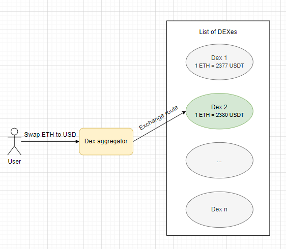
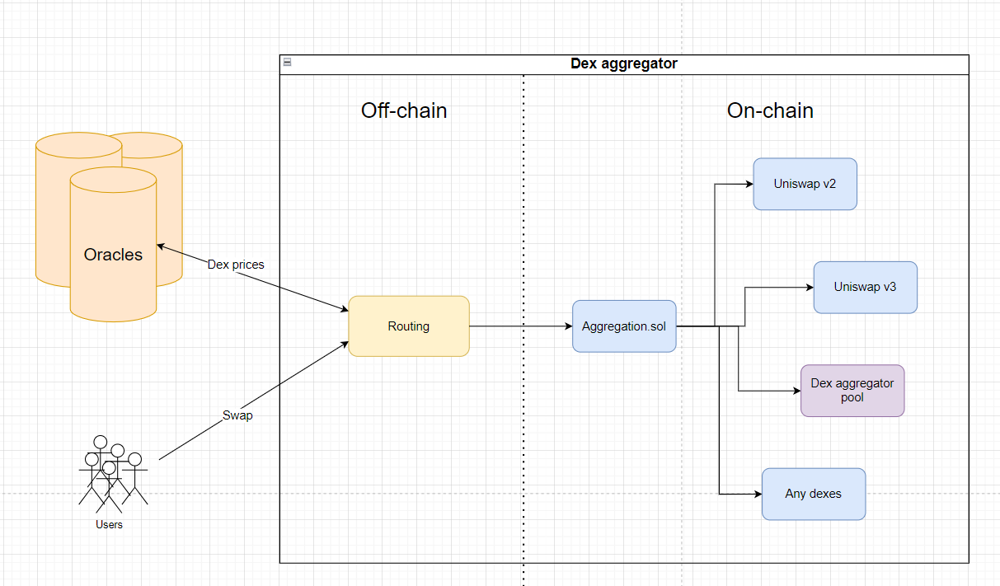
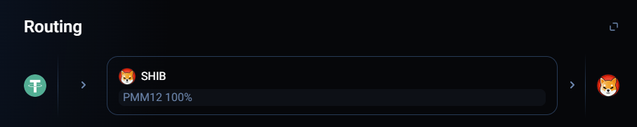
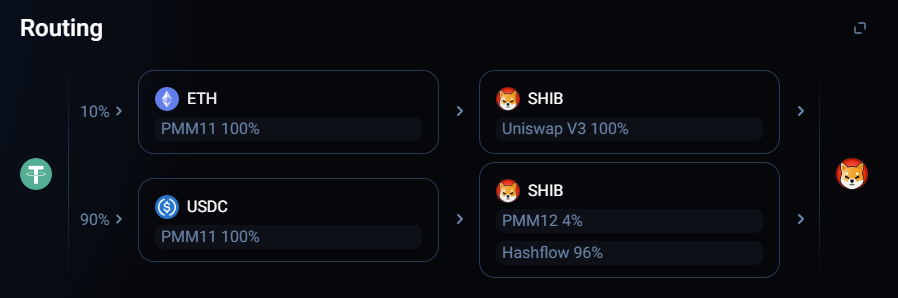
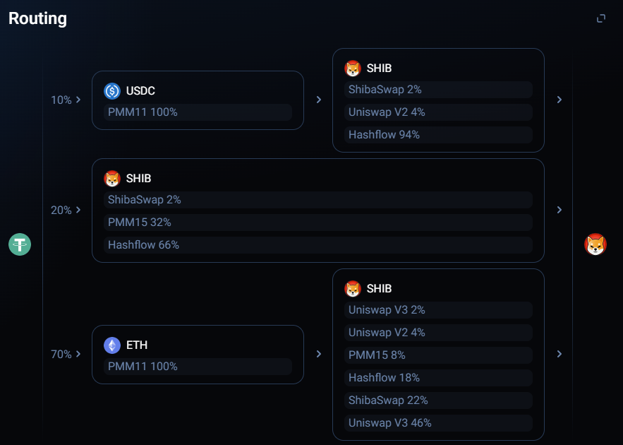

# DEX aggregators

**Автор:** [Павел Найданов](https://github.com/PavelNaydanov) 🕵️‍♂️

_Опр!_ **Агрегатор DEX** - это тип криптовалютной биржи, которая предоставляет пользователям доступ к ликвидности на нескольких [DEX](https://www.coinbase.com/learn/crypto-basics/what-is-a-dex) (decentralized exchange). По сути, это посредник, который служит связующим звеном между пользователем и протоколами, предлагающими свою ликвидность. Поэтому можно встретить другое название - **агрегатор ликвидности**. Совместное использование ликвидности с нескольких DEX предлагает пользователям получать наиболее выгодные ставки для обмена активов в одном интерфейсе.

Об **агрегаторах DEX** заговорили с момента появления первого протокола [1inch](https://1inch.io/) в 2019 году. Сергей Кунц и Антон Буков создали первую версию протокола в рамках хакатона ETHNewYork за 18 часов.

_Важно!_ Основная задача агрегатора DEX — найти наилучшую цену при обмене актива в кратчайший срок.

## Как агрегатор работает?

Как и в случае с обычными dex, пользователю необходимо использовать [кошелек](https://academy.binance.com/en/articles/crypto-wallet-types-explained) для работы с агрегаторами. С помощью кошелька необходимо подписывать транзакции при обмене одного актива на другой.

Агрегаторы являются **единой точкой входа** для пользователей, которым необходимо обменять один актив на другой с наибольшей выгодой. Для определения наиболее выгодной сделки агрегаторы должны уметь правильно выбирать нужную dex.

Для пользователя, процесс обмена активов через агрегатор выглядит следующим образом:

1. Пользователь отправляет **запрос на обмен** активов агрегатору.
2. Агрегатор **опрашивает** DEX с которыми он работает на предмет **цены** обмена.
3. Агрегатор **рассчитывает** наиболее **выгодный маршрут** обмена (выбор конкретной биржи для обмена или даже цепочки бирж)
4. Агрегатор **подготавливает маршрут**, как неподписанную транзакцию, ожидающую одобрения пользователя.
5. Пользователь **утверждает** маршрут и **подписывает** транзакцию.
6. **Смарт-контракт** агрегатора атомарно **выполняет** подписанную транзакцию, принимая первый актив пользователя.
7. Пользователь **получает** второй (желаемый) **актив** на свой кошелек.

Схематично, обмен эфира на стейблкоин USDT:



Пользователь планирует обменять ETH на USDT. Dex агрегатор запрашивает стоимость актива USDT на всех децентрализованных обменниках и выбирает с наиболее выгодной ценой. В нашем случае, это `Dex 2`, которы вернет больше USDT, чем другие DEX, с которыми работает агрегатор. Поэтому фактический обмен ETH на USDT произойдет на `Dex 2`.

Процесс построения маршрута является ключевым и самым сложным в агрегаторе. Алгоритм маршрутизации должен учитывать стоимость, ликвидность, объем торгов каждой dex, транзакционные издержки и тому подобное.

Под капотом, агрегатор может быть устроен следующим образом:



Согласно схеме, можно выделить жизненный цикл обмена активов через агрегатор:
1. **Запрос на обмен.** Пользователь отправляет данные для обмена: адреса двух токенов, сумма для списания первого токена, желаемая сумма второго токена (токен, который будет получен взамен) и тому подобное.
2. **Маршрутизация.** Магия по поиску оптимального пути обмена происходит в модуле `Routing`, который реализован off-chain (за пределами сети). Именно этот модуль принимает первоначальный запрос пользователя на обмен активов и определяет наиболее оптимальный маршрут. Для этого может потребоваться получение актуальных цен с оракулов или напрямую с децентрализованных бирж. Зависит это от ситуации и вариантов реализации. Интеграция агрегатора с каждой новой биржей может требовать разные концепты взаимодействия.
3. **Отправка транзакции на контракт `Aggregation.sol`**. Этот контракт протокола (для серьезных агрегаторов - это набор контрактов) проводит обмен активов на децентрализованной бирже, которая выявлена модулем `Routing`, как биржа для получения наибольшей выгоды.
4. **Обмен активов**. Физический обмен активов происходит непосредственно на контрактах выбранной децентрализованной биржи.

Часто, для извлечения максимальной прибыли, агрегаторы, помимо поиска выгодной dex, реализуют вспомогательный функционал:
- **Распределение суммы обмена между несколькими dex**. Часть суммы можно обменять на одной dex, часть на другой. Тем самым можно извлечь наибольшую выгоды по сравнению с обменом всей суммы на одной dex.
- **Создание собственной ликвидности**. Это может быть поддержка пулов ликвидности на существующих dex или создание собственных пулов. Подобный подход помогает снизить [проскальзывание цены](https://academy.binance.com/en/articles/impermanent-loss-explained) и риски агрегатора по формированию конечной цены.

_Важно!_ Можно подумать, что для интеграции каждой децентрализованной биржи агрегатору необходимо реализовывать новый функционал (новые смарт-контракты, новый код). Однако, все не совсем так. Большинство бирж использует интерфейс, подобный [Uniswap](https://uniswap.org/) (потому что являются форками). Поэтому если контракты агрегатора умеют проводить обмены активов через Uniswap v2, Uniswap V3, то автоматически поддерживается еще целый ряд децентрализованных бирж (например [Pancakeswap](https://pancakeswap.finance/)).

## 1inch

Подробно посмотрим на этот протокол, так как он самый популярный и эффективный среди агрегаторов. На момент написания статьи TVL составляет 4,71 миллионов долларов.

[1inch](https://1inch.io/) - протокол, предлагающий доступ к сотням источников ликвидности в различных блокчейнах. Предоставляет несколько уникальных продуктов, которые позволяют проводить мгновенные или отложенные обмены активов. Более того, [1inch Fusion Mode](https://docs.1inch.io/docs/fusion-swap/introduction) предоставляет возможность для безгазовых обменов с гарантированной безопасностью от front-run атак по дефолту.

**1inch** советует использовать API для обменов. Более того, публичный API в данный момент считается устаревшим и рекомендуется следовать документации в портале разработчика.

### Routing

За маршрутизацию в протоколе 1inch отвечает передовой алгоритм обнаружения наиболее выгодных путей обмена активов. Целиком алгоритм называется [Pathfinder](https://docs.1inch.io/docs/aggregation-protocol/introduction#). Об этой части 1inch известно достаточно мало, информация не публична и документация не раскрывает всех нюансов успешности алгоритма.

Можно проследить, как будет меняться маршрут обмена токена USDT на SHIB в классическом режиме обмена.


*Обмен 10_000 USDT на токен SHIB*

> Все 100% USDT будут обменены в одном источнике ликвидности.


*Обмен 100_000 USDT на токен SHIB*

> 10% USDT будут обменены на ETH и только потом ETH на токен SHIB. 90% USDT будут обменены на USDC и только потом на SHIB, но в двух источниках ликвидности (PMM12 и Hashflow).


*Обмен 1_000_000 USDT на токен SHIB*

> Попробуй проследить самостоятельно маршрут обмена.

_Важно!_ Обрати внимание на аббревиатуру **PMM**. В 1inch это расшифровывается, как "Private Market Makers". Это организации, которые исполняют обмен пользователя, используя 1inch [API](https://1inch.io/en/page-api/). Обычно, PMM работает с CEX, но может торговать на DEX, предлагая функции [RFQ](https://en.wikipedia.org/wiki/Request_for_quotation).

Работа с PMM выглядит следующим образом:
1. Размешается ордер (ордер на обмен).
2. Протокол запрашивает PMM, готов ли он совершить обмен.
3. PMM может быть выгодно выполнить сделку, поскольку он может перепродать актив с с прибылью на другой платформе или протоколе.

### Контракт Aggregation

В отличие от маршрутизации, со смарт-контрактами гораздо легче, в публичном доступе раскрыты адреса контрактов Aggregation Protocol:
- [AggregationRouterV4](https://etherscan.io/address/0x1111111254fb6c44bAC0beD2854e76F90643097d#code)
- [AggregationRouterV5](https://etherscan.io/address/0x1111111254EEB25477B68fb85Ed929f73A960582#code)

Для удобства просмотра, эти смарт-контракты скопированы в репозиторий:
- [AggregationRouterV4.sol](./contracts/AggregationRouterV4.sol)
- [AggregationRouterV5.sol](./contracts/AggregationRouterV5.sol)

Посмотрим чуть подробнее на смарт-контракт `AggregationRouterV4.sol`.

```solidity
contract AggregationRouterV4 is Ownable, EthReceiver, Permitable, UnoswapRouter, UnoswapV3Router, LimitOrderProtocolRFQ, ClipperRouter {
    ...
}
```

Он наследуется сразу от ряда контрактов:
- `Ownable` стандартный контракт библиотеки OpenZeppelin. Добавляет владельца в контракт. Несколько функция будут доступны для вызова только владельцу.
- `EthReceiver` запрещает прямой перевод эфира на контракт.
    ```solidity
    abstract contract EthReceiver {
        receive() external payable {
            require(msg.sender != tx.origin, "ETH deposit rejected");
        }
    }
    ```
- `Permitable` позволяет заменить проверку `approve()` на проверку подписи пользователя для ERC-20 токенов, которые поддерживают функционал *permit*.
- `UnoswapRouter` отвечает за обмен на биржах, которые поддерживают интерфейс UniswapV2.
- `UnoswapV3Router` отвечает за обмен на биржах, которые поддерживают интерфейс UniswapV3.
- `LimitOrderProtocolRFQ` позволяет проводить отложенные обмены, через исполнение ордеров частично или полностью. Для этого необходимо проследить цепочку вызовов функции `fillOrderRFQ()` или `fillOrderRFQToWithPermit()`.
    ```solidity
    function fillOrderRFQ(
        OrderRFQ memory order,
        bytes calldata signature,
        uint256 makingAmount,
        uint256 takingAmount
    ) external payable returns(uint256 /* actualMakingAmount */, uint256 /* actualTakingAmount */) {
        return fillOrderRFQTo(order, signature, makingAmount, takingAmount, payable(msg.sender));
    }
    ```
- `ClipperRouter` это еще одна интеграция агрегатора с [Clipper dex](https://clipper.exchange/), которая позволяет проводить обмены активов.

В самом контракте `AggregationRouterV4.sol` реализовано три функции:
- `rescueFunds()`
- `destroy()`
- `swap()`

Функции `rescueFunds()` и `destroy()` доступны для вызова только владельцу смарт-контракта. Первая позволяет вывести ERC-20 токен (необходимо это для возврата случайно отправленных токенов на контракт или в сервисных нуждах), вторая уничтожает экземпляр смарт-контракта `AggregationRouterV4.sol`, стирая все данные из блокчейна и отправляя весь оставшийся эфир владельцу контракта.

Особый интерес здесь у нас к функции `swap()`.

```solidity
function swap(
    IAggregationExecutor caller,
    SwapDescription calldata desc,
    bytes calldata data
)
    external
    payable
    returns (
        uint256 returnAmount,
        uint256 spentAmount,
        uint256 gasLeft
    )
{
    ...

    /// Снятие токенов с вызывающего. Поддерживает permit
    if (!srcETH) {
        _permit(address(srcToken), desc.permit);
        srcToken.safeTransferFrom(msg.sender, desc.srcReceiver, desc.amount);
    }

    /// Проведение обмена
    {
        bytes memory callData = abi.encodePacked(caller.callBytes.selector, bytes12(0), msg.sender, data);
        (bool success, bytes memory result) = address(caller).call{value: msg.value}(callData);
        if (!success) {
            revert(RevertReasonParser.parse(result, "callBytes failed: "));
        }
    }

    returnAmount = dstToken.uniBalanceOf(address(this));

    ...

    /// Отправка желаемого токена получателю
    address payable dstReceiver = (desc.dstReceiver == address(0)) ? msg.sender : desc.dstReceiver;
    dstToken.uniTransfer(dstReceiver, returnAmount);
}
```

Получается, что для обмена на любой из dex, которые поддерживают интерфейсы Uniswap необходимо обращаться к коду в контрактах `UnoswapRouter` и `UnoswapV3Router`, для обменов на базе собственных пулов или других endpoints к функции `swap()`.

## Еще агрегаторы

Поверхностно посмотрим еще на парочку агрегаторов dex. Более глубокое изучение протоколов полностью на твоей совести!

### Matcha

[Matcha](https://matcha.xyz/) - агрегатор dex, созданный [0x Labs](https://0x.org/), предоставляет доступ к ликвидности в Uniswap, Aave, Sushiswap и других dex.

**Matcha** использует разделение обменов между различными источниками ликвидности в совокупности с поиском оптимального маршрута для обмена активов. Это позволяет протоколу реализовать защиту от проскальзывания (когда ожидаемая цена обмена отличается от фактической) и воздействия на цену (когда твой обмен сильно меняет стоимость актива на бирже).

Еще одна уникальная возможность, отличающая протокол заключается в возможности делать cross chain swaps.

_Важно!_ Matcha полностью построена на API протокола [0x](https://0x.org/docs/introduction/introduction-to-0x).

### Paraswap

[Paraswap](https://www.paraswap.io/) - это агрегатор dex, который собирает ликвидность с основных децентрализованных бирж, абстрагирую обмены активов с целью облегчения взаимодействия для конечных пользователей.

Этот протокол аналогично match разделяет большие суммы при обмене на нескольких dex. Предлагается дополнительный функционал по управлению капиталом. Можно взаимодействовать со смарт-контрактом Aave или Compound для обмена залога (например cDai обменять на aDai).

_Важно!_ Протокол позиционирует себя, как агрегатор ликвидности для обменов, в которых участвует большая сумма. Однако, в случае с маленькими суммами, paraswap тоже может быть полезным. Можно ознакомиться с [ключевыми моментами](https://doc.paraswap.network/getting-started/faq/paraswap-gas-costs-and-small-trades).

Еще больше преимуществ [тут](https://doc.paraswap.network/understanding-paraswap/edge).

## Преимущества

Я думаю преимущества агрегаторов dex уже должны складываться в сознании читателя, я опишу их ниже.

### Выгодная цена

Агрегаторы DEX предоставляют пользователю доступ к наиболее выгодным ценам обмена среди множества децентрализованных бирж. Например, если в произвольном моменте выгода обмена на SushiSwap выше, чем на Uniswap, то обмен будет проведен через Sushiswap. Если мы говорим о сравнение стоимости на десятке децентрализованных бирж, то делать это вручную затратно, требует времени, за которое ситуация на рынке может кардинально измениться.

### Одновременный доступ к нескольким DEX

Простой интерфейс с **единой точкой входа** для обменов на нескольких источниках ликвидности позволяет получить доступ к большей ликвидности. Например, если на Uniswap не хватает токена X для обмена, то агрегатор может провести обмен токена X на нескольких dex по частям, разделяя сумму обмена. Более того, агрегатор может использовать и централизованные источники ликвидности, строя сложные маршруты, что позволяет еще больше достигать эффективности обмена.

Подобный подход **минимизирует влияние** на стоимость актива в конкретном источнике ликвидности и уменьшает **проскальзывание цены** для пользователя. Проскальзывание минимизируется за счет обмена через несколько источников ликвидности и анализа глубины рынка. Например, если обмен на Uniswap существенно повлияет на стоимость актива, то большая вероятность, что боты попытаются провести атаки, типа front-run, для извлечения собственной выгоды, что негативно скажется на фактической стоимости обмена пользователя. С агрегатором подобная вероятность снижается, так как как используется множество источников ликвидности.

## Риски

Организация работы агрегатора нескольких источников ликвидности или его разработка так или иначе должны решать следующие проблемы:

- **Оракулы**. Агрегаторы DEX часто опираются на цены из оракулов. Неточная информация о ценах может негативно влиять на процесс ценообразования и обмена активов. Скорость с которой данные поставляются в сеть может порождать сложности в определение наилучшей цены обмена в моменте.
- **Низкая ликвидность на DEX**. Агрегаторы DEX хоть и могут менять биржи и дробить обмены на части, но все же они зависят от ликвидности базовых децентрализованных бирж. Низкая ликвидность на любой из бирж может существенно затруднить проведение обменов. Агрегатор всегда должен быть готовым заменить биржу или разделить обмен.
- **Регуляторы**. Считаю, что это постоянный риск, с которым может столкнуться агрегатор. Например, начиная c 2021 (технически с 2022) года 1inch [заблокировал](https://crypto.news/dex-aggregator-1inch-restricts-us-focused-platform/) возможность использования сервиса для граждан США, чтобы не попадать под санкции комиссии по ценным бумагам. На момент написания статьи, в "[Terms of use](https://1inch.io/assets/1inch_network_terms_of_use.pdf)", это ограничение присутствует.
- **Сложность**. Сложность, как в реализации, так и в использовании. Off-chain механизм маршрутизации должен работать безукоризненно и быстро, что не так просто реализовать, когда необходимо поддерживать множество блокчейнов. Для пользователей это может оказаться тоже более сложный инструмент, чем обычный dex, что приведет к непопулярности агрегатора.

Если какой-то из вышеописанных аспектов будет не решен или решен плохо, то он может негативно повлиять на агрегатор ликвидности, вплоть до его полного краха.

## Заключение

Агрегаторы DEX являются прекрасным решением для повышения ликвидности, удобства и эффективности децентрализованной торговли.

## Links

1. [What Is DEX Cryptocurrency Aggregator](https://altfins.com/knowledge-base/dex-cryptocurrency-aggregator)
2. [Fundamentals: What is a DEX aggregator?](https://0x.org/post/what-is-a-dex-aggregator)
3. [1inch](https://1inch.io/)
4. [Matcha](https://matcha.xyz/)
5. [Paraswap](https://www.paraswap.io/)