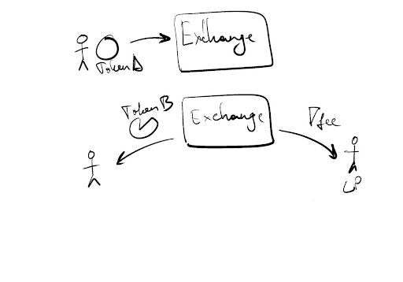
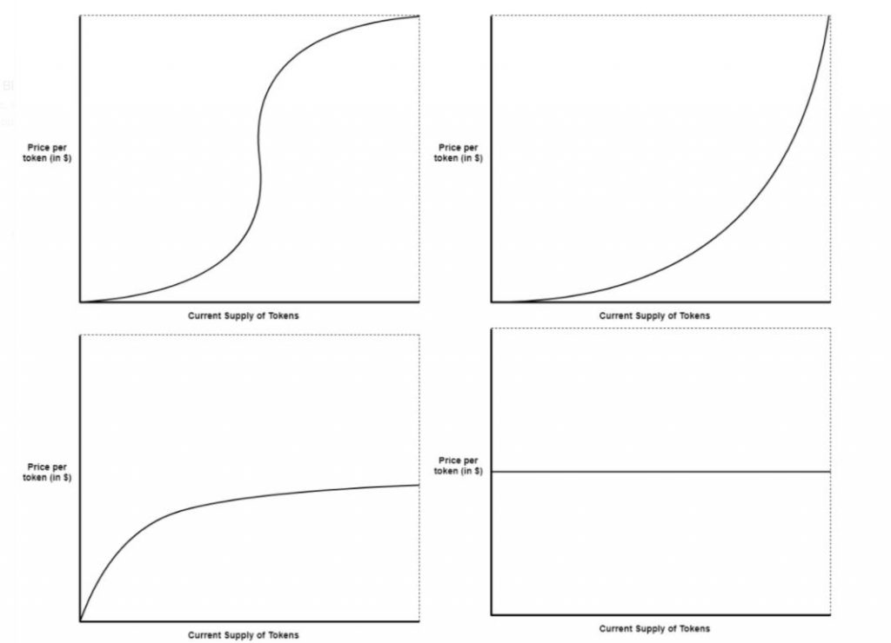
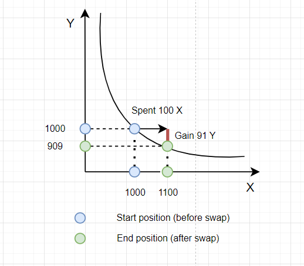
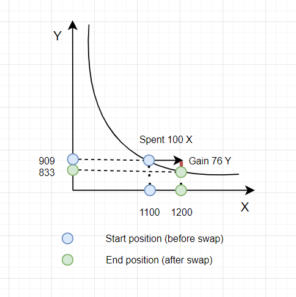

# AMM - Automated Market Maker

> Автоматизированного маркет-мейкера можно представить в виде умного компьютера, который всегда готов посчитать стоимость одного актива относительного другого.

**Автоматизированный маркет-мейкер(AMM)** — это тип децентрализованного обменника (DEX), который использует математическую формулу для оценки стоимости активов. Технически - это протокол, реализованный при помощи группы смарт-контрактов, которые регулируют процесс обмена токенами между пользователями.

_Важно!_ AMM действительно заняли свою нишу в пространстве **DeFi** благодаря простоте и удобству использования.

## Пул ликвидности(LP)

Когда ты хочешь совершить какое-либо действие с **DEX на AMM**, то ты вынужден взаимодействовать со смарт-контрактами обменника.

_Важно!_ О взаимодействии с AMM можно думать, как о взаимодействии со смарт-контрактом(P2C). Сделки происходят между пользователями и контрактами.

Токены для обмена не могут взяться из воздуха. Им необходимо где-то хранится в резерве на смарт-контракте(т.к. пользователь взаимодействует со смарт-контрактом). То есть, если ты хочешь поменять токен USDT на ETH, то ETH уже должен быть в достаточном количестве на смарт-контракте.

**Пул ликвидности** и есть абстрактное название места, где хранятся активы внутри смарт-контракта, то есть буквально, это большая куча, где лежат токены. Это новое понятие в криптоиндустрии и оно не имеет аналогов в традиционной финансовой сфере.

**Откуда же берутся токены в пуле ликвидности?** Эти токены поставляются пользователями, которые готовы предоставить свою ликвидность за вознаграджение. Поэтому смарт-контракт в DEX объединяет вложенные активы сразу множества пользователей. И именно поэтому он называется **пулом**. Все пользователи протокола могут вложить в него активы.

_Важно!_ Принято записывать не количество вложенных активов, а долю, которую они составляют в пуле относительно других вложенных активов. Это сделано для упрощения расчета вознаграждения.

Пользователь может забрать свои активы обратно полностью или частично в любой момент.

## Поставщик ликвидности

Когда ты внесёшь свои активы в пул, ты внесёшь ликвидность. И тебя будут называть **поставщиком ликвидности**. Ты получишь специальные токены взамен, по-которым будет определяться твоя доля вложенных средств в пул.

Чем больше активов ты вкладываешь в пул, тем больше специальных токенов получаешь. Они называются **lp-токенами**.

Как **lp-токены** работают? Фишка в том, что пул постоянно растёт за счёт взимания комиссии с каждого обмена. Это делается прямо внутри протокола на смарт-контрактах. Если увеличивается пул ликвидности, то и увеличивается доля поставщика.

То есть пул ликвидности принадлежит обменнику. Обменник берёт комиссию за обмен токенов. Эта комиссия добавляется к пулу, тем самым увеличивая его общую ликвидность. Некоторые DEX дополнительно удерживают часть комиссии в качестве сервисного налога для себя за предоставление децентрализованной площадки обмена активов.

В целом этот процесс выглядит так:

1. Пользователь DEX хочет обменять **токен А** на **токен Б**.
2. Он отдаёт в пул ликвидности **токен А**. Взамен получает возможность забрать **токен Б**.
3. Пользователь платит комиссию за обмен токенов и получает немного меньше **токенов Б**. Комиссия остаётся в пуле.
4. Собранная комиссия распределяется среди поставщиков ликвидности пропорционально вложенным им активам.

То же самое можно представить схематично.



## Математика AMM

Пришло время ответить на вопрос: "Как рассчитывается стоимость актива при обмене?"

Для расчёта используются математические формулы. Это происходит в автоматическом режиме: специальный алгоритм рассчитывает цену актива относительно других активов в пуле. В этом и заключается основная цель **АММ**.

Существуют разные математические формулы для расчёта стоимости активов. Но основных переменных в этих формулах всего три: **X**, **Y** и **K**.

**X** – это суммарная ценность (количество актива \* цену актива) первого актива в пуле ликвидности,

**Y** – это суммарная ценность (количество актива \* цену актива) второго актива в пуле ликвидности,

**K** – это константа, которая всегда сохраняет одно и то же значение, показывая соотношение токенов в пуле ликвидности. Она также называется инвариантой.

Давай рассмотрим популярные виды **AMM**, основанные на математических формулах.

- **маркет-мейкер на основе постоянного значения произведения**

Формула X \* Y = K
- **маркет-мейкер на основе постоянного значения суммы**

Формула X + Y = K
- **маркет-мейкер на основе постоянного среднего значения**.

- **гибридный маркет-мейкер**.

Как ты заметил, я не показал формулы к двум последним примерам. В рамках статьи они нам не важны, да и довольно сложны. Мы будем разбирать **AMM** на основе постоянного значения произведения. Это наиболее популярный подход.

Больше подробной информации про математические формулы **AMM**, можно прочитать [в книге «How to DeFi Advanced»](https://landing.coingecko.com/how-to-defi/).

## Bonding curve

Математические формулы можно отобразить в графическом виде. Такое отображение становится более простым для понимания. Для этого используют bonding curve.

🏓 Потренируемся. Рассмотрим кривые грфиков, которые показывают соотношение количества токена (**supply**) к его цене (**price**). Кривые линии на графиках показывают изменение цены токена относительно его количества.



- **Sigmoid curve** (сигмовидная). Вверху слева.
- **Quadratic curve** (квадратичная). Вверху справа.
- **Negative exponential curve** (отрицательная экспоненциальная). Внизу слева.
- **Linear (non-increasing) curve** (линейная, невозрастающая). Внизу справа.

Выбор математической формулы напрямую связан с бизнес моделью проекта. Рассмотрим, как различные модели будут влиять на бизнес-логику.

Предположим, существуют пользователи, которые готовы приобрести токены. Будем отталкиваться от цели нашего импровизированного проекта.

**Цель: обменник должен вознаградить первых покупателей**.

> Используем сигмовидную или квадратичную кривую связи. Это позволит первым покупателем приобрести токен за небольшую стоимость. Дальше цена токена будет расти. Получается, чем раньше ты купишь токен, тем больше сможешь заработать.

Такая модель работает, например, для построения альтернативных вариантов сбора инвестиций, чтобы иметь возможность создать ажиотаж при запуске. Её также можно использовать для организации аукциона и поиска максимально возможной для рынка цены на актив.

**Цель: обменник должен вознаградить первых покупателей, но не препятствовать более поздним покупкам.**

> Для достижения этой цели мы используем экспоненциальную или линейную кривую. Используя отрицательную экспоненциальную кривую, мы также, как и в первом примере, даём возможность купить токен по низкой цене и получить прибыль в дальнейшем. Но, по мере увеличения числа покупок, кривая начинает сглаживаться, а рост цены замедляется. Это говорит о том, что для поздних покупок цена не будет огромной.

Эта модель прекрасно работает для классических обменников, где необходимо поддерживать плавное изменение цены в обе стороны: как для покупки, так и для продажи активов.

**Обменник должен поддерживать стабильную цену на покупку актива.**

> Используем линейную невозрастающую кривую. В таком случае у покупателей не будет интереса в мгновенном заработке. Согласно графику стоимость остается стабильной, а это означает отсутствие убытков или прибыли.

Этот тип кривой хорошо работает для пользователей, которые ценят стабильность и надёжность своего актива. Модель подходит для обменников, которые оперируют близкими по стоимости активами, например, для обмена стейблкоинов. Если у тебя оба актива равны 1 доллару, то тебе не нужны пропорциональные изменения цены.

## Маркет-мейкер на основе постоянного значения произведения

Маркет-мейкер на основе постоянного значения произведения самый популярный. Представь формулу ```X * Y = K``` на графике. Это будет кривая, которая определяет соотношение между парой токенов в пуле ликвидности.


Эта математическая кривая является гиперболой. Посмотрев на график, ты можешь убедиться, что данный подход не позволит истощить пул ликвидности. Кривая наглядно это показывает, потому что она никогда не пересечется с осями. Это гарантия, что у пулов AMM никогда не закончатся средства. В худшем случае один из токенов достигнет цены, которая приблизится к бесконечности.

**Как это работает на практике?** Всё достаточно просто. Когда количество **X** изменяется, количество **Y** нужно скорректировать, чтобы сохранить постоянную **K**.

Мы можем представить эту логику в виде следующей формулы:

**(X + ΔX) (Y − ΔY) = X \* Y**, где

**ΔX** - количество токена **X**, которое мы отдаем в пул ликвидности,

**ΔY** - количество токена **Y**, которое мы получаем в обмен из пула ликвидности.

Отсюда мы можем высчитать **ΔY** — количество токенов, которые мы получим, если внесем **ΔX** токенов в пул:

**ΔY = Y - (X * Y) / (X + ΔX)**

### Пример

У нас есть пул ликвидности для пары токенов **X** и **Y**. Напоминаю, что это смарт-контракт, который еще называют **ликвидной парой**. В этом пуле 1000 токенов **X** и 1000 токенов **Y**. Соотношение равняется 1:1.

> Тогда **K** = **X** * **Y** = 1000 * 1000 = 1_000_000.

Мы хотим купить некоторое количество токенов **Y**, используя наши токены **X**. Мы готовы использовать 100 токенов **X** для покупки. Это будет наш **ΔX**. Теперь нам нужно вычислить, сколько токенов **Y** мы получим в обмен (это будет наш **ΔY**).

Согласно формуле:

> **ΔY** = **Y** - (**X** * **Y**) / (**X** + **ΔX**),

мы получаем:

> **ΔY** = 1000 - (1000 * 1000) / (1000 + 100) = 1000 - (1_000_000 / 1100) ≈ **91**.



Это означает, что мы получим около **91 токена Y** в обмен на **100 токенов X**. На графике синими точками обозначено количество токенов **X** и **Y** до обмена. Зелеными точками обозначено количество токенов **X** и **Y** после обмена. Красной линией обозначено количество токенов, которое мы получим за обмен.

На данный момент в пуле 1100 токенов **X** и 909 токенов **Y**. Теперь попробуем повторно купить токенов **Y**. Мы также готовы использовать 100 токенов **X** для покупки. Это наш **ΔX**. Вычислим, сколько токенов **Y** мы получим в обмен(наш **ΔY**).

Согласно формуле:

> **ΔY** = **Y** - (**X** * **Y**) / (**X** + **ΔX**),

мы получаем:

> **ΔY** = 909 - (1100 * 909) / (1100 + 100) = 909 - (999_900 / 1200) ≈ **76**.



Это означает, что мы получим около **76 токена Y** в обмен на **100 токенов X**. В пуле останется 833 токена **Y** и 1200 токена **X**. Ты должен был заметить, что наше округление повлияло на постоянную **K** и она стала равна 999_900. В рамках примера мы можем позволить себе небольшую погрешность.

_Важно!_ В первый раз мы получили 91 токен **Y**. Во второй раз мы получили 76 токенов **Y**. С каждой такой покупкой мы будем получать меньше токена **Y** согласно нашей кривой и законам AMM. Чтобы купить тоже самое количество токена **Y**, нам нужно будет больше отдавать токена **X**. Это означает, что токен **Y** будет становиться дороже относительно токена **X** с каждой покупкой. Именно таким образом, AMM гарантирует, что пул ликвидности будет сбалансирован и не будет истощен.

## Вывод

**Автоматизированные маркет-мейкеры** — основа пространства DeFi. Они позволяют практически любому создавать эффективные рынки. Работают в режиме 24/7 и не требуют поддержки. Хотя у них есть свои ограничения по сравнению с DEX на orderbook, но полезность, которую они привносят в криптовалюту, неоценима.

AMM все еще находятся на самом старте. Решения, которые мы знаем и используем сегодня, такие как Uniswap, Curve и PancakeSwap, имеют элегантный дизайн, но весьма ограничены в функциональных возможностях. Вероятно, в будущем, появится много инновационных решений для AMM. Это обязательно приведет к снижению комиссий и повышению ликвидности всего DeFi пространства.