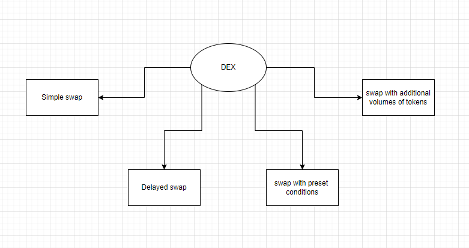
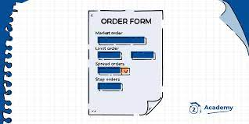
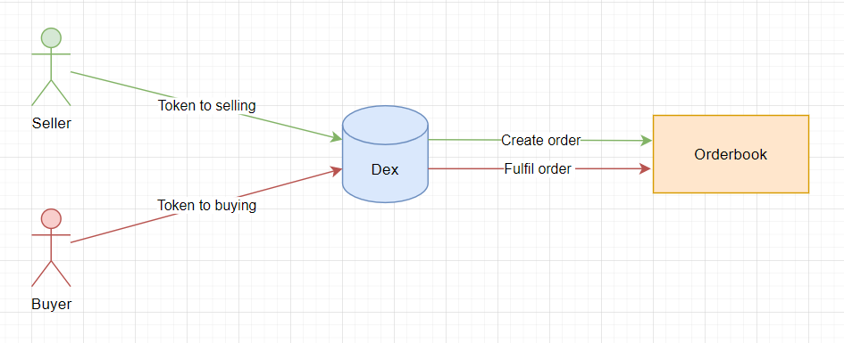
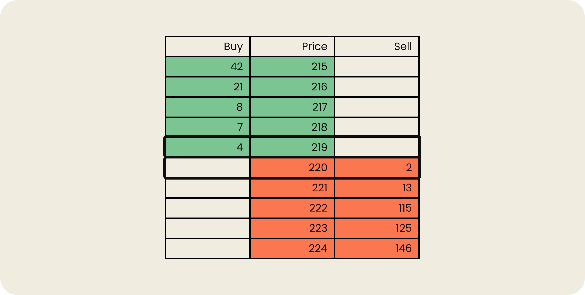
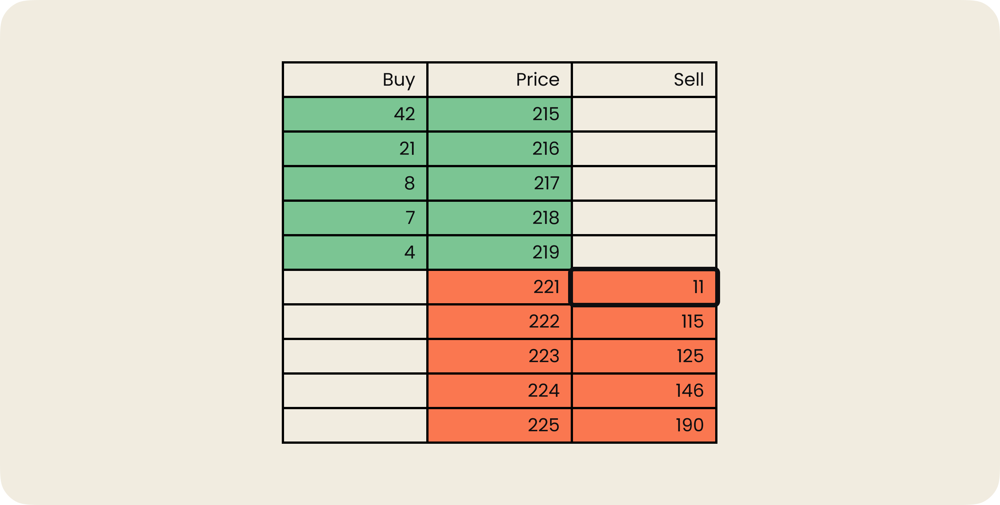
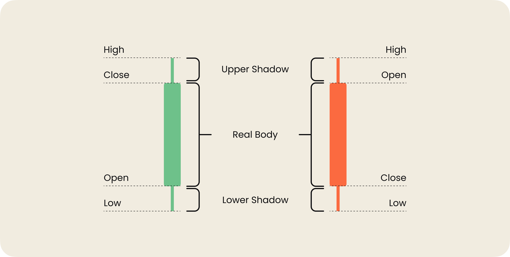
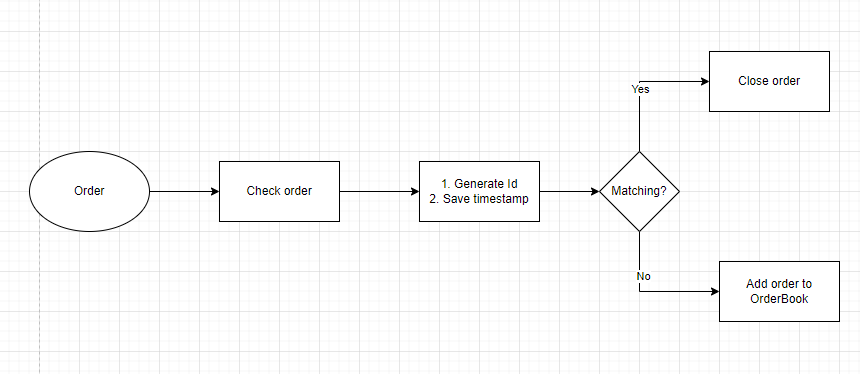
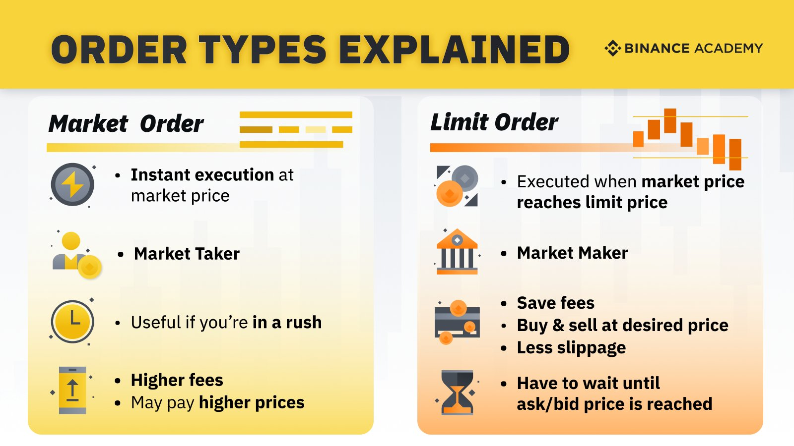

# OrderBook

Изначально **orderBook** - это подход из мира CEX и классических финансовых инструментов. Если перекладывать этот опыт на DEX, то на первый взгляд может показаться, что это нецелесообразно. Полностью **on-chain orderbook** будет требовать плату за газ при записи любых данных о сделке в сети. Это может быть достаточно дорого. Но идея реализации **orderbook** для DEX интересна с точки зрения дополнительного функционала обменника, который можно реализовать с помощью **orderbook**.

> Сначала вспомним главную идею AMM и тогда мы поймем, почему реализация orderbook для DEX тоже актуальна.

## От AMM обратно к OrderBook

Как известно, **AMM** формирует стоимость токенов при помощи математических формул. Пользователь, в свою очередь, взаимодействует со смарт-контрактом для обмена одного токена на другой(P2C).

Обычно смарт-контракт хранит в своем пуле ликвидности токены, как резервы для обмена. На основе общего количества токенов в пуле рассчитывается стоимость одного токена относительно другого по формуле ```K = X * Y```.

Пул ликвидности часто представлен двумя токенами — **ликвидной парой**. За наполнение такого пула токенами отвечают поставщики ликвидности, которые получают вознаграждение за предоставление своих токенов.

_Важно!_ Если пользователь забирает токен, количество этого токена в пуле становится меньше, а цена незначительно вырастает. Если пользователь вкладывает токен, токена становится больше, а цена незначительно падает.

😆 Забавно, не правда ли? Когда пользователь совершает обмен при помощи любого обменника, он приносит один токен и забирает другой. Это значит, что цена одного вырастет, а цена другого упадёт.

Но есть одно но. Любой пользователь стремится к максимальной выгоде.

В **DEX на AMM** пользователь всегда платит за обмен токенов столько, сколько в данный момент AMM рассчитал по формуле. Чтобы найти наибольшую выгоду, пользователю остаётся либо искать обменник с более приемлемой ценой, либо ловить момент, когда соотношение токенов в пуле изменится настолько, что цена желаемого токена будет удовлетворять запросу пользователя.

_Важно!_ Выгодный обмен зависит не только от стоимости токена, но и от количества токена. Здесь все просто: чем больше токенов ты обмениваешь по низкой цене, тем больше выгоды ты имеешь.

## Почему торговля больше, чем простой обмен?

Искать обменники с более выгодной ценой — это очень увлекательное мероприятие. А сидеть и ждать, когда цена в обменнике изменится, ещё увлекательнее. Конечно же я шучу!🙃

Хочется простой автоматизации, ведь я как пользователь знаю цену, за которую я готов купить или продать свой токен.

> Представь, что я хочу продать свой дом. Что я сделаю? Буду сидеть и ждать, когда кто-то даст объявление о покупке моего дома? Или может быть пойду на улице предлагать купить мой дом? Нет, так я никогда не поступлю! Потому что это очень хлопотно, займет кучу времени, а результат маловероятен.
> Я скорее дам объявление в газету или размещу предложение на **специальной площадке** о продаже дома. А дальше буду ждать, когда найдётся покупатель, готовый купить дом по моей цене.

Перенесём пример с продажей дома на децентрализованный обменник.

Имея хороший инструмент для обмена, я хочу делать обмены с наибольшей выгодой. Я не хочу ждать или искать обменник с подходящей ценой токена. Было бы здорово, если бы обменник умел "играть в такие игры". Я хочу получать от обменника профессиональные инструменты торговли из коробки:
 - отложенный обмен
 - обмен с дополнительными объёмами средств
 - обмен с предустановленными условиями выполнения
 - и тому подобное.



Получается, что сам **обмен токена** — это малая часть полноценной торговли, а само понятие торговли гораздо шире. Оно включает в себя целый перечень дополнительных инструментов.

К сожалению, на данном этапе развития, **DEX на AMM** не поддерживает таких профессиональных инструментов торговли. А значит об автоматизации отложенного процесса обмена с дополнительными объёмами активов не идёт и речи.

Задачей **DEX на AMM** является предоставление функционала для быстрого и удобного обмена токенов по рыночной цене. Как говорится здесь и сейчас. А главной идеей выступает отсутствие централизованного управления. Поэтому пользователь взаимодействует напрямую с контрактом обменника.

## Устройство OrderBook

Так вот, если нам нужно больше инструментов торговли, то нам нужен другой DEX, организованный на базе другого принципа. Обменник должен поддерживать возможность принимать заявки пользователей на обмен и управлять ими. Этот функционал даст нам механизм отложенных заявок.

Требования к такому DEX перекрываются моделью **orderbook**. Реализация будет сопряжена с большими сложностями, но вполне возможна. Придётся минимизировать количество транзакций, чтобы меньше платить за газ.

**DEX на основе ордербука** позволяет реализовать профессиональные инструменты торговли. Пользователь сможет их использовать, когда ему нужно будет применить что-то сложнее простого обмена одного токена на другой.

### Как orderBook работает?

Представь, что все предложения о покупке и продаже собраны в одну коробку. Эту коробку и можно назвать **orderbook**. Другими словами, это список или совокупность заявок на продажу и покупку токенов.

_Важно!_ В этом списке находятся только текущие, открытые заявки. Закрытые или архивные заявки относятся к историческим данным и ордербук о них ничего не знает.

Для начала поговорим об **ордере**.

Любая заявка на покупку или продажу в ордербуке называется **ордер**. Если создать ордер, который не выполнится сразу, он автоматически попадет в **orderbook**. Он будет оставаться там до тех пор, пока не будет выполнен или отменён.

Ордер содержит в себе информацию о покупке или продаже токена. Поэтому список ордеров обычно разбит на две группы (на продажу\на покупку) и упорядочен по цене. Технически, **ордер** — это запись в блокчейне.

Соответственно, чтобы добавить новый ордер, пользователю нужно провести транзакцию. Чтобы другому пользователю исполнить ордер, ему тоже нужно будет провести транзакцию.



Создать **ордер** может любой пользователь. Главное — наличие необходимого количество токена для исполнения этого **ордера**.

Такой процесс выглядит следующим образом.



1. Пользователь хочет купить большое количество токена в **DEX** за один раз.
2. Он видит рыночную стоимость токена и понимает, что для него в данный момент это дорого. Особенно, если учитывать, что он собирается купить сразу много.
3. В самом **ордербуке** нет соответствующего ордера на продажу токена по доступной цене для пользователя. Тогда пользователь принимает решение создать отложенный ордер, который попадет в **ордербук**.
4. Пользователь создаёт **ордер**, указывает в нём желаемую цену и необходимое количество токена.
5. После подтверждения **ордер** попадает в **ордербук** и становится доступным для исполнения любым пользователем.
6. В этот момент в **DEX** приходит продавец, который готов продать необходимое количество токена для нашего покупателя.
7. Продавец находит **ордер** покупателя и исполняет его. Он отправляет в **DEX** необходимое количество токена для покупателя.
8. Покупатель получает желаемый токен, а продавец получает взамен актив, за который токен торговался.
9. **Ордер** закрывается.

Обязательства продавца и покупателя выполнились под полным контролем DEX. Покупатель получил указанное в ордере количество токенов за указанную цену.

_Важно!_ 🚀 Технически, отличия между ордером на продажу и покупкой нет. Как в физике — всё относительно.

В примере выше пользователь был покупателем. Он создавал ордер на покупку токена. Но, если бы продавец пришел раньше покупателя со своим ценовым запросом, то ордер создал бы он сам, но уже на продажу токена. Дальше любой покупатель мог бы исполнить его ордер.

В этом плане **ордербук** является гибким инструментом и позволяет объединить в себе разные предложения о покупке или продаже токена. Главное понять, что под продажей токена подразумевается процесс передачи токена другому пользователю. А под покупкой токена подразумевается получение токена от другого пользователя.

_Важно!_ В примере, для покупателя ордер получился **отложенным**, а для продавца был исполнен в момент обращения.

### Ликвидность. Мейкеры и тейкеры

Пользователям, которые приходят в ордербук совершать операции покупки или продажи, важно, чтобы их ордера исполнялись в тот же момент или хотя бы в ближайшее время. Это показатель высокой ликвидности.

Для поддержания высокой скорости сделок необходимо, чтобы в обменнике постоянно находилось достаточное количество отложенных ордеров. Тогда любой пользователь может быстро закрыть покупку или продажу.

Поэтому должны быть пользователи, которые будут создавать достаточное количество **ордеров**. Пользователи, которые создают отложенные ордера, называются **мейкерами**. А пользователи, которые исполняют ордера незамедлительно, называются **тейкерами**.

**Мейкеры** постоянно создают отложенные ордера, тем самым увеличивая ликвидность в ордербуке. Можно сказать, что они **поставщики ликвидности**. Обычно мейкеры получают вознаграждение за предоставление ликвидности. Вознаграждение берётся из комиссии пользователей за сделки. Также мейкеры могут получать и дополнительные «плюшки», например, скидку на вывод средств из обменника.

**Мейкеры** крайне важны для развития обменника, потому что они обеспечивают ликвидность. А она, в свою очередь, привлекает пользователей и уменьшает волатильность активов.

**Тейкеры** не добавляют свои ордера в ордербук, а исполняют уже существующие. Таким образом они забирают ликвидность из ордербука. Но при этом их роль не менее важна, потому что они являются основными исполнителями ордеров.

Скорость исполнения ордеров полностью зависит от количества отложенных предложений со стороны **мейкеров** и способности **тейкеров** исполнять отложенные ордера. **Тейкеры** без **мейкеров** существовать не могут. Также как и **мейкеры** без **тейкеров**.

### Промежуточный вывод

Получается, что обменник **на основе ордербука** выступает посредником для торговли между пользователям. Обменник является точкой соприкосновения мейкеров и тейкеров. Это позволяет им успешно проводить сделку.

При этом обменник гарантирует безопасность сделки, следит за соблюдением всех оговоренных условий. Он может это делать, так как всё взаимодействие пользователей и активы проходят через него.

Безопасность гарантируется децентрализацией и прозрачностью, так как ордербук реализуется при помощи смарт-контрактов, и вся информация об ордерах хранится в блокчейне.

Интерес самого обменника, заключается во взымании комиссий за операции.

## Depth of Market and Candlestick chart

Визуально ордербук на каждой платформе может отличаться, но в целом содержит примерно одинаковую информацию. Он показывает количество ордеров на определённых ценовых уровнях.

В формате таблицы ордербук выглядит примерно вот так:



А ещё такое табличное представление часто называют **биржевым стаканом** (англ. DOM, Depth of Market). Биржевой стакан выглядит, как красно-зелёная вертикальная таблица.

Каждая строка в таблице описывает отложенный ордер. Зеленые строки — это список ордеров на покупку. Красные строки отображают список ордеров на продажу.

На картинке эта таблица статична, но в жизни она постоянно меняется, отражая рыночную активность. Другими словами, ордербук — это динамическая таблица, которая постоянно обновляется в режиме реального времени. В левом и правом столбцах отображается объём ордера, а в нашем случае — это количество токенов на продажу или покупку.

### Как читать такую таблицу?

📚 Все просто! Например, самая нижняя зеленая строка означает, что пользователь создал ордер на покупку 4 токенов по 219\$. А самая верхняя красная строка означает, что пользователь создал ордер на продажу 2 токенов по цене 220\$.

_Важно!_ Кстати, это один из самых универсальных инструментов для анализа рынка. Он находит применение практически во всех стратегиях и торговых системах. Его используют в качестве фильтра или источника сигнала для совершения сделок.

**Но что, если мне недостаточно одного ордера для исполнения?** Представим, что я хочу купить 4 токена и я согласен на цену в 221\$.

Согласно нашему биржевому стакану, в продаже у нас два токена по цене 220 и 13 токенов по цене 221\$. Я куплю 2 токена по наиболее выгодной цене. Ордер на продажу двух токенов полностью исполнился и он может быть закрыт.

Ещё два токена я покупаю по цене 221\$. При этом ордер на продажу по цене 221\$ исполнен частично. Это значит, что биржевой стакан покажет нам, что токена по цене 221\$ осталось 11 штук. Сам биржевой стакан будет выглядеть следующим образом.



### Candlestick chart

Ордербук тесно связан с ещё одним инструментом. **График свечей** (candlestick chart) представляет полезную информацию по текущему и прошлому состоянию рынка.


На графике можно увидеть направление движения цены в единицу времени. Например, если цена упала через минуту, ты можешь увидеть насколько. Визуально это представлено при помощи зелёных и красных столбиков — **свечей**.

Свеча состоит из разных элементов, поэтому давай познакомимся с ней поближе.



Каждая отдельно взятая свеча отображает следующую полезную информацию:
1. Цена открытия.
2. Цена закрытия.
3. Самая высокая цена.
4. Самая низкая цена.

Основной прямоугольник в свече называется **реальным телом** (real body). Он показывает диапазон между ценой открытия и ценой закрытия в выбранный период времени.

Линии снизу и сверху реального тела называются **тенями** или **фитилями** (shadows or wick). Каждая тень обозначает самую высокую или самую низкую цену, предложенную в выбранном периоде времени.

Когда цена закрытия выше, чем цена открытия, тогда тело обычно окрашено в **белый** или **зеленый** цвет. Но когда цена закрытия ниже цены открытия, то тело обычно окрашено либо в **черный**, либо в **красный** цвет.

Вместе с ордербуком график свечей используют для отражения изменения цены токена в момент времени. Например, чем длиннее тело, тем больше предложений продавцов или покупателей. А очень короткое тело указывает на очень небольшое движение цены в этот период времени.

## Matching engine

А как пользователь ориентируется в биржевом стакане и графике свечей, когда ордеров становится слишком много?

Ответ прост. Пользователю необязательно ориентироваться, ему достаточно создать свой ордер, а обменник автоматически проведёт сопоставление ордера пользователя с отложенными ордерами.

Чтобы сопоставить ордеры нужен специальный инструмент. Этот инструмент называется **системой сопоставления** (matching engine). С его помощью обеспечивается поиск и выполнение ордеров. Это своего рода мозг обменника, который принимает основные решения по сделке.

Механизм сопоставляет новые ордера с уже хранящимися в ордербуке.

При обработке созданных ордеров обменник выполняет следующие шаги:
1. Проверяет правильность данных в созданном ордере.
2. Создаёт уникальный номер ордера и отметку времени его создания.
3. Если в ордербуке уже есть подходящий ордер, то созданный ордер будет исполнен мгновенно.
4. Если ордер не может быть исполнен, то он попадает в ордербук и ждёт походящего ордера, чтобы быть исполненным.

Этот пошаговый алгоритм можно представить в виде схемы.



_Важно!_ Согласно базовому принципу блокчейн технологии, блоки создаются через определенные промежутки времени. Поэтому сопоставление ордеров происходит с некоторой периодичностью. Если некоторые блоки были пропущены, то в момент сопоставления всех открытых ордеров, ордера, полученные в прошлом, также пройдут через механизм сопоставления. В этом заключается главное отличие работы системы сопоставления в DEX от CEX.

## Типы ордеров

В обменнике, основанном на ордербуке, можно производить сделки двух видов: купить токен и продать токен. Эти сделки осуществляются с помощью **ордеров**, которые создают пользователи.

Я уже говорил, что ордера бывают немедленного исполнения и отложенные. Как во всём этом не запутаться? Сейчас разложим все по полочкам. Все ордера можно разделить на две большие группы:
1. Рыночный ордер
2. Лимитный ордер

### Рыночный ордер

Этот ордер подходит для немедленной покупки или продажи по наиболее выгодной цене. Для его исполнения требуется ликвидность биржевого стакана, так как он исполняется на основе лимитных ордеров, уже размещенных в **ордербуке**.

Если ты захочешь немедленно купить или продать токен по текущей рыночной цене, лучшим вариантом будет создание рыночного ордера.

> Предположим, я хочу купить 2 ETH. Рыночная цена эфира составляет 1600 USDT. Это значит, что в данный момент 1 эфир стоит 1600 USDT. Я готов заплатить эту цену и не хочу ждать снижения цены. Поэтому я могу воспользоваться рыночным ордером.
>
> Я создаю ордер и указываю, сколько я готов купить. Система сопоставления находит для меня подходящий отложенный ордер. Мой рыночный ордер исполняется в тот же момент.
>
> С моего кошелька списывается нужное количество USDT. Взамен я получаю на кошелек купленные эфиры.

### Лимитный ордер

Этот ордер подходит, когда нужна определенная цена покупки или продажи. Чтобы разместить **лимитный ордер**, необходимо выбрать максимальную или минимальную цену покупки или продажи токена. Далее ордер помещается в ордербук и выполняется, только если рыночная цена достигнет или превысит лимитную.

> Например, пользователь хочет продать 2 ETH по цене 1600 USDT. В данный момент ETH стоит гораздо меньше 1600 USDT. Пользователь создаёт отложенный ордер на продажу 2 ETH. Ордер отправляется в ордербук.
>
> Через некоторое время рыночная цена меняется и становится равной 1600 USDT. Тут и прихожу я из примера выше с рыночным ордером. Я готов купить по нынешней рыночной цене. Система сопоставления определяет нас, как наиболее подходящих друг другу покупателя и продавца.
>
>Мой рыночный ордер и отложенный ордер другого пользователя закрываются, потому что его ордер на продажу 2 ETH был также выполнен. В результате я имею на счету 2 ETH. Другой пользователь имеет на счету 3200 USDT. Отложенный ордер удаляется из биржевого стакана.



### Виды лимитных ордеров

Лимитные ордера также делятся ещё на несколько групп. Ниже мы приведём основные их виды.

1. **Stop order**. Это ордера, исполнение которых отложено до выполнения заданных условий. Например, таким условием может быть падение рыночной цены токена на 2%. Стоп-ордера можно разделить ещё на два вида:
- стоп-лосс,
- тейк-профит.

**Стоп-лосс** помогает фиксировать допустимые потери, при которых ордер закроется автоматически. Это поможет минимизировать потери токена в цене.

_Важно!_ Выставление стоп-лосс на 10% для токена, стоимость которого меняется на 30% за неделю, может привести к срабатыванию стоп-лосс. После этого цена продолжит рост, но заработать не получится, так как сделка уже закрылась с убытком.

> Представим, что мы купили 1 ETH по цене 1000 USDT. Нам нужно минимизировать риски потери актива на падении цены эфира. Мы можем заранее определить допустимую для нас нижнюю планку стоимости эфира, например, 900 USDT.
>
> Мы создадим для этого стоп-лосс ордер. Это будет говорить о том, что волатильность курса до 10% относительно цены покупки нас устраивает. Как только рыночная цена достигнет 900 USDT за 1 ETH, лимитный ордер будет моментально исполнен и мы выставим на продажу наш 1 ETH. Ближайший желающий тейкер, который захочет 1 ETH по цене 900 USDT, сможет исполнить наш ордер.

**Тейк профит** действует полностью наоборот: его выставление говорит о том, что закрытие ордера произойдёт при достижении большей цены. Это ограничивает потолок заработка.

> В этом случае всё наоборот. Я приобрёл 1 ETH по цене 1000 USDT. И я хочу заработать 100 USDT. Это составит 10%. Я выставляю тейк профит на 10%. И, если эфир станет стоить 1100 USDT, то ордер будет предложен к исполнению для тейкеров. А я, при его исполнении, смогу заработать 100 USDT.

Получается, я владею мощным инструментом автоматизации, который не требует моего постоянного присутствия и позволяет минимизировать риски и увеличивать прибыль.

_Важно!_ В реальной жизни стоп-ордера можно использовать, как на продажу, так и на покупку. Также можно использовать тейк-профит и стоп-лосс вместе. Это позволит обезопасить наши потенциальные потери и автоматизировать процесс извлечения выгоды.

2. **OCO-ордера** (one-cancels-the-other).
Этот тип ордера объединяет в себе **стоп-лосс** и **тейк-профит**. Разница в том, что один ордер содержит в себе два условия одновременно.

> Представим, что мы купили 1 ETH по цене 1000 USDT. Мы хотим получить выгоду в 10% автоматически и обезопасить себя от падения стоимости эфира. Мы создаём ордер, в котором прописываем два условия. Это условие роста цены на 10% и падения цены на 10%. При достижение любого из этих условий, ордер будет автоматически переведён на исполнение.

3. **GTC-ордера** (good til canceled).
Этот тип ордера действует до его отмены или исполнения. Обычно обменники используют его по умолчанию, когда пользователь создаёт лимитный ордер.

Здесь очень важно знать, что при создании ордера часто указывается время его жизни. Это необходимо, чтобы биржевой стакан не переполнился бесполезными лимитными ордерами. Такое переполнение будет дополнительно создавать нагрузку на систему сопоставления.

> Представим, что мы хотим купить эфир ниже рыночной стоимости. Создаем GTC-ордер, выставляем время жизни. Например, 1 сутки. Дальше ждём своего тейкера, который должен исполнить ордер. Если по истечении суток ордер не будет исполнен, то он будет переведён в архивные и автоматически будет считаться закрытым. Такой ордер больше не будет учитываться системой сопоставления.

4. **IOC-ордера** (immediate or cancel).
Этот тип ордера должен быть исполнен мгновенно, почти как рыночный. Разница в том, что если ордеру не хватает предложения согласно его заявке, то он исполняется частично и закрывается.

> Я создам IOC-ордер на покупку 2 ETH по цене 1500 USDT. Но я помню, что могу получить не полную сумму. Если в биржевом стакане сейчас есть предложение о продаже только 1 эфира по цене 1500 USDT, ордер будет всё равно закрыт мгновенно и я получу только 1 ETH.

5. **FOK-ордера** (fill-or-kill).
Этот тип ордера является оппозицией IOC-ордеру. Ордер также должен быть исполнен мгновенно, но если ордеру не хватает предложения, то он аннулируется, то есть не исполняется и закрывается полностью неисполненным.

> Создам FOK-ордер на покупку 2 ETH по цене 1500 USDT. При нехватке предложений о продаже по этой цене, мой ордер будет закрыт мгновенно, и я не получу эфира вообще.

## Реализация простого OrderBook

В самом базовом исполнении контракт SimpleOrderBook должен уметь:

- создавать ордер на продажу токена и фиксировать всю важную информацию об этом ордере
- выдавать информацию об ордере по его ID
- продавать токен, который выставлен на продажу и при этом закрывать такой ордер полностью, если выкуплены все токены
- отменять ордер. Удалять всю информацию об ордере по его ID
- бросать соответствующие события при изменении состояния контракта и обрабатывать ошибки, которые могут возникнуть из-за некорректно переданных данных

Реализацию можно посмотреть [тут](./contracts/SimpleOrderBook.sol).

## Вывод

Таким образом понятие децентрализованной торговли гораздо шире и требует дополнительных инструментов. Для этого и имеет место замены AMM на ордербук.

Реализация децентрализованного обменника на основе ордербука не только сохраняет все прелести децентрализации в виде безопасности хранения средств, анонимности сделок и других. **Ордербук** предоставляет пользователю дополнительные жизненно важные, профессиональные инструменты.

Для реализации отложенных операций используются лимитные ордера. Для реализации торговли с увеличением объема торговли применяется инструмент маржинальной торговли. Но это совсем другая история!😎

_Важно!_ Ордербук позволяет сделать из простого обменника полноценную биржу с набором инструментов для профессиональной торговли.