# Подводные камни децентрализованной торговли

Я расскажу про важные аспекты децентрализованных финансов:
- проблему ценообразования при выполнение транзакций
- опасность потери прибыли для поставщиков
ликвидности
- виды атак при выполнении транзакций.

## Price slippage

Во время обмена токенов обычно происходит следующая история. Между **ожидаемой ценой** перед отправкой транзакции и **фактической ценой** после выполнения транзакции присутствует разница. Эту разницу мы называем **проскальзыванием цены (slippage).**

Да, это возможно. И, более того, эта ситуация почти всегда сопутствует любому обмену токенов.

При совершении сделки в децентрализованном обменнике ожидаемая цена может отличаться от реальной. Так происходит, потому что ожидаемая цена зависит от прошлого состояния блокчейна. А оно может меняться между созданием транзакции и её выполнением.

### Пример

Предположим у нас есть децентрализованный обменник, основанный на уже знакомом принципе AMM. В этом обменнике поставщики ликвидности создали нам **ликвидную пару**.

Алиса и Боб хотят купить 1 Eth за USDT в нашем импровизированном обменнике. Стартовая цена 1-го Eth на данный момент — 1 400 USDT. Соответственно, и Алиса, и Боб отправляют в обменник 1 400 USDT.

Наш обменник — децентрализованный, и всё ещё работает на основе блокчейн технологии, то есть атомарно, с пошаговым выполнением транзакций. Поэтому транзакция Боба выполнилась раньше транзакции Алисы. Но транзакция не просто выполнилась раньше, она ещё и повлияла на цену Eth. Он стал дороже относительно цены до момента покупки. Все по правилам AMM.

**Как это произошло?** Цена актива зависит от соотношения количества токенов в **пуле ликвидности**. Если одного токена становится меньше, то его цена незначительно возрастает относительно другого токена.

Получается, что на момент исполнения транзакции Алисы, цена Eth уже изменилась и стала равна 1540 USDT. Но, так как Алиса отправила USDT меньше, то эфира она получит тоже меньше. Другими словами, эфир стал для неё дороже. Это и есть то самое **проскальзывание фактической цены** относительно ожидаемой.

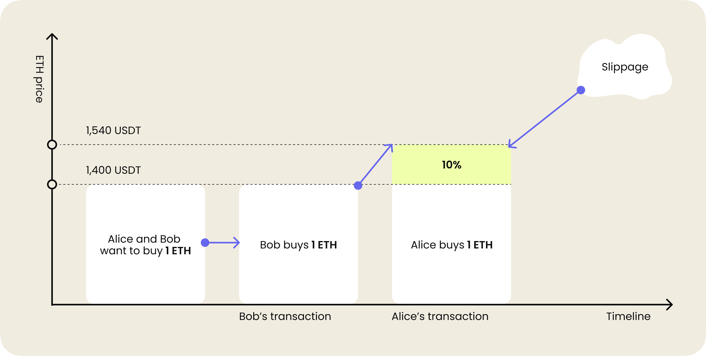

_Важно!_ Проскальзывание часто выражается в процентах и показывает, насколько может изменится цена токена.

Фактическая цена обмена (количество токена, которое ты получишь в результате) зависит не только от объёма токенов в ликвидной паре. Она зависит и от порядка транзакций на обмен в этой паре. Точнее от места твоей транзакции в ряде обменов среди других пользователей.

_Важно!_ Получается стоимость обмена зависит от порядка транзакций.

### Почему возникает slippage?

Пример Алисы и Боба позволяет нам выделить две основные причины проскальзывания: **ликвидность** и **волатильность**.

1. **Волатильность**. Или изменчивость стоимости актива за определенный промежуток времени. Любой токен подвержен изменчивости.
    - Чем больше цена токена подвержена изменению, тем чаще будет проявляться проскальзывание в промежутке между началом сделки и реальным исполнением. Причиной тому является колебание цены в ходе процесса обмена одних токенов на другие разными пользователями.

    - Каждая покупка токена увеличивает его стоимость, так как его остаётся меньше в пуле. Каждая продажа токена уменьшает его стоимость, так как теперь его в пуле больше.

    - Обычно волатильность считают в процентах за определённый промежуток времени: год, месяц или день. Волатильность токена измеряют отклонением oт среднего значения стоимости. Чeм выше отклонение, тeм выше уровень волатильности.  Получается, чем больше меняется цена токена за промежуток времени, тем больше токен волатилен.

На изображение ниже представлены три вида волатильности цены токена на временном таймлайне.
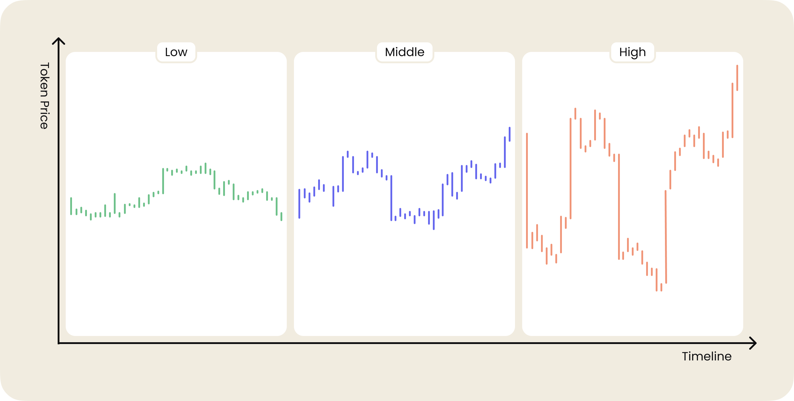

2. **Ликвидность**. Некоторые токены торгуются реже из-за низкой популярности или новизны по сравнению с другими токенами. Это значит, что в пулах недостаточно ликвидности для поддержания стабильной цены. Поэтому покупка большого количества токенов может существенно повлиять на его текущую стоимость.

Давай предположим, что мы хотим приобрести 5 Eth.

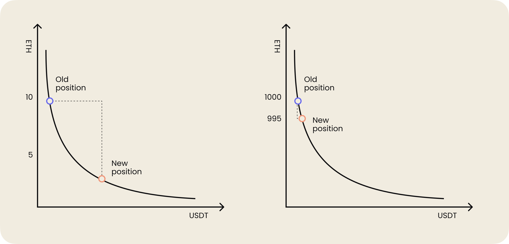

> **Левый график**. Ликвидность низкая. В пуле осталось 10 Eth. График показывает значительное смещение по кривой соотношения количества токенов. Покупка всего 5 Eth сильно изменит стоимость оставшихся 5 Eth в пуле. Согласно математике AMM, опустошить пул невозможно. Просто оставшиеся эфиры будут стоить очень и очень дорого.

> **Правый график**. Ликвидность высокая. В пуле — 1000 токенов. Согласно графику видно, что покупка 5 Eth окажет гораздо меньшее влияние на количество эфира в пуле. Соответственно, стоимость Eth поменяется незначительно. То есть, цена изменится меньше, если кто-то нас опередит и тоже купит 5 Eth.

_Важно!_ Чем больше ликвидность, тем меньше мы подвержены проскальзыванию цены. Ожидаемая цена будет практически совпадать с фактической.

### Как Uniswap демонстрирует slippage?

Итак, я рассказал про причины, которые приводят к проскальзыванию цены. С проскальзыванием работают следующие закономерности:

1. Чем больше токенов участвует в сделке, тем больше мы влияем на цену.
2. Чем меньше токенов в пуле ликвидности, тем больше проскальзывание.

Подтвердить эти закономерности можно самостоятельно [в приложении Uniswap](https://app.uniswap.org/#/swap). Перейди по ссылке, выбери токены для обмена и поиграйся с количеством токена, который ты готов отдать в пул ликвидности.

В дополнительных опциях свопа есть параметр **"Price impact"**. Он наглядно показывает влияние цены сделки на стоимость покупаемого токена.

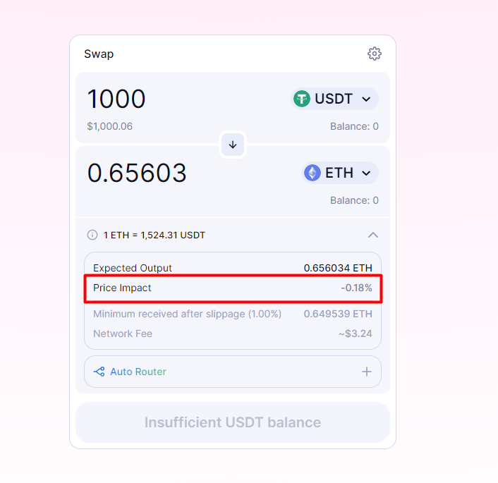

Попробуем обменять токен USDT на ASM. [Токен ASM](https://coinmarketcap.com/currencies/assemble-protocol/) поддерживает платформу Assemble. На этой платформе пользователи и продавцы могут копить и тратить призовые баллы. Поставщики таких баллов могут проводить рекламные акции, предоставляя преимущества в виде скидки для держателей токена ASM.

Никакой рекламы, я возьму этот токен только для наглядного примера. 😉

В модальном окне свопа, Uniswap заблаговременно предупредит меня о том, что моя сделка окажет критическое влияние на цену токена. Это влияние более 91%. В данном случае это значит, что мы выкупим большую часть ликвидности токена ASM.

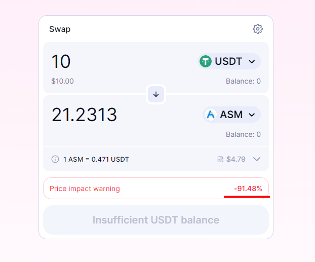

### Хорошая новость

_Важно!_ Проскальзывание — это изменение цены токена в момент сделки и оно может быть не только отрицательным.

Проскальзывания бывают двух видов: **положительные** и **отрицательные**. Это значит, что ожидаемая цена может измениться в обе стороны, быть выше или ниже ожидаемой.

_Важно!_ Если фактическая цена исполнения **ниже**, чем ожидаемая цена сделки на покупку, это считается **положительным проскальзыванием**, поскольку даёт нам лучшую цену, чем мы изначально предполагали.

_Важно!_ Если фактическая цена исполнения **выше**, чем ожидаемая цена сделки на покупку, это считается **отрицательным проскальзыванием**, поскольку дает нам менее выгодную цену, чем мы изначально ожидали.

Это работает как для покупки, так и для продажи токена.

### Как Uniswap работает со slippage?

На некоторых обменниках ты можешь в ручном режиме установить величину проскальзывания (0.5%, 1%, 5%). Например, в децентрализованном обменнике Uniswap в настройках свопа можно указать slippage.

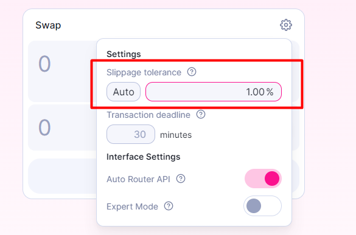

Эта величина напрямую влияет на время, необходимое для обмена токенами. Если установить низкий уровень проскальзывания, обмен может занять много времени и даже вообще не выполниться. Если установить слишком высокое значение, другой пользователь или бот может увидеть нашу отложенную сделку и опередить нас.

Для пользователя это является потенциальной проблемой или даже угрозой.

Для предупреждения потенциальных проблем, Uniswap прямо в интерфейсе подсказывает пользователю, что может произойти во время обмена. Посмотри скриншот с сайта Uniswap ниже. Это пример установленного низкого проскальзывания.

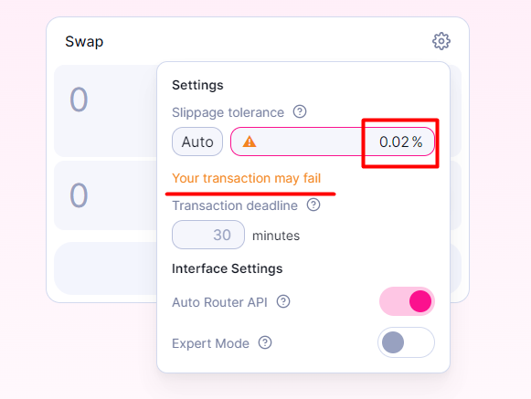

На следующем скриншоте я выставил высокое проскальзывание, а Uniswap предупредил меня о потенциальной угрозе frontrun.

Боты могут опередить транзакции пользователя, и тем самым бот может повлиять на фактическую цену сделки. На пользователе это отразится в виде дополнительных издержек при совершение сделки. Именно так работает Frontrun — одна из самых распространённых атак ботов.

Подробно о frontrun мы ещё поговорим позже. Сейчас запомни, что слишком высокое проскальзывание создаёт различные потенциальные угрозы для обмена.

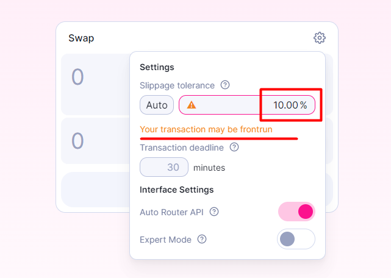

## Impermanent loss

Любой пул ликвидности полагается на поставщиков ликвидности, которые уменьшают волатильность токенов. Интерес поставщика заключается в получении вознаграждения за предоставление своих токенов в пул. Гарантированная награда, что может быть лучше? Но не всё так просто.

Когда мы предоставляем ликвидность в пул, цена внесённого актива может измениться. Этот фактор называется **непостоянными потерями**. Эти потери возможные и незафиксированные. Постоянными и зафиксированными они станут только в момент вывода средств из пула.

Проще говоря, чем сильнее изменяется цена актива, тем большим потерям мы можем подвергнуться в момент вывода средств из пула.

Причину проще показать на примере. Сейчас будет много текста и задач. Мы плавно переходим на урок физики... Шучу!🙈

### Пример

**Условие:**
Предположим, что я хочу стать поставщиком ликвидности для пула токенов USDT/ETH. Договоримся на берегу:
- добавить токены нам будет необходимо в соотношение 1:1
- цена 1 Eth равна 100 USDT
- договоримся, что 1 Eth равен 100$
- всего в пуле ликвидности на данный момент 10 ETH и 1000 USDT

**Процесс:**
1. Я вношу в пул ликвидности 1 Eth и 100 USDT.
> Согласно договорённостям, стоимость 1 Eth и 100 USDT, внесённых в пул ликвидности, будет равно 200\$.
>
> Высчитаем нашу долю внесённых токенов относительно всех токенов пула и получим 10%. Это значит, что мы будем получать 10% комиссий за обмены из нашего пула.
>
> Вспомним про механизм AMM с постоянным уравнением: **X** * **Y** = **K**, где
> **X** — количество Eth
> **Y** — количество USDT,
> **K** — постоянное значение.
>
> В данном случае 10 ETH * 1000 USDT = 10 000. Это значение должно оставаться постоянным до и после любых обменов в пуле.

2. Стоимость 1 Eth поднимается до 400\$.

> Да, это произошло, но соотношение токенов в пуле также говорит, что цена эфира —  100 USDT. Арбитражные боты воспользуются этой возможностью. Они выявляют расхождения в ценах на разных обмениках и организуют процесс «купить в одном месте дешевле, продать в другом месте дороже». Прибыль они кладут к себе в карман. Подробнее об арбитражных ботах мы поговорим чуть позже.

3. После работы ботов в пуле останется 5 Eth и 2000 USDT.

> Таким образом сохранится наша постоянная **K** , которая равна 10 000. Также нивелируется разница в стоимости 1 Eth в пуле и за пределами обменника.

4. А теперь пришло время забрать 10% вложенной нами ликвидности.
> Это 0,5 Eth и 200 USDT. В долларовом эквиваленте это — 400\$. В два раза больше первоначально вложенной суммы! Также не стоит забывать про комиссионные сборы с пользователей за использование нашего пула ликвидности для обмена токенами. Предположим, что наше вознаграждение составило 20\$.

Мы заработали 220\$ в чистом виде! Приятно? Безусловно!

Однако, если бы мы просто держали свои ETH и USDT на кошельке, у нас был бы 1 ETH стоимостью 400\$ и 100 USDT стоимостью 100\$. Вместе это — 500\$.

Разница между возможной стоимостью в 500\$ и полученной стоимостью в 420\$ и есть те самые **непостоянные потери**.

_Важно!_ Запомни, что потери непостоянны, пока мы не выведем токены из пула. К тому же, комиссионные выплаты должны частично или полностью свести на нет потери, а в идеале даже вывести нас в плюс.

### А есть ли способ избежать непостоянной потери?

К сожалению, поставщик ликвидности не может полностью избежать непостоянных потерь. Но можно снизить риск, если использовать пулы со стейблкоинами и менее волатильными токенами.

Для оценки непостоянных потерь при изменение цены токенов можно использовать графическое представление.

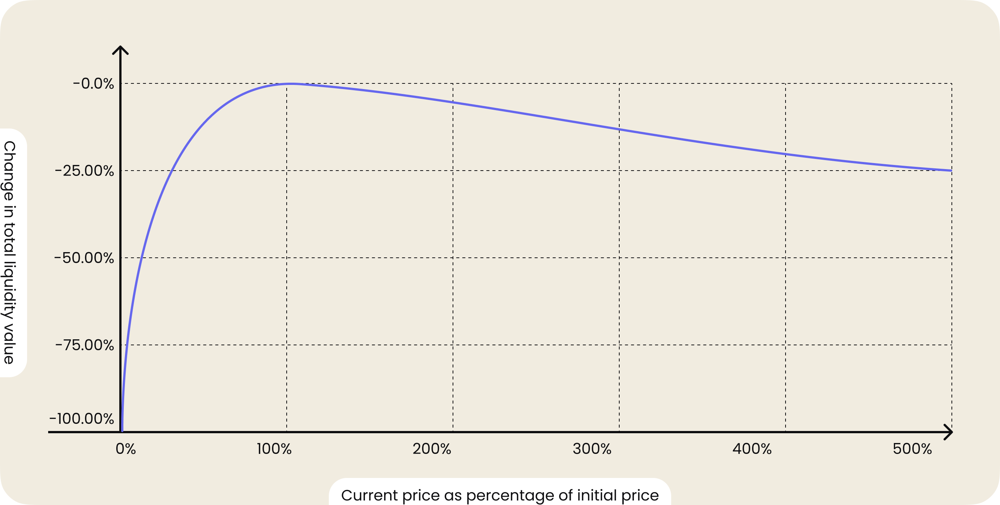
Согласно графику мы можем сделать вывод, что:
* 1,25-кратное изменение цены — убыток 0,6%
* 1,50-кратное изменение цены — убыток 2,0%
* 1,75-кратное изменение цены — убыток 3,8%
* 2-кратное изменение цены — убыток 5,7%
* 3-кратное изменение цены — убыток 13,4%
* 4-кратное изменение цены — убыток 20,0%
* 5-кратное изменение цены — убыток 25,5%

Чтобы быстро и удобно считать непостоянные потери ты можешь воспользоваться специальным сервисом. Попробуй этот [калькулятор непостоянных потерь](https://dailydefi.org/tools/impermanent-loss-calculator/). Любой из подобных сервисов предложит ввести стоимость токенов на момент добавления ликвидности в пул и на момент вывода.

## Arbitrage. Mev. Gas auction

Осталось разобраться с арбитражем.

Цены на один и тот же актив могут различаться на разных обменниках. Когда ты покупаешь токены на одном обменнике и продаёшь их на другом с целью получения выгоды — это и есть **арбитраж**.

На самом деле, это не просто концепция «купи дешевле, продай дороже», а образ мышления, направленный на оценку ценности токена и спроса на него. Чтобы получить прибыль, очень часто нужно выстроить сложную цепочку сделок.

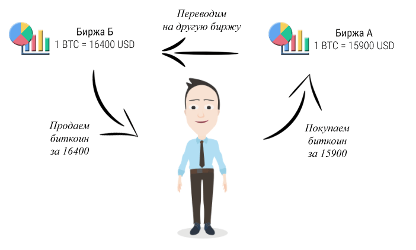

_Важно!_ Помни, что ты всегда можешь понести убытки, если цена токена упала в момент сделки. Заработать на арбитраже в ручном режиме сложно, поэтому процесс автоматизируется программно.

Арбитражные боты влияют на рыночные цены и на других участников рынка. Они уравновешивают курсы на обмен токенов по всему рынку, повышая его общую эффективность. Это хорошо для пользователей. В этом плане, арбитраж полезен, так как увеличивает объём торговли и доход от комиссии.

Но не все боты полезны или хотя бы безвредны. Существует целый ряд ботов, которые в стремлении получить прибыль могут нести отрицательный эффект.

### Чем опасны боты?

Чтобы понять, как работают боты-злоумышленники, необходимо понимать устройство блокчейна и работу майнеров.

Отправленная транзакция в блокчейн исполняется не сразу. Она попадает в **mempool** или **memory pool**. Это такая небольшая база данных неподтверждённых или ожидающих выполнения транзакций. Когда транзакция подтверждается включением в блок, она удаляется из **mempool**.

Майнеры для составления блока выбирают транзакции из **mempool** на основе наибольшей выгоды, которую они могут получить. Для этого они могут включать, исключать и менять порядок транзакций на своё усмотрение в создаваемом блоке. Процесс извлечения такой прибыли называется **Miner Extractable Value (MEV)**.

Вместе с майнерами за **mempool** следят и боты, так как содержимое **mempool** видно всем (мы же все ещё в блокчейне). Боты могут успевать совершать собственные транзакции на опережение или после исполнения целевой транзакции.

Например, видя целевую транзакцию о пополнение пула ликвидности значительной суммой токенов, которая повлияет на увеличение цены, бот-злоумышленник может успеть:

1. Провести покупку токенов по маленькой цене.
2. Выждать транзакцию на ожидание.
3. Продать токены по новой выросшей цене.

Провести свою личную транзакцию бот может путём искусственного повышения цены за газ. Из-за этого майнер будет брать из **mempool** эту транзакцию в первую очередь, основываясь на желании извлечь максимальный MEV.

Самое интересное здесь то, что ботов-злоумышленников может быть несколько. И тогда между ними начинается конкуренция по предложению наибольшей цены за газ. Такое явление называется **войной за газ**. Такая война увеличивает комиссию для обычных пользователей.

Стоимость обмена токенов в **DEX на AMM** зависит от порядка транзакций. И, как ты уже мог заметить, манипулировать порядком транзакций можно предлагая большую стоимость газа. Боты стараются направить свою транзакцию в точно определённое место среди других транзакций в ожидании. Таким образом создаются атаки, которые эксплуатируют майнеров.

Рассмотрим самые распространённые атаки ботов:

1. **Front-running**

> Бот наблюдает за транзакциями и выбирает подходяющую, которая принесёт ему прибыль. Он инициирует конкурирующую транзакцию с более высокой ценой на газ и ожидает, что его транзакция будет подтверждена раньше транзакции-жертвы.

Например, Алиса хочет приобрести много токенов. Это приведёт к повышению цены, так как токена останется в обороте меньше, а спрос на него останется прежним. Боту выгодно купить токен раньше Алисы. Бот это понимает и проводит атаку типа front-running.

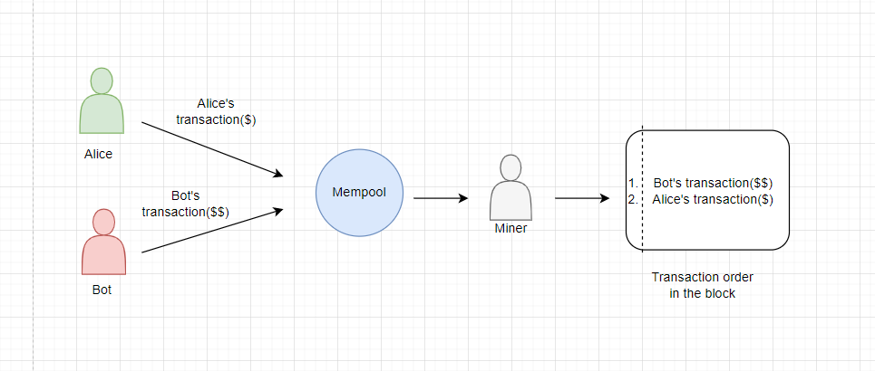

Согласно схеме происходит следующий сценарий:
1. Алиса инициирует покупку токена и её транзакция попадает в **mempool**.
2. Бот видит транзакцию Алисы и применяет на ней свою стратегию заработка. Стратегия заключается в поиске транзакций, которые могут существенно повлиять на стоимость токена. После нахождения такой транзакции, бот должен первым купить токен по ещё неизменившийся цене, чтобы удержать её или продать дороже в будущем.
3. Транзакция Алисы полностью подходит для бота. Он может на ней заработать, если купит токены раньше. Тогда бот начинает действовать. Он инициирует свою транзакцию на покупку токена, которая также попадает в **mempool**. Но бот предлагает майнеру цену за газ больше, чем предложила Алиса. Однако, он не предлагает слишком большую цену. Чтобы транзакция выполнилась очень быстро, ему нужно учитывать накладные расходы за свои действия и соблюдать баланс, иначе можно уйти в минус.
4. Всё это время майнер занимается своими прямыми обязанностями и составляет блок с транзакциями. Действует он, как мы уже говорили, согласно принципу MEV, пытаясь извлечь максимальную прибыль. В **mempool** огромное количество транзакций. Поэтому всегда есть большая вероятность, что транзакция жертвы ещё не выполнилась и все описанные выше манипуляции бота с транзакциями были успешно проведены.
5. Так как транзакция бота предлагает для майнера больше газа, логично, что он вставляет её в блок раньше транзакции Алисы. Это значит, что транзакция бота будет выполнена раньше транзакции Алисы.

Ты можешь спросить, что плохого в этой атаке? Алиса ведь всё равно купит свой токен рано или поздно. Забыл про проскальзывание цены? Для Алисы будет большое удивление, когда она увидит разницу между фактической и реальной ценой покупки.

_Важно!_ Транзакция бота, также как и любая другая покупка токена, приведёт к повышению его стоимости. Получается, что Алиса заплатит больше ожидаемого за покупку и получит меньше взамен, так как бот купит токен раньше неё.

2. **Back-running**

> Атака похожа на front-running с той лишь разницей, что бот выполняет собственную транзакцию сразу после целевой транзакции.

Например, бот отслеживает mempool на появление новых пулов ликвидности. Если он находит новый пул, то скупает как можно больше токенов. Однако скупает он не все из них, поскольку у пользователей должна оставаться возможность купить токены.

Затем бот ждёт, пока цена вырастет и другие пользователи начнут покупать токены. В этот момент бот продаёт токены по более высокой цене. Смысл стратегии в том, чтобы как можно раньше купить токен с целью продать его по более высокой цене.

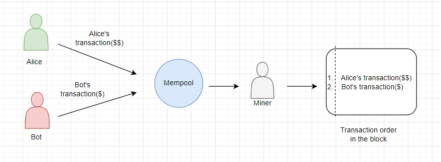

Согласно этой схеме происходит следующий сценарий:
1. Бот ищет новый, недавно появившийся токен и покупает его. Очень часто цена таких токенов низкая.
2. Алиса тоже узнаёт про этот токен и желает его купить. Отметим, что между ботом и Алисой есть и другие пользователи, которые купили этот токен. В данном случае Алиса просто является сигналом для бота.
3. Алиса инициирует покупку токена. Её транзакция попадает в **mempool**.
4. Бот видит транзакцию Алисы и применяет на ней свою стратегию заработка. Стратегия заключается в ожидании, когда цена токена достаточно вырастет. Помни, что когда Алиса купит токен, его стоимость вырастет. Это будет существенный рост, так как Алиса состоятельный покупатель и всегда покупает в больших объёмах.
5. Транзакция Алисы полностью подходит для бота, потому что она поднимет стоимость и бот сможет на ней заработать. Тогда бот инициирует свою транзакцию на продажу токена. Транзакция также попадает в **mempool**. Но в этот раз бот предлагает майнеру цену за газ меньше, чем предложила Алиса. Слишком маленькую цену бот не выставит, так как ему важно, чтобы транзакция исполнилась максимально близко к транзакции Алисы.
6. Все это время майнер занимается своими прямыми обязанностями и составляет блок с транзакциями. Поэтому сначала он добавляет в блок транзакцию Алисы на покупку токена, а потом транзакцию бота на продажу токена.

Теперь ты можешь снова спросить, в чём здесь опасность для Алисы? Ведь она купит раньше бота. Да, раньше, поэтому это не front-running, а back-running. После того, как Алиса купит свои токены, бот продаст свои. Помнишь, что для большей выгоды он скупил большую часть токенов?

Продажа огромного количества токенов может сильно обвалить стоимость нового, не окрепшего токена. А в результате получится, что Алиса будет держать на руках токены, которые сильно упали в цене и превратились в фантики.

3. **Sandwich**

> Эта атака комбинирует в себе front-running и back-running атаки.
>
> Перейдём сразу к примеру. Алиса хочет купить токен на децентрализованной бирже, которая использует модель автоматизированного маркет-мейкера.
>
> Бот, который видит транзакцию Алисы, создает две собственные транзакции, которые он вставит до и после транзакции Алисы. Первая транзакция бота покупает токен, что увеличивает цену транзакции Алисы, а вторая транзакция — это продаже токена по более высокой цене с прибылью.

Согласно этой схеме происходит следующий сценарий:
1. Стратегия бота заключается в поиске транзакции, которая повысит стоимость токена достаточно для заработка.
2. Алиса инициирует покупку токена. Транзакция попадает в **mempool**.
3. Бот, который постоянно мониторит **mempool**, видит транзакцию Алисы и применяет свою стратегию заработка.
4. Транзакция Алисы полностью подходит для бота: она поднимет стоимость и бот сможет на ней заработать. Тогда бот инициирует две транзакции. Первая на покупку токена — бот выставляет цену газа больше Алисы. Вторая на продажу токена — бот выставляет цену газа меньше Алисы.
5. Обе транзакции также попадают в **mempool**.
6. Все это время майнер занимается своими прямыми обязанностями и составляет блок с транзакциями. Из-за правильно предложенных цен за газ первая транзакция бота будет выполнена майнером раньше транзакции Алисы, а вторая после.

В данном случае неприятность для Алисы — это проскальзывание цены. То есть фактическая цена покупки для Алисы будет больше, а токена в таком случае она купит меньше, чем ожидала.

Бот смог заработать на разнице покупки и продажи. Он купил первой транзакцией токен дешевле. Второй транзакцией продал дороже, чем купил. Профит положил себе в карман.

# Вывод

На этом все! Мы изучили много особенностей DEX. Почему цена за токены может проскальзывать и как можно на это повлиять, опасности добавления ликвидности в пул, связанные с непостоянной потерей. Отдельно поговорили о том, как работают арбитражеры и какие основные типы атак бывают.

Ты, конечно же, хочешь спросить, для чего мне может понадобится эта теория?

Если ты продолжишь погружение в мир децентрализованных финансов, то тебе придётся решать проблемы, о которых мы говорили выше в своих собственных проектах. А тут, как говорится, предупрежден, значит вооружен! И, кто знает, может быть именно тебе удастся создать децентрализованный обменник без проскальзывания цены, непостоянных потерь и с самой современной защитой от атак ботов.