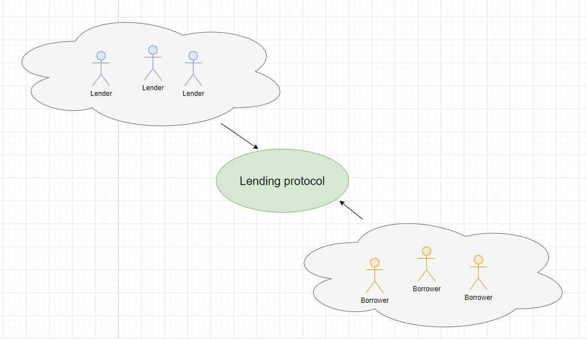

# Lending

**Автор:** [Найданов Павел](https://github.com/PavelNaydanov) 🕵️‍♂️

_Опр!_ **Lending протокол** или протокол кредитования. Это следующий важный раздел в сфере DeFi после DEX (Decentralized exchange). Lending-протокол дает возможность пользователям брать и предоставлять криптоактивы для займа.

Другими словами, lending протокол является агрегатором ликвидности, которая предоставляется заемщикам. То есть, протокол набирает потенциальных кредиторов, которые готовы предоставить свои активы для займа. Получается, что сам протокол выступает в роли посредника между заемщиком и кредитором. Он следит за честностью сделки и позволяет кредитору получить свои проценты, а заёмщику выдать кредитные активы. Для кредиторов это может быть своего рода пассивным доходом.

## Быстрая навигация

1. Статья про [Compound](./compound/README.md).
2. Статья про [Aave](./aave/README.md)
3. Статья про [flash loans](./aave/flash-loans/README.md) на базе Aave

## Немного истории

Согласно [википедии](https://ru.wikipedia.org/wiki/%D0%97%D0%B0%D1%91%D0%BC#%D0%97%D0%B0%D1%91%D0%BC_%D0%B2_%D0%98%D0%BC%D0%BF%D0%B5%D1%80%D0%B8%D0%B8_%D0%98%D0%BD%D0%BA%D0%BE%D0%B2) одним из первых зарегистрированных займов был сделан государством (если так можно сказать) бедным людям в империи инков. Во время неурожайных годов, чиновники выдавали пищу бедным людям поселения из хранилищ империи. При этом велся учет что и каким образом было выдано.

**Когда появилась идея криптовалютного кредитования?** Некоторые протоколы DeFi, такие как [MakerDAO](https://makerdao.com), находились в разработке еще в 2014 году. В сентябре 2018 года [Compound Labs](https://compound.finance/) представила первую версию протокола, который позволял брать в займы пять активов: ETH, TUSD, ZRX, BAT и REP. В 2020 экономика резко остановилась из-за пандемии. Это привело к снижению процентных ставок и резкому сокращению кредитования в классических финансовых институтах. В это время для стимулирования рынка Compound выпустил токен **COMP**. Это привело к начало взрывного роста кредитных протоколов. Примерно в это же время появился протокол [Aave](https://aave.com/).

## Терминология

**Borrower** - заемщик.

**Lender** - кредитор.

**Loan (займ)** - основной долг или сумма кредитных средств. Обычно **заемщик** должен погасить основной долг + выплатить комиссию за использование средств.

**Interest (процент)** - комиссия, которая выплачивается **lending протоколу** за использование заемных средств или начисляется кредитору предоставившему свои активы для займа.

**Collateral (залог)** - это актив, который **заемщик** предоставляет для **кредитора** в качестве гарантии на случай невозможности погасить основной долг. Если это происходит, **кредитор** может конфисковать и реализовать **залог**. **Кредитор** использует **залог** в качестве механизма снижения риска, который гарантирует, что **заемщик** погасит заем.

**Liquidation (ликвидация)** - это "ликвидация позиции" или продажа **залога** для выплаты кредита. Если стоимость **залога** уменьшается и падает ниже порогового значения или если стоимость кредита увеличивается, то залог будет «ликвидирован», чтобы не понести экономические потери.

## Принцип работы

Подобный протокол отличается быстротой займа и ориентированностью на конечного пользователя. Большинство протоколов имеют гибкую систему процентов, целью которой является распределение выгоды для всех: протокола, заёмщика и кредитора.

**Кредитование**. Пользователи могут вкладывать активы в кредитный пул (смарт-контракт). Взамен они получат LP токены (токены кредитного пула), которые представляют их долю в общей стоимости кредитного пула. Обычно свои активы можно забрать в любое время с начисленными процентами.

**Заем**. Из-за большой волатильности активов в DeFi, заем требует сверх-обеспечения для избежания финансовых потерь в случае, когда заемщик не может выплатить кредит. Поэтому пользователь должен внести залог, стоимость которого превышает стоимость кредита. И тогда в случае, если стоимость залога по отношению к займу значительно упадет, то залога будет достаточно для покрытия основного долга. Заемщик может погасить основной долг + проценты за использование займа в любое время и забрать залог.

_Важно!_ Процентные ставки для кредитования и займа постоянно меняются в зависимости от общего количества активов в кредитном пуле и общей суммы займов. Соотношение активов к займам называют **коэффициентом использования** (где-то этот показатель может называться иначе, но суть его одна). Если коэффициент использования возрастает, процентная ставка также повышается с целью привлечения дополнительных депозитов и сдерживания активности заемщиков, в противном случае действует обратный механизм.

**Ликвидация**. Стоимость залога может уменьшится или стоимость активов в займе может вырасти и тогда залога становится недостаточно для обеспечения займа. Если заемщик не погасит долг, то он может быть ликвидирован. Заемщик должен следить за тем, чтобы стоимость залога не падала ниже порога ликвидации. Если это произойдет, то специальные участники протокола - **ликвидаторы** могут автоматически ликвидировать залог заемщика для покрытия займа.

_Важно!_ Подобной ситуации можно избежать путем внесения большего залога или погашения кредита полностью или частично.

Зачастую на ликвидацию смотрят в негативном ключе и это полностью ошибочное мнение. Если бы механизм ликвидации отсутствовал, то протоколы кредитования не могли бы защитить свою экономику и кредиторов. Получается, что механизм ликвидации помогает поддерживать баланс сил в экосистеме lending протоколов и является жизненно важным элементом.

## Риски

Самый очевидный недостаток системы кредитования по протоколу — повышенные риски, связанные с внешними зависимостями.

Существует два основных типа риска для протоколов кредитования:
- **риски снижения**. Подразумевает снижение стоимости актива. Обычно разовые события, экзогенного характера, способные превратить стратегии "только вверх" в убыточные. Например, принятие закона запрещающее торговать залоговым активом приводит к резкому падению стоимости актива.
- **риски длинного хвоста**. Это риски, которые накапливаются со временем и часто являются эндогенными. Например, отсутствия контроля за обеспечением залога может привести к его ликвидации.

## Обзор популярных lending протоколов

## Compound

**Compound** — это EVM совместимый протокол для предоставления или заимствования активов.
Позволяет создавать рынки криптовалют в виде пулов активов с алгоритмически рассчитанными процентными ставками на основе спроса и предложения на актив. Каждый рынок уникален и полученные проценты представлены в том же токене, который предоставлен взаймы. Активы, поставляемые на рынок, представлены балансом токенов ERC-20 (cToken), который дает владельцу право на увеличение количества базового актива.

Compound V2 представлен исключено в сети Ethereum.
Compound V3 работает в сетях: Ethereum, Polygon, Arbitrum, Base.

Compound имеет собственный токен управления **COMP** при помощи которого сообщество принимает участие в организации работы протокола.

Подробнее про Compound в отдельной [статье](./compound/README.md).

## Aave

**Aave** - это децентрализованный протокол ликвидности. В рамках протокола, кредиторы предоставляют активы для обеспечения ликвидности пулов Aave, а заемщики могут брать предоставленные активы в заем у протокола. Аналогично cToken в Compound, Aave предлагает собственный aTokens — это токены ERC-20, привязанные 1:1 к стоимости базового актива.
ATokens являются подтверждением вложенной ликвидности кредитором. Проценты будут начисляться в режиме реального времени и варьируются в зависимости от спроса на заемные средства и предложения ликвидности. Для заемщиков, протоколом реализован debtToken - это токен ERC-20, который отображает долговые обязательства заемщика.

Подробнее про Aave в отдельной [статье](./aave/README.md).

## Для чего используются lending протоколы?

1. **Блокировать активы, не продавая их**

    Долгосрочный крипто-ходлер, который не хочет продавать свои активы, но все же должен оплачивать свои счета и еду, может взять заем, чтобы оплачивать свои повседневные потребности. Операторы майнинговых ферм BTC могут брать кредиты на покупку нового оборудования вместо того, чтобы продавать свои BTC, когда цена низкая.

2. **Для маржинальной / кредитной торговли**

    Сделка с кредитным плечом — это сделка, совершенная на заемные активы. Маржа относится к залогу, используемому для совершения сделки с кредитным плечом. Маржинальная торговля увеличивает убытки или прибыль инвестора по сделке.

3. **Для получения процентов (в качестве кредитора)**

    Протоколы кредитования служат для держателей традиционной криптовалюты способом заработать небольшую сумму процентов, а для держателей стабильных токенов — получать проценты по ставкам, зачастую более высоким, чем с помощью традиционных сберегательных счетов/облигаций.

## Преимущества

Главное отличие lending протоколов от централизованных сервисов, например "банка" заключается в том, что активы хранятся не на счете банка и не в его хранилище. Активы хранятся на специальном смарт-контракте. Смарт-контракт автоматически рассчитывает процентные ставки для кредиторов и заемщиков. Они обращаются к ценовым оракулам для определения стоимости активов в реальном времени. Оракулы — это потоки данных, которые позволяют получить информацию из источников вне блокчейна, например, цену актива или фиатной валюты в реальном времени.

Активы постоянно находятся под контролем пользователя. Обычно не существует минимального или максимального предела. Кредиторы могут выкупить свои активы, а заемщики могут погасить свои кредиты в любое время.

Вот ключевые преимущества кредитования в пространстве DeFi вместо традиционного финансирования:

- DeFi децентрализован, поэтому нет никакого промежуточного контроля за операциями по кредитованию / заимствованию.
- Все у кого есть свободная криптовалюта, могут стать кредитором и получать пассивный доход.
- Кредиты DeFi псевдо анонимны.
- Не существует заранее определенного срока кредита, что означает, что вы можете платить более низкие проценты, если используете деньги в течение короткого периода.
- Практика чрезмерного обеспечения платформ DeFi обеспечивает безопасность кредиторов.
- Управление займом выполняется кодом смарт-контракта и нет посредников которым необходимо платить.