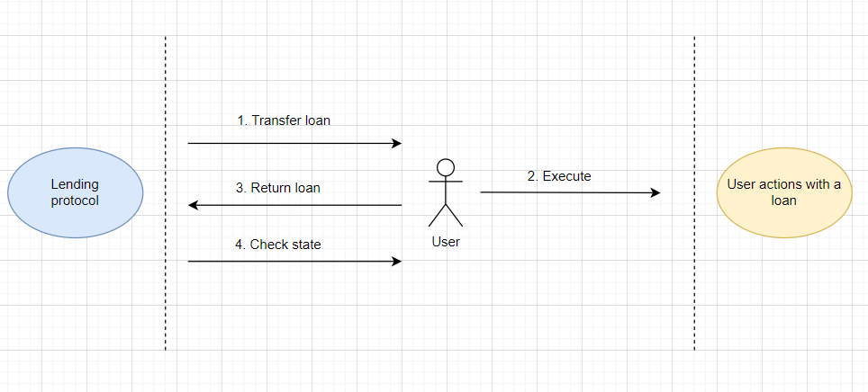
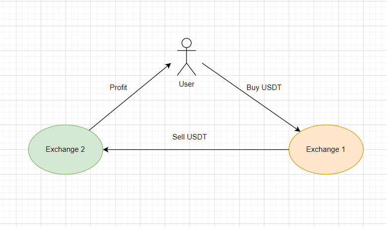
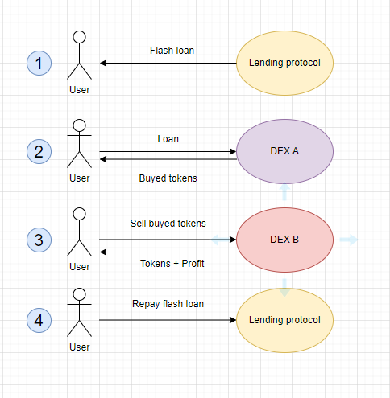
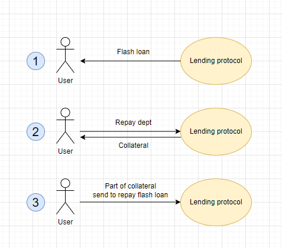
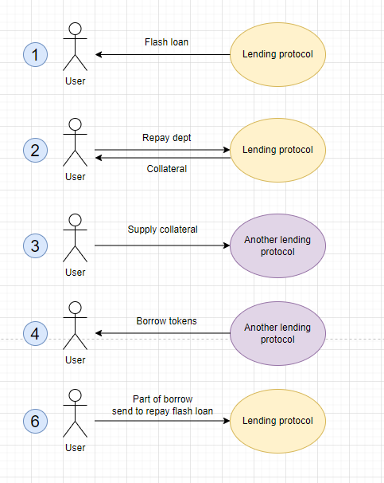
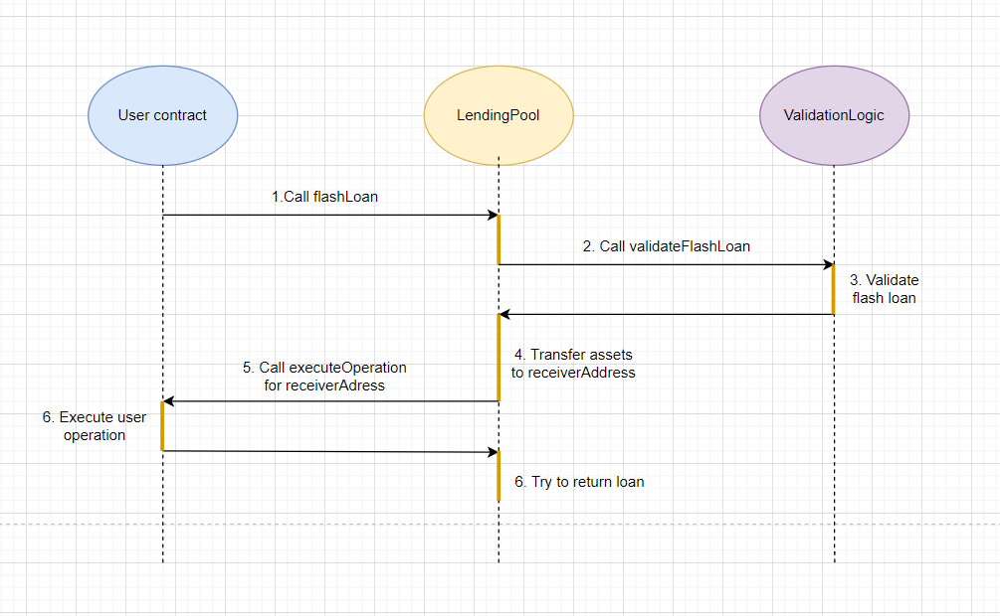
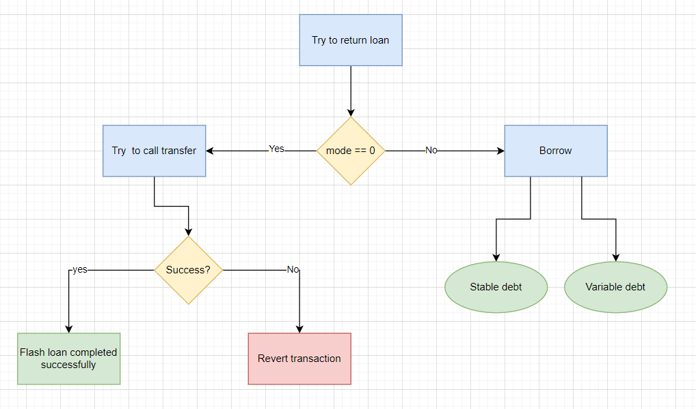

# Flash loans and их практическое применение

_Опр!_ **Flash loan** - тип кредитования, который не требует залога для обеспечения займа. По-другому, быстрый заем. Основное условие такого займа - долг должен быть погашен заемщиком в рамках одной транзакции. Это означает, что заемщик, берет активы в займы, а к концу транзакции обязан вернуть долг обратно. Если этого не произойдет, то транзакция будет отменена протоколом.

_Off top!_ Транзакция в блокчейн обладает свойством атомарности. Поэтому она либо выполняется полностью, либо не выполняется вовсе. Если в конце транзакции долг не будет возвращен, транзакция будет отменена полностью.

Где-то в промежутке между займом и возвратом долга заемщик должен успеть провести необходимые операции с активами, взятыми в займы. Он может использовать заемные средства на свое усмотрение.

На данный момент **flash loans** являются популярными в ряде современных децентрализованных протоколов кредитования. Они обладают следующими уникальными характеристиками:
- **Смарт-контракт**. В работе быстрого займа используется смарт-контракт. Именно он позволяет следить за соблюдением условий кредитования.
- **Отсутствие залога**. Вместо залога, заемщик должен вернуть средства в рамках одной транзакции.
- **Скорость**. Так как займ и возврат происходят в рамках одной транзакции, скорость операций очень высокая.
- **Нулевой риск**. Если к концу транзакции, займ не будет погашен. Транзакция будет отменена. Заемщик не потеряет средств, так как залог протоколу он не оставлял.

## История появления flash loans

Впервые концепция **flash loans** упоминалась протоколом Marble в 2018 году. Marble называли себя “smart contract bank” в сети Ethereum. Продукт позиционировался, как децентрализованный кредитный протокол с открытым исходным кодом. Инновацией проекта считалась возможность смарт-контракта выполнять любой произвольный код после займа. Важным условием такого займа был возврат средств на смарт-контракт в рамках одной транзакции. Подробнее в статье Max Wolff ["Introducing Marble"](https://medium.com/marbleorg/introducing-marble-a-smart-contract-bank-c9c438a12890).

По-настоящему все изменилось, когда Aave запустило свой протокол на базе пулов ликвидности в январе 2020 года. Для **flash loans** началась новая веха в истории. Потому что при помощи протокола Aave сторонние разработчики получили возможность разрабатывать DeFi приложения на базе flash loans. При этом размер быстрого займа мог достигать миллионов долларов, а комиссия за его выдачу всего 0,09% от суммы займы.

Разработчики приложений оценили огромный потенциал **flash loans** практически сразу, как Aave появилась в релизе. Но по-настоящему, быстрые займы стали востребованы спустя несколько месяцев благодаря росту числа пользователей DeFi приложений и последовавшим ростом комиссий в сети Ethereum. Обычные операции с DeFi-протоколами стали обходиться слишком дорого. Но использование стратегий на основе **flash loans** позволило значительно снизить затраты на газ и найти новые возможности для извлечения прибыли.

## Принцип работы flash loan

На данный момент мы знаем, что в протоколе кредитования участвуют два основных субъекта:
- Кредитор
- Заемщик

Для взаимодействия с кредитором при помощи инструмента flash loan заемщику необходимо разработать **смарт-контракт**. Этот смарт контракт должен уметь выполнять три действия:
1. **Занимать средства у кредитора.** В нашем случае кредитором для заемщика выступают протоколы кредитования, которые предоставляют функционал flash loan. Например, Aave.
2. **Любые другие операции.** Например, продажа или покупка активов на бирже.
3. **Возврат заемных средств кредитору** с процентами за использование займа.

Все это происходит в рамках одной транзакции и представлено на схеме ниже.



Согласно схеме, принцип работы выглядит следующим образом:
1. Пользователь берет быстрый займ у **Lending протокола**. Протокол предоставляет активы в свободное использование.
2. Пользователь выполняет любые действия с участием заемных средств. Например, покупка на одной бирже и продажа на другой.
3. Пользователь гасит займ. Возвращает заемные средства + проценты за использование.
4. **Lending протокол** проверяет свой баланс. Если пользователь вернул недостаточно средств, кредитный протокол немедленно отменит транзакцию.

## Для чего можно использовать flash loans?

**Flash loans** имеют широкий спектр применения. Они используются и для извлечения дополнительных объемов в торговли и для ликвидации собственных позиций. Ниже предлагаю разобрать самые популярные варианты использования.

### Арбитражная торговля

_Опр!_ **Арбитраж** - стратегия заработка с использованием разных цен на один и тот же актив на одной или разных биржах с целью получения прибыли.

Схематично арбитраж можно представить схемой ниже.



**Flash loans** позволяют использовать заемные средства для арбитража с нулевым риском. Риск отсутствует, потому что кредитный протокол самостоятельно отменит транзакцию в случае нехватки средств для погашения долга. Поэтому, если заемщик прогорит на межбиржевых операциях, неправильно рассчитает свои затраты на газ или произойдет проскальзывание цены, он не рискует ни своими средствами, ни средствами кредитного протокола. Но если заемщик правильно просчитает профит при арбитраже, быстрый займ поможет увеличить профит в несколько раз.

Помимо отсутствия риска, **flash loans** обладают высокой скоростью исполнения. Скорость положительно влияет на арбитражную торговлю. Делать одну транзакцию вместо обычных двух (транзакция на покупку и транзакция на продажу) выгоднее. Это предохраняет от проскальзывания цены и позволяет попасть в арбитражное окно (момент, когда нам выгодно проводить арбитражную торговлю).

Также огромный плюс заключается в возможности привлечь дополнительные активы протоколов кредитования. Нет необходимости обладать стартовым капиталом, всегда можно взять **flash loans** без залога.

Например, алгоритм может выглядеть следующим.



> 1. Взять быстрый займ на актив у кредитного протокола.
> 2. На заемные средства купить актив на бирже, где он дешевле.
> 3. Продать актив на той бирже, где он дороже.
> 4. Вернуть долг + проценты кредитному протоколу. Профит оставить себе.

Именно арбитражная торговля является одним из самых популярных способов использования **flash loans**. К тому же такой арбитраж помогает поддерживать межбиржевой курс любого актива. То есть, если на одной бирже курс падает, то всегда найдется арбитражер, который своими манипуляциями выровняет курс. **Flash loans** в этом случае помогают арбитражерам заниматься выравниванием рынка.

### Самоликвидация займов (self-liquidating loans)

Обычный займ требует блокировки залоговых средств. Если стоимость залога упадет относительно заемных средств и перестанет обеспечивать займ, то **ликвидатор** может ликвидировать заем частично или полностью.

**Flash loans** являются единственным инструментом, который может помочь провести самостоятельную ликвидацию без штрафа. Я не говорю о частичном погашение долга или увеличение суммы залога. Это конечно тоже поможет избежать ликвидации, но сейчас нам интересны flash loans.

Как это работает? Заемщик может спасти свой займ следующим образом.



> 1. Взять быстрый займ.
> 2. Погасить долг заемными средствами. Тем самым освободить залог.
> 3. Часть залога отправить на погашение flash loan с соответствующими комиссиями.

В результате использования flash loans, пользователь может избежать штрафа за ликвидацию кредита.

### Замена залога (swap collateral)

Обычно замена обеспечения займа может потребоваться только в случае падения цены залогового актива. При падение стоимости залога, займ будет неумолимо приближаться к ликвидации. В таком случае от ликвидации можно спастись не только самостоятельно ликвидировав заем (как в прошлом примере). Куда разумнее заменить залог на другой актив, который будет менее волатилен.


Замена обеспечения без использования **flash loans** потребует полного закрытия кредита. Это будет происходить в несколько этапов. Придется сделать несколько транзакций, что в свою очередь увеличит транзакционные сборы.

### Рефинансирование займов

Ставки по займам в различных протоколах кредитования постоянно меняются. Это происходит из-за изменений рыночных условий и объема ликвидности. **Flash loans** оказались удобным инструментом для перемещения займа с одного протокола на другой с более низкими процентными ставками. При этом всегда есть возможность поменять актив в залоге для обеспечения.

Процесс рефинансирования выглядит следующим образом.



> 1. Взять flash loan.
> 2. Погасить долг заемными средствами. Тем самым освободить залог.
> 3. Внести залог в другой протокол с более низкими ставками.
> 4. Взять заем в новом протоколе.
> 5. Часть займа отправить на погашение flash loan с соответствующими комиссиями.

## Flash loan в Uniswap

Отдельно стоит отметить, что свою версию **flash loans** предложил обменник Uniswap. Называется эта опция **"flash swaps"**. Она была запущена во второй версии протокола в мае 2021 года.

На самом деле, со второй версии протокола любые обмены в Uniswap являются **flash swaps**. Протокол может отменить любую транзакцию на обмен, если выяснится, что он не дополучил достаточно токенов взамен. К тому же любой вызов метода `swap()` на uniswap принимает параметр data типа bytes. Этот параметр отвечает за выполнение пользовательских операций при получение средств.

> function swap(uint amount0Out, uint amount1Out, address to, bytes calldata data);

Если **data.length** равно 0, это значит, что контракт сначала получает токен для обмена и затем выдает токены в замен.

Если **data.length** больше 0, то контракт сначала отправляет токены, затем вызывает то, что закодировано в data. И если в конце транзакции контракт не получит свою долю токена, транзакция будет отменена.


## Flash loan в Aave v2

Во второй версии протокола для использования быстрого займа необходимо вызвать метод `flashLoan()` на контракте [LendingPool](https://github.com/aave/protocol-v2/blob/master/contracts/protocol/lendingpool/LendingPool.sol#L483).

> Особенно стоит отметить, что быстрые займы в протоколе Aave предназначены только для разработчиков. Потому что для их реализации необходимо уметь разрабатывать смарт-контракты и понимать основные принципы блокчейн технологии.

```solidity
function flashLoan(
    address receiverAddress,
    address[] calldata assets,
    uint256[] calldata amounts,
    uint256[] modes,
    address onBehalfOf,
    bytes calldata params,
    uint16 referralCode
)
```

Функция flashLoan принимает следующие аргументы:
1. **receiverAddress.** Адрес контракта, который получит активы от протокола. Должен реализовывать интерфейс **IFlashLoanReceiver**. Этот контракт будет выполнять дополнительные операции пользователя с заемными средствами.
2. **assets.** Массив адресов резервов для займа. Адреса токенов, которые будут принимать участие в быстром займе.
3. **amounts.** Массив чисел. Обозначает количество занимаемых активов.
4. **modes.** Массив чисел. Обозначает режим управления долгом для каждого вида актива. Применяется в случае, если займ не будет погашен до окончания транзакции. Принимает следующие значения:
    - 0 - означает, что долг должен быть обязательно возвращен, иначе будет revert транзакции.
    - 1 - будет взят обычный займ с стабильной процентной ставкой (stable Interest Rate)
    - 2 - будет взят обычный займ с переменной процентной ставкой (variable Interest Rate)
5. **onBehalfOf.** Это адрес, который должен владеть достаточно залогом, чтобы был взят обычный займ. Используется с случае, если параметр mode равен 1 или 2.
6. **params.** Закодированные в байтах параметры, которые будут использоваться receiverAddress контрактом.
7. **referralCode.** Код реферальной программы Aave.

Как работает функция flashLoan под капотом? Ответом на этот вопрос служит схема ниже, которая показывает, что происходит после вызова функции `flashLoan()`.



Согласно схеме:
1. Для того чтобы воспользоваться быстрым займом необходимо реализовать контракт **User contract**. Этот контракт реализует интерфейс [IFlashLoanReceiver](https://github.com/aave/protocol-v2/blob/master/contracts/flashloan/interfaces/IFlashLoanReceiver.sol) и должен вызвать функцию `flashLoan()` на контракте [LendingPool](https://github.com/aave/protocol-v2/blob/master/contracts/flashloan/interfaces/IFlashLoanReceiver.sol). Внутрь функции необходимо передать полный список аргументов согласно списку из документации, который разобран выше.
2. Внутри контракта **LendingPool**, в первую очередь, будет проверена валидность переданных аргументов. Необходимо, чтобы длина массива **assets** равнялась длине массива **amounts**. Валидация вынесена в отдельный контракт, который называется [ValidationLogic](https://github.com/aave/protocol-v2/blob/master/contracts/protocol/libraries/logic/ValidationLogic.sol).
3. После проверки **LendingPool** переведет запрашиваемые средства на адрес контракта пользователя.
4. После перевода средств **LendingPool** вызовет метод `executeOperation()` на контракте пользователя.
5. Контракт пользователя выполняет все, что у него реализовано в методе `executeOperation()`. Например, это может арбитражная торговля. Покупка и продажа токенов.
6. После выполнения `executeOperation()`, **LendingPool** попытается вернуть заемные средства плюс проценты по займу обратно.

Возврат средств может происходить несколькими способами на усмотрение заемщика. Этим управляет аргумент **modes**. Это массив чисел. Каждое из значений обозначает режим взымания долга с заемщика. Весь процесс возврата заемных средств протоколу представлен на схеме ниже.



Расшифровать эту схему можно следующим образом.

Если **mode** для соответствующего актива установлен в значение 0. Протокол постарается вернуть средства в конце транзакции. Он буквально посчитает сумму (займ + проценты), которые необходимо вернуть и постарается сделать `transferFrom()` на адрес контракта **LendingPool**. Перед этим он обновит информацию о резервах токенов на контракте. Если для трансфера будет недостаточно средств, то транзакция будет отменена (revert).

Если **mode** для соответствующего актива установлен в значение 1 или 2. Это значит, что пользователь решил покрыть быстрый займ другим способом - перевести быстрый займ в обычный. Протокол автоматически проверит наличие необходимого залога на адресе, который был указан в параметре **onBehalfOf** и выполнит заем средств для погашения долга в быстром займе.

## Example

Я подготовил целый контракт [Liquidator](./contracts/src/Liquidator.sol) для демонстрации работы с flashLoan(). Этот контракт позволяет ликвидировать позицию заемщика с использованием быстрого займа в рамках одной транзакции. Вознаграждение от процесса ликвидации будет отправляться на кошелек пользователя.

_Важно!_ Будь внимательным, если захочется скомпилировать проект и запустить тесты необходимо установить переменную окружения. Смотри [readme](./contracts/readme.md).

## Flash loans приложения

**Что же может сделать пользователь, который не умеет писать смарт-контракты?** На данный момент существует множество приложений, которые построили веб-интерфейсы для работы с **flash loans**. Все эти интерфейсы основаны на базе децентрализованных протоколов кредитования.

### CollateralSwap

Это [веб-сервис](https://docs.collateralswap.com/) с максимально простым интерфейсом. Единственное ограничение заключается в том, что пока он может работать только с протоколом MakerDAO.

Сервис выполняет две задачи:
1. Быстрая замена залогового обеспечения без необходимости погашения займа;
2. Самоликвидация займа без штрафа.

В обоих случаях комиссия **CollateralSwap** берет комиссионные сборы за использование сервиса.

### DeFi Saver

Это полноценное [децентрализованное приложение](https://defisaver.com/), которое позволяет создавать собственные стратегии управления активами и займами на базе **flash loans**. Приложение поддерживает работу с протоколами MakerDao, Aave, Compound, dYdX и другие. Defi saver наиболее известен благодаря инструменту управления кредитным плечом. Пользователи могут управлять этим инструментом, увеличивая или выплачивая долг всего за одну транзакцию.

Приложение обладает большим набором функциональных возможностей:
- Поддержка множества кошельков. MetaMask, Ledger, Trezor, Argent, TrustWallet.
- Yield farming. Вклады активов под годовой процент.
- Exchange. Обмен одних токенов на другие.
- Smart Savings. Инструмент, который позволяет быстро перемещать активы между протоколами.
- Smart Wallet. Это кошелек для смарт-контрактов без ограничений на сложные транзакции.
- DeFi Recipe Creator. Инструмент создания сложной цепочки последовательных транзакций, которые включают в себя несколько действий. Например, пользователь может создать следующую стратегию «Занять 5000 USDT у Aave v2, продать USDT за UNI на Uniswap».
- DeFi Saver Automation. Это автоматизированная система управления займами с обеспечением.

### Furucombo

Это [приложение](https://furucombo.app/) позволяет максимально просто создать собственные DeFi-стратегии при помощи простого интерфейса. Такие стратегии называются **«комбо»**. Внутри **«комбо»** можно выстраивать любые стратегии путем перетаскивания различных действий. Каждая транзакция в **«комбо»** отображается в виде куба. Пользователь может настраивать параметры кубов и их порядок. Затем сервис объединяет все кубы в одну транзакцию и отправляет на исполнение. Flash loans от Aave являются базовой основой для большинства шаблонных **«комбо»**, доступных в этом приложении.

Это отличный инструмент для людей, которые хотят выполнять действия между разными протоколами при помощи **flash loans**.

## Какую опасность в себе несут flash Loans?

Кажется, что **flash loans** полностью безрисковый инструмент. Если что-то пошло не так, то flash loans не выполнится, транзакция будет отменена. Ведь для займа не требуется залог и совсем нет риска собственными активами.

**В чем же может заключаться опасность?** Опасность заключается в том, что быстрые займы могут быть превращены в "оружие". Есть две основные причины, по которым быстрые займы привлекательны для злоумышленников:

1. Многие атаки требуют большого стартового капитала. Например манипуляции с ценовыми оракулами.
2. Flash loans безрисковые. Это значит, что они сводят к минимуму опасность для злоумышленника. Злоумышленник не будет рисковать своим собственным капиталом для воплощения злонамеренных действий.

Поэтому **flash loans** чрезвычайно опасны для децентрализованных приложений. Ниже разберем несколько примеров уже состоявшихся атак, которые в свое время потрясли сообщество.

1. Приложения, которые используют DAO, как механизм голосования в принятие управленческих решений могут быть подвержены атакам. Злоумышленник может взять заем и использовать его для участия в голосование. Ярким примером подобной атаки является протоколов **DeFi Beanstalk**, который подвергся атаке в апреле 2022 года. Злоумышленник использовал flash loans для того, чтобы принять свое собственное предложение на вывод активов. Ущерб составил приблизительно 77 миллионов долларов.

2. Flash loans могут использоваться для манипулирования ценами в DEX. Подобная атака произошла в феврале 2020 года с участием торговой платформы **dYdX**. Злоумышленник взял в заем миллионы ETH, обменял их на BTC на одной площадке, открыл короткую позицию против BTC на другой площадке. После этого продал BTC, чтобы обрушить стоимость, закрыл короткую позицию с прибылью. После чего он спокойно погасил заем и остался с прибылью в 360000 долларов.

3. Одной из самых популярных атак с использованием **flash loans** является взлом при помощи протокола **bZx**. Злоумышленник занимал средства у протокола и тут же обменивал их на стейблкоин (sUSD). Поскольку стейблкоин управляется смарт-контрактом, злоумышленник манипулировал его ценой, разместив крупный ордер на покупку sUSD, что подняло цену стейблкоина до 2 долларов, удвоив его привязанную стоимость. Затем злоумышленник взял более крупный кредит в более дорогом sUSD, погасил свои займы и забрал прибыль с собой.

4. Приложение **CREAM Finance** несколько раз подвергалась атакам в 2021 году. Это один из самых крупнейших взломов, который привлек 130 миллионов долларов. Злоумышленники украли токены ликвидности CREAM на сумму в миллионы долларов за неизвестный период времени. Как и в случае с большинством взломов, злоумышленник использовал несколько контрактов на **flash loans** и манипулировал ценовыми оракулами.

5. В мае 2021 года злоумышленник взломал платформу **PancakeBunny**. Ему удалось украсть около 3 миллионов долларов. Сначала он взял огромный заем в BNB на **PancakeSwap**. Затем провел несколько манипуляции с торговыми парами BUNNY/BNB и USDT/BNB. Продавал и покупал. После этого у него в руках оказалось огромное количество токенов BUNNY, которые он тут же сбросил, вернул BNB, погасив долг и исчез вместе с прибылью. Все эти испытания привели к шокирующему падению цены на PancakeBunny со 146 до 6,17 долларов.

Конечно разработчики децентрализованных приложений пытаются противодействовать flash атакам. Эксперты по безопасности изучают различные взломы протоколов. Все это породило два решения, которые должны помочь успешнее противостоять взломам.

- Децентрализованные ценовые оракулы. Так как большинство атак строится на манипулирование ценой активов, то необходимо этому противодействовать. Например атаки с манипулированием цены будет проводить сложнее, если протокол будет ориентироваться не на один DEX, а на децентрализованный оракул, который агрегирует цены с нескольких DEX или из нескольких независимых источников.
- Внедрение платформ безопасности. Сюда можно отнести аудит смарт-контрактов, использование проверенных решений при реализации контрактов от библиотеки OpenZeppelin. Роль этой библиотеки заключается в защите смарт-контрактов и приложений в целом.

## Вывод

**Flash loans** являются отличным дополнение к экосистеме DeFi. Несмотря на то что в настоящее время этот инструмент часто используется в злонамеренных целях, он открывает огромный потенциал в создании децентрализованных приложений.

**Flash loans** - это продвинутая техника заимствования активов без необходимости вносить залог. Обычно займы используются для арбитражной торговли, которая уравновешивает стоимость активов между различными децентрализованными биржами. Чуть реже используются для замены токена в залоге, так называемый collateral swap и ликвидации займа без штрафа. **Flash loans** уникальны для технологии блокчейна и одновременно являются одной из самых больших угроз, о которых должны знать разработчики. Но при этом остаются мощным инструментом, который используется для стабилизации экономики в DeFi.