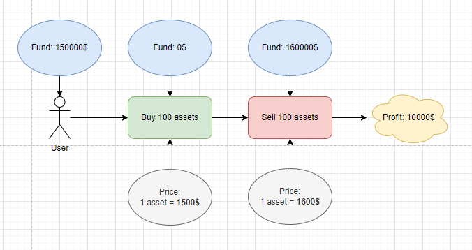
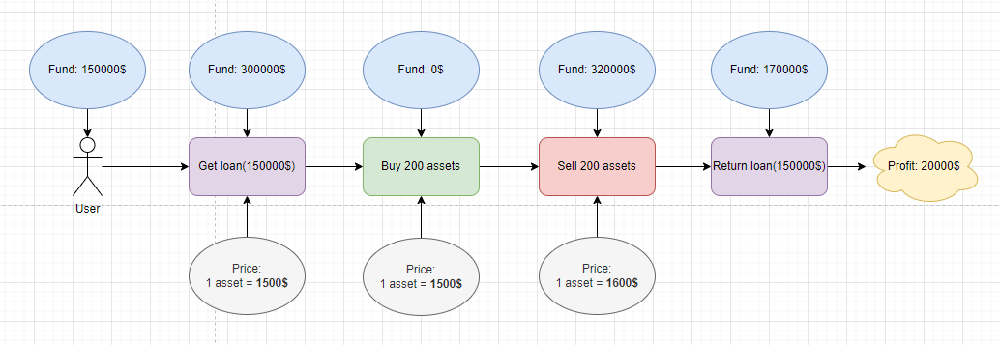
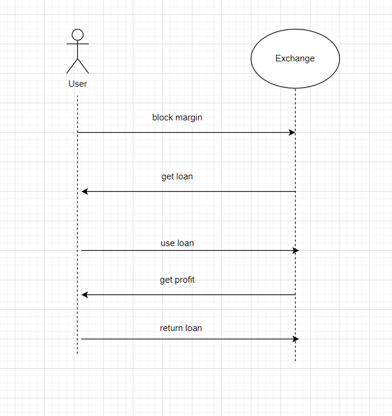
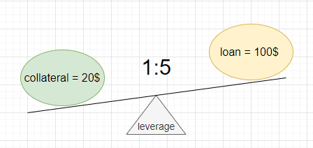
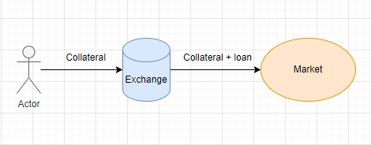
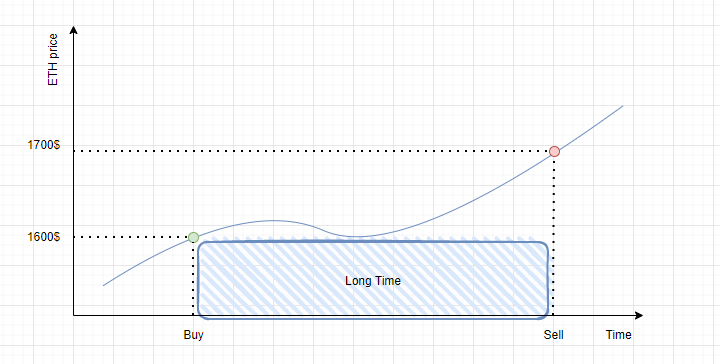
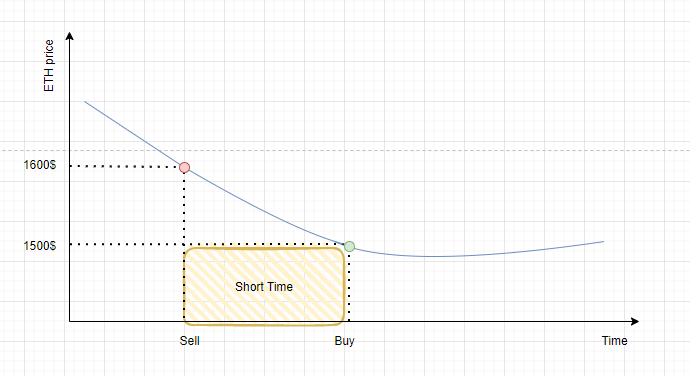
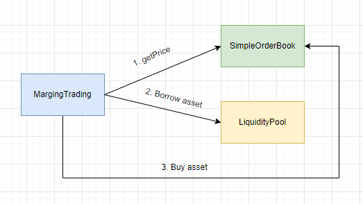
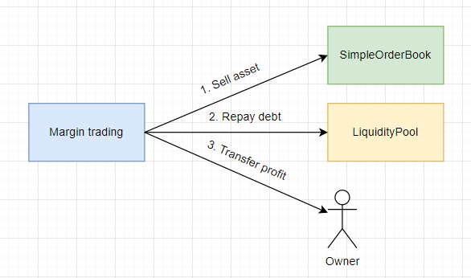

## Margin trading

_Опр!_ **Маржинальная торговля** — это инструмент торговли активами с использованием заемных средств у третьей стороны. Заем должен быть возвращен через определенный срок с комиссией за использование.

Представь, что для торговли берется кредит, который увеличит сумму сделки и даст возможность заработать больше при меньших вложениях. В мире CeFi, в роли источника кредита часто выступает сама биржа. Она предоставляет пользователю возможность получить доступ к дополнительным активам и использовать эти активы для внутрибиржевых сделок.

_Важно!_ Чем больше объём сделки, тем больше можно заработать. Возможность заработать больше значительно повышает интерес пользователя.

> Давай представим, что рыночная цена актива — 1 500\$ за 1 шт.
>
> 1. Покупаем активы в количестве 100 шт. по цене 1 500\$. Такая покупка потребует 150 000\$.
> 2. В этот момент стоимость одного актива выросла до 1 600\$.
> 3. Продаем активы(100 шт.) и получаем 160 000\$.
>
> Чистая прибыль составила 10 000\$.

> Рыночная цена актива — 1 500\$ за 1 шт.
>
> 1. Перед покупкой берем дополнительный заем на 150 000\$ для покупки дополнительного количества актива.
> 2. Покупаем активы (100 шт. + 100 шт.).
> 3. В этот момент стоимость одного актива выросла до 1 600\$. Точь в точь как в прошлом примере.
> 4. Продаем весь актив(200 шт.) и получаем 320 000\$.
> 5. Возвращаем заем(150000$).
>
> Остается 170 000\$. Чистая прибыль составила 20 000\$. Это в два раза больше, чем при продаже без использования займа.

Впечатляет, не правда ли? Использование займа фактически увеличило прибыль в два раза. 😎

Однако заем никогда не предоставляется просто так. Дело в том, что в большинстве случаев необходимо внести залог, чтобы получить доступ к дополнительным активам биржи. Всё как в жизни. Если ты хочешь арендовать автомобиль на сутки, тебе необходимо оставить залог в качестве страховки. Такой залог называют **маржой**.

## Маржа

_Опр!_ **Маржа** — это залог или блокируемые средства для получения возможности использовать дополнительные объёмы при обмене. Маржа необходима для страховки займа, который биржа даёт пользователю. Поэтому залог временно блокируется любым доступным способом: в кошельке пользователя, специальном смарт-контракте и так далее. На время займа залогом воспользоваться невозможно.

Ниже представлена схема работы инструмента маржинальной торговли.

Для получения займа биржа блокирует маржу и выдаёт заем. Дальше пользователь может использовать заем и получить профит от совершения операций на бирже. После этого заем необходимо вернуть и средства будут разблокированы.

Обычно необходимо предоставить бирже определённый процент от займа в качестве маржи. Это называется **маржинальным требованием**.

> Например, маржинальное требование может быть равно 20%. Это значит, что залог должен составить 20% от суммы займа. Или другими словами, маржа должна быть равна 20% займа.

### Виды маржи

В первую очередь существует два вида маржи:
1. **Начальная**. Это стоимость актива, необходимая для получения займа.
2. **Минимальная**. Обычно это половина начальной маржи. Это минимальная стоимость актива при который бирже выгодно не требовать возвращение займа.

Начальная маржа рассчитывается по формуле:
> **Начальная маржа** = количество актива * стоимость актива * маржинальное требование
>
> Например, для получения 1-го актива стоимостью 1600\$ установлено маржинальное требование в размере 30%. Это означает, залог должен равняться 1600\$ * 30% = 480\$.
>
> В реальной жизни могут применяться дополнительные требования и комиссии. Кроме того, маржинальные требования могут варьироваться в зависимости от типа актива, волатильности рынка и других факторов.
>

Минимальная маржа рассчитывается по формуле:
> **Минимальная маржа** = начальная маржа / 2
>
> Например, начальная маржа равняется 480\$. Тогда минимальная маржа равна 480\$ \ 2 = 240\$

Также маржа делиться на два вида в зависимости от применения санкций со стороны кредитора в случае изменения стоимости актива с течением времени(это может произойти, если залога становится недостаточно для покрытия риска потери актива кредитором):
1. **Кросс-маржа**. При недостатке залога спустя некоторое время будут использоваться все доступные средства пользователя.
2. **Изолированная маржа**. При недостатке залога спустя некоторое время доступные средства использоваться не будут. Однако появляется риск, что заем будет автоматически отозван, так как кредитору становится опасно продолжать одалживать средства, ведь залог уже не покрывает его риск потери актива.

## Margin call

_Опр!_ **Margin call** - это ликвидация маржи(залога), когда биржа или брокерская компания закрывают заем пользователя, потому что он больше не соответствует маржинальным требованиям.

> Пример!
> Допустим начальная маржа некоторого актива равняется 1000\$.
> Допустим, заключаем сделку с кредитным плечом 10x.
> Теперь позиция составляет 10 000\$, из которых 1000\$ — это наши средства, а остальные 9000\$ — заём у биржи.
>
> Предположим, стоимость актива упала на 10%
> Теперь наша позиция стоит 9000\$.
> Если падение продолжится, то убытки по позиции увеличатся и теряться начнут уже заёмные средства. Чтобы избежать потерь заёмного капитала, биржа ликвидирует вашу позицию, чтобы защитить одолженные вам деньги.
> Позиция закроется, мы ничего не получим обратно.

_Важно!_ Часто биржы взимают ещё и комиссию за ликвидацию. Этот механизм призван побудить пользователей закрывать позиции до автоматической ликвидации.

**Но как узнать цену ликвидации?** Цена ликвидации — это значение, при достижении которого заем с кредитным плечом автоматически закрываются. На значение цены ликвидации могут влиять:
- множитель кредитного плеча
- ставка поддерживающей маржи. Это минимальная сумма активов необходимая для избежания ликвидации
- цена актива
- остаток актива на балансе.

Биржи автоматически рассчитывают цену ликвидации, иногда посредством вычисления среднего значения на основании цен с нескольких крупных источников. Если биржа устанавливает значение на уровне 30%, то margin call можно рассчитать как 1000\$ × 30% = 300\$. Если цена актива в залоге опустится до 300\$ произойдет **margin call**.

Ликвидации почти всегда можно избежать. Нужно лишь следить за маржой, не «перебарщивать» с кредитным плечом и использовать вспомогательные торговые инструменты: стоп-лосс и лимитные ордера.

## Альтернативное название маржинальной торговли

Для инструмента маржинальной торговли существует несколько альтернативных названий:

1. **Торговля с кредитным плечом (leverage)** или с кредитным рычагом. Под торговлей с кредитным плечом подразумевается соотношение суммы залога к сумме займа. То есть вместо маржинального требования можно сказать про соотношение залога к займу.

    > Например, кредитное плечо 1:5 (один к пяти) означает, что на каждую единицу актива можно получить 5 единиц в заем. То есть, для 20\$ залога можно получить заем равный 100\$. Получается, что залог будет составлять 20% от суммы займа.

    

2. **Торговля без поставки.** Такое определение встречается гораздо реже. Суть его заключается в том, что биржа не передаёт пользователю дополнительные активы в собственность. Она позволяет этим активам участвовать в сделке, но не позволяет пользователю полноправно распоряжаться активом. По окончании сделки, дополнительные активы будут возвращены обратно. Отсюда  и название торговля без фактической передачи актива пользователю.

    

## Кому доступна маржинальная торговля?

Теоретически маржинальная торговля доступна любому пользователю, который сможет предоставить необходимый минимальный залог для получения займа. Но есть одно но!

Чтобы получить выгоду, надо быть уверенным в направлении движения цены. В случае ошибки, потери от сделки будут больше, чем если бы маржинальная торговля не использовалась.

_Важно!_ Маржинальная торговля увеличивает, как прибыль, так и потери.

Поэтому часто биржи позиционируют инструмент маржинальной торговли, как инструмент для продвинутых пользователей. «Прячут его в интерфейсе», создают дополнительные условия использования, где тебе нужно дать согласие или подтвердить свой уровень владения этим инструментом через прохождение специального тестирования.

## Long and short positions

Активы можно продавать и покупать. Возможно, ты  будешь удивлен, но делать это можно выгодно, как с ростом цены актива, так и с падением. Посмотрим на это подробнее.

Если ты покупаешь актив с расчётом, что его цена вырастет, это называется **длинной позицией** (long position).

Long означает получение прибыли на длинной (long) дистанции. Смысл длинной позиции заключается в том, чтобы купить актив, пока он стоит дёшево, с целью продать, когда цена вырастет.

> Рыночная цена актива — 1 600\$ за 1 шт.
> 1. Покупаем активы в количестве 100 шт. по цене 1600\$.
> 2. Ждём, пока цена за один актив поднимется до 1 700\$.
> 3. Продаём купленные активы(100 шт.).
> 4. Получаем чистую прибыль равную 10 000\$.

> Дополнительно можно использовать инструмент маржинальной торговли. Это позволит увеличить прибыль.

Есть и другой способ получения прибыли. Можно занять активы и продать их по высокой стоимости. Дождаться снижения цены и купить их дешевле, после чего вернуть активы. В этом случае, физически активами владеет кредитор и их нужно будет ему их обязательно вернуть. Такой способ заработка называется **короткой позицией** (short position) и он всегда подразумевает операции не со своими средствами.

Short означает получение прибыли на короткой (short) дистанции. При этом важно не забыть заработать на разнице дорогой продажи и дешёвой покупки.

> Это выглядит следующим образом:
> 1. Рыночная цена актива — 1 600\$ за 1 шт.
> 2. Предполагаем, что в ближайшее время стоимость актива упадёт.
> 3. Занимаем активы в количестве 100 шт. для продажи сейчас по высокой стоимости.
> 3. Продаём активы(100 шт.) по цене 1 600\$ за один актив.
> 4. Ждём, когда стоимость актива упадёт.
> 5. Покупаем активы в количестве 100 шт. по цене 1 500\$.
> 6. Мы снова будем владеть активом в количестве 100 шт. и у нас 10 000\$. Это и составит выгоду.

| **Long position**  | **Short position** |
| -------- | -------- |
|Купить актив дешевле с целью продать дороже. Основано на предположении о росте цены.| Продать актив дороже сейчас с целью купить позже дешевле. Основано на предположении о падении цены и займе актива.|

_Важно!_ Названия **long** и **short** для позиции не говорят о временном промежутке, они скорее означают потенциальное направление сделок и операций. Может получится так, что long позиция закроется быстрее, чем short. Однако зачастую short позиция открывается на непродолжительный промежуток времени. Не менее важно отметить, что **short** позиция всегда подразумевает манипуляцию с активами, которыми ты не владеешь физически(взятыми в заем).

Выгода напрямую зависит от движения стоимости и количество актива в сделке. На количество актива можно повлиять инструментом маржинальной торговли. Но повлиять на движение стоимости актива сложно. Ещё сложнее предугадать движение стоимости. С увеличением объема сделки увеличивается риск больше потерять.

> Рыночная цена актива — 1 600\$ за 1 шт.
>
> 1. Покупаем активы в количестве 100 шт. по цене 1600\$.
> 2. Ждём пока цена поднимется до 1 700\$ за один актив.
> 3. Но происходит разворот цены актива. Теперь он стоит 1 500\$.
> 4. Мы видим все предпосылки дальнейшего падения и продаём актив сейчас, чтобы не потерять больше.
> 5. Как итог, общий минус на 10 000\$.

> Если бы использовался инструмент маржинальной торговли и был увеличен объём покупки в два раза, то потери составили бы в два раза больше. Не 10 000\$, а 20 000\$.

## Про dYdX

В DeFi самой заметной биржей, которая реализовала у себя маржинальную торговлю является [dYdX](https://dydx.exchange/). Это децентрализованная биржа, которая предоставляет пользователям следующие возможности: бессрочные контракты(открытие позиции без даты истечения), маржинальная и спотовая торговля, кредитование и заимствование.

Под капотом биржа реализует [orderbook](https://academy.binance.com/ru/glossary/order-book) и для улучшения производительности и снижения комиссий использует технологию Layer 2: ZK-Rollups. Сделки осуществляются в Layer 2, который периодически публикует [ZK доказательства](https://en.wikipedia.org/wiki/Zero-knowledge_proof) (с нулевым разглашением) в смарт-контракте Ethereum. Это является подтверждением сделок внутри L2. При этом активы должны быть внесены в смарт-контракт Ethereum, прежде чем их можно будет использовать для торговли.

Отдельно стоит отметить, что для создания инфраструктуры dYdX выпустили токен управления [DYDX](https://coinmarketcap.com/currencies/dydx/).

Для бессрочных контрактов реализуется полноценный некастодиальный децентрализованный сервис, который реализует возможность маржинальной торговли и предлагает доступ к различным активам. Доступ к активам возможен через специальные сущности рынки(markets), которые олицетворяют торговую пару.

Для обеспечения маржинальной торговли используется расчет в долларах с помощью актива USDC. По умолчанию маржа **перекрестная** для всех рынков, **изолировать** ее можно только путем создания отдельных аккаунтов. Подробнее с расчетом маржи можно ознакомиться в [официальной документации](https://dydxprotocol.github.io/v3-teacher/#margin-calculation).

Для обучения пользователей работы с протоколом dYdX предлагает собственную [академию](https://www.dydx.academy/).

## Пример простой реализации на solidity

Реализуем простой вариант работы маржинальной торговли при помощи смарт-контрактов, написанных на языке Solidity. Сразу нужно сказать, что мы реализуем простой концепт для более углубленного понимания темы.

Список контрактов:
1. [MarginTrading.sol](./contracts/src/MarginTrading.sol). Это основной контракт, который будет позволять: открывать и закрывать короткую или длинную позицию.
2. [SimpleOrderBook.sol](./contracts/src/mocks/SimpleOrderBook.sol). Контракт простого обменника. По сути он нам нужен, как источник ценообразования. Этот контракт является заглушкой и будет имитировать стоимость токена и проводить перевод токенов от продавца к покупателю и обратно.
3. [LiquidityPool.sol](./contracts/src/LiquidityPool.sol). Это контракт, который реализует пул ликвидности. Будет хранить активы, которые необходимо будет брать в заем для открытия короткой или длинной позиции.

`MarginTrading.sol` будет ядром нашего приложения. Принцип работы будет следующим: для открытия позиции **long** или **short** пользователю необходимо взаимодействовать с контрактом `MarginTrading.sol`. Под капотом будет происходить взаимодействие с контрактом `LiquidityPool.sol` для получения заемных средств и возврата долга. Непосредственно открытие/закрытие позиции(покупка/продажа токенов) происходит путем вызова соответствующих функций на контракте `SimpleOrderBook.sol`.

Например открытие long позиции будет выглядеть следующим образом:
1. Получить стоимость актива от `SimpleOrderBook`
2. Взять заем на контракте `LiquidityPool`
3. Купить актив на `SimpleOrderBook`

Закрытие long позиции будет выглядеть следующим образом:
1. Продаем весь купленный актив на `SimpleOrderBook`
2. Вернуть долг контракту `LiquidityPool`
3. Обнулить информацию о долге на контракте `MarginTrading.sol`
4. Перевести профит на адрес владельца контракта `MarginTrading.sol`

Подробнее смотри функции: openLong(), closeLong(), openShort(), closeShort() на контракте [MarginTrading.sol](./contracts/src/MarginTrading.sol).

## Вывод

Маржинальная торговля является одним из базовых профессиональных инструментов торговли.

Плюсы заключаются в следующем:

1. Позволяет приобретать активы под залог других активов.
2. Является незаменимым помощником для увеличения доходности.
3. Появляется возможность увеличить прибыль не только на росте, но и на снижении стоимости актива.

Но не стоит забывать и о минусах:

1. В случае неудачной сделки увеличивается размер убытка.
2. Если бирже больше не выгодно давать вам заем(залога становится недостаточно с течением времени), она может забрать его принудительно.

Но при всем при этом, при таких немаловажных минусах, инструмент маржинальной торговли давно завоевал своего пользователя. Несмотря на то, что использовать его нужно аккуратно, популярность маржинальной торговли достаточно велика среди профессиональных пользователей.

