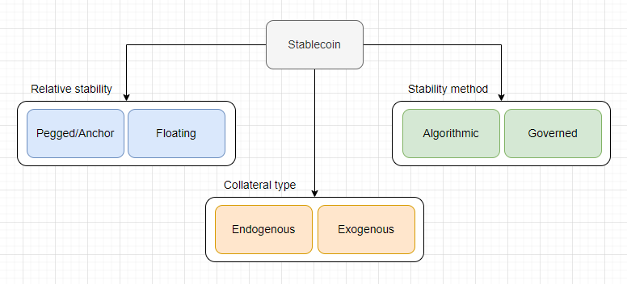
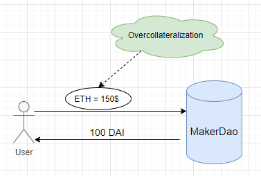
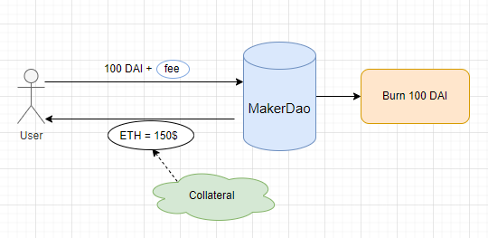
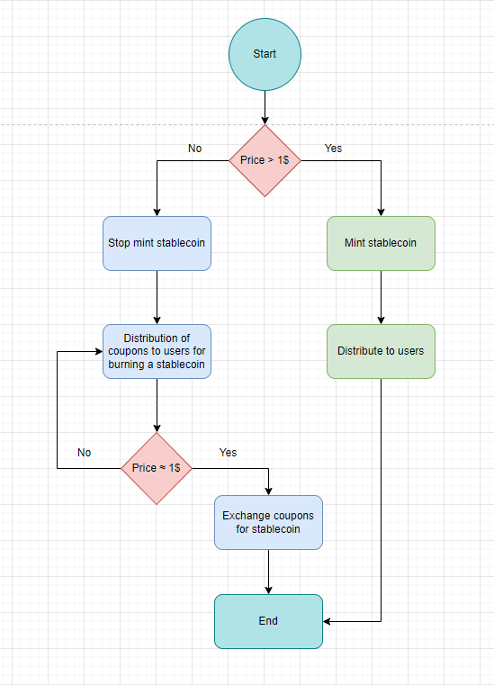
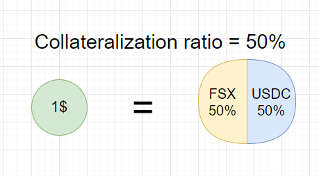
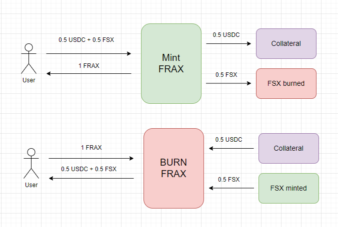
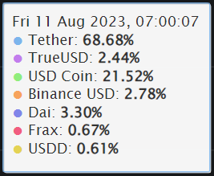

# Stablecoin

_Опр!_ Стейблкоин - это тип криптовалюты, стоимость которой привязана к некоторому активу(фиатные средства, другие криптовалюты, драгоценные металлы и т.д.) и остается стабильной относительно других активов рынка. Стабильная стоимость достигается за счет хранения резервных активов или применения алгоритмов, управляющих спросом и предложением стейблкоина.

_Важно!_ Стейблкойны помогают пользователям застраховаться от волатильности криптовалют и являются надежным средством обмена.

На момент написания статьи, согласно сервису [CoinGecko](https://www.coingecko.com/), существует 85 стейблкоинов. В их число входит только что появившийся [PYUSD](https://www.coingecko.com/en/coins/paypal-usd) от компании [PayPal](https://www.paypal.com/ru/home). Читал одну статью, где ребята пророчили 4-е место для PYUSD через год. 😅 Проверить на каком месте PYUSD сейчас можешь [тут](https://www.coingecko.com/en/categories/stablecoins).


Все стейблкоины можно разделить на две группы:
- **Централизованные**. Яркий представитель: **USDT**. Актив выпускается централизованной организацией, зачастую после получения фиатных средств. Характеризуется отсутствием прозрачности в реальном количестве резервных средств, которые должны обеспечивать необходимую привязку.
- **Децентрализованные**. Яркий представитель: **DAI**. Управление почти полностью выполняется заранее определенными правилами смарт-контракта. Характеризуется прозрачностью хранения резервов для сохранения привязки к активу.

По мимо прочего стейблкоин является цифровым активом и всегда имеет привязку к другому активу(например доллару). Поэтому для поддержания легитимности и полезности в качестве способа оплаты он должен иметь некоторую "поддержку" в виде другого ценного актива, на который его всегда можно обменять. Подобная "поддержка" называется **обеспечением**.

## Категории стейблкоинов

Вдохновленный [учебным курсом](https://www.youtube.com/watch?v=wUjYK5gwNZs&list=PL4Rj_WH6yLgWe7TxankiqkrkVKXIwOP42&index=4&ab_channel=PatrickCollins) по стейблкоину от Патрика Коллинса(разработчик из [Chainlink](https://chain.link/)) я бы хотел сгруппировать стейблкоины по предложенным им категориям со своими дополнениями.



1. **Relative stability.** По типу привязки: pegged or floating. Привязанный или изменяющийся относительно другого актива.
    - **Pegged**. Пример: USDT, DAI, USDC. Все эти стейблкоины привязаны к доллару. Это фактически означает, что 1 USDC = 1\$ и в банке под каждый токен USDC физически имеется 1\$.
    - **Floating**. Нет привязки к рыночным активам. Стабильность привязки достигается алгоритмически, путем регулирования спроса и предложения. Пример: [RAI](https://reflexer.finance/)
2. **Stability method.** По типу механизма удержания привязки: governed or algorithmic. Управляемый или алгоритмический. Любой механизм привязки основан на возможности управления количеством токена на рынке путем создания(mint) и сжигания(burn).
    - **Governed**. Управляется централизовано организацией или компанией c участием в процессе минтинга и сжигания человека. Пример: USDT, USC, TUSD.
    - **Algorithmic**. Стабильность привязки обеспечивается прозрачным алгоритмом с математическими вычислениями или организацией кода для минтинга и сжигания без вмешательства извне. Пример: DAI, RAI, FRAX, UST, LUNA.
3. **Collateral amount.**
    - **Partially-collateralized**. Частично обеспеченный. Например UST, который был обеспечен токеном LUNA, но при этом имел алгоритмическую составляющую, которая поддерживала привязку без участия обеспечения.
    - **Fully-collateralized**. Например, USDT, USDC, BUSD, которые являются полностью обеспеченными. У этих стейблкоинов, каждый токен поддерживается одним американским долларом на банковском счете.
    - **Over-collateralized**. Например DAI, для его создания залог превышает его номинальную стоимость. Такое обеспечение гарантирует дополнительную стабильность и снижает риск потери привязки.
4. **Collateral type.** По типу обеспечения: эндогенный или экзогенный.
    - **Экзогенный collateral**. Такое обеспечение формируется off-chain за пределами протокола. Например, ETH является обеспечением для DAI. Если c DAI случится что-то плохое(тьфу, тьфу, тьфу, не сглазить бы), то случится ли тоже самое с ETH? Ответ: нет, ETH будет по-прежнему использоваться и за пределами DAI. Следовательно, обеспечение DAI в виде ETH является экзогенным.

    - **Эндогенный collateral.** Такое обеспечение формируется on-chain внутри протокола. Например, токен LUNA была обеспечением стейблкоина UST. Чтобы создать UST, нужно было сжечь LUNA, и наоборот. Они были созданы вместе внутри одного протокола. Если с UST что-то случается, то и с LUNA будет беда. Это уже было доказано на практике краха LUNA. Поэтому обеспечение в виде LUNA для UST является эндогенным.

Ниже разберем наиболее интересные категории стейблкоинов.

## Стейблкоины с избыточным обеспечением

**Стейблкоины с избыточным обеспечением** — это стейблкоины, которые требует избыточное залоговое обеспечение для поддержания привязки стоимости к определенному активу. Такой резерв часто называют сверхобеспечением.

Стейблкоин DAI от [MakerDAO](https://makerdao.com/en/) — первый стейблкоин с избыточным обеспечением. DAI привязан к доллару в соотношении 1:1. Создание DAI и поддержание привязки управляются системой кредитования протокола Maker.

Протокол **MakerDAO** предназначен для кредитования пользователей. Для займа DAI необходимо сверхобеспечение залоговым активом. В кредитном протоколе указана 150-процентная система залога. То есть пользователи могут создавать себе DAI, блокируя 150% стоимости DAI, которую они хотят одолжить, в смарт-контракте.

На первый взгляд может показаться, что это бессмысленно и менее эффективно с точки зрения капитала. Для займа актива необходимо предоставить протоколу 150% стоимости этого актива. Однако у такого подхода есть несколько причин:

1. **Устойчивость к волатильности**
Криптовалюты часто подвержены высокой волатильности. В этом случае сверхобеспечение гарантирует, что стейблкоин будет поддерживаться даже при значительных колебаниях стоимости заложенного актива. В случае экстремальных ситуаций на рынке(черного лебедя) сверхобеспечение выступает в роли дополнительной защиты.

2. **Увеличение доверия пользователей**
Сверхобеспечение увеличивает уровень доверия к стейблкоину. Пользователи могут быть уверены, что каждый стейблкоин, который попадает к ним в руки имеет обеспечение, значительно превышающее его стоимость.

3. **Процентные ставки и финансовые инструменты**
На платформах со сверхобеспечением, и MakerDAO не исключение, пользователи могут зарабатывать дополнительное вознаграждение за предоставление активов в качестве залога. Также это может открывать другие возможности участия в финансовых инструментах: майнинг, стейкинг, голосование и тому подобное.

> Пример!
> Чтобы приобрести DAI на сумму 100\$, необходимо предоставить залог в размере ETH в эквиваленте 150\$ или других активах, разрешенных протоколом для использования в виде залога.



Полученный DAI можно использовать, как любую другую криптовалюту. Сверхобеспечение гарантирует, что каждый DAI в обращении обеспечен избыточным запасом активов. Проценты начисляются с течением времени на заимствованные DAI. Когда полученный DAI и проценты за использование возвращаются протоколу, у пользователя появляется возможность забрать залог обратно. При этом DAI будут сожжены.



На случай если рыночная стоимость обеспечения упадет в протоколе **MakerDao** предусмотрен механизм **ликвидации**. Это автоматическое выставление займа пользователя, на аукцион по продаже залога для аннулирования долга пользователя. В первой версии протокола это был [английский аукцион](https://en.wikipedia.org/wiki/English_auction), во второй - [голландский](https://en.wikipedia.org/wiki/Dutch_auction).

Особенно стоит отметить, что кредитные протоколы работают по подобному принципу. Заемщик может взять заем, но для этого ему необходимо обеспечить заем передав протоколу некоторое количество установленного актива. Примеры кредитных протоколов: [Aave](https://aave.com/), [Compound](https://compound.finance/), [Liquity](https://www.liquity.org/).

_Важно!_ Стейблкоин DAI предусматривает возможность изменять процентные ставки через DAO протокола. Это означает, что он частично **управляемый**. Однако его стабильность привязки управляется смарт-контрактами, поэтому он еще является **алгоритмическим**.

## Алгоритмические стейблкоины

Смарт-контракты алгоритмических стейблкоинов реализованы так, чтобы была возможность реагировать на показатели спроса и предложения для поддержания заданной привязки и стабильности цены.

Алгоритмические стейблкоины можно разделить на три категории:
  - Модель ребейза.
  - Модель с доходом, получаемым от эмиссии стейблкоинов(сеньораж).
  - Модель фракционная.

### Модель ребейза

Модель ребейза контролирует стоимость стейблкоина, изменяя его количество в обращении. Если цена стейблкоина выше или ниже необходимой привязки, протокол автоматически увеличит или уменьшит количество стейблкоина на счету каждого владельца в течение фиксированного периода времени.

Такая привязка работает, потому что контролируя объем стейблкоина в обращении, можно влиять на стоимость стейблкоина, основываясь на простой [инфляционной/дефляционной экономической теории](https://www.coindesk.com/learn/inflationary-and-deflationary-cryptocurrencies-whats-the-difference/).

Стейблкоин [AMPL](https://www.coingecko.com/en/coins/ampleforth) проекта [Ampleforth](https://www.ampleforth.org/) полностью реализует модель ребейза. Количество стейблкоина увеличивается и уменьшается в соответствии со средневзвешенной ценой за день([TWAP](https://en.wikipedia.org/wiki/Time-weighted_average_price#:~:text=In%20finance%2C%20time%2Dweighted%20average,achieve%20the%20TWAP%20or%20better.)). Каждый держатель пропорционально «участвует» в каждом изменении предложения.

> Пример!
> Если Алиса владеет 100 AMPL перед увеличением предложения на 10%, то после увеличения Алиса будет владеть 110 AMPL; если у Боба было 10 AMPL, теперь у него 11 AMPL.

У **Ampleforth** модель ребейза реализуется непосредственно на контракте токена. Подробнее код можно посмотреть [тут](https://etherscan.io/address/0xd0e3f82ab04b983c05263cf3bf52481fbaa435b1#code).

В контракт внедряется функция `rebase()`.

``` solidity
/**
 * @dev Notifies Fragments contract about a new rebase cycle.
 * @param supplyDelta The number of new fragment tokens to add into circulation via expansion.
 * @return The total number of fragments after the supply adjustment.
 */
function rebase(uint256 epoch, int256 supplyDelta)
    external
    onlyMonetaryPolicy
    returns (uint256)
{
    if (supplyDelta == 0) {
        emit LogRebase(epoch, _totalSupply);
        return _totalSupply;
    }

    if (supplyDelta < 0) {
        _totalSupply = _totalSupply.sub(uint256(supplyDelta.abs()));
    } else {
        _totalSupply = _totalSupply.add(uint256(supplyDelta));
    }

    if (_totalSupply > MAX_SUPPLY) {
        _totalSupply = MAX_SUPPLY;
    }

    _gonsPerFragment = TOTAL_GONS.div(_totalSupply);

    emit LogRebase(epoch, _totalSupply);
    return _totalSupply;
}
```

Функция может вызываться только **monetaryPolicy** адресом, который был заранее установлен владельцем контракта. Функция принимает параметр **supplyDelta**, который указывает на сколько необходимо скорректировать общее количество(**totalSupply**) токена AMPL.

Дальше происходит самое важное: эта функция обновляет приватную переменную **_gonsPerFragment**. Именно эта переменная участвует в расчете баланса каждого пользователя, тем самым увеличивая или уменьшая его.

``` solidity
/**
 * @param who The address to query.
 * @return The balance of the specified address.
 */
function balanceOf(address who) external view override returns (uint256) {
    return _gonBalances[who].div(_gonsPerFragment);
}
```

_Важно!_ Модель ребейза имеет под собой два хороших обоснования: **простота** и **справедливость**. Элегантное, легкое и понятное решение по праву претендует на звание самой честной модели реализации алгоритмического стейблкоина, позволяя всем владельцам токена сохранять свою долю в сети после каждого ребейза. Однако существует мнение, что стабильность привязки должна достигаться не только стабильностью стоимости, но и количественной стабильностью сбережений. Модель ребейза решает первую задачу, но не вторую.

Получается, что покупательная возможность держателя стейблкоина на базе модели ребейза изменчива на столько на сколько меняется баланс его кошелька.

Другие токены с подобной моделью можно посмотреть [тут](https://www.coingecko.com/en/categories/rebase-tokens).

### Модель сеньораж

Модель сеньораж контролирует стоимость стейблкоина при помощи системы вознаграждений, которая влияет на динамику рынка. Другими словами, модель держит привязку, управляя количеством стейблкоина.

- Если цена выше привязки, минтятся новые токены и выдаются участникам протокола, которые предоставляют ликвидность.

- Если цена ниже привязки, токены перестают минтиться и начинает работу механизм сокращения предложения. Появляется возможность приобрести специальный купон взамен сжигания базового токена, чтобы сократить предложение. Зачастую, эти купоны могут быть обменены на большее количество токенов в будущем, но только тогда, когда цена вернется или превысит предполагаемую привязку.



Механика с "купонами" требует реализации дополнительного токена, который позволит изолировать основной стейблкоин от динамики рынка.

Одним из представителей этой модели является проект [Empty Set Dollar](https://www.emptyset.finance/) со своим стейблкоином DSU и ESS в виде купонов. С контрактами этого проекта можно ознакомиться [тут](https://github.com/emptysetsquad/emptyset/tree/master).

Другие токены с подобной моделью можно посмотреть [тут](https://www.coingecko.com/en/categories/seigniorage).

### Модель фракционная

Фракционная модель алгоритмических стейблкоинов представляют собой комбинацию избыточного обеспечения и алгоритмизации. То есть для того, чтобы сминтить стейблкоин необходимо частично обеспечить его реальным активом(например, другим стейблкоином) и оставшуюся часть обеспечить алгоритмически. Такой подход имеет меньше рисков централизации и демонстрирует более высокий уровень стабильности.

Одним из первых подобную модель реализовал протокол [Frax.Finance](https://frax.finance/). В данный момент он поддерживает три стейблкоина:
  - **FRAX**. Стейблкоин, привязанный к доллару.
  - **FPI**(Frax Price Index). Стейблкоин, привязанный к корзине потребительских товаров.
  - **frxETH**(FraxEther). Стейблкоин, привязанный к ETH для использования в качестве замены обернутого эфира(WETH)

_Важно!_ Железное правило FRAX заключается в том, что 1 FRAX всегда можно создать или обменять на 1 доллар. Это одно из ключевых отличий от других стейблкоинов, что позволяет арбитражерам выравнивать стейблкоин на всем остальном рынке.

Для управления экосистемой и регулирования стабильности привязки используются: токен Frax Share(**FXS**) и **AMO(Algorithmic Market Operations Controller)**.

**AMO** - это группа автономных контрактов, которые следят за денежно-кредитной политикой до тех пор, пока привязка не изменится. После изменения привязки контроллеры AMO могут выполнять рыночные операции по стабилизации привязки. Но при этом AMO не может создавать из воздуха сам стейблкоин FRAX.

Непосредственно для регулирования привязки используется понятие **CR**(collateral ratio). Этот показатель, который напрямую коррелирует с рыночной стоимостью стейблкоина.

> Пример.
> Если цена FRAX выше 1\$, то **CR** уменьшается.
> Если цена FRAX ниже 1\$, то **CR** увеличивается.

CR равный 50% будет означать, что 1 FRAX(эквивалент 1$) будет обеспечен 50% FSX и 50% другого актива(например USDC, первая версия протокола требовала для обеспечения именно usdc)



Это означает, что для получения 1 FRAX необходимо 0.5 FSX и 0.5 USDC.



После `mint()` FRAX будут сожжены 0.5 FSX, а 0.5 USDC будут храниться в качестве залога.
Для сжигание FRAX и получения залога проводится обратная процедура.

Таким образом, AMO остается только управлять количеством **FXS** токена. Так как **FXS** является частичным обеспечением стейблкоина, то его количество позволяет удерживать привязку.

## Example

Продолжим вдохновляться Патриком Коллинсом и в качестве примера, вместе с ним, реализуем алгоритмический стейблкоин с фиксированной привязкой. Стейблкоин будет принимать в качестве обеспечения обернутый эфир(wETH) и биткоин(wBTC). Это говорит о том, что стейблкоин будет **exogenous**.

Расчет стоимости залога будет вестись в долларах. Для конвертации wETH и wBTC к USD будет использоваться децентрализованный оракул [chainlink](https://chain.link/).

Реализовано два контракта:
    - [StableCoin.sol](./contracts/src/StableCoin.sol)
    - [Engine.sol](./contracts/src/Engine.sol)

Контракт `StableCoin.sol` реализует стандарт токена ERC-20. С ограничением возможности минтить и сжигать токен только адресу, разрешенному владельцем контракта.

Контракт `Engine.sol` организует основную механику по реализации минтинга, сжигания, следит за соблюдением правил сверхобеспечения и в случае необходимости предоставляет механизм ликвидации обеспечения.

## Вывод

Стейблкоины не являются полноценным финансовым приложением, но они играют критически важную роль в мире DeFi-приложений. Несколько аспектов применения стейблкоинов:

1. **Средство обмена**. Стейблкоины предоставляют собой стабильное средство обмена, по сравнению с другими криптоактивами, которые подвержены высокой волатильности. Это особенно полезно для торговли и других финансовых операций.
2. **Ликвидность**. Стейблкоины часто используются в качестве пары для торговли на децентрализованных биржах. Они обеспечивают необходимую ликвидность и стабильность, позволяя пользователям легко обменивать один актив на другой.
3. **Долгосрочное хранение**. DeFi предлагает разнообразные способы инвестирования и заработка, а стейблкоины напротив предоставляют возможность безопасного хранения средств без необходимости конвертировать их в фиатные валюты.
4. **База для других инструментов**. Стейблкоины могут быть интегрированы в смарт-контракты и предоставлять основу для более сложных финансовых инструментов, таких как деривативы, займы, страхование и тому подобное.
5. **Учет и аудит**. Использование стейблкоинов упрощает учет и аудит, так как все транзакции записываются на блокчейне и доступны для проверки. Это призвано снизить риски мошенничества или ошибок в финансовой отчетности.

Несмотря на это, влияние действительно децентрализованных стейблкоинов пока еще мало. Согласно [CoinGecko](https://www.coingecko.com/), Tether полностью доминирует на рынке криптовалют. Чуть меньше четверти рынка за USD Coin.



Однако существуют аргументы против полной децентрализации стейблкоинов:
  - **Отсутствие стабильности**. Как показала практика, некоторые стейблкоины имели ощутимые отклонения от привязки, а некоторые вовсе ее теряли. Чего только стоит [неудача](https://indianexpress.com/article/technology/crypto/luna-terra-crash-a-brief-history-of-failed-algorithmic-stablecoins-7934293/) Luna.
  - **Обвинения в мошенничестве**. Было зафиксировано несколько [обвинений](https://www.sec.gov/news/press-release/2023-32) на тему того, что команды децентрализованных стейблкоинов "уводят средства пользователей". Это довольно серьезно сказывается на доверие пользователей к подобным проектам.
  - **Централизация**. Как ни странен этот пункт, но остается множество вопросов на сколько децентрализованные стейблкоины децентрализованные. Зачастую используется система DAO, но подобная система подвержена изменениям против воли сообщества.

И все-таки идеальная децентрализованная система стейблкоина имеет множество преимуществ перед централизованными версиями. Подобная система управляется математикой и устойчива к влиянию третьих лиц. Я думаю, что для успеха децентрализованных алгоритмических стейблкоинов нужно больше времени. Будем следить за ними дальше!

## Links

1. [Видео](https://www.youtube.com/watch?v=wUjYK5gwNZs&list=PL4Rj_WH6yLgWe7TxankiqkrkVKXIwOP42&index=3&ab_channel=PatrickCollins) про стейблкоин от Patrick Collins из chainlink. Урок 12.
2. [What are Decentralized Stablecoins? A Look At DAI, GHO, crvUSD, FRAX, and More](https://www.coingecko.com/learn/what-are-decentralized-stablecoins#4)
3. [Stability, Elasticity, and Reflexivity: A Deep Dive into Algorithmic Stablecoins](https://insights.deribit.com/market-research/stability-elasticity-and-reflexivity-a-deep-dive-into-algorithmic-stablecoins/)
