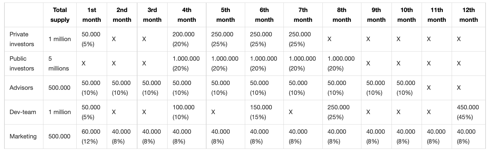
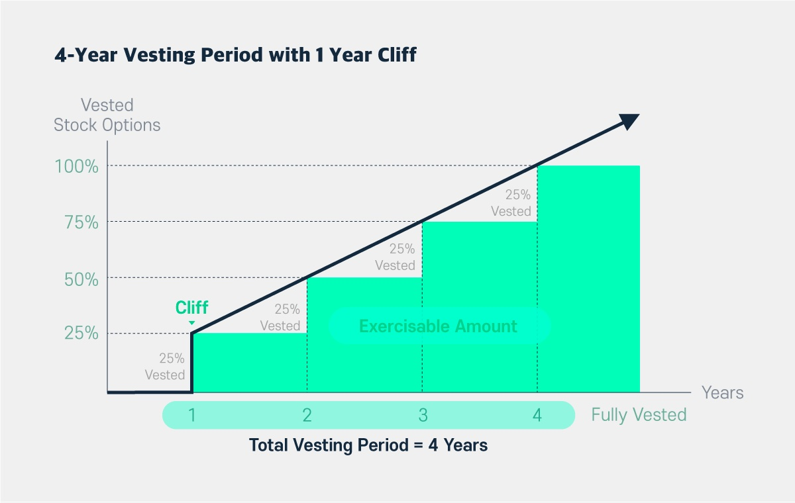
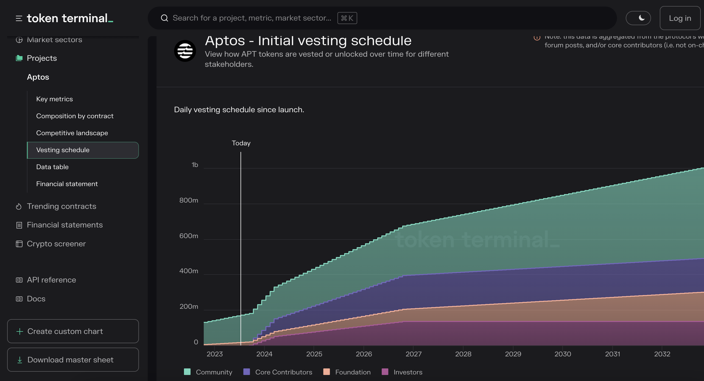
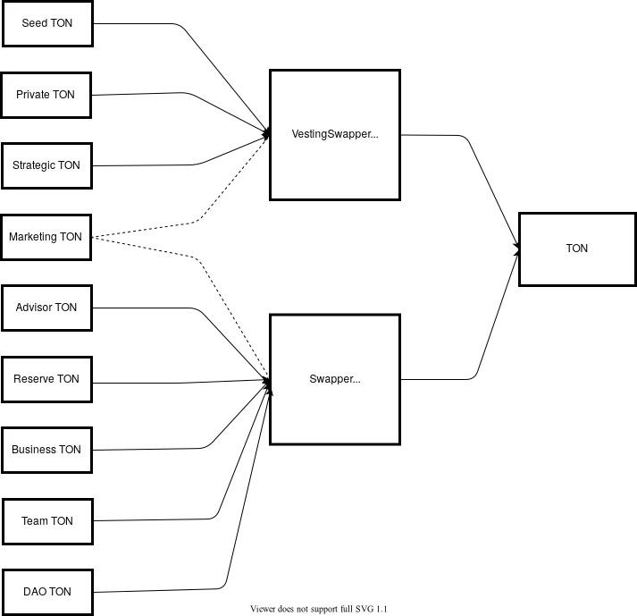
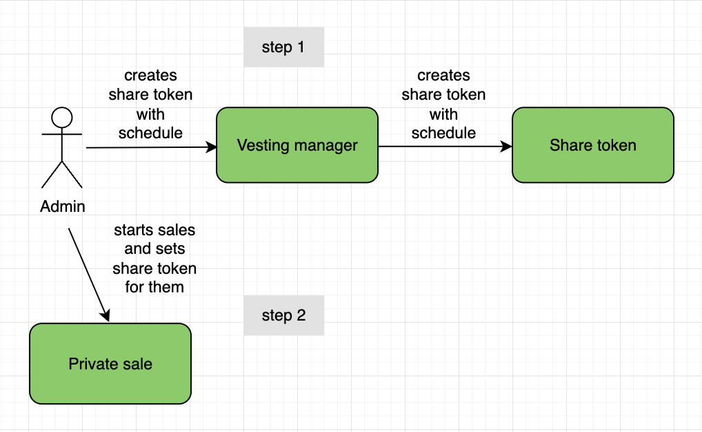
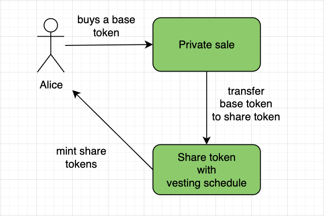
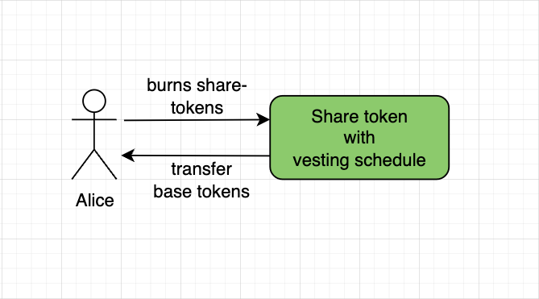
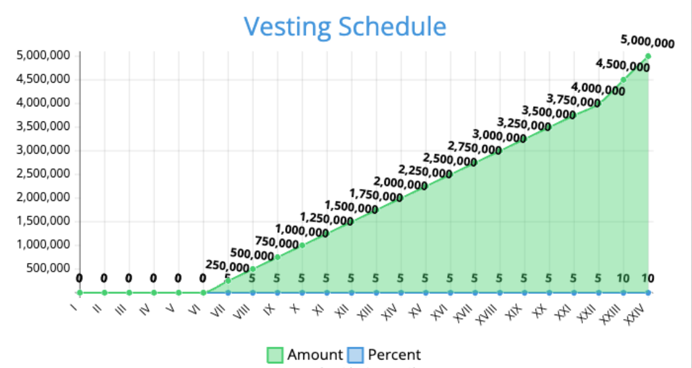

# Вестинг

**Автор:** [Роман Ярлыков](https://github.com/rlkvrv) 🧐

## Что такое вестинг?

Вестинг — это собирательное название различных приёмов, подходов и паттернов модели распределения токенов после токенсейла или другого вида продажи криптоактивов.

В традиционных финансах термин "вестинг" (vesting) - это получение права на распоряжение активами (например, акциями или пенсионными накоплениями) после определенного периода времени или выполнения условий. К примеру, работники могут получать акции компании, но продавать их сразу не смогут. Это обеспечивает их заинтересованность в успехе компании а также предотвращает давление со стороны продавцов на биржах, которое будет снижать цены акций.

Вестинг в криптовалютах - неотъемлемая часть [токеномики](https://medium.com/coinmonks/tokenomics-4-factors-that-determine-a-cryptos-success-858ee7a0cf94) проекта которая в свою очередь выстраивается с учетом психологии людей и математических моделей. Все это позволяет держать цену токена под контролем, по крайней мере сдерживать ее в каких-то диапазонах. Часто можно увидеть, что продажа токенов включает в себя большое число фаз: сид-раунды, приватные раунды, стратегические, ICO и др. Причем в разных раундах цена может отличаться в разы.

Хороший и сбалансированный график распределения токенов во времени управляет колебаниями цен и общей целостностью проекта, в особенности защищает от массовой распродажи токенов сразу после их листинга на бирже и позволяет контролировать цену в долгосрочной перспективе. Вестинг также может быть использован для поощрения участников проекта, например, разработчиков или маркетологов которые получают токены в качестве вознаграждения за свою работу.

Важно понимать, что под вестинг блокируются не все токены, потому что это просто напросто убьет всю ликвидность. Обычно вестинг подразумевает блокировку 10-20% от общего количества токенов - это могут быть токены команды, инвесторов, консультантов и т.д.
## Какие виды вестинга существуют?

Существует две наиболее популярные модели: календарный и поэтапный вестинг.

### Календарный вестинг

Модель распределения проекта для календарного вестинга может выглядеть так:

-   **Ранние инвесторы**: всего для них выделен 1 млн токенов. В первый месяц после старта они получают 5% токенов от всей выделенной им суммы. Во второй и третий месяцы остальные их средства остаются заблокированными. В четвертый месяц они получают 20% токенов, и далее каждый месяц по 25% оставшихся.

-   **Публичные инвесторы**: всего для них выделено 5 млн токенов. Первые три месяца они не могут претендовать на токены вовсе, их средства заблокированы. Такой период от начала вестинга до первого получения токенов называется cliff. Для публичных инвесторов он составляет 3 месяца. Далее они получают каждый месяц по 20%.

          Cliff — время между началом вестинга и первой выплатой токенов после разблокировки.

-   **Эдвайзеры**: всего для них выделено 500 000 токенов. Они могут получать свои токены каждый месяц по 10% от суммы, в течение 10 месяцев соответственно.

-   **Команда разработчиков**: всего для них выделен 1 млн токенов. Для повышения мотивации работы над продуктом и увеличения доверия они получают большую часть своих токенов только через год. В первый месяц разблокируется 5%, затем только на четвертый месяц в размере 10%, на шестой месяц — 15% и на восьмой — 25%. Оставшиеся 45% токенов будут заблокированы до двенадцатого месяца после начала вестинга.

-   **Маркетинг**: всего для поддержания кампании маркетинга выделено 500 000 токенов с разблокировкой в течение года. В первый месяц становится доступно 12% общей суммы, а далее каждый месяц по 8% токенов.

_Таблица. Календарь вестинга_

### Поэтапный вестинг

В поэтапном вестинге разблокировка происходит не в отдельные периоды, а с течением времени. Самый популярный вид поэтапного вестинга - линейный, но существуют и другие: ступенчатый, квадратичный и т.д.

В линейном вестинге разблокировка токенов происходит с каждой секундой или при создании новых блоков, а в ступенчатом -- по заранее определенному расписанию.

Расписание вестинга определяет скорость, с которой права на активы передаются бенефициару. Периоды могут сильно различаться в зависимости от конкретного соглашения, но обычно они составляют от 1 до 4 лет. Часто расписание вестинга изображается в виде графика.

Пример ступенчатого вестинга, когда распределяется по 25% от общего предложения токенов в год.

_Пример ступенчатого 4-х летнего вестинга с годовым cliff._

В поэтапном вестинге также может быть cliff период. Например, мы хотим начать продажи токенов в январе с cliff-периодом полгода. В таком случае выплаты начнутся только в июле, а до этого времени все токены будут заблокированы.

Посмотреть расписание для конкретных монет можно с помощью сервиса [tokenterminal.com](https://tokenterminal.com/)
Для этого необходимо зайти в dashboard, выбрать проект и посмотреть вкладку Vesting Schedule. На скриншоте ниже расписание наделения правами на токены проекта Aptos.

_Расписание наделения правами на токены проекта Aptos_

## Выплаты токенов

Выплаты токенов осуществляются в соответствии с расписанием о котором говорилось выше. Есть два основных подхода к выплатам: так называемые push и pull.

**Pull**: При использовании метода pull бенефициар может сделать claim (потребовать) свои токены, инициируя транзакцию на блокчейне. По окончании вестинга токены разблокируются, но остаются в смарт-контракте до тех пор, пока бенефициар не переведет их на свой кошелек или указанный адрес. Такой подход дает держателю токенов больше возможностей для контроля над тем, когда он получит свои токены, поскольку он может выбирать конкретные сроки получения токенов.

Пример: по графику наделения на каждый месяц заложено по 10% разблокировки от общей суммы, это означает что через пол месяца можно будет забрать 5% или к примеру не забирать ничего 3 месяца и потом получить 30% сразу.

**Push:** При использовании метода push наделенные правами токены автоматически переводятся на адрес бенефициара, не требуя от него никаких действий.

Таким образом бенефициару не нужно тратиться на оплату газа за транзакции клейма токенов, но есть и обратная сторона - бенефициар не имеет контроля над тем, когда именно будут переданы токены, поскольку это зависит от расписания выплат и правил установленных на смарт-контракте.

## Вопросы по технической реализации

Здесь заканчивается общая информация по вестингу и приводится обзор технических решений для реализации на смарт-контрактах.

При всей простоте основной идеи вестинга (блокировка токенов после покупки с последующей разблокировкой по графику), техническая реализация может сильно отличаться от проекта к проекту. Фантазия менеджеров продукта и принципы децентрализации диктуют свои правила, поэтому перед тем, как реализовать его на смарт-контрактах нужно ответить на ряд вопросов.

1. Какой вид вестинга планируется использовать? (линейный, ступенчатый, календарный и т.д)?
    - У всех пользователей будет одно расписание или оно будет различаться для каждого бенефициара?
2. Как токены будут блокироваться? Во время токенсейла или для управляющих проектом? (к примеру вестинг для разработчиков или маркетологов).
    - Если на токенсейле, то на каких фазах продаж токены должны блокироваться? (публичные, приватные и т.д)
    - Если это распределение на команду, то какое количество адресов будет участвовать в вестинге?
3. Когда будет запускаться вестинг? В какой момент? (после начала продаж, по окончанию продаж, в момент покупки)
4. Будет ли период cliff?
    - Какие действия можно выполнять с токенами в период cliff?
    - Какие действия нельзя выполнять с токенами в период cliff?
5. Как токены будут блокироваться после покупки: на кошельке пользователя, на отдельном контракте либо и то и другое? (например, пользователь может получать share-токены которые в дальнейшем обменяет на базовый токен, который был заблокирован)
6. Как токены будут разблокироваться и выплачиваться?
    - Какой подход будет использоваться (push или pull)?
    - Какое будет расписание выплат?
    - Кто и когда может устанавливать расписание выплат?
    - Если вестинг к примеру на команду, то можно ли запускать вестинг без токенов на смарт-контракте или выводить их до начала выплат? Как это повлияет на время старта вестинга?

Эти и многие другие вопросы могут возникнуть в процессе реализации вестинга. Ниже я опишу, как архитектурно могут выглядеть различные варианты вестинга на смарт-контрактах и какие у них есть преимущества и недостатки.

## Варианты реализации вестинга

### **1. На смарт-контракте токена ERC20**

Один из подходов к реализации вестинга в криптовалютных проектах заключается в том, чтобы включить вестинг непосредственно в смарт-контракт токена. Этот метод предполагает связывание смарт-контракта частных продаж со смарт-контрактом токена (либо функционал продаж также должен быть на смарт-контракте токена). В процессе продажи, определенное количество токенов блокируются для конкретного пользователя. Если проводятся несколько раундов частных продаж, то также может присваиваться идентификатор вестинга.

Расписание выплат в смарт-контракте токена могут устанавливать администраторы смарт-контракта, либо другие, специально созданные для этого роли.

### Результат:

#### Плюсы:

1. Базовые (заблокированные) токены находятся на кошельке пользователя. Однако если функция отображения баланса будет изменена, то этот пункт нельзя будет считать плюсом, может возникнуть путаница, поэтому про отображение балансов (заблокированных и разблокированных) стоит задуматься на старте.
2. Нет необходимости вызывать отдельную транзакцию для клейма токенов. Они просто станут доступны, т.е. баланс пользователя будет увеличиваться с какой-то периодичностью.

#### Минусы:

1. Считается хорошей практикой код смарт-контракта токена делать "чистым", который легко читается и понятен. Любая дополнительная логика требует тщательных проверок, а в идеале -- хороших аудитов.
2. С новым функционалом неизбежно придется добавлять дополнительные роли, что увеличивает риски взломов и ошибок, т.к. самая уязвимая часть в смарт-контракте это всегда человек, который может что-то в нем изменить, либо задать неправильные параметры. Придется выстраивать более сложную защиту и менеджмент админского функционала.
3. Для корректного отображения баланса и для выполнения проверок при переводе токенов потребуется доработка стандартных методов типа `transfer` и `balanceOf`. Кроме того, если продажами будет заниматься отдельный смарт-контракт, то у токена появляются внешние зависимости. Это также добавляет возможности для потенциальных уязвимостей. Поэтому, на поиск надежного и оптималного решения для подобного функционала может потребоваться больше времени.
4. Если отображение баланса не тронуто, то существует проблема, когда токены есть, но необходимо проверить, какую часть из них можно потратить, а какая разблокируется позже.
5. Такое решение повышает риск возникновения ошибок и потенциальных угроз. Сложность еще больше возрастает в связи с тем, что как правило проводится несколько раундов частных продаж, а значит, будет несколько разных расписаний вестинга.
6. По окончании вестинга, на смарт-контракте останется "мертвый" код. Проверка при передаче токенов будет осуществляться в течение всего времени жизни контракта, а это хоть и незначительно, но увеличивает затраты на газ.

Подводя итог по этой реализации можно сказать, что это не самое лучшее решение. Функционал вестинга необходим только для определенного периода, и, если он будет как-то связан с токеном, то такая связь и "мертвый" (неиспользуемый) код останутся навсегда. Мне не удалось даже найти подходящих примеров кода смарт-контрактов с такой реализацией.

### **2. Реализация вестинга системой смарт-контрактов**

Другим подходом к реализации вестинга является использование системы смарт контрактов. В качестве примера, расмотрим проект TON ([Tokamak Network Token](https://medium.com/onther-tech/ton-token-vesting-system-29588659260)). Это целая экосистема в которой целевой токен (TON) "делится" на токены, которые выступают в роли "долей" на целевой токен. На каждом этапе продаж покупатель получает токен разного типа, например `SeedTON`, `PrivateTON` или `StrategicTON`. Всего в системе девять таких токенов, и весь объем предложения разделен между ними. Эти токены имеют свою цену по отношению к целевому токену, и у каждого из них свое расписание выплат. В соответствии с этим расписанием share-токены в дальнейшем обмениваются на целевые токены, а share-токены при этом сжигаются. Это происходит через специальный смарт-контракт `Swapper`, при этом целевые токены также хранятся отдельно. Передача share-токенов невозможна -- за это отвечает отдельный смарт-контракт.

В данную экосистему входит около 15 смарт-контрактов. Целевые и дочерние токены разработаны особым образом (внешне они являются токенами ERC20, но внутри реализованы совершенно по-другому). Архитектура была построена на основе сложной токеномики проекта. В этом [репозитории](https://github.com/tokamak-network/presale-contracts/tree/master/contracts) можно ознакомится со смарт-контрактами TON.

_Система смарт-контрактов TON_

### Результат:

### Плюсы:

1. Токены будут храниться на кошельке пользователя.
2. Не будет проблем с отображением баланса.
3. Изящное децентрализованное решение.

### Минусы:

1. Пользовательский опыт: покупатели должны понимать концепцию токена вестинга и процесс выкупа. Необходима хорошая документация, гайды и удобные интерфейсы.
2. Используется подход выплат pull. Это значит, что бенефициару потребуется выполнить две транзакции: покупка и клейм.
3. Несмотря на то, что покупатель будет владеть токенами-акциями, он не сможет ничего с ними сделать, кроме как обменять на целевой токен. Любая транзакция будет фейлиться.
4. Самый главный минус - это высокая сложность реализации подобной системы, которая далеко не всегда необходима.

## **3. Вестинг на отдельном смарт-контракте**

Самый популярный подход к реализации вестинга в криптовалютных проектах заключается в размещении логики вестинга в отдельном смарт-контракте. В этом подходе существует масса различных вариантов, но я опишу только один из них, который мы опробовали на реальном проекте. Основная идея взята из предыдущего варианта, но реализация сильно отличается.

Тут важно внедрить два понятия, чтобы не было путаницы:

1. **Базовый токен** - это основной токен проекта или целевой токен, который покупает пользователь для которого собственно и нужен вестинг.
2. **Share токен** - это токен-пустышка, который мы выдаем пользователю как ваучер, который ему нужно будет погасить чтобы забрать базовый токен по курсу 1:1.

Наша реализация вестинга представляет собой комбинацию нескольких смарт-контрактов:

-   смарт-контракт приватных продаж базового токена
-   смарт-контракт share-токена (с логикой вестинга)
-   смарт-контракт для создания share-токенов с установкой расписания

**Контракт приватных продаж.** Его основная задача -- продажа токенов через вайтлист. Также, он отвечает за управление параметрами продажи и  прием платежей. Но, самое важное для нас в данном случае -- он отвечает за чеканку share-токенов покупателям. Вся фишка в том, что в момент продажи мы переводим покупаемые токены не пользователю, а на смарт-контракт share-токена, где они блокируются. Пользователю в свою очередь чеканятся share-токены.
Пример такого смарт-контракта я здесь приводить не буду, т.к. фактически это может быть даже обычный EOA, все, что от него потребуется - выдать апрув на базовый токен для share-токена, после чего можно будет его минтить.

В дальнейшем на этом контракте он сможет склеймить базовый токен, при этом ему нужно будет сжечь свои share-токены, но сделать это можно будет в соответствии с установленным расписанием вестинга.

Тут важно упомянуть, что устанавливается только время начала продаж, а временем окончания будет время начала вестинга, которое было установлено на контракте share-токена. Если время старта продаж еще можно поменять, как и некоторые другие параметры продажи, то время окончания поменять не выйдет. Это сделано для того чтобы пользователи были защищены от манипуляций. Их средства будут заблокированы, а вывести их сможет только сам пользователь, когда сожжет свои share-токены. При этом один и тот же share-токен может использоваться в нескольких раундах продаж, пока не начнется сам вестинг.

**Контракт share-токена**. Или вестинг-токен. Он может носить любое название. Главное -- понимать суть: это токен-пустышка. Его нельзя будет продать или перевести другому кошельку. Запрещены все переводы этого токена и у него нет никакого управления со стороны админов.
У него четыре основные задачи:

-   чеканить;
-   сжигать;
-   хранить базовый токен;
-   рассчитывать количество заблокированных и разблокированных базовых токенов.

Минтером тут выступает контракт приватных продаж (напомню, что это может быть любой адрес у которого есть базовый токен). А сжигать эти токены будет сам пользователь, когда придет забирать свой базовый токен. Вывести токены с контракта просто так никто не сможет, это надежное хранилище.

Вот простой пример смарт-контракта [VestingToken](./examples/src/VestingToken.sol).

Такой подход позволяет создавать несколько share-токенов под разные раунды продаж. У каждого share-токена будет свое расписание вестинга. Плюс, он будет выступать пулом для базовых токенов с раунда продаж. Такой подход дал нам даже больше гибкости чем мы думали изначально, но об этом чуть позже.

На контракте реализована очень гибкая возможность установки расписания вестинга. Можно задавать дату и время обычным timestamp (т.е. с точностью до секунды), устанавливать сколько угодно периодов выплат с разными интервалами. Так же, можно очень гибко настраивать и проценты выплат в каждом интервале. Единственное условие - чтобы в сумме было 100%. Это дает возможность использовать самые разнообразные сценарии и графики наделения правами.

Вот к примеру расписание, которое можно установить. Здесь представлен вестинг на 2 года с периодом cliff 6 месяцев и меняющимся процентным соотношением выплат (последние два месяца выплачивается по 10%, а все предыдущие по 5%):

| Month | Percent % | Amount  |
| ----- | --------- | ------- |
| 1     | 0         | 0       |
| 2     | 0         | 0       |
| 3     | 0         | 0       |
| 4     | 0         | 0       |
| 5     | 0         | 0       |
| 6     | 0         | 0       |
| 7     | 5         | 250,000 |
| 8     | 5         | 250,000 |
| 9     | 5         | 250,000 |
| 10    | 5         | 250,000 |
| 11    | 5         | 250,000 |
| 12    | 5         | 250,000 |
| 13    | 5         | 250,000 |
| 14    | 5         | 250,000 |
| 15    | 5         | 250,000 |
| 16    | 5         | 250,000 |
| 17    | 5         | 250,000 |
| 18    | 5         | 250,000 |
| 19    | 5         | 250,000 |
| 20    | 5         | 250,000 |
| 21    | 5         | 250,000 |
| 22    | 5         | 250,000 |
| 23    | 10        | 500,000 |
| 24    | 10        | 500,000 |

Вот так это будет выглядеть на графике:

_Расписание вестинга_

**Смарт-контракт для создания share-токенов**. В нашей системе он называется Vesting manager. По сути это фабрика share-токенов, которая под капотом работает с прокси паттерном [Minimal Clones](https://docs.openzeppelin.com/contracts/4.x/api/proxy#Clones) от Open Zeppelin. В момент создания нового токена помимо `name` и `symbol` также устанавливается расписание, адрес базового токена и адрес минтера, которым по задумке будет смарт-контракт приватных продаж. Контракт имеет возможность смены имплементации share-токена.

Здесь также можно посмотреть простой пример смарт-контракта [VestingManager](./examples/src/VestingManager.sol).

### Результат:

У такого подхода тоже есть свои плюсы и минусы, но в сравнение с предыдущими вариантами получилось оптимальное соотношение надежности, гибкости и скорости разработки. Это решение смело можно назвать децентрализованным и прозрачным для пользователя, т.к. единственная возможность потерять средства - это потерять доступ к своему кошельку. Также, внедрены различные механизмы защиты от ошибок админов, которые будут настраивать раунды продаж или расписание вестинга, но это отдельная история.

## Заключение

А теперь о том, почему последнее решение достаточно гибкое. В стартапах все меняется очень стремительно, от этого невозможно застраховаться, но, можно попробовать подготовиться. В нашем случае, заказчик принял решение в корне поменять изначальную задумку. Во-первых, за продажи теперь по большей части отвечал бэкенд, а во-вторых share-токены теперь нужно было сжигать в любое время и обменивать на НФТ. Все это в отрыве от расписания вестинга. К тому же нужно было сжигать и базовый токен тоже.

Функционал сжигания конечно породил ряд непростых задач, таких как создание бернинг-раундов и перерасчета расписания вестинга, но вот к продажам через бекенд основной контракт отвечающий за вестинг (share-токен) уже был готов. Нужно было только создать его через контракт-фабрику Vesting Manager, установить расписание и назначить минтером адрес бекенда.

Все это только подтверждает главную мысль этой статьи. Она в том, что в вестинге нет стандартов, типичных решений и никаких ориентиров в виде других проектов. Скорее всего, это всегда будет кастомное решение под конкретные задачи заказчика, которое будет солянкой из различных подходов как от других проектов, так и изобретенных с нуля.

## Ссылки

-   [Tokenomics: 4 Factors That Determine a Crypto’s Success](https://medium.com/coinmonks/tokenomics-4-factors-that-determine-a-cryptos-success-858ee7a0cf94)
-   [Tokamak Network TON Swap System Overview](https://medium.com/onther-tech/ton-token-vesting-system-29588659260)
