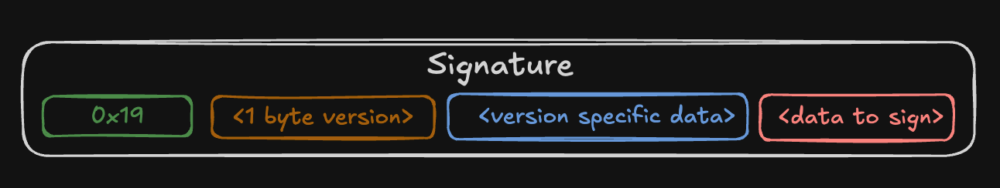
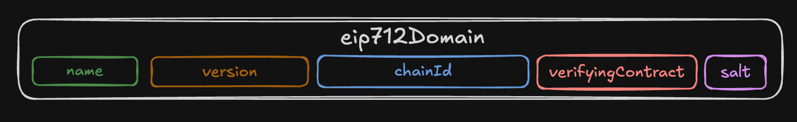

# EIP-712: Typed structured data hashing and signing

**Автор:** [Павел Найданов](https://github.com/PavelNaydanov) 🕵️‍♂️

EIP-712 - это стандарт для хеширования и подписи типизированных данных. Основная цель заключается в улучшение пользовательского опыта, позволяя кошелькам показывать человекочитаемые данные  подписи.

Стандарт является разновидностью [ERC-191](https://eips.ethereum.org/EIPS/eip-191). Согласно стандарту подпись формируется следующим образом:



`0x19` - говорит о том, что подпись используется в сети Ethereum и не является совместимой с RLP кодировкой, которая применяется для кодирования данных транзакций.
`1 byte version` - говорит о типе подписи: personal, EIP-712 и так далее.

Для EIP-712 оставшиеся поля описываются следующим образом:
- `<1 byte version>` = `0x01`. Указывает в подписи, что будет использоваться стандарт EIP-712. Все возможные типы версий описаны в [таблице стандарта ERC-191](https://eips.ethereum.org/EIPS/eip-191#registry-of-version-bytes).
- `<version specific data>` = `domainSeparator`. Термин `domainSeparator` вводится стандартом EIP-712 и служит для описания особенностей контекста подписи.
- `<data to sign>` = `hashStruct(message)`. Это хеш подписываемых пользователем данных.

## Кодирование domainSeparator

**DomainSeparator** является уникальным идентификатором контекста подписи и имеет три глобальные цели:
1. **Идентификация контекста** – включает в себя данные, чтобы гарантировать уникальность подписи.
2. **Защита от повторного использования** – если пользователь подписал данные для конкретного протокола, то они не могут быть действительным для другого протокола или сети.
3. **Оптимизация хеширования** – domainSeparator позволяет заранее вычислить часть хэша всей подписи, что ускоряет проверку подписи.

Описывается `domainSeparator` следующим образом:
```
domainSeparator = hashStruct(eip712Domain)
```

`hashStruct(eip712Domain)` - это хеш структуры, которая содержит следующие поля:



- `string name`. Название протокола, в котором будет использоваться подпись
- `string version`. Текущая версия домена подписи. Подписи из разных версий несовместимы. По сути это инструмент для версионирования подписей.
- `uint256 chainId`. Идентификатор цепочки. Используется EIP-155 для защиты от *replay attack*. Особенно необходимо, когда протокол работает в нескольких сетях.
- `address verifyingContract`. Адрес контракта, который будет проверять подпись. Используется для того, чтобы ограничить список проверяющих подпись.
- `bytes32 salt`. Соль для устранения неоднозначности протокола. Запасной вариант, который может использоваться для разграничения двух подписей с одинаковыми данными domainSeparator.

_Важно!_ Все поля структуры `eip712Domain` опциональны и должны включаться разработчиками в случае необходимости протокола.

## Кодирование данных подписи

Этот раздел описывает кодирование того, что в рамках EIP-191 мы определили, как `<data to sign>`, а в рамках EIP-712 как `hashStruct(message)`.

Но прежде, чем разбирать хеш структурированных данных необходимо понимать какие в принципе типы данных могут быть.

### Типы данных

Выделяют всего три типа данных:
1. **Атомарные типы**. Это `bytes1`, `bytes32`, `uint8`, `uint256`, `int8`, `int256` и так далее. Также `bool` и `address`. Важно, что не используются aliases `int`, `uint`. Также стандарт оставляет возможность добавления новых типов в будущем.
2. **Динамические типы**. Сюда относятся `bytes` и `string`.
3. **Ссылочные типы**. Это массивы и структуры. Массивы с динамическим размером обозначаются, как `Type[]`, c фиксированным размером `Type[n]`. Например, `address[]` или `address[5]`.

Важно знать и учитывать типы данных, потому что для некоторых из них есть нюансы при кодировании и проверке подписи на смарт-контрактах.

### Хеширование данных подписи

Посмотрим, что из себя представляет `hashStruct(message)`.

> hashStruct(message) = keccak256(typeHash ‖ encodeData(message))

Эту запись можно понять так, что хешируется при помощи keccak256 два объекта: `typeHash` и `encodeData(message)`.

`typeHash` - это константа, которая описывает хеш типов данных из message. Описать математически это можно следующим образом `typeHash = keccak256(encodeType(typeOf(message)))`.

`encodeData(message)` - это кодирование полей структуры данных `message`.

В коде мы будем описывать TYPE_HASH хешем строки, которая описывает типы поля `user` для абстрактной структуры `Order`:

```solidity
bytes32 private constant TYPE_HASH = keccak256("Order(address user)");
```

В роли `message` выступает значения адреса user, которое мы будем кодировать.

**encodeData**

Можно воспринимать это, как функцию, которая конкатенирует закодированные поля структуры `message` в том порядке, в котором они объявлены.

_Важно!_ Каждое закодированное значение члена имеет длину ровно 32 байта.

И вот здесь мы подошли к кодированию полей, которое зависит от типа самого поля.

**Значения атомарного типа**

Кодируются атомарные типы соответственно ABI v1 и v2. То есть `bool` кодируется, как число uint256 в значениях 0 или 1. Адреса кодируются как uint160. И так далее. Больше подробностей в [документации](https://docs.soliditylang.org/en/latest/abi-spec.html#formal-specification-of-the-encoding) Solidity.

При проверке подписи на смарт-контрактах не требуется дополнительно кодировать эти типы данных.

**Значения динамического типа**
Кодируются, как хеш контента при помощи функции `keccak256()`. `keccak256` - принимает набор байт и это означает, что чтобы хешировать строку, необходимо сначала строку преобразовать в `bytes` при помощи функции `abi.encodePacked()`.

При проверки подписи на смарт-контрактах, нам придется дополнительно кодировать эти данные.

```solidity
// string
string memory str = "test";
bytes32 encodedStr = keccak256(abi.encodePacked(str));

// bytes
bytes memory strInBytes = "test";
bytes32 encodedStrInBytes = keccak256(strInBytes);
```

**Значения ссылочного типа**

Массивы кодируются, как хеш конкатенированных значений массива. А структура, кодируется рекурсивно, как `hashStruct(message)`. Сложно для понимания, но это тот случай когда в структуре данных на подпись есть вложенная структура и вложенная структура будет кодироваться по тем же правилам, что и родительская.

```solidity
// array[2]
address[] memory addressArray = new address[](2);
addressArray[0] = address(0);
addressArray[1] = address(0);

bytes32 encodedAddressArray = keccak256(abi.encodePacked(addressArray));

// struct
bytes32 encodedStruct = keccak256(abi.encode(
    PARENT_TYPE_HASH,
    // nested structure
    keccak256(abi.encode(
        CHILD_TYPE_HASH,
        // ... nested structure fields
    )),
    // ... parent fields
));
```

## Проверка подписи

В этом разделе посмотрим на примеры обработки подписи на смарт-контракте в разных ситуациях.

Для этого возьмем эталонный пример смарт-контракта с использованием OpenZeppelin.

```solidity
// SPDX-License-Identifier: MIT
pragma solidity 0.8.26;

import {EIP712} from "@openzeppelin/contracts/utils/cryptography/EIP712.sol";
import {ECDSA} from "@openzeppelin/contracts/utils/cryptography/ECDSA.sol";

contract SignatureChecker is EIP712 {
    // encode typeHash
    bytes32 private constant TYPE_HASH =
        keccak256("Order(address user)");

    struct Args {
        bytes signature;
    }

    // Inherit by EIP712(name, version)
    constructor() EIP712("EIP-712 based on OZ", "1") {}

    function checkSignature(Args calldata args) public view returns (bool) {
        // encode message
        bytes32 digest = _hashTypedDataV4(keccak256(abi.encode(
            TYPE_HASH,
            msg.sender
        )));

        // recover signer and check
        address signer = ECDSA.recover(digest, args.signature);
        if (signer != msg.sender) {
            return false;
        }

        return true;
    }
}
```

Этот простой пример проверяет, что вызывающий функцию `checkSignature()`, подписал собственный адрес аккаунта, как структуру данных в сообщении.

Функция `_hashTypedDataV4()` хеширует согласно EIP-712 encodedData (мы сами кодируем эти значения) и domainSeparator (устанавливается в конструкторе) вместе.

### Повторное использование

*Если подпись должна использоваться единоразово, то не должно быть возможности использовать ее повторно.*

Самый распространенный пример подписи, которая позволяет распоряжаться активами пользователя. Предположим пользователь создает ордер на покупку актива и подписывает сумму, которую он готов потратить на покупку. Подпись передается протоколу, протокол должен использовать подпись и списать сумму оплаты в момент передачи актива пользователю.

В примере выше важно, чтобы никто не смог воспользоваться и несколько раз произвести списание указанной суммы. Для того, чтобы этого не произошло в тело подписи вводится одноразовый счетчик `nonce`, который делает подпись уникальной. После использования подписи на смарт-контракте счетчик увеличивается.

```solidity
contract SignatureChecker is EIP712 {
    // Add nonce to TYPE_HASH
    bytes32 private constant TYPE_HASH = keccak256("Order(address user,uint256 nonce)");

    struct Args {
        bytes signature;
    }

    mapping (address user => uint256 nonce) public nonces;

    constructor() EIP712("EIP-712 based on OZ", "1") {}

    function checkSignature(Args calldata args) public returns (bool) {
        bytes32 digest = _hashTypedDataV4(keccak256(abi.encode(
            TYPE_HASH,
            msg.sender,
            nonces[msg.sender] + 1 // Add next user nonce
        )));

        address signer = ECDSA.recover(digest, args.signature);
        if (signer != msg.sender) {
            return false;
        }

        // increase user nonce
        nonces[msg.sender] += 1;

        return true;
    }
}
```

Смарт-контракт всегда ожидает, что nonce в подписи будет определен согласно счетчику, который увеличивается сразу после использования подписи. Такой нехитрый алгоритм не позволяет переиспользовать подпись и делает ее одноразовой.

### Использование в разных сетях, протоколах, смарт-контрактах

*Подпись, данная пользователем в одной сети, не должна быть использована в другой.*

*Подпись, данная пользователем для одного смарт-контракта, не должна быть использована в другом.*

Часто протоколы работают в нескольких EVM совместимых сетях. Совместимость позволяет переиспользовать код смарт-контрактов. Для того, чтобы подпись не могла быть использована в другой сети в состав полей domainSeparator вводится поле `chainId`.

Если мы используем смарт-контракт EIP-712 от OpenZeppelin, то нам не нужно переживать за `chainId`, если мы используем собственное решение, то должны учитывать это поле. Помним, что поле опциональное, и если протокол работает в одной сети, то поле может быть опущено.

Однако чаще всего поле всегда добавляется, так как протокол может захотеть опубликоваться в новой сети, а обновить контракты в старой сети и добавить поле `chainId` не всегда возможно в связи с неизменностью смарт-контрактов.

В смарт-контракте [EIP-712](https://github.com/OpenZeppelin/openzeppelin-contracts/blob/master/contracts/utils/cryptography/EIP712.sol#L91) от OpenZeppelin видно, что в составе domain находится chainId по умолчанию.

```solidity
abstract contract EIP712 is IERC5267 {
    ...

    function _buildDomainSeparator() private view returns (bytes32) {
        return keccak256(abi.encode(TYPE_HASH, _hashedName, _hashedVersion, block.chainid, address(this)));
    }

    ...
}
```

Аналогично `chainId` поля `_hashedName` и`address(this)` регламентируют использование подписи только в конкретном протоколе или смарт-контракте, где реализован алгоритм проверки подписи.

### Использование в разных функциях одного смарт-контракта

*Подпись, данная пользователем для проверки в одной функции смарт-контракта, не должна быть использована в другой, за исключением, когда это действительно необходимо.*

Для регламентирования использования подписи в одной функции смарт-контракта лучший вариант делать уникальными подписываемые данные. Если поля данных одинаковые, то они могут быть разными семантически. Ниже пример формирования двух TYPE_HASH для функций `deposit()` и `withdraw()`.

```solidity
contract SignatureChecker is EIP712 {
    bytes32 private constant DEPOSIT_TYPE_HASH = keccak256("DEPOSIT(address user,uint256 nonce)");
    bytes32 private constant WITHDRAW_TYPE_HASH = keccak256("WITHDRAW(address user,uint256 nonce)");

    ...

    function deposit(Args calldata args) public returns (bool) {
        bytes32 digest = _hashTypedDataV4(keccak256(abi.encode(
            DEPOSIT_TYPE_HASH,
            msg.sender,
            nonces[msg.sender] + 1
        )));

        ...

        return true;
    }

    function withdraw(Args calldata args) public returns (bool) {
        bytes32 digest = _hashTypedDataV4(keccak256(abi.encode(
            WITHDRAW_TYPE_HASH,
            msg.sender,
            nonces[msg.sender] + 1
        )));

        ...

        return true;
    }
}
```

Есть еще один вариант решения. В domain предусмотрено поле salt, которое может быть использована для уникальности домена подписи.

Однако смарт-контракт EIP-712 от OpenZeppelin не предоставляет возможность работать с этим полем из коробки. Для использования salt и OpenZeppelin вместе придется переопределять функции смарт-контракта EIP-712 вручную.

### Использование времени жизни

*Подпись, данная пользователем, может быть использована в рамках конкретного временного отрезка.*

Иногда стоит задача реализовать время жизни подписи, чтобы по истечению времени она перестала быть валидной. Решается это путем добавления в тело подписи timestamp, который обозначает время окончания валидности подписи. При этом на смарт-контракте необходимо добавить проверку, что это время еще не наступило.

```solidity
contract SignatureChecker is EIP712 {
    // Add expiredTime to TYPE_HASH
    bytes32 private constant TYPE_HASH = keccak256("Order(address user,uint64 expiredTime,uint256 nonce)");

    // Add new field expiredTime
    struct Args {
        bytes signature;
        uint256 expiredTime;
    }

    ...

    // Add error
    error ExpiredTime();

    function checkSignature(Args calldata args) public returns (bool) {
        // Check time
        if (block.timestamp >= args.expiredTime) {
            revert ExpiredTime();
        }

        bytes32 digest = _hashTypedDataV4(keccak256(abi.encode(
            TYPE_HASH,
            msg.sender,
            args.expiredTime, // Add expiredTime
            nonces[msg.sender] + 1
        )));

        ...

        return true;
    }
}
```

### Отмена подписи

*Возможность отменить подпись.*

Часто подпись используется в качестве разрешения действия от имени пользователя. Более того, пользователь подписывает сообщение и передает подпись на хранение протоколу. В таком случае он остается без возможности отменить действие.

Исправить это достаточно легко. На базе `nonce` необходимо реализовать отмену подписи. Для этого достаточно увеличить `nonce`. Если `nonce` еще нет в составе подписи, тогда необходимо его туда добавить.

```solidity
contract SignatureChecker is EIP712 {
    mapping (address user => uint256 nonce) public nonces;

    ...

    function cancelSignature() external {
        nonces[msg.sender] += 1;

        emit SignatureCanceled(msg.sender);
    }
}
```

Пользователю достаточно самостоятельно вызвать функцию `cancelSignature()`, что увеличит `nonce` и сделает выданную ранее подпись автоматически невалидной.

## Топ ошибок на смарт-контрактах

В этом разделе разберем типовые ошибки, которые возникают у разработчиков при разработке смарт-контрактов, реализующих проверку подписи. Ошибки взяты с ресурса [Solodit](https://solodit.cyfrin.io/?i=HIGH%2CMEDIUM).

> Все эти проблемы могут быть не выявлены в ходе написания тестов с использованием Foundry. Так как тестирование подписей, как и другие тесты пишутся на solidity и результат может быть неосознанно подогнан под ошибку.
>
> В этом плане Hardhat дает больше надежности, потому что там для тестирования подписи приходится написать максимально приближенный к реальности код на js.

### Пропуск TYPE_HASH

*Несоблюдение стандарта.*

Иногда разработчики забывают указать TYPE_HASH для структуры данных или считают, что он не является важным.

```solidity
contract SignatureChecker is EIP712 {
    ...

    function checkSignature(Args calldata args) public returns (bool) {
        if (block.timestamp >= args.expiredTime) {
            revert ExpiredTime();
        }

        // There is no TYPE_HASH in the signature structure
        bytes32 digest = _hashTypedDataV4(keccak256(abi.encode(
            msg.sender,
            args.expiredTime, // Added expiredTime field
            nonces[msg.sender] + 1
        )));

        ...

        return true;
    }
```

Не использование поля TYPE_HASH приводит к несовместимости со стандартом EIP-712, что влечет за собой невозможность использовать классические инструменты для создания подписи (metamask sdk и так далее). Также не является безопасным.

### Пропуск полей описанных в TYPE_HASH при кодировании

*Любого рода ошибки при формировании TYPE_HASH или полей подписываемых данных.*

В ходе разработки часто бывает много изменений, требующих особого внимания. Работа с подписью не является исключением. Типичная ошибка, когда структура данных разработчиком меняется, но он забывает исправить TYPE_HASH для этой структуры.

```solidity
contract SignatureChecker is EIP712 {
    // Forgot to correct TYPE_HASH. You need to add expiredTime field
    bytes32 private constant TYPE_HASH = keccak256("Order(address user,uint256 nonce)");

    ...

    function checkSignature(Args calldata args) public returns (bool) {
        ...

        bytes32 digest = _hashTypedDataV4(keccak256(abi.encode(
            TYPE_HASH,
            msg.sender,
            args.expiredTime, // Added expiredTime field
            nonces[msg.sender] + 1
        )));

        ...

        return true;
    }
```

Было добавлено поле `expiredTime` в тело подписи, но забыли добавить поле в TYPE_HASH. Такие ошибки часто встречаются. Может быть ситуация наоборот, когда TYPE_HASH обновлен, а структура данных нет.

В большинстве случаев эту проблему можно избежать качественно выполняя работу по тестированию смарт-контракта.

### Ошибка кодирования динамических типов

*Динамические типы должны кодироваться особым способом.*

Часто новенькие в разработке смарт-контрактов, но возможно бывалые разработчики из других технологий упускают важность правильного кодирования динамических типов.

Динамические типы кодируются, как хеш значения при помощи `keccak256()`.

```solidity
contract SignatureChecker is EIP712 {
    bytes32 private constant TYPE_HASH =
        keccak256("Order(address operator,address token,uint256 amount,uint256 nonce,bytes data,string str)");

    ...

    constructor() EIP712("EIP-712 based on OZ", "1") {}

    function checkSignature(SigArgs calldata args) public view returns (bool) {
        bytes32 digest = _hashTypedDataV4(keccak256(abi.encode(
            TYPE_HASH,
            msg.sender, // operator
            args.token,
            args.amount,
            _nonces[args.user] + 1,
            // args.data и args.str - incorrect
            // For encode dynamic types you need use keccak256
            keccak256(args.data),
            keccak256(abi.encodePacked(args.str))
        )));

        ...

        return true;
    }
}
```

`keccak256()` принимает на вход bytes, поэтому строку сначала необходимо перевести в bytes при помощи `abi.encodePacked()`.

### Ошибка кодирования ссылочных типов

*Ссылочные типы должны кодироваться особым способом.*

Это подобная ошибка, как и с динамическими типами, только касается массивов и структур данных.

В кодировании массивов разработчики часто забывают, что это должен быть хеш от набора байт всех элементов массива `keccak256(abi.encodePacked(array))`. Забывают или `keccak256` или `abi.encodePacked`, или все вместе.

```solidity
contract SignatureChecker is EIP712 {
    bytes32 private constant ORDER_TYPE_HASH =
        keccak256("Order(address operator,address[] tokens,uint256[] amounts,uint256 nonce)");

    ...

    function checkSignature(SigArgs calldata args) public view returns (bool) {
        bytes32 digest = _hashTypedDataV4(keccak256(abi.encode(
            ORDER_TYPE_HASH,
            msg.sender,
            // Error using args.tokens without keccak256(abi.encodePacked())
            keccak256(abi.encodePacked(args.tokens)),
            keccak256(abi.encodePacked(args.amounts)),
            _nonces[args.user] + 1
        )));

        ...

        return true;
    }
}
```

Для вложенных друг в друга структур часто допускают ошибки в описании TYPE_HASH. В примере ниже показан правильный вариант описания структур OPERATOR_TYPE_HASH и ORDER_TYPE_HASH.

```solidity
contract SignatureChecker is EIP712 {
    bytes32 private constant OPERATOR_TYPE_HASH =
        keccak256("Operator(address operator,string name)");
    bytes32 private constant ORDER_TYPE_HASH =
        keccak256("Order(Operator operator,address token,uint256 amount,uint256 nonce)Operator(address operator,string name)");

    ...

    function checkSignature(SigArgs calldata args) public view returns (bool) {
        bytes32 digest = _hashTypedDataV4(keccak256(abi.encode(
            ORDER_TYPE_HASH,
            keccak256(abi.encode( // We encode separately all fields of the nested Operator structure
                OPERATOR_TYPE_HASH, // Don't forget about TYPE_HASH for the operator structure
                msg.sender,
                keccak256(abi.encodePacked(args.operatorName)) // Don't forget about dynamic types
            )),
            args.token,
            args.amount,
            _nonces[args.user] + 1
        )));

        ...
    }
}
```

### Использование abi.encode вместо abi.encodePacked для генерации TYPE_HASH

*Необходимо с осторожностью конкатенировать различные TYPE_HASH.*

В примере с вложенными структурами можно заметить дублирование OPERATOR_TYPE_HASH внутри ORDER_TYPE_HASH.

Поэтому некоторые протоколы оптимизируют расчет TYPE_HASH, особенно, когда необходимо подписать вложенные структуры данных. Посмотрим на новом примере структур данных.

```solidity
bytes memory itemTypeString = abi.encodePacked(
    "Item(uint8 itemType,address token,uint256 identifier)"
);

bytes memory orderTypeString = abi.encodePacked(
    "Order(Item item,address user)"
);
```

Для получения итогового TYPE_HASH нельзя использовать `abi.encode`, необходимо использовать `abi.encodePacked`.

```diff
bytes32 TYPE_HASH = keccak256(
-    abi.encode(itemTypeString, orderTypeString)
+    abi.encodePacked(itemTypeString, orderTypeString)
);
+
```

В отличие от `abi.encodePacked`, `abi.encode` добавляет нулевые байты, чтобы всегда возвращать данные в формате 32-х байт, таким образом результирующие хеши не будут одинаковыми.

Для проверки я накидал пример, можно проверить его в remix.

```solidity
contract Test {
    function matchTypeHashes() external pure returns (bytes32, bytes32, bytes32) {
        bytes memory itemTypeString = abi.encodePacked(
            "Item(uint8 itemType,address token,uint256 identifier)"
        );

        bytes memory orderTypeString = abi.encodePacked(
            "Order(Item item,address user)"
        );

        return (
            keccak256(abi.encode(itemTypeString, orderTypeString)),
            keccak256(abi.encodePacked(itemTypeString, orderTypeString)),
            keccak256("Item(uint8 itemType,address token,uint256 identifier)Order(Item item,address user)")
        );
    }
}
```

Среди возвращаемых значений третий хеш будет совпадать со вторым, первый будет отличаться. Согласно EIP-712 второй и третий - это правильные варианты.

### Подпись не защищена от повторного использования

*Зачастую подпись не должна иметь возможность быть использованной повторно.*

Мы уже разбирали эту ошибку косвенно в разделе от чего подпись должна быть защищена, но к сожалению, ошибка повторного использования продолжает нередко встречаться в смарт-контрактах.

Решается введением счетчика `nonce` для каждой подписи или `deadline` параметра, регламентирующего время валидности подписи.

### Подпись может быть перехвачена и использована другим адресом

*Нужно четко определять, кто может воспользоваться подписью.*

Структура данных подписи не включает поле аккаунта, который может использовать эту подпись.

Атака может быть проведена по типу [front-run](https://quillaudits.medium.com/front-running-and-sandwich-attack-explained-quillaudits-de1e8ff3356d). Слушается мемпул, как только оригинальная транзакция, подписанная пользователем, попадает в мемпул, злоумышленник копирует данные подписи и вызывает от своего имени.

```solidity
contract SignatureChecker is EIP712 {
    bytes32 private constant TYPE_HASH =
        keccak256("Order(address[] tokens,uint256[] amounts,uint256 nonce)");

    struct SigArgs {
        address user;
        address[] tokens;
        uint256[] amounts;
        bytes signature;
    }

    ...

    function checkSignature(SigArgs calldata args) public view returns (bool) {
        bytes32 digest = _hashTypedDataV4(keccak256(abi.encode(
            // There is no msg.sender in the signature structure
            TYPE_HASH,
            keccak256(abi.encodePacked(args.tokens)),
            keccak256(abi.encodePacked(args.amounts)),
            _nonces[args.user] + 1
        )));

        address signer = ECDSA.recover(digest, args.signature);
        if (signer != args.user) {
            return false;
        }

        // send tokens to msg.sender

        return true;
    }
}
```

## Интересный факт

Даже у таких передовых специалистов из области безопасности, как разработчики из OpenZeppelin, бывают факапы.

До версии 4.7.3 в смарт-контрактах OpenZeppelin оставлена [уязвимость](https://github.com/OpenZeppelin/openzeppelin-contracts/security/advisories/GHSA-4h98-2769-gh6h) связанная с обработкой подписи.

Функции `ECDSA.recover()`и `ECDSA.tryRecover()`. Затронуты были перегрузки, которые принимали набор `bytes` за место `v, r, s` параметров. Пользователь мог взять подпись, которая уже была отправлена, отправить ее снова в другой форме и обойти проверку.

## Вывод

EIP-712 предоставляет мощный механизм защиты от атак повторного воспроизведения, делает подписи человекочитаемыми и безопасными. Однако реализация этого стандарта требует строгого соблюдения правил кодирования.

Основные выводы:

- Использование domainSeparator регламентирует использование подписей в разных контекстах.

- Кодирование данных  требует особого внимания к данным динамических и ссылочных типов, чтобы избежать проблем с валидацией подписей.

- Включение nonce предотвращает повторное использование подписей, что особенно важно для финансовых операций.

Отступление от стандарта может привести к уязвимостям, позволяющим злоумышленникам использовать подписи повторно или в нежелательных контекстах.

Разработчикам рекомендуется тщательно тестировать реализацию EIP-712 и использовать проверенные библиотеки (например, OpenZeppelin).

## Links

1. [EIP-712: Typed structured data hashing and signing](https://eips.ethereum.org/EIPS/eip-712)
2. [ERC-191: Signed Data Standard](https://eips.ethereum.org/EIPS/eip-191)
3. [EIP-155: Simple replay attack protection](https://eips.ethereum.org/EIPS/eip-155)
4. [Solodit](https://solodit.cyfrin.io/?i=HIGH%2CMEDIUM)
