# EIP-7702: Set Code for EOAs

**Автор:** [Павел Найданов](https://github.com/PavelNaydanov) 🕵️‍♂️

**EIP-7702: Set Code for EOAs** - это стандарт, который предлагает добавить **новый тип** транзакции согласно спецификации, описанной в [EIP-2718: Typed Transaction Envelope](https://eips.ethereum.org/EIPS/eip-2718), что позволит к Externally Owned Accounts (EOAs) прикрепить код смарт-контракта.

EIP-7702 является следующим шагом в области абстракции аккаунта в рамках обновления Ethereum под названием ["Pectra"](https://ethereum.org/en/roadmap/pectra/).

Прикрепление смарт-контракта к EOA позволяет исполнить программный код в его контексте. Например, использовать баланс пользователя для отправки другому пользователю. Технически это реализовано при помощи механизма делегирования вызова (delegateCall), только не для смарт-контракта, а для EOA.


У сущности аккаунт в Ethereum всегда существовало поле **code**. Только раньше, для EOA, это поле оставалось пустым, а для смарт-контракта там находился байткод.

Теперь для EOA, в поле **code**, записывается адрес прикрепляемого смарт-контракта со специальным префиксом (**0xef0100** || address). По сути, префикс - это  это некоторое магическое значение, которое позволяет четко определить, что это адрес для делегирования, а не байт-код смарт-контракта.

Глобально, EIP-7702 нацелен на улучшение UX приложений за счет небольших изменений внутри Ethereum. При помощи стандарта могут решаться следующии задачи:
- **Батчинг транзакций**: Объединение нескольких атомарных операций внутри одной транзакции. Например, approve и трансфер в одной транзакции. Это то чего так долго ждали пользователи кошельков.
- **Безгазовые транзакции или спонсирование**: Оплата газа сторонним аккаунтом или возможность оплачивать газ в ERC-20 токене. Это позволяет улучшить опыт использования кошельков новыми пользователями, у которых еще нет нативной валюты для оплаты газа.
- **Управление ролями и доступом**: Выдача разрешений на управление аккаунтом третьим лицам.
- **Механизмы восстановления доступа**: Может быть реализован вывод активов или резервный адрес, который сможет управлять активами кошелька.
- **и так далее**.

## Транзакция для прикрепления кода

В этом разделе разберем из чего состоит транзакция, которая прикрепит смарт-контракт к EOA.

Тело транзакции похоже на любой другой тип транзакции согласно [EIP-2718: Typed Transaction Envelope](https://eips.ethereum.org/EIPS/eip-2718):

- **TransactionType** - тип транзакции равен `0x04`.
- **TransactionPayload** - кодированные данные отличаются тем, что добавляется новое поле `authorization_list`.

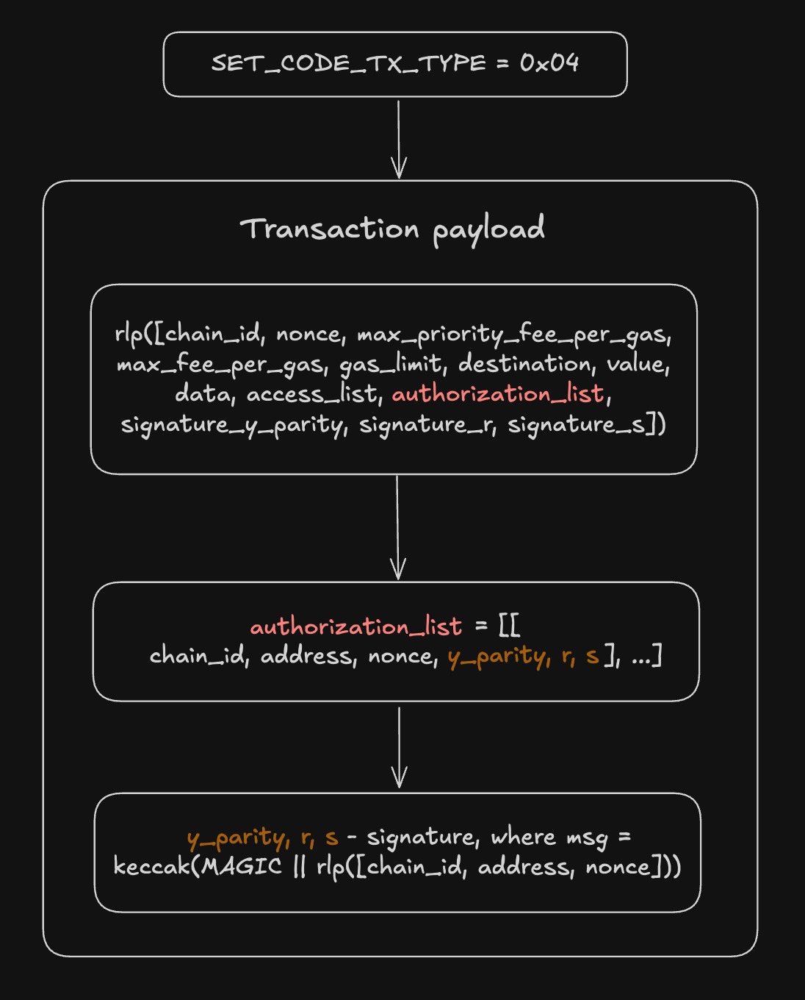

Поле `authorization_list` - это tuple, который определяется как:

```js
authorization_list = [[
  chain_id, // Идентификатор сети, для которой делегирование актуально
  address, // Адрес смарт-контракта куда будет делегироваться вызов
  nonce, // Текущий nonce EOA
  y_parity, // Данные подписи EOA аккаунта
  r, // Данные подписи EOA аккаунта
  s // Данные подписи EOA аккаунта
], ...]
```

Как и любую другую транзакцию пользователь может подписать ее, а послана транзакция в сеть может быть позже.

Поэтому тут важно понимать, что если `chain_id` в `authorization_list` передать равным 0, то это будет означать, что EOA разрешает использовать транзакцию во всех EVM-совместимых сетях, поддерживающих EIP-7702.

**Интересные моменты**

1. Для того, чтобы подпись, разрешающая прикрепление EOA, была валидна в нескольких сетях, необходимо, чтобы `nonce` был одинаковым в этих сетях, иначе подпись будет невалидна для какой-то из сетей. Это может быть удобно, если создается новый аккаунт, владелец дает всего одну подпись для того, чтобы привязать код к EOA сразу в нескольких сетях.

2. Поле `authorization_list` в транзакции может содержит список данных, подписанных несколькими разными EOA. При этом инициатором транзакции может быть третья сторона, что позволяет реализовать безгазовое прикрепление кода смарт-контракта к нескольким EOA.

3. Для того, чтобы снова сделать свой EOA обычным (открепить смарт-контракт) достаточно установить поле `address` в `authorization_list` в значение 0.

4. Если один из элементов списка `authorization_list` невалидный, то он пропускается, валидные элементы списка применяются, транзакция не откатывается.

## Как это работает для пользователя

Пользователь подписывает сообщение для добавления кода к своему аккаунту, включающее: идентификатор цепочки, одноразовый код, адрес делегирования. Больше от него ничего не зависит.

Эта сообщение может быть доставлено в сеть с транзакцией и после этого делегирование будет работать.

Технически EOA никуда не исчезает и с ним ничего не происходит. Средства пользователя не перемещаются, и пользователь по-прежнему управляет закрытым ключам аккаунта. Поэтому все также нужно следить за его сохранностью и не позволять его компрометировать.

Прикрепление кода к аккаунту позволит пользователю получить больше функций.

Встретить подобное можно уже сейчас, например, Metamask встроил EIP-7702 в свою фичу "[Smart Account](https://support.metamask.io/configure/accounts/what-is-a-smart-account/)". Для этого Metamask разработал свои собственные смарт-контракты, то есть пользователь переводя свой EOA на Smart Account, будет делегировать выполнение смарт-контрактам от Metamask.

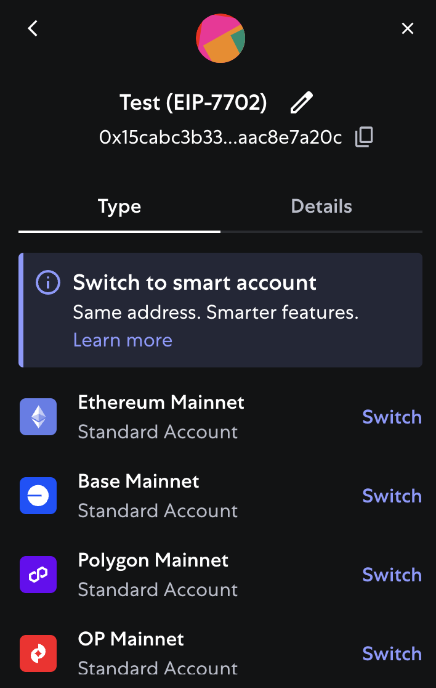
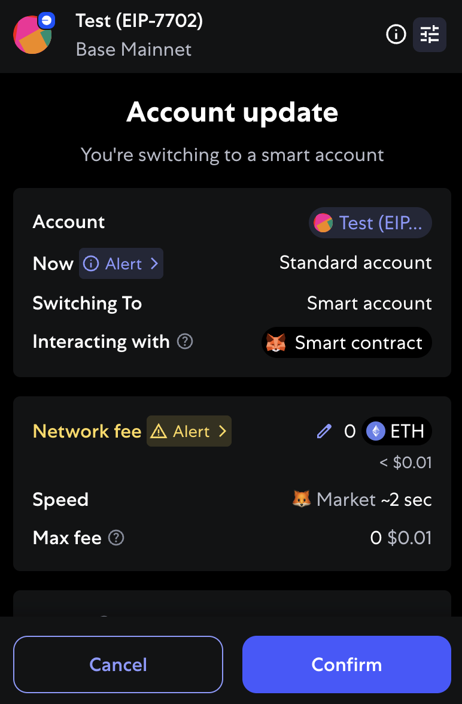

## Неочевидные моменты для смарт-контрактов

В этом разделе разберем нюансы работы EIP-7702. Рабочие примеры будем писать при помощи Foundry, который для тестирования реализует необходимые Cheatcodes.

```solidity
function signDelegation(address implementation, uint256 privateKey)
    external
    returns (SignedDelegation memory signedDelegation);

function attachDelegation(SignedDelegation calldata signedDelegation) external;

function signAndAttachDelegation(address implementation, uint256 privateKey)
    external
    returns (SignedDelegation memory signedDelegation);
```

Эти Cheatcodes позволяют подписывать транзакцию по прикреплению кода к EOA (signDelegation) и отправлять транзакции в сеть (attachDelegation) прямо в тестах.

Для того, чтобы EIP-7702 работал, необходимо убедиться, что компилируется код для evm версии не ниже "prague". Это может быть определено в `foundry.toml`.

```solidity
// foundry.toml
evm_version = "prague"
```

Таким образом, самый простой пример, который прикрепит код к EOA будет выглядеть в тестах Foundry следующим образом:

```solidity
// Объявляем StdCheats.Account public user;
...

function test_attachCode() external {
    // Проверяем наличие кода у EOA user
    console.logBytes(user.addr.code); // 0x

    // Симулируем подписание транзакции на прикрепление кода пользователем
    Vm.SignedDelegation memory signedDelegation = vm.signDelegation(address(delegation), user.key);

    vm.startBroadcast(operator.key);

    // Отправляем транзакцию на прикрепление кода к user. Обратить внимание, что это делает operator, а не user
    vm.attachDelegation(signedDelegation);

    vm.stopBroadcast();

    console.logBytes(user.addr.code); //0xef01005615deb798bb3e4dfa0139dfa1b3d433cc23b72f
}
```

По сути, тест реализует всего два этапа для прикрепления кода.

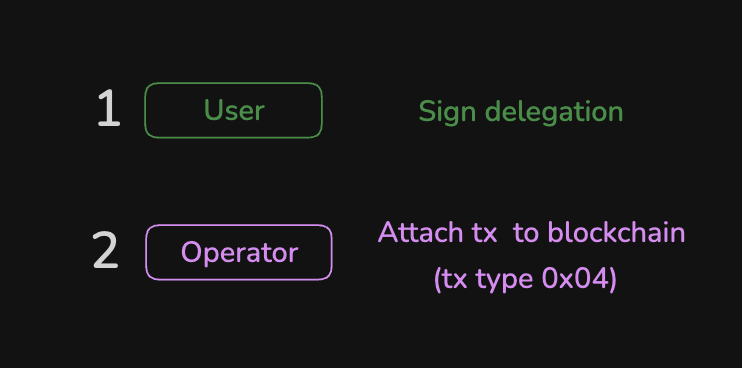

Полный пример теста `test_attachCode` в [Delegation.t.sol](./contracts/attachCode/Delegation.t.sol).

### Хранилище делегированного смарт-контракта

Хранилище делегированного смарт-контракта, не является доступным для вызовов через EOA.

Более того, конструктор такого смарт-контракта не вызвать в контексте EOA, поэтому нельзя устанавливать данные через конструктор в хранилище в контексте EOA.

Изменение переменных хранилища при вызове остается в контексте EOA. То есть хранилище самого смарт-контракта не будет изменено.

Для проверки работы хранилища реализуем простой смарт-контракт [Delegation.sol](./contracts/).

```solidity
contract Delegation {
    uint256 private _value;

    constructor(uint256 initialValue) {
        _value = initialValue;
    }

    function setValue(uint256 newValue) external {
        _value = newValue;
    }

    function getValue() external view returns (uint256) {
        return _value;
    }
}
```

В тесте будем работать с хранилищем смарт-контракта напрямую и в контексте EOA:

```solidity
// Delegation.t.sol
function test_workWithStorage(uint256 value) external {
    // Прикрепляем код смарт-контракта Delegation к EOA user
    ...

    // Step 1. Проверяем, что хранилище user пустое, а смарт-контракта delegation нет

    // Вызов getValue через user вернет 0, так как хранилище user пустое
    assertEq(Delegation(user.addr).getValue(), 0);
    // Вызов getValue через delegation вернет _INITIAL_VALUE, так как хранилище delegation не изменилось и было установлено через конструктор при деплое
    assertEq(delegation.getValue(), _INITIAL_VALUE);

    // Step 2. Устанавливаем значение в хранилище user
    Delegation(user.addr).setValue(value);

    // Вызов getValue через user вернет установленное value
    assertEq(Delegation(user.addr).getValue(), value);
    //Вызов getValue через delegation вернет _INITIAL_VALUE, хранилище не изменилось
    assertEq(delegation.getValue(), _INITIAL_VALUE);
}
```

Тест показывает, что конструктор смарт-контракта Delegation ничего не установил в хранилище EOA. В целом хранилище EOA и самого смарт-контракта - это разные хранилища.

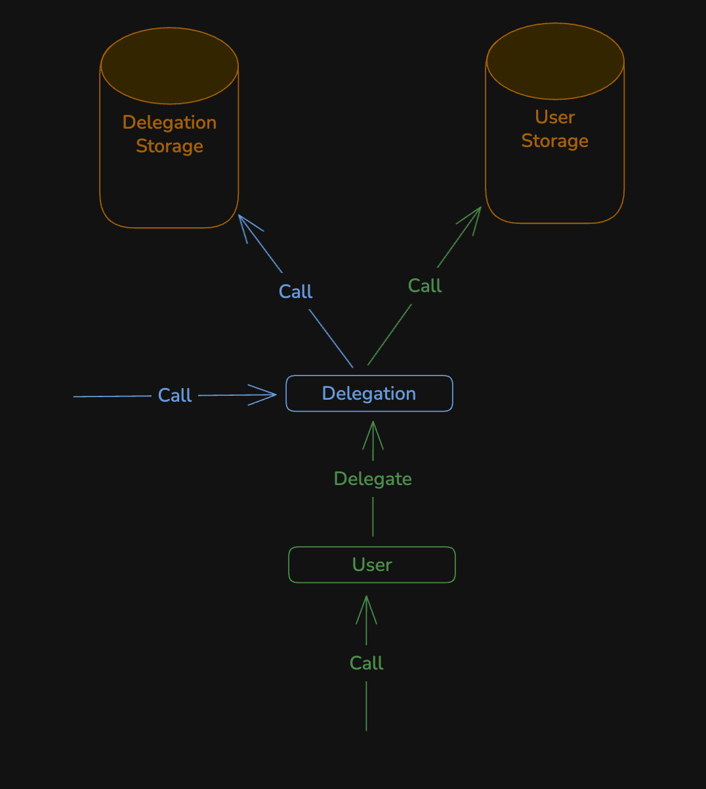

Полный пример кода теста `test_workWithStorage` в [Delegation.t.sol](./contracts/storageExample/Delegation.t.sol).

_Важно!_ На самом деле конструктор смарт-контракта все еще может применяться для immutable переменных, так как такие переменные будут частью байткода смарт-контракта после деплоя смарт-контракта.

```solidity
contract Delegation {
    uint256 immutable private _value;

    constructor(uint256 value) {
        _value = value;
    }

    function getValue() external view returns (uint256) {
        return _value;
    }
}
```

Проверочный тест может выглядеть следующим образом:

```solidity
function test_workWithStorage(uint256 initialValue) external {
    StdCheats.Account memory user = makeAccount("User");
    StdCheats.Account memory operator = makeAccount("Operator");

    // Деплоим смарт-контракт Delegation
    Delegation delegation = new Delegation(initialValue);

    // Прикрепляем код смарт-контракта Delegation к пользователю
    vm.startBroadcast(operator.key);
    vm.signAndAttachDelegation(address(delegation), user.key);
    vm.stopBroadcast();

    // Проверяем, что хранилище user не пустое
    assertEq(Delegation(user.addr).getValue(), initialValue);
}
```

### Проверки типа msg.sender == tx.origin

Раньше смарт-контракты использовали условие `tx.origin == msg.sender` для двух вещей:
1. Проверить, что код выполняется от имени EOA, так как `tx.origin` не может быть смарт-контрактом.
2. Защитить от повторного входа. Строится на предположение, что второй вход обязательно выполняется смарт-контрактом.

_Важно!_ Если делегированный смарт-контракт в контексте EOA делает вызов к другому смарт-контракту, то `msg.sender` равняется адресу EOA. И здесь пока `tx.origin` равняется `msg.sender`.

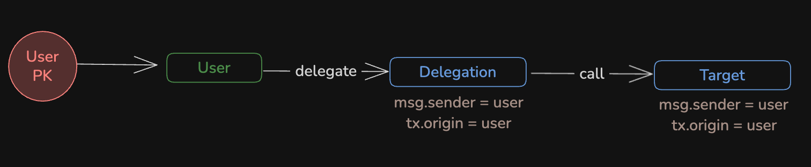

На схеме изображен поток вызова от пользователя к смарт-контракту `Target` через прикрепленный смарт-контракт `Delegation`. Пользователь подписывает своим приватным ключом вызов на свой же адрес, выполнение делегируется к смарт- контракту `Delegation`, который вызывает смарт-контракт `Target`. Во всех случаях адрес пользователя равен `msg.sender` и `tx.origin`.

Но теперь, как обойти условие, чтобы `tx.origin` изменился. EIP-7702 позволяет сделать любую реализацию смарт-контракта. Это означает, что вызывать его может любой другой аккаунт, если не реализовано иное. Таким образом, здесь `msg.sender` не будет совпадать с `tx.origin`, если первоначальный вызов будет исходить от стороннего EOA.

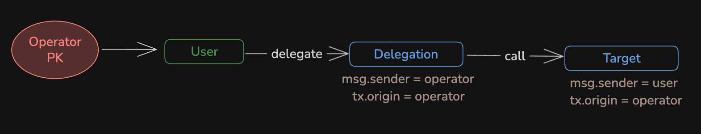

На схеме, оператор подписывает транзакцию своим приватным ключом, который не совпадает с адресом пользователя. По итогу `tx.origin` не будет равен `msg.sender`.

Проверить это легко. Понадобится смарт-контракт [Target](./contracts/condition/Delegation.sol), который будет позволять устанавливать value только если `tx.origin != msg.sender`.

```solidity
// Target
function setValue(uint256 newValue) external {
    if (tx.origin == msg.sender) {
        revert EOACallIsNotAllowed();
    }

    _value = newValue;
}
```

Прикреплять к EOA будем смарт-контракт [Delegation](./contracts/condition/Delegation.sol), который будет делать вызов `setValue()` на смарт-контракте `Target`.

```solidity
contract Delegation {
    function setValue(address target, uint256 value) external {
        Target(target).setValue(value);
    }
}
```

Проверочный тест будет выглядеть следующим образом:

```solidity
function test_checkCondition(uint256 value) external {
    Vm.SignedDelegation memory signedDelegation = vm.signDelegation(address(delegation), user.key);

    // Симулируем, что пользователь напрямую вызывает целевой контракт и транзакция ревертится
    vm.expectRevert(Target.EOACallIsNotAllowed.selector);
    vm.prank(user.addr, user.addr);
    target.setValue(value);

    // Operator прикрепляет смарт-контракт Delegation к user
    vm.startBroadcast(operator.key);
    vm.attachDelegation(signedDelegation);
    vm.stopBroadcast();

    // Operator вызывает функцию setValue() на контракте Delegation от имени user,
    // которая установит value на смарт-контракте Target
    vm.prank(operator.addr, operator.addr);
    Delegation(user.addr).setValue(address(target), value);

    // Проверяем, что значение установлено (проверка обойдена)
    assertEq(target.getValue(), value);
}
```

По итогу тест показывает, что вызывать смарт-контракт, прикрепленный к EOA может другой EOA, а соответственно в `tx.origin` будет другой адрес.

Полный пример теста `test_checkCondition` в [Delegation.t.sol](./contracts/condition/Delegation.t.sol).

### Проверка адреса на то, что он смарт-контракт

Больше нельзя полагаться на проверку `address(contract).code > 0`, которая определяет, что адрес является смарт-контрактом и не является EOA. Теперь EOA с прикрепленным смарт-контрактом тоже возвращает значение больше 0.

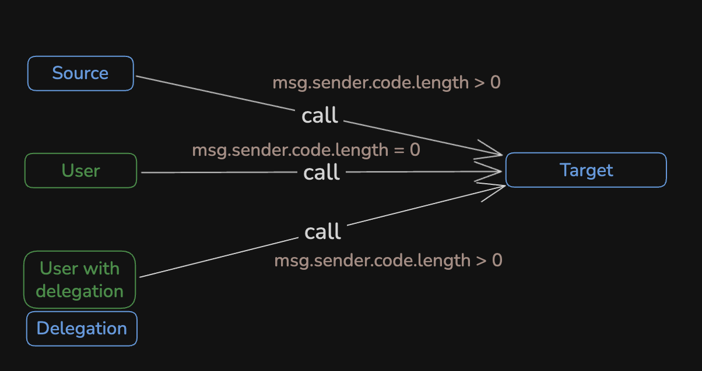

Согласно схеме, пользователь, который прикрепил к своему адресу смарт-контракт, при вызове других смарт-контрактов (когда он msg.sender) будет определяться, как аккаунт с кодом.

Проверить, что `msg.sender` - это прикрепленный смарт-контракт к аккаунту пользователя можно следующим образом:

```solidity
assembly {
    // Загружаем код msg.sender
    let ptr := mload(0x40)
    extcodecopy(caller(), ptr, 0, 32)
    let prefix := shr(232, mload(ptr))

    // Проверяем, что prefix == 0xef0100
    isDelegated := eq(prefix, 0xef0100)
}
```

Для этого нужно получить специальный префикс, который является магическим числом `0xef0100` и всегда будет в начале байткода делегированного смарт-контракта.

### Получение любого вида токена, который требует наличие callback функции, если получатель смарт-контракт

EOA, который прикрепил к себе смарт-контракт, для ERC-721, ERC-777, нативной валюты, начинает вести себя, как смарт-контракт.

Это означает, что EOA не сможет принимать активы, если на прикрепленном смарт-контракте не реализованы функции:


```js
receive() external payable {}
```
или
```js
function onERC721Received(address _operator, address _from, uint256 _tokenId, bytes _data) external returns(bytes4);
```

и так далее.

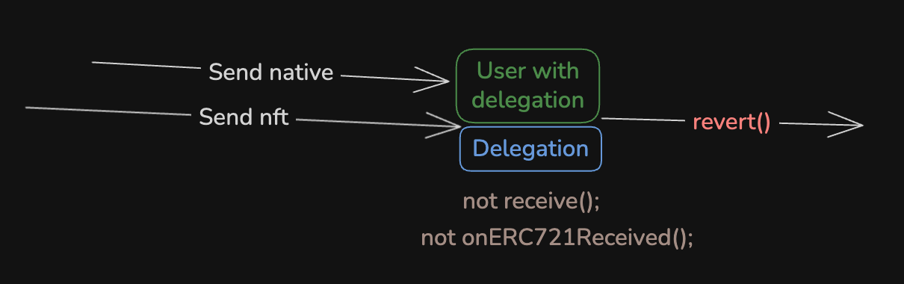

Для проверки можно прикрепить к любому аккаунту пустой смарт-контракт [Delegation.sol](./contracts/receiveNativeCurrency/Delegation.sol), который не будет реализовывать функцию `receive()`.

```solidity
contract Delegation {}
```

Проверочный тест будет выглядеть следующим образом:

```solidity
function test_checkSendNativeCurrency(uint256 value) external {
    Vm.SignedDelegation memory signedDelegation = vm.signDelegation(address(delegation), user.key);

    // Operator прикрепляет смарт-контракт Delegation к user
    vm.startBroadcast(operator.key);
    vm.attachDelegation(signedDelegation);
    vm.stopBroadcast();

    // Пытаемся отправить нативную валюту, транзакция ревертнется
    (bool success,) = user.addr.call{value: value}(""); // success == false

    assertFalse(success);
}
```

Полный пример теста `test_checkSendNativeCurrency` в [Delegation.t.sol](./contracts/receiveNativeCurrency/Delegation.t.sol).

### Конфликт переменных хранилища для EOA

EOA может делегировать выполнение разным смарт-контрактам: прикрепляя и открепляя их. Вновь прикрепленный смарт-контракт может легко повлиять на переменные хранилища, которые были записаны предыдущим смарт-контрактом.

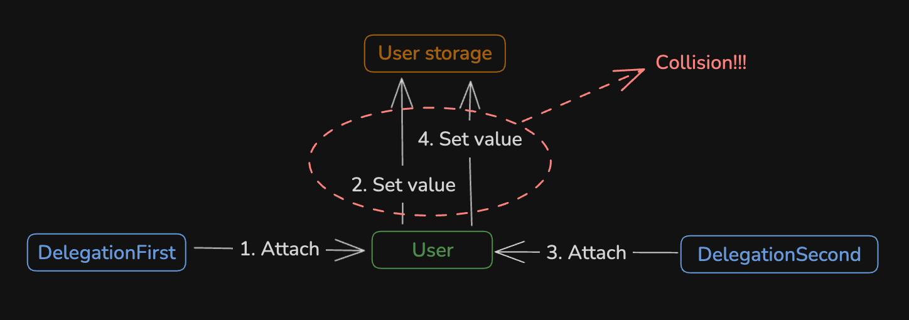

Для проверки это гипотезы поочередно прикрепим два смарт-контракта [DelegationFirst.sol](./contracts/storageCollision/Delegation.sol) и [DelegationSecond.sol](./contracts/storageCollision/Delegation.sol), которые работают с первым слотом памяти: первый устанавливает `uint256`, второй `bytes32`.

```solidity
contract DelegationFirst {
    uint256 private _value;

    function setValue(uint256 newValue) external {
        _value = newValue;
    }

    function getValue() external view returns (uint256) {
        return _value;
    }
}

contract DelegationSecond {
    bytes32 private _hashValue;

    function setHash(bytes32 hashValue) external {
        _hashValue = hashValue;
    }

    function getHash() external view returns (bytes32) {
        return _hashValue;
    }
}
```

Проверочный тест будет выглядеть следующим образом:

```solidity
function test_storageCollision(uint256 value, bytes32 hashValue) external {
    // Прикрепляем первый смарт-контракт
    vm.startBroadcast(operator.key);
    vm.signAndAttachDelegation(address(delegationFirst), user.key);
    vm.stopBroadcast();

    // Устанавливаем значение в хранилище смарт-контракта
    DelegationFirst(user.addr).setValue(value);
    assertEq(DelegationFirst(user.addr).getValue(), value);

    // Прикрепляем второй смарт-контракт
    vm.startBroadcast(operator.key);
    vm.signAndAttachDelegation(address(delegationSecond), user.key);
    vm.stopBroadcast();

    // Устанавливаем hash в хранилище смарт-контракта
    DelegationSecond(user.addr).setHash(hashValue);
    assertEq(DelegationSecond(user.addr).getHash(), hashValue);

    // Прикрепляем первый смарт-контракт повторно
    vm.startBroadcast(operator.key);
    vm.signAndAttachDelegation(address(delegationFirst), user.key);
    vm.stopBroadcast();

    assertNotEq(DelegationFirst(user.addr).getValue(), value); // Доказывает что первоначальное значение было изменено
}
```

Полный пример теста `test_test_storageCollision` в [Delegation.t.sol](./contracts/storageCollision/Delegation.t.sol).

**Что делать с коллизией?**

Единственным решением здесь может быть введение особого пространства наименования переменных, чтобы исключить пересечение слотов.

Идея заключается в том, что вместо использования последовательных слотов хранения (это работает в Solidity по умолчанию) использовать [ERC-7201 Storage Namespaces Explained](https://eips.ethereum.org/EIPS/eip-7201) или другие подобные решения.

Чтобы использовать этот шаблон, разработчику необходимо придумать базовый идентификатор, который будет использоваться для генерации хеша, который будет идентификатором для слота хранилища.

```solidity
contract Delegation {
    struct MainStorage {
        uint256 value;
    }

    // keccak256(abi.encode(uint256(keccak256("MetaLampIsTheBest")) - 1)) & ~bytes32(uint256(0xff))
    bytes32 public constant MAIN_STORAGE_LOCATION = 0xd66e0df2d96f7ee8f3c31d9f50f7a36abdf7b3a8a2cbbfbe615a3abcc8b5af00;

    function _getMainStorage() private pure returns (MainStorage storage $) {
        assembly {
            $.slot := MAIN_STORAGE_LOCATION
        }
    }

    function getValue() external view returns (uint256) {
        MainStorage storage $ = _getMainStorage();

        // Получаем значение из хранилища, которое хранится в специальном слоте
        return $.value;
    }
}
```

_Важно!_ EIP-7201 не защитит, если пользователь прикрепил к своему аккаунту вредоносный смарт-контракт, который будет целенаправленно переписывать определенный слот вашего правильного хранилища.

Также, как никто не застрахован от подписания транзакции, которая прикрепит неизвестный код к EOA.

### Работа с нативной валютой

Рассмотрим два случая для аккаунта, который прикрепил себе смарт-контракт:
1. Была вызвана payable функция на прикрепленном смарт-контракте в контексте аккаунта пользователя
2. Была вызвана payable функция на прикрепленном смарт-контракте в контексте аккаунта пользователя, которая отправила нативную валюту на другой смарт-контракт.

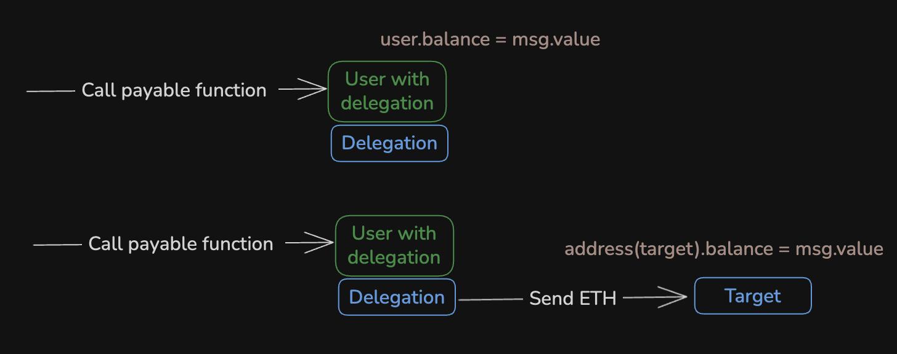

В первом случае, нативная валюта останется на балансе пользователя, во-втором - на балансе смарт-контракта, который был финальным получателем.

Для проверки это гипотезы прикрепим к пользователю смарт-контракт [Delegation.sol](./contracts/work-with-native-currency/Delegation.sol).

```solidity
contract Delegation {
    /// Оставляем нативную валюту на адресе user
    function buy() external payable {}

    /// @notice Пересылаем нативную валюту на смарт-контракт target
    function buyAndSendToTarget(address target) external payable {
        (bool success, ) = target.call{value: msg.value}("");

        if (!success) {
            revert();
        }
    }
}

contract Target {
    // Разрешаем принимать нативную валюту
    receive() external payable {}
}
```

Проверочных теста будет два:

```solidity
function test_workWithNativeCurrency_buy(uint256 value) external {
    deal(operator.addr, value);

    vm.startBroadcast(operator.key);
    vm.signAndAttachDelegation(address(delegation), user.key);
    vm.stopBroadcast();

    vm.prank(operator.addr);
    Delegation(user.addr).buy{value: value}();

    // Нативная валюта остается на балансе пользователя
    assertEq(user.addr.balance, value);
}

function test_workWithNativeCurrency_buyAndSendToTarget(uint256 value) external {
    deal(operator.addr, value);

    vm.startBroadcast(operator.key);
    vm.signAndAttachDelegation(address(delegation), user.key);
    vm.stopBroadcast();

    vm.prank(operator.addr);
    Delegation(user.addr).buyAndSendToTarget{value: value}(address(target));

    // Нативная валюта остается на балансе target смарт-контракта
    assertEq(address(target).balance, value);
}
```

Полный пример тестов `test_workWithNativeCurrency_buy` и `test_workWithNativeCurrency_buyAndSendToTarget` можно найти в [Delegation.t.sol](./contracts/work-with-native-currency/Delegation.t.sol).

## Совместимость

Один из самых интересных моментов, как EIP-7702 будет чувствовать себя с предыдущими решениями по абстракции аккаунта, в частности с [ERC-4337](https://eips.ethereum.org/EIPS/eip-4337).

На удивление очень хорошо! Все, кто имел абстрактные аккаунты на базе ERC-4337, могут продолжать использовать их. Дело в том, что для ERC-4337 не принципиален инициатор транзакции, достаточно того, чтобы критерии проверки (подпись user operation) были валидны.

В свою очередь, ребята из eth-infinitism практически сразу предложили вариант аккаунта в котором в одной связке работают ERC-4337 и ERC-7702. Первый стандарт для спонсирования газа, второй для батчинга операций.

Выглядит такой аккаунт следующим образом:

```solidity
contract Simple7702Account is BaseAccount, IERC165, IERC1271, ERC1155Holder, ERC721Holder {
    /// Адрес entrypoint, который может вызывать транзакции на аккаунте пользователя
    function entryPoint() public pure override returns (IEntryPoint) {
        return IEntryPoint(0x4337084D9E255Ff0702461CF8895CE9E3b5Ff108);
    }

    /// Здесь будет проверяться, что операция подписана приватным ключом пользователя
    function _validateSignature(
        PackedUserOperation calldata userOp,
        bytes32 userOpHash
    ) internal virtual override returns (uint256 validationData) {

        return _checkSignature(userOpHash, userOp.signature) ? SIG_VALIDATION_SUCCESS : SIG_VALIDATION_FAILED;
    }

    ...
}
```

Схематично работа ERC-4337 и EIP-7702 представлена на схеме ниже.

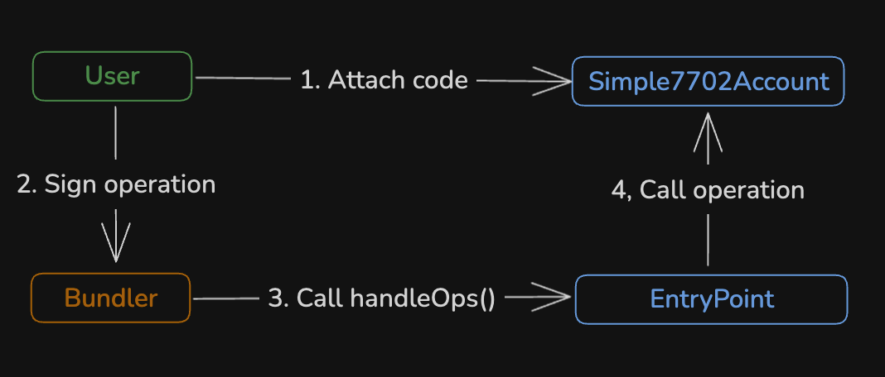

Пользователь делегирует выполнение **Simple7702Account** (прикрепляет код этого смарт-контракта). После этого он может подписывать данные об операциях и через **bundler** передавать их на выполнение.

[Полный пример такого аккаунта](https://github.com/eth-infinitism/account-abstraction/blob/releases/v0.8/contracts/accounts/Simple7702Account.sol).

В EIP-7702 вцепились все заинтересованные в абстракции: viem, metamask, ZeroDev, Biconomy, Alchemy, Trust Wallet, Ambire и другие. Они так или иначе интегрировали EIP-7702 в свои решения, поэтому референсных имплементаций достаточное количество.

## Etherscan

Etherscan тоже молодец и сразу поддержал EIP-7702. Для этого он вывел все транзакции четвертого типа на отдельную [страницу](https://etherscan.io/txnAuthList).

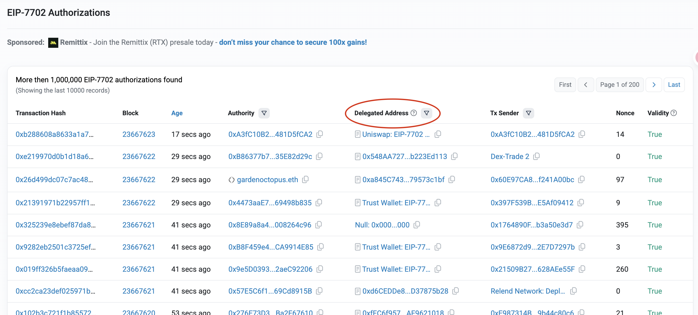

Также etherscan показывает, что транзакция выполнена через прикрепленный смарт-контракт, которому EOA делегировал выполнение.

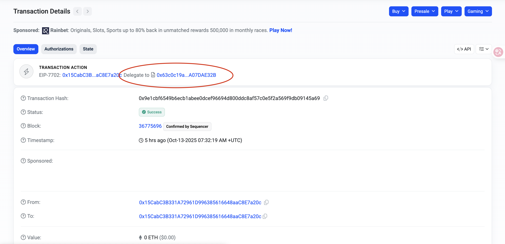

Увидеть, что транзакция выполнялась на прикрепленном смарт-контракте можно и в отдельном поле "Delegated Address", а увидеть тип транзакции в поле "Other Attributes".

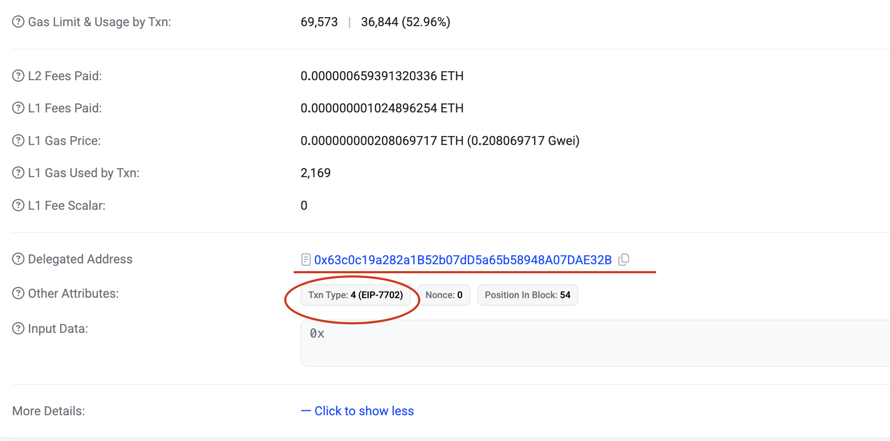

## Недостатки

Нужно понимать, что EIP-7702 не является реализацией полной абстракции аккаунта, он не преобразует EOA в "Умный самодостаточный аккаунт".

С точки зрения абстракции аккаунта, EIP-7702 имеет ряд ограничений:

- **Приватный ключ все еще очень важен**: это сохраняет полный контроль над аккаунтом, одновременно выступая бекдором. Поэтому защита приватного ключа крайне важна.

- **Неравнозначные права для мультисига**: По-прежнему нельзя создать полноценный мультисиг на базе EIP-7702, так как у владельцев будут разные права. Всем придется доверять первоначальному EOA. Его приватный ключ наделяет его неограниченной властью.

- **Ограниченное восстановление аккаунта**: если приватный ключ утерян или скомпрометирован, восстановить полный контроль над EOA невозможно. Единственным решением будет замена приватного ключа, но это нетривиальная задача.

- **Отсутствие квантовой устойчивости**: в будущем потребуется перейти на полностью квантово-устойчивые аккаунты. EOA же по-прежнему уязвимы для потенциальных квантовых алгоритмов, которые могут скомпрометировать их приватные ключи.

- **Невозможность использования аккаунта в качестве эскроу-счета**: потому что первоначальный EOA имеет неограниченные полномочия и может изъять средства.

## Вывод

Таким образом, EIP-7702 является важным, стратегическим шагом на пути к абстракции аккаунта, привносит новую энергию в экосистему Ethereum и позволяет внедрять новые сценарии. Как абстракция аккаунта будет выглядеть в будущем одному Виталику известно.

Также не стоит забывать ключевые проблемы:
- коллизии при работе с хранилищем аккаунта
- сложности при работе в разных сетях
- необходимость помнить про поддержку ERC-721 или ERC-777, поддержка нативной валюты
- невозможность реализовать полноценный мультисиг или эскроу-счет
- приватный ключ по-прежнему имеет решающее значение

Полный переход EOA на смарт-аккаунты потребует дальнейших изменений в Ethereum. По мере развития экосистемы EIP-7702 будет играть важнейшую роль в улучшение UI кошельков, повышении безопасности для пользователей, приближая нас к конечной цели — полной абстракции аккаунтов.

# Links

1. Ethereum Improvement Proposals: [EIP-7702: Set Code for EOAs](https://eips.ethereum.org/EIPS/eip-7702)
2. [EIP-7702](https://www.cyfrin.io/glossary/eip-7702) от Cyfrin
3. [Solidity и Ethereum, урок #93 | EIP-7702: EOA code](https://www.youtube.com/live/NZQc6bQdW9g). Видео от Ilya Krukowski. Здесь практический опыт использования EIP-7702 со стороны смарт-контрактов
4. [In-Depth Discussion on EIP-7702 and Best Practices](https://slowmist.medium.com/in-depth-discussion-on-eip-7702-and-best-practices-968b6f57c0d5) от SlowMist. Здесь больше со стороны того, как это работает в Ethereum
5. [Документация viem](https://viem.sh/docs/eip7702)
6. [What You Need to Know About EIP-7702 “Smart” Account](https://info.etherscan.com/what-you-need-to-know-about-eip-7702-smart-account/) от etherscan
7. [Deep Dive into Ethereum 7702 Smart Accounts: security risks, footguns and testing](https://www.youtube.com/watch?v=ZFN2bYt9gNE&ab_channel=TheRedGuild)
8. [Emergency EIP-7702 Wallet Recovery](https://medium.com/@BahadorGh/emergency-eip-7702-wallet-recovery-f4cc865f6341). История о том, как случайное делегирование позволило увести активы с кошелька.
9. [EIP-7702 overview](https://eip7702.io/)
10. [EIP7702: Closing the Gap Between EOAs and Smart Contracts](https://medium.com/valixconsulting/eip7702-closing-the-gap-between-eoas-and-smart-contracts-16b6f05584a9). Здесь интересен исторический обзор, как эволюционировали стандарты в области абстракции аккаунтов.
11. [Awesome EIP-7702](https://github.com/fireblocks-labs/awesome-eip-7702). На случай, если нужно еще больше материалов