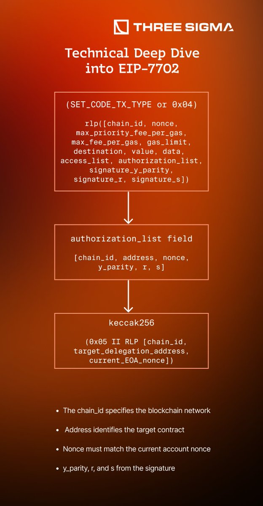

# EIP-7702: Set Code for EOAs

**Автор:** [Павел Найданов](https://github.com/PavelNaydanov) 🕵️‍♂️

**EIP-7702: Set Code for EOAs** - это следующий шаг в области абстракции аккаунта в рамках обновления Pectra. Стандарт предлагает добавить **новый тип** транзакции согласно регламенту, описанному в [EIP-2718: Typed Transaction Envelope](https://eips.ethereum.org/EIPS/eip-2718). Это позволит к Externally Owned Accounts (EOAs) добавлять код смарт-контракта.

// TODO: нарисовать схему, как это работает.

Технически в поле code адреса EOA будет записан адрес прикрепляемого смарт-контракта со специальным префиксом (**0xef0100** || address). Опкод считается невалидным, по сути это некоторое магическое значение, которое позволяет четко определить, что это адрес для делегирования вызова.

Это предложение нацелено на улучшение UX приложений за счет небольших функциональных изменений внутри Ethereum. Решаться могут следующии задачи:
- Батчинг транзакций: Объединение нескольких атомарных операций внутри одной транзакции. Это позволяет объединить две операции: approve и трансфер в одну транзакцию.
- Безгазовые транзакции или спонсирование: Оплата газа сторонним аккаунтом, возможность оплачивать газ в ERC-20. Это позволяет значительно улучшить опыт использования кошельков новыми пользователями у которых еще нет нативной валюты для оплаты газа.
- Управление ролями и доступом: Выдача разрешений на управление аккаунтом третьим лицам.
- Механизмы восстановления доступа: это может быть вывод активов, добавление резервного адреса, который сможет управлять активами кошелька и другие.

// TODO: Это делегирование достигается путем кодирования специального префикса и адреса контракта в поле кода EOA . При вызове EVM направляет выполнение указанному смарт-контракту. После завершения транзакции учетная запись может вернуться к своему предыдущему поведению или переключиться на другого делегата.

## Устройство транзакции для установки кода

// TODO: подготовить подобную схему


TransactionType равен 0x04.
TransactionPayload - кодированные данные.

Кодируются данные транзакции в следующую структуру данных:

```js
rlp([
  chain_id,
  nonce,
  max_priority_fee_per_gas,
  max_fee_per_gas,
  gas_limit,
  destination,
  value,
  data,
  access_list,
  authorization_list,
  signature_y_parity,
  signature_r,
  signature_s
])
```

Поле authorization_list определяется как:

```js
authorization_list = [[
  chain_id, // Идентификатор сети, для которой делегирование актуально
   // TODO: проверить, 0 разрешает ли в во все сети сразу?
  address, // Адрес смарт-контракта куда будет делегироваться вызов
  nonce, // Текущий nonce EOA
  y_parity, // Данные подписи EOA аккаунта
  r, // Данные подписи EOA аккаунта
  s // Данные подписи EOA аккаунта
], ...]
```

Если `chain_id` передать равным 0, то это означает, что EOA разрешает использовать подпись во всех EVM-совместимых цепочках, поддерживающих EIP-7702. Нужно отметить, что `nonce` должен быть одинаковым во всех сетях, иначе подпись будет невалидна. Это может быть удобно, если создается новый кошелек, владелец дает всего одну подпись для того, чтобы привязать код сразу в нескольких сетях.

Поле `authorization_list` в транзакции может содержит список данных, подписанных несколькими разными EOA. При этом инициатором транзакции может быть третья сторона, что позволяет реализовать безгазовое прикрепление кода смарт-контракта к EOA.

Для того, чтобы снова сделать свой EOA обычным (отменить делегирование) достаточно указать поле `address` в `authorization_list` в значение 0.

// TODO: Когда список authorization применяется, то если один из элементов списка невалидный, то он пропускается, изменения не применяются, транзакция не откатывается.

## Как это работает для пользователя

Пользователь (EOA) подписывает сообщение авторизации, включающее идентификатор цепочки, одноразовый код, адрес делегирования и подпись (y_parity, r, s). Это создаёт подписанную авторизацию, гарантируя, что только утверждённый контракт реализации может выполнять транзакции, и защищая от атак повторного воспроизведения.

## Неочевидные моменты для смарт-контрактов

// TODO:
1. msg.sender == tx.origin. Смотреть ниже предложение вставки
2. Определение, что sender - это контракт.
 code.length теперь возвращает и EOA с кодом не ноль. Тут говорим, как определить, что сендер - это делегированный контракт.
3. Невозможность принять нфт, нативный эфир, ERC-777 токен.
4. Невозможность исполнить конструктор прикрепленного смарт-контракта в контексте EOA.
5. Конфликт в storage разных смарт-контрактов, прикрепляемых к EOA.

## Совместимость

// TODO: рассказать про прошлую версию ERC-4337

AA ERC-4437, поэтому существующие кошельки могут стать кошельками смарт-контрактов без создания нового адреса и перевода активов.

## Etherscan

https://etherscan.io/txnAuthList

## Вывод

// TODO: Можно говорить, что это вообще не последний шаг

EIP-7702 привносит новую энергию в экосистему Ethereum, внедрение новых сценариев применения также влечет за собой новые риски.

Не забывать решать проблемы:
- с хранилищем
- с разными сетями
- поддержка ERC-721 или ERC-777, поддержка нативной валюты

# Links

1. Ethereum Improvement Proposals: [EIP-7702: Set Code for EOAs](https://eips.ethereum.org/EIPS/eip-7702)
2. [EIP-7702](https://www.cyfrin.io/glossary/eip-7702) от Cyfrin
3. [Solidity и Ethereum, урок #93 | EIP-7702: EOA code](https://www.youtube.com/live/NZQc6bQdW9g). Видео от Ilya Krukowski. Здесь практический опыт использования EIP-7702 со стороны смарт-контрактов
4. [In-Depth Discussion on EIP-7702 and Best Practices](https://slowmist.medium.com/in-depth-discussion-on-eip-7702-and-best-practices-968b6f57c0d5) от SlowMist. Здесь больше со стороны того, как это работает в Ethereum
5. [Документация viem](https://viem.sh/docs/eip7702)


//TODO:

```solidity
address Alice = makeAddr("Alice");
console.logBytes(Alice.code); // Вернет 0xef0100[attached_smart-contract_address] - если код смарт-контракта прикреплен к EOA, иначе - 0x
```

// TODO: пример, как проверить что контракт вызывается делегированным адресом

```solidity
assembly {
    // We'll load the first 32 bytes of code from msg.sender
    let ptr := mload(0x40)
    extcodecopy(caller(), ptr, 0, 32)
    let prefix := shr(232, mload(ptr)) // grab first 3 bytes (24 bits)

    // Check if prefix == 0xef0100
    isDelegated := eq(prefix, 0xef0100)
}
```

// TODO

Теперь для смартов, которые использовали условие tx.origin == msg.sender, чтобы проверить, что EOA не могут выполнять код смарт-контракта, плохие новости. Это условие может быть обойдено. Или как защита от повторного входа, когда предполагалось, что второй вход будет обязательно от контракта.

Другая формулировка:

Предположения о том, что EOA не могут выполнять код. Это изменение нарушает фундаментальный инвариант: условие tx.origin == msg.sender больше не является гарантией того, что текущий контекст выполнения напрямую инициируется EOA без промежуточных вызовов контракта в той же транзакции.

// TODO: попробовать написать деплой скрипт, который прикрепит код к EOA.

// TODO: Социальное восстановление не спасает от прямой потери приватного ключа EOA. Если приватный ключ попадет в руки злоумышленника, то прикрепленный смарт-контракт не поможет вернуть доступ к аккаунту. Более того, такой смарт-контракт может быть просто откреплен от EOA злоумышленником.