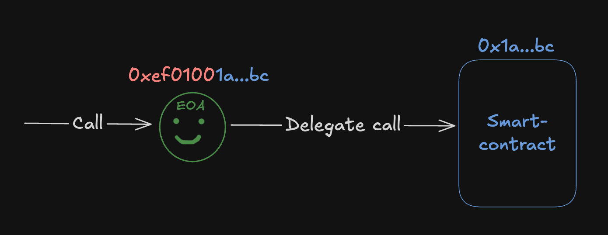
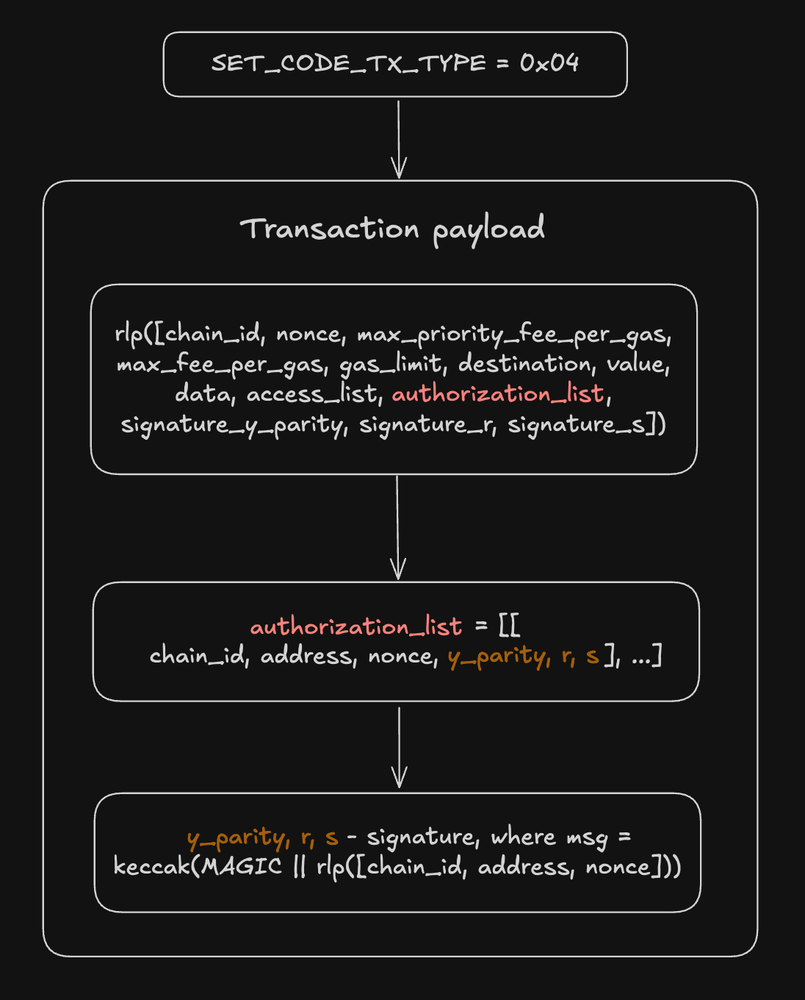

# EIP-7702: Set Code for EOAs

**Автор:** [Павел Найданов](https://github.com/PavelNaydanov) 🕵️‍♂️

**EIP-7702: Set Code for EOAs** - это стандарт, который предлагает добавить **новый тип** транзакции согласно спецификации, описанной в [EIP-2718: Typed Transaction Envelope](https://eips.ethereum.org/EIPS/eip-2718), что позволит к Externally Owned Accounts (EOAs) прикрепить код смарт-контракта. Это следующий шаг в области абстракции аккаунта в рамках обновления Ethereum под названием ["Pectra"](https://ethereum.org/en/roadmap/pectra/).

Прикрепление смарт-контракта к EOA позволяет исполнить программный код в его контексте. Таким образом, все вызовы на адрес EOA будут делегированы для выполнения на смарт-контракте.



Технически, у сущности аккаунт уже есть поле **code**, только раньше для EOA это поле оставалось пустым. Теперь в поле будет записан адрес прикрепляемого смарт-контракта со специальным префиксом (**0xef0100** || address). По сути, префикс - это  это некоторое магическое значение, которое позволяет четко определить, что это адрес для делегирования вызова, а не байт-код смарт-контракта.

Глобально, EIP-7702 нацелен на улучшение UX приложений за счет небольших изменений внутри Ethereum. При помощи стандарта могут решаться следующии задачи:
- **Батчинг транзакций**: Объединение нескольких атомарных операций внутри одной транзакции. Например, approve и трансфер в одной транзакции. Это то чего долго ждут пользователи кошельков.
- **Безгазовые транзакции или спонсирование**: Оплата газа сторонним аккаунтом, возможность оплачивать газ в ERC-20 токене. Это позволяет значительно улучшить опыт использования кошельков для новых пользователей, у которых еще нет нативной валюты для оплаты газа.
- **Управление ролями и доступом**: Выдача разрешений на управление аккаунтом третьим лицам.
- **Механизмы восстановления доступа**: Может быть реализован вывод активов или резервный адрес, который сможет управлять активами кошелька и так далее.

## Транзакция для прикрепления кода

В этом разделе разберем их чего состоит транзакция по прикреплению смарт-контракта к EOA. Тело транзакции похоже на любой другой тип.

**TransactionType** - тип транзакции равен `0x04`.
**TransactionPayload** - кодированные данные отличаются тем, что добавляется новое поле `authorization_list`.



Поле `authorization_list` - это tuple, который определяется как:

```js
authorization_list = [[
  chain_id, // Идентификатор сети, для которой делегирование актуально
  address, // Адрес смарт-контракта куда будет делегироваться вызов
  nonce, // Текущий nonce EOA
  y_parity, // Данные подписи EOA аккаунта
  r, // Данные подписи EOA аккаунта
  s // Данные подписи EOA аккаунта
], ...]
```

Если `chain_id` передать равным 0, то это будет означать, что EOA разрешает использовать подпись во всех EVM-совместимых сетях, поддерживающих EIP-7702.

**Интересные моменты**

1. Для того, чтобы подпись, разрешающая прикрепление EOA была валидна в нескольких сетях, необходимо, чтобы `nonce` был одинаковым в этих сетях, иначе подпись будет невалидна. Это может быть удобно, если создается новый аккаунт, владелец дает всего одну подпись для того, чтобы привязать код сразу в нескольких сетях.

2. Поле `authorization_list` в транзакции может содержит список данных, подписанных несколькими разными EOA. При этом инициатором транзакции может быть третья сторона, что позволяет реализовать безгазовое прикрепление кода смарт-контракта к нескольким EOA.

3. Для того, чтобы снова сделать свой EOA обычным (открепить смарт-контракт) достаточно установить поле `address` в `authorization_list` в значение 0.

4. Если один из элементов списка `authorization_list` невалидный, то он пропускается, валидные элементы списка применяются, транзакция не откатывается.

// TODO: продолжим отсюда

## Как это работает для пользователя

Пользователь (EOA) подписывает сообщение авторизации, включающее идентификатор цепочки, одноразовый код, адрес делегирования и подпись (y_parity, r, s). Это создаёт подписанную авторизацию, гарантируя, что только утверждённый контракт реализации может выполнять транзакции, и защищая от атак повторного воспроизведения.

## Неочевидные моменты для смарт-контрактов

// TODO:
1. msg.sender == tx.origin. Смотреть ниже предложение вставки
2. Определение, что sender - это контракт.
 code.length теперь возвращает и EOA с кодом не ноль. Тут говорим, как определить, что сендер - это делегированный контракт.
3. Невозможность принять нфт, нативный эфир, ERC-777 токен.
4. Невозможность исполнить конструктор прикрепленного смарт-контракта в контексте EOA.
5. Конфликт в storage разных смарт-контрактов, прикрепляемых к EOA.

TODO: также посмотреть, что я написал в репе EIP7702

## Совместимость

// TODO: рассказать про прошлую версию ERC-4337

AA ERC-4437, поэтому существующие кошельки могут стать кошельками смарт-контрактов без создания нового адреса и перевода активов.

## Etherscan

https://etherscan.io/txnAuthList

## Вывод

// TODO: Можно говорить, что это вообще не последний шаг

EIP-7702 привносит новую энергию в экосистему Ethereum, внедрение новых сценариев применения также влечет за собой новые риски.

Не забывать решать проблемы:
- с хранилищем
- с разными сетями
- поддержка ERC-721 или ERC-777, поддержка нативной валюты

# Links

1. Ethereum Improvement Proposals: [EIP-7702: Set Code for EOAs](https://eips.ethereum.org/EIPS/eip-7702)
2. [EIP-7702](https://www.cyfrin.io/glossary/eip-7702) от Cyfrin
3. [Solidity и Ethereum, урок #93 | EIP-7702: EOA code](https://www.youtube.com/live/NZQc6bQdW9g). Видео от Ilya Krukowski. Здесь практический опыт использования EIP-7702 со стороны смарт-контрактов
4. [In-Depth Discussion on EIP-7702 and Best Practices](https://slowmist.medium.com/in-depth-discussion-on-eip-7702-and-best-practices-968b6f57c0d5) от SlowMist. Здесь больше со стороны того, как это работает в Ethereum
5. [Документация viem](https://viem.sh/docs/eip7702)
6. [What You Need to Know About EIP-7702 “Smart” Account](https://info.etherscan.com/what-you-need-to-know-about-eip-7702-smart-account/) от etherscan
7. [Deep Dive into Ethereum 7702 Smart Accounts: security risks, footguns and testing](https://www.youtube.com/watch?v=ZFN2bYt9gNE&ab_channel=TheRedGuild)
8. [Emergency EIP-7702 Wallet Recovery](https://medium.com/@BahadorGh/emergency-eip-7702-wallet-recovery-f4cc865f6341). История о том, как случайное делегирование позволило увести активы с кошелька.
//TODO:

```solidity
address Alice = makeAddr("Alice");
console.logBytes(Alice.code); // Вернет 0xef0100[attached_smart-contract_address] - если код смарт-контракта прикреплен к EOA, иначе - 0x
```

// TODO: пример, как проверить что контракт вызывается делегированным адресом

```solidity
assembly {
    // We'll load the first 32 bytes of code from msg.sender
    let ptr := mload(0x40)
    extcodecopy(caller(), ptr, 0, 32)
    let prefix := shr(232, mload(ptr)) // grab first 3 bytes (24 bits)

    // Check if prefix == 0xef0100
    isDelegated := eq(prefix, 0xef0100)
}
```

// TODO

Теперь для смартов, которые использовали условие tx.origin == msg.sender, чтобы проверить, что EOA не могут выполнять код смарт-контракта, плохие новости. Это условие может быть обойдено. Или как защита от повторного входа, когда предполагалось, что второй вход будет обязательно от контракта.

Другая формулировка:

Предположения о том, что EOA не могут выполнять код. Это изменение нарушает фундаментальный инвариант: условие tx.origin == msg.sender больше не является гарантией того, что текущий контекст выполнения напрямую инициируется EOA без промежуточных вызовов контракта в той же транзакции.

// TODO: попробовать написать деплой скрипт, который прикрепит код к EOA.

// TODO: Социальное восстановление не спасает от прямой потери приватного ключа EOA. Если приватный ключ попадет в руки злоумышленника, то прикрепленный смарт-контракт не поможет вернуть доступ к аккаунту. Более того, такой смарт-контракт может быть просто откреплен от EOA злоумышленником.