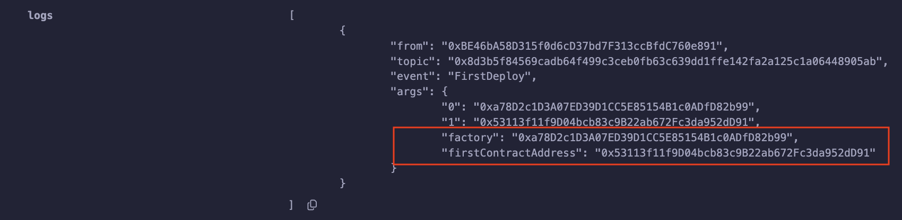
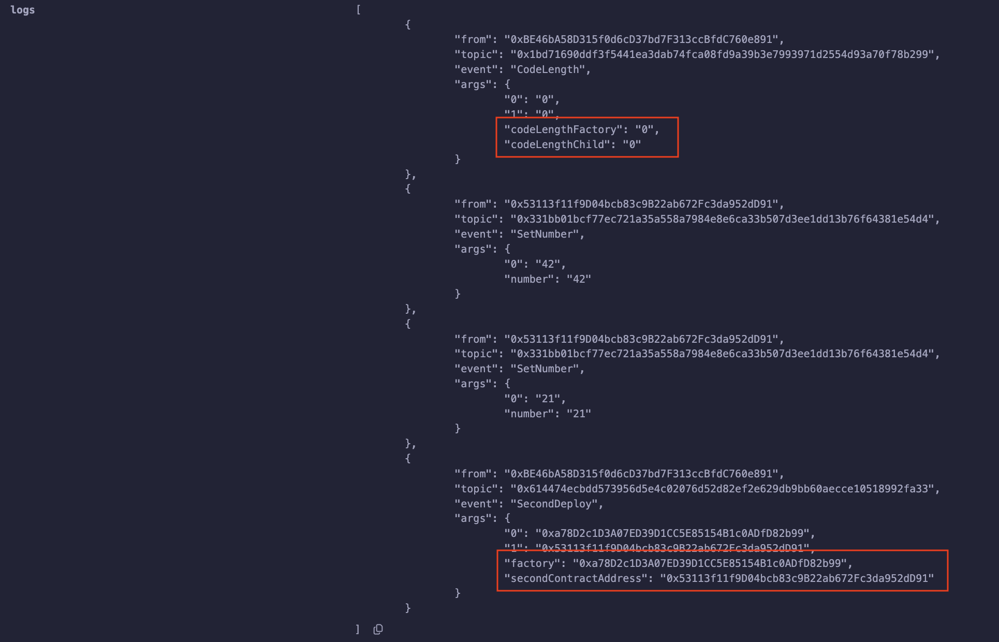

# EIP-1014: Skinny CREATE2

**Автор:** [Роман Ярлыков](https://github.com/rlkvrv) 🧐  

Раньше было лучше — ну или, по крайней мере, надежнее. Так можно сказать про опкод `CREATE`, предшественника `CREATE2`. Он был прост и не создавал проблем (возможных уязвимостей).  

*Важно!* Опкоды `CREATE` и `CREATE2` используются только для создания смарт-контрактов из других смарт-контрактов. При первоначальном развертывании контракта в поле транзакции `to` записывается `nil`, а его фактическое создание выполняется опкодом `RETURN` в `creationCode`.  

## Опкод CREATE  

На самом деле, опкод `CREATE` никуда не делся — он используется всегда, когда контракт создается через ключевое слово `new`:  

```solidity
contract Bar {
    // @notice Создание контракта через create без отправки wei на новый адрес
    function createFoo() external returns (address) {
        Foo foo = new Foo();

        return address(foo);
    }

    // @notice Создание контракта через create с отправкой wei на новый адрес
    function createBaz() external payable returns (address) {
        Baz baz = new Baz{value: msg.value}();

        return address(baz);
    }
}
```

Полный код контракта приведен [здесь](./contracts/CreateWithNew.sol).  

Опкод `CREATE` принимает три аргумента и возвращает одно значение:  

**Входные данные (Stack input):**  
- `value` — количество нативной валюты в wei, которое будет отправлено на новый адрес.  
- `offset` — смещение байтов, с которого начинается код инициализации контракта.  
- `size` — размер кода инициализации.  

**Выходные данные (Stack output):**  
- `address` — адрес развернутого контракта либо `0`, если произошла ошибка.  

Развертывание контракта через assembly выглядит нагляднее:  

```solidity
contract Deployer {
    // @notice Создание контракта через create без отправки wei на новый адрес
    function deployFoo() public returns (address) {
        address foo;
        bytes memory initCode = type(Foo).creationCode;

        assembly {
            // Загружаем код инициализации в память
            let codeSize := mload(initCode)  // Размер кода инициализации
            let codeOffset := add(initCode, 0x20)  // Пропускаем 32 байта, содержащие длину массива initCode

            // Вызываем CREATE без отправки msg.value
            foo := create(0, codeOffset, codeSize)
            // Проверяем, что контракт был успешно создан
            if iszero(foo) { revert(0, 0) }
        }

        return foo;
    }
}
```

Полный код контракта с созданием через assembly — [здесь](./contracts/CreateWithAssembly.sol).

### Вычисление адреса опкодом CREATE (0xf0)  

Чтобы опкод `CREATE` мог вернуть адрес развернутого контракта, ему необходимы адрес вызывающей стороны (`msg.sender`) и ее `nonce`:  

В упрощенном виде это выглядит так:  
```js
address = hash(sender, nonce)
```
Но на самом деле процесс сложнее:  
```js
address = keccak256(rlp([sender_address, sender_nonce]))[12:]
```

Где:  
- `sender_address` — адрес отправителя, создающего контракт.  
- `sender_nonce` — nonce отправителя (количество транзакций, отправленных с этого адреса).  
- `rlp` — функция RLP-кодирования. RLP (Recursive Length Prefix) используется для сериализации данных в Ethereum, обеспечивая однозначное и предсказуемое кодирование.  
- `keccak256` — хеш-функция Keccak-256.  
- `[12:]` — первые 12 байт отбрасываются, поскольку `keccak256` возвращает 32 байта, а адрес в Ethereum занимает последние 20 байт хеша (32 - 20 = 12).  

Таким образом, в теории можно вычислить адрес будущего контракта заранее. Однако есть проблема: этот адрес зависит от `nonce`. Если перед развертыванием контракта будет отправлена другая транзакция, `nonce` увеличится, и вычисленный адрес станет недействительным.  

Из-за использования RLP для вычисления адреса в Solidity перед развертыванием необходима следующая громоздкая функция:  

```solidity
function computeAddressWithCreate(uint256 _nonce) public view returns (address) {
    address _origin = address(this);
    bytes memory data;

    if (_nonce == 0x00) {
        data = abi.encodePacked(bytes1(0xd6), bytes1(0x94), _origin, bytes1(0x80));
    } else if (_nonce <= 0x7f) {
        data = abi.encodePacked(bytes1(0xd6), bytes1(0x94), _origin, uint8(_nonce));
    } else if (_nonce <= 0xff) {
        data = abi.encodePacked(bytes1(0xd7), bytes1(0x94), _origin, bytes1(0x81), uint8(_nonce));
    } else if (_nonce <= 0xffff) {
        data = abi.encodePacked(bytes1(0xd8), bytes1(0x94), _origin, bytes1(0x82), uint16(_nonce));
    } else if (_nonce <= 0xffffff) {
        data = abi.encodePacked(bytes1(0xd9), bytes1(0x94), _origin, bytes1(0x83), uint24(_nonce));
    } else {
        data = abi.encodePacked(bytes1(0xda), bytes1(0x94), _origin, bytes1(0x84), uint32(_nonce));
    }
    return address(uint160(uint256(keccak256(data))));
}
```
Я добавил ее в [этот файл](./contracts/CreateWithAssembly.sol) — можете протестировать в Remix.  

## Предпосылки создания CREATE2  

В 2018 году Виталик Бутерин предложил [EIP-1014: Skinny CREATE2](https://eips.ethereum.org/EIPS/eip-1014) со следующей мотивацией:  

> *"Позволяет проводить взаимодействия (фактически или контрфактически в каналах) с адресами, которые еще не существуют на блокчейне, но могут быть использованы, предполагая, что в будущем они будут содержать код, созданный определенным кодом инициализации. Важно для случаев использования каналов состояния, связанных с контрфактическими взаимодействиями с контрактами."*  

Звучит сложно, но попробую объяснить. Дело в [state channels](https://ethereum.org/en/developers/docs/scaling/state-channels/) — одном из подвидов Layer 2. До появления rollups они рассматривались как способ масштабирования Ethereum.  

Если коротко, в каналах состояния существовали неэффективности, которые можно было устранить с помощью *counterfactual instantiation*. Суть в том, что смарт-контракт мог существовать контрфактически — то есть его не нужно было развертывать, но его адрес был известен заранее.  

Этот контракт мог быть развернут ончейн в случае необходимости — например, если один из участников канала пытался обмануть другого в процессе офф-чейн транзакции.  

Пример из описания механизма:  
> *"Представьте платежный канал между Алисой и Бобом. Алиса отправляет Бобу 4 ETH через канал, подписав соответствующую транзакцию. Эта транзакция может быть развернута ончейн в любой момент, но этого не происходит. Таким образом, можно сказать: 'Контрфактически Алиса отправила Бобу 4 ETH'. Это позволяет им действовать так, как будто транзакция уже состоялась — она окончательная в рамках заданных моделей угроз."*  

То есть, по теории игр, зная, что существует такая "страховка", стороны не будут пытаться обмануть друг друга, а сам контракт, скорее всего, так и не придется развертывать.  

Подробнее об этом можно почитать [здесь](https://medium.com/statechannels/counterfactual-generalized-state-channels-on-ethereum-d38a36d25fc6) и [здесь](https://medium.com/spankchain/a-state-channels-adventure-with-counterfactual-rick-part-1-ce68e16252ea), но тема непростая — я вас предупредил.

## Как работает опкод CREATE2 (0xf5)  

Опкод `CREATE2` был введен в хардфорке *Константинополь* как альтернатива `CREATE`. Главное отличие — способ вычисления адреса создаваемого контракта. Вместо `nonce` деплойера используется код инициализации (`creationCode`) и *соль* (`salt`).  

Новая формула вычисления адреса:  
```js
address = keccak256(0xff + sender_address + salt + keccak256(initialisation_code))[12:]
```

- `0xff` — префикс, предотвращающий коллизии с адресами, созданными через `CREATE`. В RLP-кодировке `0xff` может использоваться только для данных петабайтного размера, что нереалистично в EVM. Дополнительно `keccak256` защищает от коллизий.  
- `sender_address` — адрес отправителя, создающего контракт.
- `salt` — 32-байтовое значение, обычно `keccak256` от некоторого набора данных, который обеспечивает уникальность этой соли. 
- `initialisation_code` — код инициализации контракта (*не путать с runtime code*). Он подготавливает `memory`, работает с `msg.value` и разворачивает runtime code контракта. Код конструктора (`constructor`) также включается в `initialisation_code`.  

*Важно!* Если `CREATE` или `CREATE2` вызывается в **транзакции создания** и адрес назначения уже содержит ненулевой `nonce` или непустой `code`, создание немедленно завершается (revert), аналогично ситуации, когда первый байт `initialisation_code` — недействительный опкод.  

Это означает, что если при деплое случится коллизия адреса с уже существующим контрактом (например, развернутым через `CREATE`), произойдет `revert`, так как `nonce` адреса уже ненулевой. Это поведение **нельзя изменить даже через `SELFDESTRUCT`**, так как он не сбрасывает `nonce` в той же транзакции.  

По сравнению с `CREATE`, `CREATE2` отличается лишь добавлением одного параметра на входе — `salt`.

**Входные данные (Stack input):**
- `value` — количество нативной валюты (wei) для отправки на новый адрес.  
- `offset` — смещение байтов, с которого начинается код инициализации.  
- `size` — размер кода инициализации.  
- `salt` — 32-байтовое значение, используемое при создании контракта.  

**Выходные данные (Stack output):**  
- `address` — адрес развернутого контракта или `0`, если произошла ошибка.  

### Использование CREATE2 в Solidity  

В Solidity `CREATE2` можно использовать так же, как `CREATE`, просто добавив `salt`:  

```solidity
contract DeployerCreate2 {
    /// @notice Создание контракта через create2 без отправки wei
    function create2Foo(bytes32 _salt) external returns (address) {
        Foo foo = new Foo{salt: _salt}();
        return address(foo);
    }

    /// @notice Создание контракта через create2 с отправкой wei
    function create2Bar(bytes32 _salt) external payable returns (address) {
        Bar bar = new Bar{value: msg.value, salt: _salt}();
        return address(bar);
    }
}
```
Полный код контракта [здесь](./contracts/Create2WithNew.sol).  

### CREATE2 с помощью Assembly  

Пример кода на *Assembly* (взято из [Cyfrin](https://www.cyfrin.io/glossary/precompute-contract-address-with-create2-solidity-code-example)):  

```solidity
function deploy(bytes memory bytecode, uint256 _salt) public payable {
    address addr;

    /*
    NOTE: Как вызвать create2

    create2(v, p, n, s)
    создает новый контракт с кодом в памяти от p до p + n
    и отправляет v wei
    и возвращает новый адрес
    где новый адрес = первые 20 байт keccak256(0xff + address(this) + s + keccak256(mem[p…(p+n)]))
          s = big-endian 256-битное значение
    */
    assembly {
        addr :=
            create2(
                callvalue(),       // wei, отправленный с вызовом
                add(bytecode, 0x20),  // Код начинается после первых 32 байт (длина массива)
                mload(bytecode),   // Размер кода (первые 32 байта)
                _salt              // Соль
            )

        if iszero(extcodesize(addr)) { revert(0, 0) }
    }

    emit Deployed(addr, _salt);
}
```
Полный код контракта [здесь](./contracts/Create2WithAssembly.sol).  

## Траты на газ  

Ранее, при вычислении адреса через `CREATE`, использовались только `address` и `nonce`, занимающие не более 64 байт. Поэтому дополнительная плата за вычисления не взималась ([см. evm.codes](https://www.evm.codes/?fork=cancun#f0)).  

В `CREATE2` добавилось вычисление хеша от кода инициализации (`hash_cost`), так как его размер может сильно варьироваться. Это изменило формулу расчета газа:  

```js
minimum_word_size = (size + 31) / 32
init_code_cost = 2 * minimum_word_size
hash_cost = 6 * minimum_word_size
code_deposit_cost = 200 * deployed_code_size

static_gas = 32000
dynamic_gas = init_code_cost + hash_cost + memory_expansion_cost + deployment_code_execution_cost + code_deposit_cost
```
Таким образом, использование `CREATE2` обходится дороже `CREATE`, но дает возможность предсказать адрес контракта до его создания, что открывает новые возможности.

## Преимущества CREATE2  

Что дало введение нового опкода?  

1. **Контрфактическая инициализация**  
   `CREATE2` позволяет резервировать адреса контрактов до их фактического развертывания. Это особенно полезно в каналах состояния, о которых мы говорили ранее.  

2. **Упрощение онбординга пользователей**  
   В контексте абстракции аккаунтов контрфактическая инициализация позволяет создавать аккаунты оффчейн и развертывать их только при первой транзакции, которая к тому же может быть оплачена через релейный сервер. Это делает создание *абстрактного аккаунта* проще, чем создание EOA.  

   В момент появления `CREATE2` это было лишь идеей, но спустя три года концепция была реализована в [ERC-4337](https://eips.ethereum.org/EIPS/eip-4337#first-time-account-creation). Для этого используется статический вызов `entryPoint.getSenderAddress(bytes initCode)`, который позволяет получить контрфактический адрес кошелька до его создания.  

3. **Vanity-адреса**  
   Можно подобрать "красивый" адрес, перебирая `salt`, например, если хотите, чтобы он начинался или заканчивался на определенные символы: `0xC0FFEE...`, `0xDEADBEEF...` и т. д.  

4. **Эффективные адреса**  
   В EVM стоимость нулевых и ненулевых байт различается. За каждый ненулевой байт `calldata` взимается `G_txdatanonzero` (16 газа), а за нулевой — `G_txdatazero` (4 газа). Это значит, что если ваш адрес начинается с нулей, его использование будет дешевле.  

   Здесь подробно разобран этот аспект: [On Efficient Ethereum Addresses](https://medium.com/coinmonks/on-efficient-ethereum-addresses-3fef0596e263) (хотя расчеты по газу уже устарели из-за изменения стоимости `calldata`).  

5. **Метаморфичные контракты**  
   Способ обновления контрактов через `CREATE2`, при котором контракт уничтожается (`SELFDESTRUCT`) и создается заново с тем же адресом, но с новым кодом. К счастью сообщество не приняло этот подход, например, в [этой статье](https://0age.medium.com/the-promise-and-the-peril-of-metamorphic-contracts-9eb8b8413c5e) его называют *"уродливым сводным братом Transparent Proxy"*.  

   Примеры кода можно посмотреть [здесь](https://github.com/0age/metamorphic/blob/master/README.md).  

6. **Вычисление адреса вместо хранения**  
   В ряде случаев проще вычислить адрес контракта, развернутого через `CREATE2`, чем хранить его. Яркий пример — *Uniswap v2*.  

   **Как это работает?**  

   - Для создания пар через [UniswapV2Factory](https://github.com/Uniswap/v2-core/blob/ee547b17853e71ed4e0101ccfd52e70d5acded58/contracts/UniswapV2Factory.sol#L23) используется `CREATE2`, а в качестве соли используются адреса двух токенов в паре. Обратите внимание, что контракт пары использует функцию `initialize` для сохранения адресов токенов, это важный момент.

     ```solidity
     function createPair(address tokenA, address tokenB) external returns (address pair) {
         /// ...
         bytes memory bytecode = type(UniswapV2Pair).creationCode;
         bytes32 salt = keccak256(abi.encodePacked(token0, token1));
         assembly {
             pair := create2(0, add(bytecode, 32), mload(bytecode), salt)
         }
         IUniswapV2Pair(pair).initialize(token0, token1);
         /// ...
     }
     ```

   - Теперь библиотека `UniswapV2Library` может **вычислять** адрес пары, используя заранее известный `init code hash` в функции [pairFor]([UniswapV2Library::pairFor](https://github.com/Uniswap/v2-periphery/blob/0335e8f7e1bd1e8d8329fd300aea2ef2f36dd19f/contracts/libraries/UniswapV2Library.sol#L18)). При этом код инициализации можно просто захардкодить, потому что нам не нужно добавлять аргументы конструктора (именно поэтому используется `initialize`):  

     ```solidity
     function pairFor(address factory, address tokenA, address tokenB) internal pure returns (address pair) {
         (address token0, address token1) = sortTokens(tokenA, tokenB);
         pair = address(uint(keccak256(abi.encodePacked(
             hex'ff',
             factory,
             keccak256(abi.encodePacked(token0, token1)),
             hex'96e8ac4277198ff8b6f785478aa9a39f403cb768dd02cbee326c3e7da348845f' // init code hash
         ))));
     }
     ```

     ⚠️ *Если форкаете Uniswap v2, не забудьте поменять `init code hash`, так как он зависит от фабрики (`factory`), адрес которой устанавливается в конструкторе контракта пары.*  

   - Ну и теперь имея функцию `pairFor` можно спокойно вычислять этот адрес когда необходимо. Только посмотрите как часто эта функция используется в [UniswapV2Router01](https://github.com/Uniswap/v2-periphery/blob/master/contracts/UniswapV2Router01.sol). К примеру так выглядит функция добавления ликвидности:

     ```solidity
     function addLiquidity(
         address tokenA,
         address tokenB,
         uint amountADesired,
         uint amountBDesired,
         uint amountAMin,
         uint amountBMin,
         address to,
         uint deadline
     ) external override ensure(deadline) returns (uint amountA, uint amountB, uint liquidity) {
         (amountA, amountB) = _addLiquidity(tokenA, tokenB, amountADesired, amountBDesired, amountAMin, amountBMin);
         address pair = UniswapV2Library.pairFor(factory, tokenA, tokenB);
         ///...
     }
     ```

Как видно, `CREATE2` открыл множество новых возможностей, хотя у него есть и недостатки.

## Уязвимость CREATE2  

В документации Solidity можно встретить следующее предупреждение:  

> "*Создание солей имеет некоторые особенности. Контракт может быть повторно создан по тому же адресу после того, как он был уничтожен. При этом вновь созданный контракт может иметь другой развернутый байткод, даже если байткод создания был тем же самым (что является обязательным условием, поскольку в противном случае адрес изменился бы). Это связано с тем, что конструктор может запросить внешнее состояние, которое могло измениться между двумя созданиями, и включить его в развернутый байткод до того, как он будет сохранен."*  

Речь идет о хорошо известной уязвимости: комбинация `CREATE` и `CREATE2` в сочетании с `SELFDESTRUCT` позволяет развернуть на одном и том же адресе **разные** контракты. Именно этот метод использовали при [взломе Tornado Cash](https://coinsbench.com/understanding-soliditys-create-create2-with-tornado-cash-1m-hack-01f8c147e5c7), когда был украден $1M.  

Это также касается **метаморфических контрактов**. В статье выше есть ссылка на репозиторий с демонстрацией этой атаки, но чтобы повторить ее в Remix, я немного изменил код: [MetamorphicContract](./contracts/MetamorphicContract.sol). Оригинальный код можно найти [здесь](https://github.com/ManaanAnsari/solidity-metamorphic-contracts-example/blob/main/test/MetamorphicContract.t.sol).  

### Демонстрация атаки  

Контракт фабрики:  
```solidity
contract Factory {
    function createFirst() public returns (address) {
        return address(new First());
    }

    function createSecond(uint256 _number) public returns (address) {
        return address(new Second(_number));
    }

    function kill() public {
        selfdestruct(payable(address(0)));
    }
}
```
Эта фабрика создает контракты **с идентичными адресами, но разным кодом**. 😈  

Шаг 1. Деплоим `MetamorphicContract` и вызываем функцию `firstDeploy`:

```solidity
function firstDeploy() external {
    factory = new Factory{salt: keccak256(abi.encode("evil"))}();
    first = First(factory.createFirst());

    emit FirstDeploy(address(factory), address(first));

    first.kill();
    factory.kill();
}
```
Этот вызов:  
- Деплоит фабрику и первую версию контракта.  
- Уничтожает их сразу после развертывания.  
- Логирует их адреса.  

Результат в Remix:  
  

Шаг 2. Теперь можно вызывать функцию `secondDeploy`:

```solidity
function secondDeploy() external {
    /// Проверяем, что контракты удалены
    emit CodeLength(address(factory).code.length, address(first).code.length);

    /// Деплоим фабрику на тот же адрес
    factory = new Factory{salt: keccak256(abi.encode("evil"))}();

    /// Деплоим новый контракт на тот же адрес, что и первый
    second = Second(factory.createSecond(42));

    /// Проверяем, что адреса совпадают
    require(address(first) == address(second));

    /// Выполняем логику нового контракта
    second.setNumber(21);

    /// Логируем адреса
    emit SecondDeploy(address(factory), address(second));
}
```
Результат в Remix:  
  

**Что здесь произошло?**

1. Развернули фабрику через `CREATE2` с фиксированной солью.  
2. Фабрика через `CREATE` создала контракт-имплементацию. Ее адрес зависит от адреса фабрики и `nonce`.  
3. Уничтожили оба контракта (`SELFDESTRUCT`). Это **обнулило nonce** фабрики.  
4. Развернули ту же фабрику **по тому же адресу** (так как соль не изменилась).  
5. Развернули **другую** имплементацию **по тому же адресу**, так как `nonce` фабрики снова `0`.  
6. Теперь на одном и том же адресе — совершенно другой код!  

Теперь вы знаете, как можно развернуть **разные** контракты на **одном** адресе. 🚨

## Ссылки

- [EIP-1014: Skinny CREATE2](https://eips.ethereum.org/EIPS/eip-1014)
- [Docs: Salted contract creations / create2](https://docs.soliditylang.org/en/latest/control-structures.html#salted-contract-creations-create2)
- [Blog: Precompute Contract Address with Create2](https://www.cyfrin.io/glossary/precompute-contract-address-with-create2-solidity-code-example)
- [Blog: Getting the most out of CREATE2](https://blog.openzeppelin.com/getting-the-most-out-of-create2)
- [Blog: A State Channels Adventure with Counterfactual Rick! (Part 1)](https://medium.com/spankchain/a-state-channels-adventure-with-counterfactual-rick-part-1-ce68e16252ea)
- [Blog: Counterfactual: Generalized State Channels on Ethereum](https://medium.com/statechannels/counterfactual-generalized-state-channels-on-ethereum-d38a36d25fc6)
- [Blog: Understanding Solidity’s create & create2 with Tornado Cash $1M Hack](https://coinsbench.com/understanding-soliditys-create-create2-with-tornado-cash-1m-hack-01f8c147e5c7)
- [Blog: On Efficient Ethereum Addresses](https://medium.com/coinmonks/on-efficient-ethereum-addresses-3fef0596e263)