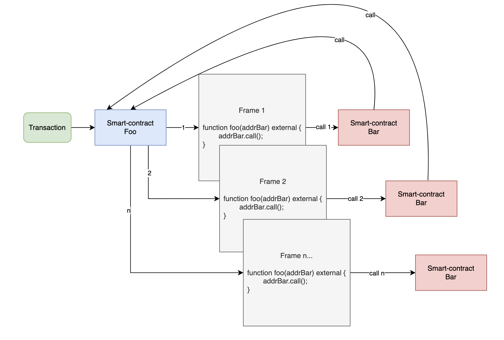
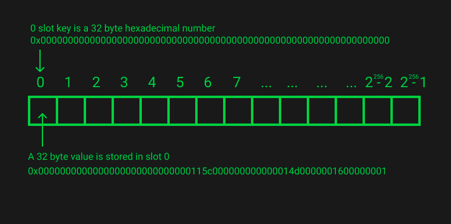
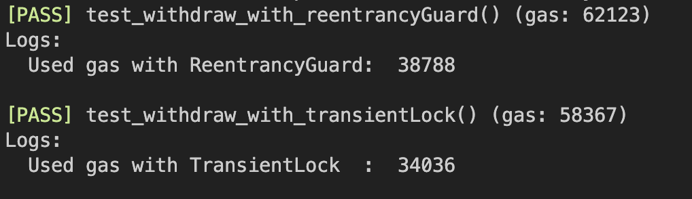

# EIP-1153: Transient storage opcodes

**Автор:** [Роман Ярлыков](https://github.com/rlkvrv) 🧐

На момент принятия EIP основной проблемой было нерациональное использование газа, когда слот хранилища смарт-контракта изменяется в ходе транзакции и затем возвращается к исходному значению, например, при блокировке функции для защиты от атак reentrancy. Иными словами, в ситуациях, когда постоянное хранилище используется как временное, а также в случаях необходимости безопасной передачи данных между фреймами вызовов.

Предлагались различные решения этой проблемы:  "dirty map", изменение механизмов расчета газа (включая правила возврата газа), "прогревы", "списки доступа", а также введение градации для записываемых значений в хранилище (original, current, new) и различных состояний слотов (no-op, dirty, fresh). Это привело к созданию множества правил, изменяющихся с каждым хард-форком через новые EIP:


При этом каждое новое предложение закрывало одну проблему и порождало другую:
- удешевление опокдов открывало возможность для DoS-атак, а удорожание негативно сказывалось на стоимости транзакций;
- возвраты газа позволили создавать газовые токены, которые нарушали стабильность системы;
- возвраты газа изначально также были направлены на очищение блокчейна от лишних данных, но из-за вышеупомянутых проблемы эти возвраты пришлось сократить до 20% на всю транзакцию, что привело к обратному эффекту - стало выгоднее держать хранилище "грязным", а это раздувает общее состояние блокчейна.

С хард-форком Dencun (Cancun-Deneb) в рамках обновления слоя выполнения был представлен [EIP-1153: Transient storage opcodes](https://eips.ethereum.org/EIPS/eip-1153), предлагающий решение этой проблемы за счет введения двух новых опкодов (`TSTORE`, `TLOAD`) и создания нового типа памяти в EVM - `transient storage`. Это позволит абстрагировать проблему от постоянного хранилища (storage) и даст возможность в будущем отменить некоторые сложные правила расчета газа, потому что в них больше не будет необходимости. 

Разработчикам предстоит освоить работу с новым видом памяти в EVM или как минимум понять, как это работает, чтобы использовать библиотеки и делать интеграции со смарт-контрактами использующими `transient storage`. Интересно? Мне очень, так что приступим.

## Суть проблемы

Постоянное хранилище (`storage`) предназначено для длительного хранения данных в блокчейне, так зачем использовать его как временное хранилище? 

Ответ на этот вопрос наиболее наглядно демонстрируется на примере защиты от атак reentrancy, которые остаются серьезной угрозой для EVM, несмотря на то, что про эту атаку хорошо знают большинство разработчиков. Для защиты от reentrancy применяются "Reentrancy locks", обычно реализуемые через библиотеки, такие как [OpenZeppelin](https://github.com/OpenZeppelin/openzeppelin-contracts/blob/master/contracts/utils/ReentrancyGuard.sol), где ключевой элемент — установка флага состояния замка (включено/выключено). Этот флаг фиксируется в `storage` смарт-контракта, однако возникает вопрос: почему не использовать менее затратную `memory`?

Проблема кроется в межфреймовом взаимодействии:

> *Фрейм (frame)* — это контекст выполнения транзакции в EVM.

В процессе транзакции, внутри контракта создается фрейм. Если смарт-контракт осуществляет внешние вызовы, генерируются новые фреймы, каждый из которых порождается семейством инструкций *CALL. Таким образом, один контракт может иметь несколько фреймов в рамках одной транзакции.

На схеме процесс создания новых фреймов при атаке Reentrancy выглядит так:



Каждый новый вызов функции выделяет собственную `memory`, делая данные предыдущего фрейма недоступными для последующих. Существуют два основных способа передачи данных между фреймами:

1. **Через входные/выходные данные (input/output)**, используя инструкции вызова *CALL. Однако, если между фреймами есть посредник в виде другого смарт-контракта, безопасность такого обмена под вопросом.

2. **Через обновления хранилища** с помощью `SSTORE`/`SLOAD`, что гарантирует безопасность, но влечет за собой высокие расходы газа.

*Важно!* Новые фреймы создаются при любом внешнем вызове, например, при выполнении перевода токенов ERC20 вызывается смарт-контракт токена, что также ведет к созданию дополнительного фрейма.

*Важно!* Оба способа передачи данных между фреймами обходятся дорого по газу и являются скорее "компромиссом" между дороговизной транзакции и необходимостью применения такого подхода.

## Как теперь выглядят все типы памяти в EVM

EIP-1153 вносит новый вид хранения данных в EVM, дополняя существующие типы памяти. Это промежуточное хранилище между `storage` и `memory`, обладающее уникальными свойствами. Перечислим все виды памяти доступные в EVM:

**Постоянное хранилище (storage)** - "долговременная память", где каждый контракт хранит свои данные на постоянной основе. Это хранилище - самое дорогостоящее, поскольку данные нужно поддерживать на каждом узле блокчейна.

**Переходное хранилище (transient storage)**, предложенное в EIP-1153, является "среднесрочной памятью". Оно сохраняет данные на протяжении нескольких вызовов функций в рамках одной транзакции (что недоступно для `memory`) и полностью очищается в конце транзакции (что отличает его от `storage`).

**Память (memory)** - "кратковременная память", применяемая для временного хранения данных во время выполнения функции. Она очищается после завершения функции, и хотя потребление газа у этого вида памяти сильно ниже `storage`, оно экспоненциально увеличивается с ростом объема записываемых данных.

Визуальное сравнение трех типов хранилищ можно увидеть на схеме из [обсуждения EIP-1153](https://ethereum-magicians.org/t/eip-1153-transient-storage-opcodes/553/78):


Дополнительно, в EVM существуют и другие формы хранения данных:

- **calldata** - неизменяемые данные вызова, передаваемые в контракт вместе с транзакцией;
- **stack** - структура данных типа LIFO. У разработчиков нет инструментов для управления стеком, все что можно сделать - это с помощью `inline assembly` положить туда несколько значений и произвести с ними одну из простых операций типа `add`, `sub`, `mul` и т.д., но чтобы затем получить результат из функции все равно потребуется воспользоваться `memory`;
- **EVM code** - код инициализации и исполнения смарт-контракта, включая `immutable` переменные;
- **Program Counter (PC)** - внутренний счетчик клиента исполнения, его значение можно получить только через `inline assembly` вызвав инструкцию `pc()`;
- **Available gas** - счетчик доступного газа, его значение можно получить вызвав функцию `gasleft()` Solidity.

## Устройство transient storage

`transient storage` в EVM, представленный в EIP-1153, устроен аналогично `storage` — это один очень большой массив байт, поэтому принципы работы с данным хранилищем (чтение, запись, схемы хранения разных типов данных) точно такие же. При этом между собой эти два типа памяти никак не пересекаются, то есть `transient storage` это не выделенная часть `storage`, а отдельная память со слотами от 0 до 2<sup>256</sup> - 1.



Здесь мы не будем останавливаться на устройстве `storage`, об этом написано большое количество хороших материалов, например можно почитать [тут](https://noxx.substack.com/p/evm-deep-dives-the-path-to-shadowy-3ea) и [тут](https://steveng.medium.com/ethereum-virtual-machine-storage-layout-beb9a72a07e9).

Важно понять одну вещь - все взаимодействие с `transient storage` осуществляется через хеш-таблицу (ключ-значение), где 32-байтовый ключ указывает на 32-байтовое значение. Для обращения к этому виду памяти введены два новых опкода: `TSTORE` для записи и `TLOAD` для чтения, аналогичные `SSTORE`/`SLOAD` для `storage` и `MSTORE`/`MLOAD` для `memory`.

## Потребление газа

Потребление газа для `TSTORE` и `TLOAD` стандартизировано и не зависит от предыдущего состояния данных:

- `TSTORE` потребляет газ аналогично записи в "грязный" слот `storage` (current != new; current != original):
  - **new** - это новое значение на запись в хранилище; 
  - **current** - текущее значение по ходу транзакции (перед каждым вызовом `SSTORE`)
  - **original** - значение в хранилище на момент старта транзакции.

- `TLOAD` имеет стоимость сравнимую с "теплым" чтением из `storage`.

| Opcode | Gas | Cold       | Warm |
| ------ | --- | ---------- | ---- |
| SLOAD  | -   | 2100       | 100  |
| SSTORE | -   | 20000/5000 | 100  |
| TLOAD  | 100 | -          | -    |
| TSTORE | 100 | -          | -    |
| MLOAD  | 3   | -          | -    |
| MSTORE | 3   | -          | -    |

*Примечание:* Данные актуальны для хард-форка Cancun, но уже есть черновик [EIP-7609](https://eips.ethereum.org/EIPS/eip-7609) на изменение ценообразования для `TLOAD` и `TSTORE`.

На данный момент `transient storage` имеет фиксированную стоимость. Важно отметить, что для операций в рамках одной функции - `memory` остается наиболее экономичным вариантом.

В целом `transient storage` предлагает решение для тех же задач, что и концепции "теплого"/"холодного" и "чистого"/"грязного" хранилища, при этом с более простыми правилами и предсказуемым расходом газа.

## Особенности

Как я уже сказал выше - `transient storage` очень похож на обычный `storage`, за исключением принудительной очистки данных в конце транзакции, но есть и другие отличия и схожие черты, о которых стоит упомянуть:

| свойство хранилища                        | storage                                                                                                                                 | transient storage                                                                                                                      |
| ----------------------------------------- | --------------------------------------------------------------------------------------------------------------------------------------- | -------------------------------------------------------------------------------------------------------------------------------------- |
| *Время хранения данных*                   | Данные остаются в блокчейне пока не будут явно перезаписаны или удалены                                                                 | Данные хранятся только в процессе выполнения транзакции, по завершению транзакции хранилище полностью очищается                        |
| *Поведение при вызове внешних контрактов* | При использовании `CALL` или `STATICCALL` у вызываемого контракта уже есть собственное **постоянное** хранилище                         | При использовании `CALL` или `STATICCALL`, вызываемый контракт создает своё собственное **переходное** хранилище                       |
| *Доступ к хранилищу*                      | Доступ зависит от области видимости (`public`, `internal`, `private`)                                                                   | Доступ есть только у смарт-контракта, который его создал (по аналогии с областью видимости `private` постоянного хранилища)            |
| *Ограничения по `gasleft`*                | Для операции записи `SSTORE` **требуется**, чтобы в текущем фрейме оставалось не менее порога газовой стипендии (2,300 единиц газа)     | Для операции записи `TSTORE` **не требуется**, чтобы в текущем фрейме оставалось не менее порога газовой стипендии (2,300 единиц газа) |
| *Межфреймовое взаимодействие*             | Доступно в текущем фрейме и во всех новых фреймах                                                                                       | Поведение аналогично `storage`                                                                                                         |
| *Работа с прокси-контрактами*             | При использовании `DELEGATECALL` или `CALLCODE`, владельцем постоянного хранилища является прокси-контракт, а не контракт-имплементация | Поведение аналогично `storage`                                                                                                         |
| *Возврат состояния*                       | При откате фрейма (`revert`) все изменения, произошедшие с момента входа в фрейм и до отката, аннулируются                              | Поведение аналогично `storage`                                                                                                         |


## Как использовать

Первоначальное предложение включало только такой случай использования, как "Reentrancy look", но в ходе обсуждения EIP "обрастал" новыми вариантами использования. В самом EIP озвучены следующие примеры:

- **Защита от атаки reentrancy.** Позволяет временно блокировать вызовы к функциям смарт-контракта, предотвращая популярный тип атак;
- **Ончейн вычисление адреса через CREATE2.** Имеются в виду случаи когда есть необходимость прокинуть данные в конструктор через `storage` контракта-деплоера;
- **Approve и Transfer ERC20 в одной транзакции.** Упрощает взаимодействие с токенами ERC20, позволяет избавиться от callback-фукнкции при одновременной выдаче разрешения и трансфере токенов;
- **Fee-on-transfer contracts.** Облегчает реализацию контрактов, где комиссия удерживается с каждой передачи токенов, минимизируя затраты на газ;
- **Till pattern.** Поддерживает временное хранение данных во время транзакции, что может быть использовано для упрощения некоторых операций DEX или Lending-протоколов;
- **Proxy call metadata.** Упрощает передачу метаданных при вызовах через прокси-контракты.


### Защита от атаки reentrancy

Защита от атаки reentrancy подробно описана, краткую выжимку по способам защиты можно посмотреть в [блоге OpenZeppelin](https://blog.openzeppelin.com/reentrancy-after-istanbul). 

В основном используются следующие подходы:
- **Checks-Effects-Interactions (CEI)** - методика, предписывающая такую последовательность: проверка условий, изменение состояния и только после этого внешние вызовы (детали [здесь](https://fravoll.github.io/solidity-patterns/checks_effects_interactions.html));
- **Pull payment pattern** - получатель платежа сам инициирует транзакцию вывода средств через `withdraw()` (детали [здесь](https://medium.com/@bansaltushar014/design-pattern-part-2-pull-payment-pattern-c1f7b4ca9ad4));
- **Reentrancy lock** - блокировка повторного входа в функцию.

#### Reentrancy lock

Остановимся подробнее на этом методе. Для его реализации необходимо делать запись именно в `storage` смарт-контракта, потому что при повторном обращении к функции создастся новый фрейм и данные `memory` из прошлого вызова недоступны, а передать данные с вызовом недоверенному смарт-контракту мы тоже не можем. Простейшее решение - использовать булеву переменную lock в контракте.

Пример:
```js
// SPDX-License-Identifier: MIT
pragma solidity 0.8.21;

contract ExampleWithBoolReentrancyLock {
    // Создаем переменную _lock
    bool private _lock;

    // ...

    function withdraw(uint256 amount) external {
        // Перед выполнением функции проверяем, что это не повторный вход
        if (_lock) {
            revert ReentrancyAttackPrevented();
        }
        // Блокируем функцию для защиты от повторного входа
        _lock = true;

        // Проверяем текущее состояние
        if (_balances[msg.sender] < amount) {
            revert InsufficientBalance();
        }

        // Изменяем состояние
        _balances[msg.sender] -= amount;

        // Переводим запрошенные средства 
        (bool success, ) = msg.sender.call{value: amount}("");
        if (!success) {
            revert TransferFailed();
        }

        // Выключаем блокировку функции
        _lock = false;
    }

    // ...
}
```
Полный пример смарт-контракта [тут](./contracts/ExampleWithBoolReentrancyLock.sol).

Эту реализацию можно оптимизировать:

- Использовать `uint` вместо `bool` снижает стоимость, т.к. `bool` занимает полное слово (32 байта) в памяти;
- С `uint` можно предварительно сделать слот "грязным" во время развертывания смарт-контракта чтобы в дальнейшем не платить 20,000 газа за каждую запись, а значение замка сделать к примеру равными 1 (unlock) и 2 (lock), чтобы избежать возвратов газа (напомню, что вернется только 20%);
- Функционал стоит инкапсулировать в модификатор и вынести в отдельный контракт для переиспользования.

Все вышеупомянутые улучшения сделаны в реализации ReentrancyGuard от OpenZeppelin, посмотреть смарт-контракт можно в их официальном [репозитории](https://github.com/OpenZeppelin/openzeppelin-contracts/blob/master/contracts/utils/ReentrancyGuard.sol). После подключения библиотеки смарт-контракт будет выглядеть [так](./contracts/ExampleWithReentrancyGuard.sol).

Библиотека добавляет модификатор `nonReentrant`, который изменяет `ReentrancyGuard::status` с `NOT_ENTERED` на `ENTERED`, перезаписывая слот с 1 на 2, и возвращает его обратно после выполнения. Однако, из-за работы с `storage`, это всё ещё затратно по газу.

#### Transient reentrancy lock

*Важно!* Чтобы запустить примеры ниже понадобится версия Solidity не ниже 0.8.24, а также версия EVM - Cancun;

Перейдем к реализации reentrancy lock с использованием `transient storage`. Для начала снова возьмем простой пример:

```js
// SPDX-License-Identifier: MIT
pragma solidity 0.8.25;

contract ExampleWithTransientReentrancyLock {
    // ...

    function withdraw(uint256 amount) external {
        // Создаем переменную чтобы получить значение из transient storage
        uint256 lock;
        // Проверяем есть ли по ключу 0 запись в transient storage
        assembly {
            lock := tload(0)
        }
        if (lock == 1) {
            revert ReentrancyAttackPrevented();
        }
        // Записываем по ключу 0 значение 1
        assembly {
            tstore(0, 1)
        }

        // _; Выполняем здесь логику вывода средств

        // Очищаем значение после внешнего вызова
        assembly {
            tstore(0, 0)
        }
    }
}
```
Выглядит не очень, правда? Но можно сделать как в [этом](https://arc.net/l/quote/ermtzdto) примере, добавив вспомогательные функции `tstore` и `tload`, а в качестве ключа использовать константу.

*Примечание:* В дальнейшем в Solidity скорее всего появится ключевое слово `transient` для объявления переменных на подобии `memory` или `storage`. 
```js
    uint256 transient lock = 1;
```

Пока же приходится использовать inline assembly.


Перепишем пример выше с использованием вспомогательных функций и модификатора nonReentrant:
```js
// SPDX-License-Identifier: MIT
pragma solidity 0.8.25;

contract ExampleWithTransientReentrancyLock {
    // Заводим константное значение для адресации в transient storage
    // keccak256("REENTRANCY_GUARD_SLOT");
    bytes32 constant REENTRANCY_GUARD_SLOT = 0x167f9e63e7ffa6919d959c882a4da1182dccfb0d790328477621b65d1978856b;

    // ...

    modifier nonReentrant() {
        // Перед выполнением функции проверяем, что это не повторный вход
        if (_tload(REENTRANCY_GUARD_SLOT) == 1) {
            revert ReentrancyAttackPrevented();
        }
        // Записываем по ключу REENTRANCY_GUARD_SLOT значение 1
        _tstore(REENTRANCY_GUARD_SLOT, 1);

        _;

        // Очищаем значение ключа в transient storage после внешнего вызова
        _tstore(REENTRANCY_GUARD_SLOT, 0);
    }

    function withdraw(uint256 amount) external nonReentrant {
        // ...
        // Основная логика функции
    }

    // Вспомогательная функция для записи в transient storage
    function tstore(bytes32 location, uint value) private {
        assembly {
            tstore(location, value)
        }
    }

    // Вспомогательная функция для чтения из transient storage
    function tload(bytes32 location) private returns (uint value) {
        assembly {
            value := tload(location)
        }
    }
}
```
Полный пример смарт-контракта [тут](./contracts/ExampleWithTransientReentrancyLock.sol).

Реализация ReentrancyGuardTransient от OpenZeppelin на момент написания статьи пока еще в разработке, посмотреть можно в этом [PR](https://github.com/OpenZeppelin/openzeppelin-contracts/pull/4955).

*Важно!* После выполнения внешнего вызова необходимо очищать `transient storage`, чтобы не возникло проблем при дальнейших вызовах функции в рамках одной транзакции.

Если сравнить потребление газа функции `withdraw` со "старой" реализацией ReentrancyGuard с такой же функцией, но которая будет использовать `transient storage` для reentrancy lock - разница получится существенная ≈ 4,750 ед. газа:



Я прикинул, сколько будет стоить использование обоих вариантов при цене ETH `$3500` и стоимости газа в 20 Gwei, результаты следующие:

| ReentrancyGuard | TransientReentrancyGuard |
| --------------- | ------------------------ |
| ≈ 5150 ед. газа | ≈ 400 ед. газа           |
| ≈ 0.36$         | ≈ 0.03$                  |

**Примечание:** Моя реализация TransientReentrancyGuard далека от эталонной, поэтому скорее всего реализация от тех же OpenZeppelin будет потреблять еще меньше газа.

### Ончейн вычисление адреса через CREATE2

Второе преимущество EIP-1153 напрямую связано с недостатком операции `CREATE2`. Дело в том, что для вычисления адреса `CREATE2` использует код инициализации смарт-контракта, а код инициализации в свою очередь включает аргументы конструктора. 

То есть создание детерминированных адресов это основная "фича" `CREATE2`, потому что при развертывании используется так называемая "соль", но при этом чтобы восстановить адрес потребуются не только "соль", но и аргументы конструктора, для формировании правильного байт-кода инициализации.

```go
address = keccak256(0xff + sender_address + salt + keccak256(initialisation_code))[12:]
```

Для сравнения в обычном `CREATE` используется только адрес отправителя транзакции (деплоера) и nonce его аккаунта:

```go
address = keccak256(rlp([sender_address,sender_nonce]))[12:]
```

 Почему это проблема и как она решается лучше всего можно увидеть на пример смарт-контракта [UniswapV3PoolDeployer](https://github.com/Uniswap/v3-core/blob/ed88be38ab2032d82bf10ac6f8d03aa631889d48/contracts/UniswapV3PoolDeployer.sol#L34-L36). Обратите внимание, функция `deploy()` ничего не передает в конструктор смарт-контракта `UniswapV3Pool`, вместо этого все необходимые параметры для развертывания записываются в переменную `parameters`:

 ```js
 contract UniswapV3PoolDeployer is IUniswapV3PoolDeployer {
    // Эти параметры необходимы для деплоя смарт-контракта UniswapV3Pool
    struct Parameters {
        address factory;
        address token0;
        address token1;
        uint24 fee;
        int24 tickSpacing;
    }

    // В storage создаем публичную переменную которая будет содержать
    // все необходимые параметры
    Parameters public override parameters;

    function deploy(
        address factory,
        address token0,
        address token1,
        uint24 fee,
        int24 tickSpacing
    ) internal returns (address pool) {
        // Записываем параметры в переменную
        parameters = Parameters({factory: factory, token0: token0, token1: token1, fee: fee, tickSpacing: tickSpacing});

        // В salt записываем только адреса токенов и комиссию
        pool = address(new UniswapV3Pool{salt: keccak256(abi.encode(token0, token1, fee))}());

        // После очищаем параметры
        delete parameters;
    }
}
 ```

Если перейти в конструктор [UniswapV3Pool](https://github.com/Uniswap/v3-core/blob/ed88be38ab2032d82bf10ac6f8d03aa631889d48/contracts/UniswapV3Pool.sol) можно увидеть, что параметры извлекаются из контракта UniswapV3PoolDeployer:

```js
    constructor() {
        int24 _tickSpacing;

        // Поучаем все необходимые параметры из смарт-контракта который выполняет деплой
        (factory, token0, token1, fee, _tickSpacing) = IUniswapV3PoolDeployer(msg.sender).parameters();
        tickSpacing = _tickSpacing;

        maxLiquidityPerTick = Tick.tickSpacingToMaxLiquidityPerTick(_tickSpacing);
    }
```

Аргументы передаются через запись в `storage`, а не конструктор, что кажется менее логичным. Однако, посмотрев библиотеку [PoolAddress](https://github.com/Uniswap/v3-periphery/blob/main/contracts/libraries/PoolAddress.sol) становится понятно, что байт-код инициализации UniswapV3Pool является константой. Зная адреса токенов и комиссию пула, можно легко вычислить адрес пула. Это главная причина, по которой разработчики предпочитают передачу параметров через хранилище деплоера, а не конструктор контракта.

`transient storage` очень хорошо подходит для передачи контекста в подобных случаях, причем это может применяться не только в связке с `CREATE2`, но и для других целей.

### Approve и Transfer ERC20 в одной транзакции

Все, кто когда-либо обрабатывал списание ERC20 на смарт-контракте, знают, что перед списанием токенов владелец аккаунта должен это списание одобрить - вызвать на токене функцию `approve(spender, amount)`. Это, мягко говоря, не очень удобно, потому что необходимо вызвать две транзакции вместо одной. Еще одна проблема - часто протоколы берут так называемый "бесконечный апрув", и опасность здесь в том, что если этот протокол будет взломан - плакали все ваши токены, списание которых вы одобрили.

Существуют некоторые ончейн решения, например, [ERC-2612](https://eips.ethereum.org/EIPS/eip-2612) - расширение, которое добавляет токену функцию `permit(address owner, address spender, uint value, uint deadline, uint8 v, bytes32 r, bytes32 s)`, она позволяет выдавать одобрение через подпись владельца аккаунта, чтобы избежать лишней транзакции.

Другой подход предлагает [ERC-1363](https://eips.ethereum.org/EIPS/eip-1363) - это тоже расширение для ERC20, которое добавляет токену функцию `approveAndCall(address spender, uint256 value)`, эта функция позволяет выдать апрув и перевести токены в одной транзакции, но с важной оговоркой - принимающая сторона обязательно должна реализовать callback-функцию `onApprovalReceived(address owner, uint256 value, bytes memory data)`.

Оба этих подхода имеют свои плюсы и минусы, но что в противовес может предложить функция `temporaryApprove(spender, amount)`, которая заявлена как один из способов использования `transient storage`?

Идея очень простая: смарт-контракту токена ERC20 также нужно будет добавить функцию по типу `approveAndCall(address spender, uint256 value, bytes memory data)`, она будет записывать одобренное количество токенов в `transient storage` и вызывать внешний смарт-контракт. Внешний смарт-контракт сможет просто выполнить `transferFrom` на одобренную сумму. В процессе выполнения `transferFrom` одобренное значение в временном хранилище будет обнулено, поэтому атаку reentrancy выполнить не выйдет.

Я сделал [пример](./contracts/ERC20WithTempApprove.sol) простой реализации такого функционала. На момент написания статьи это только концепция; как это будет реализовано популярными библиотеками нам еще предстоит увидеть.

### Fee-on-transfer contracts

Этот пункт означает, что смарт-контракт токена может автоматически удерживать фиксированный "налог" при каждом переводе (комиссия за транзакции ERC20 или роялти ERC721), при этом информация о собранном налоге будет доступна для других внешних вызовов в той же транзакции. Это дает возможность пользователю уплатить налог однажды и осуществлять множество операций с контрактом без дополнительных комиссий в рамках этой транзакции.

Как и в случае с `temporaryApprove`, преимущество такого подхода заключается в минимизации или полном исключении необходимости callback-вызовов.

### Till pattern

По паттерну "Till" информации немного: абстрактное описание есть [здесь](https://github.com/OpenZeppelin/openzeppelin-contracts/issues/4361), а также есть [видео](https://www.youtube.com/watch?v=xFp8RlRq0qU) от разработчика EIP.

Авторы EIP заявляют, что "Till" паттерн позволяет в рамках одной транзакции выполнять действия, которые могут временно нарушать ключевые инварианты протокола, с последующей проверкой этих инвариантов в конце транзакции. Это может упростить процесс обмена активов, позволяя в одной транзакции осуществлять несколько покупок и продаж.

### Proxy call metadata

В пункте про CREATE2 мы уже рассмотрели механизм передачи метаданных во время развертывания другого смарт-контракта без использования `calldata`, этот кейс просто описывает более широкое использования подхода передачи контекста, я бы эти два пункта вообще объединил.

## Подводные камни

Новая технология несет как возможности так и опасности. Основная претензия сообщества в способе очистки переходного хранилища (в самом конце транзакции) - это нарушает такое свойство, как [компонуемость](https://en.wikipedia.org/wiki/Composability).

> Компонуемость - это принцип проектирования систем, который касается взаимосвязи компонентов.

Если бы переходное хранилище следовало этому свойству и очищалось не в конце транзакции, а в конце каждого отдельного вызова, то это было бы гораздо более безопасно. Вместо этого авторы EIP предлагают делать очистку самостоятельно по необходимости. Проблема тут в том, что очистка каждого слота будет стоить 100 ед. газа и далеко не все захотят ее выполнять. При этом проблема может возникнуть при пакетной обработке вызовов (Multicall, handleAggregatedOps), когда разные вызовы в рамках одной транзакции будут обращаться к одинаковым слотам хранилища. В общем чем сложнее транзакция, тем серьезнее могут быть проблемы и тем труднее будет их отловить. Почти вся критика EIP сводится к тому, что за очистку должна отвечать сама EVM, а не разработчики.

Интересно то, что об этом пишут разработчики компилятора Solidity, они предлагали добавить такую очистку, но их предложение было проигнорировано авторами EIP. Подробнее об этом в [блоге](https://arc.net/l/quote/zozyqlsi).

## Плюсы и минусы

Плюсы:
- Сильно дешевле `storage` в схожих вариантах использования (reentrancy, create2, context)
- В теории позволит отказаться от некоторых сложных правил подсчета потребления газа для `storage`, т.к. в них больше не будет необходимости;
- В теории в блокчейн будут записывать меньше данных, потому что не будет необходимости держать слоты "грязными";
- Можно создавать относительно дешевые временные маппинги, это может уменьшить сложность конкретного алгоритма или упростить бизнес-логику;
- Потенциально поможет оптимизировать работу крупных протоколов тип DEX или Lending;
- Может помочь в улучшении взаимодействия между L1 и L2, т.к. будет дешевле прокидывать метаданные, которые раньше передавались через `storage`

Минусы:
- Сложно тестировать и дебажить, так как все взаимодействие происходит в рамках одной транзакции, а значит сложнее разрабатывать приложения;
- Сложнее проводить аудит смарт-контрактов использующих переходное хранилище, потому что это в том числе усложняет бизнес-логику
- На данный момент еще не сформированы "best practices" по использованию `transient storage`, поэтому придется "набивать шишки" и кому-то они будут дорого стоить;
- Доступ к хранилищу только через `inline assembly` (уже ведется работа над внедрением ключевого слова `transient`, чтобы объявление переменных работало так же как `memory` и `storage`), а пока можно писать для этого библиотеки;
- Нужно вручную очищать хранилище в конце вызова, чтобы не загрязнять хранилище иначе можно выстрелить себе в ногу (или в ногу соседу);
- В процессе разработки нужно думать о том, как будут обрабатываться пакетные транзакции и не будут ли они пересекаться между собой (обращаться к одним и тем же слотам хранилища).

## Вывод

Лично у меня EIP-1153 оставил неоднозначные впечатления. Настораживает тот момент, что его обсуждение началось в 2018 году (еще после EIP-1087) и понадобилось 6 лет, чтобы EIP включили в хард-форк, но при этом нет ощущения, что его довели до ума (само обсуждение можно посмотреть [здесь](https://ethereum-magicians.org/t/eip-1153-transient-storage-opcodes/553)). 

Также вызывает сомнения аргументация авторов EIP и их реакция на критику. Разработкой и продвижением инициативы занимался бывший разработчик, а ныне консультант Uniswap Labs. Протокол Uniswap обвиняют в преследовании собственных интересов при продвижении предложения, а не в заботе об экосистеме. Поддержку также выразили такие крупные игроки как Arbitrum и Optimism. 

Создаётся впечатление, что сырую технологию спешно внедрили в продакшн и только время покажет, насколько это было оправдано. Возможно, мы становимся свидетелями появления нового аналога "selfdestruct", потому что откатывать подобные изменения будет очень тяжело, а потенциальных проблем может возникнуть множество. Оценить влияние этих изменений на экосистему и стоимость газа на данный момент трудно.

С другой стороны, у переходного хранилища есть потенциал. По задумке перехожное хранилище поспособствует более правильному использованию `storage` и очистке блокчейна от ненужных данных. Со временем могут появиться новые паттерны использования, которые сейчас трудно предвидеть. Ожидается, что поддержка на уровне языка программирования улучшится, упрощая работу с этим типом памяти. Вероятно, появится дополнительный EIP, который изменит механизм очистки, вызывающий столько обсуждений. Время покажет, как лучше всего использовать эту технологию, поэтому важно тщательно разобраться в её механизмах и применять с осторожностью.


## Links

- [EIP-1153: Transient storage opcodes](https://eips.ethereum.org/EIPS/eip-1153)
- [Ethereum-magicians: Main community discussion about EIP-1153](https://ethereum-magicians.org/t/eip-1153-transient-storage-opcodes/553/91)
- [Solidity blog: Transient Storage Opcodes in Solidity 0.8.24](https://soliditylang.org/blog/2024/01/26/transient-storage/)
- [Article: Ethereum Evolved: Dencun Upgrade Part 4, EIP-7514 & EIP-1153](https://consensys.io/blog/ethereum-evolved-dencun-upgrade-part-4-eip-7514-and-eip-1153)
- [Article: Demystifying EIP-1153: Transient Storage](https://medium.com/@organmo/demystifying-eip-1153-transient-storage-faeabbadd0d)
- [Article: The right why to use transient storage (EIP-1153)](https://www.edenblock.com/post/the-right-way-to-use-transient-storage-eip-1153)
- [Example from an EIP developer: Transient Storage Example](https://gist.github.com/moodysalem/75dac17848cad4633d59f630b2a8b5d1)