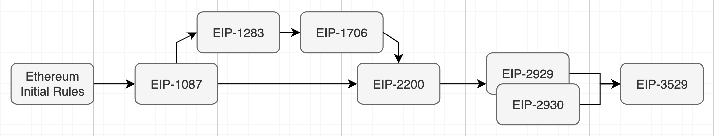
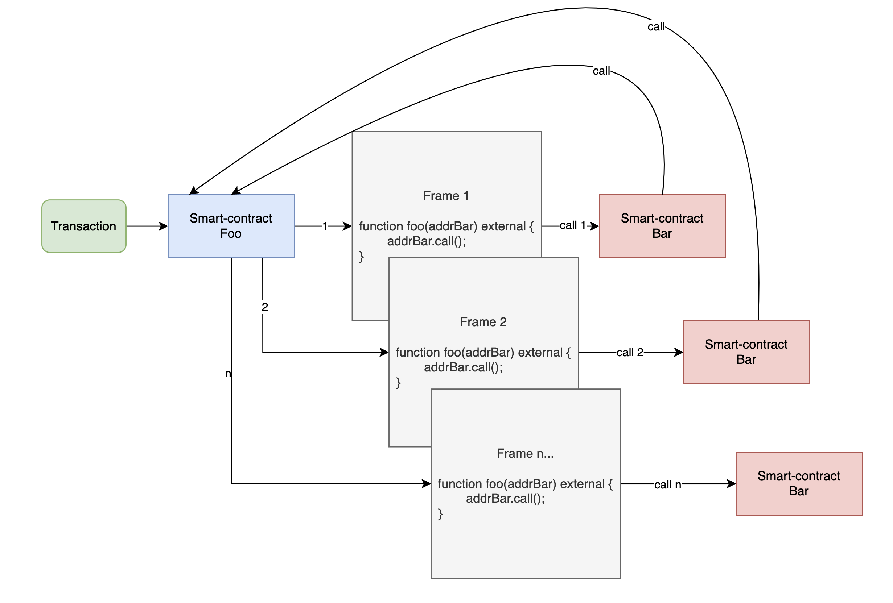
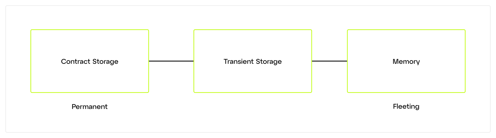
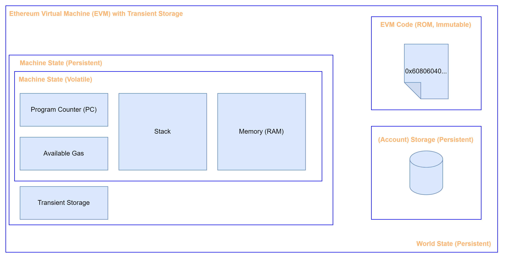
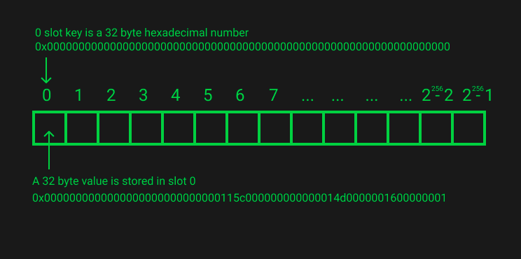
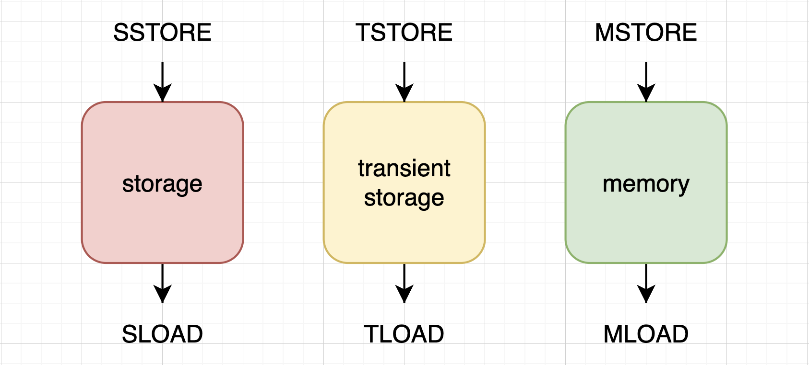
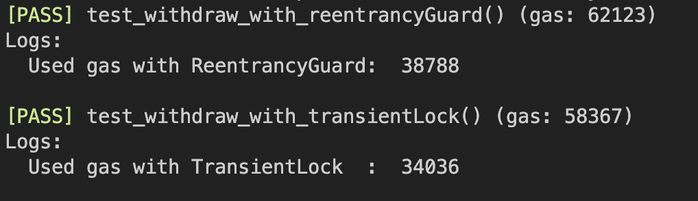

# EIP-1153: Transient storage opcodes

**Автор:** [Роман Ярлыков](https://github.com/rlkvrv) 🧐

В одной из статей про расчет газа в Ethereum ([тут](https://github.com/fullstack-development/blockchain-wiki/blob/main/ethereum-virtual-machine/gas/gas-used/gas-used-part-2.md)) я уже рассказывал всю историю изменений механизмов подсчета газа от изначальных заложенных в протокол правил до EIP-3529. Во всех этих изменениях, помимо всего прочего, красной линией прослеживается одна проблема - нерациональное использование газа в случаях, когда конкретный слот хранилища (storage) смарт-контракта изменяется только в процессе выполнения транзакции, но после возвращается к исходному значению (самый простой пример блокировка функции для защиты от атаки reentrancy). Предлагалась куча разных способов как побороть эту проблему: "dirty map"; изменение механизмов расчетов, включающие в том числе, различные правила возврата газа; "прогревы"; "списки доступа"; наконец изменение количества газа потребляемого в разных ситуациях (которых десятки), но все это больше напоминало костыли, чем хорошее решение.

С хард-форком Dencun (Cancun-Deneb) в рамках обновления слоя выполнения выкатили [EIP-1153: Transient storage opcodes](https://eips.ethereum.org/EIPS/eip-1153), который должен наконец пофиксить эту проблему более изящно, но для этого пришлось добавить два новых опокода (`TSTORE`, `TLOAD`) и фактически создать новый вид памяти в EVM. Ну а разработчикам теперь нужно учиться работать с новым видом памяти. Интересно? Мне очень, так что приступим.

Если вы пропустили все веселье расчетов газа для `sstore`, напомню, что было в предыдущих сериях:



Для лучшего понимания этой статьи будет не лишним понять что там происходило, но если на это нет времени - не беда, попробую объяснить по-другому, поэтому начнем с главной проблемы.

Примечательно, что обсуждение EIP-1153 началось еще в 2018 году еще после EIP-1087, можно посмотреть его [здесь](https://ethereum-magicians.org/t/eip-1153-transient-storage-opcodes/553). Понадобилось 6 лет, чтобы сообщество наконец его приняло.

## Суть проблемы

Итак, главный вопрос: а зачем? Проще всего будет объяснить на примере "Reentrancy locks" - это подход, в котором нужно делать запись в хранилище смарт-контракта во время выполнения транзакции, но после в этих записях нет необходимости. 

Атака reentrancy - это большая боль для EVM, несмотря на то, что сама по себе атака очень простая и о ней, казалось бы, уже давно знают все разработчики до сих пор встречаются взломы использующие эту уязвимость. В [этом репозитории](https://github.com/pcaversaccio/reentrancy-attacks) ведут учет подобных взломов и проблема все еще очень актуальная. 

Для защиты обычно используют "Reentrancy locks" или по-простому "замок", чаще всего это библиотеку от [OpenZeppelin](https://github.com/OpenZeppelin/openzeppelin-contracts/blob/master/contracts/utils/ReentrancyGuard.sol), либо можно написать свое решение. Суть одна - в установке флага, который будет отражать состояние замка (on/off). То есть перед выполнением функции флаг переключается в положение "on" и выключается обратно в конце функции.
Важно то, что этот флаг записывают в тип памяти `storage` смарт-контракта, но почему нельзя использовать гораздо более дешевую `memory`?

Тут мы приходим к проблеме межфреймового взаимодействия.

> Фрейм (frame) - это контекст выполнения транзакции в EVM.

Когда транзакция выполняется, в рамках контракта создается фрейм выполнения. Если во время выполнения смарт-контракт делает внешние вызовы - это порождает другие фреймы выполнения, каждый из которых создается семейством инструкций *CALL.

Смарт-контракты могут быть повторно вызваны во время одной транзакции, в результате чего один и тот же смарт-контракт может иметь несколько фреймов.

На схеме создание новых фреймов в случае с атакой Reentrancy выглядит так:


 
Проблема в том, что под каждый новый вызов функции будет выделена отдельная память `memory`, а значит каждый последующий фрейм не знает что хранится в `memory` предыдущего вызова. Поэтому есть 2 других способа передачи данных между фреймами:

1. **Через входные/выходные данные (i/o)**, передаваемые через инструкции вызова *CALL. Но если между фреймами есть промежуточный фрейм, принадлежащий другому, недоверенному смарт-контракту, то такое взаимодействие может быть небезопасным.

2. **Через обновления хранилища** (используя операции `SSTORE`/`SLOAD`). Этот способ является более надежным, но затратным с точки зрения газа.

*Важно!* Фреймы создаются при любом внешнем вызове, например при обращении к прокси-контракту он делегирует вызов контракту-имплементации, что в свою очередь тоже создает новый фрейм. Перевод токенов ERC20 вызывает смарт-контракт токена для обработки этого перевода, по отношению к вызывающему контракту это внешний вызов, поэтому он тоже создает новый фрейм и т.д.

*Важно!* Еще раз повторюсь, технически и раньше была возможность межфреймового взаимодействия через `storage`, но это дорого по газу.

## Как теперь выглядят все типы памяти в EVM

EIP-1153 создает новую форму хранения данных в довесок к уже существующим. По своим свойством она занимает место между `storage` и `memory`. 



**Постоянное хранилище (contract storage)** - это "долговременная память", в которой каждый контракт хранит свое текущее состояние. Данные, записанные сюда, хранятся до тех пор пока не будут явно перезаписаны или удалены. Это самый дорогой вид хранилища, т.к. необходимо хранить данные на каждом узле-участнике блокчейна.

**Переходное хранилище (transient storage, добавлено EIP-1153)** - "среднесрочная память", которая позволяет сохранять данные при различных вызовах функций, но в рамках одной транзакции. Это полезно для транзакций, в которых участвуют несколько функций, взаимодействующих с одним и тем же набором данных. Переходное хранилище очищается при завершении транзакции, как и `memory`, но, в отличие от `memory`, оно позволяет ссылаться на один и тот же набор данных при вызове нескольких функций.

**Память (memory)** или "кратковременная память", используется для хранения временных данных во время выполнения одной функции в рамках текущего фрейма. Главная использование - хранение и манипулирование данными для вычислений в рамках одной функции, после завершения выполнения функции - `memory` очищается. Этот вид памяти в разы дешевле `storage`, хотя стоимость будет расти экспоненциально в зависимости от количества записываемых в нее данных.

Схема из [обсуждения EIP-1153](https://ethereum-magicians.org/t/eip-1153-transient-storage-opcodes/553/78) хорошо показывает различия между ними:



К отдельным типам памяти можно также отнести следующие:
   - `calldata` - как следует из названия это данные вызова, они передаются в смарт-контракт "снаружи" вместе с транзакцией и не могут быть изменены;
   - `stack` - отвечает за операции с опкодами. Это структура данных LIFO (Last In First Out). У разработчиков нет инструментов для управления стеком, все что можно сделать - это с помощью `inline assembly` положить туда несколько значений и произвести с ними одну из простых операций типа `add`, `sub`, `mul` и т.д., но чтобы затем получить результат из функции все равно потребуется воспользоваться `memory`;
   - `EVM code` - это код инициализации смарт-контракта + код выполнения (сюда также попадают `immutable` переменные, которые можно установить в конструкторе, но потом нельзя изменить);
   - `Program Counter` - внутренний счетчик клиента исполнения, его значение можно получить только через `inline assembly` вызвав инструкцию `pc()`;
   - `Available gas` - счетчик доступного газа, его значение можно получить вызвав функцию `gasleft()` Solidity.

## Устройство transient storage

По устройству `transient storage` идентичен `storage` - это один большой массив байт. Поэтому принципы работы с данным хранилищем (чтение, запись, схемы хранения разных типов данных) точно такие же. Важно то, что между собой эти два типа памяти никак не пересекаются. 



Здесь мы не будем заострять внимание на устройстве `storage`, об этом написано большое количество хороших материалов, например можно почитать [тут](https://noxx.substack.com/p/evm-deep-dives-the-path-to-shadowy-3ea) и [тут](https://steveng.medium.com/ethereum-virtual-machine-storage-layout-beb9a72a07e9).

Важно понять одну вещь - все взаимодействие с `transient storage` по сути сводится к работе с хеш-таблицей (ключ => значение) где 32-байтовый ключ указывает на 32-байтовое значение.

Так как это новый отдельный вид памяти, для работы с ним также понадобились [два новых](https://arc.net/l/quote/gmsqcaka) опкода - `TSTORE` и `TLOAD` (по аналогии с `MSTORE`, `MLOAD` для memory и `SSTORE`, `SLOAD` для storage):



## Потребление газа

Опкод `TSTORE` потребляет столько же газа, как и `SSTORE` грязного слота (current != new; current != original), а `TLOAD` потребляет также, как теплый `SLOAD`:

| opcode | gas | cold       | warm |
| ------ | --- | ---------- | ---- |
| SLOAD  | -   | 2100       | 100  |
| SSTORE | -   | 20000/5000 | 100  |
| TLOAD  | 100 | -          | -    |
| TSTORE | 100 | -          | -    |
| MLOAD  | 3   | -          | -    |
| SSTORE | 3   | -          | -    |

*Примечание:* Таблица выше по состоянию на хард-форк Cancun.

То есть в отличие от `storage` потребление газа `transient storage` не будет меняться в зависимости от других условий. Напомню, что даже при работе с `memory` потребление газа постепенно увеличивается с увеличением ее размера.

*Важно!* На данный для манипулирования данными в рамках отдельной функции `memory` - это все еще самый "дешевый" по потреблению газа вид памяти.

Это еще раз показывает, что переходное хранилище нужно для решения тех проблем, для которых вводились понятия "теплого" и "холодного", а также "чистого" и "грязного" хранилища плюс все истории с возвратами газа. 

## Особенности

В целом переходное хранилище очень похоже на обычный `storage`, за исключением автоматической очистки в конце транзакции, но есть особенности, о которых стоит упомянуть:

- **Непостоянность.** В отличие от `storage` переходное хранилище полностью очищается в конце транзакции;
- **Приватность.** Является приватным для смарт-контракта, который его создал. Никакой другой смарт-контракт не может читать или писать данные в  `transient storage` смарт-контракта, который его создал; //TODO что с view и pure?
- **Доступ.** Доступ к переходному хранилищу может осуществляться в рамках текущего фрейма смарт-контракта, которому оно принадлежит либо всех новых фреймов созданных для этого смарт-контракта в рамках транзакции;
- **Работа с прокси.** В случае с прокси-контрактами поведение также идентично `storage` - при использовании инструкций `DELEGATECALL` или `CALLCODE` владельцем переходного хранилища будет **вызывающий** смарт-контракт, то есть прокси, а не имплементация, которую он вызывает.
- **Поведение при вызове внешних контрактов.** В том случае когда используются инструкции `CALL` или `STATICCALL` **вызываемый** смарт-контракт создает собственное переходное хранилище.
- **Возврат состояния.** Если фрейм возвращается (происходит revert), все записи в переходное хранилище, которые произошли между входом во фрейм и возвратом, возвращаются, включая те, которые произошли во внутренних вызовах. Это также имитирует поведение `storage`.
- **Ограничение по gasleft.** Инструкция `TSTORE` не требует, чтобы `gasleft` был больше или равен газовой стипендии (2,300 ед. газа), как это определено в EIP-2200.

## Как использовать

Изначально был озвучен только вариант использования где использовался паттерн напоминающий переходное хранилище (когда данные в `storage` записывались только на время транзакции, а затем очищались для возврата газа), но в ходе обсуждения он "обрастал" новыми вариантами использования. В самом EIP озвучены следующие примеры:

// TODO переработать
- [EIP-1153: Transient storage opcodes](#eip-1153-transient-storage-opcodes)
  - [Суть проблемы](#суть-проблемы)
  - [Как теперь выглядят все типы памяти в EVM](#как-теперь-выглядят-все-типы-памяти-в-evm)
  - [Устройство transient storage](#устройство-transient-storage)
  - [Потребление газа](#потребление-газа)
  - [Особенности](#особенности)
  - [Как использовать](#как-использовать)
    - [Защита от атаки reentrancy](#защита-от-атаки-reentrancy)
      - [Reentrancy lock](#reentrancy-lock)
      - [ReentrancyGuard](#reentrancyguard)
      - [Transient reentrancy lock](#transient-reentrancy-lock)
    - [Ончейн вычисление адреса через CREATE2](#ончейн-вычисление-адреса-через-create2)
    - [Approve и Transfer ERC20 в одной транзакции](#approve-и-transfer-erc20-в-одной-транзакции)
    - [Fee-on-transfer contracts](#fee-on-transfer-contracts)
    - [Till pattern](#till-pattern)
    - [Proxy call metadata](#proxy-call-metadata)
  - [Подводные камни](#подводные-камни)
  - [Плюсы и минусы](#плюсы-и-минусы)
  - [Вывод](#вывод)
  - [Links](#links)

Ниже можно ознакомиться с каждым примером более подробно.

### Защита от атаки reentrancy

Про саму атаку reentrancy написано очень много, краткую выжимку по способам защиты можно посмотреть в [блоге](https://blog.openzeppelin.com/reentrancy-after-istanbul) OpenZeppelin. Основные методы которые используют для защиты это:
   - Checks-Effects-Interactions (CEI) - это методика, предписывающая строгую последовательность операций: проверка условий, изменение состояния и затем внешние вызовы (подробнее [тут](https://fravoll.github.io/solidity-patterns/checks_effects_interactions.html));
   - Pull payment pattern - когда получатель платежа сам инициирует транзакцию на вывод средств с помощью функции в смарт-контракте типа `withdraw()` (подробнее [тут](https://medium.com/@bansaltushar014/design-pattern-part-2-pull-payment-pattern-c1f7b4ca9ad4));
   - Reentrancy lock - блокировка повторного входа в функцию.

#### Reentrancy lock

Остановимся подробнее на этом методе. Для его реализации необходимо делать запись именно в `storage` смарт-контракта, потому что при повторном обращении к функции создастся новый фрейм и данные `memory` из прошлого вызова недоступны, передать данные с вызовом недоверенному смарт-контракту мы тоже не можем. Самое простое решение "в лоб" - это объявить в смарт-контракте переменную `lock`, которой мы будем присваивать булево значение (true или false).

На смарт-контракте простой пример будет выглядеть так:
```js
// SPDX-License-Identifier: MIT
pragma solidity 0.8.21;

contract ExampleWithBoolReentrancyLock {
    // Создаем переменную _lock
    bool private _lock;

    // ...

    function withdraw(uint256 amount) external {
        // Перед выполнением функции проверяем, что это не повторный вход
        if (_lock) {
            revert ReentrancyAttackPrevented();
        }
        // Блокируем функцию для защиты от повторного входа
        _lock = true;

        // Проверяем текущее состояние
        if (_balances[msg.sender] < amount) {
            revert InsufficientBalance();
        }

        // Изменяем состояние
        _balances[msg.sender] -= amount;

        // Переводим запрошенные средства 
        (bool success, ) = msg.sender.call{value: amount}("");
        if (!success) {
            revert TransferFailed();
        }

        // Выключем блокировку функции
        _lock = false;
    }

    // ...
}
```
Полный пример смарт-контракта [тут](./contracts/ExampleWithBoolReentrancyLock.sol).

Такую реализацию можно сильно улучшить:
   - Лучше использовать `uint` вместо типа `bool` - использование последнего в Solidity дороже, потому что `bool` занимает полное слово (32 байта) в памяти;
   - Используя `uint` мы можем сделать слот "грязным" во время развертывания смарт-контракта чтобы в дальнейшем не платить 20,000 газа за каждую запись, а значение замка сделать к примеру равными 1 (unlock) и 2 (lock), чтобы избежать возвратов газа (напомню, что вернется только 20%);
   - Подобный функционал лучше вынести в модификатор, это сделает функцию чище, а модификатор лучше вынести в отдельный смарт-контракт для переиспользования в любом другом смарт-контракте.

#### ReentrancyGuard

Все вышеупомянутые улучшения сделаны в реализации ReentrancyGuard от OpenZeppelin, посмотреть смарт контракт можно в [репозитории](https://github.com/OpenZeppelin/openzeppelin-contracts/blob/master/contracts/utils/ReentrancyGuard.sol). После подключения библиотеки контракт будет выглядеть так:

```js
// Импортируем библиотеку от OZ
import {ReentrancyGuard} from "@openzeppelin/contracts/utils/ReentrancyGuard.sol";

// Наследуемся от контракта ReentrancyGuard
contract ExampleWithReentrancyGuard is ReentrancyGuard {
    // ...

    // Добавляем модификатор nonReentrant к функции
    function withdraw(uint256 amount) external nonReentrant {
        // Проверяем текущее состояние
        if (_balances[msg.sender] < amount) {
            revert InsufficientBalance();
        }

        // Изменяем состояние
        _balances[msg.sender] -= amount;

        // Переводим запрошенные средства 
        (bool success, ) = msg.sender.call{value: amount}("");
        if (!success) {
            revert TransferFailed();
        }
    }

    // ...
}
```

Полный пример смарт-контракта [тут](./contracts/ExampleWithReentrancyGuard.sol).

Теперь перед тем, как начать выполнение функции модификатор `nonReentrant` поменяет значение переменной `ReentrancyGuard::status` c `NOT_ENTERED` на `ENTERED`, то есть перезапишет значение слота с 1 на 2, а в конце выполнения функции поменяет обратно.Тем не менее, это все еще дорого по газу, потому что мы работаем со значениями в `storage`. 

#### Transient reentrancy lock

*Важно!* Чтобы запустить примеры ниже понадобится версия Solidity не ниже 0.8.24, а также версия EVM - Cancun;

Перейдем к реализации reentrancy lock с использованием `transient storage`. Для начала снова возьмем простой пример:

```js
// SPDX-License-Identifier: MIT
pragma solidity 0.8.25;

contract ExampleWithTransientReentrancyLock {
    // ...

    function withdraw(uint256 amount) external {
        // Создаем переменную чтобы получить значение из transient storage
        uint256 lock;
        // Проверяем есть ли по ключу 0 запись в transient storage
        assembly {
            lock := tload(0)
        }
        if (lock == 1) {
            revert ReentrancyAttackPrevented();
        }
        // Записываем по ключу 0 значение 1
        assembly {
            tstore(0, 1)
        }

        // _; Выполняем здесь логику вывода средств

        // Очищаем значение после внешнего вызова
        assembly {
            tstore(0, 0)
        }
    }
}
```
Выглядит не очень, правда? Но можно сделать как в [этом](https://arc.net/l/quote/ermtzdto) примере, добавив вспомогательные функции `tstore` и `tload`, а в качестве ключа использовать константу.

*Примечание:* В дальнейшем в Solidity скорее всего появится ключевое слово `transient` для объявления переменных на подобии `memory` или `storage`. Пока же приходится использовать inline assembly.

Например так:
```js
    uint256 transient lock = 1;
```

Перепишем пример выше с использованием вспомогательных функций и модификатора nonReentrant:
```js
// SPDX-License-Identifier: MIT
pragma solidity 0.8.25;

contract ExampleWithTransientReentrancyLock {
    // Заводим константное значение для адресации в transient storage
    bytes32 constant REENTRANCY_GUARD = keccak256("REENTRANCY_GUARD");

    // ...

    modifier nonReentrant() {
        // Перед выполнением функции проверяем, что это не повторный вход
        if (_tload(REENTRANCY_GUARD) == 1) {
            revert ReentrancyAttackPrevented();
        }
        // Записываем по ключу REENTRANCY_GUARD значение 1
        _tstore(REENTRANCY_GUARD, 1);

        _;

        // Очищаем значение ключа в transient storage после внешнего вызова
        _tstore(REENTRANCY_GUARD, 0);
    }

    function withdraw(uint256 amount) external nonReentrant {
        // ...
        // Основная логика функции
    }

    // Вспомогательная функция для записи в transient storage
    function tstore(bytes32 location, uint value) private {
        assembly {
            tstore(location, value)
        }
    }

    // Вспомогательная функция для чтения из transient storage
    function tload(bytes32 location) private returns (uint value) {
        assembly {
            value := tload(location)
        }
    }
}
```
Полный пример смарт-контракта [тут](./contracts/ExampleWithTransientReentrancyLock.sol).

Реализация ReentrancyGuardTransient от OpenZeppelin на момент написания статьи пока еще в разработке, посмотреть можно в этом [PR](https://github.com/OpenZeppelin/openzeppelin-contracts/pull/4955).

*Важно!* После выполнения внешнего вызова необходимо очищать `transient storage`, чтобы не возникло проблем при дальнейших вызовах функции в рамках одной транзакции.

Если сравнить потребление газа функции `withdraw` со "старой" реализацией ReentrancyGuard с такой же функцией, но которая будет использовать `transient storage` для reentrancy lock - разница получится существенная ≈ 4,750 ед. газа:



Я прикинул, сколько будет стоить использование обоих вариантов при цене ETH `$3500` и стоимости газа в 20 Gwei, результаты следующие:

| ReentrancyGuard | TransientReentrancyGuard |
| --------------- | ------------------------ |
| ≈ 5150 ед. газа | ≈ 400 ед. газа           |
| ≈ 0.36$         | ≈ 0.03$                  |

**Примечание:** Моя реализация TransientReentrancyGuard далека от эталонной, поэтому скорее всего реализация от тех же OpenZeppelin будет потреблять еще меньше газа.

### Ончейн вычисление адреса через CREATE2

Второе преимущество EIP-1153 напрямую связано с недостатком операции `CREATE2`. Дело в том, что для вычисления адреса `CREATE2` использует код инициализации смарт-контракта, а код инициализации в свою очередь включает аргументы конструктора. 

То есть создание детерминированных адресов это основная "фича" `CREATE2`, потому что при развертывании используется так называемая "соль", но при этом чтобы восстановить адрес потребуются не только "соль", но и аргументы конструктора, для формировани правильного байт-кода инициализации.

```go
address = keccak256(0xff + sender_address + salt + keccak256(initialisation_code))[12:]
```

Для сравнения в обычном `CREATE` используется только адрес отправителья транзакции (деплоера) и nonce его аккаунта:

```go
address = keccak256(rlp([sender_address,sender_nonce]))[12:]
```

 Почему это проблема и как она решается лучше всего можно увидеть на пример смарт-контракта [UniswapV3PoolDeployer](https://github.com/Uniswap/v3-core/blob/ed88be38ab2032d82bf10ac6f8d03aa631889d48/contracts/UniswapV3PoolDeployer.sol#L34-L36), обратите внимание, что в функции `deploy()` в конструктор смарт-контракта `UniswapV3Pool` ничего не передается, вместо этого все необходимые параметры для развертывания записываются в переменную `parameters`:

 ```js
 contract UniswapV3PoolDeployer is IUniswapV3PoolDeployer {
    // Эти параметры необходимы для деплоя смарт-контракта UniswapV3Pool
    struct Parameters {
        address factory;
        address token0;
        address token1;
        uint24 fee;
        int24 tickSpacing;
    }

    // В storage создаем публичную переменную которая будет содержать
    // все необходимые параметры
    Parameters public override parameters;

    function deploy(
        address factory,
        address token0,
        address token1,
        uint24 fee,
        int24 tickSpacing
    ) internal returns (address pool) {
        // Записываем параметры в переменную
        parameters = Parameters({factory: factory, token0: token0, token1: token1, fee: fee, tickSpacing: tickSpacing});

        // В salt записываем только адреса токенов и комиссию
        pool = address(new UniswapV3Pool{salt: keccak256(abi.encode(token0, token1, fee))}());

        // После очищаем параметры
        delete parameters;
    }
}
 ```

Если перейти в конструктор [UniswapV3Pool](https://github.com/Uniswap/v3-core/blob/ed88be38ab2032d82bf10ac6f8d03aa631889d48/contracts/UniswapV3Pool.sol) можно увидеть, что параметры извлекаются из контракта UniswapV3PoolDeployer:

```js
    constructor() {
        int24 _tickSpacing;

        // Поучаем все необходимые параметры из смарт-контракта который выполняет деплой
        (factory, token0, token1, fee, _tickSpacing) = IUniswapV3PoolDeployer(msg.sender).parameters();
        tickSpacing = _tickSpacing;

        maxLiquidityPerTick = Tick.tickSpacingToMaxLiquidityPerTick(_tickSpacing);
    }
```

То есть мы передаем аргументы записывая их в `storage`, а не в конструкторе, что было бы логичнее. Чтобы понять зачем это делается нужно посмотреть библиотеку [PoolAddress](https://github.com/Uniswap/v3-periphery/blob/main/contracts/libraries/PoolAddress.sol), в которой адрес инициализации UniswapV3Pool - это константа, а значит зная адреса токенов и комиссию которая задана в этом пуле легко вычислить адрес самого пула. Это основная причина по которой разработчики не используют конструктор смарт-контракта, а вместо этого передают параметры через хранилище деплоера.

`transient storage` очень хорошо подходит для передачи контекста в подобных случаях, причем это может применяться не только в связке с `CREATE2`, но и для других целей.

*Примечание:* Uniswap сильно топили за принятие EIP-1153, один из разработчиков Uniswap - [moodysalem](https://github.com/moodysalem) и по совместительству соавтор данного предложения фактически вытащил этот EIP на себе, хотя критики было очень много, в том числе и за "лоббизм" данного предложения со стороны крупных игроков типа Uniswap, Arbitrum и Optimism. В коде Uniswap v4 уже можно найти использование `transient storage`, хотя от подхода про который я рассказывал выше (с передачей контекста при создании пула) они отказались, но в нем и пулы создаются иначе.

### Approve и Transfer ERC20 в одной транзакции

Все, кто когда либо обрабатывал списание ERC20 на смарт-контракте знают, что перед списанием токенов владелец аккаунта должен это списание одобрить - вызвать на токене функцию `approve(spender, amount)`. Это мягко говоря не очень удобно, потому что необходимо вызвать две транзакции вместо одной. Еще одна проблема - часто протоколы берут так называемый "бесконечный апрув" и опасность здесь в том, что если этот протокол будет взломан - плакали все ваши токены, списание которых вы одобрили.

Существуют некоторые ончейн решения, например [ERC-2612](https://eips.ethereum.org/EIPS/eip-2612) - расширение, которое добавляет токену функцию `permit(address owner, address spender, uint value, uint deadline, uint8 v, bytes32 r, bytes32 s)`, она позволяет выдавать одобрение через подпись владельца аккаунта, чтобы избежать лишней транзакции.

Другой подход предлагает [ERC-1363](https://eips.ethereum.org/EIPS/eip-1363) - это тоже расширение для ERC20, которое добавляет токену функцию `approveAndCall(address spender, uint256 value)`, она тоже позволяет выдать апрув и перевести токены в одной транзакции с одной важной оговоркой - принимающая сторона обязательно должна реализовать callback-функцию `onApprovalReceived(address owner, uint256 value, bytes memory data)`.

Оба этих подхода имеют свои плюсы и минусы, но что в противовес может предложить функция `temporaryApprove(spender, amount)`, которая заявлена как один из способов использования `transient storage`?

Идея очень простая, смарт-контракту токена ERC20 также нужно будет добавить функцию по типу `approveAndCall(address spender, uint256 value, bytes memory data)`, она будет записывать одобренное количество токенов в `transient storage` и вызывать внешний смарт-контракт. Внешний смарт-контракт сможет просто выполнить `transferFrom` на одобренную сумму. В процессе выполнения `transferFrom` одобренное значение в временном хранилище будет обнулено, поэтому атаку reentrancy выполнить не выйдет.

Я сделал [пример](./contracts/ERC20WithTempApprove.sol) простой реализации такого функционала. На момент написания статьи это только концепция, как это будет реализовано для прода мы еще увидим.

### Fee-on-transfer contracts

Этот пункт подразумевает, что смарт-контракт токена может взимать фиксированный "налог" при взаимодействии с ним (комиссия за перевод ERC20 или взимание роялти ERC721) и об этом будет известно другим внешним вызовам в рамках одной транзакции. Это позволит пользователю заплатить налог один раз, а затем взаимодействовать с контрактом (в рамках одной транзакции) столько раз, сколько он захочет.

Второе преимущество этого паттерна схоже с `temporaryApprove` - минимизация использования callback-вызовов или полный отказ от них.

// TODO убрать это, либо упомянуть в минусах
Есть опасения, что смарт-контракты использующие этот и другие паттерны задействующие `transient storage` будут иметь проблемы при взаимодействии с Account Abstraction (ERC-4337). Почитать об этом можно [тут](https://hackmd.io/@-_WYFKbvSmip5m7MNB4b8A/SJFH66Eca) - автор говорит о том, что переходное хранилище в том виде, в котором оно реализовано это антипаттерн, от которого будет больше проблем, чем пользы, особенно в рамках взаимодействия с AA. Это обуславливается тем, что в AA есть функция [handleAggregatedOps](https://github.com/eth-infinitism/account-abstraction/blob/8fae866ea908f517f0399edd27057b2cc275576d/contracts/core/EntryPoint.sol#L208), которая объединяет несколько пользовательских операций в одной транзакции, а значит возможна ситуация при которой операции одного пользователя не знают о похожих операциях другого пользователя в рамках одной транзакции и могут ненамеренно "загрязнить" переходное хранилище.
Лично меня его доводы не убедили, есть спорные тезисы, в том числе примеры ситуаций когда описывается возможность потенциального вектора атаки типа reentrancy, но преподносится это как проблема для AA. Хотя надо признать, что действительно возможны ситуации в которых загрязнение хранилища одним пользователем может помешать другому - я не думаю что это так сильно заафектит на AA, как об этом пишет автор.

### Till pattern

По паттерну "Till" очень мало информации, есть только очень абстрактное описание [тут](https://github.com/OpenZeppelin/openzeppelin-contracts/issues/4361) и вот это [видео](https://www.youtube.com/watch?v=xFp8RlRq0qU), примеров использования я тоже не нашел.

Основная суть в том, чтобы можно было позволить в рамках транзакции совершать действия, которые могут нарушить основные инварианты протокола, но в конце они все же будут проверены.

### Proxy call metadata


## Подводные камни

## Плюсы и минусы

Плюсы:
- Дешевле `storage` в похожих кейсах использования

Минусы:
- Сложно тестировать и дебажить, так как все взаимодействие происходит в рамках одной транзакции
- 

## Вывод

Напомню, что из-за устройства `memory`, где данные всегда записываются последовательно друг за другом в ней нет структуры данных типа `mapping(key => value)`, потому что в случае если бы мы установили значение со слишком большим смещением - все остальные байты до этого смещения пришлось бы заполнять нулями, что раздуло бы `memory` до неимоверных размеров и стоило бы очень дорого.

Таким образом `t-storage` позволяет использовать хеш-таблицы (маппинги) 


## Links

- [EIP-1153: Transient storage opcodes](https://eips.ethereum.org/EIPS/eip-1153)