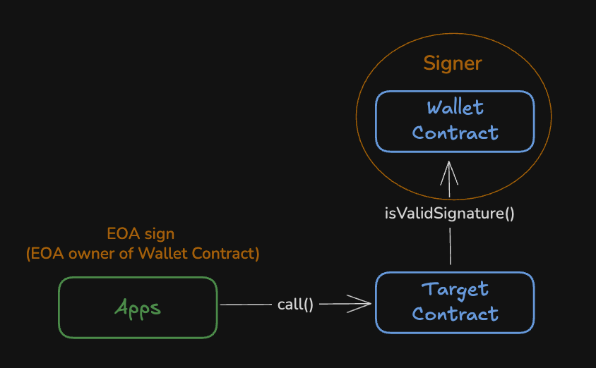
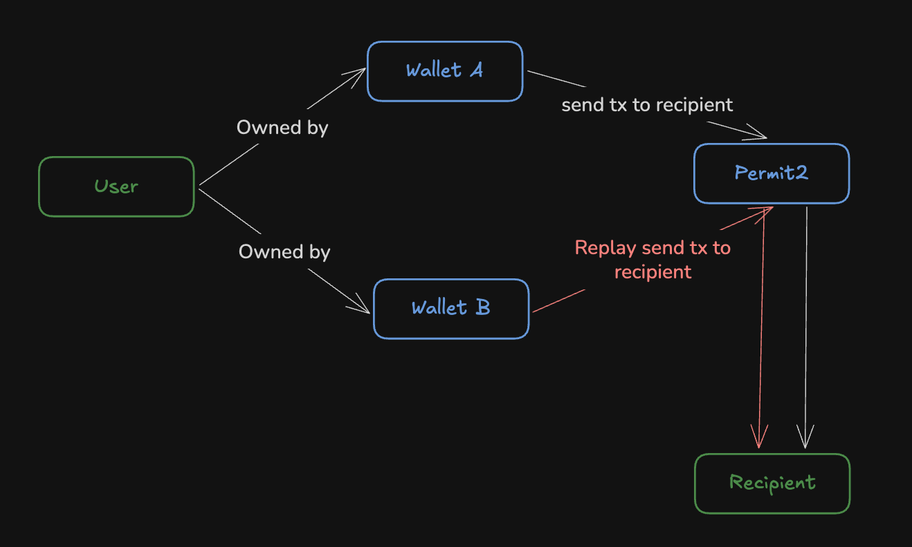

# ERC-1271: Standard Signature Validation Method for Contracts

**Автор:** [Павел Найданов](https://github.com/PavelNaydanov) 🕵️‍♂️

Стандарт ERC-1271 предлагает универсальный интерфейс для проверки подписи. Смарт-контракт, который реализует подобный интерфейс, будет считаться сайнером (Signer) и подтверждать валидность подписи.

Это ключевая идея стандарта — позволить контрактам выступать в роли `signer'ов`, несмотря на отсутствие у них приватных ключей для генерации подписей. Вместо этого смарт-контракт предоставляет метод `isValidSignature()`, через который внешние протоколы и приложения могут запросить проверку валидности подписи.



На схеме видно, что EOA, который является владельцем смарт-контракта **Wallet**, подписывает транзакцию и приложение передает вместе с вызовом его подпись на смарт-контракт **Target**, который может представлять биржу, лендинг протокол и другие DApps. **Target** валидирует подпись EOA на смарт-контракте **Wallet**, который выступает `Signer'ом` в рамках стандарта ERC-1271.

_Важно!_ Стоит отметить, что в нашем случае подпись сгенерирована приватным ключом EOA, но могут быть использованы и другие типы проверок.

Смарт-контракт Wallet должен реализовать функцию:
```solidity
function isValidSignature(bytes32 _hash, bytes calldata _signature) external view returns (bytes4)
```

Это `view` функция, которая не должна изменять состояние. Также стоит обратить внимание на возвращаемое значение: в случае успеха возвращается `bytes4` - это селектор функции `isValidSignature()` (селектор самой себя). Это классический подход, когда возвращается не булевое значение. Возвращаемые `bytes4` вносят больше определенности, так как смарт-контракт не поддерживающий EIP-1271, при вызове у него функции `isValidSignature()`, может провалиться в `fallback()` функцию и вернуть **true** непреднамеренно.

Пример кода ниже взят из спецификации [ERC-1271](https://eips.ethereum.org/EIPS/eip-1271).

```solidity

  // bytes4(keccak256("isValidSignature(bytes32,bytes)")
  bytes4 constant internal MAGICVALUE = 0x1626ba7e;

  /**
   * @dev Should return whether the signature provided is valid for the provided hash
   * @param _hash      Hash of the data to be signed
   * @param _signature Signature byte array associated with _hash
   *
   * MUST return the bytes4 magic value 0x1626ba7e when function passes.
   * MUST NOT modify state (using STATICCALL for solc < 0.5, view modifier for solc > 0.5)
   * MUST allow external calls
   */
  function isValidSignature(
    bytes32 _hash,
    bytes memory _signature)
    public
    view
    returns (bytes4 magicValue);
}
```

_Важно!_ Реализация функции `isValidSignature()` не регламентируется строго и может содержать сложную реализацию проверки подписи под капотом, которая зависит:
  - от контекста (например, от времени или состояния)
  - от EOA (например, от уровня авторизации подписывающего в смарт-кошельке)
  - от схемы подписи (например, ECDSA, multisig, BLS) и т.д.

Поэтому некоторые реализации могут потреблять больше газа, чем ожидалось. Важно не задавать количество газа, отправляемого при вызове функции с Target контракта, так как это может привести к провалу транзакции.

По сути, это все что необходимо знать про этот стандарт.

## Проблемы с ERC-1271

Множество протоколов которые решают проблемы абстракции аккаунтов поддерживают ERC-1271 под капотом своих смарт-контрактов, реализующих абстрактные аккаунты.

В 2023 года компания Alchemy обнаружила уязвимость в своем смарт-контракте `LightAccount`. Проблема заключалась в возможности воспроизведения подписи ERC-1271 повторно. EOA, которые завели себе несколько `LightAccount`, давая подпись для одного из них, автоматически разрешали применить подпись и ко второму `LightAccount`.



На схеме видно, что с одной и той же подписью `Recipient` может получить два транша с разных аккаунтов пользователя.

Подобная проблема оказалась еще у целого ряда АА протоколов: Zerodev, Biconomy, Soul Wallet, EIP4337Fallback для Gnosis Safes от eth-infinitism, AmbireAccount, SmartAccount от OKX, BaseWallet от Argent и Fuse Wallet.

Проблема касалась случаев, когда подпись разрешала смарт-контрактам Permit2 перевести токены. Также сюда можно отнести другие подобные смарт-контракты, например, Cowswap, Lens протокол и другие.

Ребята из Alchemy забили тревогу и совместно с другими специалистами по АА выработали два решение.

**Решение 1. Использовать domain из EIP-712**

При помощи структуры domain, как в [EIP-712](https://eips.ethereum.org/EIPS/eip-712), определить на каком смарт-контракте можно проверить подпись.

```solidity
function isValidSignature(bytes32 digest, bytes calldata sig) external view returns (bytes4) {
	bytes32 domainSeparator =
		keccak256(
			abi.encode(
				_DOMAIN_SEPARATOR_TYPEHASH,
				_NAME_HASH,
				_VERSION_HASH,
				block.chainid,
				address(walletA) // Определяет на каком смарт-контракте кошельке может быть валидирована подпись
			)
		);

	bytes32 wrappedDigest = keccak256(abi.encode("\x19\x01", domainSeparator, digest));

	return ECDSA.recover(wrappedDigest, sig);
}
```

**Решение 2. Добавлять адрес смарт-контракта к хешу данных**

Используется хеш подписи и к ней добавляется адрес смарт-контракта на котором можно валидировать подпись.
Это решение более легковесно, но означает, что клиентам кошельков придётся отображать непрозрачный хеш для подписи пользователей.

```solidity
function isValidSignature(bytes32 digest, bytes calldata sig) external view returns (bytes4) {
  bytes32 wrappedDigest = keccak256(abi.encode(digest, address(SCA));
	return ECDSA.recover(wrappedDigest, sig);
}
```

## Вывод

ERC-1271 - это очень простой ERC, но он имеет решающее значение для установления стандарта проверки подписей с помощью смарт-контрактов.

Многие думают, что стандарт - это возможность смарт-контрактам давать разрешения через подпись от своего имени. Но я бы посмотрел еще шире, на мой взгляд этот стандарт можно применить в любом случае, когда необходимо проверять подпись на смарт-контрактах. Поэтому, если ваши смарт-контракты реализуют любую безгазовость через подписи или проверяют комиссии установленные бекендом и так далее, то смело можно использовать этот интерфейс от ERC-1271.

## Links

1. [ERC-1271: Standard Signature Validation Method for Contracts](https://eips.ethereum.org/EIPS/eip-1271)
2. [ERC-1271 Signature Replay Vulnerability](https://www.alchemy.com/blog/erc-1271-signature-replay-vulnerability)
3. [Clarifying ERC-1271: Smart Contract Signature Verification](https://medium.com/taipei-ethereum-meetup/clarifications-on-erc-1271-smart-contract-signature-verification-and-signing-cd5c2fb7ac1b)