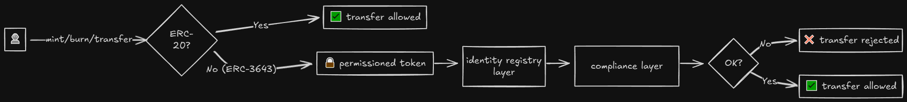
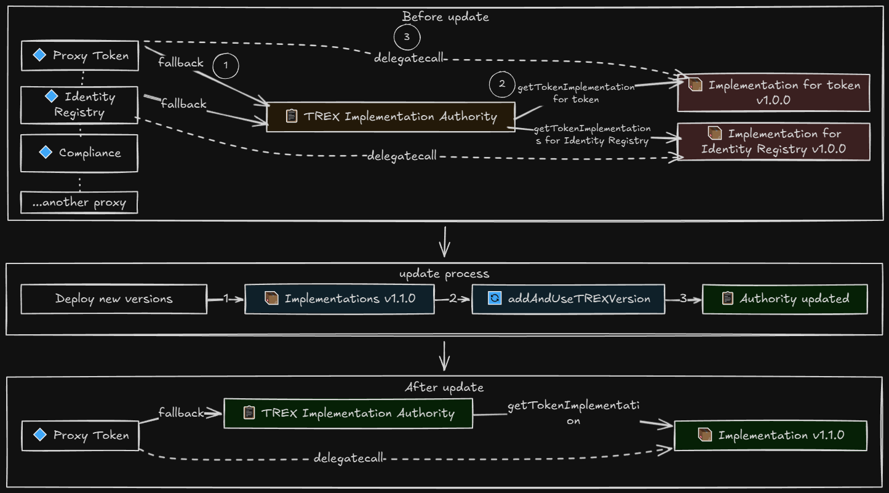

# ERC-3643: T-REX - Token for Regulated EXchanges

**Автор:** [Алексей Куценко](https://github.com/bimkon144) 👨‍💻

## 1. Введение

T-REX (Token for Regulated Exchanges) - это референсная имплементация стандарта [ERC-3643](https://eips.ethereum.org/EIPS/eip-3643) для выпуска и обслуживания токенов, представляющих реальные активы (ценные бумаги, доли в компаниях, фонды, недвижимость и т.п.), но при этом сохраняющих ERC-20 совместимый интерфейс.

В отличие от классических ERC-20, где токены изначально **permissionless** и могут свободно перемещаться между любыми адресами, ERC-3643 (T-REX) ориентирован на **permissioned модель**. Каждый токен привязан к onchain идентичности держателя, а любые операции с ним (mint, burn, transfer) проходят через автоматический проверяющий слой комбинацию Identity Registry и Compliance, которые решают, разрешено ли это действие с точки зрения регуляторных правил и внутреннего compliance выпуска.



Мотивация стандарта: блокчейн показал эффективность p2p переводов для криптовалют, но для регулируемых активов (security/RWA) нужны встроенные проверки KYC/AML, контроль держателей, возможность заморозки и recovery - всё на уровне смарт контрактов, а не оффчейн процессами. ERC-3643 решает это через связку контрактов с обязательными проверками identity и compliance.

В этой статье мы смотрим на T-REX именно как на протокол:
- какие контракты в него входят;
- как связаны identity, registry, compliance и сам токен;
- какие роли участвуют (эмитент, агент, инвестор, KYC провайдер);
- как происходит взаимодействие контрактов при операциях;
- как обновляются контракты через Implementation Authority;
- как деплоить токены через TREXFactory и TREXGateway;

---

## 2. Термины

**Security token** - токен, представляющий регулируемый актив (ценная бумага, доля, фонд).

**Permissioned token** - архитектура токена, где операции доступны только верифицированным адресам и подчиняются правилам обращения.

**ERC-3643 (T-REX)** - стандарт, который описывает, как реализовать permissioned модель поверх ERC-20.

**ONCHAINID** - протокол для управления onchain идентичностями (ERC-734/ERC-735), связывающий адрес кошелька с реальной личностью или организацией.

**Claim** - аттестация (утверждение) о владельце идентичности, подписанная доверенным провайдером. Например: "KYC пройден", "страна резидентства: США", "аккредитованный инвестор".

**Claim Issuer** - провайдер аттестаций (KYC сервис, банк, регистратор, посредник kyc сервиса), который подписывает и при необходимости отзывает claims.

**Claim Topic** - тип аттестации (например, KYC_CLAIM, COUNTRY_CLAIM, INVESTOR_STATUS_CLAIM). Для каждого токена определяется набор обязательных topics.

## 3. Общая архитектура T-REX

### 3.1. Схема архитектуры

T-REX состоит из набора взаимосвязанных смарт контрактов, которые работают вместе для обеспечения permissioned модели токенов. Ниже представлена общая схема архитектуры:


Основные контракты системы:

**Permissioned token** - основной контракт токена, реализующий стандарт ERC-3643. По методам он совместим с ERC-20, добавляя обязательные проверки compliance перед каждой операцией (`transfer`, `mint`, `burn`). Поддерживает админ операции: pause, заморозку адресов (freeze), принудительные переводы (`forcedTransfer` - перевод токенов администратором без согласия владельца, например, по решению суда или при санкциях) и восстановление доступа (`recovery` - перевод токенов на новый адрес при потере приватного ключа, когда владелец доказывает свою идентичность через onchain идентичность).

[ONCHAINID](https://docs.onchainid.com/) - отдельный протокол для управления onchain идентичностями (реализует стандарты ERC-734/ERC-735), созданный специально для использования с ERC-3643. Хранит claims, подписанные доверенными issuers, и предоставляет методы для их проверки. Не является частью T-REX, но критически важен для работы протокола.

**Identity Registry** - реестр, который связывает адреса кошельков с onchain идентичностями (ONCHAINID).

**Identity Registry Storage** - отдельный контракт для хранения данных идентичностей. Позволяет подключать к нему множество Identity Registry, если требуется управлять всеми identity через один контракт.

**Compliance + Modules** - контракт с подключаемыми модулями compliance, который содержит бизнес правила для токена: гео ограничения, лимиты по инвесторам и балансам, периоды lockup/vesting.

**Trusted Issuers Registry** - реестр доверенных поставщиков аттестаций (KYC провайдеры, банки, регистраторы). Хранит список адресов, чьи подписи на claim считаются валидными для конкретного токена. Используется при проверке инвесторов.

**Claim Topics Registry** - реестр типов claims, которые обязательны для владения токеном. Определяет, какие именно утверждения (KYC пройден, страна резидентства, статус инвестора и т.п.) должны быть у идентичности, чтобы адрес мог держать токен.

**Claim Issuer** - контракт провайдера claim (например, KYC провайдера или посредника), который подписывает и при необходимости отзывает claim. Claim Issuer включается в Trusted Issuers Registry, а его подписи затем проверяются через ONCHAINID и Claim Topics Registry.

### 3.2. Взаимодействие контрактов при операции `transfer`

Теперь, когда мы понимаем, что представляет собой каждый контракт, рассмотрим, как они взаимодействуют на примере операции перевода токенов. Ниже шаги соответствуют цифрам на схеме:

1. **Пользователь** вызывает `token.transfer(to, amount)`, **Token** сразу делает базовые проверки (не paused, не frozen, хватает баланса).
2. **Token** проверяет верификацию адреса получателя `to` через `identityRegistry.isVerified()`.
   - Identity Registry в свою очередь получает обязательные топики через `getClaimTopics()` на контракте `ClaimTopicsRegistry` и доверенных issuers через `getTrustedIssuersForClaimTopic()` на контракте `TrustedIssuersRegistry`;
   - Identity Registry на ONCHAINID пользователя вызывает `getClaim()` для получения данных о внесенном claim и вызывает проверку `isValidClaim()` на контракте `ClaimIssuer`, чтобы проверить, что claim валидный и не отозван.
   - Примечание: правила Compliance могут ограничивать операции и для отправителя, но проверка `isVerified()` вызывается только для получателя.
3. **Token** вызывает `compliance.canTransfer(from, to, amount)`.
4. **Compliance** делает `moduleCheck()`. Проверяет правила (гео, лимиты, lockup) и возвращает решение в **Token**.
5. Если проверка пройдена, **Token** выполняет перевод и уведомляет **Compliance** через `compliance.transferred(from, to, amount)` (для обновления счетчиков/состояния правил).

**Ключевой принцип:** все операции проходят через два слоя проверки - Identity (кто может держать токен) и Compliance (какие правила применяются к операциям).

Для понимания, кто контролирует и управляет контрактами, мы сначала разберём роли участников системы.

---

## 4. Участники и роли

T-REX использует систему ролей и прав доступа, реализованную через модификаторы доступа в каждом контракте. Ниже описаны роли для всех контрактов из схемы архитектуры.

### 4.1. Permissioned Token

Владелец токена **Owner** работает через модификатор `onlyOwner` и ему доступен такой функционал:
- `setName()`, `setSymbol()`, `setOnchainID()` - настройка токена (имя, символ, ONCHAINID адрес)
- `setIdentityRegistry()`, `setCompliance()` - привязка Identity Registry и Compliance контрактов
- `addAgent()`, `removeAgent()` - управление агентами (назначение/удаление TOKEN_AGENT)
- `transferOwnership()` - передача ownership токена

Таким образом, он может устанавливать токену информацию, такую как имя, символ, привязывать к токену отдельные контракты registry и compliance, добавлять отдельных агентов, которые могут уже непосредственно управлять эмиссией токена. Также Owner может добавить отдельный контракт ONCHAINID, который будет выступать отдельным идентификатором под созданный токен, по сути как паспорт актива.

**TOKEN_AGENT**, ответственный за все функции с модификатором `onlyAgent`:
- `mint(address _to, uint256 _amount)` - минтинг токенов верифицированному инвестору
- `burn(address _userAddress, uint256 _amount)` - сжигание токенов
- `pause()`, `unpause()` - пауза/возобновление всех операций токена
- `setAddressFrozen(address _userAddress, bool _freeze)` - заморозка/разморозка адреса (блокирует все операции)
- `freezePartialTokens()`, `unfreezePartialTokens()` - заморозка/разморозка части баланса адреса
- `forcedTransfer(address _from, address _to, uint256 _amount)` - принудительный перевод (позволяет пропустить контрактные проверки compliance, например, по решению суда)
- `recoveryAddress(address _lostWallet, address _newWallet, address _investorOnchainID)` - восстановление токенов с потерянного кошелька на новый (при потере приватного ключа)
- Batch операции: `batchMint()`, `batchBurn()`, `batchSetAddressFrozen()`, `batchFreezePartialTokens()`, `batchForcedTransfer()`

Таким образом, TOKEN_AGENT может выполнять все операционные задачи: выпускать и сжигать токены, управлять состоянием токена (пауза), контролировать доступ инвесторов через заморозку адресов или части баланса, выполнять принудительные переводы в экстренных ситуациях и восстанавливать доступ к токенам при потере приватных ключей.

### 4.2. Identity Registry

Владелец контракта, **Owner**, работает через модификатор `onlyOwner` и ему доступен такой функционал:
- `setIdentityRegistryStorage()` - привязка Identity Registry Storage контракта
- `setClaimTopicsRegistry()` - привязка Claim Topics Registry контракта
- `setTrustedIssuersRegistry()` - привязка Trusted Issuers Registry контракта
- `addAgent()`, `removeAgent()` - управление агентами (назначение/удаление IR_AGENT)
- `transferOwnership()` - передача ownership

Таким образом, Owner может настроить всю инфраструктуру реестра: подключить хранилище данных (`IdentityRegistryStorage`), указать какие типы claims обязательны для токена (через указание контракта `ClaimTopicsRegistry`), определить список доверенных KYC провайдеров (через указание контракта `TrustedIssuersRegistry`), а также назначить агентов для повседневной работы с регистрацией и обновлением данных инвесторов.

**IR_AGENT**, ответственный за регистрацию инвесторов через модификатор `onlyAgent`:
- `registerIdentity(address _userAddress, IIdentity _identity, uint16 _country)` - регистрация инвестора с ONCHAINID и кодом страны
- `updateIdentity()` - обновление ONCHAINID инвестора
- `updateCountry()` - обновление кода страны инвестора
- `deleteIdentity()` - удаление записи инвестора из реестра
- `batchRegisterIdentity()` - пакетная регистрация нескольких инвесторов

Таким образом, IR_AGENT занимается онбордингом инвесторов: регистрирует их в системе, связывая адреса кошельков с их onchain идентичностями, обновляет данные при необходимости и может удалять записи.

### 4.3. Claim Topics Registry

Владелец реестра **Owner** работает через модификатор `onlyOwner` и ему доступен такой функционал:
- `addClaimTopic(uint256 _claimTopic)` - добавление claim topic (например, KYC_CLAIM)
- `removeClaimTopic()` - удаление claim topic
- `transferOwnership()` - передача ownership

Таким образом, Owner определяет, какие именно утверждения должны быть у инвестора для владения токеном. Например, можно требовать только KYC, или добавить дополнительные требования вроде подтверждения статуса аккредитованного инвестора или резидентства в определённой стране. Это позволяет гибко настраивать критерии допуска к токену.

### 4.4. Trusted Issuers Registry

Владелец реестра **Owner** работает через модификатор `onlyOwner` и ему доступен такой функционал:
- `addTrustedIssuer(IClaimIssuer _trustedIssuer, uint256[] _claimTopics)` - добавление доверенного issuer с claim topics (какие типы claims он может выдавать)
- `removeTrustedIssuer()` - удаление доверенного issuer
- `updateIssuerClaimTopics()` - обновление claim topics для issuer
- `transferOwnership()` - передача ownership

Таким образом, Owner управляет списком доверенных KYC провайдеров, которые могут выдавать claims для токена. Можно добавить несколько провайдеров, каждый из которых может быть авторизован для выдачи определённых типов claims. Например, один провайдер может выдавать только базовый KYC, а другой - расширенный KYC и подтверждение аккредитации. Это позволяет работать с несколькими партнёрами и распределять ответственность за верификацию.

### 4.5. ONCHAINID (identity contract)

Рассмотрим основные ключи управления (по сути роли).

Владелец идентичности через **MANAGEMENT Key** работает через модификатор `onlyManager` и ему доступен такой функционал:
- `addKey()`, `removeKey()` - управление ключами (добавление/удаление ключей с любым purpose)
- `approve()` - одобрение execution запросов (это на прямую не касается t-rex и выходит за рамки статьи)
- `addClaim()`, `removeClaim()` - управление claims

Таким образом, MANAGEMENT Key имеет полный контроль над идентичностью: может добавлять и удалять любые ключи, одобрять транзакции и управлять claims. Обычно этот ключ находится у бэкенда, который управляет идентичностью инвестора от его имени.

**CLAIM Key** - модификатор `onlyClaimKey`:
- `addClaim()`, `removeClaim()` - управление claims (добавление/удаление claims)

Таким образом, CLAIM Key может только управлять claims, но не имеет доступа к управлению ключами. Это позволяет разделить ответственность: MANAGEMENT Key контролирует всё, а CLAIM Key может быть выдан отдельному сервису только для работы с claims.

### 4.6. Claim Issuer контракт

Владелец Claim Issuer через **MANAGEMENT Key** работает через модификатор `onlyManager` и ему доступен такой функционал:
- `revokeClaimBySignature(bytes signature)` - отзыв claim по подписи
- `revokeClaim(bytes32 claimId, address identity)` - отзыв claim по claimId и адресу идентичности
- Наследует все функции Identity (управление ключами через `addKey()`, `removeKey()`, управление claims через `addClaim()`, `removeClaim()`)

Таким образом, Claim Issuer может отзывать выданные ранее claims на ONCHAINID инвестора, если инвестор больше не соответствует требованиям (например, истёк срок KYC или обнаружены нарушения). Это критически важно для поддержания актуальности данных и соответствия регуляторным требованиям. Claim Issuer также может управлять своими ключами и добавлять claims в свою собственную идентичность, так как наследует функциональность Identity контракта.

Таким образом, любой может проверить валидность claim, подписанного этим Claim Issuer, что необходимо для верификации инвесторов в Identity Registry.

### 4.7. Compliance

Владелец Compliance контракта **Owner** работает через модификатор `onlyOwner` и ему доступен такой функционал:
- `addModule(address _module)` - добавление compliance модуля (максимум 25 модулей)
- `removeModule(address _module)` - удаление compliance модуля
- `callModuleFunction(bytes callData, address _module)` - вызов функции модуля для его конфигурации
- `bindToken()`, `unbindToken()` - привязка/отвязка токена (может вызываться самим токеном при первой привязке)
- `transferOwnership()` - передача ownership

Таким образом, Owner может гибко настраивать правила compliance: добавлять различные модули (гео ограничения, лимиты, lockup и т.п.), конфигурировать каждый модуль через вызов его функций, и при необходимости удалять модули. Это позволяет адаптировать правила под меняющиеся требования без изменения основного контракта токена.
Модули можно разрабатывать самому, по требованию compliance. А уже готовые модули от Tokeny можно посмотреть [тут](https://github.com/TokenySolutions/T-REX/tree/main/contracts/compliance/modular/modules).

**Token** - модификатор `onlyToken` (только привязанный токен):
- `transferred(address _from, address _to, uint256 _value)` - callback после transfer (для обновления состояния правил)
- `created(address _to, uint256 _value)` - callback после mint (для обновления состояния правил)
- `destroyed(address _from, uint256 _value)` - callback после burn (для обновления состояния правил)

Таким образом, токен уведомляет Compliance о всех операциях, что позволяет подключенным модулям обновлять своё внутреннее состояние (например, счётчики лимитов, временные ограничения и т.п.).

## 5. Детальный разбор взаимодействия контрактов

Чтобы лучше понять, как происходят взаимодействия между контрактами, рассмотрим, что происходит при вызове `transfer` пользователем.

**Permissioned Token**

Пользователь вызывает `token.transfer(to, amount)`, [Token](https://github.com/ERC-3643/ERC-3643/blob/dab1660fe594e17e83d691137ba67272534732ac/contracts/token/Token.sol#L417) делает базовые проверки и затем вызывает проверки верификации и compliance.

В методе `transfer` сначала выполняются базовые проверки, затем вызывается `isVerified` и `canTransfer`, после успешного перевода вызывается callback `transferred`.

```solidity

function transfer(address _to, uint256 _amount) public override whenNotPaused returns (bool) {
    require(!_frozen[_to] && !_frozen[msg.sender], "wallet is frozen");
    // subtract frozen tokens from available balance
    require(_amount <= balanceOf(msg.sender) - (_frozenTokens[msg.sender]), "Insufficient Balance");
    // check verification only for recipient, compliance rules for both addresses
    if (_tokenIdentityRegistry.isVerified(_to) && _tokenCompliance.canTransfer(msg.sender, _to, _amount)) {
        _transfer(msg.sender, _to, _amount);
        // callback to update module state (counters, limits, etc.)
        _tokenCompliance.transferred(msg.sender, _to, _amount);
        return true;
    }
    revert("Transfer not possible");
}
```

Из Token мы переходим в Identity Registry, который проверяет верификацию адреса получателя.

**Identity Registry**

Token проверяет верификацию адреса получателя через [identityRegistry.isVerified()](https://github.com/ERC-3643/ERC-3643/blob/dab1660fe594e17e83d691137ba67272534732ac/contracts/registry/implementation/IdentityRegistry.sol#L174).

Метод `isVerified` получает адрес ONCHAINID контракта через `identity()` (который внутри использует IdentityRegistryStorage), затем последовательно проверяет наличие всех обязательных claims:

1. Получает список обязательных claim topics из **Claim Topics Registry** (например, KYC_CLAIM)
2. Для каждого обязательного topic получает список доверенных **Claim Issuers** из **Trusted Issuers Registry** (какие KYC провайдеры могут выдавать этот тип claim)
3. Через **ONCHAINID/Identity контракт** пользователя получает данные claim (подпись, issuer, данные)
4. Проверяет через **Claim Issuer**, что claim валиден и не отозван - это критически важно, так как Claim Issuer может отозвать claim (например, при истечении срока KYC или обнаружении нарушений), и в этом случае пользователь больше не должен иметь доступ к токену. Почему это реализовано именно так, а не через отзыв claim у самого identity инвестора, расскажем чуть позже.

```solidity
function isVerified(address _userAddress) external view override returns (bool) {
    // get Identity contract address from Storage
    if (address(identity(_userAddress)) == address(0)) {return false;}
    // get required claim topics from Claim Topics Registry
    uint256[] memory requiredClaimTopics = _tokenTopicsRegistry.getClaimTopics();
    if (requiredClaimTopics.length == 0) { return true; }

    uint256 foundClaimTopic;
    uint256 scheme;
    address issuer;
    bytes memory sig;
    bytes memory data;
    uint256 claimTopic;
    for (claimTopic = 0; claimTopic < requiredClaimTopics.length; claimTopic++) {
        // get trusted issuers for this claim topic from Trusted Issuers Registry
        IClaimIssuer[] memory trustedIssuers =
            _tokenIssuersRegistry.getTrustedIssuersForClaimTopic(requiredClaimTopics[claimTopic]);
        if (trustedIssuers.length == 0) {return false;}

        bytes32[] memory claimIds = new bytes32[](trustedIssuers.length);
        for (uint256 i = 0; i < trustedIssuers.length; i++) {
            claimIds[i] = keccak256(abi.encode(trustedIssuers[i], requiredClaimTopics[claimTopic]));
        }

        for (uint256 j = 0; j < claimIds.length; j++) {
            // get claim data from ONCHAINID/Identity contract
            (foundClaimTopic, scheme, issuer, sig, data, ) = identity(_userAddress).getClaim(claimIds[j]);

            if (foundClaimTopic == requiredClaimTopics[claimTopic]) {
                // verify claim validity and non-revocation through Claim Issuer
                try IClaimIssuer(issuer).isClaimValid(identity(_userAddress), requiredClaimTopics[claimTopic], sig, data)
                returns(bool _validity) {
                    if (_validity) { j = claimIds.length; }
                    if (!_validity && j == (claimIds.length - 1)) { return false; }
                } catch {
                    if (j == (claimIds.length - 1)) { return false; }
                }
            } else if (j == (claimIds.length - 1)) { return false; }
        }
    }
    return true;
}
```

Переходим к контракту ClaimTopicsRegistry, в котором находятся claim topics.

**Claim Topics Registry**

Вызывается из Identity Registry для получения списка обязательных claim topics для токена через [getClaimTopics()](https://github.com/ERC-3643/ERC-3643/blob/dab1660fe594e17e83d691137ba67272534732ac/contracts/registry/implementation/ClaimTopicsRegistry.sol#L106).

```solidity
function getClaimTopics() external view override returns (uint256[] memory) {
    return _claimTopics;
}
```

Получив список обязательных topics, Identity Registry для каждого topic запрашивает список доверенных Claim Issuers, которые могут выдавать этот тип claim.

**Trusted Issuers Registry**

Вызывается из Identity Registry для получения списка доверенных Claim Issuers, которые могут выдавать claims для конкретного claim topic через [getTrustedIssuersForClaimTopic()](https://github.com/ERC-3643/ERC-3643/blob/dab1660fe594e17e83d691137ba67272534732ac/contracts/registry/implementation/TrustedIssuersRegistry.sol#L166).

```solidity
function getTrustedIssuersForClaimTopic(uint256 claimTopic) external view override returns (IClaimIssuer[] memory) {
    return _claimTopicsToTrustedIssuers[claimTopic];
}
```

Теперь Identity Registry знает, какие Claim Issuers доверены для каждого topic. Далее он обращается к Identity контракту пользователя, чтобы получить данные claim, подписанного одним из доверенных issuers.

**ONCHAINID / Identity contract**

Вызывается из Identity Registry для получения данных claim через [getClaim()](https://github.com/onchain-id/solidity/blob/main/contracts/Identity.sol#L450). Хранит claims (ERC-734/735) и связывает Claim Issuer и подпись с идентичностью держателя.

```solidity
function getClaim(bytes32 _claimId)
    public
    override
    view
    returns(
        uint256 topic,
        uint256 scheme,
        address issuer,
        bytes memory signature,
        bytes memory data,
        string memory uri
    )
{
    return (
        _claims[_claimId].topic,
        _claims[_claimId].scheme,
        _claims[_claimId].issuer,
        _claims[_claimId].signature,
        _claims[_claimId].data,
        _claims[_claimId].uri
    );
}
```

Получив данные claim из Identity контракта, Identity Registry обращается к самому Claim Issuer, чтобы проверить, что claim всё ещё валиден и не был отозван.

**Claim Issuer**

Вызывается из Identity Registry для проверки валидности claim через [isClaimValid()](https://github.com/onchain-id/solidity/blob/main/contracts/ClaimIssuer.sol#L46). Проверяет подпись и статус отзыва claim.

```solidity
function isClaimValid(
    IIdentity _identity,
    uint256 claimTopic,
    bytes memory sig,
    bytes memory data)
public override(Identity, IClaimIssuer) view returns (bool claimValid)
{
    bytes32 dataHash = keccak256(abi.encode(_identity, claimTopic, data));
    // use abi.encodePacked to concatenate the message prefix and the message to sign
    bytes32 prefixedHash = keccak256(abi.encodePacked("\x19Ethereum Signed Message:\n32", dataHash));

    // recover address of data signer
    address recovered = getRecoveredAddress(sig, prefixedHash);

    // take hash of recovered address
    bytes32 hashedAddr = keccak256(abi.encode(recovered));

    // check if issuer has CLAIM key (purpose 3) and claim is not revoked
    if (keyHasPurpose(hashedAddr, 3) && (isClaimRevoked(sig) == false)) {
        return true;
    }

    return false;
}
```

**Почему валидность claim проверяется через отдельный контракт ClaimIssuer, а не напрямую у ONCHAINID инвестора?**

Это критически важный архитектурный выбор для безопасности системы. Инвестор владеет своим ONCHAINID контрактом и может управлять claims через MANAGEMENT key: добавлять, удалять claims и управлять ключами тех, кто может добавлять claims.

Если бы проверка валидности claim происходила только через ONCHAINID контракт инвестора, то при отзыве верификации KYC провайдером инвестор мог бы просто удалить CLAIM key у ClaimIssuer из своего Identity контракта. Система не узнала бы, что claim был отозван, так как проверка происходила бы только в ONCHAINID инвестора, где инвестор имеет полный контроль. Инвестор продолжал бы иметь доступ к токенам, несмотря на отзыв верификации.

В текущей архитектуре проверка происходит через отдельный контракт **ClaimIssuer**, который хранит собственный mapping отозванных claims (`revokedClaims`). Это означает, что даже если инвестор удалит CLAIM key у ClaimIssuer из своего ONCHAINID, ClaimIssuer всё равно будет знать, что claim был отозван, и `isClaimValid()` вернёт `false`. Отзыв claim происходит простым вызовом метода `revokeClaimBySignature()` или `revokeClaim()` в контракте ClaimIssuer:

```solidity
function revokeClaimBySignature(bytes calldata signature) external override delegatedOnly onlyManager {
    require(!revokedClaims[signature], "Conflict: Claim already revoked");

    revokedClaims[signature] = true;

    emit ClaimRevoked(signature);
}
```

Таким образом, контроль над валидностью claim остаётся у ClaimIssuer (KYC провайдера), а не у самого инвестора, что обеспечивает соответствие регуляторным требованиям и возможность оперативного отзыва доступа при необходимости.

**Identity Registry Storage**

Identity Registry Storage - это отдельный контракт для хранения данных идентичностей. Он позволяет подключать к нему множество Identity Registry, если требуется управлять всеми identity через один контракт. Это даёт возможность обновлять Identity Registry без изменения данных идентичностей, а также переиспользовать одно хранилище для нескольких реестров.

После успешной проверки верификации через `_tokenIdentityRegistry.isVerified(_to)`, Token переходит ко второй критической проверке - проверке compliance. Если верификация подтверждает, что получатель имеет право держать токен (имеет все необходимые claims), то compliance проверяет, разрешена ли сама операция перевода согласно бизнес правилам токена.

**Compliance + Modules**

Token вызывает [compliance.canTransfer()](https://github.com/ERC-3643/ERC-3643/blob/dab1660fe594e17e83d691137ba67272534732ac/contracts/compliance/modular/ModularCompliance.sol#L245) для проверки всех правил compliance. Compliance последовательно проверяет все подключённые модули, каждый модуль должен разрешить операцию.

```solidity
function canTransfer(address _from, address _to, uint256 _value) external view override returns (bool) {
    uint256 length = _modules.length;
    // check all modules - all must return true for transfer to be allowed
    for (uint256 i = 0; i < length; i++) {
        if (!IModule(_modules[i]).moduleCheck(_from, _to, _value, address(this))) {
            return false;
        }
    }
    return true;
}
```

Каждый модуль реализует метод `moduleCheck()`, который проверяет своё конкретное правило. Рассмотрим пример модуля **SupplyLimitModule**, который ограничивает максимальный supply токена через [moduleCheck()](https://github.com/TokenySolutions/T-REX/blob/main/contracts/compliance/modular/modules/SupplyLimitModule.sol#L134):

```solidity
function moduleCheck(
    address _from,
    address /*_to*/,
    uint256 _value,
    address _compliance
) external view override returns (bool) {
    // check if this is a mint operation (_from == address(0)) and if it would exceed supply limit
    if (_from == address(0) &&
        (IToken(IModularCompliance(_compliance).getTokenBound()).totalSupply() + _value) > _supplyLimits[_compliance]) {
        return false;
    }
    return true;
}
```

Модуль проверяет, не превысит ли операция установленный лимит supply. Если это mint операция (`_from == address(0)`) и новый totalSupply превысит лимит, модуль возвращает `false`, блокируя операцию.

После успешного перевода Token вызывает callback `transferred()` в Compliance, который в свою очередь вызывает `moduleTransferAction()` во всех модулях для обновления их внутреннего состояния (счётчики лимитов, временные ограничения и т.п.). Например, модули могут обновлять счётчики переводов, отслеживать периоды lockup или обновлять лимиты по инвесторам.

### 5.1. Как обновлять контракты

В системе T-REX обновление контрактов критически важно, так как permissioned токены работают в регулируемой среде, где требования регуляторов и бизнес правила могут изменяться со временем. Обновления позволяют адаптировать контракты к новым требованиям, добавлять необходимый функционал, исправлять обнаруженные проблемы и оптимизировать работу системы, при этом сохраняя неизменность адресов токенов и всех данных пользователей.

**Как реализовано обновление контрактов?**

T-REX использует паттерн **Implementation Authority**, который работает аналогично **Beacon Proxy** паттерну. В этом паттерне прокси контракты не хранят адрес implementation напрямую, а получают его из централизованного контракта (Implementation Authority) при каждом вызове через fallback функцию. Это позволяет безопасно обновлять логику системы без изменения адресов токенов или идентичностей, а также обновлять все прокси одновременно через одно обновление Authority.

**Отличие от классического Beacon Proxy:**
- Классический Beacon хранит один адрес implementation
- Implementation Authority хранит адреса implementations для всех контрактов T-REX (Token, Identity Registry, Compliance и т.д.) и поддерживает версионирование (Major.Minor.Patch)



**Архитектура обновлений:**

- **T-REX Implementation Authority** ([TREXImplementationAuthority](https://github.com/ERC-3643/ERC-3643/blob/dab1660fe594e17e83d691137ba67272534732ac/contracts/proxy/authority/TREXImplementationAuthority.sol)) - смарт контракт, который хранит адреса текущих версий логики контрактов T-REX (Token, Identity Registry, Compliance и т.д.)
- **ONCHAINID Implementation Authority** - аналогичный смарт контракт для протокола ONCHAINID, который управляет версиями Identity контрактов. ONCHAINID является отдельным протоколом (ERC-734/ERC-735), созданным специально для использования с ERC-3643.
- **Proxies** - развёрнутые контракты (токены, идентичности и др.) являются прокси, которые делегируют вызовы к адресам implementation, определённым в соответствующем Authority.
- **Версионирование** - оба Authority поддерживают историю версий (Major.Minor.Patch)

**Как работает процесс обновления:**

1. **Деплой новой логики**: Разработка и деплой новой версии implementation контракта (например, исправленная версия Token контракта)

2. **Обновление Authority**: Регистрация новой версии в `TREXImplementationAuthority` через метод [addAndUseTREXVersion()](https://github.com/ERC-3643/ERC-3643/blob/dab1660fe594e17e83d691137ba67272534732ac/contracts/proxy/authority/TREXImplementationAuthority.sol#L302). После обновления Authority все существующие прокси **автоматически** начинают использовать новую логику при следующем вызове, так как прокси получают адрес implementation из Authority при каждом вызове через fallback функцию

3. **Автоматическое обновление прокси**: Прокси контракты получают адрес implementation из Authority при каждом вызове через fallback функцию. Это означает, что после обновления Authority все прокси автоматически используют новую логику без необходимости их явного обновления

**Как прокси получает implementation из Authority:**

Каждый прокси контракт получает адрес implementation из Authority через свой специфичный геттер. В `TREXImplementationAuthority` для каждого типа контракта есть отдельный метод: `getTokenImplementation()`, `getCTRImplementation()`, `getIRImplementation()`, `getMCImplementation()`, `getTIRImplementation()`, `getIRSImplementation()`. Пример прокси контракта `ClaimTopicsRegistryProxy`:

```solidity
// ClaimTopicsRegistryProxy contract

contract ClaimTopicsRegistryProxy is AbstractProxy {
    constructor(address implementationAuthority) {
        require(implementationAuthority != address(0), "invalid argument - zero address");
        // store Authority address in storage slot
        _storeImplementationAuthority(implementationAuthority);
        emit ImplementationAuthoritySet(implementationAuthority);

        // get CTR implementation address from Authority
        address logic = (ITREXImplementationAuthority(getImplementationAuthority())).getCTRImplementation();

        // initialize implementation contract
        (bool success, ) = logic.delegatecall(abi.encodeWithSignature("init()"));
        require(success, "Initialization failed.");
    }

    fallback() external payable {
        // get CTR implementation address from Authority on each call
        address logic = (ITREXImplementationAuthority(getImplementationAuthority())).getCTRImplementation();

        // delegate call to implementation
        assembly {
            calldatacopy(0x0, 0x0, calldatasize())
            let success := delegatecall(sub(gas(), 10000), logic, 0x0, calldatasize(), 0, 0)
            let retSz := returndatasize()
            returndatacopy(0, 0, retSz)
            switch success
            case 0 {
                revert(0, retSz)
            }
            default {
                return(0, retSz)
            }
        }
    }
}
```

**Пример обновления версии в TREXImplementationAuthority:**

```solidity
// Method addAndUseTREXVersion in TREXImplementationAuthority
function addAndUseTREXVersion(Version calldata _version, TREXContracts calldata _trex) external override {
    addTREXVersion(_version, _trex);
    useTREXVersion(_version);
}
```

**Изменение Implementation Authority для конкретного токена:**

Если требуется изменить Implementation Authority для конкретного токена (например, переключиться на другой Authority), используется метод `changeImplementationAuthority()`. Он поменяет во всех прокси адреса authority контракта.

```solidity
function changeImplementationAuthority(address _token, address _newImplementationAuthority) external override {
    // update Authority for all token contracts (Token, IR, MC, CTR, TIR, IRS)
    IProxy(_token).setImplementationAuthority(_newImplementationAuthority);
    IProxy(_ir).setImplementationAuthority(_newImplementationAuthority);
    IProxy(_mc).setImplementationAuthority(_newImplementationAuthority);
    // ...
}
```

### 5.2. TREXFactory

**Для чего нужен TREXFactory?**

[TREXFactory](https://github.com/ERC-3643/ERC-3643/blob/dab1660fe594e17e83d691137ba67272534732ac/contracts/factory/TREXFactory.sol) - это контракт фабрики, который упрощает развертывание полного набора контрактов T-REX (T-REX Suite) одной транзакцией. Вместо ручного деплоя каждого контракта и настройки связей между ними, `TREXFactory` автоматически развёртывает все необходимые прокси контракты через CREATE2, настраивает связи между ними, устанавливает агентов, подключает модули compliance и передаёт ownership указанному владельцу.

**Что деплоит и настраивает TREXFactory:**

При вызове `deployTREXSuite()` фабрика выполняет следующие действия:

1. **Деплой контрактов через CREATE2** (все прокси с детерминистическими адресами):
   - **TrustedIssuersRegistry** - реестр доверенных issuers для claims
   - **ClaimTopicsRegistry** - реестр обязательных claim topics
   - **ModularCompliance** - контракт compliance с модулями
   - **IdentityRegistryStorage** - хранилище идентичностей (или использует существующее, если указан адрес)
   - **IdentityRegistry** - реестр идентичностей, связанный с TIR, CTR и IRS
   - **Token** - основной контракт токена, связанный с IR и Compliance
   - **ONCHAINID для токена** - создаётся автоматически через IdFactory (если не указан)

2. **Настройка конфигурации**:
   - Добавление обязательных claim topics в CTR
   - Регистрация trusted issuers и их разрешённых claim topics
   - Привязка Identity Registry к Identity Registry Storage
   - Добавление IR_AGENT и TOKEN_AGENT ролей
   - Подключение compliance модулей и их конфигурация
   - Передача ownership всех контрактов указанному owner
   - Эмиссия события `TREXSuiteDeployed` с адресами всех развёрнутых контрактов

**Структура данных для деплоя:**

```solidity
// TokenDetails structure
struct TokenDetails {
    address owner;                    // owner of all deployed contracts
    string name;                      // token name
    string symbol;                    // token symbol
    uint8 decimals;                   // token decimals
    address irs;                      // IdentityRegistryStorage address (0 = deploy new)
    address ONCHAINID;                // token ONCHAINID address (0 = create new)
    address[] irAgents;               // IR_AGENT addresses (max 5)
    address[] tokenAgents;            // TOKEN_AGENT addresses (max 5)
    address[] complianceModules;      // compliance module addresses (max 30)
    bytes[] complianceSettings;       // module configuration call data
}

// ClaimDetails structure
struct ClaimDetails {
    uint256[] claimTopics;            // required claim topics (max 5)
    address[] issuers;                // trusted claim issuer addresses (max 5)
    uint256[][] issuerClaims;         // claim topics per issuer
}
```

**Пример использования TREXFactory:**

```solidity
// Prepare token details
ITREXFactory.TokenDetails memory tokenDetails = ITREXFactory.TokenDetails({
    owner: tokenOwner,                // will own all contracts
    name: "My Permissioned Token",
    symbol: "MST",
    decimals: 18,
    irs: address(0),                  // deploy new IRS (or pass existing address)
    ONCHAINID: address(0),            // will be created automatically
    irAgents: [agent1, agent2],        // addresses that can register investors
    tokenAgents: [agent3],             // addresses that can mint tokens
    complianceModules: [countryModule, supplyLimitModule],
    complianceSettings: [
        // encoded call data for module configuration
        abi.encodeWithSignature("batchAllowCountries(uint16[])", [840, 826]), // US, UK
        abi.encodeWithSignature("setSupplyLimit(uint256)", 1000000 * 10**18)
    ]
});

// Prepare claim details
ITREXFactory.ClaimDetails memory claimDetails = ITREXFactory.ClaimDetails({
    claimTopics: [
        uint256(keccak256("KYC_CLAIM"))
    ],
    issuers: [claimIssuer1, claimIssuer2],
    issuerClaims: [
        [uint256(keccak256("KYC_CLAIM"))],  // issuer1 can issue KYC
        [uint256(keccak256("KYC_CLAIM"))]   // issuer2 can issue KYC
    ]
});

// Deploy T-REX suite
trexFactory.deployTREXSuite("my-token-salt-001", tokenDetails, claimDetails);
```

**Детерминистические адреса через CREATE2:**

Один и тот же `salt` + один и тот же `TREXFactory` = одинаковые адреса контрактов на всех сетях.

Это позволяет:
- Предсказать адрес токена до деплоя
- Использовать одинаковые адреса в разных EVM сетях.

>Важно! Чтобы получить детерминированные адреса деплоя при использовании фабрики, нужно сначала детерминированно задеплоить все implementation контракты.

**Управление TREXFactory:**

```solidity
// Get Implementation Authority address
address authority = trexFactory.getImplementationAuthority();

// Get IdFactory address
address idFactory = trexFactory.getIdFactory();

// Get token address by salt
address token = trexFactory.getToken("my-token-salt-001");

// Check if token was deployed
address deployedToken = trexFactory.tokenDeployed("my-token-salt-001");

// Change Implementation Authority (only owner)
trexFactory.setImplementationAuthority(newAuthorityAddress);

// Change IdFactory (only owner)
trexFactory.setIdFactory(newIdFactoryAddress);
```

Таким образом, `TREXFactory` значительно упрощает процесс развёртывания токенов, автоматизируя создание и настройку всех необходимых контрактов T-REX протокола.

### 5.3. TREXGateway

**Для чего нужен TREXGateway?**

[TREXGateway](https://github.com/ERC-3643/ERC-3643/blob/dab1660fe594e17e83d691137ba67272534732ac/contracts/factory/TREXGateway.sol) - это контракт для публичного использования и монетизации деплоя токенов через `TREXFactory`. В то время как `TREXFactory` может вызывать только его owner, `TREXGateway` позволяет контролировать, кто может деплоить токены, и взимать комиссии за деплой.

**Основные цели TREXGateway:**

1. **Публичный доступ к деплою**: Предоставить возможность деплоить токены не только owner фабрики, но и другим пользователям (публично или через одобренных деплоеров)
2. **Монетизация деплоя**: Взимать комиссии за каждый деплой токена с возможностью настройки скидок для отдельных деплоеров
3. **Контроль доступа**: Управлять тем, кто может деплоить токены (публичный режим или только одобренные деплоеры)
4. **Упрощение процесса**: Автоматическая генерация `salt` из owner адреса и имени токена, что упрощает деплой для конечных пользователей
5. **Batch операции**: Развёртывание до 5 токенов в одной транзакции

**Как работает TREXGateway:**

`TREXGateway` является промежуточным слоем между пользователями и `TREXFactory`. При вызове `deployTREXSuite()` через Gateway происходит следующее:

```solidity
function deployTREXSuite(ITREXFactory.TokenDetails memory _tokenDetails, ITREXFactory.ClaimDetails memory _claimDetails) public override {
    // 1. Check access control
    if(_publicDeploymentStatus == false && !isDeployer(msg.sender)) {
        revert PublicDeploymentsNotAllowed();
    }
    if(_publicDeploymentStatus == true && msg.sender != _tokenDetails.owner && !isDeployer(msg.sender)) {
        revert PublicCannotDeployOnBehalf();
    }

    // 2. Calculate and collect fee (if enabled)
    uint256 feeApplied = 0;
    if(_deploymentFeeEnabled == true) {
        if(_deploymentFee.fee > 0 && _feeDiscount[msg.sender] < 10000) {
            feeApplied = calculateFee(msg.sender);
            IERC20(_deploymentFee.feeToken).transferFrom(
                msg.sender,
                _deploymentFee.feeCollector,
                feeApplied
            );
        }
    }

    // 3. Generate salt automatically from owner + name
    string memory _salt = string(abi.encodePacked(
        Strings.toHexString(_tokenDetails.owner),
        _tokenDetails.name
    ));

    // 4. Call Factory to deploy
    ITREXFactory(_factory).deployTREXSuite(_salt, _tokenDetails, _claimDetails);

    // 5. Emit event with deployment info
    emit GatewaySuiteDeploymentProcessed(msg.sender, _tokenDetails.owner, feeApplied);
}
```

**Управление доступом к деплою:**

Gateway контролирует, кто может деплоить токены, через два механизма:

**1. Публичный деплой (Public Deployment):**
- Если `publicDeploymentStatus = true`, любой пользователь может развернуть токен
- **Ограничение**: Пользователь может деплоить только для себя (`msg.sender == tokenDetails.owner`)
- Для деплоя от имени другого адреса требуется быть одобренным деплоером (whitelist)
- Это защищает от злоупотреблений, когда кто-то деплоит токены для других без разрешения

**2. Только одобренные деплоеры (Whitelist Mode):**
- Если `publicDeploymentStatus = false`, только адреса из списка одобренных деплоеров могут развернуть токены
- Список деплоеров управляется через `addDeployer()` / `removeDeployer()` (только owner или agent)
- Поддерживается batch добавление/удаление до 500 адресов за транзакцию
- Этот режим используется для более строгого контроля над тем, кто может деплоить токены

**Управление через AgentRole:**

Gateway наследуется от `AgentRole`, что означает наличие:
- **Owner**: Полный контроль над Gateway (настройка комиссий, публичного статуса, управление фабрикой)
- **Agents**: Могут управлять списком деплоеров и скидками, но не могут изменять настройки комиссий и публичного статуса

**Система комиссий:**

Gateway поддерживает гибкую систему комиссий за деплой:

```solidity
// Fee structure
struct Fee {
    uint256 fee;           // amount of fee tokens to pay for 1 deployment
    address feeToken;      // address of the token used to pay fees (ERC-20)
    address feeCollector;  // address collecting fees
}
```

**Настройка комиссий:**

```solidity
// Enable/disable deployment fees
gateway.enableDeploymentFee(true);

// Set fee details
gateway.setDeploymentFee(
    100 * 10**18,              // 100 tokens
    feeTokenAddress,            // ERC-20 token address
    feeCollectorAddress        // address to collect fees
);

// Get current fee details
Fee memory fee = gateway.getDeploymentFee();
bool isEnabled = gateway.isDeploymentFeeEnabled();
```

**Скидки на комиссии:**

Для отдельных деплоеров можно установить скидку на комиссию (выражается в базисных пунктах, где 10000 = 100%):

```solidity
// Apply 50% discount to deployer (5000 = 50%)
gateway.applyFeeDiscount(deployerAddress, 5000);

// Batch apply discounts
address[] memory deployers = [deployer1, deployer2];
uint16[] memory discounts = [2500, 7500]; // 25% and 75% discounts
gateway.batchApplyFeeDiscount(deployers, discounts);

// Calculate fee for specific deployer (with discount applied)
uint256 finalFee = gateway.calculateFee(deployerAddress);
```

**Пример использования TREXGateway:**

```solidity
// TREXGateway contract
// https://github.com/ERC-3643/ERC-3643/blob/dab1660fe594e17e83d691137ba67272534732ac/contracts/factory/TREXGateway.sol

// Prepare token details (same as for TREXFactory)
ITREXFactory.TokenDetails memory tokenDetails = ITREXFactory.TokenDetails({
    owner: msg.sender,              // will own all contracts
    name: "My Permissioned Token",
    symbol: "MST",
    decimals: 18,
    irs: address(0),
    ONCHAINID: address(0),
    irAgents: [agent1, agent2],
    tokenAgents: [agent3],
    complianceModules: [countryModule, supplyLimitModule],
    complianceSettings: [
        abi.encodeWithSignature("batchAllowCountries(uint16[])", [840, 826]),
        abi.encodeWithSignature("setSupplyLimit(uint256)", 1000000 * 10**18)
    ]
});

ITREXFactory.ClaimDetails memory claimDetails = ITREXFactory.ClaimDetails({
    claimTopics: [uint256(keccak256("KYC_CLAIM"))],
    issuers: [claimIssuer1],
    issuerClaims: [[uint256(keccak256("KYC_CLAIM"))]]
});

// Deploy through Gateway (salt is auto-generated from owner + name)
// Fee will be calculated and collected automatically if enabled
gateway.deployTREXSuite(tokenDetails, claimDetails);
```

**Batch деплой:**

Gateway поддерживает развёртывание до 5 токенов в одной транзакции:

```solidity
// Prepare arrays of token and claim details
ITREXFactory.TokenDetails[] memory tokenDetailsArray = new ITREXFactory.TokenDetails[](2);
ITREXFactory.ClaimDetails[] memory claimDetailsArray = new ITREXFactory.ClaimDetails[](2);

tokenDetailsArray[0] = tokenDetails1;
tokenDetailsArray[1] = tokenDetails2;
claimDetailsArray[0] = claimDetails1;
claimDetailsArray[1] = claimDetails2;

// Deploy multiple tokens in one transaction
gateway.batchDeployTREXSuite(tokenDetailsArray, claimDetailsArray);
```

**Автоматическая генерация salt:**

В отличие от `TREXFactory`, где `salt` передаётся явно, `TREXGateway` генерирует его автоматически:

```solidity
// Salt generation in TREXGateway
// https://github.com/ERC-3643/ERC-3643/blob/dab1660fe594e17e83d691137ba67272534732ac/contracts/factory/TREXGateway.sol#L358
string memory _salt = string(abi.encodePacked(
    Strings.toHexString(_tokenDetails.owner),
    _tokenDetails.name
));
```

Это означает, что для одного и того же owner и имени токена всегда будет генерироваться одинаковый salt, что обеспечивает детерминистические адреса контрактов.

**Управление TREXGateway:**

```solidity
// Get factory address
address factory = gateway.getFactory();

// Set factory address (only owner)
gateway.setFactory(newFactoryAddress);

// Transfer factory ownership (only owner)
gateway.transferFactoryOwnership(newFactoryOwner);

// Public deployment management
gateway.setPublicDeploymentStatus(true);  // enable public deployments
bool isPublic = gateway.getPublicDeploymentStatus();

// Deployer management
gateway.addDeployer(deployerAddress);
gateway.batchAddDeployer(deployerAddresses);  // up to 500 addresses
gateway.removeDeployer(deployerAddress);
gateway.batchRemoveDeployer(deployerAddresses);
bool isApproved = gateway.isDeployer(deployerAddress);
```

**Когда использовать TREXGateway:**

- **Публичный сервис деплоя токенов**: Когда нужно предоставить возможность деплоить токены любому пользователю или определённому списку деплоеров
- **Монетизация деплоя**: Когда требуется взимать комиссии за каждый деплой токена
- **Упрощение UX**: Когда нужно упростить процесс деплоя для конечных пользователей (автоматический salt, не нужно знать про salt)
- **Batch операции**: Когда требуется развернуть несколько токенов в одной транзакции
- **Гибкая система скидок**: Когда нужна возможность предоставлять скидки определённым деплоерам (партнёрам, VIP клиентам)

**Когда использовать TREXFactory напрямую:**

- **Внутреннее использование**: Когда деплой выполняется только владельцем фабрики для собственных токенов
- **Полный контроль над salt**: Когда нужен полный контроль над salt для детерминистических адресов (например, для кроссчейн деплоя)
- **Без комиссий**: Когда не требуется система комиссий и контроля доступа
- **Кастомная логика**: Когда нужна кастомная логика перед/после деплоя, которую Gateway не предоставляет

**Архитектура использования:**

Gateway выступает как публичный интерфейс для Factory, добавляя слой контроля доступа, монетизации и упрощения процесса деплоя.

Таким образом, `TREXGateway` предоставляет дополнительный слой управления и контроля над процессом развёртывания токенов, делая его более удобным для публичного использования и монетизации.

**Практический пример использования:** [Tokeny](https://tokeny.com/t-rex-platform/) - по сути компания, которая разработала erc- 3643 и реализовала полноценную платформу на базе T-REX. Они обернули все контракты протокола готовым UI интерфейсом, что позволяет RWA проектам легко применять стандарт без необходимости глубокого погружения в технические детали. Платформа предоставляет эмитентам инструменты для управления всем жизненным циклом токена (деплой через TREXFactory/TREXGateway, настройка compliance, управление инвесторами), а инвесторам - удобный личный кабинет для работы с токенами. Это демонстрирует, как стандарт T-REX может быть применён на практике для упрощения токенизации реальных активов.

## Заключение

T-REX (ERC-3643) показывает, как могут выглядеть регулируемые ценные бумаги в публичных блокчейнах: не как обычный ERC-20 с бумажным комплаенсом вокруг, а как протокол, в котором KYC/AML, юрисдикции, лимиты и корпоративные действия формализованы в смарт контрактах. Связка Identity Registry, ONCHAINID и ClaimIssuer даёт onchain слой идентичностей, а ModularCompliance позволяет описывать регуляторные правила как набор независимых модулей, которые можно обновлять без миграции токена. Архитектура через Implementation Authority и прокси даёт возможность менять логику без смены адресов, а TREXFactory/TREXGateway превращают стек из нескольких контрактов в относительно управляемый продукт. При этом протокол остаётся совместим с ERC-20 экосистемой и теоретически может встраиваться в DeFi, если тот научится жить с ревертами по compliance и работать с верифицированными пулами.

На практике стандарт уже используется для токенизации активов на сумму более $25 млрд. ERC-3643 [Association](https://www.erc3643.org/members) объединяет десятки участников из финансового и технологического секторов, включая крупные банки, аудиторские компании, инфраструктурные платформы и разработчиков блокчейн решений. Среди реальных применений - выпуск зелёных облигаций, токенизация фондов и пилотные проекты по токенизации частного капитала.

Ключевые ограничения T-REX лежат не столько в коде, сколько в окружении. Во-первых, это неизбежная централизация вокруг ролей owner и agents, которые могут ставить на паузу выпуск, замораживать адреса и делать forced transfer. Во-вторых, зависимость от офчейн KYC провайдеров: крупные игроки вроде Sumsub и им подобных пока не готовы управлять приватными ключами и выступать полноценными ClaimIssuer в блокчейне, подписывающими и отзывающими клеймы напрямую onchain. Поэтому на практике появляется промежуточный сервис, который получает результаты офчейн KYC и уже от своего имени создаёт и отзывает onchain claims. Фактически именно он становится тем участником, который связывает офчейн проверки с ончейн статусом инвестора и контролирует актуальность клеймов.

При этом в инженерном смысле T-REX уже даёт достаточно зрелую основу для токенизации RWA. В протоколе чётко разделены уровни: идентичность, реестры, compliance и сам токен. Поверх этой структуры можно строить рыночную инфраструктуру, интеграции с площадками и со временем вытягивать всё больше KYC логики из офчейн процессов в блокчейн, по мере того, как традиционные провайдеры будут готовы работать ближе к onchain модели.

### Ссылки

- [ERC-3643 Standard](https://eips.ethereum.org/EIPS/eip-3643)
- [T-REX GitHub Repository](https://github.com/ERC-3643/ERC-3643)
- [OnchainID GitHub Repository](https://github.com/onchain-id/solidity)
- [ERC-3643 Official Website](https://www.erc3643.org/)
- [Tokeny Solutions](https://tokeny.com/)