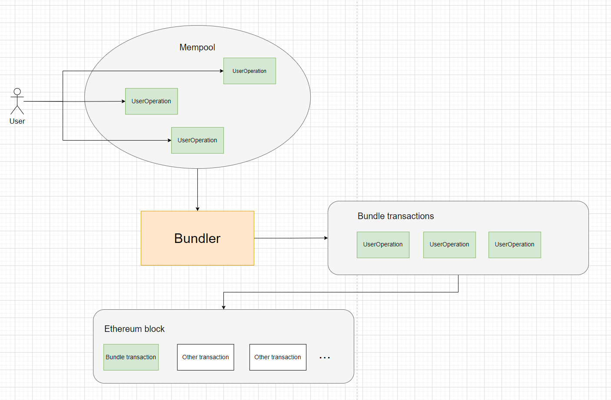
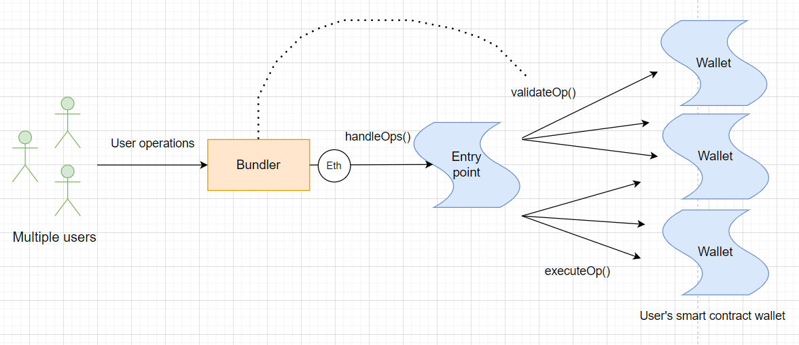
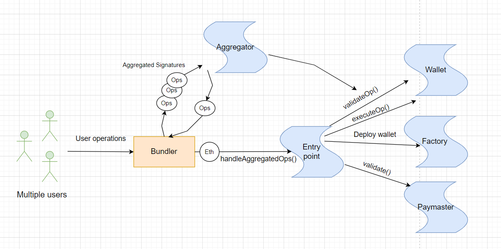

# ERC-4337: Account Abstraction Using Alt Mempool

> ERC-4337 - это стандарт Ethereum, который обеспечивает **абстракцию учетной записи** в протоколе без какого-либо изменения на уровне консенсуса.

Стандарт был предложен соучредителем **Ethereum** Виталиком Бутериным и другими разработчиками в 2021 году. В марте 2023 года он был развернут в основной сети Ethereum.

В Ethereum существует два типа аккаунтов:
  - **EOA**(Externally-owned account). Контролируется кем-либо, у кого есть приватный ключ.
  - **Contract account**. Смарт-контракт, который размещен в сети блокчейн.

Про систему аккаунтов можно прочитать [тут](https://ethereum.org/en/developers/docs/accounts/).

Согласно новому стандарту ERC-4337 два типа аккаунта объединяются в один. Результатом является единая учетная запись, способная одновременно совершать транзакции с токенами и создавать контракты. Можно сказать, что это уровень выше над двумя типами аккаунтов - **абстракция**.

## Зачем нужен ERC-4337?

**Ответ прост**: для построения кошельков нового поколения, которые объединят в себе преимущества смарт-контракта и EOA аккаунта.

Сегодня большинство кошельков(например [Metamask](https://metamask.io/)) являются типичными представителями EOA на базе приватного ключа. Такая модель диктует необходимость подписывать все транзакции с использованием приватного ключа. Это усложняет работу пользователя с кошельком. Более того, в случае потери приватного ключа, будет потерян и доступ к кошельку.

С другой стороны существуют альтернативные кошельки на базе смарт-контрактов([Gnosis wallet](https://safe.global/)). Смарт-контракт позволяет реализовать произвольную бизнес логику на кошельке. Например, мультиподпись. Но при этом пользователю такого кошелька все еще нужен EOA аккаунт, чтобы вызывать функции смарт-контракта и оплачивать газ.

_Важно!_ EOA аккаунт необходим, так как в блокчейн только он может быть инициатором транзакции. EOA аккаунт подписывает своим приватным ключом транзакции и платит газ за их исполнение.

ERC-4337 объединяет в себе функции кошельков на базе EOA и смарт-контрактов с помощью использования псевдотранзакций вместо обычных транзакций. Это позволяет обойти необходимость подписи каждой транзакции приватным ключом. Этот подход пришел на смену [ERC-2771](https://eips.ethereum.org/EIPS/eip-2771) о метатранзакциях. Подробнее можно почитать [тут](https://ethereum.org/en/roadmap/account-abstraction/). За счет псевдотранзакций достигается **абстракция** над аккаунтом пользователя. 😇

## Как это работает?

Alchemy подготовил серию статей на тему абстракции аккаунта. Эти статьи не просто рассказывают про новый стандарт, они пошагово объясняют, почему в стандарте были использованы те или иные подходы. Это самые полезные статьи с технической точки зрения, не считая статей Виталика, которые я встречал. Считаю, что для дальнейшего понимания, разработчикам, необходимо обязательно осилить их.

1. [You Could Have Invented Account Abstraction: Part 1](https://www.alchemy.com//blog/account-abstraction)
2. [Account Abstraction Part 2: Sponsoring Transactions Using Paymasters](https://www.alchemy.com/blog/account-abstraction-paymasters)
3. [Account Abstraction Part 3: Wallet Creation](https://www.alchemy.com/blog/account-abstraction-wallet-creation)
4. [Account Abstraction Part 4: Aggregate Signatures](https://www.alchemy.com/blog/account-abstraction-aggregate-signatures)

А вот теперь можно идти и читать "законы".😜 [ERC-4337](https://eips.ethereum.org/EIPS/eip-4337), добро пожаловать!

Ниже покажу несколько общих схем и кратко расскажу, процесс работы стандарта.
Основными **actors** выступают:
1. **Bundler**. Специальный сервис, который организует альтернативный мемпул для хранения псевдотранзакций и добавляет транзакции в Ethereum Block под видом обычных транзакций.
2. **Entry point contract**. Это singleton. По сути контракт, который является доверенной точкой входа для **Bundler**. Контракт занимается валидацией и исполнением транзакций.
3. **Paymaster**. Смарт-контракт, который может принимать участие в оплате газа за исполнение пользовательских псевдотранзакций.
4. **Account**. Или Wallet. По сути это смарт-контракт, который реализует логику работы кошелька пользователя. Вся основная бизнес логика работы кошелька в DApp описывается тут.

### Принцип работы Bundler

На схеме происходит следующее:
1. Пользователи подготавливают свои псевдотранзакции. Правильно называть их **UserOperations** в терминах стандарта.
2. Затем они отправляются в **альтернативный mempool**.
3. **Bundler** извлекает **UserOperations** из **альтернативного mempool**.
4. **Bundler** производит упаковку **UserOperations** в обычные транзакции.
5. **Bundler** добавляет транзакции в **Ethereum block**.

### Упрощенная схема работы ERC-4337

В самом простом варианте можно представить, что пользователи просят **Bundler** исполнить транзакцию на своем контракте **Wallet** за место них. При этом за газ будет платить **Bundler**. Можно придумать различные модели того, где **Bundler** будет брать средства для оплаты газа. Например, он может это делать безвозмездно или выдавать кредит пользователю с ожиданием того, что пользователь в будущем вернет ему оплату за газ, либо средства для оплаты газа могут списываться непосредственно с кошелька пользователя.

На схеме происходит следующее:
1. Пользователи отправляют свои **UserOperations** в **альтернативный mempool**, после чего они попадают к **Bundler**.
2. **Bundler** обрабатывает **UserOperations** и поочередно проверяет возможность выполнения через вызов `validateOp()` на контракте **Wallet**. Это необходимо, чтобы не потратить лишний gas в случае, если транзакция невалидна.
3. **Bundler** передает **UserOperations** доверенному контракту **EntryPoint**. Этот контракт снова валидирует транзакции и исполняет вызовы для каждого кошелька пользователя.

### Чуть более сложная схема работы ERC-4337

Схема ниже похожа на упрощенную схему. Однако на схеме добавилось несколько новых контрактов: **Factory**, **Paymaster**, **Aggregator**

На схеме происходит следующее:
1. Пользователи отправляют свои **UserOperations** в **альтернативный mempool**, после чего они попадают к **Bundler**.
2. **Bundler** отправляет **UserOperations** в контракт **Aggregator** для генерации комбинированной подписи. То есть **UserOperations** группируются и такая группа получает одну единственную подпись. Это позволяет дешевле исполнять транзакции группой, а не по одиночке. В процессе агрегации **UserOperations** валидируются через вызов `validateOp()` на соответствующих контрактах **Wallet**.
3. **Bundler** передает **aggregated UserOperations** доверенному контракту **EntryPoint**. Этот контракт снова валидирует транзакции и исполняет вызовы для каждого кошелька пользователя.
4. Однако, если контракт кошелька еще не был создан, перед выполнением транзакции пользователю будет создан кошелек через вызов контракта **Factory**.
5. Если в **UserOperation** был указан доверенный **Paymaster** контракт, то комиссия за газ будет списана с него для соответствующей **UserOperation**. Оплата за газ будет списана только в том случае, если контракт **Paymaster** разрешит. Для этого контракт **EntryPoint** проверяет **Paymaster** вызовом функции `validate()` у каждой **UserOperation**.

## Use cases

Стандарт **ERC-4337** открывает новые возможности для кошельков пользователя. Ниже расскажу про самые основные и самые актуальные.

1. **Multisig**. Совместное использование кошелька группой пользователей. Это было доступно для кошельков на базе смарт-контрактов, но не на базе EOA.
2. **Social recovery**. Этот кейс определяет возможность восстановить доступ к кошельку. То есть, если один из участников потерял доступ к кошельку, другие владельцы кошелька могут восстановить ему доступ. Либо можно заложить в кошелек возможность восстановления доступа другим удобным способом.
3. **Different signature schemes**. Стандарт позволяет использовать другие алгоритмы проверки цифровой подписи. Такие как [BLS](https://en.wikipedia.org/wiki/BLS_digital_signature) или [quantum resistant](https://www.technologyreview.com/2022/09/14/1059400/explainer-quantum-resistant-algorithms/) в будущем.
4. **Batching multiple operation**. Возможность вызывать несколько операций на кошельке в рамках одной транзакции. Например, при обмене токена на [Uniswap](https://uniswap.org/), можно вызывать `approve()` и `transferFrom()` в одной транзакции.
5. **Gas abstraction**. Это позволяет устанавливать адрес с которого будет списываться оплата за газ. Это значит, что DApp могут оплачивать газ за пользователя или пользователь может оплачивать газ со своего второго кошелька. Возможны и другие варианты использования, такие как, оплата газа в ERC-20 токене или обмен одного токена на другой внутри контракта кошелька.

_Важно!_ Благодаря стандарту возможно реализовать практически любой набор функций для кошелька. Ты можешь придумать свой вариант использования.

## Bundler

Есть два популярных Bundler:

1. [Bundler на go от stackup](https://github.com/stackup-wallet/stackup-bundler)
2. [Bundler на typescript от infinitism](https://github.com/eth-infinitism/bundler)

_Важно!_ На момент написания этой статьи node провайдеры данных уже начинают предлагать продукты, которые помогут построить **Account Abstraction**. Например, для получения раннего доступа в Alchemy нужно заполнить специальную форму. Сам продукт [тут](https://www.alchemy.com/account-abstraction). Или [Biconomy](https://docs.biconomy.io/docs/category/smart-accounts), который используется **Account Abstraction** для предоставления удобного SDK с помощью которого можно легко взаимодействовать с блокчейн.

## Контракты

Для стандарта были написаны контракты. Посмотреть можно [тут](https://github.com/eth-infinitism/account-abstraction/tree/develop/contracts).

Контракт [EntryPoint.sol](https://github.com/eth-infinitism/account-abstraction/blob/develop/contracts/core/EntryPoint.sol).

Контракт простого кошелька [SimpleAccount.sol](https://github.com/eth-infinitism/account-abstraction/blob/develop/contracts/samples/SimpleAccount.sol).

Контракт фабрики кошелька [FactorySimpleAccount.sol](https://github.com/eth-infinitism/account-abstraction/blob/develop/contracts/samples/SimpleAccountFactory.sol)

Базовый контракт для реализации [Paymaster](https://github.com/eth-infinitism/account-abstraction/blob/develop/contracts/core/BasePaymaster.sol)

_Важно!_ Аудитом контрактов занималась компания [OpenZeppelin](https://www.openzeppelin.com/). Подробнее можно ознакомиться с результатом [тут](https://blog.openzeppelin.com/eip-4337-ethereum-account-abstraction-incremental-audit).

## SDK для отправки UserOperation в сеть

Для того чтобы отправлять **UserOperation** в **альтернативный mempool** уже предлагаются различные sdk. Например, [@account-abstraction/sdk](https://www.npmjs.com/package/@account-abstraction/sdk). Этот sdk написан infinitism и совместим с их собственным [bundler](https://github.com/eth-infinitism/bundler).

## Еще больше примеров и полезных статей

Я не первопроходец в изучение стандарта. Есть интересный репозиторий [awesome account abstraction](https://github.com/4337Mafia/awesome-account-abstraction) с большим количеством материала, списком приложений, бандлеров и тому подобного.

## Links

1. [ERC-4337: Account Abstraction Using Alt Mempool](https://eips.ethereum.org/EIPS/eip-4337)
2. [What Is ERC-4337, or Account Abstraction for Ethereum?](https://academy.binance.com/en/articles/what-is-erc-4337-or-account-abstraction-for-ethereum)
3. [ERC 4337: account abstraction without Ethereum protocol changes](https://medium.com/infinitism/erc-4337-account-abstraction-without-ethereum-protocol-changes-d75c9d94dc4a). Статья Виталика от сентября 21-го года.
4. Видео с ETHGlobal от разработчика Ethereum Foundation: [Talk | ERC 4337: Account Abstraction via Alternative Mempool](https://www.youtube.com/watch?v=eyT6WzJmWyc&ab_channel=ETHGlobal).