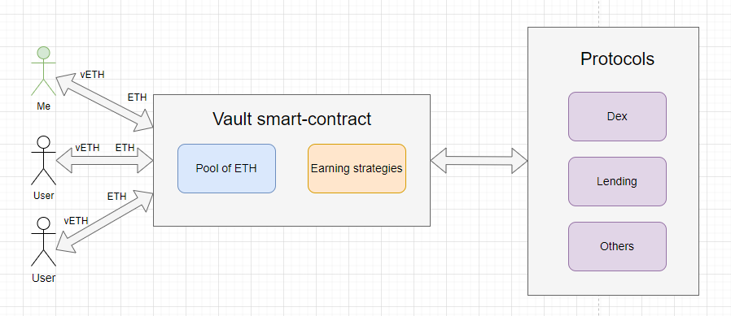
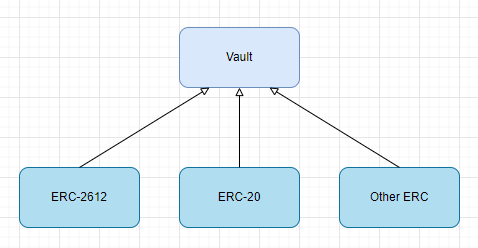

# ERC-4626: Tokenized Vaults

**Автор:** [Павел Найданов](https://github.com/PavelNaydanov) 🕵️‍♂️

_Опр!_ **Vault** - это смарт-контракт "хранилище", который позволяет пользователям максимизировать прибыль с активов, которыми они владеют. Пользователи передают свои активы смарт-контракту, который реализует некоторую стратегию заработка за счет использования предоставленных активов с автоматическим начислением процентов и ребалансировки.

В момент передачи пользователем активов в **vault**, взамен выдаются другие токены(share), приносящие доход. Эти токены со временем растут в цене и представляют собой частичное владение пользователем активов в vault. Их стоимость растет пропорционально росту стоимости активов в пуле **vault**.

## Как это работает?

Предположим, что **vault** принимает ETH(нативная валюта сети Ethereum) в качестве актива для максимизации прибыли. Я могу передать ETH смарт-контракту vault и взамен получу share токен vETH. Share токен - это своего рода долговая расписка vault, которая позволяет получить мой ETH обратно.

Переданный мной ETH, внутри **vault**, объединяется с ETH других пользователей и используется в различных протоколах для извлечения доходности. **Vault** проверяет доходность по разным протоколам, когда пользователь передает или снимает активы. Это вызывает ребалансировку активов в пуле, если существует более выгодная возможность получения доходности. Ребалансировка - это изменение соотношения активов между различными протоколами заработка или даже стратегиями с целью извлечения максимальной доходности.

> Например!
> Если MakerDao предлагает более высокий доход от вложения ETH в качестве ликвидности, чем Compound, то vault может принять решение о перемещении всего ETH или части из Compound в MakerDao. [MakerDao](https://makerdao.com/en/) и [Compound](https://compound.finance/) - это популярные lending протоколы.



## Стандарт ERC-4626

Стандарт [ERC-4626](https://eips.ethereum.org/EIPS/eip-4626) был разработан в рамках предложений по улучшению Ethereum. Он был создан в соавторстве с Джоуи Санторо, основателем протокола [Fei](https://fei.money/).

До момента появления стандарта среди **vaults** отсутствовала стандартизация, что приводило к разнообразию реализаций. В свою очередь, это затрудняло интеграцию протоколов, реализующих приложения поверх vault.

Сам стандарт представляет собой смарт-контракт, который является расширением стандарта ERC-20 и регламентирует:
- Ввод и вывод активов
- Расчет количества токенов для ввода и вывода активов
- Балансы активов
- Отправку событий

Появление стандарта снизило затраты на интеграцию и повысило надежность реализаций.

## Реализация

Техническая реализация наследуется от ERC-20 стандарта. Это позволяет минтить и сжигать **share**(долевые) токены в обмен на **assets**(underlying или базовые) токены. Для этого процесса vault предоставляет стандартные функции: `deposit()`, `mint()`, `redeem()`, `burn()`.

_Важно!_ Стандарт может реализовать для **vault** функционал других стандартов, например [ERC-2612: Permit Extension for EIP-20 Signed Approvals](https://eips.ethereum.org/EIPS/eip-2612).



В стандарте ERC-4626 предусмотрены две функции преобразования:
- `convertToShares(uint256 assets)`. Рассчитывает количество share токена, которое можно получить за переданное количество базового токена.
- `convertToAssets(uint256 shares)`. Рассчитывает количество базового токена, которое можно получить за переданное количество share токена.

### Deposit

Процесс передачи токенов на контракт vault. В процессе передачи, согласно стандарту, необходимо рассчитать количество share токенов, списать базовый токен, сминтить share токен и отправить solidity событие.

Функция `deposit()` может выглядеть подобно.

```solidity
function deposit(uint256 assets, address receiver) public virtual returns (uint256 shares) {
    /// Получаем доступное количество share токена
    /// для внесенного количества базового токена(assets)
    /// Под капотом вызывается convertToShares(uint256 assets)
    shares = previewDeposit(assets);

    if (shares == 0) {
        /// Если количество share токена равно нулю, то возвращается ошибка
        revert ZeroShares();
    }

    /// Трансфер базового токена на контракт vault
    asset.safeTransferFrom(msg.sender, address(this), assets);

    /// Минтинг взамена share токена
    _mint(receiver, shares);

    /// Отправка события, подтверждающее депозит пользователя
    emit Deposit(msg.sender, receiver, assets, shares);
}
```

### Redeem

Процесс передачи share токенов c целью изъятия базового актива, который был вложен через вызов функции `deposit()`. Согласно стандарту необходимо принять share токен, рассчитать количество базового токена и сжечь переданное количество share токена.

Функция `redeem()` может выглядеть подобно.

```solidity
function redeem(
    uint256 shares,
    address receiver,
    address owner
) public virtual returns (uint256 assets) {
    /// Проверяется, действительно ли указанный адрес вносил базовый токен на контракт
    /// или давал ли он разрешение на управление своим депозитом вызывающему функцию
    if (msg.sender != owner) {
        uint256 allowed = allowance[owner][msg.sender];

        if (allowed != type(uint256).max) allowance[owner][msg.sender] = allowed - shares;
    }

    /// Получаем доступное количество базового токена(assets)
    /// при возврате указанного количества share токена
    /// Под капотом вызывается convertToAssets(uint256 assets)
    assets = previewRedeem(shares);

    if (assets == 0) {
        /// Если количество базового токена равно нулю, то возвращается ошибка
        revert ZeroAssets();
    }

    /// Сжигание share токена
    _burn(owner, shares);

    /// Отправка базового токена до получателя
    asset.safeTransfer(receiver, assets);

    /// Отправка события об успешном окончании процесса снятия базового актива
    /// Согласно стандарту у нас есть только событие Withdraw()
    emit Withdraw(msg.sender, receiver, owner, assets, shares);
}
```

### Mint

Функция `mint()` реализует процесс предоставления базового токена контракту vault. Отличается этот процесс от `deposit()` тем, что здесь в аргументах функции указывается не количество базового актива, а количество share токена, которое необходимо получить после вызова функции.

Функция `mint()` может выглядеть подобно.

```solidity
function mint(uint256 shares, address receiver) public virtual returns (uint256 assets) {
        /// Рассчитывается количество базового актива для передачи на контракт
        assets = previewMint(shares);

        /// Трансфер базового актива от вызывающего до контракта
        asset.safeTransferFrom(msg.sender, address(this), assets);

        /// Минтинг share токенов
        _mint(receiver, shares);

        /// Отправка события об успешности процесса предоставления актива
        /// Согласно стандарту у нас есть только событие Deposit
        emit Deposit(msg.sender, receiver, assets, shares);
    }
```

### Withdraw

Функция `withdraw()` реализует процесс изъятия базового токена из контракта vault. Отличается этот процесс от `redeem()` тем, что здесь в аргументах функции указывается не количество share токена, а количество базового токена(assets), которое необходимо получить после вызова функции.

Функция `withdraw()` может выглядеть подобно.

```solidity
function withdraw(
    uint256 assets,
    address receiver,
    address owner
) public virtual returns (uint256 shares) {
    /// Рассчитывается количество share токена для передачи на контракт
    shares = previewWithdraw(assets);

    /// Проверяется, действительно ли указанный адрес вносил базовый токен на контракт
    /// или давал ли он разрешение на управление своим депозитом вызывающему функцию
    if (msg.sender != owner) {
        uint256 allowed = allowance[owner][msg.sender];

        if (allowed != type(uint256).max) allowance[owner][msg.sender] = allowed - shares;
    }

    /// Сжигание share токена
    _burn(owner, shares);

    /// Отправка базового токена до получателя
    asset.safeTransfer(receiver, assets);

    /// Отправка события об успешном окончании процесса снятия базового актива
    emit Withdraw(msg.sender, receiver, owner, assets, shares);
}
```

### Библиотеки

Самые популярные библиотеки уже реализовали минимальный функционал для контракта vault. Можно брать контракты, наследоваться от них и дорабатывать свой собственный контракт **vault**.

1. [Минимальная реализация](https://github.com/transmissions11/solmate/blob/main/src/mixins/ERC4626.sol) vault в библиотеке solmate.
2. [Минимальная реализация](https://github.com/OpenZeppelin/openzeppelin-contracts/blob/v5.0.0/contracts/token/ERC20/extensions/ERC4626.sol) vault в библиотеке openZeppelin.

_Важно!_ Стандарт полностью обратно совместим со стандартом ERC-20.

### Посложнее контракты

1. [Aave vault](https://github.com/aave/Aave-Vault/blob/main/src/ATokenVault.sol#L525)
2. Minimal ERC4626-style tokenized Vault [implementation](https://github.com/z0r0z/MultiVault/blob/main/src/MultiVault.sol) with ERC1155 accounting
3. [Rari-Capital vault](https://github.com/Rari-Capital/vaults/blob/main/src/Vault.sol)
4. Протокол Fuji V2 Himalaya. Контракт [YieldVault](https://github.com/Fujicracy/fuji-v2/blob/f32394f00a0a6cf6c12309ae92bc1602dc27c535/packages/protocol/src/vaults/yields/YieldVault.sol). Этот контракт наследуется от [BaseVault](https://github.com/Fujicracy/fuji-v2/blob/f32394f00a0a6cf6c12309ae92bc1602dc27c535/packages/protocol/src/abstracts/BaseVault.sol).

## Links

1. [ERC-4626: Tokenized Vaults](https://eips.ethereum.org/EIPS/eip-4626)
2. [ERC-2612: Permit Extension for EIP-20 Signed Approvals](https://eips.ethereum.org/EIPS/eip-2612)
3. [ERC-20: Token Standard ](https://eips.ethereum.org/EIPS/eip-20)
4. [Про ERC-4626 на ethereum.org](https://ethereum.org/en/developers/docs/standards/tokens/erc-4626/)
5. Прекрасный простой пример vault на [solidity-by-example](https://solidity-by-example.org/defi/vault/).