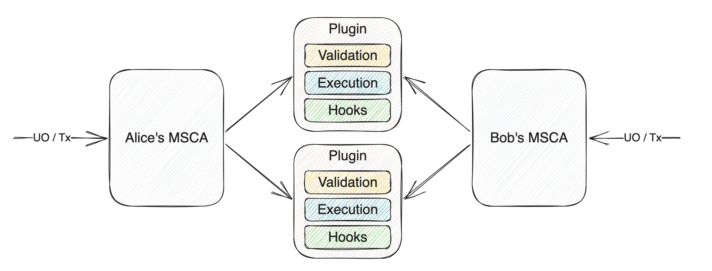
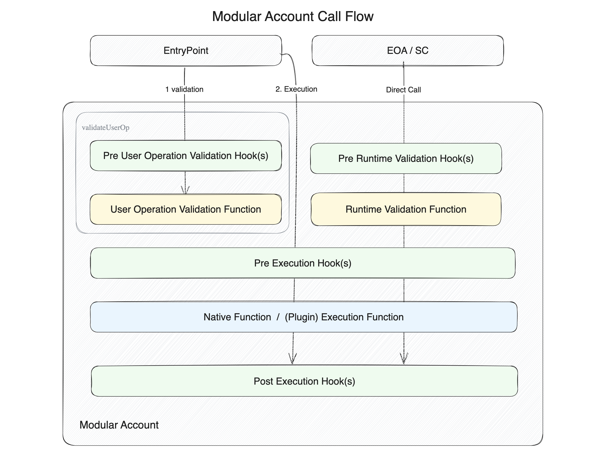
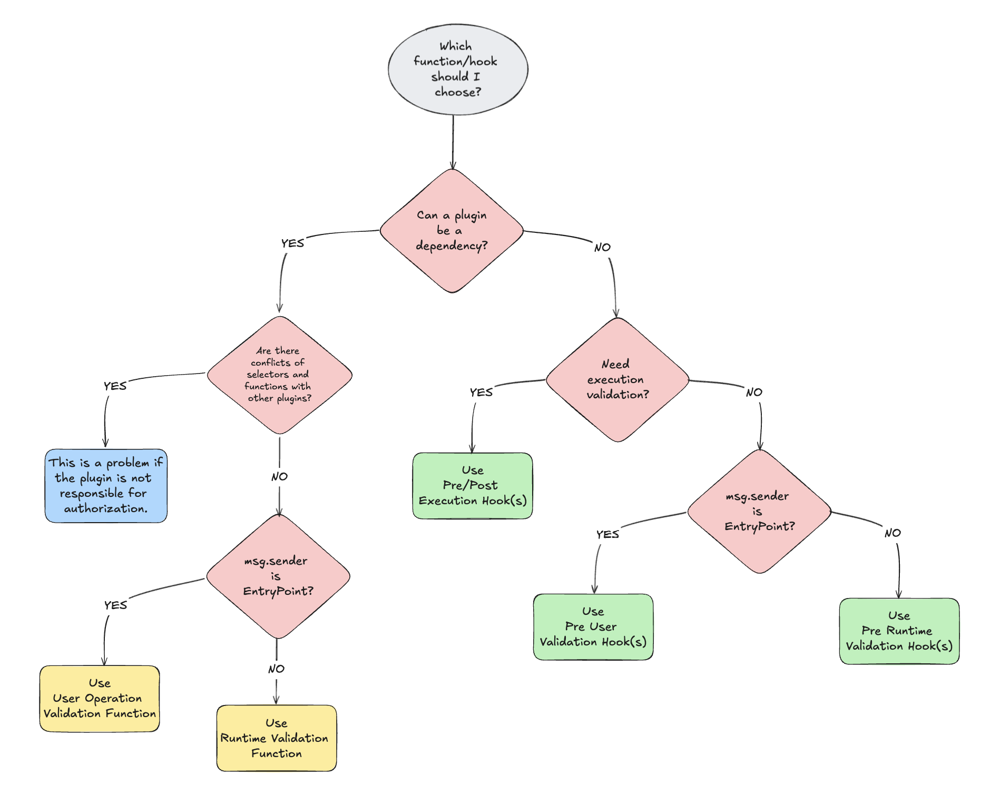

# ERC-6900: Modular Smart Contract Accounts and Plugins

**Автор:** [Роман Ярлыков](https://github.com/rlkvrv) 🧐

ERC-6900 — это стандарт Ethereum, определяющий модульные абстрактные аккаунты (Modular Smart Contract Account — MSCA). Он расширяет функциональность [ERC-4337](https://eips.ethereum.org/EIPS/eip-4337) (Account Abstraction), позволяя выносить дополнительную логику и проверки во внешние модули.

Ключевые аспекты ERC-6900:

- **Модульность**: позволяет разделить логику аккаунта на отдельные плагины.
- **Расширяемость**: упрощает добавление новых функций к аккаунтам без изменения основного кода.
- **Стандартизация**: обеспечивает совместимость между различными реализациями аккаунтов и плагинов.
- **Интеграция с ERC-4337**: совместим с инфраструктурой Account Abstraction.

*Важно!* Оба стандарта (ERC-4337 и ERC-6900) находятся в стадии черновика, поэтому возможны изменения. В статье рассматривается AA (ERC-4337) версии v0.6.0 и ERC-6900 (MSCA) версии v0.7.0 (на базе AA v0.6.0). Например, уже есть новая версия AA, в которой изменена работа с `validateUserOp`, но MSCA пока этого не поддерживает.

Кроме того, ERC-6900 тесно связан с Alchemy, поэтому самые свежие обновления по этому стандарту, скорее всего, будут в их репозиториях, так как они разрабатывают архитектуру для работы с такими аккаунтами. Это один из главных недостатков стандарта — он создается с учетом нужд конкретного протокола, а не всего сообщества.

## MSCA

Стандарт вдохновлен [ERC-2535: Diamonds, Multi-Facet Proxy](https://eips.ethereum.org/EIPS/eip-2535) для маршрутизации логики выполнения на основе селекторов функций, хотя напрямую этот стандарт не используется. Все селекторы хранит MSCA — фактически это расширенная версия аккаунта ERC-4337, которая содержит логику установки/удаления плагинов и знает, по какому селектору куда перенаправить вызов.

На MSCA может выполняться два вида вызовов функций:
- **User operation** — вызов через EntryPoint. Функции обрабатывают вызовы `validateUserOp` и проверяют действительность пользовательской операции ERC-4337.
- **Runtime** — прямой вызов на смарт-контракте аккаунта. Сюда входят служебные функции аккаунта (например, `execute`, `executeBatch`, `upgradeToAndCall`, `installPlugin` и т.д.).

Для охвата всех возможных вызовов (включая прямые) у плагина может быть три типа callback-функций:
- **Validation** — для проверки `userOp` или прямых вызовов. Схемы валидации определяют условия, при которых учетная запись смарт-контракта будет одобрять действия, выполняемые от ее имени.
- **Execution** — содержит логику выполнения бизнес-логики или проверки во время выполнения.
- **Hooks** — хуки различаются в зависимости от места их вызова, позволяя контролировать процесс до и после выполнения.
  - **Pre User Operation Validation Hook** — запускается перед функцией `userOpValidationFunction`.
  - **Pre Runtime Validation Hook** — запускается перед `runtimeValidationFunction`.
  - **Pre Execution Hook** — запускается до выполнения бизнес-логики, может передавать данные функции Post Execution Hook.
  - **Post Execution Hook** — запускается после выполнения бизнес-логики и может обрабатывать данные Pre Execution Hook.

   
*Источник: Стандарт ERC-6900*

Идея в том, чтобы разделить вызовы на два типа из-за их различий: вызовы от EntryPoint и вызовы от EOA и смарт-контрактов. Это различие происходит на уровне валидации вызова, в то время как на уровне исполнения могут использоваться "общие" callback-функции. Получается следующая схема:

   
*Источник: Стандарт ERC-6900*

Существуют также вызовы `executeFromPlugin` и `executeFromPluginExternal`, которые обрабатываются иначе, но для начала лучше разобраться с первыми двумя типами вызовов и протестировать их на практике, прежде чем пробовать вызывать один плагин из другого.

### Как создать MSCA из AA

Чтобы преобразовать классический Account Abstraction (AA) кошелек в MSCA, потребуются четыре обязательных интерфейса:

- [IAccount.sol](https://github.com/eth-infinitism/account-abstraction/blob/releases/v0.6/contracts/interfaces/IAccount.sol) — базовый интерфейс для всех AA (ERC-4337), описывающий функцию `validateUserOp`, которая вызывается смарт-контрактом *EntryPoint*. В классическом варианте здесь реализована проверка подписи и другая логика валидации. В MSCA вместо этого используется функция `userOpValidationFunction` и хук `preUserOpValidationHook`, делегирующие эти проверки установленным плагинам.
    ```solidity
    function validateUserOp(
        UserOperation calldata userOp, 
        bytes32 userOpHash, 
        uint256 missingAccountFunds
    ) external returns (uint256 validationData);
    ```
- [IPluginManager.sol](https://github.com/erc6900/reference-implementation/blob/v0.7.x/src/interfaces/IPluginManager.sol) — отвечает за установку и удаление плагинов с помощью двух функций:
    ```solidity
    function installPlugin(
        address plugin,
        bytes32 manifestHash,
        bytes calldata pluginInstallData,
        FunctionReference[] calldata dependencies
    ) external;

    function uninstallPlugin(
        address plugin,
        bytes calldata config, 
        bytes calldata pluginUninstallData
    ) external;
    ```
- [IStandardExecutor.sol](https://github.com/erc6900/reference-implementation/blob/v0.7.x/src/interfaces/IStandardExecutor.sol) — включает стандартные функции выполнения вызовов AA, через них запрещено вызывать плагины напрямую.
    ```solidity
    function execute(
        address target, 
        uint256 value, 
        bytes calldata data
    ) external payable returns (bytes memory);

    function executeBatch(
        Call[] calldata calls // Call { target; value; data }
    ) external payable returns (bytes[] memory);
    ```
- [IPluginExecutor.sol](https://github.com/erc6900/reference-implementation/blob/v0.7.x/src/interfaces/IPluginExecutor.sol) - с помощью этого интерфейса плагин А может вызвать плагин Б, но вызов будет произведен через MSCA. Функция `executeFromPluginExternal` нужна, чтобы плагин мог вызвать внешний смарт-контракт через MSCA.
    ```solidity
    function executeFromPlugin(
        bytes calldata data
    ) external payable returns (bytes memory);

    function executeFromPluginExternal(
        address target, 
        uint256 value, 
        bytes calldata data
    ) external payable returns (bytes memory);
    ```

Кроме этих обязательных интерфейсов, также существует [IAccountLoupe.sol](https://github.com/erc6900/reference-implementation/blob/v0.7.x/src/interfaces/IAccountLoupe.sol), который предоставляет информацию об установленных плагинах ончейн. Например, он включает функции `getInstalledPlugins`, `getPreValidationHooks` и другие.

## Плагины

Плагин — это смарт-контракт-синглтон, разворачиваемый в единственном экземпляре для всех аккаунтов, которые будут его устанавливать. Плагин хранит настройки каждого аккаунта. Смарт-контракт плагина не должен быть обновляемым; для обновления необходимо удалить старую версию плагина и установить новую.

Плагин должен наследовать [IPlugin.sol](https://github.com/erc6900/reference-implementation/blob/v0.7.x/src/interfaces/IPlugin.sol) и реализовывать как минимум функции для установки и удаления плагина:

```solidity
function onInstall(bytes calldata data) external;

function onUninstall(bytes calldata data) external;
```

Также плагин должен содержать манифест и метаданные.

```solidity
function pluginManifest() external pure returns (PluginManifest memory);

function pluginMetadata() external pure returns (PluginMetadata memory);
```

Манифест необходим для установки плагина. Он описывает функции выполнения, функции проверки и хуки, которые будут настроены на MSCA во время установки плагина. Кроме того, манифест содержит требования к зависимостям (где зависимостью может выступать другой плагин) и разрешения на использование определенных функций.

Стоит подробнее рассмотреть структуру манифеста.

### Манифест плагина

Манифест — это спецификация плагина, определяющая, как MSCA должен взаимодействовать с плагином, какие функции плагина следует вызывать при обращении к определённым селекторам и как обрабатывать зависимости от других плагинов.

```solidity
struct PluginManifest {
    // Список интерфейсов ERC-165 который следует добавить к аккаунту MSCA.
    // Не должен включать интерфейс IPlugin
    bytes4[] interfaceIds;
    // Если какие-то функции плагина зависят от валидации через другие плагины,
    // то их интерфейсы должны быть добавлены в этот массив
    bytes4[] dependencyInterfaceIds;
    // Это функции плагина, которые устанавливаются на MSCA
    // и расширяют его функционал
    bytes4[] executionFunctions;
    // Функции, уже установленные на MSCA, к которым есть доступ у этого плагина
    bytes4[] permittedExecutionSelectors;
    // Флаг определяющий может ли плагин вызывать внешние смарт-контракты
    bool permitAnyExternalAddress;
    // Флаг определяющий может ли плагин тратить нативные токены сети
    bool canSpendNativeToken;
    // Спецификация функций
    ManifestExternalCallPermission[] permittedExternalCalls;
    ManifestAssociatedFunction[] userOpValidationFunctions;
    ManifestAssociatedFunction[] runtimeValidationFunctions;
    ManifestAssociatedFunction[] preUserOpValidationHooks;
    ManifestAssociatedFunction[] preRuntimeValidationHooks;
    ManifestExecutionHook[] executionHooks;
}
```

**interfaceIds**

Например, если ваш аккаунт не поддерживает работу с ERC721 и не может принимать NFT, вы можете добавить плагин с функцией `onERC721Received`, а в `interfaceIds` указать интерфейс `IERC721Receiver`. В результате `supportInterface` аккаунта MSCA будет возвращать `true` при проверке этого интерфейса.

**dependencyInterfaceIds** 

Необходимо указывать, когда целевой плагин зависит от валидации на другом плагине.
Например возьмем [плагин](./contracts/src/TokenWhitelistPlugin.sol), который я написал для тестов. Его основная задача проверять есть ли токен ERC20 в вайтлисте при вызовах функций `transfer` и `approve`. У него есть служебная функция `updateTokens`, которая добавляет и удаляет токены из вайтлиста. Логично, что доступ к такой функции должен быть ограничен, но плагин могут использовать тысячи аккаунтов и отдавать управление вайтлистом какому-то одному кошельку-админу нецелесообразно. В связи с этим каждый аккаунт MSCA сам управляет списком токенов с которыми он может работать. Чтобы доступ к изменению вайтлиста был только у MSCA - понадобиться добавить зависимость в виде плагина который будет отвечать за проверку доступа. В моем случае это [MultiOwnerPlugin](https://github.com/alchemyplatform/modular-account/blob/v1.0.1/src/plugins/owner/MultiOwnerPlugin.sol). Настройка этой проверки будет выполнена далее.

```solidity
function pluginManifest() external pure override returns (PluginManifest memory) {
    PluginManifest memory manifest;
    // dependency
    manifest.dependencyInterfaceIds = new bytes4[](1);
    manifest.dependencyInterfaceIds[0] = type(IMultiOwnerPlugin).interfaceId;

    // ...
}
```

**executionFunctions**

Это функции которые устанавливаются на MSCA при установке плагина, тем самым расширяя его. В моем случае это функции `updateTokens`, `isAllowedToken` и `getTokens`. Расширяют, означает, что они, как и служебные функции аккаунта, будут вызываться на аккаунте "напрямую", например так - `account.updateTokens()`. Т.к. функции плагина будут вызваны через `fallback` функцию аккаунта, то если мы не добавим их селекторы в `executionFunctions`, такой вызов будет аккаунтом отклонен.

**permittedExecutionSelectors**

В этот массив добавляются селекторы функций, которые могут быть вызваны плагином на MSCA через функцию `executeFromPlugin`.

**permitAnyExternalAddress**

Флаг, который разрешает или запрещает вызовы через `executeFromPluginExternal`.

**canSpendNativeToken**

Флаг, который определяет, может ли плагин использовать нативные токены сети.

### Спецификация функций с которыми работает плагин

Этот раздел манифеста описывает, как именно плагин будет взаимодействовать с различными функциями и хуками в MSCA.

**permittedExternalCalls**

Определяет разрешения на вызовы внешних адресов. Имеет два варианта: либо разрешить вызовы любого селектора, либо передать массив разрешённых селекторов.

```solidity
struct ManifestExternalCallPermission {
    address externalAddress;
    bool permitAnySelector;
    bytes4[] selectors;
}
```

**userOpValidationFunctions, runtimeValidationFunctions**

Если ваш плагин должен подключаться на этапе вызова `userOpValidationFunction` или `runtimeValidationFunctions`, то необходимо описать, для каких селекторов это будет работать. Важно отметить, что функции (`userOpValidationFunctions` и `runtimeValidationFunctions`) могут быть только по одной на на каждый селектор аккаунта, независимо от количества установленных плагинов.

К примеру плагин [MultiOwnerPlugin](https://github.com/alchemyplatform/modular-account/blob/v1.0.1/src/plugins/owner/MultiOwnerPlugin.sol) отвечает за валидацию всех транзакций при вызове селекторов аккаунта. Это означает, что если на аккаунте уже установлен *MultiOwnerPlugin*, то только он отвечает за валидацию селектора `IStandardExecutor.execute.selector` в функциях `userOpValidationFunctions` и `runtimeValidationFunctions`. Поэтому не получится установить плагин, в котором проверка для селектора `execute` будет обрабатываться этими же функциями, будет ошибка вроде этой `UserOpValidationFunctionAlreadySet(0xb61d27f6,0xc7183455a4c133ae270771860664b6b7ec320bb100)`.

Решение в такой ситуации - добавить необходимую проверку в хук `preUserOpValidationHooks` или `preRuntimeValidationHooks`, а не в функцию.

Если вам нужна валидация нового селектора, устанавливаемого в MSCA, который не обрабатывается через *MultiOwnerPlugin*, вы можете добавить его через зависимость. Для этого используются структуры `ManifestAssociatedFunction` и `ManifestFunction`.

Разберем на примере моего плагина `TokenWhitelistPlugin` и функции `updateTokens`, которую я хочу добавить к MSCA. Ранее мы уже добавили `IMultiOwnerPlugin` в `dependencyInterfaceIds`, это был шаг номер 1. Теперь необходимо добавить селектор в `executionFunctions`. 

```solidity
function pluginManifest() external pure override returns (PluginManifest memory) {
    PluginManifest memory manifest;
    // dependency
    manifest.dependencyInterfaceIds = new bytes4[](1);
    manifest.dependencyInterfaceIds[0] = type(IMultiOwnerPlugin).interfaceId;

    // runtime execution functions
    manifest.executionFunctions = new bytes4[](1);
    manifest.executionFunctions[0] = this.updateTokens.selector;
    // ...
}
```
Данная функция плагина будет вызываться только в runtime, потому что аккаунт не может вызывать плагин через `userOp`, следовательно обрабатывать вызов будем через соответствующую функцию. Для начала создаем новый массив `ManifestAssociatedFunction` и добавляем туда селектор функции:

```solidity
struct ManifestAssociatedFunction {
    bytes4 executionSelector; // селектор аккаунта (в данном случае он добавлен с плагина)
    ManifestFunction associatedFunction; // функция отвечающая за обработку
}

manifest.runtimeValidationFunctions = new ManifestAssociatedFunction[](1);
manifest.runtimeValidationFunctions[0] = ManifestAssociatedFunction({
    executionSelector: this.updateTokens.selector,
    associatedFunction: // ...
});
```

Далее в `associatedFunction` необходимо добавить структуру `ManifestFunction` чтобы описать что плагин должен с этим селектором:

```solidity
struct ManifestFunction {
    ManifestAssociatedFunctionType functionType; // Это enum который определен стандартом erc-6900
    uint8 functionId; // Это enum который определяется в плагине и помогает идентифицировать функцию
    uint256 dependencyIndex; // Индекс зависимости в массиве dependencyInterfaceIds
}
```

Первое, с чем нужно определиться - это `functionType`, флаг, по которому аккаунт поймет куда направить обработку этого селектора:

```solidity
enum ManifestAssociatedFunctionType {
    // Функция не определена
    NONE,
    // Функция принадлежит этому плагину
    SELF,
    // Функция принадлежит внешнему плагину, предоставляемому
    // в качестве зависимости при установке плагина.
    // Плагины МОГУТ зависеть от внешних функций проверки.
    // Он НЕ ДОЛЖЕН зависеть от внешних хуков, иначе установка будет неудачной.
    DEPENDENCY,
    // Устанавливает магическое значение, чтобы всегда пропускать проверку
    // в режиме runtime для данной функции.
    // Только для режима runtime, если установить для validationFunction,
    // это будет впустую потраченный газ. 
    // Если использовать с хуком, равносильно тому что хук не задан.
    RUNTIME_VALIDATION_ALWAYS_ALLOW,
    // Устанавливает магическое значение, чтобы всегда вызывать сбой в хуке для данной функции.
    // Используется только с хуками предварительного выполнения. 
    // Но не следует использовать с функциями проверки - 
    // равносильно тому, что проверка отсутствует.
    // Его не следует использовать в post-exec хуках, потому что если известно,
    // что хук всегда будет возвращаться, это должно происходить как можно раньше, 
    // чтобы сэкономить газ.
    PRE_HOOK_ALWAYS_DENY
}
```

В нашем случае необходимо использовать флаг `DEPENDENCY`. Когда добавляется зависимость `functionId` не имеет значения, т.к. его назначит сама зависимость, `dependencyIndex` должен соответствовать позиции плагина-зависимости в `dependencyInterfaceIds`:

```solidity
manifest.runtimeValidationFunctions = new ManifestAssociatedFunction[](1);
manifest.runtimeValidationFunctions[0] = ManifestAssociatedFunction({
    executionSelector: this.updateTokens.selector,
    associatedFunction: ManifestFunction({
        functionType: ManifestAssociatedFunctionType.DEPENDENCY,
        functionId: 0, // в случае с зависимостью ни на что не влияет
        dependencyIndex: 0 // в нашем случае 0, потому что по этому индексу лежит интерфейс IMultiOwnerPlugin
    })
});
```

Почти готово. Чтобы все сработало нужно правильно установить плагин `TokenWhitelistPlugin` с описанием того, какая будет зависимость и как она должна работать. Зависимость указывается как `bytes21`, где первые 20 байт содержат адрес плагина-зависимости, а последний байт указывает `functionId` который нужно передать зависимости.

```solidity
// Пользовательский тип для упаковки данных о плагине
type FunctionReference is bytes21;

FunctionReference[] memory dependencies = new FunctionReference[](1);
// здесь указываем адрес зависимости и functionId
dependencies[0] = FunctionReferenceLib.pack(
    address(multiOwnerPlugin),
    uint8(IMultiOwnerPlugin.FunctionId.RUNTIME_VALIDATION_OWNER_OR_SELF)
);

vm.prank(owner);
account1.installPlugin({
    plugin: address(tokenWhitelistPlugin),
    manifestHash: manifestHash,
    pluginInstallData: tokenWhitelistPluginInstallData,
    dependencies: dependencies // сюда передаем зависимости
});
```

Готово. Если все сделать правильно, то теперь при вызове на аккаунте `updateTokens` аккаунт будет видеть, что этот селектор обрабатывает зависимость `MultiOwnerPlugin`, поэтому передаст управление ему в функцию `runtimeValidationFunction`, где будет определен `functionId` указанный при установке зависимости вместе с плагином:

```solidity
function runtimeValidationFunction(
    uint8 functionId, 
    address sender, 
    uint256, 
    bytes calldata
) external view override {
    if (functionId == uint8(FunctionId.RUNTIME_VALIDATION_OWNER_OR_SELF)) {
        // Validate that the sender is an owner of the account, or self.
        if (sender != msg.sender && !isOwnerOf(msg.sender, sender)) {
            revert NotAuthorized();
        }
        return;
    }
    revert NotImplemented(msg.sig, functionId);
}
```

*Важно!* В зависимости не получится указать внешний хук, только внешнюю функцию.

**preUserOpValidationHooks**, **preRuntimeValidationHooks**

Обрабатываются также через *ManifestAssociatedFunction*. Выполняются перед соответствующими функциями. Хуков может быть несколько на один селектор в одном аккаунте MSCA. Не могут быть зависимостями.

**executionHooks**

Хуки, которые задеиствуется на этапе выполнения кода, независимо от того, каким способом был сделан вызов - через userOp или напрямую. Например для плагина `TokenWhitelistPlugin` это хорошее место чтобы охватить все вызовы и выполнить проверку есть ли токен в вайтлисте.

Т.к есть два хука на этапе выполнения: pre- и postExecHook, то и структура для описания обработки хуков немного другая - `ManifestExecutionHook`:

```solidity
struct ManifestExecutionHook {
    bytes4 selector; // селектор функции, выполнение которой нужно проверить
    ManifestFunction preExecHook; // функция для предварительной проверки
    ManifestFunction postExecHook; // функция для пост-проверки
}
```

Дальше используется все та же `ManifestFunction`, например мне на плагине нужно обрабатывать вызовы через функции аккаунта MSCA `execute` или `executeBatch`.

- Тип функции будет `SELF`, потому вызов обрабатывается в этом же плагине. 
- `functionId` указываем для того, чтобы плагин понимал с каким селектором производится вызов.
- `dependencyIndex` не указываем, потому что у хуков не может быть зависимостей.

```solidity
    manifest.executionHooks = new ManifestExecutionHook[](2);
    manifest.executionHooks[0] = ManifestExecutionHook({
        executionSelector: IStandardExecutor.execute.selector,
        preExecHook: ManifestFunction({
            functionType: ManifestAssociatedFunctionType.SELF,
            functionId: uint8(FunctionId.EXECUTE_FUNCTION),
            dependencyIndex: 0
        }),
        postExecHook: none
    });
    manifest.executionHooks[1] = ManifestExecutionHook({
        executionSelector: IStandardExecutor.executeBatch.selector,
        preExecHook: ManifestFunction({
            functionType: ManifestAssociatedFunctionType.SELF,
            functionId: uint8(FunctionId.EXECUTE_BATCH_FUNCTION),
            dependencyIndex: 0
        }),
        postExecHook: none
    });
```

Манифест готов. Далее в плагине нужно будет реализовать функцию `preExecutionHook`, для обработки таких вызовов. Реализацию можно посмотреть [здесь](./contracts/src/TokenWhitelistPlugin.sol).

```solidity
function preExecutionHook(
    uint8 functionId, 
    address sender, 
    uint256 value, 
    bytes calldata data
) external view override returns (bytes memory) {}
```

## Разработка плагина

Перед тем как сделать плагин, необходимо четко определить, с какими селекторами он будет работать и где нужно выполнять проверки. Примерный чек-лист, который я составил для себя, выглядит так (есть вероятность, что я что-то упустил):

- [ ] Что делает плагин? Какова его главная задача?
- [ ] Какие функции нужно будет добавить аккаунту?
- [ ] Понадобится ли обрабатывать данные `userOp` или достаточно данных вызова?
- [ ] Будет ли плагин использоваться как зависимость?
- [ ] Нет ли конфликта селекторов с другими плагинами?
- [ ] Где выполнить проверку как можно раньше? Имеется в виду поток проверки и выполнения вызова и выбор функции или хука в соответствии с этим потоком.
- [ ] Обрабатывает ли выбранная функция/хук все возможные вызовы на аккаунте?

Для примера возьмем другой плагин — [TransferLimitPlugin](./contracts/src/TransferLimitPlugin.sol) и пройдем по этому списку.

1. Плагин должен устанавливать лимиты неснижаемого остатка токенов ERC20 на аккаунте MSCA. Например, вы боитесь потратить по ошибке большую сумму USDT, поэтому ставите на него лимит. К примеру, на кошельке лежит 5500 USDT, ставим лимит на 5000, а 500 можем спокойно тратить, заодно плагин оградит вас от бесконечных апрувов.
2. Основная функция для такого плагина — обновление лимитов, так ее и назовем — `updateLimit`. Эту функцию сможет вызывать только тот, кто может управлять настройками аккаунта MSCA. Помимо этого понадобятся некоторые view-функции, в нашем случае это `getCurrentLimit` и `getTokensForAccount`.
3. В данном случае не важно, каким способом был сделан вызов, важно обрабатывать любые вызовы MSCA — userOp и runtime.
4. Выглядит так, что нет нужды использовать плагин как зависимость.
5. Так как мы не собираемся делать этот плагин в качестве зависимости, означает, что мы будем использовать хуки, а значит, конфликтовать они не будут.
6. Раньше всего проверку можно выполнить в хуках валидации (preUserOpValidationHooks или preRuntimeValidationHooks), но в таком случае придется на плагине писать две отдельные функции-обработчики, да и информация из userOp нам ничем не поможет.
7. Определенно нужно обрабатывать все возможные переводы токенов, поэтому в данном случае целесообразно сделать это в `preExecutionHook`.

Для наглядности я также накидал схемку, по которой будет проще выбрать необходимые функции или хуки для плагина.



Далее необходимо написать манифест в соответствии с правилами, о которых я рассказывал выше (он будет похож на манифест плагина `TokenWhitelistPlugin`) и реализовать сами функции.

### Функции view и pure

Функции на чтение данных нужно также добавить в `executionFunctions` и отнести их к типу `RUNTIME_VALIDATION_ALWAYS_ALLOW`, чтобы они также стали частью MSCA, хотя возможно в некоторых случаях проще будет их вызывать непосредственно на плагине.

```solidity
function pluginManifest() external pure override returns (PluginManifest memory) {
    // ...

    // runtime execution functions
    manifest.executionFunctions = new bytes4[](3);
    manifest.executionFunctions[0] = this.updateLimit.selector;
    manifest.executionFunctions[1] = this.getTokensForAccount.selector;
    manifest.executionFunctions[2] = this.getCurrentLimit.selector;

    ManifestFunction memory runtimeAlwaysAllow = ManifestFunction({
        functionType: ManifestAssociatedFunctionType.RUNTIME_VALIDATION_ALWAYS_ALLOW,
        functionId: 0,
        dependencyIndex: 0
    });

    manifest.runtimeValidationFunctions = new ManifestAssociatedFunction[](3);
    manifest.runtimeValidationFunctions[0] = ManifestAssociatedFunction({
        executionSelector: this.updateLimit.selector,
        // ...
    });
    manifest.runtimeValidationFunctions[1] = ManifestAssociatedFunction({
        executionSelector: this.getTokensForAccount.selector,
        associatedFunction: runtimeAlwaysAllow
    });
    manifest.runtimeValidationFunctions[2] = ManifestAssociatedFunction({
        executionSelector: this.getCurrentLimit.selector,
        associatedFunction: runtimeAlwaysAllow
    });
```

Полный пример можно посмотреть [здесь](./contracts/src/TransferLimitPlugin.sol).

### Установка и удаление плагина

Чтобы плагин можно было установить на MSCA, необходимо реализовать функции `onInstall` и `onUninstall`. Например, в случае с плагином *TransferLimitPlugin* в процессе установки можно сразу задать все необходимые лимиты, а при удалении — их очистить:

```solidity
    function onInstall(bytes calldata data) external override {
        (ERC20SpendLimit[] memory spendLimits) = abi.decode(data, (ERC20SpendLimit[]));

        uint256 length = spendLimits.length;
        for (uint8 i = 0; i < length; i++) {
            _tokenList.tryAdd(msg.sender, SetValue.wrap(bytes30(bytes20(spendLimits[i].token))));
            _limits[msg.sender][spendLimits[i].token] = spendLimits[i].limit;
        }
    }

    function onUninstall(bytes calldata data) external override {
        (address[] memory tokens) = abi.decode(data, (address[]));

        uint256 length = tokens.length;
        for (uint8 i = 0; i < length; i++) {
            delete _limits[msg.sender][tokens[i]];
        }
        _tokenList.clear(msg.sender);
    }
```

Для установки плагина потребуется:
- Адрес плагина.
- Хеш `keccak256` от манифеста плагина.
- Данные, которые необходимо передать в функцию `onInstall` (в нашем случае это адреса токенов и их лимиты).
- Зависимости, например MultiOwnerPlugin.

```solidity
function _installTransferLimitPlugin() private {
    // Получаем хеш манифеста
    bytes32 transferLimitManifestHash = keccak256(abi.encode(transferLimitPlugin.pluginManifest()));

    // Настраиваем параметры установки
    TransferLimitPlugin.ERC20SpendLimit[] memory spendLimits = new TransferLimitPlugin.ERC20SpendLimit[](1);
    spendLimits[0] = TransferLimitPlugin.ERC20SpendLimit({token: address(token), limit: TRANSFER_LIMIT});
    bytes memory transferLimitPluginInstallData = abi.encode(spendLimits);

    // Настраиваем зависимости
    FunctionReference[] memory dependencies = new FunctionReference[](1);
    dependencies[0] = FunctionReferenceLib.pack(
        address(multiOwnerPlugin), uint8(IMultiOwnerPlugin.FunctionId.RUNTIME_VALIDATION_OWNER_OR_SELF)
    );

    // Устанавливаем плагин на MSCA
    vm.prank(owner);
    account1.installPlugin(
        address(transferLimitPlugin),
        transferLimitManifestHash,
        transferLimitPluginInstallData,
        dependencies
    );
}
```

Для удаления плагина потребуется настроить конфигурацию `UninstallPluginConfig`:

```solidity
struct UninstallPluginConfig {
    // Манифест плагина
    bytes serializedManifest;
    // Флаг для принудительного удаления плагина.
    // Удаляет плагин, даже если функция onUninstall попытается остановить транзакцию
    bool forceUninstall;
    // Максимальное количество газа, допустимое для каждой функции обратного вызова деинсталляции
    // (`onUninstall`), или ноль, чтобы не устанавливать ограничения.
    // Обычно используется вместе с `forceUninstall` для удаления плагинов, которые
    // препятствуют деинсталляции, потребляя весь оставшийся газ.
    uint256 callbackGasLimit;
}
```

Пример удаления плагина:

```solidity
function test_uninstallPlugin() external {
    // Получаем манифест
    bytes memory serializedManifest = abi.encode(transferLimitPlugin.pluginManifest());

    // Настраиваем конфигурацию для удаления
    bytes memory config = abi.encode(
        UpgradeableModularAccount.UninstallPluginConfig({
            serializedManifest: serializedManifest,
            forceUninstall: false,
            callbackGasLimit: 0
        })
    );

    // Формируем данные для функции onUninstall
    address[] memory tokens = new address[](1);
    tokens[0] = address(token1);
    bytes memory uninstallData = abi.encode(tokens);

    // Удаляем плагин
    vm.prank(owner);
    account1.uninstallPlugin({
        plugin: address(transferLimitPlugin),
        config: config,
        pluginUninstallData: uninstallData
    });
}
```

### Особенности плагинов

**Порядок выполнения плагинов на одинаковых селекторах**

К примеру, у вас есть два плагина: А и Б. Оба плагина обрабатывают через хуки селектор `execute`. В каком порядке они будут вызваны?

Логично предположить, что плагины будут вызываться в порядке их установки на MSCA, от самого "старого" до последнего установленного. На деле всё происходит наоборот.

Пример: мы добавили плагин А, затем Б, затем В.
Хуки будут вызываться в порядке В -> Б -> А.
Все хуки аккаунта хранятся в связном списке, и из-за особенностей его обработки значения извлекаются с конца. При этом, если, например, хук плагина В ревертнет вызов, то дальше хуки выполняться не будут. Такое же поведение будет и в функции `AccountLoupe::getInstalledPlugins`, которая вернёт массив плагинов в обратном порядке их установки.

**Сложность разработки**

Основная сложность кроется не в написании функций и хуков для валидации вызовов, а в том, что плагин должен хорошо встраиваться в MSCA, не конфликтуя с другими плагинами, а иногда ещё и иметь возможность с ними взаимодействовать и работать в связке.

**Тестирование**

Для тестирования и ознакомления со стандартом подойдёт репозиторий [plugin-template](https://github.com/erc6900/plugin-template). Там уже настроены тесты для работы с EntryPoint.

## Вывод

На мой взгляд, стандарт получился неоднозначным. С одной стороны, он открывает неплохие возможности для расширения абстрактного аккаунта. С другой — есть чувство, что он спотыкается сам о себя, иногда давая слишком много инструментов и возможностей их комбинировать. Возможно, было бы лучше, если бы этот стандарт был более "легковесным". Плохо также и то, что на него оказывает большое влияние Alchemy и интересы их протокола. Но бесспорно, это ещё один шаг к абстрактным аккаунтам здорового человека.

## Ссылки

- [EIP: ERC-6900: Modular Smart Contract Accounts and Plugins](https://eips.ethereum.org/EIPS/eip-6900)
- [EIP: ERC-4337](https://eips.ethereum.org/EIPS/eip-4337)
- [Article: How to write an ERC-6900 Plugin](https://dev.collab.land/blog/how-to-write-an-erc-6900-plugin/)
- [Github: erc6900](https://github.com/erc6900)
- [Github: modular-account (Alchemy)](https://github.com/alchemyplatform/modular-account)
- [Resources: Build a Plugin](https://www.erc6900.io/build-a-plugin)

