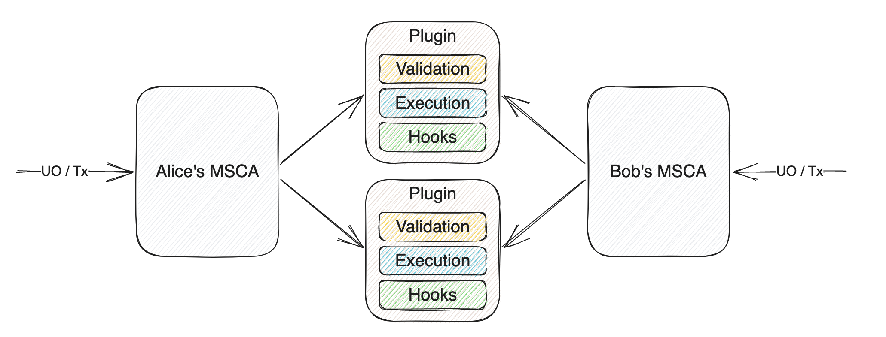
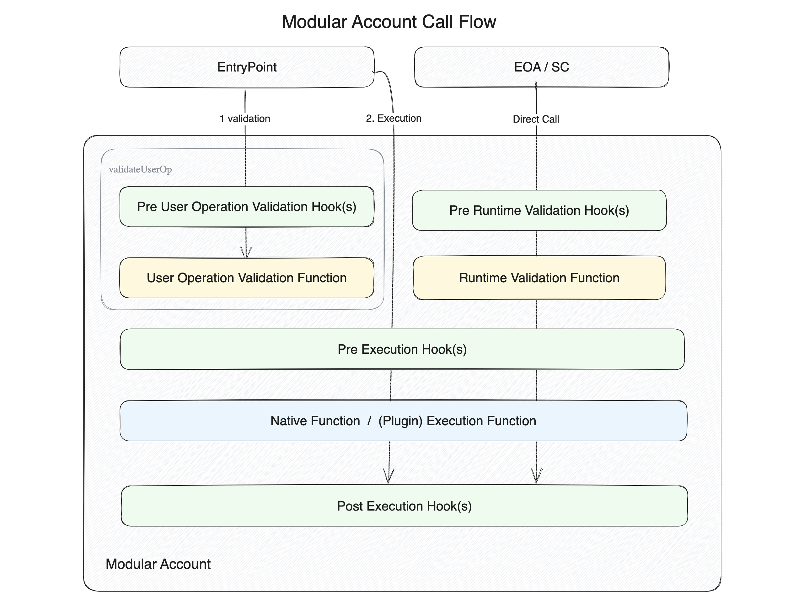

# ERC-6900: Modular Smart Contract Accounts and Plugins

**Автор:** [Роман Ярлыков](https://github.com/rlkvrv) 🧐

ERC-6900 - это стандарт Ethereum, определяющий модульные абстрактные аккаунты (Modular Smart Contract Account - MSCA). Это означает, что он расширяет функциональность [ERC-4337](https://eips.ethereum.org/EIPS/eip-4337) (Account Abstraction), давая возможность вынести всю дополнительную логику и проверки во внешние модули.

Ключевые аспекты ERC-6900:

- **Модульность**: Позволяет разделить логику аккаунта на отдельные плагины.
- **Расширяемость**: Упрощает добавление новых функций к аккаунтам без изменения основного кода.
- **Стандартизация**: Должен обеспечивать совместимость между различными реализациями аккаунтов и плагинов.
- **Интеграция с ERC-4337**: Совместим с инфраструктурой Account Abstraction.

*Важно!* Оба стандарта (ERC-4337 и ERC-6900) еще в драфте, могут вноситься изменения. В статье рассматривается AA (ERC-4337) версии v0.6.0 и ERC-6900 (MSCA) версии v0.7.0 (на базе AA v.0.6.0). Например уже есть новая версия AA в которой отличается работа с `validateUserOp`, но MSCA это пока не поддерживают.

Более того, ERC-6900 очень тесно связан с Alchemy, поэтому самые свежие апдейты по этому стандарту скорее всего будут в их репозиториях, они же разрабатывают архитектуру для работы с такими аккаунтами. По сути это один из главных минусов стандарта - он разрабатывается с оглядкой на нужды конкретного протокола, а не сообщества.

## MSCA

Стандарт вдохновлен [ERC-2535: Diamonds, Multi-Facet Proxy](https://eips.ethereum.org/EIPS/eip-2535), для маршрутизации логики выполнения на основе селекторов функций, но напрямую этот стандарт не используется. Все селекторы хранит MSCA - фактически это расширенная версия аккаунта ERC-4337, которая содержит логику установки/удаления плагинов а также знает по какому селектору куда перенаправить вызов.

На MSCA может осуществляться два вида вызовов функций:
- **User operation** - вызов через EntryPoint. Функции обрабатывают вызовы `validateUserOp` и проверяют действительность пользовательской операции ERC-4337.
- **Runtime** - вызов "напрямую" на смарт-контракте аккаунта. Сюда входят служебные функции аккаунта (например `execute`, `executeBatch`, `upgradeToAndCall`, `installPlugin` и т.д.).

Для того чтобы охватить все возможные вызовы (включая прямые), у плагина может быть три различных вида callback-функций:
- **Validation** - для проверки `userOp` или прямых вызовов. Схемы валидации определяют обстоятельства, при которых учетная запись смарт-контракта будет одобрять действия, выполняемые от ее имени.
- **Execution** - могут содержать логику выполнения какой-либо бизнес-логики или проверки во время выполнения.
- **Hooks** - хуки различаются в зависимости от того места где они вызываются. Позволяют осуществлять контроль до и после выполнения.
  - **Pre User Operation Validation Hook** - хук запускается перед функцией `userOpValidationFunction`.
  - **Pre Runtime Validation Hook** - хук запускается перед `runtimeValidationFunction`.
  - **Pre Execution Hook** - запускается до выполнения какой-то бизнес-логики, может передать данные функции Post Execution Hook.
  - **Post Execution Hook** - запускается после выполнения бизнес-логики и может обработать данные Pre Execution Hook.

   
*Источник: Стандарт ERC-6900*

Идея в том, чтобы разделить вызовы на два вида в силу их различий: вызовы от EntryPoint и вызовы от EOA и смарт-контрактов. Это происходит на уровне валидации вызова, а на уровне исполнения можно использовать "общие" callback-функции. Таким образом получается следующая схема:

   
*Источник: Стандарт ERC-6900*

Есть также вызовы `executeFromPlugin` и `executeFromPluginExternal` которые обрабатываются иначе, но для начала лучше разобраться с первыми двумя видами вызовов и попробовать их на деле, только после этого можно пробовать вызывать один плагин из другого.

### Как сделать MSCA из AA

Чтобы из "классического" Account Abstraction кошелька получился MSCA понадобятся 4 обязательных интерфейса:

- [IAccount.sol](https://github.com/eth-infinitism/account-abstraction/blob/releases/v0.6/contracts/interfaces/IAccount.sol) - базовый интерфейс для всех AA (ERC-4337), который описывает функцию `validateUserOp`, именно эта функция вызывается смарт-контрактом *EntryPoint*. В классическом варианте здесь должна быть проверка подписи и другая логика валидации, MSCA помещает сюда функцию `userOpValidationFunction` и хук `preUserOpValidationHook`, тем самым делегируя эти проверки установленным плагинам.
    ```solidity
    function validateUserOp(
        UserOperation calldata userOp, 
        bytes32 userOpHash, 
        uint256 missingAccountFunds
    ) external returns (uint256 validationData);
    ```
- [IPluginManager.sol](https://github.com/erc6900/reference-implementation/blob/v0.7.x/src/interfaces/IPluginManager.sol) - отвечает за установку и удаление плагинов, делает это через две соответствующие функции:
    ```solidity
    function installPlugin(
        address plugin,
        bytes32 manifestHash,
        bytes calldata pluginInstallData,
        FunctionReference[] calldata dependencies
    ) external;

    function uninstallPlugin(
        address plugin,
        bytes calldata config, 
        bytes calldata pluginUninstallData
    ) external;
    ```
- [IStandardExecutor.sol](https://github.com/erc6900/reference-implementation/blob/v0.7.x/src/interfaces/IStandardExecutor.sol) - содержит стандартные функции выполнения вызовов AA, через них запрещено вызывать плагины напрямую.
    ```solidity
    function execute(
        address target, 
        uint256 value, 
        bytes calldata data
    ) external payable returns (bytes memory);

    function executeBatch(
        Call[] calldata calls // Call { target; value; data }
    ) external payable returns (bytes[] memory);
    ```
- [IPluginExecutor.sol](https://github.com/erc6900/reference-implementation/blob/v0.7.x/src/interfaces/IPluginExecutor.sol) - с помощью этого интерфейса плагин А может вызвать плагин Б, но вызов будет произведен через MSCA. Функция `executeFromPluginExternal` нужна чтобы плагин мог вызвать внешний смарт-контракт через MSCA.
    ```solidity
    function executeFromPlugin(
        bytes calldata data
    ) external payable returns (bytes memory);

    function executeFromPluginExternal(
        address target, 
        uint256 value, 
        bytes calldata data
    ) external payable returns (bytes memory);
    ```

Помимо обязательных интерфейсов есть также [IAccountLoupe.sol](https://github.com/erc6900/reference-implementation/blob/v0.7.x/src/interfaces/IAccountLoupe.sol) который предоставляет информацию об установленных плагинах ончейн. Например он содержит функции `getInstalledPlugins`, `getPreValidationHooks` и другие.

## Плагины

Плагин - это смарт-контракт синглтон, он разворачивается в единственном экземпляре для всех аккаунтов которые его установят, также он будет хранить настройки каждого аккаунта. Смарт-контракт плагина не должен быть обновляемым, это сделано в целях безопасности, для обновления понадобиться удалить старую версию плагина и установить новую.

Плагин должен наследовать [IPlugin.sol](https://github.com/erc6900/reference-implementation/blob/v0.7.x/src/interfaces/IPlugin.sol) и реализовывать как минимум функции для установки и удаления плагина:

```solidity
function onInstall(bytes calldata data) external;

function onUninstall(bytes calldata data) external;
```

Также он должен содержать манифест и метаданные.

```solidity
function pluginManifest() external pure returns (PluginManifest memory);

function pluginMetadata() external pure returns (PluginMetadata memory);
```

Манифест необходим для установки плагина. Он отвечает за описание функций выполнения, функций проверки и хуков, которые будут настроены на MSCA во время установки плагина. Также манифест содержит требования к зависимостям (в качестве зависимости выступает другой плагин) и разрешения на работу с теми или иными функциями.

На манифесте стоит остановиться подробнее.

### Манифест плагина

Манифест - это спецификация плагина, в нем описано как MSCA следует работать с плагином и при вызове каких селекторов какие функции плагина необходимо вызвать, а также как работать с зависимостями (другими плагинами).

```solidity
struct PluginManifest {
    // Список интерфейсов ERC-165 который следует добавить к аккаунту MSCA.
    // Не должен включать интерфейс IPlugin
    bytes4[] interfaceIds;
    // Если какие-то функции плагина зависят от валидации через другие плагины,
    // то их интерфейсы должны быть добавлены в этот массив
    bytes4[] dependencyInterfaceIds;
    // Это функции плагина, которые устанавливаются на MSCA
    // и расширяют его функционал
    bytes4[] executionFunctions;
    // Функции, уже установленные на MSCA, к которым есть доступ у этого плагина
    bytes4[] permittedExecutionSelectors;
    // Флаг определяющий может ли плагин вызывать внешние смарт-контракты
    bool permitAnyExternalAddress;
    // Флаг определяющий может ли плагин тратить нативные токены сети
    bool canSpendNativeToken;
    // Спецификация функций
    ManifestExternalCallPermission[] permittedExternalCalls;
    ManifestAssociatedFunction[] userOpValidationFunctions;
    ManifestAssociatedFunction[] runtimeValidationFunctions;
    ManifestAssociatedFunction[] preUserOpValidationHooks;
    ManifestAssociatedFunction[] preRuntimeValidationHooks;
    ManifestExecutionHook[] executionHooks;
}
```

**interfaceIds**

Например ваш аккаунт не поддерживает работу с ERC721, поэтому не может принимать NFT. Вы добавляете плагин с функцией `onERC721Received`, а в `interfaceIds` добавляете интерфейс `IERC721Receiver`. Теперь `supportInterface` аккаунта MSCA будет возвращать `true` при проверке этого интерфейса.

**dependencyInterfaceIds** 

Необходимо указывать, когда целевой плагин зависит от валидации на другом плагине.
Например возьмем [плагин](./contracts/src/TokenWhitelistPlugin.sol) который я написал для тестов. Его основная задача проверять есть ли токен ERC20 в вайтлисте при вызовах функций `transfer` и `transferFrom`. У него есть служебная функция `updateTokens`, которая добавляет и удаляет токены из вайтлиста. Логично, что доступ к такой функции должен быть ограничен, но в данном случае плагин могу использовать тысячи аккаунтов и отдавать управление вайтлистом какому-то одному кошельку-админу нецелесообразно. В связи с этим каждый аккаунт MSCA сам управляет списком токенов с которыми он может работать. Чтобы доступ к изменению вайтлиста был только у MSCA понадобиться добавить зависимость в виде плагина который будет отвечать за проверку доступа. В моем случае это [MultiOwnerPlugin](https://github.com/alchemyplatform/modular-account/blob/v1.0.1/src/plugins/owner/MultiOwnerPlugin.sol). Настройка этой проверки будет выполнена далее.

```solidity
function pluginManifest() external pure override returns (PluginManifest memory) {
    PluginManifest memory manifest;
    // dependency
    manifest.dependencyInterfaceIds = new bytes4[](1);
    manifest.dependencyInterfaceIds[0] = type(IMultiOwnerPlugin).interfaceId;

    // ...
}
```

**executionFunctions**

Это функции которые устанавливаются на MSCA при установке плагина, тем самым расширяя его. В моем случае это функции `updateTokens`, `isAllowedToken` и `getTokens`. Расширяют, означает, что они как и служебные функции аккаунта будут вызываться на аккаунте "напрямую", например так - `account.updateTokens()`. Т.к. функции плагина будут вызваны через `fallback` фукнцию аккаунта, то если мы не добавим их селекторы в `executionFunctions`, такой вызов будет аккаунтом отклонен.

**permittedExecutionSelectors**

В данный массив добавляются селекторы функций, которые могут быть вызваны плагином на MSCA, то есть через функцию `executeFromPlugin`.

**permitAnyExternalAddress**

Флаг, который разрешает или запрещает вызовы через `executeFromPluginExternal`.

**canSpendNativeToken**

Как следует из названия разрешает/запрещает использовать нативные токены.

#### Спецификация функций с которыми работает плагин


// TODO
Причем позиция интерфейса плагина-зависимости в массиве должна соответствовать `dependencyIndex` в `ManifestFunction`.


## Ссылки

- [EIP: ERC-6900: Modular Smart Contract Accounts and Plugins](https://eips.ethereum.org/EIPS/eip-6900)
- [EIP: ERC-4337](https://eips.ethereum.org/EIPS/eip-4337)
- [Article: How to write an ERC-6900 Plugin](https://dev.collab.land/blog/how-to-write-an-erc-6900-plugin/)
- [Github: erc6900](https://github.com/erc6900)
- [Github: modular-account (Alchemy)](https://github.com/alchemyplatform/modular-account)
- [Resources: Build a Plugin](https://www.erc6900.io/build-a-plugin)

