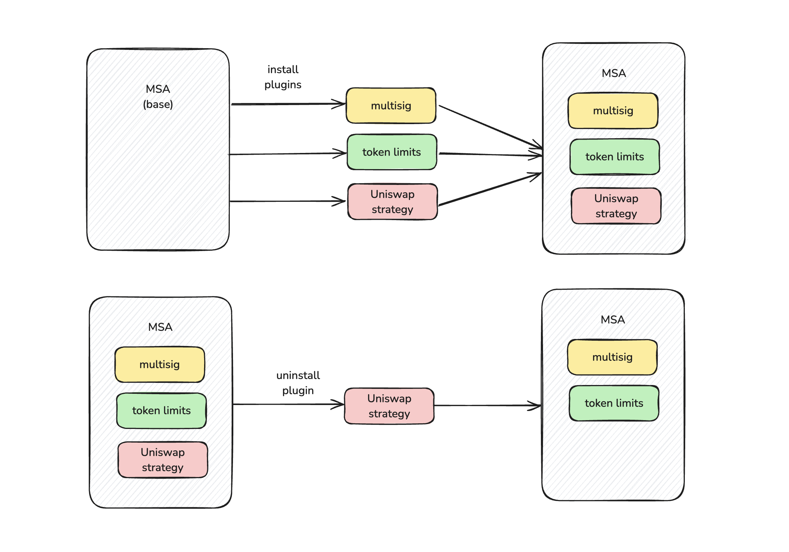
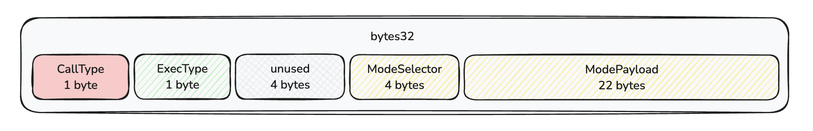
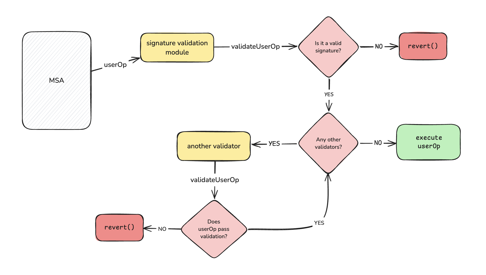
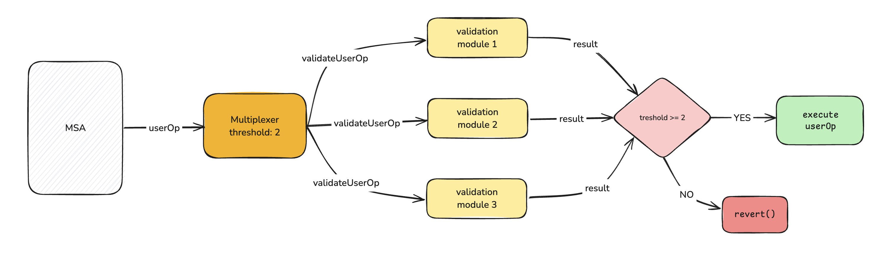
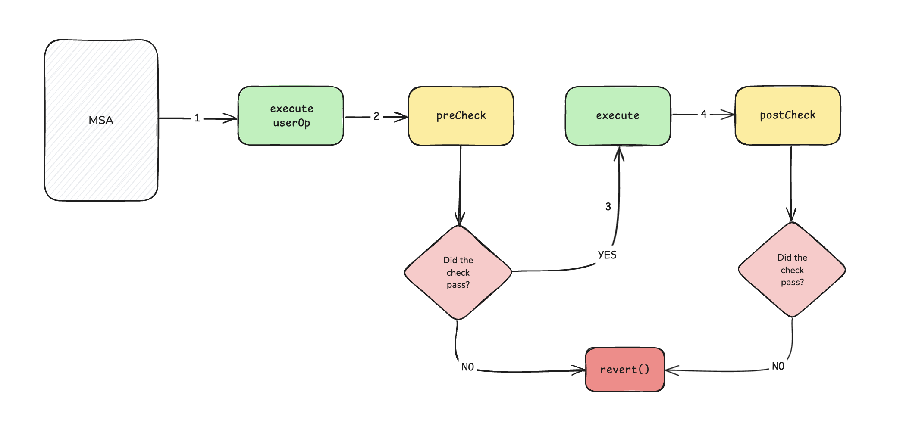
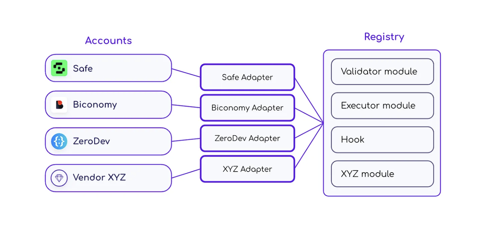

# ERC-7579: Minimal Modular Smart Accounts

**Автор:** [Роман Ярлыков](https://github.com/rlkvrv) 🧐

ERC-7579 — это стандарт Ethereum, описывающий модульные абстрактные аккаунты (Modular Smart Contract Account — MSA). Он расширяет функциональность [ERC-4337](https://eips.ethereum.org/EIPS/eip-4337) (Account Abstraction), позволяя выносить дополнительную логику и проверки в отдельные внешние модули.

## Предпосылки

С появлением ERC-4337 многие разработчики воодушевились новыми возможностями и пошли делать смарт-аккаунты с самым разнообразным функционалом. Лидерами этой гонки стали крупные компании, такие как [Alchemy](https://www.alchemy.com/account-kit), [Safe](https://safe.global/), [Biconomy](https://www.biconomy.io/smart-accounts), [ZeroDev](https://zerodev.app/), [OKX](https://www.okx.com/web3/hot/aawallet) и другие. Получались громоздкие монолиты по принципу "кто на что горазд", которые тяжело поддерживать, проверять и обновлять. Более того, только разработчики могли создавать различные комбинации фич в таких аккаунтах, что ограничивало их гибкость. Это подтолкнуло к идее выносить логику во внешние модули, что снова привело к появлению множества решений.

Сообщество стремилось стандартизировать процесс создания и использования модулей, чтобы любой мог разрабатывать их и применять в разных аккаунтах. Такой подход предполагает базовую реализацию смарт-аккаунта, который можно кастомизировать с помощью модулей. При наличии удобного интерфейса пользователь сам сможет управлять настройками через UI, устанавливая модули подобно приложениям на смартфоне.

Компания Alchemy предложила стандарт [ERC-6900](https://eips.ethereum.org/EIPS/eip-6900), основанный на паттерне [Diamond](https://eips.ethereum.org/EIPS/eip-2535). Этот подход предусматривал вызов соответствующих модулей (плагинов) в зависимости от селектора функции для выполнения проверок.

Стандарт оказался спорным. Во-первых, он был ориентирован на смарт-аккаунты от Alchemy. Во-вторых, его строгие требования диктовали правила реализации как для аккаунтов, так и для модулей. В-третьих, при попытках внедрения выявились архитектурные ограничения, накладывающие дополнительные сложности.

Сообщество быстро [разочаровалось](https://docs.zerodev.app/blog/why-7579-over-6900) в ERC-6900, к тому же Alchemy не слишком шли на встречу в его изменениях, поэтому все остальные объединились и выкатили стандарт [ERC-7579: Minimal Modular Smart Accounts](https://eips.ethereum.org/EIPS/eip-7579). Новый стандарт учел интересы всех участников, предложив минимальные интерфейсы для совместимости модулей с разными аккаунтами. Это обеспечило универсальность и свободу выбора архитектуры кошельков, в общем то, чего сообщество добивалось изначально.

В этой статье я иногда буду ссылаться на ERC-6900, если вы не знакомы с этим стандартом - это не станет проблемой, но для полной картины было бы хорошо ознакомиться и с ним. Обзорная статья на него также есть в wiki.

## MSA

Модульные аккаунты — это смарт-аккаунты, которые пользователь может легко и безопасно расширять, в отличие от "статичных" аккаунтов, изменяемых только разработчиком и требующих повторного развертывания. Такой подход позволяет пользователю динамически добавлять, удалять или изменять функциональность аккаунта.

  
*Добавление и удаление модулей в MSA*

Главная идея ERC-7579 — предоставить минимальные интерфейсы и правила для реализации модульных аккаунтов. Это обеспечивает разработчикам большую свободу в выборе архитектуры, сохраняя при этом совместимость модулей между различными аккаунтами.

Для соответствия стандарту аккаунт должен реализовать три интерфейса: **IExecution**, **IAccountConfig** и **IModuleConfig**. В примере реализации эти интерфейсы объединены в один — [IERC7579Account](https://github.com/erc7579/erc7579-implementation/blob/main/src/interfaces/IERC7579Account.sol).

*Примечание:* По остальному фукнционалу можно также ориентироваться на [Reference Implementation](https://github.com/erc7579/erc7579-implementation), но нужно понимать, что это не эталонная реализация, ее просто не существует.

Кратко рассмотрим основные функции.

### Функции установки и контроля модулей

Для установки модуля необходимы как минимум его тип и адрес. Модуль в данной архитектуре — это отдельный внешний смарт-контракт, который должен быть развернут заранее. Один модуль может использоваться множеством смарт-аккаунтов, а его основная задача — предоставить необходимые callback-функции для аккаунта.

Чтобы смарт-аккаунт мог устанавливать и удалять модули, используются следующие функции:

```solidity
function installModule(
    uint256 moduleTypeId,
    address module,
    bytes calldata initData
) external;

function uninstallModule(
    uint256 moduleTypeId,
    address module,
    bytes calldata deInitData
) external;
```

Тип модуля (`moduleTypeId`) мы рассмотрим чуть позже в соответствующем разделе.

*Примечание:* При установке или удалении модуля можно передать произвольные данные для его конфигурации.

Для контроля установленных модулей предусмотрены следующие `view` функции:

```solidity
function isModuleInstalled(
    uint256 moduleTypeId,
    address module,
    bytes calldata additionalContext
) external view returns (bool);

function accountId() external view returns (string memory accountImplementationId);

function supportsExecutionMode(bytes32 encodedMode) external view returns (bool);

function supportsModule(uint256 moduleTypeId) external view returns (bool);
```

Особого внимания заслуживают функции `accountId` и `supportsExecutionMode`. 

- **`accountId`** возвращает уникальный идентификатор аккаунта в формате `vendorname.accountname.semver`. Это помогает идентифицировать смарт-аккаунты на фронтенде.
  
- **`supportsExecutionMode`** сообщает, поддерживает ли аккаунт определенный режим выполнения (`mode`). Тут мы подходим к одному из самых важных аспектов смарт-аккаунта, поскольку он определяет его поведение при выполнении различной логики.

### Функции отвечающие за выполнение логики

Предлагается реализовать всего две основные функции (привет ERC-6900👋): `execute` и `executeFromExecutor`.

```solidity
interface IExecution {
    function execute(
        bytes32 mode,
        bytes calldata executionCalldata
    ) external;

    function executeFromExecutor(
        bytes32 mode,
        bytes calldata executionCalldata
    ) external returns (bytes[] memory returnData);
}
```

- **`execute`** — универсальная функция для вызовов на MSA.  
- **`executeFromExecutor`** — специализированная функция, предназначенная для определенного типа модулей, об этом чуть позже.

#### Что такое `mode`?

`mode` — это значение размером 32 байта, структура которого включает следующие компоненты:

- **callType** (1 байт): определяет способ вызова:  
  - `0x00` — одиночный вызов;  
  - `0x01` — пакетный вызов (batch);  
  - `0xfe` — `staticcall`;  
  - `0xff` — `delegatecall`.

- **execType** (1 байт): описывает, как обрабатывать ошибки:  
  - `0x00` — прерывание выполнения через `revert()`;  
  - `0x01` — обработка ошибок без использования `revert()`.

- **unused** (4 байта): зарезервировано для будущих улучшений.  
- **modeSelector** (4 байта): дополнительный селектор для реализации нестандартного поведения.  
- **modePayload** (22 байта): полезная нагрузка для передачи дополнительных данных.

  
*Структура Execution Mode и закодированных данных*

Вместо создания отдельных функций для каждой комбинации типов выполнения, разработчики стандарта закодировали параметры выполнения в одно значение `bytes32`. Это делает подход гибким и расширяемым, упрощая сопровождение и аудит кода. Простые реализации аккаунтов могут учитывать только значимый байт `callType`, игнорируя остальное.

Параметр `callType` определяет, как параметр `executionCalldata` функции `execute` должен быть декодирован. Это может быть одиночный вызов, пакетный вызов или delegatecall. `callType` может использоваться модулем валидации для определения, как декодировать `userOp.callData[36:]`.

Поведение по умолчанию (execType = `0x00`) — прерывать выполнение при одной неудачной операции. Если одна операция в пакете завершается неудачей, весь пакет откатывается.

ModeSelector - это "опциональный" селектор mode, может использоваться поставщиками аккаунтов для реализации нестандартного поведения. ModeSelector рассчитывается как `bytes4(keccak256("vendorname.featurename"))` для предотвращения конфликтов между различными поставщиками, позволяя внедрение новых функций без координации между аккаунтами, реализующими ERC-7579.

ModePayload - полезная нагрузка для mode, используется для передачи дополнительных данных при выполнении смарт-аккаунта; она может интерпретироваться в зависимости от ModeSelector. Например, здесь могут лежать адрес и пара доп. флагов по одному байту.

## Модули

Как уже упоминалось, модули — это самостоятельные смарт-контракты, которые выносят основную логику смарт-аккаунта за его пределы. Это позволяет создавать аккаунты как конструкторы, которые можно легко и быстро кастомизировать.

Модули делятся на четыре основные категории:
- **Validation** (type id: 1)  
- **Execution** (type id: 2)  
- **Fallback** (type id: 3)  
- **Hooks** (type id: 4)

Стандарт **допускает** создание пользовательских типов, но вышеуказанные — базовые. В будущем могут добавить и другие, при этом новые типы можно добавлять даже без изменения стандарта. Аккаунту не обязательно поддерживать все четыре типа, а один модуль может совмещать в себе несколько, хотя я не нашел подобных примеров.

*Важно!* Комбинирование нескольких типов может быть рискованным, это связано с тем, что в таком варианте будет смешано состояние двух разных модулей, в теории они могут по-разному устанавливаться/удаляться и изменять свои настройки.

Для создания модуля используется интерфейс `IModule`, который включает три функции:

```solidity
interface IModule {
    function onInstall(bytes calldata data) external;
    function onUninstall(bytes calldata data) external;
    function isModuleType(uint256 moduleTypeId) external view returns (bool);
}
```

- Параметр `data` передает данные, необходимые для установки или удаления модуля.  
- Функция `isModuleType` проверяет принадлежность модуля к определенному типу.

Кроме стандартных функций, модули часто включают дополнительные для отображения метаданных:

```solidity
function name() external pure returns (string memory);
function version() external pure returns (string memory);
```

Этого минимального набора функций достаточно для реализации модулей типа **Execution** и **Fallback**.

### Validation

Модули **Validation** отвечают за проверку операций `userOp`. В потоке выполнения транзакций такие модули всегда должны быть первыми. Это ключевой компонент, без которого аккаунт не сможет функционировать, если у него отсутствует встроенная возможность обработки `userOp` и подписей, соответствующая стандарту [ERC-1271](https://eips.ethereum.org/EIPS/eip-1271).

  
*Пример работы модулей-валидаторов*

В работе с валидаторами есть одна особенность. Стандарт ERC-7579 не регламентирует способ выбора валидатора во время проверки `userOp`. Большинство современных реализаций модульных смарт-аккаунтов используют подход, при котором адрес валидатора передается в полях `userOp.nonce` или `userOp.signature`. При этом стандарт требует сериализовать передаваемые данные перед вызовом валидатора.

#### Интерфейс валидатора

Для создания валидатора используется интерфейс `IValidator`, который наследуется от `IModule`.

```solidity
interface IValidator is IModule {
    function validateUserOp(
        PackedUserOperation calldata userOp,
        bytes32 userOpHash
    ) external returns (uint256);

    function isValidSignatureWithSender(
        address sender,
        bytes32 hash,
        bytes calldata signature
    ) external view returns (bytes4);
}
```

- **`validateUserOp`** — отвечает за стандартный процесс проверки `userOp` в рамках ERC-4337.  
- **`isValidSignatureWithSender`** — необходима для поддержки проверки подписей в соответствии с [ERC-1271](https://eips.ethereum.org/EIPS/eip-1271).  

#### Мультиплексоры

Поскольку данные о валидаторе часто передаются в поле `userOp`, обычно для упрощения работы указывают лишь один адрес валидатора. Но что если аккаунту требуется несколько валидаторов (например, для мультисигов, социального восстановления или сессионных ключей)?

В таких случаях используется один главный валидатор как точка входа, через который добавляются остальные валидаторы. Например, модуль [MultiFactor](https://github.com/rhinestonewtf/core-modules/blob/main/src/MultiFactor/MultiFactor.sol) позволяет подключать субмодули-валидаторы, предоставляя многофакторную аутентификацию. Если установлены 4 модуля валидатора, а порог (threshold) подтверждений равен 2, то для успешной проверки достаточно пройти валидацию в двух модулях.

Подобные валидаторы (по типу MultiFactor) называются мултиплексоры.

> Мультиплексор (электроника) - это устройство, которое выбирает между несколькими аналоговыми или цифровыми входными сигналами и направляет выбранный входной сигнал на одну выходную линию.

  
*Пример работы мультиплексора*

Мультиплексоры используются не только с валидаторами, но об этом позже.

### Execution

Модули исполнители — это внешние стратегии для выполнения определенных действий через смарт-аккаунт на сторонних смарт-контрактах. Для таких модулей используется функция аккаунта `executeFromExecutor`.

Процесс выполнения выглядит так:  
1. Смарт-контракт `EntryPoint` вызывает аккаунт через стандартную функцию `execute`.  
2. Аккаунт вызывает смарт-контракт Executor, который выполняет необходимые проверки или дополнительные действия.  
3. Затем Executor вызывает функцию аккаунта `executeFromExecutor`, которая, в свою очередь, взаимодействует с внешним смарт-контрактом.

  
*Пример работы модуля-исполнителя*

Живой пример: модуль [ScheduledOrders](https://github.com/rhinestonewtf/core-modules/blob/main/src/ScheduledOrders/ScheduledOrders.sol), который выполняет отложенные ордера на Uniswap. Исполнители обеспечивают безопасное выполнение вызовов внешних смарт-контрактов от имени смарт-аккаунта, включая предварительную подготовку. Еще один пример - выполнение быстрых займов с использованием модуля [FlashloanCallback](https://github.com/rhinestonewtf/core-modules/blob/main/src/Flashloan/FlashloanCallback.sol).  

Для создания модуля исполнителя достаточно реализации интерфейса `IModule`.

### Fallback Handlers

Стандарт предоставляет возможность расширить функционал смарт-аккаунта без его обновления с помощью fallback handlers (резервных обработчиков). Эти модули позволяют добавлять новые селекторы функций и их обработку через внешние модули.
Лучше всего работу этих функций описывает сам стандарт, мне здесь добавить особо нечего.

Если у смарт-аккаунта установлен обработчик fallback, он:  
- ОБЯЗАН использовать `call` или `staticcall` для вызова обработчика fallback.  
- ОБЯЗАН следовать стандарту [ERC-2771](https://eips.ethereum.org/EIPS/eip-2771) для добавления оригинального `msg.sender` в `calldata`, отправляемого обработчику fallback.  
- ОБЯЗАН маршрутизировать вызовы к обработчику fallback на основе селектора функции в `calldata`.  
- МОЖЕТ реализовывать контроль доступа, который ДОЛЖЕН быть выполнен через хуки.

Если аккаунт добавляет функции через fallback, это рассматривается так же, как если бы эти функции были реализованы нативно. Например, поддержка [ERC-165](https://eips.ethereum.org/EIPS/eip-165) может быть реализована через fallback.  

- РЕКОМЕНДУЕТСЯ использовать fallback для функций с модификатором `view`, если это способствует расширяемости.  
- НЕ РЕКОМЕНДУЕТСЯ реализовывать основную логику аккаунта через fallback.

Пример реализации fallback можно посмотреть у [смарт-аккаунта от Kernel](https://github.com/zerodevapp/kernel/blob/737db3123165d6009c9261dc98e149a3fdd82f97/src/Kernel.sol#L178C1-L178C34).

Для создания модуля fallback достаточно интерфейса `IModule`.

### Hooks

Хуки необходимы для обработки потока выполнения транзакции. В отличие от модулей валидаторов, которые активируются еще на этапе валидации `userOp`, они включаются непосредственно перед выполнением функции `execute`.

  
*Пример работы хука*

Чтобы написать хук, понадобится интерфейс IHook в добавок к интерфейсу IModule. Этот интерфейс реализует две основные функции для работы с модулями: `preCheck` и `postCheck`:

```solidity
interface IHook is IModule {
   function preCheck(
       address msgSender,
       uint256 value,
       bytes calldata msgData
   ) external returns (bytes memory hookData);

   function postCheck(bytes calldata hookData) external;
}
```

Когда я разбирался с ERC-6900, я написал [хук](https://github.com/fullstack-development/blockchain-wiki/blob/60678946a89f9c61a7368aa08e55c2a278100616/EIPs/erc-7579/contracts/src/TokenWhitelist.sol) для проверки трансферов ERC20 токенов, по сути это был вайтлист. В случае с ERC-7579 я решил адаптировать этот модуль под его правила.
В целом логика получилась похожая, также есть две функции для хука и также необходимы функции для установки и деинсталляции модуля, они идентичны ERC-6900:
```solidity
function onInstall(bytes calldata data) external {
    // логика установки плагина на MSA
}

function onUninstall(bytes calldata data) external {
    // логика удаления плагина с MSA
}
```
Как процесс установки выглядит "снаружи", можно увидеть в [тестах](./contracts/test/unit/TokenWhitelist.t.sol):
```solidity
    address[] memory tokens = new address[](1);
    tokens[0] = address(token1);
    bytes memory twPluginInstallData = abi.encode(tokens);

    // Вызов должен быть через EntryPoint и userOp
    // потому что плагин работает с msg.sender
    instance.installModule({
        moduleTypeId: MODULE_TYPE_HOOK,
        module: address(tokenWhitelistModule),
        data: twPluginInstallData
    });
```

Добавилась функция `isModuleType`, в данном случае модуль одного типа - `TYPE_HOOK`:

```solidity
function isModuleType(uint256 moduleTypeId) external view returns (bool) {
    return moduleTypeId == TYPE_HOOK;
}
```

Можно также добавить функцию `isInitialized`, но стандарт этого не требует, хотя судя по примерам модулей - это хорошая практика.
Что касается кастомной логики модуля, то в данном случае понадобится только одна функция `updateTokens`:

```solidity
function updateTokens(address[] memory tokensToAdd, address[] memory tokensToRemove) external {
    // логика обновления вайтлиста разрешенных токенов
}
```

Хотя даже без этой функции плагин будет работать, только вайтлист можно будет задавать один раз во время установки.

Если у вас был опыт работы с модулями ERC-6900, то можно заметить, насколько проще выглядит настройка самого модуля - не нужен никакой манифест, не нужно думать, как этот плагин будет взаимодействовать с другими плагинами и какие селекторы куда нужно добавить.

Хотя есть и свои особенности. Как и в случае с валидаторами, чаще всего MSA дают возможность установить только один плагин (есть исключения, например Kernel). Это означает, что для установки нескольких плагинов также может понадобиться мультиплексор. Я написал [интеграционные тесты](./contracts/test/integration/TokenWhitelist.t.sol) с модулем `HookMultiPlexer`, там можно увидеть как это работает.

*Важно!* Когда между аккаунтом и модулем-хуком появляется мультиплексор, это означает, что вызов функции хука `preCheck` будет производиться уже не с аккаунта, а с мультиплексора. Для того чтобы модули работали корректно, модуль должен иметь возможность добавлять мультиплексор в качестве `TrustedForwarder`. Обязательно протестируйте поддержку такой возможности.

## Разработка и тестирование

Процессу разработки и тестирования подобных плагинов стоит уделить отдельное внимание. Для тестирования вам понадобятся соответствующие инструменты, которые смогут эмулировать работу инфраструктуры, необходимой для абстрактных аккаунтов. Также понадобятся доп. инструменты для внедрения MSA в свой продукт.

На данный момент лидером по разработке таких инструментов, как и в целом по продвижению ERC-7579, является компания [Rhinestone](https://github.com/rhinestonewtf). Они сделали [ModuleSDK](https://github.com/rhinestonewtf/module-sdk) и [ModuleKit](https://github.com/rhinestonewtf/module-sdk). Последний очень помог в тестировании плагина.

*Важно!* Для запуска проекта с [TokenWhitelist](./contracts/src/TokenWhitelist.sol) понадобится pnpm, именно этот пакетный менеджер используется в ModuleKit.

Еще одним важным моментом является то, что реализации MSA могут сильно отличаться. ModuleKit позволяет протестировать свой модуль сразу с несколькими реализациями, он поддерживает MSA от Safe, Kernel, Nexus, а также есть кастомная реализация, которая охватывает все возможные варианты модулей. Скорее всего в будущем может появиться поддержка и других MSA. При этом ModuleKit довольно гибкий, в [файле с тестами](./contracts/test/unit/TokenWhitelist.t.sol) вы можете посмотреть, что было достаточно просто использовать базовые тесты для переиспользования с другими MSA. Работать с userOp также достаточно просто.

## Реестр модулей

Основная идея стандарта для модульных аккаунтов подразумевает возможность любым разработчикам создавать модули. Но для того чтобы аккаунты могли использовать такие модули, они должны быть уверены в их безопасности. Поэтому был предложен стандарт - [ERC-7484: Registry Extension for ERC-7579](https://eips.ethereum.org/EIPS/eip-7484).

Целью ERC-7484 является стандартизация того, как смарт-аккаунты могут получать данные о безопасности своих модулей с помощью реестра аттестации. Более конкретно, ERC стремится стандартизировать точный способ взаимодействия смарт-аккаунтов с реестрами, а также необходимую функциональность и интерфейсы для реестров, чтобы обеспечить максимальную функциональную совместимость смарт-аккаунтов.

Для MSA, которые не внедряют поддержку реестров нативно, могут быть разработаны адаптеры.


*Источник: статья Introducing: ERC-7484*

По стандарту реестр модулей должен быть синглтоном для того, чтобы всем аккаунтам было проще с ним работать. Это не обязательное требование, по задумке разработчики могут использовать свой реестр, хотя это создаст проблемы совместимости с другими модулями, которые аттестованы в общепринятом реестре.

Чтобы аккаунт мог работать с реестром, потребуется добавить к нему адаптер либо установить модуль registry hook.

К примеру проверка может выглядеть так:

```solidity
    IERC7484(registry[account]).checkForAccount({
        smartAccount: account,
        module: msgSender,
        moduleType: MODULE_TYPE_EXECUTOR
    });
```

Таким образом во время важных действий с модулем (установка, удаление, изменение параметров, а иногда и просто валидация вызова) MSA должен проверять модуль через реестр.

*Важно!* Модуль может быть не только добавлен в реестр, но также и удален из него в случае обнаружения уязвимости, что сразу обезопасит все MSA, которые его установили. С другой стороны, пока модуль с уязвимостью не удален, все MSA также подвержены одной уязвимости.

### Как зарегистрировать модуль?

На данный момент в [документации](https://docs.rhinestone.wtf/module-registry) указаны две аудиторские фирмы ([Ackee Blockchain Security](https://ackee.xyz/) и [Spearbit](https://spearbit.com/)), которые проверяют модули на безопасность и выполняют их аттестацию в едином реестре.

В тестнете [можно](https://docs.rhinestone.wtf/module-registry/usage/mock-attestation) использовать моковый смарт-контракт, который позволит зарегистрировать модуль и выдать аттестацию.

Важно заметить, что аттестация может быть как выдана, так и отозвана в дальнейшем. Это и сильная и слабая сторона данного предложения. Сильная, потому что в случае взлома через отзыв аттестации можно обезопасить сразу все аккаунты. А слабая, потому что вряд ли это произойдет очень быстро и за это время большое количество аккаунтов могут пострадать от действий злоумышленников.

Rhinestone совместно с Biconomy также анонсировали [магазин модулей](https://www.biconomy.io/post/biconomy-and-rhinestone-team-up-to-launch-the-first-module-store-for-account-abstraction) для АА, поэтому я думаю они и дальше будут развивать это направление вместе с реестром и всем, что связано с разработкой модулей совместимых с ERC-7579.

## Вывод

Как говорилось выше, на данный момент существует два стандарта для работы с модульными аккаунтами: ERC-6900 и ERC-7579. Последний является переработанной версией первого с учетом всех, ну или как минимум большинства архитектурных ошибок. Хотя никто не исключает, что оба стандарта разрабатывали крупные компании и в любом случае они старались найти компромисс и "подогнать" стандарт под уже существующие решения смарт-аккаунтов. Так что выводы делайте сами.

Тем не менее, несмотря на более высокий порог входа в случае с ERC-7579 он выглядит гораздо более гибким решением. Какое решение будет больше использоваться, покажет время. Лично я надеюсь, что в будущем концепция абстрактных аккаунтов в целом будет пересмотрена, на данный момент уже существует несколько предложений по внедрению в EVM новых опкодов для изменения работы аккаунтов. И, возможно, это позволит избавиться от всего этого вороха костылей, которыми сейчас вынужденно облепливают все абстрактные аккаунты.

## Ссылки

- [ERC-7579: Minimal Modular Smart Accounts](https://eips.ethereum.org/EIPS/eip-7579)
- [ERC-7484: Registry Extension for ERC-7579](https://eips.ethereum.org/EIPS/eip-7484)
- [Docs: Rhinestone ModuleKit](https://docs.rhinestone.wtf/modulekit)
- [Article: Introducing: ERC-7484](https://blog.rhinestone.wtf/introducing-erc-7484-1d4d5c7e6dc1)