# Алгоритмы и структуры данных

> Эта статья использует в качестве основы для примеров книгу Адитья Бархава "Грокаем алгоритмы".

Сама книга [тут](./book/grokking-algorithms.pdf).
Примеры кода из книги в этом [репозитории](https://github.com/egonSchiele/grokking_algorithms/tree/master/02_selection_sort).

_Опр._ **Алгоритмом** называется набор инструкций для выполнения некоторой задачи.

_Опр._ **Рекурсия** - вызов функции самой себя. В каждой рекурсивной функции должно обрабатываться два случая: базовый и рекурсивный. Базовый случай означает окончание рекурсивного вызова.

## Массив данных vs связный список

_Опр._ Массив и связный список — это структуры данных для хранения набора значений(элементов), идентифицируемых по индексу. Основная разница заключается в представление данных в памяти.

_Важно!_ Для массивов данные хранятся непрерывно. Ячейка памяти за ячейкой памяти. Поэтому удобно считывать значения произвольного элемента массива, так как мы знаем в какой по очередности ячейки хранится элемент.

_Важно!_ Для связного списка данные хранятся где угодно в памяти, но каждый элемент хранит ссылку на следующий элемент. Это удобно, когда необходимо считывать данные последовательно, удалять или вставлять произвольный элемент.

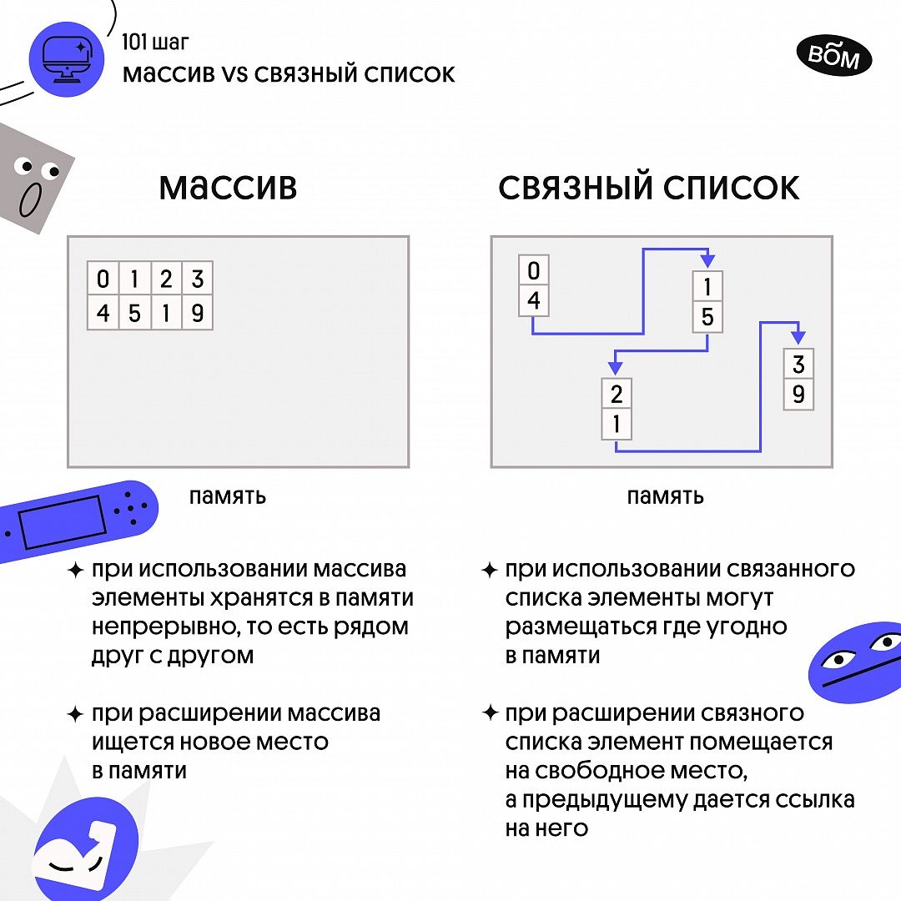

## Хеш-таблица

_Опр!_ **Хеш-таблица** - структура данных, которая организует хранение элементов при помощи специальных **хеш-функций**.

_Опр!_ **Хеш-функция** - функция, которая получает строку и возвращает число. Под строкой понимается любой набор данных, выраженный последовательностью байтов.

Требования к хеш-функции:
1. Быть последовательной. Для одной и той же строки, функция должна возвращать одно и тоже число.
2. Разным строкам должны соответствовать разные числа.

Пример на базе книги стоимости товаров. Как хеш-функция будет работать для массива памяти?

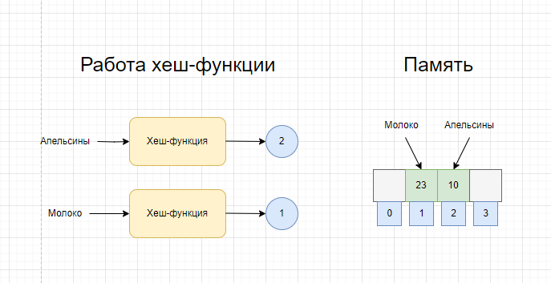

На схеме показан процесс внесения стоимости `апельсинов` и `молока` в память.
1. Вызывается хеш-функция, которая принимает строку `апельсины`. Хеш-функция возвращает значение **2**. Стоимость `апельсинов`(23💲) запишется в ячейку массива памяти под номером два.
2. Для `молока` хеш-функция возвращает значение **1**. Стоимость `молока`(10💲) будет записана в массив памяти под номером 1.
3. Теперь, если необходимо быстро узнать стоимость товара, мы вызываем хеш-функцию, узнаем номер ячейки массива, в которой хранится стоимость товара и получаем стоимость напрямую из массива памяти. Сложность такой операции равняется O(1).

_Важно!_ Вместе *хеш-функция* и *массив* и есть **хеш-таблица**! Хеш-таблицы известны и под другими именами: ассоциативные массивы, словари, отображения, хеш-карты, хеш. **Хеш-таблица** состоит из ключей и значений(key => value). В solidity хеш-таблицей является функция **mapping**.

**Хеш-таблицы** хорошо подходят для выполнения следующих задач:
1. Моделирование отношений между объектами
2. Устранение или отслеживание дубликатов
3. Кеширование или запоминание данных

Создается впечатление, что хеш-функция всегда возвращает уникальный индекс в массиве. Однако, в действительности практически невозможно реализовать такую хеш-функцию. Ситуация, когда хеш-функция возвращает одно число для двух строк, называется **коллизией**.

Пример коллизии на схеме ниже Андреев Иван и Алексеев Иван претендуют на запись в ячейку 002.

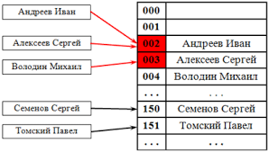

**Коллизии** решаются множеством способов. Самый простой реализовать связный список для двух строк, которые должны будут быть записаны в одну ячейку массива. Способ посложнее, увеличивать размер хеш-таблицы.

_Важно!_ Хеш-функция должна сводить количество коллизий к минимуму, тогда она будет более эффективна.

## Стек

_Опр!_ **Стек** - структура данных "last-in, first-out" (LIFO). Последний пришел - первый вышел.

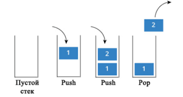

Solidity код реализации стека можно посмотреть [тут](./src/libraries/Stack.sol).

## Очередь

_Опр!_ **Очередь** - структура данных "first-in, first-out"(FIFO). Первым пришел - первым вышел.

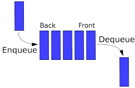

Solidity код реализации очереди можно посмотреть [тут](./src/libraries/Queue.sol).

## Время выполнения

_Опр._ Время выполнения - измеряет скорость роста количества операций алгоритма. Описывается специальной нотацией "О-большое". Нотация показывает количество операций.

Виды времени выполнения:
1. **О(n)** или линейный. Пример: простой поиск перебором.
2. **O(log n)** или логарифмический. Пример: бинарный поиск.
3. **O(n * log n)**. Пример: эффективные алгоритмы сортировки(быстрая сортировка).
4. **O(n ** 2)**. Пример: медленные алгоритмы сортировки(сортировка выбором).
5. **О(n!)**. Пример: очень медленные алгоритмы(задача о коммивояжере).

## Бинарный поиск

_Опр._ Бинарный поиск - это алгоритм, который на входе получает отсортированный список элементов и искомый элемент. На выходе возвращает позицию элемента в списке, если он найден, иначе - null. Каждый раз алгоритм делит список пополам и проверяет в какой половине находится искомый элемент. Ненужная половина отбрасывается, нужная половина снова делится пополам, пока искомый элемент не будет найден.

Типичный пример: поиск номера телефона в телефонной книге.

_Важно!_ Бинарный поиск имеет логарифмическое время выполнения. Работает за **log2n** шагов. И работает, только, если список отсортирован.

Solidity код бинарного поиска можно посмотреть [тут](./src/BinarySearch.sol).

## Сортировка выбором

_Идея!_ Сортировка выбором предполагает поиск минимального или максимального значения в неотсортированной части массива с последующей сменой местами последнего или первого элемента с найденным значением.

_Важно!_ В solidity мы будем найденное максимальное или минимальное значение добавлять в новый отсортированный массив.

Solidity код сортировки выбором можно посмотреть [тут](./src/SelectionSort.sol).

## Быстрая сортировка

Быструю сортировку еще называют **сортировкой Хоара**. Сортировка на основана на подходе "разделяй и властвуй".

_Важно!_ Стратегия **разделяй и властвуй** основана на разбиение задачи на уменьшающиеся фрагменты. Если применить стратегию к работе со списками, то базовым случаем скорее всего является пустой элемент или массив из одного элемента.

_Идея!_ В массиве выбирается **опорный элемент a[i]**. Массив разделяется на две части. Значения меньшие или равные опорному - влево, большие - вправо. Теперь массив состоит из двух подмножеств. Для обоих подмножеств рекурсивно запускается процедура выбора **опорного элемента** и разделения подмножества на две части. Это происходит, пока в подмножестве не окажется меньше двух элементов. В конце получается полностью отсортированный массив.

_Важно!_ Скорость алгоритма быстрой сортировки зависит от выбора опорного элемента. Поэтому у этой сортировки есть понятие лучшего(О(log n)) и худшего случая(O(n)).

Вариант реализации быстрой сортировки для Solidity будет похож на вариант реализации для C-подобных языков. В силу специфики работы с памятью исходный массив не бьется на подмножество. Реализуется вариант одновременного прохода по массиву с обоих концов и перестановкой элементов местами при необходимости.

Solidity код быстрой сортировки можно посмотреть [тут](./src/QuickSort.sol).

## Графы

_Опр!_ Граф - это геометрическая фигура, которая состоит из точек и линий, которые их соединяют. Такая фигура моделирует набор связи между объектами.

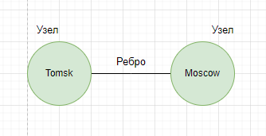

Каждый граф состоит из **узлов** и **ребер**. Узлы, которые имеют общие ребра называются **соседями**.

Графы бывают:
1. **Направленные**. Отношения действуют только в одном направление. По стрелкам.
2. **Ненаправленные**. Отношения действуют в обе стороны. Стрелок нет.

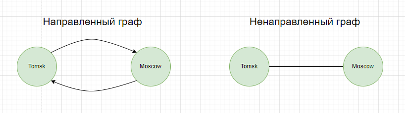

_Важно!_ Граф, в котором нет ребер, указывающих в обратном направление называется **деревом**.

## Поиск в ширину

_Опр!_ Поиск в ширину позволяет найти кратчайшее расстояние между двумя объектами. Под кратчайшем расстояние может пониматься множество вещей: кратчайший путь к победе в шашках, проверка правописания(кратчайшее расстояние - это минимальное количество изменений), найти ближайшего врача.

Поиск в ширину может ответить на два вопроса:
1. Существует ли путь из точки А в точку B?
2. Как выглядит кратчайший путь от узла А к узлу B?

_Идея!_ Алгоритм поэтапно перебирает все возможные варианты пути, постепенно углубляясь по списку. Например, ты ищешь того, кто готов пойти с тобой в кино в соцсетях. Сначала ты методично опрашиваешь своих друзей, если все отказались, ты спускаешься глубже к друзьям своих друзей и т.д. Это продолжается пока ты не найдешь человека, который согласится пойти с тобой в кино.

Поиск в ширину активно использует понятие **очередь**. Нельзя обращаться к произвольным элементам очереди. Можно только добавить элемент в очередь или извлечь из очереди. Возвращаясь к примеру в идее алгоритма, реализация с очередью выглядит так:

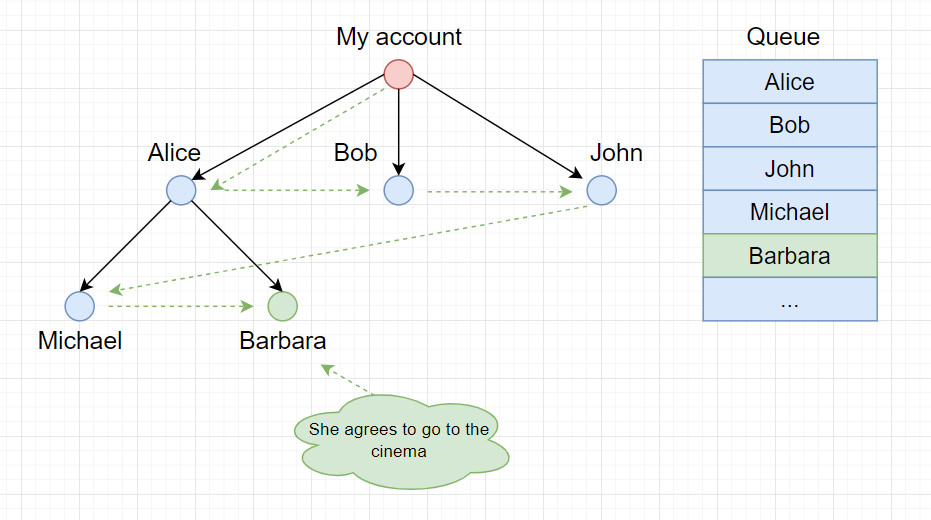
1. Открываем список своих друзей(на схеме "*my account*"). Добавляем своих друзей в очередь: Alice, Bob, John.
2. Проверяем первого друга: Alice. Если он согласен, поиск окончен. Если он не согласен, добавляем его друзей в конец нашего списка.
3. Проверяем второго друга: Bob, третьего, John.
4. И так, пока не найдется партнер для похода в кино или не закончатся люди в соцсети. В нашем случае Barbara согласна пойти в кино.

_Важно!_ Время выполнения такого алгоритма рассчитывается, как O(V + E), где V - количество вершин, E - количество ребер.

Solidity код поиска в ширину можно посмотреть [тут](./src/BreadthFirstSearch.sol).

Для тестов использовался вот такой граф. В скобках указан идентификатор узла графа.
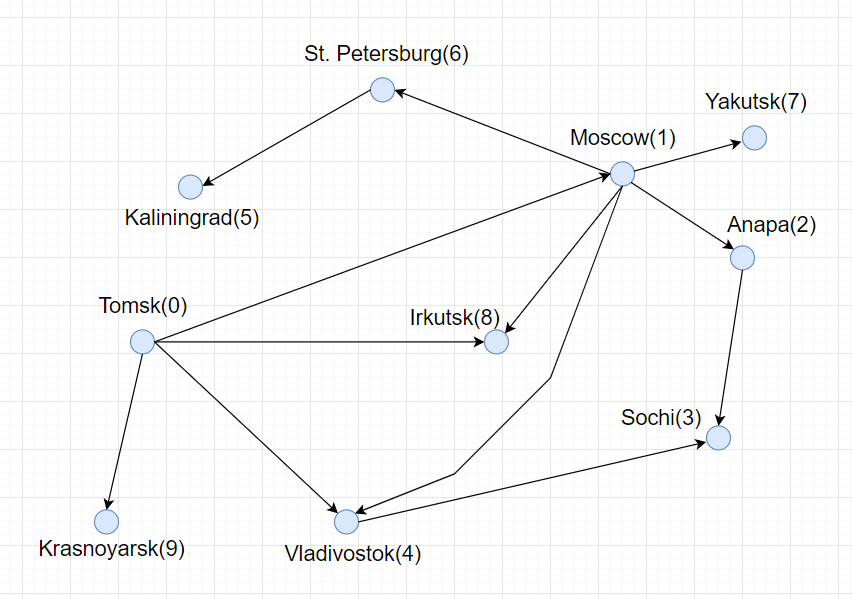

## Алгоритм Дейкстры

_Опр!_ Алгоритм Дейкстры - это алгоритм, который позволяет найти кратчайший путь от одной из вершин графа до всех остальных.

_Идея!_ Алгоритм последовательно перебирает узлы графа, записывая кратчайший путь в память. При нахождение наиболее кратчайшего пути до промежуточного узла, информация перезаписывается и поиск продолжается.

_Важно!_ Для каждого ребра вводиться понятие **вес**. Вес может быть отрицательным. Такой граф называется **взвешенным**.

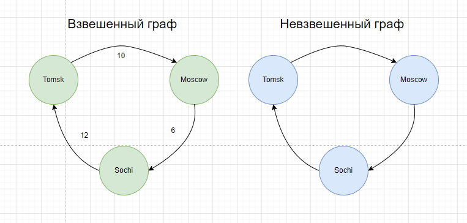

Алгоритм Дейкстры:
1. Найти узел с наименьшей стоимостью(то есть узел, до которого можно добраться за минимальное время)
2. Проверить, существует ли более дешевый путь к соседям этого узла и если существует, то обновить их стоимость.
3. Повторять, пока это не будет сделано для всех узлов графа.
4. Вычислить итоговый путь.

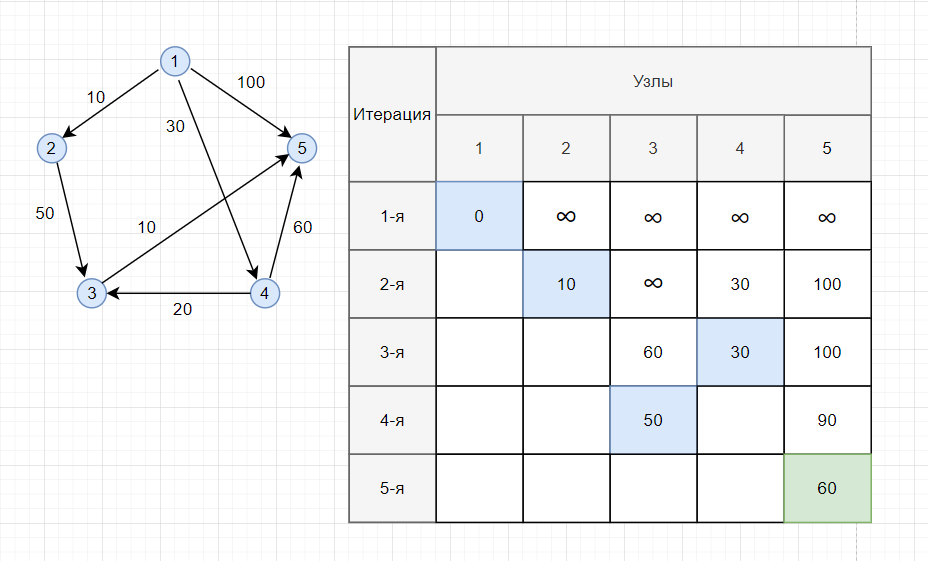

Для вычисления кратчайшего пути до любой точки графа удобно использовать таблицу. Для этого необходимо создать количество столбцов равное количеству узлов в графе.
1. **На первой итерации** необходимо определить начальную точку. В нашем случае это узел 1. Расстояние из узла 1 до узла 1 равно 0, до остальных узлов пока что неизвестно и ставим знак бесконечности.
2. **На второй итерации.** Проверяем до каких узлов мы можем добраться из узла 1. До 2-го узла 10, до третьего не возможно, оставляем бесконечность, до 4-го - 30, до 5-го 100.
3. **На третьей итерации.** Выбираем узел со второй итерации с минимальным расстоянием. Это узел 2. Расстояние до него равно 10. Считаем расстояние от 2-го узла до узлов не использованных(для узла 1 мы уже проверяли пути, оставляем поле пустым). Расстояние до третьего узла равно 50 + 10(от 2-го до 3-го + от 1-го до 2-го узла). Для 4-го узла расстояние остается 30, до 5-го узла 100, так как добраться до них из 2-го узла невозможно.
4. **На четвертой итерации.** Выбираем узел с третьей итерации с минимальным расстоянием. Это узел 4. Повторяем действия. Из четвертого узла можно добраться до оставшихся 3-го узла за 20 + 30 = 50. До пятого узла 90.
5. **На пятой итерации.** Выбираем узел с наименьшим расстоянием. Это узел 3. Из 3-го узла можно добраться до 5-го за 10 + уже пройденные 50. Итого 60.
6. **Ответ**: Кратчайшее расстояние из узла 1 до узла 5 равняется 60.

Для вычисления кратчайшего пути в невзвешенном графе используется алгоритм **поиск в ширину**. Для взвешенного графа используется **алгоритм Дейкстры**. В целом алгоритм Дейкстры работает только с направленными ациклическими графами, их нередко обозначают сокращением DAG(Directed Acyclic Graph).

_Важно!_ Алгоритм Дейкстры не поддерживает графы с отрицательными весами. Для этого используется алгоритм [Беллмана-Форда](https://www.geeksforgeeks.org/bellman-ford-algorithm-simple-implementation/).

Solidity код алгоритма Дейкстры можно посмотреть [тут](./src/Dijkstra.sol).

## Жадные алгоритмы

> Тот случай, когда жадность не порок!💰

_Опр!_ Жадный алгоритм - это алгоритм, который на каждом шагу делает локально наилучший выбор в надежде, что итоговое решение будет оптимальным.

_Важно!_ Алгоритм Дейкстры(нахождение кратчайшего пути в графе) тоже относится к жадным алгоритмам.

Задачи для которых подходит жадный алгоритм:
1. **Задача о расписание**. Например есть учебный класс, в котором нужно провести уроки. Все уроки провести не получится, потому что они пересекаются по времени. **Решение:** Берем самый первый по времени окончания урок, находим другой урок, который начинается сразу после окончания первого и так далее.
2. **Задача о размене монет.** Есть набор монет с разными номиналами. Необходимо разменять заданную сумму минимальным количеством монет. **Решение:** используем как можно больше монет с максимальным номиналом, затем переходим к меньшему номиналу и так далее.
3. **Задача о рюкзаке.** Воришка с рюкзаком забрался в магазин. Емкость рюкзака ограничена. Необходимо забрать с собой самые дорогие товары. **Решение:** выбираем самый дорогой товар и кладем его в рюкзак. Продолжаем, пока в рюкзаке не закончится место.
4. **Задача о покрытии множества.** Например, необходимо выбрать минимальное количество радиостанций, которые будут покрывать максимально большое количество областей. **Решение:** Выбрать станцию с наибольшим покрытием. Если станция будет покрывать области, которые уже были покрыты, то это нормально. Повторять, пока остаются штаты, не входящие в покрытие.
5. **Задача о коммивояжере.** Коммивояжер должен был посетить пять разных городов. Коммивояжер должен найти кратчайший путь, который включит все города. **Решение:** Проходим по всем возможным комбинациям путей и выбираем минимальное расстояние.

_Важно!_ Далеко не всегда жадный алгоритм эффективный и его необходимо применять. Например в задаче о рюкзаке с воришкой могла быть ситуация, что первый же товар займет все место в рюкзаке. Однако, было бы сильно выгоднее, набрать товара меньшего размера, но в больше количестве. Если это имело место быть, то алгоритм требовал бы учитывать не только стоимость товара, но и размер.

_Интересно!_ Такие алгоритмы еще называют **приближенными**. Когда вычисление точного решения занимает слишком много времени, применяется приближенный алгоритм.

Задача о коммивояжере в зависимости от количества городов резко увеличивает время работы алгоритма, потому что сложность растет по факториалу. Для 10 городов необходимо перебрать 3628800 вариантов. Такие задачи называют NP-полными(non-deterministic polynomial - "недетерминированные с полиномиальным временем"). Важно вовремя это понять и перейти от поиска идеального решения к решению с применением приближенного алгоритма.

Характерные признаки NP-полной задачи:
1. Алгоритм быстро работает при малом количестве элементов, но сильно замедляется при увеличение числа элементов
2. Если нужно перебрать все "комбинации x". Это один из самых характерных признаков
3. Если в задаче встречается некая последовательность(например, последовательность городов) и задача не имеет простого решения
4. Если в задаче встречается некоторое множество(например, как множество радиостанций) и задача не имеет простого решения

## Вывод

Алгоритмы - это очень хорошо. Но не будем забывать, что выполнение большого количества операций в Solidity будет стоить большое количество газа. Это приведет к большой комиссии за выполнение транзакции. Не будем забывать и про ограничение размера блока по газу. Да, блок достаточно гибкий и может расширяться, но все же не безграничен. Подробнее про это [тут](https://ethereum.org/en/developers/docs/gas/#block-size). Поэтому необходимо стараться проводить все большие алгоритмические операции off-chain, а блокчейн использовать для хранения данных или подтверждения результата работы алгоритмов. Но это уже совсем другая история.🔦