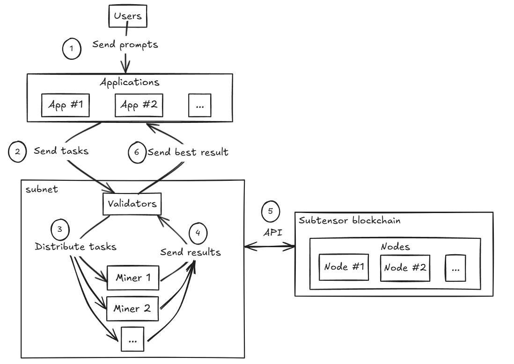
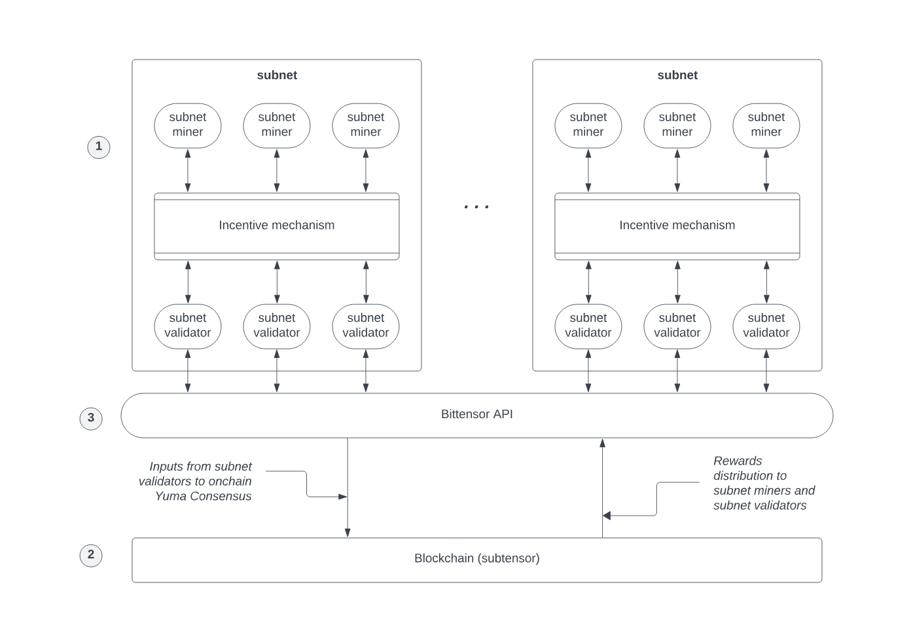
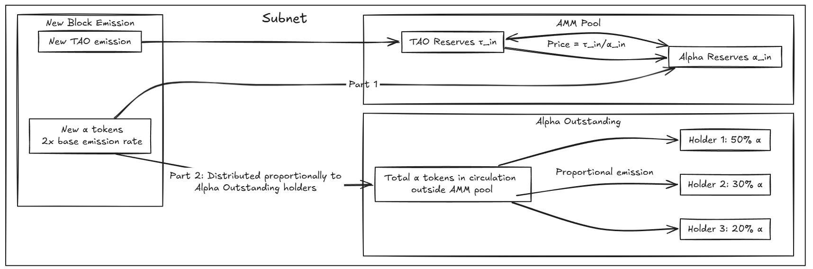

# Bittensor

**Автор:** [Алексей Куценко](https://github.com/bimkon144) 👨‍💻

[Bittensor](https://bittensor.com/) — это децентрализованный блокчейн-протокол, предназначенный для распределённого обмена вычислительными мощностями и интеллектуальными ресурсами. Его цель — создать открытую и саморегулируемую экосистему, в которой участники могут разрабатывать, обучать и оценивать нейросетевые модели, получая вознаграждение за свой вклад.

Система построена с использованием фреймворка [Substrate](https://polkadot-blockchain-academy.github.io/pba-book/substrate/intro/page.html), разработанного создателями [Polkadot](https://polkadot.com/). 

Почему Substrate, а не Ethereum? Выбор Substrate для Bittensor обусловлен несколькими ключевыми преимуществами:
 1) **Специализация** — возможность создать полностью кастомизированный блокчейн для AI-вычислений, а не ограничиваться рамками смарт-контрактов; 
 2) **Масштабируемость** — обработка большого количества транзакций между майнерами и валидаторами без высоких комиссий;
 3) **Модульность** — использование готовых компонентов для быстрой разработки;
 4) **Экономическая эффективность** — предсказуемые затраты на транзакции, критичные для постоянного обмена данными в AI-сети;
 5) **Автономность** — полный контроль над развитием протокола без зависимости от решений сторонних блокчейнов.

> **Парачейн (Parachain)** в экосистеме Polkadot — это специализированный блокчейн, который работает параллельно с основной сетью Polkadot (называемой Relay Chain) и другими парачейнами.

Важно отметить, что хотя Bittensor использует технологии *Substrate*, он функционирует как независимый блокчейн и не является частью экосистемы Polkadot в качестве *парачейна*. Это стратегический выбор разработчиков Bittensor, который позволяет им полностью контролировать свою сеть и развивать ее в соответствии с собственным видением, используя при этом мощные инструменты Substrate для разработки блокчейна.

Основной блокчейн сети, **Subtensor**, работает на механизме консенсуса [*Proof of Authority* (PoA)](https://coinmerce.io/en/learn/what-is-proof-of-authority/), где валидация осуществляется доверенными узлами под контролем **Opentensor Foundation**.

Ключевая особенность блокчейна — это способность координировать участников без централизованного управления, используя финансовые стимулы. Это позволяет строить саморегулируемые экосистемы, где каждый действует в своих интересах, одновременно укрепляя сеть.

Например, в [Bitcoin](https://bitcoin.org/) механизм майнинга служит стимулом для защиты блокчейна: когда цена BTC растёт, вознаграждения майнеров становятся выше, что привлекает новых участников и повышает безопасность сети.

Bittensor адаптирует этот принцип для рынка искусственного интеллекта и распределённых вычислений. Вместо фиксированной системы стимулов сеть использует гибкую рыночную модель, в которой каждая сабнет-экосистема управляет собственной экономикой.

Ранее сеть использовала для оценки работы майнеров только один механизм [Yuma Consensus](https://docs.bittensor.com/yuma-consensus), который распределял награды TAO на основе субъективных оценок валидаторов. Однако этот подход имел элементы централизации: ключевую роль играли валидаторы Root Subnet, контролируя распределение ресурсов.

В феврале 2024 года Bittensor внедрил [Dynamic TAO](https://docs.bittensor.com/dynamic-tao/) — новую экономическую модель, устранившую централизованный контроль и сделавшую сеть более динамичной и устойчивой. Он работает в паре с Yuma Consensus, работу которого видоизменили. Теперь награды зависят не только от валидаторов, но и от динамики стейкинга и рыночной стоимости токенов TAO. Это означает, что чем больше TAO застейкано в сабнете и чем выше его рыночная стоимость, тем больше награды получают участники.

Этот подход превращает развитие AI-моделей и вычислительных процессов в саморегулируемый и экономически обоснованный процесс. Таким образом, Bittensor создаёт не просто децентрализованный рынок цифровых ресурсов, а новую инфраструктуру для совместной работы над сложными вычислительными задачами.

## 1. Как работает протокол в целом?

1. Пользователи отправляют запрос через приложения.
2. Приложение или валидатор формирует запрос.
3. Валидаторы распределяют задачи майнерам.
4. Майнеры отправляют результаты своей работы валидаторам для проверки и оценки.
5. Валидатор оценивает результат работы по стандартам сабнета и взаимодействует с основным блокчейном для записи результата и оценки распределения наград.
6. Отправляет лучший результат обратно в приложение.

## 2. Архитектура блокчейна

В основе Bittensor лежит блокчейн Subtensor, система сабнетов (subnets),  Bittensor API

Таким образом, можно выделить следующие роли в работе протокола:

- Майнеры (*Miners*) — Работают над созданием цифровых товаров.
- Валидаторы (*Validators*) — Оценивают качество работы майнеров.
- Создатели сабнетов (*Subnet creators*) — Управляют механизмами стимулов, которые определяют задачи, которые должны выполнять майнеры и валидаторы.
- Стейкеры (*Stakers*) — Держатели TAO могут поддерживать конкретных валидаторов в каждом сабнете. Делегируя свои токены валидатору, они увеличивают его стейк и в будущем получают часть его дохода.

Рассмотрим каждый выделенный модуль на схеме.

### 2.1 Subtensor — главный блокчейн сети

В архитектуре блокчейн Subtensor выполняет функцию неизменяемого реестра, фиксируя данные о вычислительных процессах, транзакциях и результатах работы участников сети.

Функциональность блокчейна Bittensor(Subtensor)

В основе экономики Bittensor лежат два типа токенов:
- **TAO** (τ) — нативный токен сети, используемый для *стейкинга*, оплаты газа
- **Альфа-токены** (α) — токены, специфичные для каждого *сабнета*, используемые для учета вклада участников

Основные функции Subtensor:
- Выступает как неизменяемый реестр, фиксирующий данные о вычислительных процессах, результатах работы участников и оценках валидаторов
- Фиксирует балансы и транзакции всех участников сети
- Обеспечивает возможность стейкинга — пользователи могут делегировать TAO в поддержку конкретных валидаторов из сабнетов
- Поддерживает передачу токенов TAO между адресами
- Обеспечивает совместимость с Ethereum Virtual Machine, что открывает возможности для более сложных приложений, таких как ликвидный стейкинг и лендинг TAO.

Важно понимать, что evm блокчейн не позволяет взаимодействовать с сабнетами, т.е обращаться за выполнением какой-то задачи.

### 2.2 Сабнеты

Сабнет (subnet) в Bittensor представляет собой специализированную платформу для создания определённого типа цифрового продукта, связанного с искусственным интеллектом. Например, один сабнет может специализироваться на генерации текста, другой — на обработке изображений.

**Структура сабнета**

Каждый сабнет состоит из следующих компонентов:

1. **Механизм стимулирования**:
   - Определяет, какие задачи должны выполнять майнеры и какие стандарты качества к ним применяются
   - Задает правила оценки работы майнеров валидаторами и механизм распределения вознаграждений
   - Регулирует получение наград майнеров и валидаторов
   - Реализован в виде кодовой базы, которая определяет интерфейсы и правила взаимодействия между участниками

2. **Участники**:
   - **Майнеры** — выполняют вычислительные задачи
   - **Валидаторы** — проверяют и оценивают результаты работы майнеров
   - **Создатели сабнетов** — разрабатывают и поддерживают механизмы работы сабнета

3. **Процесс работы**:
   - Майнеры получают и выполняют задачи
   - Валидаторы независимо оценивают результаты
   - Формируется матрица оценок для каждого майнера
   - На основе этих оценок происходит распределение наград

### 2.3 Bittensor SDK

Bittensor предоставляет мощный набор инструментов для работы с сетью, обеспечивая децентрализованное управление вычислительными ресурсами и разработку новых сабнетов.

Ключевой инструмент для интеграции с сетью — Bittensor SDK, который:
- Позволяет майнерам и валидаторам взаимодействовать в сабнетах
- Обеспечивает доступ к блокчейну Subtensor для передачи данных и управления активами
- Автоматизирует обработку транзакций и учёт вычислений

Это открытая экосистема для разработчиков, где Bittensor предоставляет:
- Исходные репозитории и инструменты для работы с сетью
- Подробную документацию с описанием API и экономических механизмов
- Пошаговые руководства и туториалы для майнеров, валидаторов и создателей сабнетов

Эти инструменты позволяют разработчикам создавать новые сабнеты, интегрироваться с Bittensor и взаимодействовать с блокчейном Subtensor, развивая децентрализованную AI-инфраструктуру.

---

Теперь, когда мы разобрались с общей архитектурой сети, рассмотрим, как проходит процесс обработки задач внутри сабнетов – от создания запроса до распределения наград.

## 3. Технологии

Следует понимать, что в основе распределения наград лежит Yuma consensus и Dynamic TAO.

**Что такое Dynamic TAO?**

**Dynamic TAO** представляет собой новый способ определения ценности сабнетов через рыночный механизм: пользователи могут «голосовать» за ценность сабнета, ставя свои токены в его резерв.

Основной механизм работы заключается в автоматизированном маркете (AMM) для каждого сабнета, который включает два резерва:

- **TAO Reserves** (τ_in) — пул застейканных **TAO**
- **Alpha Reserves** (α_in) — пул **α-токенов**
- Цена: `Price = τ_in/α_in`
- Между резервами существует механизм автоматического обмена

**Эмиссия в Dynamic TAO**
С внедрением **Dynamic TAO** ликвидность постепенно эмитируется в экономику токенов **Bittensor** в соответствии с алгоритмом, направленным на стимулирование роста, стабилизацию цен и защиту от манипуляций.

Каждый блок:

- Сеть эмитирует **TAO** и добавляет его в **TAO-резервы** сабнетов.
- Сеть эмитирует **альфа-токены** с удвоенной базовой скоростью эмиссии. Эти эмитированные **альфа-токены** распределяются между:
  - **Alpha-резервом сабнета** (увеличивая доступную ликвидность)
  - **Alpha outstanding** (стимулы для майнеров, валидаторов и создателей сабнетов, стейкеров)

Этот механизм создает динамичную рыночную экономику, в которой эмиссия токенов происходит на основе потребности в вычислительных мощностях, что помогает стабилизировать цены и создает здоровую конкуренцию среди сабнетов.

Более детально, с формулами и примерами можно ознакомиться [здесь](https://docs.bittensor.com/dynamic-tao/dtao-guide).

**Связь с Yuma Consensus**

**Yuma Consensus** ранее играл ключевую роль в оценке работы майнеров, обеспечивая согласованность оценок валидаторов. С переходом на **Dynamic TAO**, система стала более децентрализованной и рыночно-ориентированной, однако Yuma Consensus по-прежнему используется внутри сабнетов для согласования оценок между валидаторами и определения качества работы майнеров. Теперь этот механизм работает в связке с Dynamic TAO, где Yuma отвечает за консенсус внутри сабнета, а Dynamic TAO определяет ценность самих сабнетов через рыночные механизмы.

Оценка каждого сабнета определяется через стейкинг TAO (обмен через AMM и стейкинг альфа-токенов), где участники сети могут «голосовать» за ценность сабнета. Это позволяет:
- Участникам сети влиять на стоимость и относительную ценность сабнетов
- Майнерам и валидаторам работать в условиях динамичной экономики, где ценность сабнета меняется в зависимости от спроса и ликвидности

Система вознаграждений теперь основана на рыночной стоимости альфа-токенов каждого сабнета. По мере роста популярности сабнетов и привлечения большего количества TAO, цена их альфа-токенов увеличивается, что ведет к увеличению эмиссии TAO.

Вознаграждения распределяются в альфа-токенах, которые участники сети могут конвертировать в TAO. Этот процесс может влиять на цену альфа-токенов, что, в свою очередь, влияет на будущие вознаграждения.

Dynamic TAO обеспечивает справедливое распределение вознаграждений, выравнивая их с реальной ценностью каждого сабнета. Это создает саморегулируемую экономику, где рыночные механизмы стимулируют более качественные вычисления и эффективную работу.

## 4. Майнеры, валидаторы, создатели сабнета и номинаторы

- Возможно вам интересно, а можно ли создать своего майнера для выполнения определенных задач и получать за это награды?
- А может вы хотите быть валидаторам и оценивать работу майнеров и получать за это награды?
- Возможно у вас есть идея по задаче которую могли бы выполнять в рамках нового сабнета и она будет приносить вам доход?
- Вы владелец TAO токенов и вы хотите получить пассивный доход?

На все эти вопросы мы ответим ниже.

**Как стать майнером**

Для того чтобы стать майнером, необходимо в первую очередь иметь подходящее оборудование.
В каждой сабнет свои требования, но для общего представления, можно посмотреть шаблон для создателей сабнетов. В нём указаны общие [требования](https://github.com/opentensor/bittensor-subnet-template/blob/main/min_compute.yml) для сетапов майнеров и валидаторов.

Для регистрации требуется заплатить TAO токеном.

Один сабнет может содержать максимум 64 валидатора и 192 майнера.

Как только вы зарегистрировались и получили идентификационный номер, у вас начинается _immunity_period_ который даёт вам иммунитет от делистинга на определенное количество блоков. Соответственно, если после окончания льготного периода, у майнера будут самые низкие метрики производительности, то текущего майнера делистят и принимают нового майнера вместо него. Более детально можно посмотреть [тут](https://docs.bittensor.com/miners/).

Таким образом, если у вас возможность стать майнером для выполнения каких-то задач, будь то предоставление модели AI, своих мощностей GPU или как хранилище данных под определенные задачи.

**Как стать валидатором**

Для регистрации валидатором, аналогичным образом под каждую сабнет существуют свои требования к оборудованию.

Сначало следует зарегистрироваться в сабнете и застейкать 1000 TAO токенов.

Далее, можно применять механизм оценки работы майнеров который установлен в сабнете.

Более детально можно почитать [тут](https://docs.bittensor.com/validators/).

**Как стать Номинатором**

Номинатора можно назвать делегатором или стейкером в конкретный сабнет и на определенный валидатор.

Как мы ранее говорили, у валидатором вес их голоса в расчёте работы майнеров зависит от количества стейка под этого валидатора и соотственно это влияет на величину получаемой эмиссия в токенах. Таким образом, для увеличения дахода в токенах эмиссия блокчейна, валидатор может привлекать стейкеров TAO. Такие стейкеры тоже будут получать диведенты от общей эмиссии в сабнет пропорционально их стейку.

Стейкать можно через:
- [Bittensor SDK](https://docs.bittensor.com/staking-and-delegation/managing-stake-sdk)
- [Bittensor CLI](https://docs.bittensor.com/staking-and-delegation/managing-stake-btcli)
- [Polkadot js](https://docs.bittensor.com/staking-and-delegation/staking-polkadot-js)
- [Ledger Hardware](https://docs.bittensor.com/staking-and-delegation/using-ledger-hw-wallet)
- [precompile evm contract](https://docs.bittensor.com/evm-tutorials/staking-precompile)

А посмотреть, какую эмиссию получает определенный сабнет, чтобы выбрать его для стейка, можно [тут](https://taostats.io/subnets).

**Создатели сабнетов**

Для создателей сабнетов рекомендуют в начале протестировать механизм вознаграждения локально, потом в задеплоить сабнет в тестнет, а потом уже в мейннет.

Для того чтобы создать сабнет, нужно установить Bittensor SDK и завести создать кошелек через Bittensor wallet.

Далее, имея достаточный баланс, через SDK можно создать сабнет и приглашать майнеров и валидаторов для работы над вашей задачей.

## 4. Ограничения и проблемы сети Bittensor

Несмотря на уникальный и амбициозный подход, Bittensor сталкивается с рядом ограничений и точек централизованного контроля. Рассмотрим ключевые вызовы и усилия по их преодолению.

### 4.1 Механизм Proof of Authority (PoA)
Основная блокчейн-система Subtensor использует механизм консенсуса Proof of Authority (PoA), где валидация транзакций осуществляется только проверенными узлами, контролируемыми Opentensor Foundation. Это создает проблемы для децентрализации, так как Opentensor Foundation имеет полный контроль над сетью, включая возможность цензуры транзакций.

Для достижения полной децентрализации планируется переход на Proof of Stake (PoS). Однако сроки реализации этой системы пока не установлены.

### 4.2 Размер блокчейна
С увеличением популярности сети и числа сабнетов растет и размер блокчейна. Легкие узлы требуют 128 ГБ памяти, а архивные — 1,5 ТБ. Прогнозировалось, что к 2025 году размер легкого узла может достичь 1 ТБ, что может затруднить децентрализацию, если валидация будет открыта для всех. Но такого пока не случилось, и важно понимать, что для большества задач майнерам и валидаторам будет хватить легкого узла.

По состоянию на февраль 2025г.
- Легкий узел: достаточно 128 ГБ
- Архивный узел: минимум 2 ТБ для текущего размера цепочки, на блоке # 5029000 от 28 февраля 2025 года.

### 4.3 Управление Bittensor
Управление Bittensor сосредоточено в руках нескольких ключевых участников:
- **Триумвират**: Состоит из трех сотрудников Opentensor Foundation, ответственных за предложение обновлений сети.
- **Сенат**: Голосует за предложения от Триумвирата и включает 12 валидаторов с наибольшим количеством делегированных TAO.

Централизованное управление может привести к манипуляциям с правилами в пользу ограниченного круга участников. Opentensor Foundation планирует сделать управление более открытым, чтобы уменьшить риски централизации.

## 5. Экосистема Bittensor

Bittensor обладает уникальной архитектурой, основанной на сабнетах, что позволяет создавать разнообразные и амбициозные проекты. Каждый сабнет может быть нацелен как на коммерческое использование, так и на научные исследования в различных областях.

**Категории сабнетов**

1. **Коммерческие сабнеты**: Предлагают сервисы с целью получения прибыли, например, интеграция результатов майнеров в сторонние приложения.
2. **Научные сабнеты**: Поддерживают исследования в нефинансовых областях, таких как биология, медицина и технологии.

Наш обзор на сабнеты будет включать топ по маркет капу из [этого](https://taostats.io/subnets) списка.

Немного об интерфейсе дашборда, расскажем на примере [сабнета #64](https://taostats.io/subnets/64/chart):

Следут пояснить, что за график и кнопки buy/sell.

Как мы ранее говорили, что каждый сабнет это AMM пул. Где первый актив это токен TAO а второй это токен сабнета. График показывает цену TAO токена в пули по отношению к токену сабнета.

Стоимость TAO токена регулируется рынком. Т.е когда сабнет становится популярным или востребованным, то люди отдают свои TAO и забирают второй токен  - сабнета.
Таким образом, первого токена в пуле (TAO) становится больше а второго токена меньше.

За счёт этого цена токена токена сабнета показывает рост.
Тогда все получатели токена сабнета - майнеры, валидаторы, стейкера, создатель сабнета могут либо пойти обменять свой токен награды обратно в TAO и тем самым получить прибыль.

Таким образом, АММ-пул сабнета можно использовать для обмена токенов, стейкинга или фиксации прибыли за свою работу/вклад.

Перейдем к рассмотрению сабнетов и их приложений, чтобы понять, как их можно использовать.

---
[Subnet 19: Chutes](https://chutes.ai/) — сабнет, обеспечивающий доступ к различным AI-моделям через единый API-интерфейс. Chutes интегрирует как текстовые модели (DeepSeek-R1 и другие), так и генерато
ры изображений (Dreamshaper XL, Stable Diffusion). Главная идея, что можно быстро задеплоить свою модель либо воспользоваться уже публичными моделями, т.е что-то наподобие маркетплейса AI.

Приложения на базе сабнета:

[Chutes.ai](https://chutes.ai/) предоставляет разработчикам простой REST API сервис для взамодействием с публичными AI моделями, либо возможность задеплоить на облачное хранилище свою модель и получать награды за использование ее другими пользователями.

Возможности участия в сети:

1. **Майнер**:
- Предоставление вычислительных ресурсов для запуска AI-моделей
- Обслуживание запросов пользователей через API
- Поддержка различных моделей (текстовых, генерации изображений и др.)
- Получение вознаграждения за обработку запросов

2. **Валидатор**:
- Оценка качества и скорости работы майнеров
- Проверка доступности и стабильности предоставляемых сервисов
- Мониторинг соответствия результатов запросам
- Участие в распределении наград между майнерами

3. **Потребитель**:
- Использование API для доступа к различным AI-моделям
- Возможность быстрого развертывания любой публичной AI-модели из обширного каталога либо собственной модели
- Доступ к уже развернутым и оптимизированным моделям через простой API-интерфейс
- Прозрачная система оплаты: достаточно пополнить баланс адреса в блокчейне Bittensor токенами TAO
- Экономическая эффективность: оплата только за фактически использованные вычисления, без абонентской платы или минимальных платежей
- Отсутствие необходимости в собственном оборудовании для запуска ресурсоемких AI-моделей
- Возможность выбора оптимальных моделей для конкретных задач

Таким образом, Chutes особенно полезный как для индивидуальных разработчиков, так и для компаний, которым требуется гибкий и масштабируемый доступ к AI-инфраструктуре без значительных первоначальных инвестиций.

---
[Subnet 4: Targon](https://targon.com/) — один из крупнейших сабнетов, в котором майнеры анализируют ответы языковых моделей и предоставляют источники для проверки точности информации через детерминированный механизм верификации.

Приложения на базе сабнета:

[Sybil](https://sybil.com/) — AI-поисковик, который предоставляет ответы на запросы пользователей с указанием источников информации, обеспечивая высокую степень достоверности результатов.

Возможности участия в сети:

1. **Майнер**:
- Обработка запросов пользователей с использованием языковых моделей
- Поиск и верификация источников для подтверждения информации
- Предоставление структурированных ответов с цитированием источников
- Поддержка API-интерфейса, совместимого со стандартами OpenAI

2. **Валидатор**:
- Оценка точности и достоверности ответов майнеров
- Проверка релевантности предоставленных источников
- Мониторинг качества цитирования и соответствия ответов запросам
- Участие в распределении наград на основе качества верификации

3. **Потребитель**:
- Получение проверяемых ответов с указанием источников
- Повышенная точность и достоверность результатов благодаря механизму верификации
- Доступ к API, совместимому со стандартами OpenAI, для интеграции в собственные приложения
- Снижение зависимости от централизованных AI-сервисов при сохранении высокого качества ответов
- Защита от дезинформации и непроверенных данных благодаря системе проверки источников
- Использование API для интеграции верифицируемых ответов в свои приложения
- Доступ к достоверной информации с возможностью проверки

Таким образом, Targon и построенный на его основе Sybil.com особенно полезны для пользователей и разработчиков, которым важна фактическая точность информации, а также для компаний, стремящихся интегрировать в свои продукты проверяемые AI-ответы с указанием источников.

---
[Subnet 8: Theta (PTN)](https://www.taoshi.io/) — специализированный сабнет, который собирает и анализирует торговые сигналы от квантовых и систем глубокого обучения для предоставления комплексных торговых рекомендаций по различным классам активов.

Приложения на базе сабнета:

[Taoshi](https://www.taoshi.io/ptn) — платформа, предоставляющая доступ к высокоточным торговым сигналам, сгенерированным децентрализованной сетью алгоритмических систем, работающих на инфраструктуре Bittensor.

Возможности участия в сети:

1. **Майнер**:
- Разработка и запуск алгоритмических торговых моделей
- Генерация торговых сигналов по различным классам активов
- Предоставление прогнозов движения рынка с указанием уровней входа/выхода
- Получение вознаграждения на основе точности и эффективности сигналов

2. **Валидатор**:
- Оценка исторической точности торговых сигналов
- Мониторинг производительности майнеров в реальном времени
- Проверка соответствия сигналов рыночным условиям
- Участие в распределении наград на основе эффективности прогнозов

3. **Потребитель**:
- Получение агрегированных торговых сигналов высокой точности
- Доступ к диверсифицированным торговым сигналам по различным классам активов (криптовалюты, акции, товары, форекс)
- Повышенная точность прогнозов благодаря агрегации данных от множества независимых алгоритмических систем
- Снижение рисков за счет использования разнообразных стратегий и моделей машинного обучения
- Возможность интеграции торговых сигналов в собственные торговые системы через API, например для использования с ботом для торговли
- Прозрачная система оценки эффективности сигналов с историческими данными о производительности
- Доступ к диверсифицированным стратегиям от множества алгоритмических моделей

Если хотите, можете попробовать создать аккаунт и выбрать бесплатных майнеров чтобы протестировать данный [сервис](https://request.taoshi.io/).

Таким образом, Theta особенно ценен для трейдеров, инвестиционных фондов и финансовых учреждений, которым требуются высококачественные алгоритмические торговые сигналы без необходимости разработки и поддержки собственных сложных систем машинного обучения и квантовых моделей.

---
[Subnet 8:BitMind](https://bitmind.ai/) — специализированный сабнет, который фокусируется на идентификации и верификации контента, созданного искусственным интеллектом, используя децентрализованную сеть майнеров для анализа и классификации медиафайлов различных типов.

Приложения на базе сабнета:

[Thedetector](https://thedetector.ai/) — платформа для обнаружения AI-сгенерированного контента, включая изображения,видео с высокой точностью и прозрачностью результатов анализа.

Возможности участия в сети:

1. **Майнер**:
- Запуск алгоритмов детекции AI-сгенерированного контента
- Анализ и классификация различных типов медиафайлов
- Постоянное обучение и адаптация к новым методам генерации контента
- Получение вознаграждения за точность определения синтетического контента

2. **Валидатор**:
- Оценка точности работы детекторов майнеров
- Проверка результатов на контрольных наборах данных
- Мониторинг способности майнеров обнаруживать новые типы AI-генерации
- Участие в распределении наград на основе эффективности детекции

3. **Потребитель**:
- Проверка подлинности медиафайлов через веб-интерфейс или API
- Надежное определение синтетического контента (дипфейков, AI-сгенерированных изображений, текстов и аудио) с высокой точностью
- Постоянное обновление алгоритмов распознавания благодаря децентрализованной сети майнеров, адаптирующихся к новым методам генерации контента
- Прозрачность процесса верификации с подробными отчетами о признаках искусственного происхождения
- Возможность интеграции через API в существующие платформы социальных сетей, новостные сайты и системы модерации контента
- Защита от дезинформации и манипуляций общественным мнением через выявление поддельных медиаматериалов
- Интеграция инструментов верификации в собственные платформы

Таким образом, BitMind особенно ценен для медиа-компаний, платформ социальных сетей, правоохранительных органов и организаций, занимающихся проверкой фактов, которым необходимы надежные инструменты для борьбы с дезинформацией и защиты пользователей от манипулятивного AI-сгенерированного контента в эпоху, когда различие между реальным и синтетическим становится все менее очевидным.

---
[Subnet 51: Compute Subnet](https://celiumcompute.ai/) — децентрализованная P2P-платформа для аренды вычислительных мощностей GPU, объединяющая владельцев графических процессоров и пользователей, нуждающихся в вычислительных ресурсах для решения различных задач.

Приложения на базе сабнета:

[Celium Compute](https://celiumcompute.ai/) — платформа для аренды вычислительных мощностей с удобным веб-интерфейсом, где пользователи могут арендовать GPU-ресурсы напрямую у майнеров сети.

Возможности участия в сети:

1. **Майнер (Поставщик GPU)**:
- Предоставление своих GPU для аренды другим участникам сети
- Получение вознаграждений за предоставленные вычислительные мощности
- Автоматическое управление нагрузкой и распределением ресурсов

2. **Валидатор**:
- Проверка качества и доступности предоставляемых вычислительных ресурсов (Удаление майнера если он не имеет 100% доступности к услугам)
- Мониторинг выполнения условий аренды и разрешение споров
- Участие в распределении наград между майнерами
- Получение вознаграждения за валидацию операций в сети

3. **Потребитель мощностей**:
- Доступ к широкому выбору GPU различной мощности
- Значительное снижение затрат на вычислительную инфраструктуру
- Гибкая система оплаты и масштабирования ресурсов (оплата через токен TAO)
- Прозрачное ценообразование и система репутации участников
- Отсутствие необходимости в долгосрочных контрактах
- Доступ к специализированным GPU для задач машинного обучения и рендеринга
- Возможность краткосрочной и долгосрочной аренды вычислительных ресурсов
- Оплата только за фактически использованное время
- Выбор оптимальной конфигурации под конкретные задачи

Таким образом, Compute Subnet представляет особую ценность как для владельцев GPU, желающих монетизировать простаивающие мощности, так и для компаний, исследователей и разработчиков, нуждающихся в гибком доступе к вычислительным ресурсам без крупных первоначальных инвестиций в оборудование.

---
[Subnet 19: Nineteen](https://sn19.ai/) — специализированный сабнет, фокусирующийся на создании децентрализованной сети для выполнения сложных задач по обработке и генерации текста с использованием моделей LLM. В отличие от других сабнетов, Nineteen делает акцент на выполнении конкретных инструкций и задач, а не просто на генерации текста.

Приложения на базе сабнета:

[Corcel](https://corcel.io/) — платформа, предоставляющая API для доступа к открытым языковым моделям с высокой производительностью и низкой задержкой. Сервис предлагает доступ к моделям Llama 3, Mistral и другим через простой API, совместимый с OpenAI, с оплатой по факту использования. Corcel фокусируется на обеспечении стабильной и быстрой инфраструктуры для разработчиков, которым требуется надежный доступ к современным языковым моделям.

[Tao Bot](https://tao.bot/) — платформа, упрощающая доступ к экосистеме Bittensor. Сервис разработан как для новичков в блокчейне, так и для опытных криптоэнтузиастов, позволяя легко осуществлять бриджинг, торговлю и стейкинг токенов. Tao Bot абстрагирует сложности мультичейн-взаимодействия, позволяя пользователям сосредоточиться на исследовании инновационных AI-сетей и развитии своих цифровых активов. Главный сайт работает в ограниченном функционале, но у протокола уже есть [сайт](https://interact.tao.bot/).

[Makeitaquote](https://makeitaquote.com/) — сервис для создания мемов, картином с цитатами с использованием различных моделей.

Возможности участия в сети:

1. **Майнер**:
- Запуск и обслуживание специализированных языковых моделей, оптимизированных для выполнения инструкций
- Обработка запросов, требующих точного следования указаниям и структурированных ответов
- Выполнение сложных задач, включая написание кода, анализ данных и создание структурированного контента
- Получение вознаграждения на основе качества выполнения инструкций и точности результатов

2. **Валидатор**:
- Оценка способности майнеров точно следовать инструкциям и выполнять конкретные задачи
- Проверка качества и структуры ответов на основе заданных критериев
- Мониторинг производительности и способности майнеров решать различные типы задач
- Участие в распределении наград на основе объективных метрик качества выполнения инструкций

3. **Потребитель**:
- Доступ к специализированным языковым моделям, оптимизированным для выполнения конкретных инструкций
- Получение структурированных и точных ответов на сложные запросы
- Возможность использования моделей для решения практических задач, таких как написание кода, анализ данных и создание контента
- Экономическая эффективность: оплата только за фактически использованные вычисления
- Повышенная надежность и точность выполнения инструкций по сравнению с общими языковыми моделями
- Доступ к моделям, специально обученным для решения узкоспециализированных задач
- Возможность получения результатов в структурированном формате, готовом для интеграции в приложения

Таким образом, Subnet Nineteen особенно ценен для разработчиков, аналитиков данных и компаний, которым требуются языковые модели, способные точно следовать инструкциям и выполнять конкретные задачи с высокой степенью структурированности и точности результатов.

---
[Subnet 13: Data Universe](https://www.macrocosmos.ai/sn13) — специализированный сабнет, созданный для сбора, хранения и предоставления доступа к большим объемам данных из различных источников. Сабнет разработан с акцентом на децентрализацию и масштабируемость, позволяя хранить до 50 петабайт данных на 200 майнерах, при этом требуя всего около 10 ГБ хранилища на валидаторах.

Приложения на базе сабнета:

[Data Universe Dashboard](https://shorturl.at/Ca5uu) — информационная панель, отображающая текущее состояние данных в сети, помогающая майнерам оптимизировать свою конфигурацию для максимизации вознаграждений.

[HuggingFace Datasets](https://huggingface.co/) — майнеры могут загружать собранные данные на HuggingFace, делая их доступными для публичного использования в анонимизированном виде.

Возможности участия в сети:

1. **Майнер**:
- Сбор данных из определенных источников (DataSources)
- Хранение данных в локальной базе данных
- Предоставление индекса хранимых данных валидаторам
- Загрузка данных на HuggingFace для публичного доступа
- Получение вознаграждения на основе объема и ценности хранимых данных

2. **Валидатор**:
- Периодический опрос майнеров для получения их индексов данных
- Хранение информации о всех данных в сети и о том, какие майнеры их хранят
- Проверка корректности данных, хранимых майнерами
- Оценка майнеров на основе объема, свежести и уникальности их данных
- Распределение наград между майнерами

3. **Потребитель**:
- Доступ к большим объемам данных из различных источников через единый интерфейс
- Использование данных для обучения моделей искусственного интеллекта и проведения исследований
- Получение актуальных данных, обновляемых майнерами
- Доступ к уникальным наборам данных, которые могут быть недоступны в централизованных хранилищах

Система оценки в Data Universe учитывает несколько факторов:
- **Свежесть данных**: более новые данные ценятся выше, а данные старше 30 дней не учитываются
- **Желательность данных**: определенные типы данных оцениваются выше в соответствии
- **Фактор дублирования**: данные, хранимые многими майнерами, менее ценны, чем уникальные данные
- **Достоверность майнера**: валидаторы проверяют корректность данных и поддерживают рейтинг доверия к каждому майнеру

Таким образом, Data Universe особенно ценен для исследователей, разработчиков AI-моделей и компаний, которым требуется доступ к большим объемам разнообразных данных для обучения моделей машинного обучения и проведения аналитических исследований. Сабнет стимулирует разнообразие данных и их качество, создавая децентрализованную инфраструктуру для хранения и доступа к информации.

Полный список сабнетов можно посмотреть [здесь](https://taomarketcap.com/subnets?sortColumn=market_cap&sortType=desc).

## Bittensor: Реальная ценность децентрализованного AI для пользователей

Если отбросить маркетинговые лозунги, возникает логичный вопрос: какую реальную ценность Bittensor приносит обычным пользователям? Разберем ключевые преимущества и сценарии использования.

### Преимущества Bittensor

**Доступ к различным AI-моделям без привязки к одному провайдеру**
В отличие от централизованных сервисов (OpenAI, Anthropic, Google), Bittensor предоставляет доступ к множеству моделей через единый интерфейс.
Это означает:
- Независимость от политики и ценовой стратегии одной компании.
- Возможность выбора оптимальной модели для конкретной задачи.
- Гибкость в переключении между моделями в зависимости от потребностей.

**Экономическая выгода**
- Прозрачное ценообразование — стоимость использования определяется рыночными механизмами, а не корпоративными решениями.
- Оплата по факту использования — большинство сервисов работают по модели pay-as-you-go, без фиксированной абонентской платы.
- Возможность монетизации ресурсов — владельцы оборудования могут сдавать свои мощности в аренду и получать вознаграждение.

Таким образом, главные пункты:
- **Устойчивость к цензуре** — децентрализованная сеть сложнее поддается внешнему контролю.
- **Отказоустойчивость** — отсутствие единой точки отказа делает систему более надежной.
- **Инновационность** — открытая экосистема стимулирует внедрение новых моделей и алгоритмов.

### Примеры использования

**Разработчик приложений**
Разработчик может использовать Bittensor вместо API от одного провайдера (например, OpenAI). Например, **Corcel (Subnet 19)** предоставляет доступ к различным языковым моделям через единый API, что дает:
- Снижение стоимости работы с AI.
- Возможность легко переключаться между моделями.
- Независимость от политики одного поставщика.

**Исследователь данных**
Для обучения AI-моделей требуются большие объемы данных.

**Data Universe (Subnet 13)** предлагает:
- Децентрализованное хранилище данных.
- Доступ к уникальным наборам данных.
- Свежие и актуальные данные, обновляемые майнерами.

**Обычный пользователь, работающий с AI**
При поиске информации важна достоверность.

**Sybil (Subnet 4)** предлагает:
- Ответы с подтвержденными источниками.
- Минимизацию недостоверной информации от AI.
- Возможность проверки происхождения данных.

### Возможные применения в будущем

_AI агенты:_

Bittensor позволяет создавать AI-агентов, способных выполнять сложные задачи. Например, AI-агент для планирования путешествий может:
1. Анализировать предпочтения пользователя.
2. Искать авиабилеты через API.
3. Проверять прогноз погоды.
4. Подбирать отели на основе отзывов.
5. Создавать маршрут поездки.

Такой агент мог бы использовать несколько сабнетов: один для обработки запроса, другой для поиска информации, третий для построения оптимального маршрута.

_Путь к AGI:_

Возможно, что **AGI (Artificial General Intelligence)** будет достигнут через интеграцию множества специализированных моделей. Bittensor движется в этом направлении, создавая:
1. **Специализированные модели** — каждая сабнет решает конкретную задачу.
2. **Комбинацию возможностей** — AI-агенты могут взаимодействовать друг с другом.
3. **Рыночное развитие** — лучшие модели получают больше ресурсов и развиваются быстрее.
4. **Коллективный интеллект** — тысячи независимых участников создают мощную AI-систему.

Таким образом, Bittensor — это не просто блокчейн для AI, а фундамент для новой децентрализованной AI-экосистемы, в которой технологии развиваются благодаря сообществу, а не централизованным корпорациям.

## Заключение

Bittensor создает революционную децентрализованную инфраструктуру для искусственного интеллекта, где ценность определяется рыночными механизмами, а не корпоративными решениями.
Архитектура сабнетов обеспечивает беспрецедентную гибкость, позволяя создавать специализированные сети для различных задач — от обработки текста до анализа изображений. Механизмы Dynamic TAO и Yuma Consensus формируют справедливую систему вознаграждений, где участники влияют на развитие сети пропорционально своему вкладу.
Экономическая модель Bittensor создает рыночную систему, где участники получают вознаграждение за предоставление вычислительных ресурсов и интеллектуальных моделей, что делает разработку и использование AI более доступными и эффективными
Интеграция с EVM расширяет возможности взаимодействия с существующими блокчейн-экосистемами, а в перспективе Bittensor может стать фундаментом для развития AGI через интеграцию множества специализированных моделей.
Успех проекта будет зависеть от его способности преодолеть существующие ограничения, сохраняя при этом главную цель — создание открытой и доступной экосистемы для развития технологий AI.

## Ссылки

- [Официальный сайт Bittensor](https://bittensor.com/)
- [Bittensor wiki](https://bittensorwiki.com/)
- [Learn bittensor](https://learnbittensor.org/subnets)
- [Tao marketcap](https://taomarketcap.com/subnets?sortColumn=market_cap&sortType=desc)
- [Документация Bittensor](https://docs.bittensor.com/)
- [Dynamic TAO: подробное руководство](https://docs.bittensor.com/dynamic-tao/dtao-guide)
- [Yuma Consensus: документация](https://docs.bittensor.com/yuma-consensus)
- [Substrate: документация](https://polkadot-blockchain-academy.github.io/pba-book/substrate/intro/page.html)
- [Polkadot: официальный сайт](https://polkadot.com/)
- [Proof of Authority (PoA): объяснение механизма](https://coinmerce.io/en/learn/what-is-proof-of-authority/)
- [Статистика сабнетов Bittensor](https://taostats.io/subnets)
- [Sybil: AI-поисковик на базе Bittensor](https://sybil.com)
- [Github: Bittensor](https://github.com/opentensor/bittensor)
