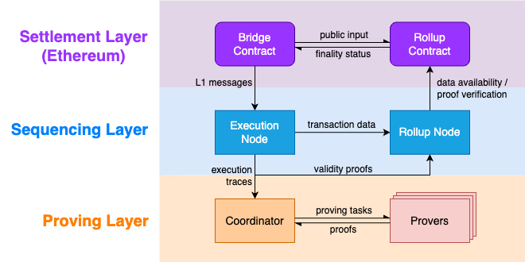
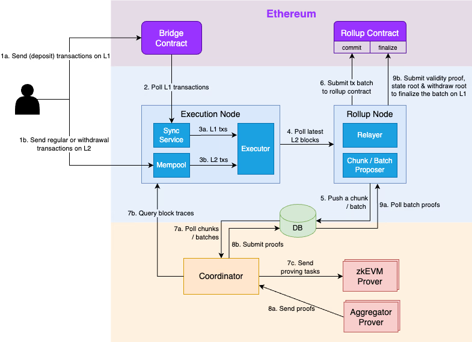
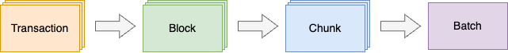

# Scroll

**Автор:** [Алексей Куценко](https://github.com/bimkon144) 👨‍💻

Scroll — это блокчейн второго уровня (Layer 2 - L2), созданный для масштабирования Ethereum. Он использует ZK-Rollups - свертки с доказательством нулевого разглашения (Zero-knowledge proofs - ZKP) для объединения транзакций за пределами основной сети (L1), в L1 в свою очередь отправляется только криптографическое доказательство, что транзакции обработаны верно, а также сжатые данные об этих транзакциях.

Разрабатывался совместно с группой [Privacy and Scaling Explorations](https://pse.dev/) в Ethereum Foundation более года. 

В этой статье мы рассмотрим основные технические принципы блокчейна которые повлияли на дизайн блокчейна, дадим обзор общей архитектуры Scroll. 

Детально расскажем: о Scroll, который состоит из централизованного узла секвенирования (execution node, rollup node) и децентрализованной сети (roller net), покажем архитектуру и рабочий процесс rollup. 

Предполагается, что вы уже знакомы с терминами [zkp](https://habr.com/ru/articles/692088/)

## Технические принципы и предпосылки к созданию блокчейна

Каких технические принципы были основополагающими и что в свою очередь повлияло на дизайн блокчейна, можно детально изучить в [этой](https://scroll.mirror.xyz/N7cAie4ul0PdSxNdv2FTqgMV2JEkhOJocsxfeqe4SFE) статье.

## Архитектура 

Для того чтобы понять, как работает блокчейн, сперва необходимо понять, какие уровни архитектуры существуют и из чего они состоят.

Рассмотрим верхнеуровнево общую архитектуру согласно картинки ниже.
 

### Settlement Layer 

Находится данный уровень в Ethereum и состоит из двух контрактов  - `Bridge Contract` и `Rollup Contract`.

**Bridge Contract:** 

- позволяет пользователям и dapps отправлять сообщения, активы, транзакции (если dapps в L1) в сеть Scroll (L2) и обратно в L1.

**Rollup Contract:** 

- проверяет сгруппированные транзакции (batch) отправленные с L2.
- предоставляет доступность данных (обеспечивает возможность любому участнику сети получить доступ к информации о транзакциях и блоках).
- упорядочивает транзакции для канонической цепочки Scroll (В блокчейне транзакции должны быть обработаны в определенном порядке, чтобы избежать двойных расходов и других видов мошенничества. Уровень расчетов обеспечивает, что транзакции, входящие в каноническую цепочку Scroll, обрабатываются в правильном и последовательном порядке).

### Sequencing Layer

Состоит данный уровень из узлов  - `Execution Node` и `Rollup Node`.

**Execution Node:**

В первую очередь следует сказать, что на данный момент это централизованный узел, который является одним из главных компонентов протокола.

Он ответственный за:

- проверку и выполннение транзакций, которые были отправлены пользователями через L2 сеть или через L1 контракт - bridge.
- создание блоков L2 из транзакций.

**Rollup Node:**

- группирует транзакции в пакеты (batch).
- публикует данные транзакций и информацию о блоках на Ethereum для обеспечения доступности данных.
- передает доказательства правильности транзакций на Ethereum для окончательного подтверждения пакета транзакций (финализации в L1).

### Proving Layer

Данный уровень состоит из модуля `Provers`  и `Coordinator`.

**Provers:**

Это пул проверяющих в децентрализованной сети.

Они ответственные за создание доказательств действительности zkEVM, которые проверяют правильность транзакций L2.

**Coordinator:**

В свою очередь Coordinator это модуль который отправляет задачи проверки случайному `Prover` и передает доказательства на `Rollup Node` для окончательности транзакций в Ethereum.

## Rollup процесс 

Предлагаю теперь детально разобрать схему.

Для начала, следует разобрать из чего состоят узлы.

**Execution Node** содержит модули:

- *Sync service*. Подписывается на события контракта Bridge. Как только этот модуль обнаружит новую транзакции, он генерирует ее в особый формат L1MessageTx и добавляет их в локальную очередь L1 транзакций.

- *Mempool*. Собирает транзакции, которые напрямую отправляются в L2.

- *Executor*. Извлекает транзакции как из локальной очереди транзакций L1, так и из Mempool L2, выполняет их для создания нового блока L2.

**Rollup Node** Содержит модули:

- *Relayer*. Отправляет [commit transactions](#жизненный-цикл-транзакций) и [finalize transactions](#жизненный-цикл-транзакций) в `Rollup Contract` для обеспечения доступности и окончательности данных.
- *Chunk/Batch Proposer*. Создает  [chunks](#пакетная-обработка-транзакций) / batch из транзакций и отправляет либо в базу данных, для последующей отправки на Prover для генерации доказательства, либо в контракт Rollup, для предварительной фиксации в сети L1.

Получается, что процесс Rollup состоит из трех этапов:

1) Транзакции проверяются и выполняются в Execution Node
2) Транзакции упаковываются в batch и фиксируются изменения в L1
3) Генерация доказательства и отправка в Rollup contract для финализации транзакций.

### Порядок работы

Теперь давайте пройдемся по схеме по каждому пункту.

#### Транзакции проверяются и выполняются в Execution Node

**1.** Пользователи отправляют транзакции через L1 bridge или напрямую в L2 сеть.

**2.**  Sync Service извлекает последние добавленные  транзакции L1 с `Bridge contract`.

**3.** Секвенсор L2 (Execution Node) обрабатывает транзакции из очереди которые поступили из L1, так и из mempool L2 и создает блоки L2.

#### Транзакции упаковываются в batch и фиксируются изменения в L1

**4.** Rollup Node отслеживает последние блоки L2 и извлекает данные транзакций.

**5.** Rollup Node предлагает новый chunk или batch и записывает его в базу данных. О том как происходит создание block, chunk и batch, рекомендую посмотреть [тут](#пакетная-обработка-транзакций).

**6.** После создания нового batch (пакета), Relayer собирает данные транзакций в этом пакете и отправляет commit transaction в Rollup Contract для обеспечения доступности данных. Таким образом происходит предварительная фиксация данных в L1.

#### Генерация доказательства и отправка в Rollup contract для финализации транзакций.

**7.** Coordinator опрашивает новый chunk или batch из базы данных:

        - Если был создан новый chunk, то Coordinator запросит трассировку выполнения всех блоков в этом chunk у секвенсора L2 (execution node), а затем отправит задачу проверки chunk случайно выбранному проверяющему (prover).

        - Если был создан новый batch, то Coordinator соберет доказательства всех chunks этой партии из базы данных и отправит задачу проверки партии случайно выбранному агрегатору-проверщику (prover).

**8.** После того, как Coordinator получит chunk или batch доказательств от проверяющего (prover), он запишет доказательство в базу данных.

**9.** Как только rollup relayer увидит новый batch в базе данных, он отправляет транзакцию [Finalize](#жизненный-цикл-транзакций) в Rollup Contract для проверки доказательства.

Таким образом, как вы могли заметить, существует определенный жизненный цикл транзакций.

### Жизненный цикл транзакций

1. **Confirmed**: Пользователи отправляют транзакцию либо в bridge contract L1, либо в секвенсор L2 (execution node). 
Транзакция становится Confirmed после того, как она будет выполнена и включена в блок L2.
2. **Committed**: Указывает на то, что данные транзакции этого блока были опубликованы в Ethereum. 
Это не доказывает, что они были выполнены надлежащим образом, но гарантирует доступность данных блока.
3. **Finalized**:  Указывает на то, что подтверждение действительности было отправлено и проверено смарт-контрактом. Транзакция имеет статус FInalized. 
После этого шага транзакция считается окончательной.

### Пакетная обработка транзакций

Как видно из картинки, в Scroll транзакции группируются по нескольким уровням.

1. Группа упорядоченных транзакций упаковывается в блок.
2. Серия смежных блоков группируется в chunk. Chunk — это базовый блок для генерации доказательства схемы zkEVM.
3. Серия смежных chunk группируется в batch (пакет). Пакет является базовой единицей для фиксации данных (предварительной отправки в L1) и проверки доказательств на уровне L1. Пакетное (batch) доказательство — это совокупное доказательство chunks в этом пакете.

Таким образом транзакции в начале упаковываются в блоки, потом блоки в chunk (для отправки на генерацию proof в prover), после этого, chunks упаковываются в batches (для фиксации данных в L1 или проверки доказательств).

## Отличия zkEVM от EVM в Scroll

Инструменты разработки и отличия блокчейна Scroll от Ethereum были рассмотрены [тут](../scroll/scroll-dev-environment.md)

## Инфраструктура scroll

Инфраструктура scroll довольно быстро набирает обороты и уже включает десятки протоколов: Bridges, DeFi, инфраструктурные протоколы и другое. (Актуальный список смотреть [тут](https://scroll.io/ecosystem)).

## Плюсы и минусы scroll

### Плюсы

-   Смарт-контракты, совместимые с EVM (За исключением некоторых precompiled contracts и eips)
-   Можно использовать любимые фреимворки и инструменты разработки, такие как foundry, hardhat, remix.
-   Стандартный Web3 API (также поддержка стандартных кошельков для Ethereum, например MetaMask)
-   Скорость обработки транзакций - транзакции на L2 подтверждаются сразу и на L1 через небольшой промежуток времени
-   Низкая комиссия за транзакции
-   Быстро развивающаяся инфраструктура

### Минусы

-   Требует тестирования непосредственно в сети scroll. Вследствие чего необходимо больше времени на более тщательное тестирование и аудит, даже уже протестированных контрактов прошедших аудит, потому что есть небольшие изменения в precompiled contracts и поддерживаемых eips
-   Сеть пока довольно централизована и управляется определенными валидаторами (Секвенсоры)
-   Так как сеть в процессе разработки и тестирования - нужно постоянно следить за тем, чтобы ничего не сломалось в уже работающем коде

## Вывод

Протокол scroll выглядит очень многообещающе. Разрабатывать для scroll на данный момент легче, чем для блокчейнов, которые менее совместимы с EVM. 

## Ссылки

- [Docs: scroll docs](https://docs.scroll.io/en/developers/)
- [ecosystem](https://scroll.io/ecosystem)
- [article: overview of scroll](https://hub.forklog.com/obzor-arhitektury-scroll/)
- [article: Introducing Scroll - Vision and Values](https://scroll.mirror.xyz/EYn7ODhQAnNWABwWcu5xZLts_wEXTZAEWyTgExGS1DA)
- [article: Introducing Scroll – Technical principles](https://scroll.mirror.xyz/N7cAie4ul0PdSxNdv2FTqgMV2JEkhOJocsxfeqe4SFE)

