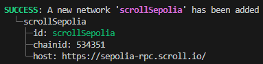

# Инструменты разработки и отличия блокчейна Scroll от Ethereum

**Автор:** [Алексей Куценко](https://github.com/bimkon144) 👨‍💻

Блокчейн [Scroll](https://scroll.io/) совместим с байт-кодом EVM и спроектирован таким образом, чтобы разработчики могли разрабатывать с их любимыми фреимворками с минимальными различиями. Заявлено, что блокчейн разрабатывался разработчиками Ethereum для разработчиков Ethereum. 

Блокчейн не поддерживает `erc-4337` c коробки. 
Среднее время финализации транзакции в L1 ~ 3 минуты.

Уже существует целая [экосистема](https://scroll.io/ecosystem) вокруг этого блокчейна. К сожалению в указанном источнике отображаются не все dapps, например, уже есть возможность воспользоваться популярным [oracle chainlink](https://docs.chain.link/data-feeds/price-feeds/addresses?network=scroll&page=1) для получения цен на токены.

При разработке, всегда обращайтесь к актуальной документации [тут](https://docs.scroll.io/en/developers/).

## Инструменты

### Foundry

При взаимодействии с сетью, например с тестнет Scroll, нужно учитывать, что EIP-1559 отключен в Scroll (мы поговорим о всех изменениях позже).
В Foundry существует флаг `--legacy` который позволяет использовать [legacy](https://www.educative.io/answers/type-0-vs-type-2-ethereum-transactions) транзакции.
В данный момент, Foundry пытается автоматически включить флаг `--legacy`  для обычных сетей без EIP-1559.
Если же автоматически не включилось и произошла ошибка - `EIP-1559 not activated`, то следует самому включить флаг указания типа транзакции.

Например:

```forge create src/Contract.sol:MyToken --rpc-url=https://sepolia-rpc.scroll.io/ --legacy```

### Hardhat

Для использования данного фреимворка, необходимо всего лишь внести необходимую сеть в ```hardhat.config.ts```.

Например, давайте настроим под тестнет Scroll Sepolia:
```javascript
...

const config: HardhatUserConfig = {
  ...
  networks: {
    scrollSepolia: {
      url: "https://sepolia-rpc.scroll.io/" || "",
      accounts:
        process.env.PRIVATE_KEY !== undefined ? [process.env.PRIVATE_KEY] : [],
    },
  },
};
...
```
### Truffle

Для подключения необходимо добавить сеть в файл ```truffle-config.js```

```javascript
const HDWalletProvider = require("@truffle/hdwallet-provider")
...
module.exports = {
  networks: {
    scrollSepolia: {
      provider: () =>
        new HDWalletProvider(process.env.PRIVATE_KEY, "https://sepolia-rpc.scroll.io/"),
      network_id: '*',
    },
  }
}
```


### Brownie 

Для добавления сети необходимо воспользоваться командой ```brownie networks add Ethereum scrollSepolia host=https://sepolia-rpc.scroll.io/ chainid=534351```.

После чего, вы увидите, что сеть добавлена:



И можете это проверить через команду ```brownie networks list```


### Online IDE

Cмарт-контракты легко компилируются и деплоются в Remix. 
Для взаимодействия с тестнет, вам необходимо получить ETH. Способы можно посмотреть [тут](https://docs.scroll.io/en/user-guide/faucet/).

### Среда тестирования

Тестировать возможно в вышеуказанных средах, но следует понимать, в связи с тем, что существуют отличия Scroll от Ethereum на уровне EVM, окончательная полноценная проверка работоспособности смарт-контрактов может быть проверена только через деплой в [тестнет](https://sepolia.scrollscan.dev/). 

## Различия Ethereum & Scroll сетей

Хотя и было заявлено, что Scroll это решение от "Ethereum разработчиков для Ethereum-разработчиков" и данная сеть zkEVM совместима с Ethereum на уровне байт-кода, все же есть некоторые отличия, которые следует учитывать при разработке смарт-контрактов:

**Opcodes**

- `SELFDESTRUCT` → отключен. Будет реверт транзакции.
- `BASEFEE` → отключен. Будет реверт транзакции.
- `DIFFICULTY/PREVRANDAO` → всегда возвращает 0.
- `COINBASE` → возвращает адрес predeployed контракта  - Transaction Fee Vault. Контракты можно посмотреть [тут](https://docs.scroll.io/en/developers/scroll-contracts/).
- `BLOCKHASH` → возвращает keccak (chain_id || block_number) на последние 256 блоков.

**Предварительно скомпилированные контракты**

Поддерживаются:

- ecRecover
- identity
- ecAdd
- ecMul

Поддерживаются с изменениями:

- modexp поддерживается, но поддерживает только входные данные размером меньше или равным 32 байтам (т. е. u256).

- ecPairing поддерживается, но количество точек(sets, pairs) ограничено 4 вместо 6.

Временно не поддерживаются:

- SHA2-256 (address 0x2)
- RIPEMD-160 (address 0x3)
- blake2f (address 0x9) 

При попытке вызова, будет реверт транзакции. Разработчики планируют включить их в будущем хард форке.

**State account**:

В структуру данных используемой для хранения информации о состоянии учетной записи были добавлены два поля ```PoseidonCodehash``` и  ```CodeSize```:

```javascript
type StateAccount struct {
	Nonce    uint64 // счетчик, указывающий количество транзакций, отправленных отправителем
	Balance  *big.Int //Баланс ETH на балансе аккаунта (единица в wei).
	Root     common.Hash // Корень Merkle дерева хранилища
	KeccakCodeHash []byte // Keccak хеш
	// добавленные поля
	PoseidonCodeHash []byte // Poseidon хеш
	CodeSize uint64 // Количество байтов в байт-коде контракта
}
```
*KeccakCodeHash* - используется для поддержания совместимости с опкодом ```EXTCODEHASH``` .

*PoseidonCodeHash*: - тип хеша используется для верификации правильности байт-кода, загруженного в zkEVM. [Poseidon hash](https://eprint.iacr.org/2019/458.pdf) оптимизирован для использования в вычислениях Zero-Knowledge Proof и позволяет более эффективно и безопасно работать с байт-кодом смарт-контрактов в таких средах.

*CodeSize* - используется для сохранения размера контракта. Когда происходит верификация EXTCODESIZE, загрузка полных данных контракта в zkEVM является дорогостоящей, поэтому, вместо этого, мы сохраняем размер контракта в хранилище во время создания контракта. Таким образом, нам не нужно загружать код — достаточно доказательства из хранилища для верификации этого опкода.

**Block**

Для быстрой обратной связи и улучшения пользовательского опыта, Scroll реализовал время создания блока ~ 3 секунды.

block.timestamp возвращает временную метку L2 транзакций.

### EIPs

Разработчики отключили некоторые EIPs в London fork и включили новые с Shanghai fork для улучшения совместимости. Разработчики обещают вернуть EIP-2930 and EIP-1559 в будущем.

Отключили:

- [EIP-1559](https://eips.ethereum.org/EIPS/eip-1559): Новая система комиссий с автоматически регулируемой базовой ставкой и сжиганием части комиссий, а также расширяемые размеры блоков для улучшения эффективности сети.

- [EIP-2930](https://eips.ethereum.org/EIPS/eip-2930): Опциональные списки доступа в транзакции для уменьшения риска ошибок и улучшения взаимодействия со смарт-контрактами путём указания адресов и ключей хранения, которые они будут использовать.

- [EIP-3198](https://eips.ethereum.org/EIPS/eip-3198): Вводит BASEFEE opcode в Ethereum, позволяющую смарт-контрактам напрямую получать информацию о текущей базовой комиссии сети, улучшая их адаптивность и функциональность.

Импортировали:

- [EIP-3651](https://eips.ethereum.org/EIPS/eip-3651): Уменьшает стоимость газа для доступа к адресу майнера (операция COINBASE) в смарт-контрактах.

- [EIP-3855](https://eips.ethereum.org/EIPS/eip-3855): Вводит PUSH0 opcode. Позволяет поместить значение нуля на стек, упрощая определённые операции и потенциально уменьшая затраты на газ за счет сокращения количества необходимых байтов для кодирования нулевых значений в смарт-контрактах.

- [EIP-3860](https://eips.ethereum.org/EIPS/eip-3860): Ограничивает размер и измеряет стоимость инициализационного кода (initcode) для контрактов. Это направлено на уменьшение рисков безопасности и улучшение производительности сети, вводя ограничения на длину initcode и связывая стоимость его выполнения с его размером.
