# zkEvm Polygon

**Автор:** [Алексей Куценко](https://github.com/bimkon144) 👨‍💻

## Введение

Polygon zkEVM — это эмулятор виртуальной машины Ethereum (EVM) в котором реализована технология ZK-Rollups, позволяющая увеличить пропускную способность и скорость обработки транзакций. zkEVM позволяет разработчикам разворачивать в сети L2 смарт-контракты Ethereum без какого-либо изменения кода, используя при этом преимущества ZK-Rollups, как например низкую стоимость газа и быструю финализацию транзакций. 

На данный момент среди L2-сетей сравнительно немного решений построено на базе ZKP. Чтобы лучше понять концепцию доказательства с нулевым разглашением и принцип работы построенного на нем блокчейна рекомендуем ознакомиться с нашим обзором zkSync [тут](https://github.com/matter-labs/awesome-zero-knowledge-proofs), в котором было уделено внимание теоретическим основам технологии. 

## Архитектура 

Polygon zkEVM обрабатывает переходы состояний, вызванные выполнением транзакций Ethereum Layer 2 (транзакций, которые пользователи отправляют в сеть). После этого он создает доказательства достоверности, которые подтверждают точность этих вычислений изменения состояния вне цепочки, используя zk proof.

Ниже мы рассмотрим главные компоненты блокчейна:

1) zkNode
    - Synchronizer (синхронизатор)
    - Sequencers (секвенсор) & Aggregators (агрегатор)
    - RPC
2) Consensus Contract (PolygonZkEVM.sol)
3) zkProver
4) zkEVM Bridge.

Для большего понимания где располагаются контракты и ноды, можем посмотреть на схему ниже:

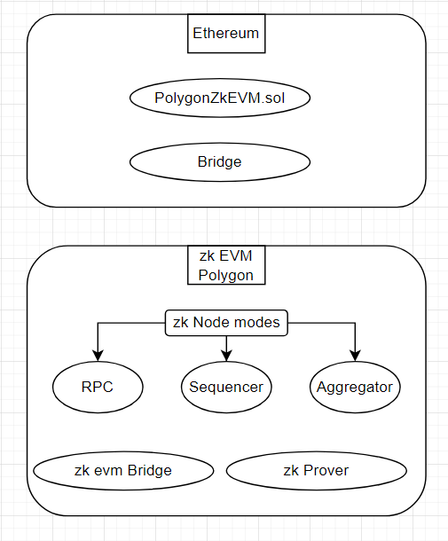

Последняя версия консенсусного контракта zkEVM (развернутая на L1) создана по образцу  [Proof of Efficiency](https://ethresear.ch/t/proof-of-efficiency-a-new-consensus-mechanism-for-zk-rollups/11988).

### zkNode

zkNode — это программное обеспечение, необходимое для запуска любого узла zkEVM. Это клиент, который необходим сети для реализации синхронизации и управления ролями участников (секвенсоров или агрегаторов). Основными участниками, влияющими на состояние L2 и его завершенность, являются доверенный секвенсор и доверенный агрегатор. Про вознаграждения данных видов узлов поговорим позже [тут](#механизм-стимулирования-zkevm).

Пользователи zkNode могут использовать его в нескольких целях:
 - В качестве узла, чтобы знать состояние сети
 - В качестве участника процесса работы сети : Sequencer или Aggregator.

Чтобы понять, за что отвечают секвенсоры и агрегаторы, предлагаю рассмотреть модульную архитектуру zkNode:

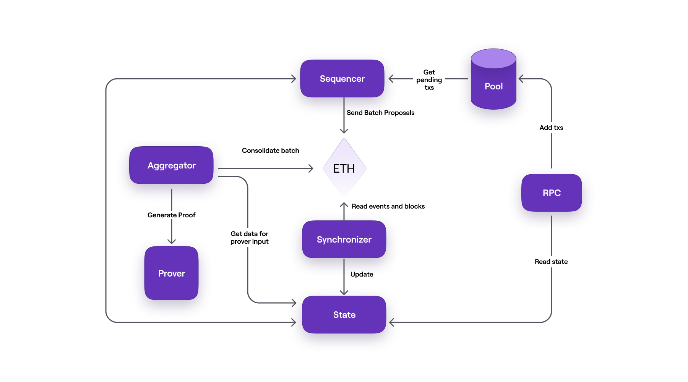

Дадим определения на каждый модуль в схеме:
 - `RPC` - RPC нода, через которую пользователи отправляют свои транзакции;
 - `Pool` - хранилище транзакций отправленных пользователем. Они хранятся и ждут когда секвенсор поместит их в пакет (batch).
 - `Sequencer` (секвенсор) — это узел, отвечающий за выборку транзакций из базы данных пула, проверку достоверности транзакций и последующее помещение действительных в пакет;
 - `Synchronizer` (синхронизатор) — это компонент, который обновляет базу данных состояний(State) путем получения данных из Ethereum через Etherman. Etherman — это низкоуровневый компонент, реализующий методы для всех взаимодействий с сетью L1 и смарт-контрактами;
 - `State` (база данных состояний) — это база данных для постоянного хранения данных о состоянии (это не деревья Меркла);
 - `Aggregator` (агрегатор) — это еще один узел, роль которого заключается в предоставлении доказательств, подтверждающих целостность предлагаемого изменения состояния секвенсором. Эти доказательства представляют собой доказательства с нулевым разглашением (или ZK-доказательства), и для этой цели агрегатор использует криптографический компонент, называемый Prover;
 - `Prover` - это сложный криптографический инструмент, способный создавать сотни пакетов ZK-proofs и объединять их в одно ZK-доказательство, которое публикуется как доказательство достоверности.

Самое важное для понимания — это основной путь, по которому проходят транзакции, с момента отправки пользователями транзакций в сеть zkEVM до их завершения и включения в состояние L1. 

Для начала, давайте упрощенно опишем путь транзакций согласно схеме:

- Пользователи, которые подключаются к сети zkEVM через узел RPC, отправляют свои транзакции в базу данных под названием Pool. 
- База данных Pool хранит транзакций отправленные пользователями. Они хранятся и ждут когда секвенсор поместит их в пакет (batch).
- Секвенатор проверяет транзакции с Pool, группирует в пакет (batch) и отправляет все пакеты в L1 на определенный контракт (расскажем позже), а затем секвенирует их (упорядочивание, валидация, запись в контракт). При этом секвенированные (упорядоченные) партии должны быть включены в состояние L1.
- Синхронизатор обновляет базу данных состояний (State) путем получения данных из Ethereum через Etherman.
- Агрегатор  берет данные из обновленной базы данных состояний (State) и отправляет в Prover модуль.
- Prover предоставляет доказательство zk-proofs, подтверждающее целостность предлагаемого изменения состояния секвенсором. 
- Агрегатор с полученным zk-proofs идет в L1 и консолидирует состояние пакета транзакций. На этом этапе транзакции считаются завершенные и включены в состояние L1.

У вас наверное возник вопрос, а кто получает от секвенаторов сгруппированные пакеты транзакций, хранит их порядок, проверяет транзакции и размещает их в L1?

Наш следующий компонент zkEVM Polygon занимается именно этим.

### Consensus Contract (PolygonZkEVM.sol)

Этот компонент представляет из себя Consensus Contract (PolygonZkEVM.sol).
Сам контракт можно посмотреть в [эфириум](https://etherscan.io/address/0x5132A183E9F3CB7C848b0AAC5Ae0c4f0491B7aB2#writeProxyContract) и goerli [тестнет](https://goerli.etherscan.io/address/0xa997cfD539E703921fD1e3Cf25b4c241a27a4c7A).

Данный cмарт-контракт проверяет доказательства действительности, чтобы гарантировать правильность выполнения каждого перехода состояния. Это достигается за счет использования схем zk-SNARK.  

Немного истории создания контракта: 

Более ранняя версия, Polygon Hermez 1.0, была основана на механизме консенсуса Proof of Donation (PoD). PoD, по сути, представлял собой децентрализованный аукцион, проводимый автоматически, в котором участники (координаторы) делали ставки определенным количеством токенов, чтобы получить право создать следующий пакет транзакций.

Последний консенсусный контракт (PolygonZkEVM.sol) использует опыт существующего PoD в версии 1.0 и добавляет поддержку для беспрепятственного участия нескольких координаторов в создании пакетов на втором уровне (L2).

Более ранний механизм Proof of Donation (PoD) был основан на модели децентрализованного аукциона для получения права на создание пакетов в определенный временной промежуток. В этом механизме экономические стимулы были настроены таким образом, что валидаторам нужно было быть очень эффективными, чтобы оставаться конкурентоспособными.

Последняя версия Консенсусного Контракта zkEVM (развернутого на Уровне 1) создана по образцу [Proof of Efficiency](https://ethresear.ch/t/proof-of-efficiency-a-new-consensus-mechanism-for-zk-rollups/11988). Она использует опыт существующего PoD в версии 1.0 и добавляет поддержку для беспрепятственного участия нескольких координаторов в создании пакетов на втором уровне (L2).​"

Стратегическое внедрение контрактного консенсуса обещает обеспечить сети:

- Поддержание беспрепятственного создания пакетов на втором уровне (L2).
- Высокую эффективность, являющуюся ключевым критерием для общей производительности сети
- Достижение приемлемой степени децентрализации.
- Защиту от вредоносных атак, особенно со стороны валидаторов.
- Поддержание справедливого баланса между общими усилиями по валидации и ценностью сети.


### zkProver

zkEVM использует передовую технологию с нулевым разглашением для создания доказательств достоверности. Он использует средство доказательства с нулевым разглашением (zkProver), которое предназначено для работы на любом сервере и разработано для совместимости с большинством потребительского оборудования. Каждый Aggregator будет использовать этот zkProver для проверки пакетов и предоставления доказательств достоверности. Он состоит из Main State Machine Executor, набора collection of secondary State Machines, STARK-proof builder и SNARK-proof builder.

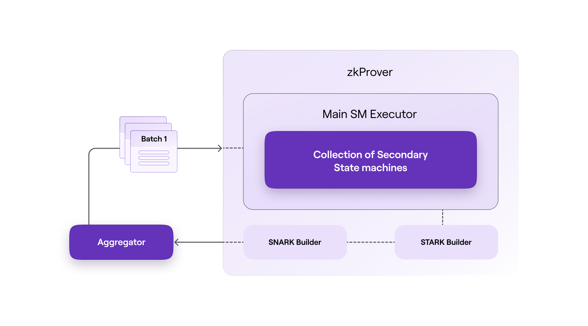

Схема взаимодействия ноды с базой данных:


Как показано на схеме потока выше, вся взаимодействие работает в 4 этапа.

1 → Узел отправляет содержимое деревьев Меркла в базу данных для хранения

2 → Затем узел отправляет входящие транзакции в zkProver

3 → zkProver получает доступ к базе данных и извлекает необходимую информацию для создания проверяемых доказательств транзакций, отправленных узлом. Эта информация включает в себя корни Меркла, ключи и хеши и другую информацию.

4 → Затем zkProver генерирует доказательства транзакций и отправляет эти доказательства обратно узлу

Однако это лишь верхушка айсберга в том, что делает zkProver. В процесс создания этих проверяемых доказательств транзакций вовлечено гораздо больше деталей. Более детальную информацию о работе этого модуля можете посмотреть [тут](https://wiki.polygon.technology/docs/zkevm/zkProver/zkprover-design/)

### **zkEVM Bridge**

Пользователи могут вносить активы из Ethereum и совершать транзакции вне сети на Polygon zkEVM. Для перемещения активов по цепочкам (L1 ↔ zkEVM) вам понадобится использовать zkEVM Bridge. Интерфейс моста доступен как для бета-версии основной сети, так и для тестовой сети. Кроме того, мост в L2 позволяет использовать собственный механизм для миграции активов  между различными сетями L2.

Ниже показана схема работы моста.

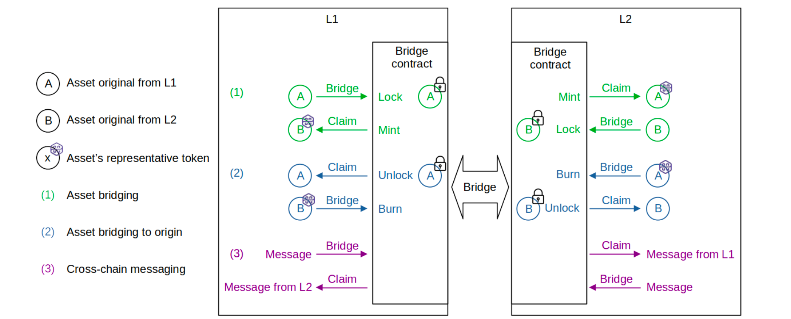

Важный нюанс, это то, что в процессе работы с мостом (bridge), действие "claim" (запрос) используется для получения средств на L2/L1 после их перевода с L1/L2. Это связано с механизмами безопасности и верификации транзакций:

Депозит Эфира: Сначала пользователь отправляет эфир с L1 (основной сети Ethereum) на L2 через zkEVM Bridge dApp.

Ожидание globalExitRoot: После депозита нужно дождаться публикации globalExitRoot на L2, что является частью процесса верификации.

Выполнение Claim на L2: Пользователь затем выполняет операцию "claim" на L2, чтобы фактически получить доступ к своим средствам.

Этот процесс обеспечивает дополнительный уровень безопасности и верификации для транзакций между L1 и L2.

Ниже картинка которая показывает как происходит клейм транзакции после перевода средств с тестнета на zk evm polygon testnet.

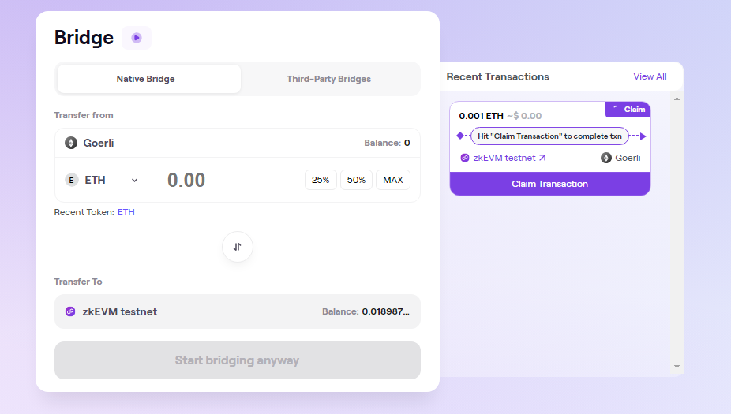

## zkEVM Протокол

Давайте более детально разберемся, как работает протокол.

### Управления состояниями

Следует объяснить, как протокол Polygon zkEVM управляет состояниями L2 Rollup, обеспечивая при этом проверяемость и безопасность перехода между состояниями.

Доверенный секвенсор генерирует пакеты, но для быстрого достижения окончательности транзакций L2 и избежания необходимости ожидания следующего блока L1, они передаются узлам сети L2 через канал вещания. Каждый узел будет выполнять пакеты для локального вычисления результирующего состояния L2.

Как только Доверенный секвенсор зафиксирует последовательности пакетов, полученных непосредственно с L1, узлы сети L2 будут выполнять их снова, и им больше не придется доверять ему.

Выполненные пакеты вне блокчейна в итоге будут подвергнуты проверке в самом блокчейне с использованием Zero-Knowledge Proof, после чего корень состояния L2, полученный в результате, будет зафиксирован. По мере развития протокола zkEVM, узлы сети второго уровня (L2) будут напрямую получать обновления о состоянии сети из узлов первого уровня (L1). Это означает, что данные о состоянии блокчейна будут передаваться и обновляться между двумя уровнями сети, улучшая связь и синхронизацию между ними.

Это означает, что как доступность данных, так и проверка выполнения транзакций полностью зависят от предположений о безопасности первого уровня (L1). На заключительном этапе протокола узлы будут полагаться исключительно на данные, присутствующие в L1, для поддержания синхронизации с каждым переходом состояния второго уровня (L2). Это подчеркивает важность и надежность L1 в обеспечении безопасности и целостности всей системы.

На диаграмме ниже можно увидеть каким образом L2 ноды получают пакеты транзакций.

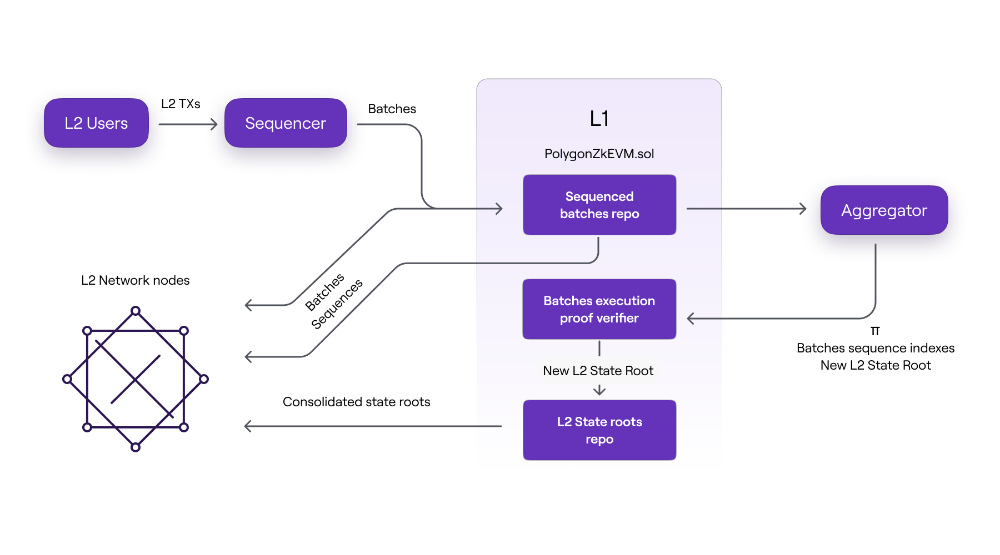

 - Непосредственно из доверенного секвенсора до того, как пакеты будут переданы в L1, или
 - Прямо из L1 после секвенирования партий или
 - Только после того, как корректность исполнения будет доказана Агрегатором и проверена контрактом PolygonZkEVM.sol.

Стоит отметить, что три формата пакетных данных принимаются узлами L2 в хронологическом порядке, указанном выше.


Давайте детально разберемся, что за три состояния пакетов(Можно еще раз посмотреть на диаграмму выше).

Существуют три стадии состояния L2, каждая из которых соответствует трём различным способам обновления состояния узлами L2. Все три случая зависят от формата данных пакета, используемых для обновления состояния L2.

Доверенное состояние (Trusted State): На первой стадии обновление происходит исключительно на основе информации (то есть пакетов, состоящих из упорядоченных транзакций), поступающей непосредственно от Доверенного Секвенсора, до того как данные станут доступны в L1.

Виртуальное состояние (Virtual State): На второй стадии обновление базируется на информации, полученной из сети L1 узлами L2. Это происходит после того, как пакеты были упорядочены(секвенированы) и данные стали доступны в L1.

Консолидированное состояние (Consolidated State): На последней стадии информация, используемая для обновления состояния L2, включает проверенные доказательства с нулевым разглашением (zero-knowledge proofs) вычислительной целостности. То есть после того, как доказательство с нулевым разглашением успешно проверено в L1, узлы L2 синхронизируют свой локальный корень состояния L2 с тем, который зафиксирован в L1 доверенным Агрегатором.

На рисунке ниже изображена временная шкала стадий состояния L2 с точки зрения обработки пакетов, а также действия, которые запускают переход от одной стадии к другой.

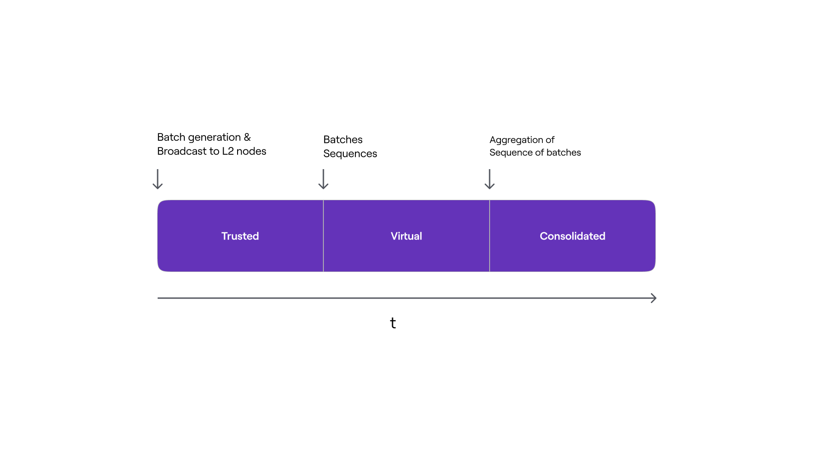

### Жизненный цикл транзакций

В этом разделе подробно описаны различные формы и этапы, которые проходят транзакции пользователей L2, с момента их создания в кошельках пользователей до момента их окончательной проверки неоспоримыми доказательствами на L1.

#### Отправление транзакции

Транзакции в сети Polygon zkEVM создаются в кошельках пользователей и подписываются их приватными ключами.

После создания и подписания транзакции отправляются на узел Trusted Sequencer через интерфейс JSON-RPC. Затем транзакции сохраняются в пуле ожидающих транзакций, где они ожидают выбора Sequencer для выполнения или отмены.

Пользователи и zkEVM общаются с помощью JSON-RPC, который полностью совместим с Ethereum RPC. Такой подход позволяет любому EVM-совместимому приложению, например программному обеспечению кошелька, функционировать и чувствовать себя как настоящие пользователи сети Ethereum.

**Транзакции и блоки на zkEVM**

Важно отметить, что в текущей конструкции zk evm, одна транзакция эквивалентна одному блоку.

Каким образом это может улучшить работу в блокчейне?

Упрощение коммуникации: Обычно в блокчейнах множество транзакций группируются в блоки. Но в этом случае каждая транзакция сама по себе образует блок. Это может упростить процесс передачи данных между узлами сети.

Совместимость с инструментами: Поскольку каждая транзакция является отдельным блоком, это может улучшить совместимость с существующими инструментами и приложениями, которые уже приспособлены для работы с блоками.

Быстрая окончательность: В традиционных блокчейнах подтверждение транзакции может занять некоторое время, поскольку она должна быть включена в блок, а затем этот блок должен быть подтвержден сетью. Если каждая транзакция является отдельным блоком, это может ускорить процесс подтверждения транзакций на втором уровне (L2).

Упрощение поиска транзакций: Поскольку каждая транзакция является отдельным блоком, локализовать конкретную транзакцию в блокчейне может быть проще, так как не требуется просматривать множество транзакций внутри одного блока.

Это отражает уникальный подход к обработке транзакций в сети zkEVM, который может обеспечивать высокую производительность и удобство для пользователей.

Таким образом эта стратегия проектирования не только улучшает связь RPC и P2P между узлами, но также повышает совместимость с существующими инструментами и обеспечивает быструю завершенность на уровне L2. Это также упрощает процесс обнаружения пользовательских транзакций.

#### Выполнение транзакции и доверенное состояние

Доверенный секвенсор считывает транзакции из пула и решает, отбросить их или упорядочить и выполнить. Выполненные транзакции добавляются в пакет транзакций, а локальное состояние L2 секвенсора обновляется.

Как мы ранее говорили, как только транзакция добавляется в состояние L2, она передается всем остальным узлам zkEVM через службу широковещания. Стоит отметить, что, полагаясь на Trusted Sequencer, мы можем добиться быстрого завершения транзакции (быстрее, чем в L1). Однако полученное состояние L2 будет находиться в доверенном(Trusted) состоянии до тех пор, пока пакет не будет зафиксирован в консенсусном контракте.

Пользователи обычно взаимодействуют с доверенным состоянием L2. Однако из-за определенных характеристик протокола процесс проверки транзакций L2 (для возможности вывода средств на L1 ) может занять много времени, обычно около 30 минут, но в редких случаях до недели.

Вы спросите, что это за редкие случаи?

**Редкий случай**

 - Проверка транзакций на L1 займет 1 неделю только в том случае, если активировано Emergency State или агрегатор вообще не пакетирует никаких доказательств.
 - Кроме того, аварийный режим активируется, если секвенированная партия не агрегируется (не обрабатывается агрегатором) в течение 7 дней. Более детально про Emergency State можете посмотреть [тут](https://wiki.polygon.technology/docs/zkevm/protocol/emergency-state/)

В результате пользователи должны быть внимательны к потенциальным рискам, связанным с транзакциями высокой стоимости, особенно теми, которые нельзя отменить, такими как вывод средств, внебиржевые транзакции и альтернативные мосты.

#### Пакетная обработка транзакций

Доверенный секвенсор должен группировать транзакции, используя следующую структуру BatchData, указанную в контракте `PolygonZkEVM.sol`:

```solidity
struct BatchData {
  bytes transactions;
  bytes32 globalExitRoot;
  uint64 timestamp;
  uint64 minForcedTimestamp;
}
```

**Transactions**

Этот параметр представляет из себя закодированные транзакции которые последовательно объеденины.

Каждая транзакция кодируется в соответствии с форматами Ethereum pre-EIP-155 или EIP-155   используя RLP (Recursive-length prefix)

**GlobalExitRoot**

Этот корень является Bridge's Global Exit Merkle Tree, который будет синхронизирован со состоянием L2 в начале выполнения пакета.

**Timestamp**

Поскольку блоки Ethereum имеют временные метки, каждая партия имеет временную метку.

Существует два ограничения, которым должна удовлетворять каждая временная метка, чтобы гарантировать, что пакеты упорядочены по времени и синхронизированы с блоками L1;

- Временная метка данного пакета должна быть больше или равна временной метке последнего секвенированного пакета.
- Максимальная временная метка пакета, которую доверенный секвенсор может установить для пакета, — это временная метка блока, в котором выполняется транзакция упорядочивания(секвенирования) L1.

**MinForcedTimestamp**

Если партия является так называемой принудительной партией, этот параметр должен быть больше нуля. Цензуре противостоят с помощью принудительных партий. Подробнее об этом в следующих разделах.

#### Пакетное секвенирование и виртуальное состояние

Пакеты необходимо упорядочить и проверить, прежде чем они смогут стать частью виртуального(Virtual) состояния L2.

Trusted Sequencer успешно добавляет пакет к последовательности пакетов, используя сопоставление(mapping) SequencedBatches контракта L1 PolygonZkEVM.sol, которое по сути представляет собой структуру хранения, содержащую очередь последовательностей, определяющих виртуальное состояние.

```solidity
// SequenceBatchNum --> SequencedBatchData
mapping(uint64 => SequencedBatchData) public sequencedBatches;
```
Соответственно, чтобы секвенировать, Trusted Sequencer вызывает функцию  sequenceBatches, которая принимает в качестве аргумента массив из BatchData.

```solidity
function sequenceBatches ( 
    BatchData[] memory batches
) public ifNotEmergencyState onlyTrustedSequencer
```
На рисунке ниже показана логическая структура последовательности пакетов.

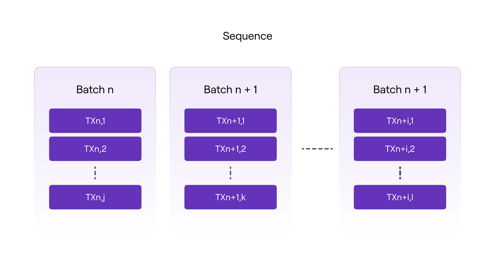

**Максимальный и минимальный размер пакета**

Открытая константа контракта MAX TRANSACTIONS BYTE LENGTH определяет максимальное количество транзакций, которые могут быть включены в пакет (300 000).

Аналогично, количество пакетов в последовательности (пакетов для для одного секвенирования) ограничено общедоступной константой контракта MAX VERIFY BATCHES (1000). Массив пакетов должен содержать хотя бы один пакет, но не более значения константы MAX VERIFY BATCHES.

Как мы видим из кода выше, только учетная запись Ethereum доверенного секвенсора может получить доступ к сопоставлению SequencedBatches. Также необходимо, чтобы контракт консенсуса не находился в аварийном состоянии.

**Проверка пакетов и целостности состояния**

Достоверность Пакетов (Batch Validity): Это обозначает процесс проверки и удостоверения того, что каждый пакет данных, который обрабатывается или передается в сети L2, является законным и соответствует установленным критериям и правилам. Это включает в себя проверку правильности транзакций в пакете, их порядка, а также подлинности и соответствия протоколу.

Целостность Состояния L2 (L2 State Integrity): Этот аспект касается поддержания и защиты точного и непрерывного состояния сети второго уровня. Целостность состояния гарантирует, что все записи и изменения в сети L2 отражают действительные транзакции и взаимодействия, обеспечивая надежность и точность данных в блокчейне.

Давайте разберемся что происходит при вызове функции sequenceBatches.
Функция перебирает каждый пакет последовательности, проверяя его достоверность. 

Достоверный пакет должен соответствовать следующим критериям:

 - Он должен включать значение globalExitRoot, которое присутствует в GlobalExitRootMap bridge's L1 PolygonZkEVMGlobalExitRoot.sol контракта. Пакет действителен, только если он включает действительный globalExitRoot.
 - Длина массива байтов транзакций должна быть меньше значения константы MAX_TRANSACTIONS_BYTE_LENGTH.
 - Временная метка пакета должна быть больше или равна временной метке последнего секвенированного пакета, но меньше или равна временной метке блока, в котором выполняется транзакция упорядочивания L1. 

Получается, что если один пакет недействителен, транзакция отменяется, отбрасывая всю последовательность. В противном случае, если все партии, подлежащие секвенированию, действительны, процесс секвенирования продолжится.

Транзакции, которые были частью отклоненного пакета, не "потеряются" окончательно. Вместо этого они могут быть повторно отправлены или включены в последующие пакеты для обработки. В системе, где безопасность и целостность данных являются приоритетами, такой подход помогает предотвратить включение недействительных или мошеннических транзакций в блокчейн.

В контракте существует переменная хранения, называемая LastBatchSequenced, используется в качестве счетчика пакетов и, таким образом, увеличивается при каждом упорядочивании пакета. Каждой партии присваивается определенный порядковый номер, который будет использоваться в качестве значения позиции в цепочке пакетов.

Тот же механизм хеширования, который используется в блокчейнах для связи одного блока с другим, используется в пакетах для обеспечения криптографической целостности цепочки пакетов. То есть, включая digest предыдущего пакета в данные, используемые для вычисления digest следующего пакета.

В результате дайджест(digest) данного пакета представляет собой накопленный хэш всех ранее упорядоченных пакетов, отсюда и название «накопленный хэш пакета». Он обозначается как oldAccInputHash для старого и newAccInputHash для нового.

Накопленный хеш конкретного пакета имеет следующую структуру:

```solidity
keccak256 ( 
    abi.encodePacked (
        bytes32 oldAccInputHash, 
        keccak256(bytes transactions), 
        bytes32 globalExitRoot ,
        uint64 timestamp ,
        address seqAddress
    )
)
```

 - `oldAccInputHash` это накопленный хеш предыдущего секвенированного пакета,
 - `keccack256(transactions)` это дайджест Keccak массива байтов транзакций,
 - `globalExitRoot` является корнем Bridge’s Global Exit Merkle Tree,
 - `timestamp` это временная метка пакета,
 - `seqAddress` это адрес пакетного секвенсора.

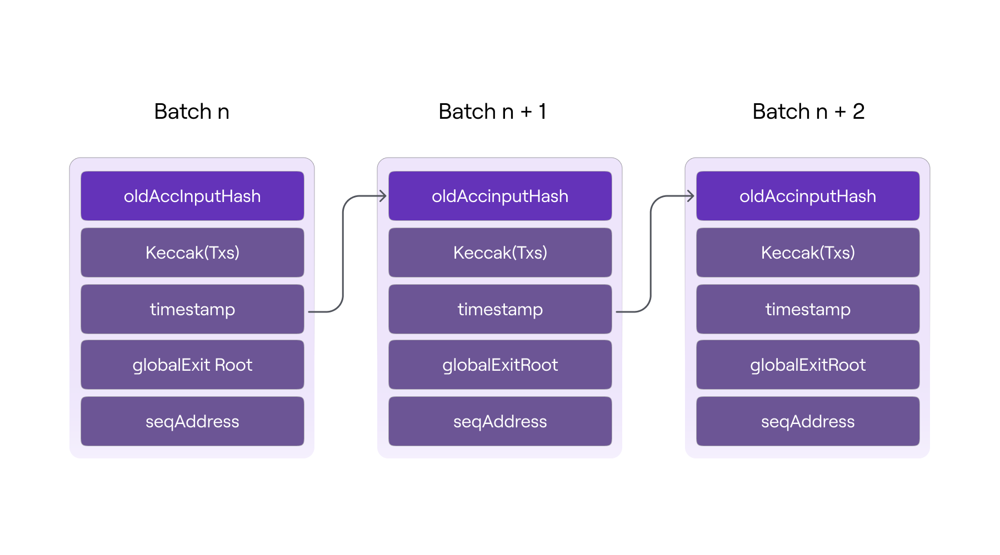

Как показано на диаграмме выше, каждый накопленный входной хеш обеспечивает целостность данных текущего пакета (т. е. транзакций, временной метки и globalExitRoot), а также порядка, в котором они были упорядочены.

Таким образом, последовательность пакетов добавляется к сопоставлению(mapping) SequencedBatches с использованием следующей структуры SequencedBatchData только после проверки достоверности всех пакетов в последовательности и вычисления накопленного хеша каждого пакета.

```solidity
// SequenceBatchNum --> SequencedBatchData
mapping(uint64 => SequencedBatchData) public sequencedBatches;

struct SequencedBatchData {
    bytes32 accInputHash;
    uint64 sequencedTimestamp;
    uint64 previousLastBatchSequenced;
}
```

Рассмотрим каждый параметр:

`AccInputHash` — это уникальный криптографический отпечаток последнего пакета в последовательности.
`SequencedTimestamp` — это временная метка блока, в котором выполняется транзакция секвенирования L1.
`previousLastBatchSequenced` — это индекс последнего секвенированного пакета перед первым пакетом текущей последовательности (т. е. последнего пакета в предыдущей последовательности).

Таким образом для генерации уникального ключа используется кол-во всех последовательных пакетов и количество пакетов в текущей последовательности, а структура SequencedBatchData используется в качестве значения, когда последовательность будет введена в сопоставление(маппинг) SequencedBatches.

Рекомендую посмотреть метод sequenceBatches в [смарт-контракте](https://etherscan.io/address/0xb1585916487acedd99952086f2950763d253b923#code#F15#L483) для большего понимания процесса.


#### Минимальное хранилище пакетных данных

Поскольку операции по хранению в L1 очень затратны с точки зрения потребления газа, крайне важно использовать его как можно меньше. Для этого слоты памяти (или записи сопоставления) используются исключительно для хранения фиксации последовательности.

```solidity
// SequenceBatchNum --> SequencedBatchData
mapping(uint64 => SequencedBatchData) public sequencedBatches;

struct SequencedBatchData {
    bytes32 accInputHash;
    uint64 sequencedTimestamp;
    uint64 previousLastBatchSequenced;
}
```

Каждая запись сопоставления (маппинг) фиксирует два пакетных индекса:

- последний пакет предыдущей последовательности как значение структуры SequencedBatchData;
- последний пакет текущей последовательности в качестве ключа сопоставления (маппинга)

Важно отметить, что сохраняется только накопленный хэш последней партии в последовательности(accInputHash); все остальные вычисляются на лету, чтобы получить последнее.

Получается, что доступность данных транзакций L2 гарантируется, поскольку данные каждого пакета могут быть восстановлены из данных вызова транзакции секвенирования, которые не являются частью хранилища контракта, но являются частью состояния L1.

И в конце функции секвенирования, будет создано событие:

```solidity
event SequenceBatches (uint64 indexed numBatch)
```

Как только пакеты будут успешно секвенированы в L1, все узлы zkEVM смогут синхронизировать свое локальное состояние L2, получая данные непосредственно из контракта L1 PolygonZkEVM.sol, без необходимости полагаться только на Trusted Sequencer. Так достигается виртуальное состояние L2.

#### Пакетная агрегация и консолидированное состояние

И наконец, переходим к последней части, когда доверенный агрегатор должен в конечном итоге агрегировать последовательности пакетов, ранее переданных доверенным секвенсором, чтобы достичь заключительного этапа состояния L2, то есть консолидированного состояния.

Агрегация последовательности означает успешное добавление результирующего корня состояния L2 к сопоставлению (маппингу) `batchNumToStateRoot` в контракте L1 «PolygonZkEVM.sol». Это структура хранения, содержащая все консолидированные корни состояний L2, ключом которых является индекс последнего пакета каждой агрегированной последовательности пакетов.

```solidity
// BatchNum --> state root
mapping (uint64 => bytes32) public batchNumToStateRoot;
```

Агрегатор получает всю информацию о транзакциях от секвенсора и отправляет ее в Prover, который обеспечивает небольшое zk-доказательство после сложных полиномиальных вычислений. Смарт-контракт подтверждает это доказательство. Таким образом, агрегатор собирает данные, отправляет их проверяющему, получает их выходные данные и, наконец, отправляет информацию в смарт-контракт, чтобы проверить правильность доказательства действительности от проверяющего.​

Внутри Prover, используется более сложные механизмы для генерации доказательств, такие как `SNARK` и `STARK`

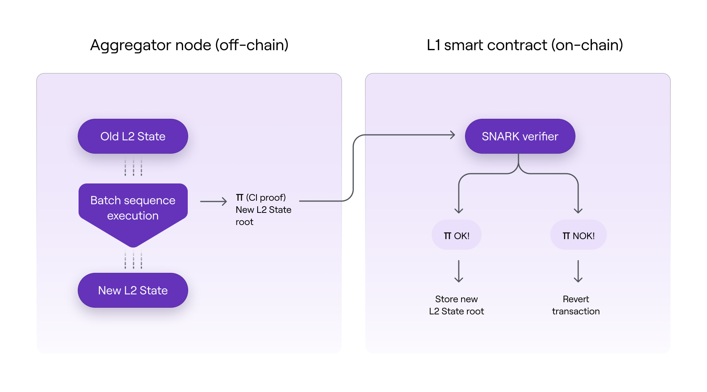

В результате целостность исчерпывающего вычисления можно проверить, используя часть вычислительных ресурсов, необходимых для исходного вычисления. Используя схему SNARK, мы можем обеспечить безопасность в on-chain для исчерпывающих вычислений off-chain экономичным способом. Для любопытных, вы можете посмотреть целый огромный [раздел](https://wiki.polygon.technology/docs/zkevm/zkProver/intro-stark-recursion/) в документации, который поясняет как работает модуль Prover.

Как показано на диаграмме выше, выполнение пакетов вне цепочки предполагает переход состояния L2 и, следовательно, переход на новый корень состояния L2.

Для того чтобы агрегировать последовательности пакетов, доверенный агрегатор должен вызвать метод `verifyBatchesTrustedAggregator` на контракте консенсуса:

В результате выполнения функции, будет создан ивент:

```solidity
emit VerifyBatchesTrustedAggregator(
            finalNewBatch,
            newStateRoot,
            msg.sender
        );
```

После того как пакеты были успешно агрегированы в L1, все узлы zkEVM могут проверить свое локальное состояние L2, извлекая и проверяя консолидированные корни непосредственно из Консенсусного контракта L1 (PolygonZkEVM.sol). В результате было достигнуто консолидированное состояние L2.

### Механизм стимулирования zkEVM

Чтобы обеспечить устойчивость системы, участники должны получать вознаграждение за правильное выполнение своих ролей и придание протоколу окончательности. В данный момент, на ранних стадиях протокол имеет централизованных секвенсеров и агрегаторов, но в будущем, протокол планирует сделать их децентрализованными. По этой причине в данный момент они называются Trusted aggregator или Trusted Sequencer.

Следует указать, консенсусный смарт-контракт предъявляет следующие требования к секвенаторам и агрегаторам:​:

`Sequencers`:

 - Любой, у кого есть программное обеспечение, необходимое для запуска узла zkEVM, может стать секвенсором.
 - Каждый секвенсор должен заплатить комиссию в виде токенов MATIC, чтобы получить право создавать и предлагать пакеты.
 - Секвенсер, предлагающий действительные пакеты (которые состоят из действительных транзакций), поощряется комиссией, уплачиваемой запрашивающими транзакции или пользователями сети.​

 `Aggregators`:

 - Задача агрегатора — предоставить доказательства достоверности транзакций L2, предлагаемых секвенсорами.
 - Помимо запуска программного обеспечения zkNode от zkEVM, агрегаторам необходимо иметь специализированное оборудование для создания доказательств достоверности с нулевым разглашением с использованием zkProver.
 - Для данной партии или партий агрегатор, который предоставляет подтверждение действительности, первым получает комиссию MATIC (которая уплачивается секвенатором партии).
 - Агрегаторам необходимо указать свое намерение проверить транзакции. После этого они соревнуются за предоставление доказательств достоверности на основе своей собственной стратегии.

Далее, необходимо рассмотреть структуру стимулирования агрегаторов и секвенсеров

**Структура стимулирования:**

`Sequencer`:

- Собирает транзакции и группирует их в пакет
- Получает комиссии от опубликованных транзакций
- Платит комиссию за транзакцию L1 + MATIC (зависит от ожидающих пакетов)
- MATIC переходит к агрегаторам
- Выгодно, если: комиссия за txs > вызов L1 + комиссия MATIC

`Aggregator`:

- Обрабатывает транзакции, опубликованные Sequencers
- Генерирует zkProof
- Получает MATIC от секвенсора
- Статическая стоимость: стоимость вызова L1 + стоимость сервера (для построения доказательства)
- Выгодно, если: плата MATIC > вызов L1 + стоимость сервера


Чтобы обеспечить устойчивость системы, участники должны получать вознаграждение за правильное выполнение своих ролей и придание протоколу окончательности. Если не указано иное, представленные здесь меры и правила применяются к случаям, когда роли секвенсора и агрегатора децентрализованы (т. е. когда нет ни доверенного секвенсора, ни доверенного агрегатора).

## Сопротивления сбою в работе

### Секвенсор

Пользователи должны полагаться на доверенный секвенсор для выполнения своих транзакций на уровне L2. Однако пользователи могут включать свои транзакции в принудительный пакет, если они не могут выполнить их через Trusted Sequencer.

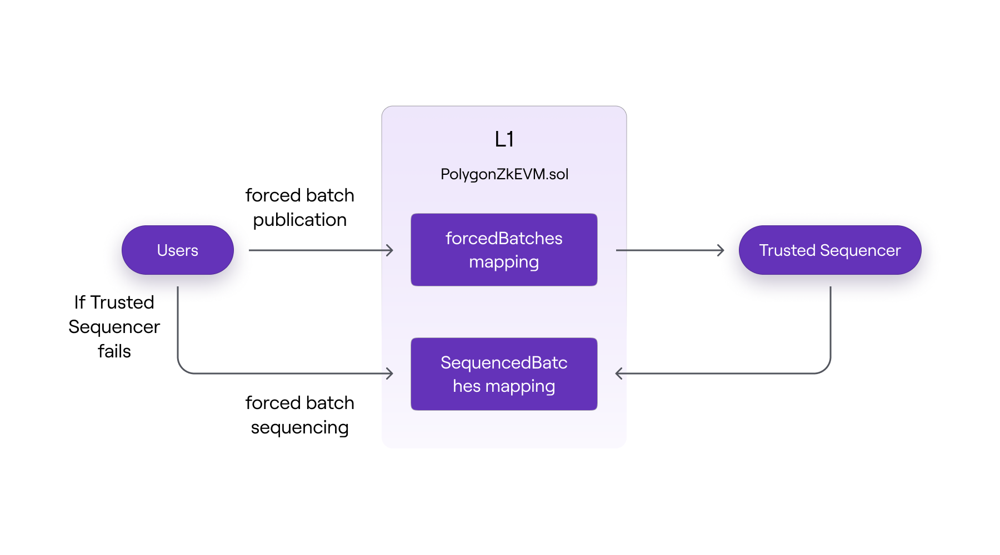

На схеме выше, можно увидеть, что пользователи могут напрямую отправлять пакеты транзакций в L1 консенсус контракт, где они передаются доверенному секвенсору и далее секвенируются.
Если по какой из причин транзакция пользователя не могут выполнить свои транзакции через секвенсора, они также могут отослать пакет транзакций для секвенирования в L1 контракт консенсуса.

Получается, что доверенный секвенатор будет включать эти принудительные пакеты в будущие последовательности, чтобы сохранить свой статус доверенного объекта. В противном случае пользователи смогут продемонстрировать, что их подвергают цензуре, и статус доверия Trusted Sequencer будет аннулирован.

### Агрегатор

Точно так же, как система не может достичь завершенности состояния L2 без активного и хорошо функционирующего секвенсора, не может быть окончательности без активного и хорошо функционирующего агрегатора.

Отсутствие или сбой доверенного агрегатора означает, что переходы между состояниями L2 никогда не обновляются в L1. По этой причине в контракте L1 PolygonZkEVM.sol есть функция verifyBatches, которая позволяет любому агрегировать последовательности пакетов. Более детально можете почитать [тут](https://wiki.polygon.technology/docs/zkevm/protocol/aggregator-resistance/).

### Состояние аварийности zkEVM

Аварийное состояние — это состояние консенсусного контракта (PolygonZkEVM.sol и PolygonZkEVMBridge.sol), которое при активации прекращает пакетное секвенирование и операции моста. 

Цель включения аварийного состояния — позволить команде Polygon решать случаи нарушения работоспособности или эксплуатации любых ошибок смарт-контрактов. Это мера безопасности, используемая для защиты активов пользователей в zkEVM.

Следующие функции будут отключены в аварийном режиме:

`sequenceBatches`
`verifyBatches`
`forceBatch`
`sequenceForceBatches`
`proveNonDeterministicPendingState`

Изучить, кто и когда может использовать аварийный режим можно [тут](https://wiki.polygon.technology/docs/zkevm/protocol/emergency-state/).

## zkASM как микропроцессор 

Polygon ZK EVM представляет собой революционный подход к масштабированию Ethereum, позволяя использовать стандартный код смарт-контрактов Ethereum (EVM байт-код) в новой, более эффективной среде. Давайте разберемся, как это работает.

Все транзакции в Ethereum можно представить как переходы между разными состояниями. Это похоже на игру в шахматы, где каждый ход меняет расстановку фигур.

Ниже представлена ​​блок-схема базового однопроцессорного компьютера. Черные линии обозначают поток данных, тогда как красные линии обозначают поток управления; стрелки указывают направления потока.

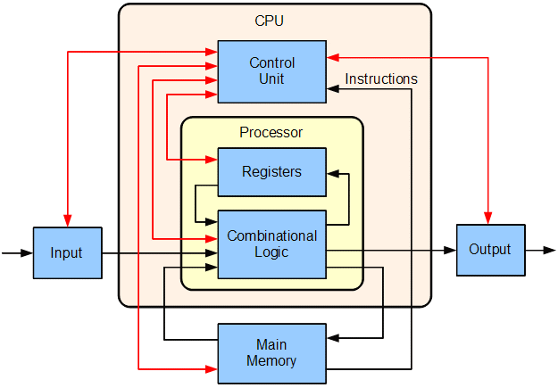

На схеме, Ethereum представлен как микропроцессор (сердце компьютера), который исполняет команды (опкоды) смарт-контрактов. Помогает ему в этом zkASM.

`Zero-Knowledge Assembly (zkASM)` – это специальный язык, который действует как инструкция для этого "микропроцессора". Он помогает переводить стандартный код Ethereum в формат, который можно эффективно обработать, сохраняя при этом конфиденциальность данных.

На входе микропроцессор будет принимать транзакции, которые мы хотим обработать, и старое состояние. После получения входных данных ПЗУ используется для интерпретации транзакций и генерации на их основе нового состояния (выходных данных). Посмотрите на диаграмму ниже для лучшей визуализации.

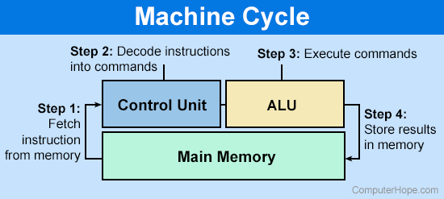

Это похоже на переводчика, который помогает двум людям с разным языком общаться друг с другом. В результате Polygon ZK EVM позволяет использовать уже существующие смарт-контракты Ethereum, одновременно предлагая преимущества новой технологии, такие как более высокая скорость обработки и повышенная конфиденциальность.
Для более детальную информации о работе, можно посмотреть [тут](https://wiki.polygon.technology/docs/category/zk-assembly/).

## Разница между Polygon Pos и zkEVM Polygon

**Решение для масштабирования**

Polygon PoS в основном использует платформу Plasma и механизм консенсуса Proof-of-Stake (PoS) для создания sidechain, которая работает параллельно с основной сетью Ethereum. Polygon zkEVM, с другой стороны, использует архитектуру ZK-Rollup, которая использует доказательства с нулевым разглашением для предоставления решения уровня 2 поверх Ethereum.

**Механизм консенсуса**

Polygon PoS опирается на набор валидаторов, которые участвуют в механизме консенсуса PoS для проверки и подтверждения транзакций в sidechain. Polygon zkEVM использует консенсусный контракт, который поддерживает беспрепятственное участие нескольких координаторов (секвенаторов и агрегаторов) для создания и проверки пакетов на уровне L2.

**Доступность данных**

В сети Polygon PoS данные хранятся на сайдчейне, который предоставляет отдельную блокчейн-систему для обработки транзакций. Polygon zkEVM предлагает два варианта доступности данных в рамках гибридной схемы: Validium (данные хранятся вне цепочки) и Volition (данные и доказательства их правильности находятся в цепочке для некоторых транзакций, а для других - только доказательства).

**Совместимость смарт-контрактов**

Polygon PoS — это сайдчейн, который обеспечивает совместимость с EVM (Ethereum Virtual Machine). Это позволяет разработчикам развертывать и запускать смарт-контракты Ethereum на сайдчейне Polygon PoS. Однако совместимость с EVM подразумевает, что, несмотря на поддержку смарт-контрактов Ethereum, могут быть некоторые различия в среде исполнения. В результате в редких случаях при работе со сложными децентрализованными приложениями (dapps) и кодом низкого уровня разработчикам может потребоваться адаптация или использование специфических для сайдчейна функций при работе с Polygon PoS.

В отличие от этого, Polygon zkEVM представляет собой ZK-Rollup, который фокусируется на достижении эквивалентности EVM. Эквивалентность EVM подразумевает более высокий уровень совместимости с Ethereum, позволяя существующим смарт-контрактам Ethereum разворачиваться и работать на Polygon zkEVM без каких-либо изменений. Разработчикам не нужно менять языки или инструменты, и они могут испытать бесшовный переход при развертывании своих смарт-контрактов на эквивалентном EVM rollup. Эквивалентность EVM фактически воссоздает всю среду исполнения Ethereum.

Ключевое отличие заключается в том, что эквивалентность EVM, предлагаемая Polygon zkEVM, обеспечивает "меньше трения" по сравнению с совместимостью EVM, предлагаемой Polygon PoS. Polygon zkEVM разработан для обеспечения прозрачного развертывания и полной совместимости с Ethereum, позволяя разработчикам сохранять тот же рабочий процесс разработки, что и на Ethereum, без необходимости каких-либо изменений или повторной реализации кода. Вкратце, Polygon zkEVM фокусируется на создании почти идеальной копии среды исполнения Ethereum, в то время как Polygon PoS фокусируется на предложении совместимости со смарт-контрактами Ethereum в контексте сайдчейна.

**Безопасность**

Polygon PoS полагается на свои валидаторы PoS для защиты сайдчейна, которая работает независимо от Ethereum. Polygon zkEVM наследует безопасность основной сети Ethereum, публикуя доказательства достоверности в цепочке, гарантируя, что вычисления вне цепочки являются правильными и безопасными.

**Завершенность транзакции**

Сайдчейны Polygon PoS обеспечивают быстрое завершение транзакции с относительно низкими комиссиями за транзакцию. Polygon zkEVM использует доказательства с нулевым разглашением, чтобы обеспечить быструю завершенность транзакций вне сети, одновременно сокращая задержки и комиссии.

**Заключение**

Хотя и Polygon PoS, и Polygon zkEVM предоставляют решения масштабирования уровня 2 для Ethereum, они различаются по своей архитектуре, механизмам консенсуса, параметрам доступности данных и деталям реализации. Polygon zkEVM, в частности, использует технологию ZK-Rollup для достижения улучшенной масштабируемости, безопасности и эквивалентности EVM, обеспечивая при этом быструю завершенность транзакции.

## Стратегия эффективности блокчейна

- Первая стратегия заключается в развертывании консенсусного контракта, который стимулирует наиболее эффективных агрегаторов участвовать в процессе генерации доказательств.
- Вторая стратегия — выполнять все вычисления вне блокчейна, сохраняя в блокчейне только необходимые данные и zk-доказательства.
- Способ реализации смарт-контракта моста, например расчет счетов методом [UTXO](https://wiki.polygon.technology/docs/zkevm/protocol/exit-tree/)
- Использование специализированных криптографических примитивов в zkProver для ускорения вычислений и минимизации размеров доказательства, применимое через:
    - Запуск специального языка ассемблера с нулевым разглашением (zkASM) для интерпретации байт-кодов.
    - Использование инструментов с нулевым разглашением, таких как zk-STARK, для целей доказательства; эти доказательства выполняются очень быстро, хотя и больше по размеру.
    - Вместо публикации большого размера доказательств zk-STARK в качестве доказательств достоверности, zk-SNARK используется для подтверждения правильности доказательств zk-STARK. Эти zk-SNARK, в свою очередь, публикуются в качестве доказательства достоверности изменений состояния. Это помогает снизить затраты на газ с 5 миллионов до 350 тысяч. Более детально [тут](https://wiki.polygon.technology/docs/zkevm/zkProver/intro-stark-recursion/)


## Разработка контрактов

Разработка, тестирование/деплой контракта и использование современных инструментов разработки очень важная часть в современном мире.
Из-за того что zkEVM Polygon основан на EVM ethereum, разработка практически идентична разработке в EVM блокчейне. Так же можно без проблем использовать популярные инструменты: remix, foundry, hardhat.

Существуют небольшие различия между EVM и ZkEVM:

Список включает в себя поддерживаемые EIPs, операции и дополнительные изменения, внесенные для создания zkEVM.
Различия не влияют на опыт разработчика zkEVM по сравнению с EVM. Техники оптимизации газа, взаимодействие с библиотеками, такими как Web3.js и Ethers.js, и развертывание контрактов работают беспрепятственно на zkEVM без каких-либо издержек.

**Opcodes**

- `SELFDESTRUCT` → удален и заменен на SENDALL.
- `EXTCODEHASH` → возвращает хэш байт-кода контракта из дерева состояний zkEVM без проверки, содержит ли контракт код.
- `DIFFICULTY` → возвращает "0" вместо случайного числа, как в EVM.
- `BLOCKHASH` → возвращает все предыдущие хэши блоков, а не только последние 256 блоков.
- `NUMBER` → возвращает количество обрабатываемых транзакций.

**Предварительно скомпилированные контракты**

Следующие предварительно скомпилированные контракты поддерживаются в zkEVM:

- ecRecover
- identity

Другие предварительно скомпилированные контракты не влияют на дерево состояний zkEVM и обрабатываются как “revert”, возвращая весь газ предыдущему контексту и устанавливая флаг успеха в "0".

Таким образом следует понимать, что при разработке смарт-контракта, нельзя будет использовать библиотеки которые содержат другие предварительно скомпилированные контракты из [этого](https://www.evm.codes/precompiled?fork=shanghai.) перечня.

**Другие незначительные различия**

- zkEVM не очищает хранилище, когда контракт развертывается по адресу из-за спецификации дерева состояний zkEVM. 
(Это означает, что в zkEVM при развертывании нового контракта по уже существующему адресу, данные, ранее хранившиеся по этому адресу, не удаляются автоматически. В традиционном EVM при развертывании контракта по адресу, где уже существовал контракт, старые данные удаляются. Однако в zkEVM, из-за спецификации его дерева состояний, это не происходит, и старые данные остаются в хранилище. )
- Опкод JUMPDEST разрешен внутри байтов push, чтобы избежать анализа байт-кода во время выполнения.
(Это означает, что в zkEVM разрешено использование опкода JUMPDEST внутри данных, передаваемых командами PUSH. В стандартном EVM, JUMPDEST используется для обозначения места в коде, куда может происходить прыжок (JUMP). Обычно, для обеспечения безопасности, во время выполнения контракта проводится анализ байт-кода на наличие корректных JUMPDEST. В zkEVM, позволяя JUMPDEST находиться внутри данных PUSH, упрощается процесс выполнения кода, так как не требуется анализ байт-кода в реальном времени для поиска JUMPDEST. Это ускоряет выполнение контрактов и снижает их сложность.)
- zkEVM реализует EIP-3541 из хардфорка Лондон.
(Это означает, что zkEVM включает в себя реализацию предложения по улучшению Ethereum (EIP) номер 3541, которое было введено в сеть Ethereum во время обновления, известного как хардфорк Лондон. EIP-3541 устанавливает новые правила для структуры смарт-контрактов, запрещая развертывание контрактов, начинающихся с определенного байтового префикса (0xEF), что предотвращает потенциальные конфликты и проблемы совместимости с будущими изменениями в Ethereum.)
- EIP-2718, который определяет тип транзакции с типизированным конвертом, не поддерживается.
(EIP-2718 представляет нововведение в стандарты транзакций Ethereum, вводя концепт оболочки для различных типов транзакций. Это позволяет в сети Ethereum использовать множество новых типов транзакций, каждый из которых может иметь уникальные поля и логику обработки. Тем не менее, в zkEVM Polygon, по состоянию на последние данные, этот стандарт не поддерживается, что означает, что разработчики и пользователи не могут пользоваться расширенными возможностями, которые предлагают типизированные транзакции в рамках этой платформы. Это может влиять на совместимость с некоторыми новыми функциями или контрактами, разработанными для основной сети Ethereum.)
- EIP-2930, который определяет тип транзакции с необязательными списками доступа, не поддерживается​​.
(EIP-2930 – это предложение по улучшению Ethereum, которое вводит новый тип транзакции, содержащей необязательные списки доступа. Эти списки предварительно указывают, к каким учетным записям и хранилищам контрактов будет обращаться транзакция, что позволяет валидаторам заранее знать, какие состояния будут затронуты. Это улучшает эффективность и помогает снизить затраты на газ за счет уменьшения необходимости повторных вычислений. Отсутствие поддержки EIP-2930 в zkEVM означает, что пользователи и разработчики не могут использовать эту функциональность для оптимизации своих транзакций в сети Polygon.)

## Экосистема

Экосистема в DeFi (децентрализованных финансах) на блокчейне играет ключевую роль по нескольким причинам:

- Интеграция и Взаимодействие: В DeFi экосистеме различные продукты и услуги (например, обмены, кредитные платформы, стейкинг) тесно интегрированы и взаимодействуют друг с другом. Это создает более гибкую и эффективную среду, где пользователи могут легко переходить между различными финансовыми инструментами и услугами.
- Постоянно развивающаяся экосистема DeFi способствует появлению инноваций. Новые проекты и идеи могут быть легко интегрированы, что стимулирует технологическое развитие и предложение новых финансовых продуктов.
- Экосистема DeFi увеличивает эффективность рынка, уменьшая затраты и время на проведение транзакций. Высокая степень ликвидности, обеспечиваемая DeFi, также играет важную роль в поддержании здоровой экономической среды.

Для предварительного тестирования контрактов, существует Polygon zkEVM Testnet.
В настоящий момент все больше приложений и сервисов начинают появляться в zkEVM Polygon.например: subgraph, quickswap, pancakeswap, sushiswap, AAVE, gelato  и др.

## Важность для бизнеса

**Улучшенная эффективность**

Бизнес может воспользоваться ускоренной обработкой транзакций и уменьшенными затратами на газ, что делает внедрение блокчейн-технологий более экономически эффективным по отношению к L1 ethereum и Polygon Pos.

**Расширение возможностей**
Поддержка существующих смарт-контрактов Ethereum без изменений открывает перед бизнесом широкие возможности для интеграции с уже существующими блокчейн-решениями.

**Безопасность и конфиденциальность**

Для бизнесов, которым важна безопасность транзакций и конфиденциальность данных, технология zero-knowledge proofs предлагает значительные преимущества.

**Масштабируемость**

Бизнес может рассчитывать на рост и расширение своих блокчейн-приложений без ограничений производительности, связанных с традиционными сетями EVM.

## Плюсы и минусы zkEvm Polygon

### Плюсы

-   Высокий уровень безопасности (сопоставимой c L1)
-   Смарт-контракты практически полностью совместимы, за исключением некоторых precompiled contracts
-   При разработке контрактов возможно использовать инструменты как remix, foundry, hardhat без каких либо проблем
-   Нет необходимости настройки стека для разработки под протокол
-   Стандартный Web3 API (также поддержка стандартных кошельков для Ethereum, например MetaMask)
-   Абстракция учетной записи поддерживаются через ERC-4337
-   Скорость обработки транзакций - транзакции на L2 подтверждаются сразу и на L1 через небольшой промежуток времени (около 30 минут)
-   Низкая комиссия за транзакции
-   Малый размер zkSNARK в L1 для оптимизации затрат пользователей

### Минусы

-   Сохраняется момент неудобства при разработке контрактов, т.к нужно проверять используемые библиотеки как openzeppelin на использование не работающих precompiled contracts. 
-   Несмотря на значительные улучшения в масштабируемости, при очень высоких нагрузках масштабируемость все еще может представлять собой вызов.
-   Как относительно новая технология, она может содержать нерешенные проблемы или неопределенности.

## Вывод

Polygon zkEVM представляет собой значительный прогресс в блокчейн-технологиях, объединяя совместимость с Ethereum и преимущества zero-knowledge proofs. Это открывает новые горизонты для бизнеса в сфере блокчейна, предлагая высокую производительность, масштабируемость, безопасность и экономическую эффективность. Разрабатывать для данного блокчейна практически так же легко как и на обычном EVM блокчейне. Масштабирование которое уже сейчас может помочь уменьшить нагрузку на ethereum и сократить расходы пользователей на газ.

## Ссылки

- [Docs: zkEvm Polygon docs](https://wiki.polygon.technology/docs/zkevm/
)
- [Video tutorials: The ULTIMATE Developers Guide To Polygon zkEVM](https://www.youtube.com/watch?v=pkvgS26VR8E&ab_channel=JarrodWatts)
- [Dashboard: Ecosystem](https://www.alchemy.com/ecosystem/polygon-zkevm)
- [Article: what is polygon zkEVM](https://blog.thirdweb.com/what-is-polygon-zkevm/)
- [Proof of Efficiency](https://ethresear.ch/t/proof-of-efficiency-a-new-consensus-mechanism-for-zk-rollups/11988)
- [The different types of ZK-EVMs](https://vitalik.ca/general/2022/08/04/zkevm.html)

