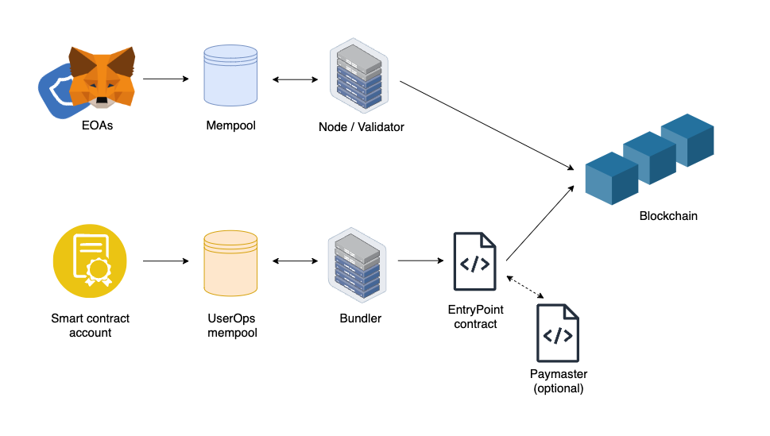
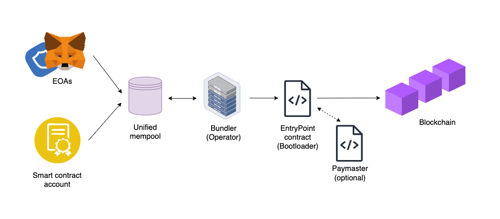
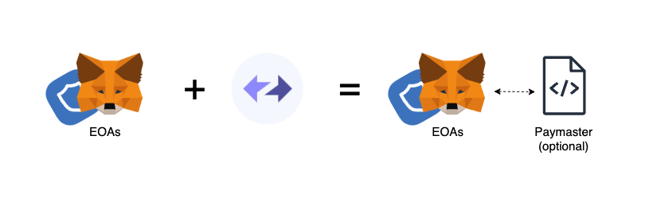
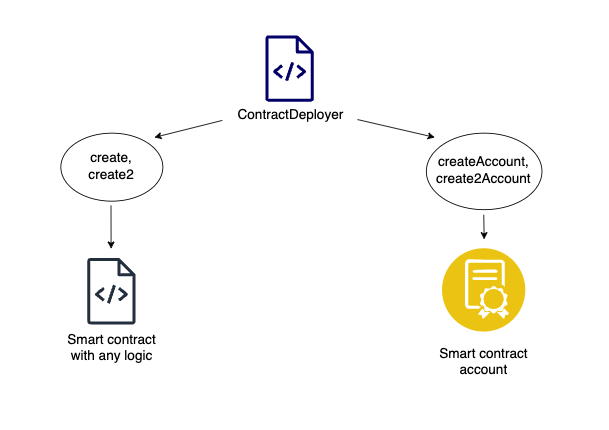
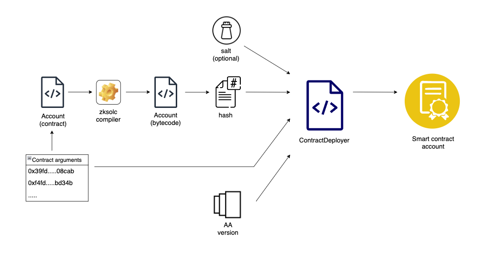
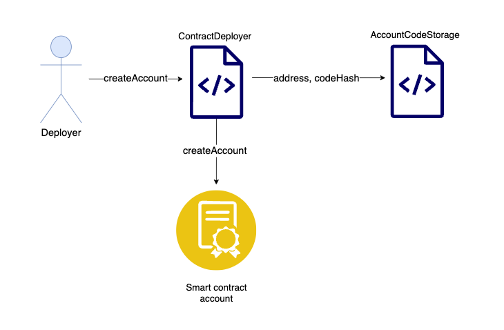
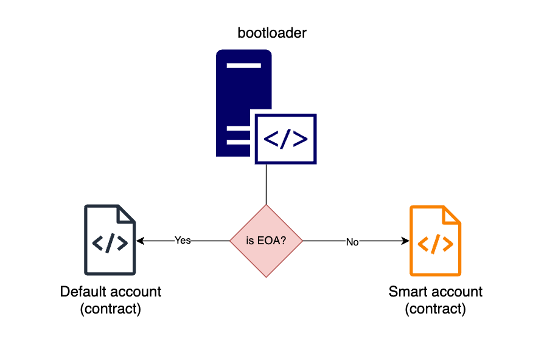
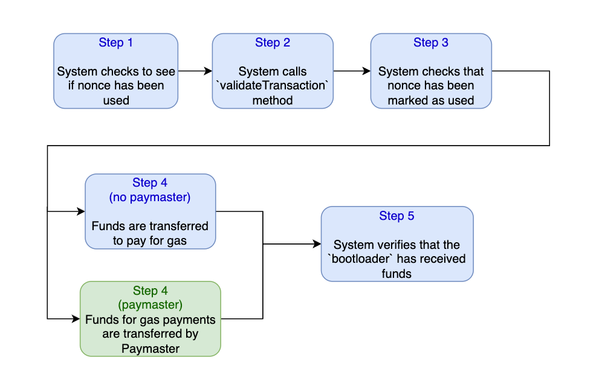
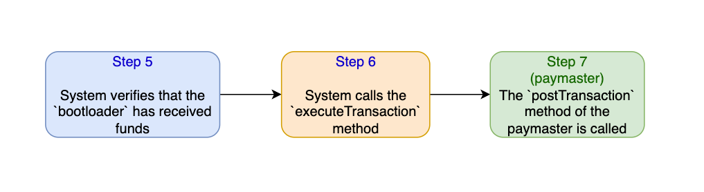
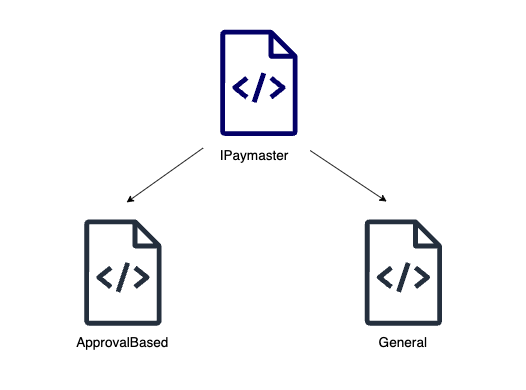

# Native Abstract Accounts vs EIP-4337

**Автор:** [Роман Ярлыков](https://github.com/rlkvrv) 🧐

В Ethereum существует два типа аккаунтов: внешние аккаунты (Externally Owned Accounts, EOA), которые могут инициировать транзакции, но не обладают программируемой логикой, и смарт-контракты, имеющие возможность выполнения произвольной логики, но неспособные инициировать транзакции самостоятельно.
Это вызывает большое количество проблем при взаимодействии с экосистемой блокчейна и повышает порог входа для новых пользователей.

Первым шагом к решению этой проблемы стал [EIP-4337](https://eips.ethereum.org/EIPS/eip-4337), который внедряет концепцию Abstract Accounts (AA) и Smart-contract account. Согласно [стандарту](https://github.com/fullstack-development/blockchain-wiki/blob/main/EIPs/erc-4337/README.md) предлагается объединить преимущества EOA и смарт-контрактов.

Напомню основные отличия EOA и AA.

|                                        | EOAs (Внешние учетные записи)                                                                     | Учетные записи смарт-контрактов                                                                                         |
| -------------------------------------- | ------------------------------------------------------------------------------------------------- | ----------------------------------------------------------------------------------------------------------------------- |
| Проверка подписи инициатора транзакции | Логика проверки подписи транзакций жестко закодирована в EVM                                      | Логика проверки подписи программируема в учетной записи смарт-контракта                                                 |
| Обращение с приватными ключами         | Приватные ключи сложно хранить и обезопасить, даже для опытных пользователей                      | Могут использоваться альтернативные методы для подписи транзакций, такие как биометрия или аутентификаторы              |
| Возможность восстановления             | Нет способа восстановить приватный ключ. Если вы потеряли ваш приватник, вы теряете ваши средства | Методы восстановления могут быть реализованы в смарт-контракте, например, социальное восстановление или резервные ключи |

## Верхнеуровневые различия в потоке транзакций

Для понимания ключевых различий между этими двумя подходами, давайте рассмотрим упрощенные схемы, иллюстрирующие путь транзакции от её начальной инициализации в кошельке до момента включения в блокчейн.

### EOA и Smart account транзакции в Ethereum

EIP-4337 не требует изменений в основном протоколе Ethereum, но для реализации АА необходимо внедрять специальный сервис - Bundler. Этот сервис отвечает за работу альтернативного mempool по обработке и отправке транзакций в блокчейн. Транзакции проходят через системный контракт EntryPoint.sol для валидации.

> **Mempool** - область хранения для транзакций, ожидающих подтверждения и включения в блок.



Однако, этот подход имеет ограничения, например невозможность использования Paymaster в связке с EOA в рамках EIP-4337.

> **Paymaster** - смарт-контракт который может осуществлять оплату газа в нативной валюте за пользователя. При этом он может обладать любой логикой оплаты: списывать у пользователя ERC20, делать доп. проверки либо просто может спонсировать любые транзакции не требуя ничего взамен.

Это проблема, потому что для реализации безгазовых транзакций потребуется интеграция отдельного сервиса, например [GSN](https://opengsn.org/) (к слову, на базе опыта которого был разработан данный EIP).

Еще одна проблема - это сложность разработки подобных абстрактных аккаунтов, нужно будет выбрать одно из инфраструктурных решений (прим. [Alchemy](https://accountkit.alchemy.com/)) и разобраться с их API, чтобы реализовать свою логику кошелька. К тому же сама архитектура построенная на EIP-4337 далеко не тривиальна.

### EOA и Smart account транзакции в zkSync

Теперь посмотрим какой путь проделывает транзакция в решении от zkSync. В данном случае у разработчиков была возможность реализовать нативную поддержку Abstract Account и Paymaster без необходимости сторонних сервисов. Здесь все аккаунты являются смарт-контрактами (даже EOA), также в zkSync любые аккаунты являются "first-class citizen", то есть они собираются в единый Mempool и обрабатываются одинаково.



После Mempool транзакции обрабатываются и выполняются оператором. Если проводить параллель с Ethereum, здесь оператор будет выполнять роль валидатора и бандлера.
После чего транзакция попадает в смарт-контракт `bootloader`.

> bootloader - это системный смарт-контракт L2 zkSync. По сути это ядро протокола, контракт связывает и консолидирует работу всех основных системных смарт-контрактов протокола.

В разрезе AA, контракт bootloader является аналогом EntryPoint. Если грубо описать происходящее - на этом этапе определяется есть ли какая-то дополнительная логика у аккаунта и по необходимости вызывается Paymaster.

Сравнительная таблица EIP-4337 и Native AA zkSync:
| | EIP-4337 | Native AA zkSync |
| --------------------------------- | --------------------------------------------------------- | ------------------------------------------------------------------------------------------------------------------ |
| Степень интеграции | Не нативная. Требует доп инфраструктуру и сервисы | Нативная. Поддерживается в блокчейне "из коробки" |
| Учетные записи и платежные агенты | Поддержка Paymaster только для смарт-аккаунтов | Все аккаунты, включая EOA, ведут себя как аккаунты смарт-контрактов и поддерживают Paymaster |
| Поток транзакций | Два потока транзакций с разной логикой, два мемпула | Единый мемпул и поток транзакций, не зависит от того, инициируется ли транзакция EOA или аккаунтом смарт-контракта |
| Формирование транзакций | Отправка объектов UserOperation вместо обычных транзакций | Обычные транзакции, но с дополнительными полями |

Далее рассмотрим реализацию нативных AA более подробно и по порядку.

## Подробный разбор нативных AA

### Создание AA в zkSync

Как я уже говорил, EOA в zkSync также являются смарт-контрактами. Подключив свой EOA к сети zkSync era внешне не будет никакой разницы, но под капотом это теперь не просто кошелек, а базовый Smart account. Базовый, потому что из всех преимуществ которые дает абстракция учетной записи с таким аккаунтом вы сможете воспользоваться только подключением Paymaster (изменить флоу оплаты за газ). Но и это уже является большим преимуществом.



Чтобы воспользоваться всеми плюсами абстракции аккаунта - нужно такой аккаунт создать. За это отвечает системный смарт-контракт `ContractDeployer` (код контракта можно посмотреть [тут](https://github.com/matter-labs/era-system-contracts/blob/main/contracts/ContractDeployer.sol)).

Системный смарт-контракт ContractDeployer в zkSync играет ключевую роль в развертывании смарт-контрактов, включая AA. Он предоставляет несколько методов, таких как `create`, `create2` для развертывания стандартных смарт-контрактов и `createAccount`, `create2Account` для развертывания AA.

Методы `create` и `create2` хорошо известны разработчикам и отвечают за развертывание обычных смарт-контрактов, метод `create2`, если грубо описать его функцию, дает возможность получить предсказуемый адрес смарт-контракта до его развертывания (можно даже подобрать красивый). Следуя этой логике для создания AA также сделали два метода (с возможностью передачи соли и без).



Для развертывания своей реализации AA понадобится:

-   написать смарт-контракт который наследуется от интерфейса [IAccount](https://github.com/matter-labs/era-system-contracts/blob/main/contracts/interfaces/IAccount.sol) и реализует [обязательные методы](https://era.zksync.io/docs/reference/concepts/account-abstraction.html#iaccount-interface)
-   скомпилировать смарт-контракт используя zksolc
-   использовать [zkSync SDKs](https://era.zksync.io/docs/api/) для настройки, деплоя и интеграции смарт-аккаунта в приложение

Можно посмотреть туториалы [тут](https://github.com/matter-labs/custom-aa-tutorial) и [тут](https://era.zksync.io/docs/dev/tutorials/custom-aa-tutorial.html), они позволят понять, как создать простую версию такого аккаунта, поэтому здесь я не буду вдаваться в технические подробности деплоя и настройки, а объясню только суть процесса.

> Подсказка: Если вы компилируете контракты в проекта hardhat не забудьте в настройках компилятора zksolc включит флаг `isSystem: true`.

Возвращаясь к методам контракта `ContractDeployer`, для создания аккаунта понадобится:

-   соль (необходима только для `create2Account`)
-   хэш байт-кода смарт-контракта с логикой AA (в zkSync для развертывания всегда используется хэш байт-кода а не сам байт-код)
-   аргументы для конструктора вашего AA (какие-либо значение которые вы хотите задать в момент развертывания, пример: адреса аккаунтов для создания мультисига)
-   версия AA, на данный момент версия одна - `Version1` (можно выбрать `None`, но это значение в основном для адресов, роль которых не удалось определить, с таким аккаунтом не получится ничего сделать)



```solidity
    function createAccount(
        bytes32 /** */,
        bytes32 _bytecodeHash, // Хэш байт-кода нашей версии аккаунта
        bytes calldata _input, // Значения для конструктора
        AccountAbstractionVersion _aaVersion // Версия аккаунта
    ) external payable returns (address newAddress);
```

На выходе мы получаем адрес нашего смарт-аккаунта, которым теперь можно совершать транзакции (используя [API zkSync](https://era.zksync.io/docs/api/)).

### Как определить инициатора транзакции?

В контексте работы с AA (Abstract Account) в zkSync, важно понимать, как система идентифицирует инициатора транзакции. Этот процесс особенно критичен для интеграции с Externally Owned Accounts (EOA).

Тут все просто, `ContractDeployer` регистрирует хэш байт-кода каждого развернутого им смарт-контракта в системный контракт `AccountCodeStorage` системы. Это можно сравнить с записью в маппинг (сопоставление) типа address => bytecodeHash.

> **AccountCodeStorage** - системный смарт-контракт который хранит хэши байт-кода развернутых смарт-контрактов.



Таким образом по адресу инициатора транзакции легко проверить есть ли у него развернутый код, если его нет и вызывающая сторона не является системным смарт-контрактом, значит это EOA (метод `isEOA(addr)` в контракте `bootloader`).

```solidity
    /// @dev Checks whether an address is an EOA (i.e. has not code deployed on it)
    /// @param addr The address to check
    function isEOA(addr) -> ret { ... } // bootlader code fragment
```

Когда инициатор транзакции EOA, для имитации поведения аккаунта Ethereum вызывается смарт-контракт `DefaultAccount`, если же у вызывающего есть развернутый код и поддерживается версия AA, значит это Smart account.



Именно поэтому в zkSync EOA тоже считаются смарт-контрактами, за логику его работы всегда отвечает контракт `DefaultAccount` (код контракта можно посмотреть [тут](https://github.com/matter-labs/era-system-contracts/blob/main/contracts/DefaultAccount.sol)). Главная его задача вести себя как обычный EOA, но при этом иметь возможность оплаты транзакции через Paymaster. При этом версия АА (AccountAbstractionVersion) отражает реализацию как Smart account так и Default account (базовая логика у них одинаковая, есть все обязательные методы).

Таким образом инициатора транзакции всегда можно отнести в одну из категорий:

-   **EOA:** Прямое управление пользователем
-   **Smart account:** Расширенные функции управления, реализация AA
-   **Smart contract:** Автономный код в блокчейне
-   **System contract:** Специализированные системные контракты со служебной логикой, как правило вызывается только внутри системы
-   **AccountAbstractionVersion.None:** Все остальные инициаторы транзакций, которые никак не определены в системе.

В зависимости от того кто инициировал транзакцию будет выполняться дальнейшая логика.

### Процесс валидации и исполнения транзакций

Давайте рассмотрим, как в zkSync происходит валидация и исполнение транзакций, инициированных Smart account, при этом учтем, что для EOA процесс аналогичен, за исключением того, что все обязательные методы для EOA уже реализованы и закреплены в контракте `DefaultAccount`.

[Обязательные методы](https://era.zksync.io/docs/reference/concepts/account-abstraction.html#iaccount-interface) - это `validateTransaction` и `executeTransaction`. Для Smart account мы можем реализовать в них любую логику, но это совсем не означает, что нет никаких ограничений, все таки базовая безопасность должна быть обеспечена.

Процесс валидации транзакции следующий:

1. Система проверяет, что `nonce` транзакции не использовался
    > **Nonce** означает "number used once" (число, используемое однократно). Это число, которое используется в криптографии для обеспечения безопасности и уникальности каждой транзакции.
2. Вызывается метод аккаунта `validateTransaction`, где может быть любая логика которую вы заложите, например здесь нужно проверить подпись вызывающей стороны
3. Система проверит что вы пометили `nonce`, как использованный
4. (**Paymaster не указан в транзакции**) Производится перевод средств для оплаты контракту `bootloader`

    `4`. (**Paymaster указан в транзакции**) Вызывается метод для обработки его логики и оплаты транзакции (подробности чуть позже)

5. Системой выполняется проверка, что `bootloader` получил достаточно средств для оплаты газа за транзакцию.



После этих действий происходит выполнение транзакции, здесь вызывается второй обязательный метод (`executeTransaction`), порядок такой:

6. Вызывается `executeTransaction`, здесь можно обработать вызов системного контракта (например, для деплоя контракта) либо выполнить любой другой вызов.
7. (**Только в случае участия Paymaster в транзакции**) Вызывается метод `postTransaction` контракта Paymaster. Этот шаг обычно следует использовать для возврата средств за неиспользованный газ.



#### Некоторые ограничения

Для защиты системы от DoS-атак этап верификации имеет следующие ограничения:

-   Логика Smart account может взаимодействовать только со слотами, которые принадлежат аккаунту. Это определение охватывает не только слоты, фактически находящиеся в смарт-контракте аккаунта, но и некоторые поля других смарт-контрактов (например баланс токенов ERC20 или сумма разрешенная для списания)

-   Логика аккаунта не может использовать контекстные переменные (например, `block.number`)

-   Требуется, чтобы аккаунт увеличивал `nonce` на 1. Это ограничение необходимо только для сохранения устойчивости к коллизиям хэшей транзакций.
    > **Примечание:** В будущем это требование будет снято, чтобы позволить более общие сценарии использования (например, протоколы конфиденциальности).

### Интеграция Paymaster и безгазовые транзакции

Перед тем как погрузиться в детали функционала Paymaster, давайте разберемся, как в zkSync определяется способ оплаты транзакции.

Все довольно просто, во время формирования транзакции к ней добавляются два поля:

-   `paymaster` - это значение `uint256`, если в транзакции участвует Paymaster из этого значения можно вытащить его адрес, в противном случе там будет 0
-   `paymasterInput` - это массив типа `bytes`, где в первых 4 байтах указан тип Paymaster, дальше идут дополнительны данные

**О каких типах идет речь?** Существуют два основных типа Paymaster: **ApprovalBased** и **General**.

**ApprovalBased** Paymaster - это еще одно преимущество нативной реализации подобного решения, сейчас все объясню.

Он принимает три аргумента:

-   Адрес ERC20 токена
-   Минимальное значение `allowance`, которое нужно установить перед переводом средств
-   Дополнительные данные, которые можно передать при необходимости

```solidity
    function approvalBased(address _token, uint256 _minAllowance, bytes calldata _innerInput) external;
```

**Что это дает?** Это позволяет нам заранее рассчитать объем газа для транзакции и, соответственно, необходимое количество ERC20 токенов для её оплаты. После определения этой суммы мы устанавливаем минимальный `allowance` для Paymaster, давая системе зелёный свет на вызов `approve` за нас. Это дает возможность Paymaster'у легко списать нужные токены от имени инициатора транзакции 🤯, ну разве это не круто?

**General** Paymaster принимает только один аргумент (input), который позволит передать в него произвольные значения. Этот тип Paymaster может выполнять любую заданную вами логику, включая сценарии, где не требуется предварительное разрешение на списание токенов.



#### Создание Paymaster

Чтобы создать Paymaster, необходимо наследоваться от интерфейса [IPaymaster](https://github.com/matter-labs/era-system-contracts/blob/main/contracts/interfaces/IPaymaster.sol) и реализовать ключевые методы, такие как `validateAndPayForPaymasterTransaction` (обязательный) и `postTransaction` (опционально), каждый из которых играет важную роль в логике оплаты транзакций.

Метод `validateAndPayForPaymasterTransaction` определяет готовность Paymaster оплатить транзакцию. Он принимает три параметра: хэш транзакции, подписанный EOA хэш, и данные транзакции. Если Paymaster согласен с оплатой, метод отправляет оператору нативную валюту, равную или превышающую `tx.gasPrice * tx.gasLimit`. Также метод возвращает контекст для вызова `postTransaction`.

```solidity
    function validateAndPayForPaymasterTransaction(
        bytes32 _txHash, // Хэш транзакции
        bytes32 _suggestedSignedHash, // Хэш транзакции, подписанной EOA
        Transaction calldata _transaction // Данные транзакции
    ) external payable returns (bytes4 magic, bytes memory context);
```

Метод `postTransaction` является необязательным и активируется после завершения транзакции. В отличие от EIP-4337, его вызов не гарантирован: например, при неудачной транзакции из-за нехватки газа, метод не вызывается.

`postTransaction` принимает четыре аргумента: контекст, созданный `validateAndPayForPaymasterTransaction`, информацию о транзакции, индикатор её успешности, и максимальный объем газа, подлежащий возврату Paymaster'у.

```solidity
    function postTransaction(
        bytes calldata _context, // Контекст, который передается из метода validateAndPayForPaymasterTransaction
        Transaction calldata _transaction, // Данные транзакции
        bytes32 _txHash, // Хэш транзакции
        bytes32 _suggestedSignedHash, Хэш транзакции, подписанной EOA
        ExecutionResult _txResult, // Результат выполнения транзакции
        uint256 _maxRefundedGas // Количество газа, которое может быть возвращено контракту Paymaster
    ) external payable;
```

_Заметка:_ Данные методы вызываются только системным контрактом `bootloader`.

Примеры написания простых Paymasters можно посмотреть [тут](https://github.com/matter-labs/custom-paymaster-tutorial) и [тут](https://era.zksync.io/docs/dev/tutorials/custom-paymaster-tutorial.html).

Для деплоя Paymaster не требуется взаимодействие с системными контрактами; он разворачивается как стандартный смарт-контракт. Параметры Paymaster подготавливаются для включения в транзакцию через [API zkSync](https://era.zksync.io/docs/api/).

## Заключение

В заключении стоит отметить, что нативная поддержка Abstract Accounts в zkSync представляет собой более простое и интуитивно понятное архитектурное решение по сравнению с EIP-4337. Создание и интеграция Smart accounts в такой парадигме несколько проще, также упрощается тестирование – всё, что требуется, это среда разработки zkSync, без необходимости в дополнительных сервисах, таких как bundler'ы.

Важно также и то, что Paymaster'ы могут быть легко интегрированы с обычными EOA, причем с возможностью избежать лишней транзакции для одобрения списания ERC20-токенов.

Стоит отметить, что такие возможности, как оплата транзакций в ERC20-токенах или `multicall` (объединение нескольких транзакций в одну) это только верхушка айсберга, Smart account может обладать очень полезным и разнообразным набором функций. Я думаю мы увидим еще много различных кейсов его использования.

## Ссылки

-   [Документация](https://era.zksync.io/docs/reference/concepts/account-abstraction.html)
-   [Репозиторий с системными смарт-контрактами](https://github.com/matter-labs/era-system-contracts/blob/main/contracts/interfaces/IPaymaster.sol)
-   [Аудит, включающий описание работы системных смарт-контрактов](https://github.com/code-423n4/2023-10-zksync/blob/main/docs/Smart%20contract%20Section/System%20contracts%20bootloader%20description.md)
-   [zkSync era API/SDKs](https://era.zksync.io/docs/api/)
-   [Custom AA tutorial](https://github.com/matter-labs/custom-aa-tutorial)
-   [Custom Paymaster tutorial](https://github.com/matter-labs/custom-paymaster-tutorial)
-   [Полезные туториалы из документации](https://era.zksync.io/docs/dev/tutorials.html)
-   [Обзорное видео AA в zkSync](https://www.youtube.com/watch?v=M8p5ucnOH5E)
