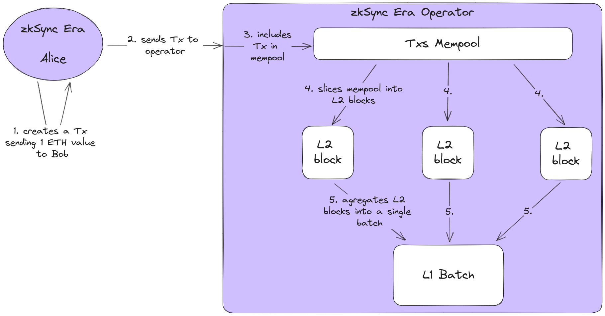
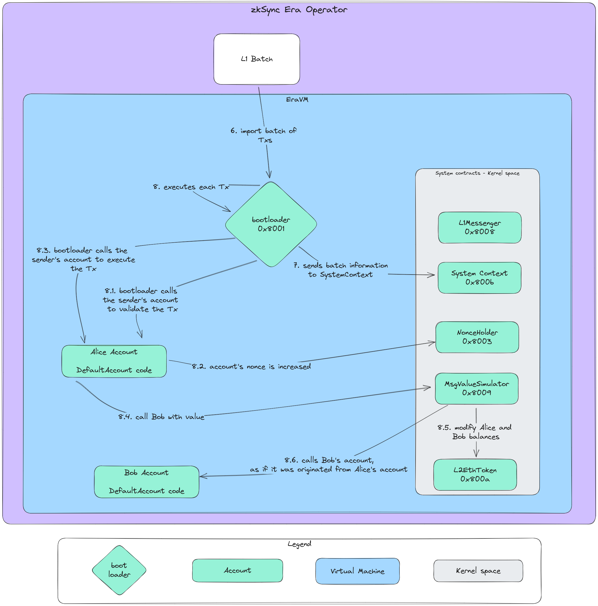
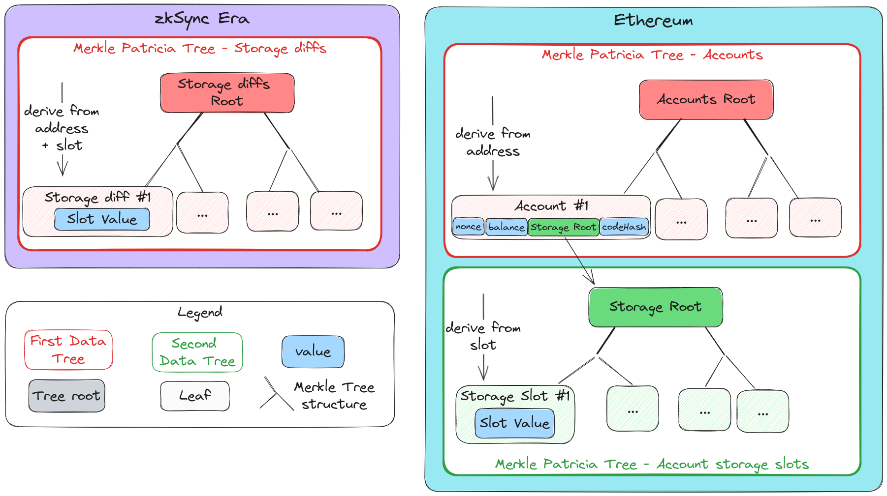
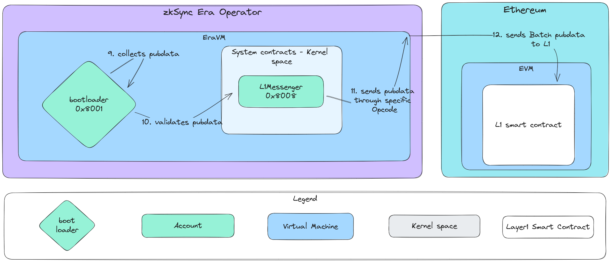
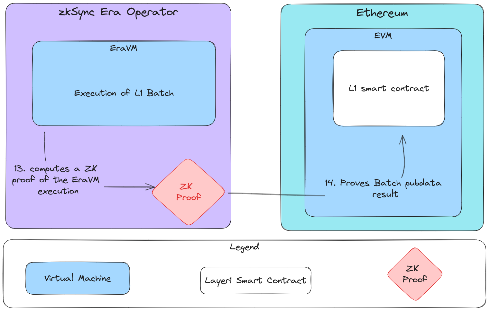
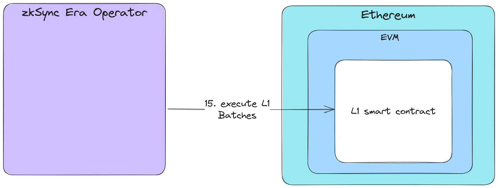

# zkSync Era Architect

**Автор:** [Роман Ярлыков](https://github.com/rlkvrv) 🧐

Это обзор протокола zkSync Era "изнутри", его главная задача углубиться в технические детали, понять из каких частей он состоит, как формируются zk-rollup и обрабатываются транзакции. Разберемся какая логика выполняется на Layer 2, а какая на Layer 1, также немного посмотрим что делают ноды (операторы) на бэкенде.

## Системные смарт-контракты

Здесь я приведу краткий обзор основных системных смарт-контрактов как на Layer 2 так и на Layer 1. Это основа протокола, которая обеспечивает безопасность и децентрализацию. Пока можно быстро по ним пробежаться не углубляясь в детали, потому что их использование станет понятнее при чтении раздела [Transaction Flow](#transaction-flow).

### Layer 2 smart-contracts

Системные контракты L2 располагаются в ядре протокола, имеют определенные привилегии и предварительно развертываются при создании генезис-блока (кроме контракта `bootloader`). Обновление их кода возможно только через системное обновление, управляемое с L1.

Системные контракты L2 находятся в [этом](https://github.com/matter-labs/era-system-contracts/tree/main) репозитории. Ниже представлено описание не для всех контрактов, а только для ключевых из них, которые нужны для понимания работы системы в целом. Также некоторые из них имеют публичные функции для разработчиков. Более подробное описание можно найти в [этом](https://github.com/code-423n4/2023-10-zksync/blob/main/docs/Smart%20contract%20Section/System%20contracts%20bootloader%20description.md) аудите.

#### ContractDeployer

[ContractDeployer](https://github.com/matter-labs/era-system-contracts/blob/main/contracts/ContractDeployer.sol) — это контракт, используемый для развертывания новых смарт-контрактов. Он гарантирует, что байт-код каждого развернутого контракта известен, и определяет адрес производного контракта.

#### L1Messenger

[L1Messenger](https://github.com/matter-labs/era-system-contracts/blob/main/contracts/L1Messenger.sol) - контракт используется для отправки сообщений из zkSync в Ethereum. Это могут быть транзакции, вызовы смарт-контрактов или проверки состояний.

#### NonceHolder

[NonceHolder](https://github.com/matter-labs/era-system-contracts/blob/main/contracts/NonceHolder.sol) - отвечает за хранение `nonce` транзакций и развертываний смарт-контрактов.

#### DefaultAccount

[DefaultAccount](https://github.com/matter-labs/era-system-contracts/blob/main/contracts/DefaultAccount.sol) - это шаблон для аккаунтов, на которые не был развернут пользовательский смарт-контракт. Он предоставляет базовый уровень абстракции аккаунта. При взаимодействии со стандартным аккаунтом он имитирует поведение внешне управляемого аккаунта (EOA), всегда возвращая флаг успешного выполнения и отсутствие данных, что соответствует поведению стандартных EOA в Ethereum, если только вызов не происходит из `bootloader`.

#### Bootloader

[Bootloader](https://github.com/matter-labs/era-system-contracts/blob/main/bootloader/bootloader.yul) - загрузчик является ядром системы, которая управляет выполнением транзакций L2. Это специализированное программное обеспечение, которое не развертывается как обычный контракт, а скорее запускается внутри ноды как часть среды выполнения.

Bootloader можно воспринимать как аналог EntryPoint из EIP4337, который обрабатывает пакеты транзакций как единое целое, а не по отдельности. Это повышает эффективность, уменьшая необходимость запуска отдельного процесса проверки для каждой транзакции. Валидатор сохраняет транзакции в массиве, который затем записывается в память загрузчика и выполняется. Чтобы избежать возможного отката всего процесса из-за сбоя в одной транзакции, загрузчик использует более мягкое условие сбоя, известное как `near call panic`.

Еще одна важная роль загрузчика - он вызовет смарт-контракт AA если он развернут иначе будет вызван [DefaultAccount](#defaultaccount), которые ведет себя как обычный EOA. Это позволило протоколу совместить EOA и AA в одной учетной записи.

Хеш кода загрузчика хранится на L1 и может быть изменен только в рамках системного обновления. В отличие от системных контрактов, код загрузчика физически не хранится на L2 и его адрес является формальным, используемым только для обеспечения значения `msg.sender`. При обращении к адресу загрузчика фактически вызывается код пустого контракта (EmptyContract).

Функциональность загрузчика разделена между большим файлом Yul и [BootLoaderUtilities](https://github.com/matter-labs/era-system-contracts/blob/main/contracts/BootloaderUtilities.sol) контрактом.

#### SystemContext

[SystemContext](https://github.com/matter-labs/era-system-contracts/blob/main/contracts/SystemContext.sol) - контракт служит для хранения и обновления контекстных переменных в рамках блока, транзакции или системы. SystemContext тесно интегрирован с bootloader для обеспечения консистентности данных в блокчейне и поддерживает состояния системы в актуальном и согласованном виде.

#### MsgValueSimulator

[MsgValueSimulator](https://github.com/matter-labs/era-system-contracts/blob/main/contracts/MsgValueSimulator.sol) - служит для имитации транзакций с `msg.value`, используя опкод zkEVM - [mimicCall](https://github.com/code-423n4/2023-10-zksync/blob/main/docs/Smart%20contract%20Section/System%20contracts%20bootloader%20description.md#only-for-kernel-space) для продолжения вызова с исходным `msg.sender`. Он обрабатывает параметры, такие как значение перевода и адрес получателя, а также "из коробки" обеспечивает защиту от атак reentrancy. При неудачной попытке перевода контракт выполняет вызывает `revert`, имитируя стандартное поведение Ethereum.

#### L2EthToken

[L2EthToken](https://github.com/matter-labs/era-system-contracts/blob/main/contracts/L2EthToken.sol) - необходим для выполнения изменений баланса при имитации поведения `msg.value` Ethereum. Используется контрактом [bootloader](#bootloader) и системными контрактами [MsgValueSimulator](#msgvaluesimulator) и [ContractDeployer](#contractdeployer).

#### Compressor

[Compressor](https://github.com/matter-labs/era-system-contracts/blob/main/contracts/Compressor.sol) - одним из самых дорогих ресурсов для сворачивания является доступность данных, поэтому для снижения затрат пользователей компрессор сжимает публикуемые pubdata несколькими способами:

-   сжатие опубликованного байткода контрактов
-   сжатие дифов (различий) состояний блокчейна

Данный контракт содержит служебные методы, которые используются для проверки корректности сжатия байткода или дифов состояний.

#### Контракты которые заменяют прекомпиляции EVM

На данный момент реализовано [5 таких контрактов](https://github.com/matter-labs/era-system-contracts/tree/main/contracts/precompiles):

-   **Ecrecover** — это реализация предварительно скомпилированного контракта `ecrecover`. Контракт принимает данные вызова в том же формате, что и предварительно скомпилированный контракт EVM, то есть первые 32 байта — это хеш, следующие 32 байта — это `v`, следующие 32 байта — это `r`, и последние 32 байта — это `s`. Он также проверяет входные данные по тем же правилам, что и предварительно скомпилированный контракт EVM: `v` должен быть либо 27, либо 28; `r` и `s` должны быть меньше порядка кривой.

-   **SHA256 & Keccak256** - в отличие от Ethereum, keccak256 представляет собой прекомпиляцию (а не опкод) в zkSync.Контракты принимают входные данные и преобразуют их в формат, ожидаемый zk-схемой.

-   **EcAdd & EcMul** Эти прекомпиляции имитируют поведение прекомпиляций EcAdd и EcMul EVM.

### Layer 1 smart-contracts

Системные контракты L1 находятся в [этом](https://github.com/matter-labs/era-contracts/tree/main) репозитории. Ниже приведено их краткое описание, за подробностями [сюда](https://github.com/code-423n4/2023-10-zksync/blob/main/docs/Smart%20contract%20Section/L1%20smart%20contracts.md#mailboxfacet).

#### DiamondProxy

[DiamondProxy](https://github.com/matter-labs/era-contracts/blob/main/ethereum/contracts/zksync/DiamondProxy.sol) - является точкой входа для L1. Этот контракт реализует паттерн Diamond Proxy по [EIP-2535](https://eips.ethereum.org/EIPS/eip-2535) с некоторыми изменениями.

Одним из отличий от эталонной реализации Diamond Proxy является возможность замораживания доступа. Каждая из граней (facet) имеет связанный параметр, который указывает, можно ли заморозить к ней доступ.

_Важно!_ Привилегированные участники могут заморозить Diamond (но не конкретный facet), и все грани с маркером `isFreezable` должны быть недоступны, пока управляющий или администратор не разморозит Diamond.


Шаблон diamond proxy очень гибок и расширяем. На данный момент он позволяет разделять контракты реализации по их логическому смыслу, снимает ограничение на размер байт-кода для каждого контракта и реализует функции безопасности, такие как замораживание.

Контракты реализации различных модулей протокола (facets):

#### AdminFacet

[AdminFacet](https://github.com/matter-labs/era-contracts/blob/main/ethereum/contracts/zksync/facets/Admin.sol) - Управляет изменением привилегированных адресов (Governor и Validator), изменением параметров системы (хэш байт-кода `bootloader` L2, адрес верификатора, параметры верификатора и т.д.), а также управляет замораживанием/размораживанием и выполнением обновлений в DiamondProxy.

AdminFacet контролируется двумя сущностями:

**Governance** (Управление) - Отдельный смарт-контракт, способный осуществлять критические изменения в системе, такие как обновления протокола. Этот контракт контролируется двумя мультиподписями: одна управляется командой Matter Labs, а другая будет мультисигом с участниками криптосообщества. Только совместно они могут выполнить немедленное обновление, в то время как команда Matter Labs может только запланировать обновление с задержкой.

**Admin** (Администратор) - Мультисиг, управляемый командой Matter Labs, который может выполнять не критические изменения в системе, такие как предоставление разрешений валидаторам.

_Важно!_ Admin является тем же мультисигом, что и владелец контракта Governance.

#### MailboxFacet

[MailboxFacet](https://github.com/matter-labs/era-contracts/blob/main/ethereum/contracts/zksync/facets/Mailbox.sol) - управляет связью между L1 и L2, обеспечивая передачу сообщений, мост для перевода эфира на L2 и механизм противодействия цензуре. Коммуникация L1 -> L2 осуществляется через запрос транзакции на L1 с последующим её выполнением на L2, где валидатор обрабатывает запрос и отмечает его в приоритетной очереди L1. Коммуникация L2 -> L1 отличается тем, что передает только информацию, не требуя выполнения транзакции на L1.

_Важно!_ Контракт не хранит и не передает какие-либо активы (ETH, токены ERC20 или NFT).

#### ExecutorFacet

[ExecutorFacet](https://github.com/matter-labs/era-contracts/blob/main/ethereum/contracts/zksync/facets/Executor.sol) - это контракт, который обрабатывает входящие пакеты L2, обеспечивает доступность данных о транзакциях и проверяет действительность zk-доказательств.

Процесс перехода состояния делится на три этапа:

-   commitBatches (фиксация пакетов)
-   proveBatches (проверка zk-доказательств)
-   executeBatches (исполнение пакетов и финализация состояния)

Для идентификации и обработки различных типов логов, включая корневой хеш дерева логов L2 -> L1, публичные данные и хеши различий состояния - используются ключи из перечисления SystemLogKey. Эти логи обрабатываются при фиксации пакета, обеспечивая согласованность и подтверждение изменений состояния.

```solidity
    enum SystemLogKey {
        L2_TO_L1_LOGS_TREE_ROOT_KEY,
        TOTAL_L2_TO_L1_PUBDATA_KEY,
        STATE_DIFF_HASH_KEY,
        PACKED_BATCH_AND_L2_BLOCK_TIMESTAMP_KEY,
        PREV_BATCH_HASH_KEY,
        CHAINED_PRIORITY_TXN_HASH_KEY,
        NUMBER_OF_LAYER_1_TXS_KEY,
        EXPECTED_SYSTEM_CONTRACT_UPGRADE_TX_HASH_KEY
    }
```

#### GettersFacet

[GettersFacet](https://github.com/matter-labs/era-contracts/blob/main/ethereum/contracts/zksync/facets/Getters.sol) - это отдельный компонент, который предоставляет методы для чтения данных (view и pure функции) и не включает в себя изменяющие состояние операции. Этот фасет также реализует функционал "diamond loupe", который упрощает управление другими фасетами, предоставляя информацию о них, такую как их адреса и функции.

_Важно!_ GettersFacet не подлежит заморозке, чтобы обеспечить постоянный доступ к функциям чтения данных.

### Другие важные смарт-контракты Layer 1

#### Verifier

[Verifier](https://github.com/matter-labs/era-contracts/blob/2491d564362005f9ea4b17aca1b98b631889b7a5/ethereum/contracts/zksync/Verifier.sol) - этот смарт-контракт является модифицированным верификатором [PLONK](https://eprint.iacr.org/2019/953.pdf), специально адаптированным для использования в сети zkSync Era. Он оптимизирует процесс верификации криптографических доказательств, обеспечивая эффективную и надежную проверку правильности выполненных вычислений.

#### Bridges

[Мосты](https://github.com/matter-labs/era-contracts/tree/main/ethereum/contracts/bridge) в zkSync — это отдельные контракты от Diamond, предназначенные для обеспечения коммуникации между L1 и L2 и управления активами. Они позволяют блокировать активы на одном уровне и создавать запросы на их выпуск на другом уровне. Для нативного эфира и других токенов ERC20 существуют специализированные мосты, такие как L1ERC20Bridge и L2ERC20Bridge, а также L1WethBridge и L2WethBridge для WETH. Все операции с мостами контролируются через контракт Governance.

#### Governance

Контракт [Governance](https://github.com/matter-labs/era-contracts/blob/main/ethereum/contracts/governance/Governance.sol) в zkSync Era управляет вызовами для всех контролируемых контрактов как на L1, так и на L2. Он в основном используется для обновления системы и изменения критических параметров. У контракта есть настройки минимальной задержки для выполнения вызовов. Обновление системы происходит в два этапа: планирование (с полной прозрачностью данных или через "теневое" обновление для срочных исправлений) и выполнение обновления (с задержкой или мгновенно - последнее возможно только с одобрения Совета безопасности). И Owner, и Совет безопасности могут отменить обновление до его исполнения.


#### ValidatorTimelock

Контракт [ValidatorTimelock](https://github.com/matter-labs/era-contracts/blob/main/ethereum/contracts/zksync/ValidatorTimelock.sol) служит промежуточным звеном между аккаунтом валидатора (EOA) и основным контрактом zkSync. Его главная цель — обеспечить отсрочку выполнения пакетов транзакций без изменения основного контракта zkSync. zkSync отслеживает активность в сети и при обнаружении подозрительных действий может заморозить сеть, позволяя провести расследование и принять меры прежде, чем возобновить операции. Это временное решение для предотвращения значительного ущерба от утечки ключа валидатора во время Альфа-стадии сети. Управляется мультисигом Matter Labs, так же, как и контракт Governance.

## Transaction flow

Лучше всего архитектуру протокола помогут понять этапы через которые проходит обычная транзакция, начиная с ее создания и до окончательной фиксации на Layer 1 и Layer 2.

Транзакции zkSync Era обрабатываются, выполняются и собираются в пакеты на Layer 2 (zkSync), а доказательство их достоверности и данные, которые позволяют полностью восстановить состояние L2 - передаются, проверяются и подтверждаются на уровне Layer 1 (Ethereum).

Для обеспечения взаимодействия с L1, а также для интеграции схем ZKP существуют системные смарт-контракты на L1 и L2. Рассмотрим верхнеуровневый workflow транзакции от создания на L2 до подтверждения на L1:


1. Создание транзакции
2. Транзакция **в ожидании**
3. Транзакция **включена**
4. Транзакция **проверена**
5. Транзакция **завершена**

Таким образом в zkSync Era существует 4 статуса для транзакции: **Pending**, **Included**, **Verified**, **Finalized**.

_Заметка:_ Обзор выполнения транзакции сделан на основе [этой статьи](https://blog.quarkslab.com/zksync-transaction-workflow.html), но изложен более кратко с дополнительными комментариями и ссылками на код - для понимания работы системы без углубления в некоторые детали.

### Pending status

Представим, что Алиса хочет отправить немного ETH Бобу. Для начала формируется обычная транзакция Ethereum с привычными полями:

| Название поля          | Описание                                                                  | Пример транзакции Алисы                                          |
| ---------------------- | ------------------------------------------------------------------------- | ---------------------------------------------------------------- |
| `from`                 | адрес отправителя, который будет подписывать транзакцию                   | Адрес Алисы                                                      |
| `recipient`            | адрес получателя                                                          | Адрес Боба                                                       |
| `signature`            | подтверждение, что транзакция авторизована отправителем                   | Подпись, сгенерированная Алисой, с использованием её пары ключей |
| `nonce`                | последовательно увеличивающийся счетчик                                   | Значение `nonce` учетной записи Алисы                            |
| `value`                | количество передаваемого Эфира (ETH) от отправителя к получателю, в wei   | 1 ETH (1 \* 10<sup>18</sup>)                                     |
| `input data`           | произвольные данные, в основном используются для вызова смарт-контрактов  | Пустое поле, так как учетная запись Боба - это EOA               |
| `gasLimit`             | максимальное количество единиц газа, которое должна потреблять транзакция | Зависит от состояния сети                                        |
| `maxPriorityFeePerGas` | максимальная комиссия за единицу газа за транзакцию                       | Зависит от состояния сети                                        |

Затем транзакция отправляется на ноду L2 с использованием стандартного API Ethereum JSON-RPC (метод `eth_sendRawTransaction`).

_Заметка:_ Нода в zkSync называется "оператор" (operator).

Затем zkSync использует собственные поля специфичные для L2 которые запрашиваются через вызов метода [zks_getTransactionDetails](https://era.zksync.io/docs/api/api.html#zks-gettransactiondetails):

| Название поля         | Описание                                                                   | Пример транзакции Алисы                                   |
| --------------------- | -------------------------------------------------------------------------- | --------------------------------------------------------- |
| `is_l1_originated`    | булево значение, указывающее, транзакция из L1 или нет                     | `False`: транзакция идет с L2-счета Алисы на L2-счет Боба |
| `status`              | текущий статус транзакции                                                  | Зависит от этапа рабочего процесса транзакции             |
| `fee`                 | размер комиссии за выполнение и валидацию транзакции                       | Зависит от состояния сети                                 |
| `initiator_address`   | инициатор транзакции (т.е. аккаунт, который оплатит комиссию)              | адрес Алисы                                               |
| `received_at`         | временная метка, когда оператор рассмотрел транзакцию                      | Зависит от времени отправки транзакции Алисой             |
| `eth_commit_tx_hash`  | хеш Ethereum транзакции, в которой данные транзакции были отправлены на L1 | Зависит от состояния пакета транзакции                    |
| `eth_prove_tx_hash`   | хеш Ethereum транзакции, в которой данные транзакции были проверены на L1  | Зависит от состояния пакета транзакции                    |
| `eth_execute_tx_hash` | хеш Ethereum транзакции, в которой транзакция была выполнена на L1         | Зависит от состояния пакета транзакции                    |

_Важно!_ Транзакции в zkSync могут быть нескольких типов, в зависимости от типа транзакции у нее могут быть и другие дополнительные поля.

Как только оператор получает транзакцию Алисы, он добавляет ее в мемпул транзакций. Статус транзакции устанавливается "**Pending**".

### Included status

На этом этапе оператор берет транзакции из мемпула и формирует "L2 блоки" из транзакций содержащих метаданные, применяемые только в L2. Это ускоряет валидацию и улучшает пользовательский опыт, так как кошельки моментально показывают статус транзакции.

На этом этапе могут быть исключены транзакции которые имеют слишком большой размер, чтобы предотвратить переполнение мемпула. Транзакции с недостаточной платой за газ могут быть временно убраны в отдельную структуру `stashed_accounts` до понижения цены на газ. Создание L2 блока занимает менее секунды.

При этом транзакции L1 обрабатываются мемпулом отдельно, но в результате все равно попадут в L1 пакет, так как влияют на изменение состояния L2. Код временного хранилища мемпула на языке Rust [здесь](https://github.com/matter-labs/zksync-era/blob/main/core/lib/mempool/src/mempool_store.rs).

_Важно!_ На этом этапе происходит только сортировка и предварительная подготовка транзакций к формированию пакета для L1.



После включения в L2 блок транзакция меняет статус на "**Included**". На данный момент это также занимает менее секунды.

#### Execute transaction

Это самый большой, сложный и интересный этап. На данном этапе транзакция будет выполняться на виртуальной машине zkEVM или EraVM. Тут мы подходим к [смарт-контрактам Layer 2](#layer-2-smart-contracts).

Первым шагом пакет L1 сформированный на предыдущем этапе попадает в системный контракт [bootloader](https://github.com/matter-labs/era-system-contracts/blob/main/bootloader/bootloader.yul) - этот смарт-контракт особенный: он является точкой входа EraVM и отвечает за выполнение всех транзакций в предоставленном пакете L1 (при этом он нигде не развернут и вызывается только во время выполнения).

Первым делом `bootloader` вызывает смарт-контракт [SystemContext](https://github.com/matter-labs/era-system-contracts/blob/main/contracts/SystemContext.sol) для установки контекстных переменных таких как `block.timestamp`, `block.number` и т.д, затем идут следующие шаги:

-   проверяется правильность формирования транзакции
-   `bootloader` вызывает учетную запись отправителя (т. е. Алисы) для проверки транзакции с помощью функции `validateTransaction`
    -   системный контракт [NonceHolder](https://github.com/matter-labs/era-system-contracts/blob/main/contracts/NonceHolder.sol) вызывается для увеличения значения `nonce` учетной записи
    -   код [DefaultAccount](https://github.com/matter-labs/era-system-contracts/blob/main/contracts/DefaultAccount.sol), прикрепленный к учетной записи отправителя, проверяет достоверность подписи транзакции
-   если транзакция действительна, загрузчик вызывает учетную запись отправителя для оплаты выполнения транзакции с помощью функции `payForTransaction`
-   если комиссия за транзакцию оплачена, загрузчик вызывает учетную запись отправителя для выполнения транзакции с помощью функции `executeTransaction`
    -   код контракта DefaultAccount выполняет транзакцию
-   `bootloader` возвращает деньги на счет отправителя за неизрасходованный газ

Также в нашем случае (отправка ETH от Алисы к Бобу) для работы с `msg.value` вызывается смарт-контракт [MsgValueSimulator](https://github.com/matter-labs/era-system-contracts/blob/main/contracts/MsgValueSimulator.sol) - этот контракт изменит баланс ETH Алисы и Боба в еще одном системном контракте [L2EthToken](https://github.com/matter-labs/era-system-contracts/blob/main/contracts/L2EthToken.sol). Он вызывает учетную запись Боба, устанавливая учетную запись Алисы в качестве отправителя. Это делается с помощью специального опкода операции EraVM под названием `mimic_call`, который позволяет выдавать себя за другие учетные записи путем изменения значения `msg.sender` любой транзакции.

_Важно!_ Этот опкод относится к [операциям ядра протокола](https://github.com/code-423n4/2023-10-zksync/blob/main/docs/Smart%20contract%20Section/System%20contracts%20bootloader%20description.md#only-for-kernel-space) и не может быть вызван снаружи.

На схеме ниже отображен весь описанный флоу выполнения транзакции перевода эфира от Алисы к Бобу на уровне L2 за исключением операций с газом.


Выполнение транзакций в EraVM создает `pubdata` (публичные данные). Эти данные хранятся на L1 (Ethereum) и позволяют восстановить полное состояние zkSync Era. Для оптимизации платы за газ при хранении данных в Ethereum они будут сжаты перед отправкой на L1 контрактом [Compressor](https://github.com/matter-labs/era-system-contracts/blob/main/contracts/Compressor.sol).

Данные zkSync делятся на четыре категории:

1. Логи L2 в L1: "доказуемая" часть связи от L2 к L1, связанная с доказательством исполнения EraVM.
2. Сообщения L2 в L1: длинные сообщения, которые не могут быть отправлены в логе. Каждое из них связано с логом L2 в L1.
3. Байт-коды смарт-контрактов: байт-код, развернутый в смарт-контрактах L2. Каждый из них связан с логом L2 в L1.
4. Записи хранения: данные о состоянии слотов хранения смарт-контрактов L2 (напомним, что все аккаунты в zkSync являются смарт-контрактами).

Подробнее об этом [тут](https://github.com/code-423n4/2023-10-zksync/blob/main/docs/Smart%20contract%20Section/Handling%20pubdata%20in%20Boojum.md).

Возвращаясь к транзакции Алисы, интересной категорией `pubdata` являются записи в хранилище, которые также называются **storage diffs** (различия в хранилище). Измененные слоты хранения в нашем случае — это баланс Алисы и баланс Боба в системном контракте L2EthToken, когда Алиса отправляет 1 ETH Бобу.

В zkSync Era используется подход, основанный на изменениях состояния (statediff-based) для реализации rollup. Это означает, что изменения состояния системы публикуются на уровне L1 (Ethereum) таким образом, чтобы обеспечить доступность данных. В Ethereum используется двухуровневая древовидная структура, где данные о слотах хранения привязываются к адресу аккаунта (первый уровень дерева), а затем к номеру слота хранения (второй уровень).

В отличие от Ethereum, структура дерева в zkSync квалифицируется как "плоская". Это одноуровневое дерево, в котором данные записываются в производные ключи слотов. Эти производные ключи вычисляются путём хэширования номера слота хранения и адреса аккаунта, связанного с этим слотом: `H(Slot number, Account)`.

Это упрощает структуру хранения данных, сокращая количество необходимых уровней и облегчая обработку изменений состояния. Основная цель такого подхода - обеспечить более эффективное и масштабируемое управление данными в контексте rollup.



После того, как все данные пакета L1 (pubdata) сжаты, они отправляются в системный контракт [L1Messenger](https://github.com/matter-labs/era-system-contracts/blob/main/contracts/L1Messenger.sol). Этот контракт проверяет, что данные согласованы и были сжаты правильно. Если данные действительны, сжатые данные сохраняются в смарт-контракте zkSync на L1 с использованием специфического опкода для EraVM - `to_l1`. Этот шаг называется "L1 batch commitment" и выполняется путем вызова функции `commitBatches` смарт-контракта [ExecutorFacet](https://github.com/matter-labs/era-contracts/blob/main/ethereum/contracts/zksync/facets/Executor.sol) на L1.

```solidity
    function commitBatches(
        StoredBatchInfo memory _lastCommittedBatchData,
        CommitBatchInfo[] calldata _newBatchesData
    ) external override nonReentrant onlyValidator { ... }
```

Хэш этой транзакции L1 будет отображаться в узлах zkSync как значение поля `eth_commit_tx_hash`, связанного с деталями транзакции L2. После того как данные пакета L1 сохранены на L1, все транзакции этого пакета получают статус "**Included**", а сам пакет L1 получает статус "**Committed**".



### Verified status

Следующим шагом рабочего процесса транзакции Алисы является проверка транзакции. Транзакция считается «проверенной», если пакет L1, в который она включена, проверен в смарт-контракте L1.

В zkSync Era используется система Zero-Knowledge Proofs (ZKP) для масштабирования и обеспечения безопасности транзакций на втором уровне (L2) которую Matter Labs разработала самостоятельно. Эта система является частью обновления [Boojum](https://zksync.mirror.xyz/HJ2Pj45EJkRdt5Pau-ZXwkV2ctPx8qFL19STM5jdYhc).

Как мы видели ранее - процесс начинается с формирования оператором пакета L1, который включает в себя группу транзакций L2. Этот пакет коммитится в смарт-контракт zkSync на Ethereum - ExecutorFacet.

После этого оператор, действуя как доказывающая сторона, генерирует криптографическое свидетельство (witness), подтверждающее правильность вычислений пакета L1. Это свидетельство отправляется в функцию [proveBatches](https://github.com/matter-labs/era-contracts/blob/2491d564362005f9ea4b17aca1b98b631889b7a5/ethereum/contracts/zksync/facets/Executor.sol#L311) контракта `ExecutorFacet`.

```solidity
    function proveBatches(
        StoredBatchInfo calldata _prevBatch,
        StoredBatchInfo[] calldata _committedBatches,
        ProofInput calldata _proof
    ) external nonReentrant onlyValidator { ... }
```

Который в свою очередь вызывает смарт-контракт zkSync на L1 отвечающий за проверку доказательств - [Verifier](https://github.com/matter-labs/era-contracts/blob/2491d564362005f9ea4b17aca1b98b631889b7a5/ethereum/contracts/zksync/Verifier.sol).

```solidity
    function verify(
        uint256[] calldata, // _publicInputs
        uint256[] calldata, // _proof
        uint256[] calldata // _recursiveAggregationInput
    ) external view returns (bool)
```

После успешной проверки свидетельства статус пакета L1 и включенных в него транзакций обновляется в сети zkSync, подтверждая их как верные и неизменные.



Хэш этой L1-транзакции будет сообщен узлами zkSync как значение поля `eth_prove_tx_hash`, ассоциированное с деталями L2-транзакции. После того как данные L1-пакета проверены на L1, все транзакции этого пакета получают статус "**Verified**". Сам L1-пакет также получает статус "Verified".

### Finalized status

Итак, пакет зафиксирован в смарт-контракте L1 функцией `commitBatches`, доступной для валидаторов, которая гарантирует валидность и правильный порядок транзакций. Транзакция Алисы публикуется в L1 как "Included".

Доказательство правильного выполнения EraVM предоставляется через `proveBatches` валидатором, а контракт Verifier проверяет его.

После того, как пакет проверен, необходимо выполнить кросс-чейн операции (хранящиеся в приоритетной очереди, доступной через контракт [Mailbox](https://github.com/matter-labs/era-contracts/blob/main/ethereum/contracts/zksync/facets/Mailbox.sol)). Поскольку переведенные Алисой средства остаются на L2, для этой транзакции кросс-чейн операции не требуются.

Последним шагом рабочего процесса является выполнение пакетов L1. Это означает, что состояние, полученное после пакетов L1, должно стать официальным состоянием L2 в контракте L1.



Завершающий этап включает вызов функции `executeBatches` контракта [ExecutorFacet](#executorfacet) в L1.

```solidity
    function executeBatches(
        StoredBatchInfo[] calldata _batchesData
    ) external nonReentrant onlyValidator { ... }
```

Хеш этой транзакции L1 будет отображаться в zkSync как значение поля `eth_execute_tx_hash`, связанного с деталями транзакции L2. На практике финализация состояния осуществляется путем импорта дерева Меркла логов L2 для каждого пакета L1. После завершения этого этапа пакеты L1 помечаются как "**Finalized**". На этом этапе отмена транзакций L2 невозможна, и они могут считаться завершенными.

Транзакция Алисы теперь тоже считается завершенной.

