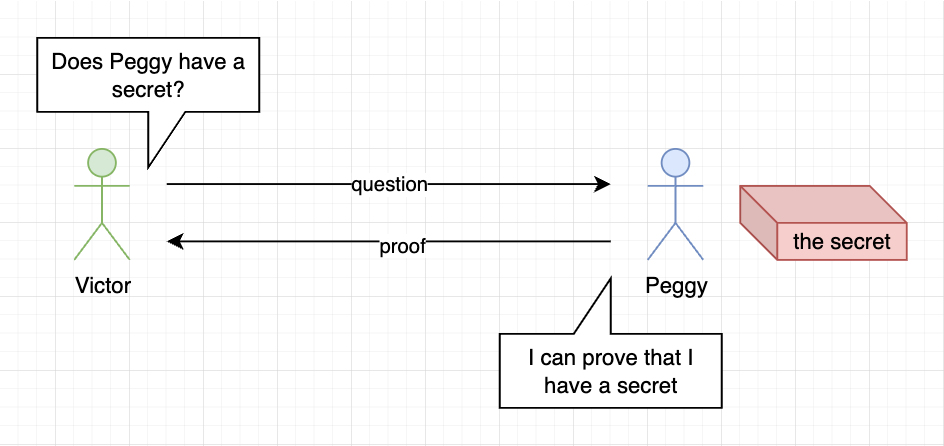
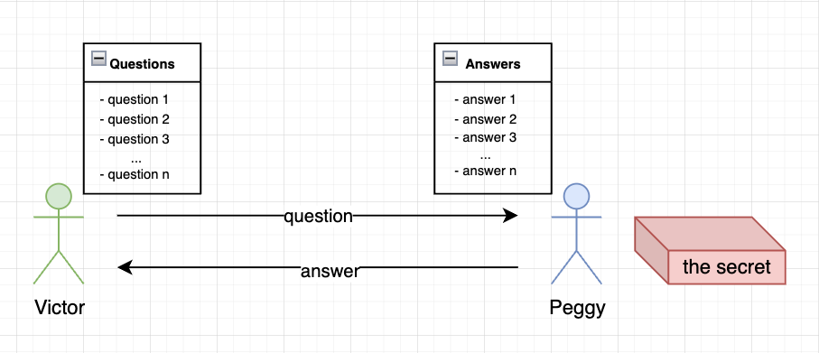
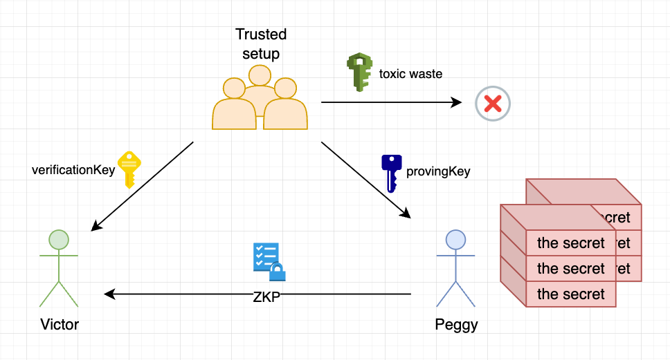
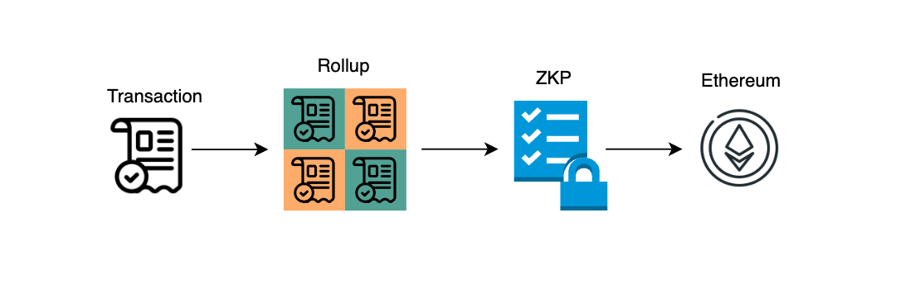
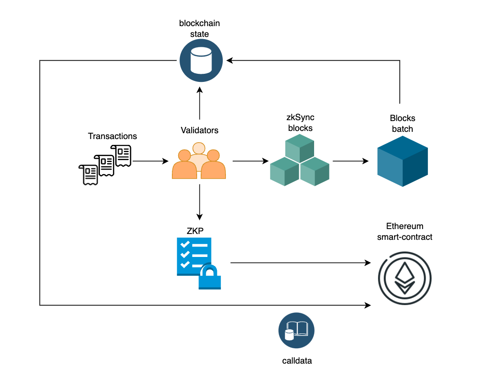

# zkSync

- [Предпосылки](#предпосылки)
- [Layer 2](#layer-2)
- [Что такое ZKP](#что-такое-zero-knowledge-proof)
- [Жизненный цикл транзакций в zkSync](#жизненный-цикл-транзакций-в-zksync)
- [Отличия zkEVM от EVM](#отличия-zkevm-от-evm)
- [Особенности zkEVM](#особенности-zkevm)
- [Account Abstraction](#account-abstraction)
- [Инфраструктура zkSync](#инфраструктура-zksync)
- [Hyperchains](#hyperchains)
- [Плюсы и минусы zkSync](#плюсы-и-минусы-zksync)
- [Ссылки](#ссылки)

zkSync — это блокчейн второго уровня (Layer 2 - L2) для Ethereum, созданный для решения проблем с высокими комиссиями за транзакции и низкой пропускной способностью (Transaction Per Second - TPS) в Ethereum. Он использует ZK-Rollups - свертки с доказательством нулевого разглашения (Zero-knowledge proofs - ZKP) для объединения транзакций за пределами основной сети (L1), в L1 отправляется только криптографическое доказательство, что транзакции обработаны верно, а также сжатые данные об этих транзакциях.

Разрабатывается компанией [Matter Labs](https://matter-labs.io/) и, как заявляет сама компания, является 100% open source продуктом который управляется сообществом. На данный момент проект привлек уже [458$ млн](https://cryptorank.io/ico/zksync), в долгосрочной перспективе планируется развернуть целую экосистему. На данный момент запущены блокчейны zkSync Lite (занимается исключительно обработкой платежей ETH и ERC20-токенов) и zkSync Era (поддерживает полноценные смарт-контракты). В дальнейшем планируется также запуск системы гиперчейнов связанных между собой, которые будут решениями L3, но при этом сохранят высокую безопасность. В планах компании вывести масштабирование на новый уровень и привлечь наконец следующий миллиард пользователей в блокчейн.

## Предпосылки

zkSync - это очередная попытка решить проблему масштабирования из всем известной [трилеммы блокчейна](https://medium.com/coinmonks/what-is-the-blockchain-trilemma-38a3b495a72f), очередная потому что все L2-блокчейны так или иначе пытаются это сделать.

1. Масштабируемость блокчейна относится к его способности обрабатывать больший объем транзакций.

2. Безопасность относится к способности защищать данные в блокчейне от различных типов атак и защите блокчейна от двойного расходования средств.

3. Децентрализация — это тип избыточности сети, который гарантирует, что сеть не контролируется меньшим количеством объектов.

Ethereum пошел по пути безопасности и децентрализации, так как это p2p протокол с распределенными нодами по всему миру (актуальную информацию смотреть [тут](https://nodewatch.io/)).

Чтобы сохранить децентрализацию все транзакции должны быть проверены каждым узлом, такая сеть априори не может работать быстро, более того, в случае большой нагрузки на сеть транзакции могут стоить очень дорого и выполняться очень долго.

## Layer 2

Главный вопрос - как увеличить TPS сети без увеличения нагрузки на ноды. Изначально в Ethereum были планы на внедрение Sharding после перехода на PoS консенсус. Идея была в том чтобы разделять валидаторов на подмножества которые будут отвечать за отдельные сегменты сети тем самым уменьшая общую нагрузку и увеличивая ее пропускную способность, но потом сообщество сделало выбор в пользу Layer 2 решений, так как они начали довольно быстро развиваться. После идей с Sharding появились такие решения как Payment (and state) channels, Sidechains, Plasma, Optimistic Rollup, а также решения основанные на ZKP - Validium, zkRollup, Volition. За подробностями [сюда](https://ethereum.org/en/developers/docs/scaling/).

L2-блокчейны на первый взгляд могут показаться очень похожими, общая идея в том чтобы проводить большее количество транзакций за пределами L1, а L1 будет отвечать только за безопасность этих транзакций. Но на самом деле в различных подходах масштабирования, приведенных выше, либо снижается уровень безопасности либо становится меньше децентрализации (L2 могут и вовсе быть централизованными), что снова возвращает нас к трилемме.

Тем не менее прогресс не стоит на месте и решения основанные на ZKP сейчас являются самыми "передовыми", они могут предложить больший уровень безопасности и даже некоторую приватность, хотя так же имеют различные варианты реализации и могут быть довольно централизованными.

Вот сравнительная таблица по основным решениям построенным на ZKP (подробнее в [статье](https://blog.matter-labs.io/evaluating-ethereum-l2-scaling-solutions-a-comparison-framework-b6b2f410f955)):

## Что такое zero-knowledge proof?

Центральным элементом ZK-Rollups является концепция доказательств с нулевым разглашением — криптографический инструмент, который позволяет проверять данные без раскрытия каких-либо конкретных подробностей.

Если зайти немного издалека то развитие криптографии в области подтверждения подлинности данных можно условно разделить на 3 этапа:

1. **Симметричные протоколы шифрования**, которые позволяют безопасно передать информацию по какому-то каналу, но оба участника должны знать приватный ключ для расшифровки этой информации.

2. **Ассиметричные протоколы шифрования** - когда у одной стороны должен быть публичный ключ и приватный ключ с помощью которого эта сторона может сделать подпись, а второй стороне достаточно получить подпись и публичный ключ, чтобы проверить подлинность этой подписи.

3. **Доказательство с нулевым разглашением** - это новый виток в эволюции криптографии, когда приватные ключи не нужны никому а подлинность данных можно проверить публично.

Итак, ZKP - это криптографический протокол, который позволяет одной из сторон (проверяющей - verifier) убедиться в правдивости определенного утверждения, не получая при этом никакой дополнительной информации от другой стороны (доказывающей - prover).

Используем двух персонажей для более простого объяснения - это будут Виктор (verifier) и Пегги (prover). У Пегги есть некий секрет (информация), который она не хочет раскрывать Виктору, а Виктору сам секрет и не нужен, но нужно доказательство, что секрет у Пегги точно есть. Здесь на помощь и приходит криптография и ZKP. Пегги может доказать Виктору наличие секрета не раскрывая его.

Чтобы все прошло успешно должны выполняться следующие 3 свойства:

1. _Completeness_ (полнота) - Пегги (prover) доказывает Виктору (verifier) что у нее есть секрет (с большой вероятностью, хоть она и меньше 100%)
2. _Soundness_ (достоверность) - Пегги не сможет доказать, если у нее нет секрета (с вероятностью стремящейся к 0)
3. _Zero-knowledgeness_ (нулевое разглашение) - Виктор не сможет узнать секрет.

Так как доказательство будет верным только с какой-то вероятностью то на примере выше Пегги и Виктору придется проделать много итераций чтобы Виктор был уверен что Пегги его не обманывает и действительно знает секрет. Поэтому такой протокол будет коммуникационным или интерактивным.

Более подробный пример хорошо описан в [этой статье](https://blog.cryptographyengineering.com/2014/11/27/zero-knowledge-proofs-illustrated-primer/). Спойлер - там рассказывается как заключить безопасную сделку с Гугл.

Для чего все это нужно? Вот несколько примеров:

1. Конфиденциальность:
    - доказать что тебе принадлежат деньги в банке, не называя конкретной суммы, а только порог;
    - доказать что тебе 18+, не разглашая дату рождения и имя;
    - показать государству что оплатил налоги, не рассказывая сколько именно.
2. Масштабирование:
    - хранить не полную информацию, а доказательство наличия информации;
    - увеличение TPS (Transactions per second) на блокчейне.
3. Анонимная авторизация.
4. Распределенные вычисления.

Все было бы хорошо, но для блокчейна интерактивность не подходит, т.к. в роли проверяющей стороны выступает большое количество участников (например валидаторов сети). Поэтому изначально интерактивные протоколы были преобразованы в неинтерактивные с помощью [эвристики Фиата-Шамира](https://en.wikipedia.org/wiki/Fiat–Shamir_heuristic). Это рождает еще более сложные алгоритмы вроде zk-SNARKs, которые обладают новыми свойствами:

-   **s**uccinctly (сжато) - независимо от объема вычислений доказательство имеет постоянный, небольшой размер
-   **n**on-interactively (не интерактивно) - как только доказательство вычислено, оно может быть использовано для убеждения любого количества проверяющих без непосредственного взаимодействия с доказывающим
-   with **ar**gumented knowledge (аргументированным знанием) - если утверждение верно с непренебрежимой вероятностью, то поддельные доказательства создать невозможно; кроме того, доказывающий знает соответствующие значения (witness) для истинного утверждения
-   in zero-**k**nowledge (с нулевым разглашением) - из доказательства невозможно извлечь какие-либо дополнительные знания, т.е. оно неотличимо от случайного.

Если вы сильны в математике можете почитать статью Виталика - [Quadratic Arithmetic Programs: from Zero to Hero](https://medium.com/@VitalikButerin/quadratic-arithmetic-programs-from-zero-to-hero-f6d558cea649).

Важный момент в том, что в zk-SNARKs появляется третья сторона которая должна выполнить "настройку" (trusted setup) и сгенерировать "provingKey" которые доказывающие будут использовать для доказательств и "verificationKey" которые проверяющие будут использовать для проверок. Причем для генерации придумывается специальное число - "toxic waste", которое должно быть уничтожено после настройки.

Первое свойство (succinctly) позволяет вычислять пруфы для любого количества данных за константное количество времени `~О(1)`, в этом огромная сила zk-SNARKs, которая и делает его таким привлекательным для решения проблемы масштабируемости блокчейна при этом не теряя в безопасности и скорости.

Слабой же стороной zkSNARKs является trusted setup, но есть и другие протоколы которые в данный момент разрабатываются - к примеру zkSTARKs.

STARK = Succinct (Scalable) Transparent ARguments of Knowledge.

Этот алгоритм не требует trusted setup, что и делает его "Transparent" плюс имеет пост-квантовую криптографическую стойкость. Но за все нужно платить, поэтому сложность вычислений в нем увеличивается как и размеры доказательств. Вот таблица, взятая [тут](https://github.com/matter-labs/awesome-zero-knowledge-proofs#comparison-of-the-most-popular-zkp-systems), которая показывает различие двух протоколов:

|                                       |                                   SNARKs |                             STARKs |
| ------------------------------------: | ---------------------------------------: | ---------------------------------: |
|        Algorithmic complexity: prover |                           O(N \* log(N)) |                O(N \* poly-log(N)) |
|      Algorithmic complexity: verifier |                                    ~O(1) |                     O(poly-log(N)) |
| Communication complexity (proof size) |                                    ~O(1) |                     O(poly-log(N)) |
|              - size estimate for 1 TX |                Tx: 200 bytes, Key: 50 MB |                          Tx: 45 kB |
|         - size estimate for 10.000 TX |               Tx: 200 bytes, Key: 500 GB |                         Tx: 135 kb |
|    Ethereum/EVM verification gas cost |                          ~600k (Groth16) |         ~2.5M (estimate, no impl.) |
|               Trusted setup required? |                           YES :unamused: |                         NO :smile: |
|                   Post-quantum secure |                            NO :unamused: |                        YES :smile: |
|                    Crypto assumptions | DLP + secure bilinear pairing :unamused: | Collision resistant hashes :smile: |

Ну и конечно же у Виталик Бутерин написал об этом и не одну статью, а целых три: [один](https://vitalik.ca/general/2017/11/09/starks_part_1.html), [два](https://vitalik.ca/general/2017/11/22/starks_part_2.html) и [три](https://vitalik.ca/general/2018/07/21/starks_part_3.html).

Но все же zkSNARKs проверенный временем протокол, который на данный момент является наиболее приемлемым выбором для блокчейнов с ZKP, к тому же сам протокол также развивается, его более старая версия - это Groth16, после которой разработали [PLONK](https://eprint.iacr.org/2019/953). В основе zkSync лежит RedShift, но в некоторых частях протокола также используется PLONK.

[RedShift](https://eprint.iacr.org/2019/1400) разрабатывается при активном участии самой Matter Labs (zkSync) и называется Transparent SNARK, то есть это SNARK с более прозрачным и безопасным этапом настройки - trusted setup, к тому же он претендует на постквантовую безопасность. Подробнее обсуждается в этом [подкасте](https://www.youtube.com/watch?v=JXWjn9sGL6c).

Это был очень краткий обзор ZKP, если хотите нырнуть туда с головой, вам [сюда](https://github.com/matter-labs/awesome-zero-knowledge-proofs) и [сюда](https://zkp.science/) и [сюда](https://harryr.github.io/zklangs/), ну вы [поняли](https://learn.0xparc.org/), тема [оооочень](https://hackmd.io/24W3m1kERC-8BrI0giBRNQ?view) большая и [сложная](https://github.com/ventali/awesome-zk).

## Жизненный цикл транзакций в zkSync

Если очень верхнеуровнево представить работу ZK-Rollups, то она будет выглядеть следующим образом:

То есть сначала транзакции упаковываются в rollup, затем формируется доказательство с нулевым разглашением которое передается на проверку в смарт-контракт в Ethereum.

В архитектуре zkSync это будет выглядеть так:

-   Валидаторы сети zkSync сначала собирают так называемые внутренние блоки из транзакций которые формируются каждые несколько секунд
-   Вторым шагом из внутренних блоков раз в 30-90 секунд (в зависимости от загруженности сети) формируется пакет блоков
-   После создания пакета блоков валидаторами фиксируется текущее состояние блокчейна (только те данные которые изменились) и передается на L1 в виде calldata, что позволяет восстанавливать состояние в случае необходимости
-   Затем валидаторы вычисляют SNARK (ZKP) для текущего пакета и отправляют его в смарт-контракт Ethereum на проверку, после проверки новое состояние сети является окончательным.

То есть валидаторы отвечают за упаковку транзакций в блоки и генерацию для них доказательств с нулевым разглашением. При этом важной особенностью является то, что валидаторы в принципе не могут украсть средства, максимальный предполагаемый вред который могут нанести валидаторы - это временная остановка сети.

Такая архитектура по словам разработчиков zkSync обеспечивает следующие гарантии:

1. Валидатор(ы) rollups никогда не могут повредить состояние сети или украсть средства (в отличие от Sidechains).
2. Пользователи всегда могут вернуть средства из Rollup, даже если валидатор(ы) прекращают сотрудничество, потому что данные доступны (в отличие от Plasma).
3. Благодаря ZKP ни пользователям, ни одной доверенной третьей стороне не нужно быть онлайн для мониторинга блоков Rollup, чтобы предотвратить мошенничество (в отличие от систем, основанных на доказательствах мошенничества, таких как Payment channels или Optimistic Rollups).

Транзакция в zkSync Era вместо привычных подтверждений в L1 (в зависимости от количества новых блоков) проходит через несколько состояний:

-   **Pending**: Транзакция была получена валидатором, но еще не обработана.
-   **Processed**: Транзакция обрабатывается валидатором и подтверждается для включения в следующий блок.
-   **Committed**: Указывает на то, что данные транзакции этого блока были опубликованы в Ethereum. Это не доказывает, что они были выполнены надлежащим образом, но гарантирует доступность данных блока.
-   **Executed**: Указывает на то, что подтверждение действительности (SNARK для транзакции) было отправлено и проверено смарт-контрактом. После этого шага транзакция считается окончательной.

Обратите внимание, что помимо номера блока отображается также номер пакета. Изначально `block.number`, `block.timestamp` и `blockhash` брались с L1, но после [этого обновления](https://github.com/zkSync-Community-Hub/zkync-developers/discussions/87) вышеперечисленные значения будут браться с L2. При этом разработчики обещают предоставит методы для доступа к значениям из сети L1.

## Отличия zkEVM от EVM

Вопрос совместимости L2 решений построенных на доказательстве с нулевым разглашением стоит довольно остро. Дело в том, что на данный момент Ethereum плохо совместим с криптографией ZKP, поэтому разрабатывая подобные системы приходится идти на компромисс между производительностью и дешевизной вычислений (читай "потенциал к масштабированию") и совместимостью с Ethereum и EVM. Очень рекомендую ознакомиться со статьей Виталика - ["The different types of ZK-EVMs"](https://vitalik.ca/general/2022/08/04/zkevm.html?ref=blog.thirdweb.com), в которой он отлично разъяснил почему так происходит и выделил 4 типа разного уровня совместимости (плюс один промежуточный тип).

zkSync пошел по самому сложному пути и относится к типу 4 - высокая производительность и не самая лучшая совместимость как с Ethereum так и с EVM. Протокол использует zkEVM, а чтобы получить для него байткод используется проект [LLVM](https://llvm.org/) и набор собственных компиляторов и оптимизаторов. В случае с Solidity и Yul после стандартного компилятора solc, код проходит еще несколько стадий прежде чем перейти в состояние байткода zkEVM. На схеме ниже показаны все эти этапы (подробнее [тут](https://era.zksync.io/docs/tools/compiler-toolchain/overview.html)):

_Важно!_ Оптимизации в zksolc поддерживаются.

То есть байткод скомпилированный для EVM не подойдет для zkEVM, соответственно и адреса двух идентичных смарт-контрактов в Ethereum и zkSync будут отличаться, но в будущем эту проблему хотят исправить.

Еще одно большое преимущество такого подхода - отсутствие привязки к конкретным языкам программирования, в дальнейшем даже обещают сделать поддержку языков Rust и C++, остается только надеется, что задержка между нововведениями в верхнеуровневые компиляторы (например solc) и компиляторы платформы (zksolc) не будет слишком большой. Изначально упоминалось и про собственный язык программирования - Zinc, но сейчас судя по всему команда сосредоточилась на поддержке популярных языков программирования.

С другой стороны весь привычный стек для разработки и дебаггинга смарт-контрактов на Solidity и Vyper из коробки не поддерживает zk-компиляторы, поэтому не получится работать в Remix или запустить проект hardhat или foundry без изменений. Хорошая новость в том, что такие решения активно [разрабатываются](https://era.zksync.io/docs/tools/), поэтому проблемы при миграции проектов возникнут, но они решаемы.

В вышеупомянутой статье Виталика есть предположение, что со временем Ethereum все больше будет стремится к совместимости с ZKP на уровне протокола, а L2 c ZKP наоборот будут стремиться к все большей совместимости с Ethereum, поэтому возможно однажды эта разница будет почти не заметна.

## Особенности zkEVM

Как уже было сказано выше zkEVM отличается от EVM и несмотря на то, что разработчики стараются спрятать эти отличия "под капотом", есть важные особенности которые стоит учитывать при написании смарт-контрактов.

_Важно!_ Протокол активно разрабатывается, всегда обращайтесь к актуальной версии документации!

-   При написании кода на Solidity поведение может отличаться от ожидаемого в силу тех или иных особенностей zkEVM, вот ссылка на соответствующий раздел [документации](https://era.zksync.io/docs/reference/architecture/differences-with-ethereum.html), не забывайте его проверять, какие-то конкретные вещи могут измениться, как например было с `block.timestamp` и `block.number`.

-   Для обеспечения бесшовных интеграций в Ethereum, а также для выполнения служебной логики связанной с ZKP в zkSync есть системные контракты. К примеру за развертывание смарт-контрактов отвечает `ContractDeployer`, а за работу с ETH отвечает контракт `MsgValueSimulator`, т.к. zkSync Era отсутствует встроенная поддержка передачи Ether, хорошим примером также будет смарт-контракт `ImmutableSimulator` который отвечает за переменные `immutable`, это нужно потому что код развертывания и код выполнения в zkEVM не отличаются. Подробнее о системных контрактах можно почитать в [документации](https://era.zksync.io/docs/reference/architecture/system-contracts.html).

-   При развертывании смарт-контрактов в zkSync era рекомендуется использовать шаблон прокси в течение нескольких месяцев после первого развертывания, даже если вы планируете перейти на неизменяемый контракт в будущем. Неизвестно как долго будет актуальна эта рекомендация, но пока реальность такова, что ошибки компилятора очень даже возможны.

-   Логика расчета газа отличается от Ethereum (подробности [тут](https://era.zksync.io/docs/reference/concepts/fee-model.html)):

    -   Цены на газ в zkSync зависят от цены газа в L1 (Ethereum)
    -   zkEVM содержит другой набор опкодов под капотом, поэтому показатель “gas” для одного и того же набора операций может отличаться в zkSync и в Ethereum
    -   модели расчета еще в процессе модификаций, поэтому не рекомендуется жестко задавать значения по газу, это может привести к сбоям в будущем.

-   Такие локальные среды как hardhat node или anvil не подойдут, поэтому для локального тестирования нужно настраивать один из [этих вариантов](https://era.zksync.io/docs/tools/testing/). Тестирование в режиме форка сети также [будет отличаться](https://era.zksync.io/docs/tools/testing/era-test-node.html).

-   Для проверки подписи рекомендуется использовать встроенную поддержку абстракции учетных записей вместо использования `ecrecover`, учетная запись может управляться мультиподписью и использовать схему подписи отличную ECDSA.

-   В zkSync (в отличие от клиента Geth) невозможно отследить ошибки связанные с нехваткой газа. Основная причина заключается в том, что “фактическое” выполнение происходит внутри системного контракта `DefaultAccount`. При предоставлении большого количества газа вызов функции `execute` контракта `DefaultAccount` не завершится сбоем, даже если в ней закончился газ, хотя дополнительный вызов `transaction.to` контракта завершится с ошибкой `out of gas`.

Рекомендую самостоятельно посетить разделы документации приведенные выше, а также раздел ["Security and best practices"](https://era.zksync.io/docs/dev/building-on-zksync/best-practices.html) для того чтобы лучше понять особенности работы с zkEVM.

## Account Abstraction

zkSync поддерживает абстракцию аккаунтов "из коробки", поэтому обладает некоторыми преимуществами перед EIP-4337:

-   **Уровень реализации**: абстракция учетной записи zkSync интегрирована на уровне протокола поэтому изначально все учетные записи (даже EOA) ведут себя как смарт-контракты;

-   **Обработка транзакций**: В EIP-4337 вводится отдельный мемпул для обработки транзакций бандлерами, что приводит к двум отдельным потокам транзакций. В отличие от этого, в zkSync Era существует единый mempool для транзакций как с внешних учетных записей (EOA), так и с учетных записей смарт-контрактов. В zkSync Era транзакции объединяются независимо от типа учетной записи, и отправляется в загрузчик (аналогично контракту `EntryPoint`), что приводит к созданию единого мемпула и потока транзакций.

-   **Поддержка Paymasters**: Все учетные записи поддерживают paymasters, поэтому можно настроить оплату газа в ERC20 для любой учетной записи.

Подробности по AA в [документации](https://era.zksync.io/docs/reference/concepts/account-abstraction.html#verifying-aa-signatures-within-our-sdk).

## Инфраструктура zkSync

Инфраструктура zkSync Era довольно быстро набирает обороты и уже включает десятки протоколов: Bridges, DeFi, инфраструктурные протоколы и другое, актуальный список смотреть [тут](https://zksync.dappradar.com/ecosystem). Некоторые крупные игроки планируют разворачивать там свои смарт-контракты (например Chainlink, SushiSwap, Uniswap, Aave, Argent, 1inch, Gnosis).

Большим преимуществом также является совместимость с кошелками Ethereum, например MetaMask или TrustWallet.

## Hyperchains

Первым шагом развития протокола zkSycn был запуск zkSync Lite, который обрабатывал только переводы эфира и токенов ERC-20, но не поддерживал возможность разворачивать полноценные протоколы. После этого был запущен zkSync Era, который является полноценным L2 решением для Ethereum (кстати на месте Ethereum в теории может быть и другой блокчейн L1). Но это только часть экосистемы, в будущем планируется запуск так называемых __гиперчейнов__.

Гиперчейны или "фрактальное масштабирование", предполагает создание нескольких сетей ZKP, где каждая из них формирует блоки и их доказательства. Затем эти доказательства объединяются и размещаются в главной сети L1. Каждая из таких сетей создает полную копию всей системы, являясь ее "фракталом".

Гиперчейны могут быть разработаны и развернуты без разрешения кем угодно. Однако, чтобы оставаться надежной и полностью совместимой, каждый гиперчейн должен питаться от одного и того же движка zkEVM, доступного в стеке ZK (zkSync Era - первый гиперчейн). Таким образом, все схемы ZKP останутся на 100% идентичными, позволяя гиперчейнам полностью унаследовать свою безопасность от L1, независимо от того, кто их развернул. Это гарантирует отсутствие дополнительных средств повышения доверия и безопасности.

Гиперчейны будут отправлять доказательства блоков в другие гиперчейны, увеличивая путь транзакции до основной сети. Это позволяет снизить нагрузку на основную сеть и увеличить скорость обработки транзакций. При этом для пользователей ничего не меняется, их транзакции обрабатываются в гиперчейнах и могут проходить через несколько гиперчейнов перед достижением основной сети. Такой подходи позволит избежать проблемы "узкого горлышка", как если бы все доказательства сразу отправлялись в L1, то есть мы получаем некоторую асинхронность.

Такой подход в теории позволит вывести масштабирование на новый уровень, т.к. существующие решения все еще ограничены в количестве обрабатываемых транзакций хотя и работают быстрее Ethereum, плюс некоторые из них идут на компромиссы по безопасности. 
Кроме того разработчики обещают большую гибкость в создании кастомных блокчейнов, а также аккаунтов с разным уровнем безопасности и приватности, причем под более низким уровнем безопасности подразумевается, в самом худшем варианте, заморозка средств на какое-то время.

Подробнее обо все этом [тут](https://era.zksync.io/docs/reference/concepts/hyperscaling.html#data-availability).

## Плюсы и минусы zkSync

### Плюсы

-   Высокий уровень безопасности (сопоставимой c L1) и децентрализации (в будущем)
-   Смарт-контракты, совместимые с EVM
-   Стандартный Web3 API (также поддержка стандартных кошельков для Ethereum, например MetaMask)
-   Абстракция учетной записи работающая "из коробки"
-   Скорость обработки транзакций - транзакции на L2 подтверждаются сразу и на L1 через небольшой промежуток времени
-   Низкая комиссия за транзакции, возможность оплаты газа в ERC20
-   Быстро развивающаяся инфраструктура
-   Имеет большой потенциал к масштабированию

### Минусы

-   Все еще самая низкая совместимость с EVM среди конкурентов (прим. Polygon zkEVM)
-   Ошибки в смарт-контрактах могут закрасться в самых неожиданных местах, нужно более тщательное тестирование и аудит даже уже протестированных контрактов прошедших аудит
-   Необходимость настройки стека для разработки под особенности протокола
-   Отставание от "основных" технологий, например от нововведений в компиляторах и обновлений библиотек
-   Сеть пока довольно централизована и управляется одним пулом валидаторов
-   Так как сеть в процессе разработки и тестирования - нужно постоянно следить за тем, чтобы ничего не сломалось в уже работающем коде
-   Из всего вышесказанного вытекает необходимость на старте проекта **всегда** делать обновляемые контракты, чтобы иметь возможность оперативно устранить недостатки и уязвимости

Протокол zkSync выглядит очень многообещающе и имеет большой потенциал, хотя на данный момент запуск в этом блокчейне все еще сопряжен с рядом рисков, которые нужно учитывать. Разрабатывать для zkSync на данный момент сложнее, чем для сетей которые гораздо больше совместимы с EVM и стеком для разработки под EVM, но возможно в будущем эта разница станет несущественной либо совсем будет отсутствовать.

## Ссылки

- [Docs: zkSync docs](https://era.zksync.io/docs/)
- [Repo: Awesome zero knowledge proofs (zkp)](https://github.com/matter-labs/awesome-zero-knowledge-proofs#awesome-zero-knowledge-proofs-zkp)
- [Dashboard: zkSync Era Ecosystem](https://zksync.dappradar.com/ecosystem)
- [Podcast: ZkPodcast: zkSync and Redshift: Matter Labs Update](https://www.youtube.com/watch?v=JXWjn9sGL6c)
- [Article: Scaling overview - Ethereum.org](https://ethereum.org/en/developers/docs/scaling/)
- [Article: Evaluating Ethereum L2 Scaling Solutions: A Comparison Framework](https://blog.matter-labs.io/evaluating-ethereum-l2-scaling-solutions-a-comparison-framework-b6b2f410f955)
- [Article: The different types of ZK-EVMs](https://vitalik.ca/general/2022/08/04/zkevm.html?ref=blog.thirdweb.com)
- [Article: Optimistic vs. ZK Rollup: Deep Dive](https://blog.matter-labs.io/optimistic-vs-zk-rollup-deep-dive-ea141e71e075)
- [Article: zkSync. Технологии и динамика развития](https://teletype.in/@research_dyor/zkSync)
