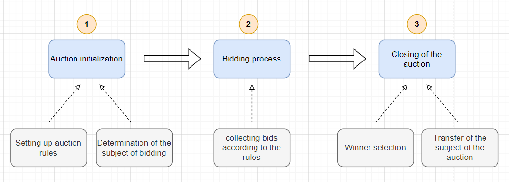
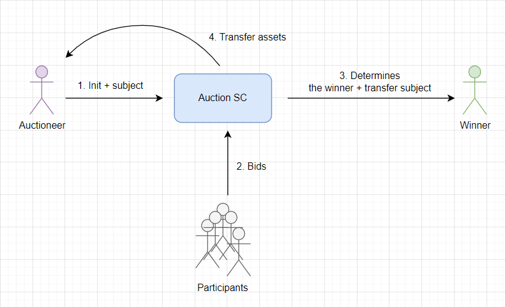
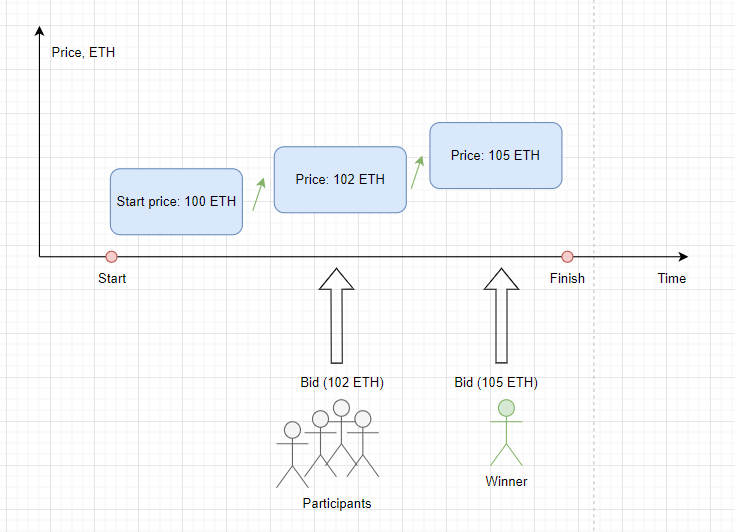
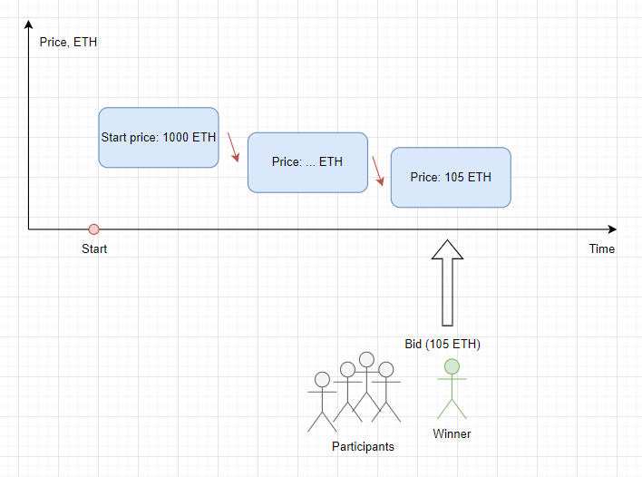
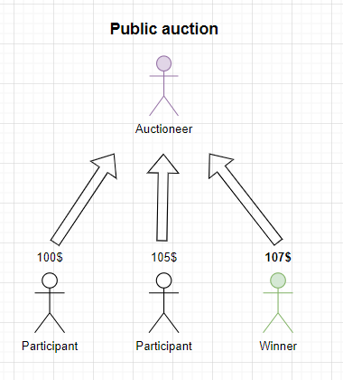
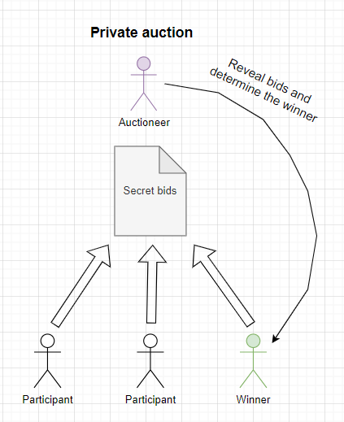
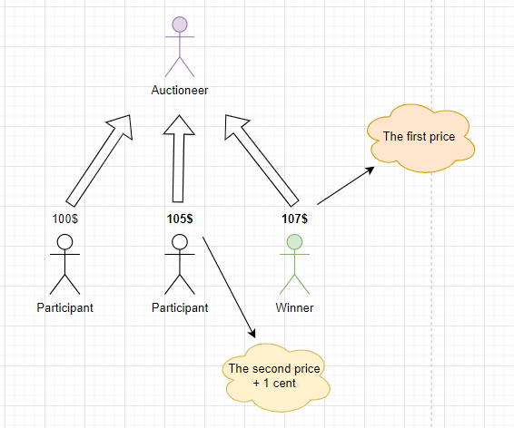
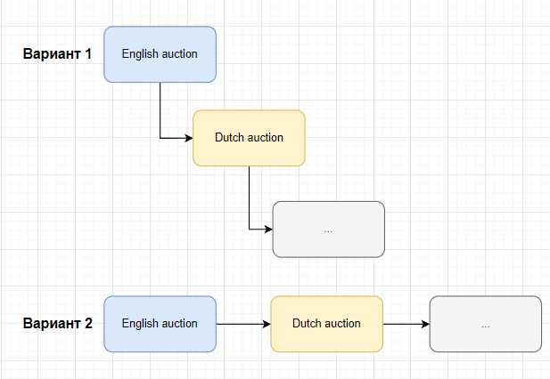
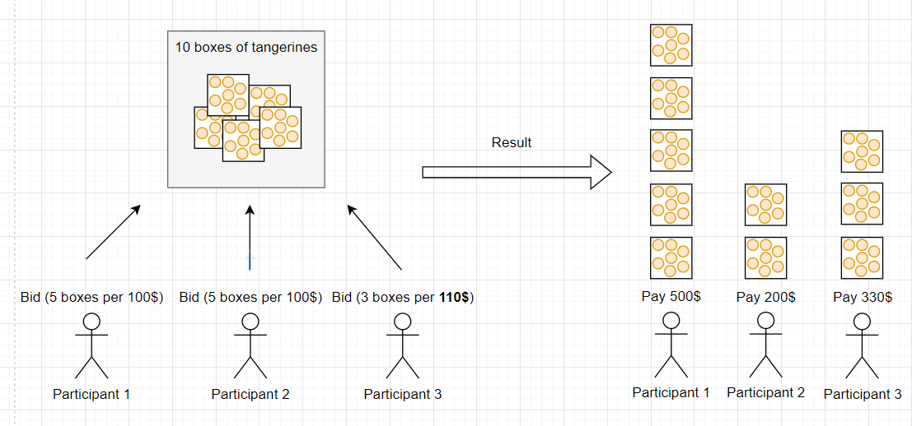

# Auctions

**Автор:** [Павел Найданов](https://github.com/PavelNaydanov) 🕵️‍♂️

_Опр!_ **Аукцион** - это публичная продажа различных предметов, которая производится по заранее установленным правилам. Правила регламентируют основной принцип аукциона - "*соперничество между участниками*" в получении предмета. Победителем аукциона и новым владельцем предмета объявляется участник, который превзойдет своих соперников.

## История появления аукционов

**Аукционная форма** торговли возникла, как способ быстро превратить имущество в деньги или же собрать необходимую сумму для погашения долгов.

[Первые упоминания](https://en.wikipedia.org/wiki/Auction) об аукционах, или скорее похожей формы торговли, датируются 500 годом до н. э.

В более современный тип аукционы трансформировались в конце XVI — XVII веков. В некоторых частях Англии, для продажи товаров и аренды, использовались "свечные аукционы". Пока горело пламя свечи, шел процесс торгов. Когда пламя гасло, торги считались оконченными.

_Интересный случай!_ В 2018 году владелец картины Бэнкси «Девочка с воздушным шаром» выставил её на аукцион, и с последним ударом молотка аукциониста, встроенный в раму [шредер начал резать полотно](https://en.wikipedia.org/wiki/Girl_with_Balloon) на мелкие полоски, остановившись примерно на середине. Художник признался, что заранее расположил в раме шредер для аукциона. После этого автор потребовал изменить название работы на «Любовь в мусорной корзине». Покупательница не стала отказываться от прав собственности, ведь, по оценкам специалистов, стоимость картины в результате такого перформанса выросла в разы.

Существует целая прикладная отрасль экономики - [теория аукционов](https://en.wikipedia.org/wiki/Auction_theory), которая изучает, как участники действует на разных аукционных рынках.

## Как это работает?

Для понимания процесса абстрактного аукциона введем следующие понятия:
1. **Аукционист (auctioneer)** - в классическом понимании, это человек, который ведет аукцион. Основная функция заключается в контроле соблюдения правил аукциона участниками.

2. **Лот (lot)** - базовая единица аукциона, которую участники аукциона потенциально будут желать приобрести. Может быть представлен материальными (картина, предмет искусства) или нематериальными ценностями (услуга, определенный объем работ).

3. **Ставка (bid)** – это цена, предложенная участником аукциона, которую он готов заплатить или получить за предмет торга (лот). Обычно, ставки предлагаются участниками последовательно одна за одной и каждая новая ставка должна улучшить предыдущую.

Любой аукцион включает в себя как минимум три основные фазы:
1. **Инициализация**. Первая стадия настройки правил аукциона и определение предмета торгов.
2. **Торги**. Вторая стадия, в рамках которой участники вступают в состязание, предлагая цены для приобретения лота на аукционе.
3. **Закрытие аукциона**. Определение победителя по результатам торгов и процесс обмена: лот => победителю, активы => аукциону (активы передаются или бывшему владельцу предмета или организаторам аукциона в зависимости от правил аукциона, которые регламентируются смарт-контрактом).

_Важно!_ Главной стадией любого аукциона является процесс **торга**. Благодаря торгам реализуется соперничество между участниками.

За правилами аукциона следит **смарт-контракт**. Взаимодействие с ним основных участников можно представить следующим образом.

Аукционисту необходимо инициализировать смарт-контракт аукциона и задать первоначальные настройки (предмет, длительность тип и так далее). Участники аукциона могут делать ставки (bids). Со ставкой может передаваться актив для покупки лота аукциона. После этого смарт-контракт определяет победителя и проводит обмен лота на актив победителя.

## Виды аукционов

Аукционы делятся на группы по разным принципам.

### По способу предложения цены за лот участниками торгов

- **Аукцион с повышением цены**. Такой аукцион называют *английским*. На старте предлагается минимальная стоимость лота. Участники по очереди предлагают новую цену, которая выше предыдущей. Победителем признаётся участник, предложивший наибольшую цену за лот. Это самая распространенная форма аукционов в настоящее время.

    

- **Аукцион с понижением цены**. Такой аукцион называют *голландским*. На старте предлагается максимальная стоимость лота. С течением времени стоимость уменьшается. Победителем признаётся участник, согласившийся с предлагаемой на аукционе стоимостью лота.

    

### По видимости ставок другими участниками аукциона

- **Открытые**. На протяжение аукциона каждый участник видит ставки других участников. Классический пример открытого аукциона — английский. Чтобы делать ставки на повышение, нужно видеть ставки других участников.

    

- **Закрытые**. На протяжение аукциона никто из участников не видит ставки других участников. Ставки подаются в закрытом виде ("в конвертах"). Каждый участник напрямую, не разглашая публично, сообщает аукционисту (в нашем случае смарт-контракту) размер своей ставки. Примером может являться [слепой аукцион](https://en.wikipedia.org/wiki/First-price_sealed-bid_auction).

    

### По способу определения стоимости лота аукциона

- **Аукцион первой цены**. Победителем является участник, предложивший наибольшую ставку. Стоимость лота определяется согласно *максимальной ставки* (ставки победителя). Обычно закрытые аукционы являются аукционами первой цены.

- **Аукцион второй цены**. Победителем является участник, предложивший наибольшую ставку. Стоимость лота определяется согласно *второй* максимальной ставке + небольшое прибавление (в традиционном аукционе прибавление равняется 1-му центу).

Согласно схеме:
 - если аукцион первой цены, то победитель заплатит **107\$**.
 - если аукцион второй цены, то победитель заплатит **105\$ + 1 cent**.

### По направлению сделки аукциона

- **Форвардный аукцион**. Аукцион предлагает лот на продажу и ожидает самую высокую цену. Это, пожалуй, наиболее распространенный тип аукциона.
- **Обратный аукцион**. Аукцион, в котором выигрывает тот участник, который предложит наименьшую стоимость лота. Обычно под участником понимается исполнитель, который предложит заказчику наименьшую стоимость за выполнение некой работы. Цель обратного аукциона - уменьшить закупочную стоимость лота (товара или услуги).
- **Двойной аукцион**. Аукцион, в котором аукционист принимает предложения как от покупателей, так и от продавцов. Зачастую продавцов несколько, как и покупателей. Примером может служить аукцион ценных бумаг: продавцы и покупатели предлагают цены, по которым они готовы совершить сделку, если цены продавца и покупателя одинаковые, то совершается сделка.

## Опциональные дополнения для аукциона

В любом аукционе могут использоваться дополнительные правила и ограничения, которые будут регламентировать процесс торгов. Предлагаю ознакомиться с наиболее популярными.

### Резервная цена

_Опр!_ **Аукцион с резервной ценой** - это аукцион, на котором предмет аукциона не может быть продан, если окончательная ставка недостаточна высока (*ниже резервной цены*). Резервная цена может быть известна только аукционисту и неизвестна участникам аукциона. Такой вариант аукциона с неизвестной резервной ценой называют **секретным аукционом резервной цены**.

_Важно!_ Более того резервная цена может быть не всегда фиксированной и определяться аукционистом прямо в процессе торгов.

Резервный аукцион безопаснее для владельца предмета в лоте, поскольку от него не требуется соглашаться на низкую стоимость покупки предмета из лота. Однако это может привести к более низкой конечной цене, если резервная цена известна участникам, то им может оказаться не интересно приобретать предмет за цену сильно выше резервной.

### Вариант выкупа

_Опр!_ **Аукцион выкупа** — это аукцион с установленной ценой немедленного **выкупа** аукционного лота. Любой участник торгов, в любой момент времени, может принять цену выкупа, тем самым завершив аукцион и забирая лот себе. Это означает, что торги могут не состоятся, если найдется участник который готов выкупить лот по **цене выкупа**, в противном случае победитель может определяться классически, как участник, предложивший наибольшую цену.

_Важно!_ **Цена выкупа** может оставаться неизменной на протяжении всего аукциона или динамически изменяться в зависимости от правил аукциона.

### Каскадирование

Аукционы могут проводиться каскадно, с наложением друг на друга. Например, аукцион может начинаться, как английский, а через какое-то время продолжиться, как голландский.

В одном из своих примеров каскадирования, [википедия](https://en.wikipedia.org/wiki/Auction) приводит **аукцион в Амстердаме**. Это аукцион премиум класса, который начинается, как простой английский аукцион. Когда остается два участника торгов, каждый из них подает запечатанную ставку в конверте. Побеждает участник, предложивший более высокую цену. Получается в ходе торгов за один лот, аукцион сменил тип с английского на слепой.

Либо аукционы могут проводиться последовательно, один за другим. Как только закончился первый аукцион и лот продан, автоматически стартует второй аукцион с другим или подобным лотом. Типы и правила следующих друг за другом аукционов могут меняться. Сначала может стартовать английский аукцион, по окончанию которого будет запускаться голландский аукцион и так по кругу, пока не кончится запас предметов в лотах.

_Важно!_ Зачастую смена правил или типов аукционов происходит после достижения некоей планки. Планка может обозначать оставшееся количество участников, временной отрезок или тому подобное.

### Еще больше аукционов

По мимо наиболее известных аукционов: **английского** (направлен на повышение цены) и **голландского** (направлен на понижение цены) существуют не менее интересные и созвучные с другими странами аукционы:

1. **Chinese**. Это аукцион с полной оплатой. Каждый участник торгов платит аукционисту свою собственную ставку. Победитель же определяется случайным образом с вероятностью пропорциональной ставке участника. Чем больше ставка, тем больше вероятность выиграть. Это очень похоже на лотерею, где участники покупают билеты по фиксированной цене. Чем больше билетов, тем больше вероятность выиграть. Китайские аукционы часто используются для моделирования выборов (голосования) или патентных гонок, в которых вероятность победы рассматривается, как пропорциональная потраченной сумме актива.

    _Важно!_ Этот аукцион также известен под другими названиями: **penny raffle**, **chance auction** и **tricky tray**.

2. **Japanese**. Аналогичен английскому аукциону, где регулярно повышается цену лота. Отличие от английского заключается в том, что на каждом уровне повышения цены все участники должны делать ставки, чтобы претендовать на победу. Аукцион завершается, когда остается только один участник, который готов сделать ставку.

    Важно!_ Этот аукцион также известен под другими названиями: **button auction**.

3. **Vickrey**. Это аукцион второй цены с закрытыми ставками. Участники одновременно делают ставки, после этого раскрывается личность участника, который предложил наибольшую цену. Однако заплатить будет необходимо по величине второй ставки. Подобный аукцион назван в честь Уильяма Викри, который первым описал его.

4. **Yankee**. Особый вид аукциона, состоящего из нескольких единиц предметов внутри лота. Работает, как голландский аукцион, но только ставка представляет собой количество единиц лота и стоимость одной единицы.
    > Пример!
    > Предположим, на аукционе предлагается 10 коробок мандарин с начальной ставкой 100 долларов за коробку. **Участник №1** делает ставку 100 долларов на 5 коробок, **Участник №2** - 100 долларов на оставшиеся 5 коробок. **Участник №3** ставку выше, 110 долларов за каждую из 3 коробок.
    >
    > Получается, что после аукциона, **Участник №3** получит 3 коробки по 110 долларов каждая, **Участник №2** получит только 2 коробки по 100 долларов, **Участник №1** получит 5 коробок по 100 долларов, так как он сделал ставку первым.

    

    Получается, что на аукционе **Yankee** несколько покупателей делают ставки на один и тот же лот, а в итоге выигрывают те, кто предложил наивысшую цену.

## Применение в реальной жизни

Ниже, я приведу несколько популярных web3 решений, которые используют аукционы для реализации собственных задач.

### Маркетплейсы. Opensea

Маркетплейсы предлагают необычные способы продажи нфт через аукционы. Аукционы могу быть реализованы on-chain или off-chain. На сегодняшний день, подобные решения зарекомендовали себя, как хороший инструмент для наиболее выгодной продажи нфт.

[Opensea](https://opensea.io/) предлагает ограниченный по времени [аукцион](https://support.opensea.io/hc/en-us/articles/1500003246082-How-do-timed-auctions-work-) с повышением цены на покупку нфт. Есть возможность установить стартовую и резервную цену.

### MakerDao. Ликвидации

**Ликвидация** - это процесс, когда заем пользователя перестает быть обеспечен залогом и другой участник протокола (так называемый ликвидатор) может закрыть часть позиции пользователя (займа). Тем самым необходимый коэффициент обеспечения корректируется и пользователь может дальше пользоваться остатками заемных средств.

Когда займ пользователя в MakerDao подходит для ликвидации, автоматически начинается аукцион по продаже **DAI**, который был передан протоколу пользователем в качестве обеспечения. В старой версии модуля ликвидации для этого использовался **английский** аукцион, в новой версии используется **голландский**. При этом, на все время действия аукциона капитал пользователя остается заблокированным.

Почитать про это подробнее можно в [модуле ликвидации](https://docs.makerdao.com/smart-contract-modules/dog-and-clipper-detailed-documentation) MakerDAO.

### Bounce.finance

Этот [протокол](https://www.bounce.finance/) предлагает использовать аукционы "по назначению". По сути, протокол предоставляет площадку для создания 10 видов аукционов в 40 различных блокчейнах. Включает в себя SDK для интеграции протокола в собственный сайт и конструктор аукционов. Имеет несколько продуктов, которые позволяют создавать аукционы для продажи:
- нфт и других токенов
- объектов из реального мира (RWA - real world assets)
- рекламы. Работает, как продажа рекламного места через аукцион

## Примеры реализаций

### Самая базовая реализация на https://solidity-by-example.org/

- [Английский аукцион](https://solidity-by-example.org/app/english-auction/)
- [Голландский аукцион](https://solidity-by-example.org/app/dutch-auction/)

### Слепой аукцион в примера документации solidity

- [Простой аукцион](https://docs.soliditylang.org/en/latest/solidity-by-example.html#simple-open-auction)
- [Слепой аукцион](https://docs.soliditylang.org/en/latest/solidity-by-example.html#blind-auction)

Про слепой аукцион стоит поговорить немного отдельно. Блокчейн прозрачный и это преимущество становится краеугольным в реализации слепого аукциона, где на первой стадии необходимо не раскрывать ставки участников аукциона.

Для решения этой задачи, на помощь приходит известная [схема commit-reveal](https://www.youtube.com/watch?v=LDOzDQ44dM4&ab_channel=BlockchainBob). На сегодняшний день считается, что практически невозможно найти два значения, чьи хеши будут равны, поэтому подобное решение вполне применимо для слепого аукциона.

Немного другая проблема заключается в том, что необходимо обязать пользователя отправлять валюту вместе со значением скрытой ставки, что снова является проблемой, потому что такая ставка не скрытая, даже если само значение захешировано. Здесь может помочь теория игр, авторы контракта в примере документации солидити предлагают позволить вместе с хешированным значением посылать любое значение нативной валюты. На этапе раскрытия ставки излишне присланный эфир будет возвращен участнику аукциона.

### Собственные реализации

Реализации немногим расширены и доработаны, местами могут отличаться от приведенных примеров выше еще и концептуально. Все функции и важные места дополнительно описаны комментариями.

- [Слепой аукцион](./contracts/src/BlindAuction.sol). Есть концептуальное отличие. Реальный эфир участник аукциона присылает только в момент раскрытия информации о ставки.
- [Английский аукцион](./contracts/src/EnglishAuction.sol)
- [Голландский аукцион](./contracts/src/DutchAuction.sol)

## Заключение

Аукционы позволяют существенно расширить возможности любого протокола и предлагают новую форму перехода права владения блокчейн активами от одного владельца к другому. Для правильного использования аукционов необходимо хорошо понимать тонкости и нюансы предметной области web3 и того, как работают обычные классические аукционы. А где встречал аукционы ты?😅

## Links

1. [Blind auction](https://docs.soliditylang.org/en/latest/solidity-by-example.html#blind-auction). Solidity docs
2. [English Auction: A Comprehensive Guide to Implementing it in Solidity](https://medium.com/@solidity101/100daysofsolidity-061-english-auction-a-comprehensive-guide-to-implementing-it-in-solidity-551c5dfaa953)
3. [Auction](https://en.wikipedia.org/wiki/Auction). Wikipedia