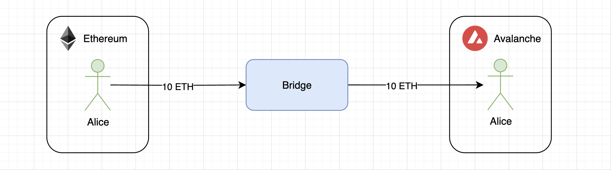
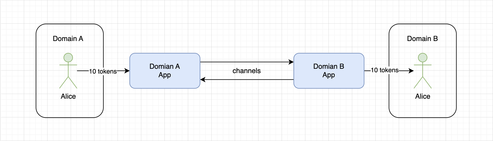
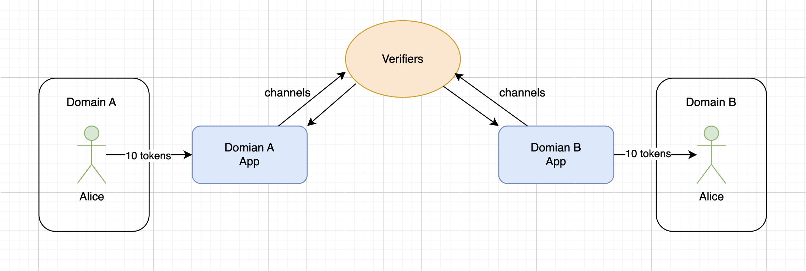
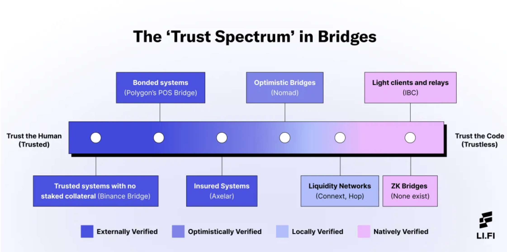
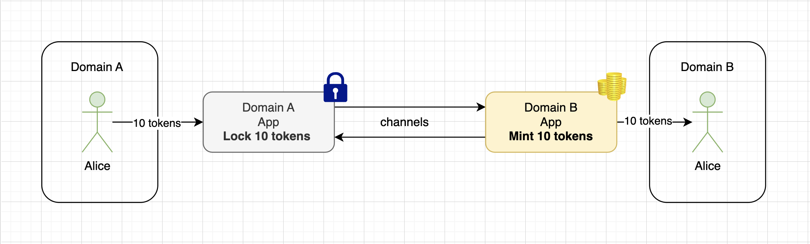
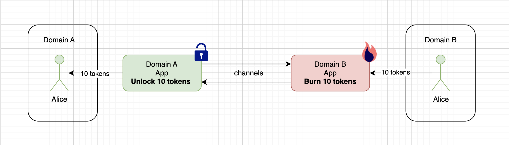
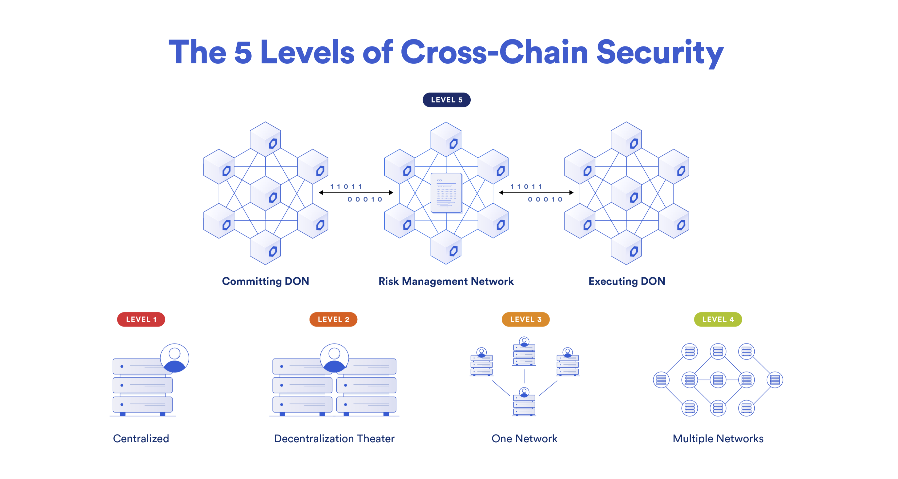
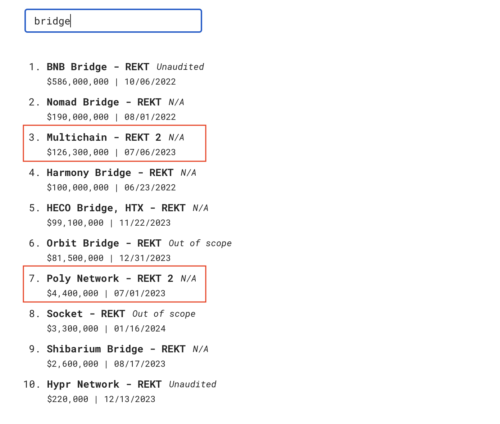

# Bridges

**Автор:** [Роман Ярлыков](https://github.com/rlkvrv) 🧐

В вопросе блокчейн-мостов есть очень важное понятие, с которого стоит начать — это интероперабельность.

*Определение:* **Интероперабельность** (от англ. [interoperability](https://en.wikipedia.org/wiki/Interoperability) — способность к взаимодействию) — это способность продукта или системы, интерфейсы которых полностью открыты, взаимодействовать и функционировать с другими продуктами или системами без каких-либо ограничений доступа и реализации.

Блокчейны, как правило, представляют собой изолированные среды, которые могут обладать большим числом пользователей и высоким уровнем активности, но при этом не могут взаимодействовать с другими подобными системами, что их сильно ограничивает. Для обеспечения интероперабельности криптоэкосистеме необходимы блокчейн-мосты.

*Определение:* **Блокчейн-мост** — это технология, которая позволяет различным блокчейн-сетям взаимодействовать между собой, обмениваться активами, данными и информацией.

Мосты создают транспортный маршрут (канал) между блокчейнами, по которому токены, сообщения, произвольные данные и даже вызовы смарт-контрактов могут передаваться из одной цепи в другую. Разные блокчейны обладают уникальными сильными и слабыми сторонами (такими как скорость, пропускная способность, стоимость транзакций и т.д.), поэтому мосты способствуют развитию всей криптовалютной экосистемы, позволяя блокчейнам использовать инновации друг друга.

## Базовая архитектура

Для начала разберемся, что происходит на самом верхнем уровне при передаче чего-либо из блокчейна А в блокчейн Б.

Например, у Алисы есть 10 ETH в Ethereum, но она хочет использовать их в экосистеме другого блокчейна (например, Avalanche, Tron, Polygon и т.д.) с более низкими комиссиями или для использования в каком-то уникальном DeFi-протоколе. Однако технически это два разных блокчейна, и они никак не могут взаимодействовать напрямую в силу различий в консенсусе, правилах сообщества, обработке транзакций и т.д. Здесь и вступает в игру мост.

Для Алисы это выглядит так: она взаимодействует с мостом, отправляет ему ETH и затем получает ETH уже в другом блокчейне (либо они приходят на аккаунт Алисы, либо их нужно будет клеймить). В блокчейне Б (пусть это будет Avalanche) Алиса получит не оригинальный ETH, а так называемый "синтетический актив", который будет иметь ценность только до тех пор, пока соответствующее количество ETH хранится на мосту.



Теперь Алиса может использовать свои ETH в другом блокчейне. Главная мысль в том, что мост здесь выступает в роли третьей стороны, которая обеспечивает совместимость двух различных блокчейнов. В такой схеме третьей стороной может выступить даже обычный пользователь, у которого есть средства в Avalanche.

Конечно, одна сущность не может обработать обе транзакции в разных блокчейнах, поэтому криптограф и разработчик мостов [James Prestwich](https://x.com/_prestwich/), в своем [докладе про создание мостов](https://www.youtube.com/watch?v=ZQJWMiX4hT0), предлагает ввести понятие "приложение". Это значит, что у блокчейна А будет своё приложение, а у блокчейна Б — своё. К слову, так как мост может быть не только между двумя разными блокчейнами, но и между двумя уровнями одного блокчейна (Layer 1 и Layer 2), например между Ethereum и Arbitrum, в любой статье про мосты будет использоваться понятие "домен".

> *Домен* - в контексте мостов это главная сущность, которая участвует в обмене сообщениями со стороны отправителя или со стороны получателя (например блокчейн или Layer 2).

Так вот, домены могут разительно отличаться (Bitcoin и Ethereum, Ethereum и Solana, Cardano и Polkadot), поэтому для их взаимодействия каждому домену нужно своё приложение, а основные процессы передачи данных будут лежать в криптографической плоскости (подписи, деревья Меркла и т.д.). Конечно, для связи двух таких приложений понадобятся каналы (channels).

Переходя на более абстрактный уровень, процесс, описанный выше, будет выглядеть следующим образом:



При этом **домен А** не может просто отправить сообщение по каналу **домену Б** и получить от **домена Б** подтверждение о том, что сообщение доставлено. Это односторонняя связь. Поэтому необходима третья сторона — верификаторы.



Всё становится несколько сложнее, потому что, как правило, именно в верификаторах и том, как они взаимодействуют с приложениями, кроются основные различия мостов. В контексте разработки различных конструкций мостов существует такое понятие, как **трилемма интероперабельности**, которая гласит, что протоколы интероперабельности или мосты могут обладать только двумя из следующих трёх свойств:

- **Отсутствие доверия (Trustlessness)** — обеспечение безопасности, эквивалентной безопасности базового домена.
- **Возможность расширения (Extensibility)** — поддержка любого домена.
- **Обобщаемость (Generalizability)** — способность обрабатывать произвольные междоменные данные.

Подробнее о трилемме можно почитать в [этой статье](https://medium.com/connext/the-interoperability-trilemma-657c2cf69f17). Я лишь приведу наглядное изображение трилеммы из этой статьи:


В связи с трилеммой существует большое количество различных подходов и решений, потому что крайне сложно создать мост, который будет в достаточной мере удовлетворять всем свойствам. В некоторых случаях такая необходимость вовсе отсутствует.

## Классификация мостов

В [этой статье](https://medium.com/1kxnetwork/blockchain-bridges-5db6afac44f8) довольно подробно описана классификация мостов. Она обширна, поэтому здесь мы постараемся кратко пройтись по основным моментам.

Глобально мосты обычно разделяют на два вида: **trusted (доверенные)** и **trustless (без доверия)**.

- **Trusted** — доверенные мосты проверяются извне, т.е. используют внешний набор верификаторов для передачи данных между доменами: федерации с мультиподписями, системы многопользовательских вычислений ([MPC](https://en.wikipedia.org/wiki/Secure_multi-party_computation)), сети оракулов. Такие мосты обычно демонстрируют хорошую производительность с точки зрения скорости и экономической эффективности, но при этом приходится жертвовать безопасностью.

- **Trustless** — эти мосты полагаются на безопасность доменов, которые они соединяют, для передачи данных. Можно сказать, что это система, в которой доверие отсутствует, поскольку безопасность должна быть на уровне базового домена. Такие мосты считаются более безопасными. В данном случае в жертву обычно приносится либо возможность поддерживать большое количество различных доменов, либо способность обрабатывать произвольные данные.

В целом это очень условное разделение. Мне понравилось, как в [статье протокола LI.FI](https://blog.li.fi/li-fi-with-bridges-trust-is-a-spectrum-354cd5a1a6d8) уровень доверия представлен в виде спектра.



Пройдем слева направо этого спектра:

- **Trusted system with no staked collateral** — верификаторы не размещают залоговое обеспечение, поэтому пользователи потеряют средства в случае сбоя или взлома системы. Можно полагаться только на репутацию моста. Пример — [Binance Bridge](https://www.bnbchain.org/en/bnb-chain-bridges).
- **Bounded systems** — верификаторы вносят обеспечение в нативном токене сети, что дает им экономическую выгоду, но в случае неблагоприятной ситуации обеспечение, скорее всего, будет сожжено. Пользователи также потеряют свои средства в случае ошибки или взлома. Пример — печально известный [Ronin Bridge](https://docs.roninchain.com/validators/onboarding/become-validator#prerequisites).
- **Insured system** — также предполагается внесение обеспечения, но, в отличие от предыдущих вариантов, убытки пользователей покрываются за счёт этого обеспечения. Пример — [Axelar](https://docs.axelar.dev/dev/general-message-passing/express/#axelar-intents-express-service).
- **Optimistic bridge** — система, схожая с "Optimistic rollups", где все транзакции считаются валидными, пока не доказано обратное. Верификаторами выступают наблюдатели, которые имеют экономический стимул находить "плохие" движения по мосту. Пример — [Nomad](https://docs.nomad.xyz/the-nomad-protocol/verification-mechanisms/optimistic-verification).
- **Liquidity Networks** — это похоже на p2p сеть, где каждый узел действует в качестве провайдера ликвидности для определённого домена (их называют роутеры). В качестве роутера может выступать любой пользователь, минимальных ограничений по ликвидности нет. В системе есть сиквенсер, который собирает заявки и может подключить для выполнения сколько угодно роутеров. Безопасность обеспечивается благодаря механизмам блокировки средств и возможности оспаривать действия роутеров. Преимущество в том, что в сети назначения получаете не производный синтетический актив, а средства, хранящиеся в этом блокчейне. Это похоже на кросс-чейн обмен токенов. Пример — [Everclear](https://www.everclear.org/), ранее называвшийся Connext.
- **Light clients and relayers** — верификаторы здесь — это пользователи, которые отслеживают события, уже добавленные в исходный блокчейн. Затем формируются доказательства того, что событие произошло, и эти доказательства пересылаются в домен назначения вместе с заголовками блоков (т.е. отправляется так называемый "легкий клиент"). Смарт-контракт в домене назначения проверяет заголовки и, если событие действительно произошло, выполняет действие в домене назначения. Требуется, чтобы субъект "ретранслировал" заголовки блоков и доказательства. Хотя пользователь может самостоятельно ретранслировать транзакции, предполагается, что ретрансляторы будут непрерывно пересылать данные. Это относительно безопасная конструкция моста, поскольку она гарантирует достоверную доставку без доверия к посредникам (trustless), но проверка в домене назначения обычно очень затратна по расходам на газ. Пример — [Cosmos IBC](https://cosmos.network/ibc/).
- **ZK Bridges** — мосты, построенные на доказательствах с нулевым разглашением (ZKP), также используют легкие клиенты и ретрансляторы для проверки межцепочечных передач и считаются ещё одним вариантом trustless реализации. Пример — [ZKSync bridge](https://portal.zksync.io/bridge/) (работает только между Ethereum и ZKSync).

## Типы мостов

В базовой модели мостам для правильного функционирования необходимо отслеживать события в исходном домене, ретранслировать их в домен назначения и проверять валидность ретранслируемой информации. В связи с этим большинство мостов конструктивно состоят из нескольких компонентов:

- **Мониторинг**. Обычно существует субъект, либо “оракул“, либо “валидатор“, либо “ретранслятор", который отслеживает состояние исходного домена.
- **Передача / ретрансляция сообщений**. После того как субъект фиксирует событие, ему необходимо передать информацию из домена источника в домен назначения.
- **Консенсус**. В некоторых моделях требуется консенсус между участниками, отслеживающими домен источник, чтобы передать эту информацию домену назначения.
- **Подписание**. Участникам необходимо криптографически подписывать информацию, отправляемую в домен назначения, либо индивидуально, либо как часть схемы пороговой подписи.

На основе такой конструкции существует примерно четыре типа мостов, каждый из которых имеет свои преимущества и недостатки:

1. **Asset-specific** — единственная задача такого моста — это доступ к определённому активу одного блокчейна в другом блокчейне (тут скорее именно блокчейны, хотя их тоже можно назвать доменами). Активы в блокчейне назначения часто являются "обёрнутыми", они полностью обеспечены базовым активом. Биткойн — наиболее распространённый актив, который соединяется с другими блокчейнами.
2. **Chain-specific** — мост между двумя доменами, который по механике такой же, как и "asset-specific", но осуществляет передачу нескольких активов (пример — Polygon PoS bridge).
3. **Application-specific** — используется для конкретного приложения, когда DApp поддерживает мультичейновость. Может осуществлять передачу не только активов, но и данных (пример — Thorchain).
4. **Generalized** — протоколы для передачи информации между несколькими доменами (пример — Chainlink).

Говоря про передачу активов, стоит упомянуть самые распространённые модели их передачи.

1. Мы уже несколько раз упоминали "оборачивание" актива из исходного домена — это довольно распространённый способ для мостов. Делается это следующим образом:
   - В исходном домене блокируется базовый актив, а в домене назначения чеканится его синтетическая версия по курсу 1:1. Например, для BTC это будет WBTC (Wrapped BTC).
   
   - В процессе обратного обмена в домене, который чеканил "обёртку", этот актив сжигается, а в базовом домене он разблокируется.
   

2. Вторая модель передачи активов называется **атомарные свопы** (atomic swaps). Фактически это просто обмен токенов из исходного домена на токены из домена назначения. Для этого часто используется схема HTLC (Hashed Timelock Contracts). Если кратко, HTLC позволяет двум пользователям обменивать криптовалюту напрямую между различными доменами без необходимости доверять внешним посредникам (p2p), для этого используется специальный секрет, который особым образом обрабатывается на смарт-контрактах позволяя выполнить сделку безопасно для всех участников. Подробнее про HTLC [тут](https://en.bitcoin.it/wiki/Hash_Time_Locked_Contracts) и [тут](https://www.youtube.com/watch?v=VZX2ApRLuwM).

## Компромиссы, которые нужно учитывать при разработке моста

В случае с мостами не бывает идеальных решений, всегда существуют некоторые компромиссы, необходимые для достижения конкретной цели. Можно оценивать мосты на основе следующих факторов:

- **Безопасность** — кто проверяет систему? Мосты, защищённые внешними валидаторами, обычно менее безопасны, чем мосты, которые локально или изначально защищены валидаторами блокчейна.
- **Удобство** — сколько времени требуется для завершения транзакции и сколько транзакций пользователю нужно подписать? Сколько времени требуется разработчику для интеграции моста и насколько сложен этот процесс?
- **Возможности подключения** — какие различные цепочки назначения может подключать мост (например, rollups, sidechains, другие блокчейны Layer 1 и т.д.), и насколько сложно интегрировать новый блокчейн?
- **Возможность передачи более сложных данных** — может ли мост обеспечивать передачу сообщений и более сложных произвольных данных по цепочкам, или он поддерживает только межцепочечную передачу активов?
- **Экономическая эффективность** — сколько стоит передача активов по цепочкам через мост? Как правило, мосты взимают фиксированную или переменную плату в зависимости от стоимости газа и ликвидности конкретных маршрутов. Также важно оценить экономическую эффективность моста на основе капитальных вложений, необходимых для обеспечения его безопасности.

## Как сделать свой мост

### Централизованная версия

Нужно понимать, что при всей кажущейся простоте, создание мостов — нетривиальная задача. Для начала возьмем самый простой пример.

Дано:
- 2 EVM-домена;
- 1 централизованный наблюдатель;
- Задача — передать ERC20-токен из домена А в домен Б и обратно.

Возьмем тестовые сети Sepolia и Polygon Amoy (на момент написания статьи они актуальны, но их можно заменить на любые другие).

Исходный токен будет в сети Sepolia, напишем для него [смарт-контракт](./contracts/contracts/OriginToken.sol). Всё, что он будет делать — это создавать ERC20-токен и минтить на адрес деплоера 100 токенов.

```solidity
contract OriginToken is ERC20 {
    constructor() ERC20("OriginToken", "OT") {
        _mint(msg.sender, 100e18);
    }
}
```

Далее создаем обертку, или синтетический токен для нашего исходного токена, его мы будем деплоить в Polygon Amoy. Полный код [здесь](./contracts/contracts/DestinationToken.sol).

```solidity
contract DestinationToken is ERC20, ERC20Burnable {
    address _bridge;

    error OnlyBridge();

    constructor(address bridge) ERC20("DestinationToken", "DT") {
        _bridge = bridge;
    }

    // Добавляем модификатор, который позволит минтить и сжигать токены
    // только с адреса моста 
    modifier onlyBridge() {
        if (msg.sender != _bridge) {
            revert OnlyBridge();
        }

        _;
    }

    function mint(address recipient, uint256 amount) external onlyBridge {
        _mint(recipient, amount);
    }

    function burnFrom(address account, uint256 amount) public override(ERC20Burnable) onlyBridge {
        super.burnFrom(account, amount);
    }
}
```

Теперь нужно выполнить деплой токенов. OriginToken мы развернем в сети Sepolia, а DestinationToken — в сети Polygon Amoy.

_Примечание:_ Если вы захотите поиграться с этим примером — можете использовать уже развернутые токены, не обязательно деплоить их заново, подробнее [тут](./contracts/README.md#centralized-bridge-example).

У нас есть адреса двух токенов в разных сетях. Поскольку это EVM-сети, мы можем использовать одинаковые адреса EOA для отправителя и получателя токенов.

Помимо этого, мы будем использовать ещё один EOA-адрес — он будет выступать в роли моста, т.е. на нём будут блокироваться средства пользователей. Идея в том, что мы можем отслеживать на смарт-контрактах токенов событие "Transfer", и если перевод был сделан на адрес моста, то мы будем минтить или сжигать токены в зависимости от направления перевода.

Для этого функционала нам понадобится наблюдатель (watcher) — это будет незамысловатый JavaScript-код. Всё, что понадобится, — это RPC-адреса для доступа к обоим блокчейнам и немного тестовых ETH для оплаты газа в обеих сетях (можно взять [тут](https://faucets.chain.link/sepolia) или [тут](https://www.alchemy.com/faucets/ethereum-sepolia)).

Наблюдатель будет отслеживать все трансферы в оригинальной сети:

```JavaScript
const originToken = new ethers.Contract(
    ORIGIN_TOKEN_CONTRACT_ADDRESS,
    originTokenAbi.abi,
    bridgeSepolia,
);

originToken.on('Transfer', (from, to, value, event) => {
    if (from == bridgeSepolia.address) {
        return;
    }
    // Если получатель токенов в оригинальной сети — адрес моста
    // то после получения перевода мы минтим отправителю токены
    // в сети назначения
    if (to == bridgeSepolia.address && to != from) {
        console.log(
            '\n Tokens received on bridge from Sepolia chain! Time to bridge!',
        );

        try {
            mintTokens(from, value);

            console.log('✅✅✅✅✅ Tokens minted ...');
            console.log('🌈🌈🌈🌈🌈 Bridge to destination completed');
        } catch (err) {
            console.error('Error processing transaction', err);
        }
    } else {
        return;
    }
});
```

Если получатель токенов в оригинальной сети — адрес моста, то после получения перевода мы минтим отправителю токены в сети назначения:

```JavaScript
async function mintTokens(recipient, amount) {
    const mintTx = await destinationToken.mint(recipient, amount);
    const mintReceipt = await mintTx.wait();

    if (mintReceipt) {
        // Проверка баланса отправителя в сети Sepolia
        const originBalance = await originToken.balanceOf(recipient);
        console.log(
            `Sepolia sender balance: ${ethers.formatEther(
                originBalance,
            )} Tokens`,
        );

        // Проверка баланса получателя в сети Polygon Amoy
        const destinationBalance = await destinationToken.balanceOf(recipient);

        console.log(
            `Polygon Amoy recipient balance: ${ethers.formatEther(
                destinationBalance,
            )} Tokens`,
        );
    }
}
```

Наблюдатель готов, осталось написать отдельный скрипт для трансфера токенов на адрес моста. Основная функция этого скрипта будет выполнять одно действие — перевод токенов мосту:

```JavaScript
async function sendOriginTokenToBridge() {
    try {
        const txResponse = await originToken.transfer(
            bridgeWallet.address,
            ethers.parseEther('1'),
        );
        console.log('Tx sent:', txResponse.hash);

        const receipt = await txResponse.wait();
        console.log('Tx confirmed:', receipt.blockNumber);
    } catch (error) {
        console.error('Tx error:', error);
    }
}
```

#### Перевод токенов из оригинальной сети в сеть назначения

Теперь мы готовы к первому трансферу. Для этого сначала запускаем наблюдателя:

```bash
Watching ...
```

После запуска наблюдателя необходимо в отдельном терминале выполнить скрипт на перевод токенов. Код скрипта [здесь](./contracts/scripts/sendTokensToDestination.js).

```bash
Tx sent: 0x12fe9602196d5f2e9c8c26ecf170f6804e620b02a4e0461c539d5857d875c895
Tx confirmed: 6594705 // это просто номер блока
```

Транзакция выполнена, скрипт наблюдателя должен отреагировать на этот трансфер:

```bash
 Tokens received on bridge from Sepolia chain! Time to bridge!
✅✅✅✅✅ Tokens minted ...
🌈🌈🌈🌈🌈 Bridge to destination completed
Sepolia sender balance: 99.0 Tokens
Polygon Amoy recipient balance: 1.0 Tokens
```

Ура! Токены были успешно переведены из Sepolia в Polygon Amoy. Теперь в оригинальном домене они будут храниться на адресе моста, а в сети назначения будет использоваться их обёртка.

#### Обратный перевод токенов в оригинальную сеть

Для обратного перевода потребуется добавить несколько функций в скрипт наблюдателя, чтобы отслеживать трансферы и сжигать токены:

```JavaScript
const destinationToken = new ethers.Contract(
    DESTINATION_TOKEN_CONTRACT_ADDRESS,
    destinationTokenAbi.abi,
    bridgeAmoy,
);

destinationToken.on('Transfer', (from, to, value, event) => {
    if (from == bridgeAmoy.address) {
        return;
    }
    if (to == bridgeAmoy.address && to != from) {
        console.log(
            '\n Tokens received on bridge from Polygon Amoy chain! Time to bridge!',
        );

        try {
            burnTokens(from, to, value);
            console.log('🔥🔥🔥🔥🔥 Tokens burned ...');
            console.log('🌈🌈🌈🌈🌈 Bridge to origin completed');
        } catch (err) {
            console.error('Error processing transaction', err);
        }
    } else {
        return;
    }
});
```

Когда выполняется обратная операция, синтетические токены сжигаются, а токены в оригинальной сети "разблокируются":

```JavaScript
async function burnTokens(from, to, amount) {
    // Перед тем как сжигать токены, необходимо выдать апрув на это действие
    const approveTx = await destinationToken.approve(to, amount);
    const approveReceipt = await approveTx.wait();

    // Сжигаем токены
    const burnTx = await destinationToken.burnFrom(to, amount);
    const burnReceipt = await burnTx.wait();

    if (approveReceipt && burnReceipt) {
        const destinationBalance = await destinationToken.balanceOf(from);

        console.log(
            `Polygon Amoy sender balance: ${ethers.formatEther(
                destinationBalance,
            )} Tokens`,
        );
    }

    // Переводим токены в оригинальной сети
    const transferTx = await originToken.transfer(from, amount);
    const transferReceipt = await transferTx.wait();

    if (transferReceipt) {
        const originBalance = await originToken.balanceOf(from);

        console.log(
            `Sepolia recipient balance: ${ethers.formatEther(
                originBalance,
            )} Tokens`,
        );
    }
}
```

На этот раз кода немного больше. Дело в том, что перед сжиганием необходимо выдать апрув, а после сжигания отправить токены с адреса моста получателю в оригинальной сети. Для этого понадобится ещё один скрипт для перевода токенов мосту в сети Polygon Amoy. Код очень похож на скрипт отправки в сеть назначения, вы можете посмотреть его [здесь](./contracts/scripts/sendTokensToOrigin.js).

После успешного обратного трансфера наблюдатель должен вывести следующую информацию:

```bash
 Tokens received on bridge from Polygon Amoy chain! Time to bridge!
🔥🔥🔥🔥🔥 Tokens burned ...
🌈🌈🌈🌈🌈 Bridge to origin completed
Polygon Amoy sender balance: 0.0 Tokens
Sepolia recipient balance: 100.0 Tokens
```

Мы видим, что токены были доставлены получателю в оригинальной сети. Поздравляю, мост готов!

#### Плюсы и минусы такого подхода

Или всё же не готов? Ранее мы обсуждали, из каких основных компонентов состоит мост. В данном примере мы реализовали только наблюдателя и ретранслятор сообщений. При этом отсутствует какая-либо верификация сообщений, защита и гарантии того, что пользователь получит свои средства. Также нужно было использовать подписи, которые передавались бы из одного домена в другой.

Такой системе достаточно того, чтобы наблюдатель перестал отслеживать события, и мост сломается. Более того, в этом примере мы не учитывали "финализацию транзакций" ([transaction finality](https://medium.com/coinmonks/understanding-transaction-finality-310e46b47a22)) ни в оригинальной сети, ни в сети назначения. Для финализации транзакции может потребоваться несколько минут, и это также может легко нарушить работу моста. Также мы использовали обычный EOA, который может просто забрать все средства себе. В общем из плюсов у такого решения могут быть только скорость и приятный интерфейс, но в целом это очень хрупкий мост.

*Мораль*. Вы можете видеть красивый интерфейс моста, но под капотом у него может быть что-то подобное.

Полный код наблюдателя доступен [здесь](./contracts/scripts/bridgeWatcher.js), а подробная инструкция по развертыванию моста — [здесь](./contracts/README.md).

### Децентрализованная версия

К счастью, крупные протоколы стремятся к децентрализации и отказу от доверия. Это не гарантирует полную безопасность, но уменьшает риски, связанные с централизацией, что делает мост менее хрупким.

Создание таких мостов гораздо сложнее. Примером является решение от протокола Chainlink, которое предлагает использовать децентрализованный протокол CCIP (Chainlink Cross-Chain Interoperability Protocol) для кроссчейн-взаимодействия между [EVM-совместимыми сетями](https://docs.chain.link/ccip/supported-networks/v1_2_0/mainnet). CCIP позволяет осуществлять передачу токенов и произвольных данных в виде сообщений.

У Chainlink есть статья про [5 уровней межцепочной безопасности](https://blog.chain.link/five-levels-cross-chain-security/#level_5__defense-in-depth), где они ставят CCIP на самый высокий, 5й уровень за счет участия в системе 3-х децентрализованных слоев для обеспечения работы одного протокола.



Одна сеть отвечает за фиксацию события в исходном домене, вторая проверяет эту фиксацию, а третья выполняет действия. Это не отдельные блокчейны, а децентрализованные оракулы (DON). Токены хранятся в смарт-контрактах под названием Token Pool. Схема работы выглядит следующим образом:


Есть хорошее [видео](https://youtu.be/-2qzC0lqId0?feature=shared), в котором просто объясняется, как работает протокол. Для более детального понимания можно обратиться к [официальной документации](https://docs.chain.link/ccip/architecture#token-pools).

#### Строим мост

Для передачи токенов из домена А в домен Б мы будем взаимодействовать со смарт-контрактом Router в домене A и таким же смарт-контрактом в домене Б. Для примера снова возьмем Ethereum Sepolia и Polygon Amoy, к тому же мы можем переиспользовать токены, которые задеплоили для примера с централизованной версией моста.

Проблема в том, что передавать через CCIP можно только те токены, [для которых созданы пулы](https://github.com/smartcontractkit/ccip/blob/6bdc1dc03992f698d0dbf60a104a0a5ec8847a34/contracts/src/v0.8/ccip/Router.sol#L136) в протоколе CCIP, но хорошая новость в том, что никто не запрещал передавать данные. То есть теперь у нас есть надежный внешний наблюдатель (CCIP), остается только написать смарт-контракты на Solidity, которые будут взаимодействовать с роутерами CCIP. На схеме это будет выглядеть следующим образом (наши смарт-контракты на схеме это dApp и x-dApp).


Да, нужно будет развернуть два смарт-контракта в обеих сетях, но для простоты мы сделаем один универсальный смарт-контракт, который будет отвечать и за отправку сообщений, и за их получение. Более того, он будет работать по схеме "lock and mint" для отправки токенов из исходной сети и "burn and unlock" для их возврата, как и в примере с централизованным мостом.

Для начала импортируем все необходимое:
```solidity
// Интерфейс роутера нужен для отправки сообщений
import {IRouterClient} from "@chainlink/contracts-ccip/src/v0.8/ccip/interfaces/IRouterClient.sol";
// От смарт-контракта CCIPReceiver нужно наследоваться для возможности получения сообщений
import {CCIPReceiver} from "@chainlink/contracts-ccip/src/v0.8/ccip/applications/CCIPReceiver.sol";
// Библиотека Client пригодится нам и для отправки, и для получения сообщений
import {Client} from "@chainlink/contracts-ccip/src/v0.8/ccip/libraries/Client.sol";
```

Рассмотрим, какие данные понадобятся для развертывания этих смарт-контрактов:
- **router**: смарт-контракт CCIP [Router](https://github.com/smartcontractkit/ccip/blob/a793f34cdd1e87b31511860d10cc9a91e53ee4d5/contracts/src/v0.8/ccip/Router.sol) для той сети, где будет развернуто приложение.
- **token**: наш токен (Origin для исходной сети и Destination для сети назначения).
- **link**: адрес токена LINK, также для каждой сети будет отличаться. Это нужно для оплаты транзакций токенами LINK.
- **originTokenChainSelector**: селектор исходной сети, выдается Chainlink, можно глянуть [тут](https://arc.net/l/quote/yaxleotz).
- **thisChainSelector**: селектор сети, в которой будет развернут этот смарт-контракт.

```solidity
contract TokenBridge is Ownable, CCIPReceiver {
    constructor(
        address router, // Смарт-контракт CCIP Router для соответствующей сети
        IToken token, // Origin или Destination
        address link, // Адрес токена LINK для соответствующей сети
        uint64 originTokenChainSelector, // Селектор исходной сети
        uint64 thisChainSelector // Селектор сети, в которой развертывается приложение
    ) Ownable(msg.sender) CCIPReceiver(router) {
        _token = token;
        _link = link;
        _originTokenChainSelector = originTokenChainSelector;
        _thisChainSelector = thisChainSelector;
    }
}
```

Стоит пару слов уделить оплате. Если в той сети, где вы будете отправлять сообщение, за комиссию вы заплатите нативной валютой, то в сети назначения ее можно оплатить двумя способами: в нативной валюте или токеном LINK. Поэтому нам понадобится вот такой `enum`.

```solidity
    enum PayFeesIn {
        Native,
        LINK
    }
```

Теперь главная функция для отправки сообщений, вот что она делает:
1. Первые три параметра, которые принимает функция `sendToken`, относятся к сети назначения (селектор, адрес смарт-контракта моста и адрес получателя токенов). Адреса мы сразу проверяем, а селектор проверит Router.
2. Далее нужно сформировать данные для передачи и оценить их стоимость (я вынес это в отдельную функцию, о ней чуть позже).
3. Определяем способ оплаты и проверяем, что передано достаточно эфира, если выбран нативный метод оплаты.
4. В зависимости от метода оплаты отправляем сообщение роутеру, чтобы он переправил его в сеть назначения.
5. Если сообщение отправлено успешно, списываем токены пользователя (Origin или Destination). Для простоты считаем, что в сети назначения после получения сообщения код выполнился успешно.
6. Последним пунктом определяем, где мы находимся, и если это сеть с синтетическим токеном, то сжигаем его.

```solidity
    function sendToken(
        uint64 destinationChainSelector, // Селектор сети назначения
        address destinationBridgeAddress, // Мост сети назначения
        address destinationChainReceiver, // Получатель токенов
        address tokenSender, // Отправитель токенов
        uint256 amount, // Количество токенов
        PayFeesIn payFeesIn // Способ оплаты
    ) external payable returns (bytes32 messageId) {
        // Проверяем валидность адресов
        if (destinationBridgeAddress == address(0) || destinationChainReceiver == address(0)) {
            revert InvalidReceiver();
        }

        // Подготавливаем данные для отправки
        (bytes memory sendingData, Client.EVM2AnyMessage memory message, uint256 fee) = prepareMessage(
            destinationChainSelector, destinationBridgeAddress, destinationChainReceiver, amount, payFeesIn
        );

        // Проверяем, что передано достаточно эфира, если это необходимо
        if (payFeesIn == PayFeesIn.Native && fee > msg.value) {
            revert NotEnoughValueSent(msg.value, fee);
        }

        // В зависимости от способа оплаты отправляем сообщение либо с эфиром, либо с LINK
        if (payFeesIn == PayFeesIn.Native) {
            messageId = IRouterClient(i_ccipRouter).ccipSend{value: fee}(destinationChainSelector, message);
        } else {
            IToken(_link).transferFrom(tokenSender, address(this), fee);
            IToken(_link).approve(i_ccipRouter, fee);

            uint256 linkBalance = IToken(_link).balanceOf(address(this));
            if (fee > linkBalance) {
                revert NotEnoughLinkBalance(linkBalance, fee);
            }
            messageId = IRouterClient(i_ccipRouter).ccipSend(destinationChainSelector, message);
        }

        emit MessageSent(messageId, destinationChainSelector, destinationBridgeAddress, sendingData, tokenSender, fee);

        // Списание токенов у пользователя
        bool success = _token.transferFrom(tokenSender, address(this), amount);
        if (!success) {
            revert TransferFailed();
        }

        // Если это сеть назначения, сжигаем токены
        if (_thisChainSelector != _originTokenChainSelector) {
            _token.approve(address(this), amount);
            _token.burnFrom(address(this), amount);
        }
    }
```

Теперь про подготовку данных. Важно отметить, что адрес получателя должен быть в формате bytes32, поэтому кодируем его вместе с суммой через `abi.encode()`.

```solidity
    function prepareMessage(
        uint64 destinationChainSelector,
        address destinationBridgeAddress,
        address destinationChainReceiver,
        uint256 amount,
        PayFeesIn payFeesIn
    ) public view returns (bytes memory sendingData, Client.EVM2AnyMessage memory message, uint256 fee) {
        // Подготавливаем содержание сообщения
        sendingData = abi.encode(destinationChainReceiver, amount);

        // Формируем сообщение в правильном формате (см. ниже)
        message = _buildCCIPMessage(destinationBridgeAddress, payFeesIn, sendingData);

        // Считаем комиссию в ETH или LINK в зависимости от параметра payFeesIn
        fee = IRouterClient(i_ccipRouter).getFee(destinationChainSelector, message);
    }
```

Само сообщение будет содержать следующую информацию:
- Адрес получателя сообщения;
- Данные, которые мы сформировали для передачи;
- Количество токенов (в случае если мы передаем токены, для которых есть пулы в CCIP), в нашем случае пустой массив;
- Дополнительные аргументы, они кодируются также специальным образом, например там может быть `gas limit` для выполнения кода в сети назначения;
- Токен оплаты.

```solidity
    function _buildCCIPMessage(address destinationBridgeAddress, PayFeesIn payFeesIn, bytes memory data)
        private
        view
        returns (Client.EVM2AnyMessage memory)
    {
        return Client.EVM2AnyMessage({
            receiver: abi.encode(destinationBridgeAddress),
            data: data,
            tokenAmounts: new Client.EVMTokenAmount[](0),
            extraArgs: "",
            feeToken: payFeesIn == PayFeesIn.LINK ? _link : address(0)
        });
    }
```

С отправкой сообщения разобрались. Получатель должен наследоваться от [CCIPReceiver](https://github.com/smartcontractkit/ccip/blob/6ffa59d2853e45e2e11d2bb7e3feeec33718bd3b/contracts/src/v0.8/ccip/applications/CCIPReceiver.sol#L4) и обязательно содержать функцию `_ccipReceive`, которая будет обрабатывать получаемое сообщение. Т.к. эта функция в нашем смарт-контракте универсальная, она будет обрабатывать и получение Origin-токенов, и получение Destination-токенов. То есть мы либо "разлочиваем" токены и отправляем их получателю, либо минтим их.

```solidity
    function _ccipReceive(Client.Any2EVMMessage memory message) internal virtual override {
        // Декодируем отправленные данные
        (address destinationChainReceiver, uint256 amount) = abi.decode(message.data, (address, uint256));

        // В зависимости от того, в какой сети находимся, минтим токены или отправляем их на адрес получателя
        if (_thisChainSelector != _originTokenChainSelector) {
            _token.mint(destinationChainReceiver, amount);
        } else {
            bool success = _token.transfer(destinationChainReceiver, amount);
            if (!success) {
                revert TransferFailed();
            }
        }
    }
```

Вот и все, полный код смарт-контракта [здесь](./contracts/contracts/ccip/TokenBridge.sol).

#### Отправка сообщения из исходного домена в домен назначения и обратно

Для отправки токенов через мост достаточно взаимодействовать со смарт-контрактом. Но, поскольку пример с централизованным мостом содержал скрипты, для этого случая я их тоже накидал. Приводить здесь весь код нет смысла, поэтому я просто дам ссылки на скрипты и инструкцию по их использованию:
- Скрипт для отправки Origin-токенов из Sepolia в Polygon Amoy — [ссылка](./contracts/scripts/ccip/sendTokensToDestinationCCIP.js).
- Скрипт для отправки Destination-токенов обратно из PolygonAmoy в Sepolia — [ссылка](./contracts/scripts/ccip/sendTokensToOriginCCIP.js).
- Подробная инструкция — [ссылка](./contracts/README.md#decentralized-bridge-example-chainlink-ccip) (если вы не запускали первый пример, то нужно будет настроить проект, описание в начале файла).

_Примечание:_ все смарт-контракты уже задеплоены, вам достаточно настроить `.env` и сминтить себе немного Origin-токенов (описание как это сделать также есть). Понадобится тестовый ETH и LINK (LINK нужны для сети Polygon Amoy, их можно получить [здесь](https://faucets.chain.link/)).

Еще один важный момент. Транзакции в CCIP обрабатываются довольно медленно (20-30 минут). После отправки сообщения можно взять хэш этой транзакции (или `messageId`), зайти в [CCIP Explorer](https://ccip.chain.link/) и посмотреть статус транзакции. Выглядит это так:


Когда транзакция будет завершена, можно будет увидеть транзакции в обоих цепочках, а также стоимость транзакции в сети назначения. Кстати, примерную стоимость таких транзакций можно посмотреть в [этой таблице](https://arc.net/l/quote/bpccutmc).

## Риски мостов

Отдельно стоит поговорить о рисках, с которыми сопряжено взаимодействие с мостами или их разработка. На сегодняшний день три самых крупных [взлома](https://rekt.news/leaderboard/) в DeFi — это мосты. Причем "лидера" этой статистики, Ronin Network, взламывали дважды! Общее количество украденных средств исчисляется [миллиардами долларов](https://defillama.com/hacks).


При этом можно заметить, что не только этот мост взламывали повторно.



На самом деле не все взломы выдаются по ключевому слову "bridge", например тот же Ronin. Но я думаю вы уже поняли, что масштабы проблемы действительно большие.

### Классификация рисков

1. Один из главных рисков — это **ошибки в смарт-контрактах**. Второй взлом Ronin Network произошел по [глупой ошибке](https://rekt.news/roninnetwork-rektII/) при обновлении смарт-контракта.
2. **Системные финансовые риски**. Мосты часто блокируют токены на исходной цепочке и создают синтетические активы на цепочке назначения. Взлом заблокированных токенов или атака на синтетические токены может обесценить все такие токены и создать риск для всей блокчейн-системы, включая DApp, работающие с этими активами.
3. **Ранний этап развития**. Мосты — это новая технология, и их поведение в разных рыночных условиях пока недостаточно изучено.
4. **Риски минимизации доверия (контрагентский риск)**. Некоторые мосты полагаются на сторонних участников для проверки транзакций, что требует доверия к ним. Другие мосты минимизируют доверие, полагаясь только на валидаторов блокчейнов.
5. **Риски криптографии**. Некоторые мосты защищены мультиподписями (multisig), что создает риск, если злоумышленники скомпрометируют достаточное количество ключей.
6. **Оптимистичные мосты**. Эти мосты зависят от честных наблюдателей, которые отслеживают операции. Если злоумышленник взломает всех наблюдателей, это может привести к потерям. Однако такая атака экономически невыгодна и крайне сложна.
7. **Методы верификации**:
   - **Web2-верификация**: Использование централизованных сервисов для обмена или перевода токенов между цепочками, что требует доверия к посреднику.
   - **Внешняя верификация**: Группа валидаторов проверяет транзакции, что требует честного большинства и может включать методы для минимизации доверия.
   - **Локальная верификация**: Верификация осуществляется между контрагентами, что минимизирует доверие, но ограничено в применении.
   - **Нативная верификация**: Валидаторы целевой цепочки проверяют исходную цепочку, что обеспечивает минимизацию доверия, но требует больше ресурсов и подходит для схожих блокчейнов.

Каждый метод верификации имеет свои преимущества и недостатки в зависимости от целей и условий использования.

Чуть подробнее о рисках можно почитать [здесь](https://arc.net/l/quote/fafbuydl).

## Выводы

Мост - штука непростая, а если простая, то часто ненадежная. Поэтому мосты которые вы хотите использовать нужно тщательно выбирать, а к разработке нужно подходить ответственно.

Децентрализованный мост с минимизацией доверия может оказаться таким же уязвимым, как и централизованный, если в нем будет ошибка в смарт-контракте. Это подтверждает, что децентрализация и наличие надежных верификаторов — не панацея. Однако децентрализация, обновления через DAO и более прозрачные модели, конечно, предпочтительнее.

Мосты сосредотачивают огромную ликвидность и любая, даже мелкая ошибка - может стать фатальной. А ошибались самые крупные команды в мире, взламывали код, который проходил аудиты у топовых контор в индустрии. Есть о чем задуматься, не так ли?

Также, если затронут более прозаичные задачи мостов, то иногда они нужны одной экосистеме чтобы получить ликвидность из другой экосистемы, не обязательно это будет полезно для "экосистемы-донора", но если мост работает в двух направлениях то шансы уравниваются. А в случае с Layer 2 не стоит рассматривать это как кражу ликвидности у L1, все же L2 не может существовать без базового L1.

В целом выглядит так, что без мостов блокчейн-экоситсемам сейчас уже не обойтись, появляется все больше кросс-чейн протоколов, а иногда просто комфортнее держать свою ликвидность в разных местах. Конечно пока за это приходится платить большую цену, в буквальном смысле, но есть надежда, что со временем эти решения будут все надежнее.

## Ссылки

- [Video: The Impossible Dilemma of Blockchain Bridges](https://youtu.be/4QHflfHMga0?feature=shared)
- [Video: James Prestwich: Building Bridges, Not Walled Gardens](https://www.youtube.com/watch?v=ZQJWMiX4hT0)
- [Video: What is Chainlink CCIP?](https://youtu.be/-2qzC0lqId0?feature=shared)
- [Article: Bridges (ethereum.org)](https://ethereum.org/en/developers/docs/bridges/)
- [Article: The Interoperability Trilemma](https://medium.com/connext/the-interoperability-trilemma-657c2cf69f17)
- [Article: Blockchain Bridges: Building Networks of Cryptonetworks](https://medium.com/1kxnetwork/blockchain-bridges-5db6afac44f8)
- [Article: LI.FI: With Bridges, Trust is a Spectrum](https://blog.li.fi/li-fi-with-bridges-trust-is-a-spectrum-354cd5a1a6d8)
- [Article: How to create an EVM compatible blockchain bridge](https://chainstack.com/how-to-create-blockchain-bridge/)