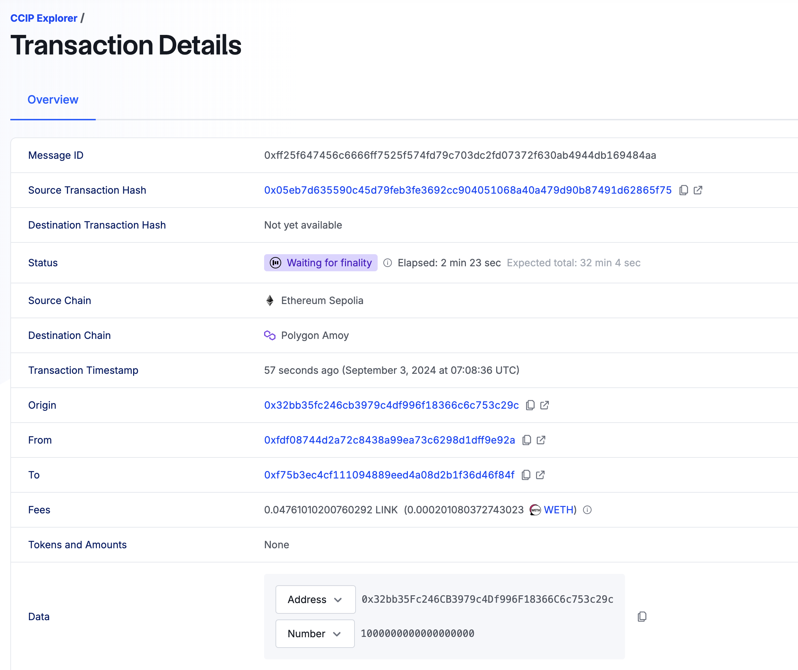

# Bridge examples

## Install dependencies

Go to `./blockchain-wiki/concepts/bridges/contracts/`.

And execute command below.

```bash
$ npm install
```

## Configure .env

Create `.env` file. Add constants from `.env.example`. The wallet private key and the bridge private key are simply the private keys of the EOA accounts.

```
# EOA private keys
WALLET_PRIVATE_KEY=""
BRIDGE_WALLET_PRIVATE_KEY=""

# Provider URLs
SEPOLIA_PROVIDER_URL=""
AMOY_PROVIDER_URL=""
```

_Important!_ The wallet and the bridge must have different addresses!

_Important!_ You need some ETH on your wallet and bridge addresses to Sepolia and Polygon Amoy. You can claim it [this](https://www.alchemy.com/faucets/ethereum-sepolia).


## Build project

```bash
$ npx hardhat compile
```

## Centralized bridge example

_IMPORTANT!_ If you don't want to deploy contracts, you can use already deployed contracts. It means you can skip [deploy tokens](#deploy-tokens). Just copy addresses below and paste them into `.env`.

```bash
ORIGIN_TOKEN_CONTRACT_ADDRESS="0x500aa3D1817183A87dDcF8e6DcB3D28dAe1D0906"
DESTINATION_TOKEN_CONTRACT_ADDRESS="0x1C92071e95b8E379838b71Ca4eA672329921D14c"
```

You also need to mint some Origin tokens on the sepolia network, just run:

```bash
$ npm run mint:originTokens
```

Now you can go to [run bridge watcher](#run-bridge-watcher).

### Deploy tokens

**Deploy OriginToken to Sepolia**

```bash
$ npm run deploy:orig
```

You will see in terminal this:
```bash
> deploy:orig
> npx hardhat ignition deploy ignition/modules/OriginToken.js --network sepolia

✔ Confirm deploy to network sepolia (11155111)? … yes
Hardhat Ignition 🚀

Deploying [ OriginTokenModule ]

Batch #1
  Executing OriginTokenModule#OriginToken...

[ OriginTokenModule ] successfully deployed 🚀

Deployed Addresses

OriginTokenModule#OriginToken - 0xB05C3c5b5FE764e9C5eeb3ceEabF1EAf5fc1311e
```

Copy the OriginToken address and set it to `.env`.

```bash
.env

ORIGIN_TOKEN_CONTRACT_ADDRESS="0x500aa3D1817183A87dDcF8e6DcB3D28dAe1D0906"
```

**Deploy DestinationToken to Polygon Amoy**

Repeat deploy process for DestinationToken and set the DESTINATION_TOKEN_CONTRACT_ADDRESS in `.env`

```bash
$ npm run deploy:dest
```

### Run bridge watcher

```bash
$ npm run watcher
```

You will see in terminal this:
```bash
Watching ...
```

### Send tokens to destination chain

Open new terminal in this folder.

```bash
$ npm run send-to-dest
```

You will see something like this:

```bash
Tx sent: 0x12fe9602196d5f2e9c8c26ecf170f6804e620b02a4e0461c539d5857d875c895
Tx confirmed: 6594705
```

```bash
 Tokens received on bridge from Sepolia chain! Time to bridge!
✅✅✅✅✅ Tokens minted ...
🌈🌈🌈🌈🌈 Bridge to destination completed
Sepolia sender balance: 99.0 Tokens
Polygon Amoy recipient balance: 1.0 Tokens
```

It means tokens successfully sent form Sepolia to Polygon Amoy.

### Send tokens back to origin chain

Now you can send tokens back.

```bash
$ npm run send-to-orig
```

Result:

```bash
 Tokens received on bridge from Polygon Amoy chain! Time to bridge!
🔥🔥🔥🔥🔥 Tokens burned ...
🌈🌈🌈🌈🌈 Bridge to origin completed
Polygon Amoy sender balance: 0.0 Tokens
Sepolia recipient balance: 100.0 Tokens
```

## Decentralized bridge example (Chainlink CCIP)

### Deploy tokens

_IMPORTANT!_ If you didn't deploy tokens, see [deploy tokens](#deploy-tokens) and update `.env`. If you have tokens from the previous step, skip deploy tokens.

_IMPORTANT!_ If you don't want to deploy contracts, you can use already deployed contracts. It means you can skip [deploy tokens](#deploy-tokens) and [deploy bridges](#deploy-bridges). Just copy addresses below and paste them into `.env`.

If you don't have Origin tokens, you also need to mint some Origin tokens on the Sepolia network, just run:

```bash
$ npm run mint:originTokens
```

```bash
ORIGIN_TOKEN_CONTRACT_ADDRESS="0x500aa3D1817183A87dDcF8e6DcB3D28dAe1D0906"
DESTINATION_TOKEN_CONTRACT_ADDRESS="0x1C92071e95b8E379838b71Ca4eA672329921D14c"

ORIGIN_TOKEN_BRIDGE="0x819a0CEDaFe8032b5Db085D00da0dd90D14EE98f"
DESTINATION_TOKEN_BRIDGE="0x4d20971EeBE2DaF073723aaB9849f54B304b951A"
```

Now you can go to [Send tokens to destination chain](#send-tokens-to-destination-chain-1).

### Deploy bridges

**Deploy TokenBridge to Sepolia**

```bash
$ npm run deploy:origBridge
```

Copy the `OriginTokenBridgeModule#TokenBridge` address and set it to `.env`.

```
ORIGIN_TOKEN_BRIDGE="0x..123"
```

**Deploy TokenBridge to Polygon Amoy**

```bash
$ npm run deploy:destBridge
```

Copy the `DestinationTokenBridgeModule#TokenBridge` address and set it to `.env`.

```
DESTINATION_TOKEN_BRIDGE="0x..123"
```

### Send tokens to destination chain

Run the script:
```bash
$ npm run ccip-send-to-dest
```

Result:

```bash
➜  bridge-example-js git:(main) ✗ npm run ccip-send-to-dest

> ccip-send-to-dest
> node scripts/ccip/sendTokensToDestinationCCIP.js

✅ Dest bridge address set
✅ Approve success
💵 Router fee:  0.000201080372743023
Tx hash: 0x05eb7d635590c45d79feb3fe3692cc904051068a40a479d90b87491d62865f75
Tx confirmed in Sepolia!
🌈🌈🌈🌈🌈 The process of sending tokens is in progress ...
🔄🔄🔄🔄🔄 Go to https://ccip.chain.link/ and check tx hash. 
Sepolia sender balance: 99.0 Tokens
```

Copy tx hash, go to [CCIP Explorer](https://ccip.chain.link/) and check the tx status. You can see status: "Waiting for finality". Typically, a transaction on the destination network will be completed in about 20-30 minutes.



After confirming the transaction on the CCIP chain, you can check the DestinationToken balance on the destination chain.

### Send tokens back to origin chain

_Important!!!_ You need to claim some Link tokens [here](https://faucets.chain.link/) on Polygon Amoy chain. You can't send tokens back without LINK because it's payd token.

Now, when you have Destination tokens on the destination network. You can send them back to the original network.

Run the script:
```bash
$ npm run ccip-send-to-orig
```

Result:

```bash
➜  bridge-example-js git:(main) ✗ npm run ccip-send-to-orig

> ccip-send-to-orig
> node scripts/ccip/sendTokensToOriginCCIP.js

✅ Dest bridge address set
✅ Destination token approve success
✅ Link token approve success
💵 Router fee:  0.607241959656365368
Tx hash: 0xbadeba5d6d23246067634af7b9d4ab2826ea72efcc0ae580d4f336b2fde3315c
Tx confirmed in Polygon Amoy!
🌈🌈🌈🌈🌈 The process of sending tokens is in progress ...
🔄🔄🔄🔄🔄 Go to https://ccip.chain.link/ and check tx hash. 
Polygon Amoy sender balance: 0.0 Tokens
```

Copy tx hash, go to [CCIP Explorer](https://ccip.chain.link/) and check the tx status. You can see status: "Waiting for finality". Typically, a transaction on the destination network will be completed in about 20-30 minutes.

After that you can check OriginToken balance on origin chain.

Congratulations! You are beautiful! 🎇