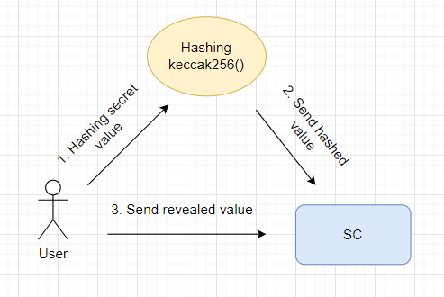

# Commitment scheme

**Автор:** [Павел Найданов](https://github.com/PavelNaydanov) 🕵️‍♂️

_Опр!_ **Commitment scheme** - криптографический алгоритм, который позволяет зафиксировать значение (утверждение), скрывая его от других, с возможностью раскрыть его позже.

Подобное решение работает таким образом, что с момента фиксации изменить значение не представляется возможным.

Концепт **commitment scheme** был впервые формализован *Gilles Brassard*, *David Chaum* и *Claude Crépeau* в 1988 году как часть zero-knowledge протоколов для [NP задач](https://en.wikipedia.org/wiki/NP_(complexity)). Однако, подобный концепт уже использовался ранее.

_Важно!_ То, о чем я буду говорить, можно встретить под названием **commit-reveal** схема. В нашем контексте я буду использовать оба термина.

## В чем актуальность?

Целый ряд блокчейнов, в том числе и Ethereum, являются публичными. Это означает, что любые данные, попавшие внутрь такого блокчейна, доступны для чтения любым участником. Подобное "преимущество" усложняет работу с приватными данными, там, где это действительно необходимо. Классический пример - игра "Камень, ножницы и бумага". Игра требует сохранять выбор игрока в секрете, пока не будет сделан выбор соперником. Иначе игрок может сделать выбор основываясь на выборе соперника (читая выбор соперника из публичного блокчейна).

В подобных случаях помогает использование **commitment scheme** для временного обеспечения приватности данных.

## Как это работает?



Процесс состоит из трех действий: [хеширование](https://en.wikipedia.org/wiki/Hash_function) значения, которое необходимо скрыть, отправка хешированного значения на смарт-контракт, отправка первоначального (раскрытого) значения на смарт-контракт для подтверждения первоначального значения.

Однако все эти три действия, обычно, укладываются в два этапа:
1. **Commit phase**. Создается хеш секретного значения и отправляется на смарт-контракт.
2. **Reveal phase**. Раскрытие секретного значения. Базовое значения (значение, которое было захешировано) в открытом виде отправляется на смарт-контракт. Смарт-контракт самостоятельно хеширует полученное значение и проверяет на соответствие со значением присланным на этапе **commit phase**. Если хеш-значения совпадут, значит раскрытие секретного значения прошло успешно.

В реализации смарт-контрактов на solidity, для хеширования, используется функция [`keccak256()`](https://docs.soliditylang.org/en/latest/units-and-global-variables.html#mathematical-and-cryptographic-functions).

_Важно!_ В большинстве случаев **commit** и **reveal** этапы четко ограничены по времени.

После того, как все присланные значения раскрываются, смарт-контракт готов выполнять любую заложенную в него бизнес-логику: подсчет голосов, определение победителя лотереи и так далее.

## Варианты использования

1. **Генерация случайных чисел**. Монополистом в этой области все больше и больше становятся оракулы. Например, [chainlink VRF](https://dev.chain.link/products/vrf). Однако **commit-reveal** схема может выступать, как альтернативный подход для обеспечения надежности и случайности генерируемых значений. Подобная схема может выглядеть [так](https://github.com/randao/randao/blob/master/contracts/Randao.sol).

2. **Голосование**. Для обеспечения анонимности и предотвращения мошенничества при голосовании. Это позволяет сохранить конфиденциальность на этапе голосования, а раскрывать голоса только в момент подсчета.

3. **Первоначальное сокрытие nft изображения**. Далеко не всегда используется в этой схеме хеширование, но подход целом похож, подменить метаданные до востребования или наступления фазы раскрытия. Подмененные метаданные возвращают информацию не разглашающие данные nft.

4. **Игры, лотереи, аукционы**. Прекрасно подходит для предметной области, где скрытая ставка (предсказание, предположение) является ключевым фактором. Применение **commit-reveal** схемы для сбора скрытой информации с последующим ее раскрытием, сохраняет непредвзятость в определение победителей.

5. **Любые конфиденциальные процессы**. **Commit-reveal** схема может применяться в различных контекстах, где важна конфиденциальность данных и предотвращение манипуляций с публичными данными.

## Пример кода

Простой смарт-контракт ниже демонстрирует **commit-reveal** схему. Порядок взаимодействия со смарт-контрактом:

1. Сгенерировать хеш для текстовой строки `getHash(0x5B38Da6a701c568545dCfcB03FcB875f56beddC4, "Be happy!")`

    В результате будет получен хеш `0x9e986e680a9a04cea824e4f0bdfa67a872878f2485628a12d056a4bff0528bb6`.
2. Отправить полученный хеш на смарт-контракт.
    `commit(0x9e986e680a9a04cea824e4f0bdfa67a872878f2485628a12d056a4bff0528bb6)`
3. Раскрыть значение текстовой строки `reveal("Be happy!")`.

```solidity
// SPDX-License-Identifier: Unlicensed
pragma solidity 0.8.21;

/**
 * @title Commit-reveal schema
 * @notice Смарт-контракт реализует процесс сохранения хешированного значения строки с последующим раскрытием
 * @dev Для хеширования значения использовать публичную функцию getHash()
 */
contract CommitReveal {
    mapping (address account => bytes32 hash) private _hashes;

    event Committed(address indexed account, bytes32 hash);
    event Revealed(address indexed account, string value);

    error HashAlreadyCommitted();
    error NotCommitted();
    error ValueNotMatchHash();

    /**
     * @notice Сохраняет приватную тестовую строку
     * @param hash Хеш приватной строки
     * @dev Для получения hash использовать публичную функцию getHash()
     */
    function commit(bytes32 hash) external {
        if (hasHash(msg.sender)) {
            // Запрещаем повторно сохранять хеш
            revert HashAlreadyCommitted();
        }

        // Сохраняем хеш
        _hashes[msg.sender] = hash;

        emit Committed(msg.sender, hash);
    }

    /**
     * @notice Раскрывает приватную строку пользователя
     * @param value Раскрытая строка
     */
    function reveal(string memory value) external returns (string memory) {
        if (!hasHash(msg.sender)) {
            // Отменяем транзакцию, если хешированное значение не было добавлено
            revert NotCommitted();
        }

        // Получаем хешированное значение
        bytes32 hash = getHash(msg.sender, value);

        if (hash != _hashes[msg.sender]) {
            // Отменяем транзакцию, если хешированное значение не совпадает с сохраненным хешированным значением на стадии commit
            revert ValueNotMatchHash();
        }

        // Удаляем сохраненное хешированное значение
        // Это позволит пользователю повторно вызвать commit() функцию
        delete _hashes[msg.sender];

        // Отправляем событие, тем самым раскрывая и подтверждая правильность раскрытия
        emit Revealed(msg.sender, value);

        return value;
    }

    /**
     * @notice Проверяет наличие сохраненного хешированного значения
     * @param account Адрес аккаунта
     * @return True, если хешированное значение было добавлено, иначе - false
     */
    function hasHash(address account) public view returns (bool) {
        if (_hashes[account] != bytes32(0)) {
            return true;
        }

        return false;
    }

    /**
     * @notice Получает хеш значение
     * @param account Адрес аккаунта
     * @param value Секретное значение, которое необходимо захешировать
     */
    function getHash(address account, string memory value) public pure returns (bytes32) {
        return keccak256(abi.encodePacked(account, value));
    }
}
```

## Заключение

**Commitment schema** - это простой и мощный механизм, который позволяет построить приложение, основываясь на доверии.

Применение зависит от конкретных потребностей и требований проекта или приложения. Эта схема помогает обеспечить безопасное и доверенное раскрытие данных в контексте децентрализованных систем.

## Links

1. [Commitment scheme](https://en.wikipedia.org/wiki/Commitment_scheme) - wikipedia
2. [Статья](https://medium.com/@0xkaden/exploring-commit-reveal-schemes-on-ethereum-c4ff5a777db8) про commit-reveal и пример игры "Камень, ножницы и бумага".
3. [Слепой аукцион](https://docs.soliditylang.org/en/v0.8.23/solidity-by-example.html#id2) из документации solidity
4. Интересный проект [randao](https://github.com/randao/randao/tree/master). Реализует DAO по генерации рандомного значения и поставке его в сеть. Подобный подход нашел применения с некоторыми доработками в работе некоторых блокчейнов ([Tezos](https://tezos.gitlab.io/active/randomness_generation.html#randao), [Ethereum](https://ethereum.org/en/developers/docs/consensus-mechanisms/pos/faqs#how-are-validators-selected))