# Gnosis conditional token framework (CTF)

**Автор:** [Павел Найданов](https://github.com/PavelNaydanov) 🕵️‍♂️

Концепт **"Gnosis conditional token framework"** реализует кодовую базу для токенизации потенциальных исходов на рынках предсказаний. Такие рынки также часто называют информационными рынками, фьючерсами идей, рынками решений или виртуальными фондовыми рынками. По сути это все одно и то же. Объединяет их то, что на всех этих рынках пользователи делают ставку или голосуют за исходы различных событий. Главная ценность рынков предсказаний заключается в формировании стоимости исходов за которые голосуют пользователи. Стоимость помогает анализировать и даже прогнозировать что угодно, от маленьких спортивных событий до вариантов принятия управленческих решений.

Мы будем рассматривать CTF в рамках рынка предсказаний, реализованного на блокчейне, поэтому нужно понимать, что основная логика будет выполняться на смарт-контрактах.

Можно посмотреть на схему ниже, чтобы в упрощенном виде понять, что из себя представляет рынок предсказаний.

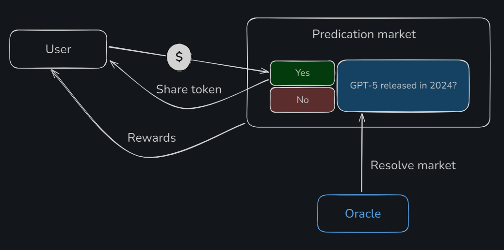

Рынок предсказаний имеет событие *"GPT-5 released in 2024?"*. Пользователь голосует за один из исходов *"Yes"* или *"No"*. По сути делает ставку. Под капотом он будет покупать некоторое количество **share токена** за базовый токен. Share токен определяет каждый из исходов. Если его ставка сыграет, то он получит вознаграждение. По сути выигрыш.

Так как рынок предсказаний это изолированная система, реализованная при помощи смарт-контрактов на блокчейне, то данные о результатах события будут предоставлены специальным оракулом, которому доверяет протокол, ну и мы соответственно тоже.

Отдельно стоит сказать, что пользователь получив во владение share токен, может в любой момент, пока событие не рассчитано и нет результатов по нему, продать и обменять share токен обратно на свой базовый актив. Избегаю в обзорах этого слова, но получается, что это база для трейдинга. Сам ни трейдер и вас не призываю.

## Базовая комбинаторика

По сути CTF используется для токенизирования исходов предсказания. Для события "GPT-5 released in 2024?", которое мы рассмотрели выше определено всего два исхода. Исходам дадим кодовые названия "Y" и "N".

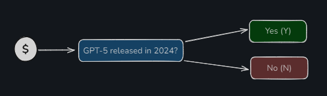

Однако рынок предсказаний может быть большим и событий в нем тоже может быть много. Посмотрим на еще одно предсказание "Will GPT limit requests to 10 per hour until August?". Это предсказание тоже имеет два исхода. Дадим им кодовые названия "B" и "A".

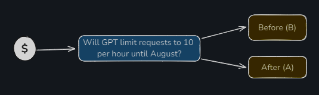

Эти два предсказания напрямую связаны между собой и мы можем посмотреть на все возможные исходы в рамках уже двух событий.

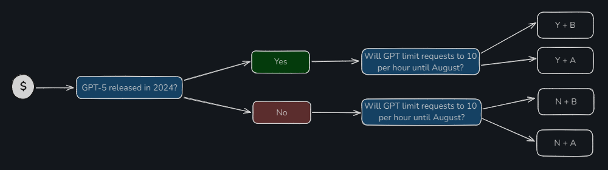

Также не стоит забывать про обратный порядок комбинаций.

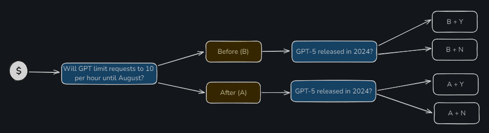

Считаем, что пользователь принимает участие в голосовании сразу по двум предсказаниям. В результате мы имеем восемь различных вариантов поведения пользователя с учетом порядка его действий (сначала первое предсказание, потом второе и наоборот). В классическом подходе построения рынка предсказаний это реально восемь вариаций.

Вот теперь здесь мы выводим на первый план CTF, который позволяет упростить количество комбинаций до 4 за счет того, что все происходит на одном контракте и взаимообратные условия обрабатываются глубоко под капотом, точнее противоположные комбинации объединяются.

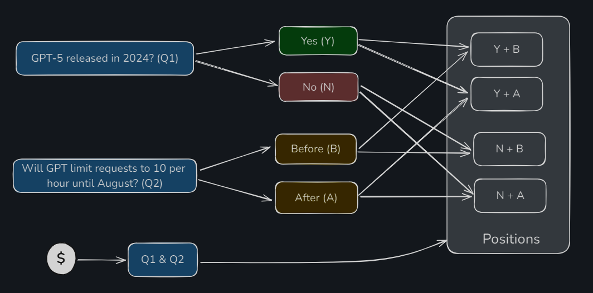

В рамках CTF каждая из четырех комбинаций называется **позицией**. То есть это означает, что каждая позиция может являться предсказанием пользователя сразу по нескольким событиям. Более того, подобный подход позволяет создавать прогнозы, которые не просто коррелируют, но еще и зависят друг от друга. Например "Сколько будет стоить биткоин, если на выборах победит Трамп".

## Варианты использования CTF

Все о чем мы поговорили выше, подводит нас к мысли, что фреймворк условных токенов может использоваться только для рынка прогнозов. И действительно это так и есть. Пользователь выражает свое мнение, голосуя активом и это позволяет собрать наиболее точный прогноз на группе пользователей. Этот прогноз с высокой вероятностью будет приближен к истине.

Однако не сразу заметно то, что скрыто за процессом голосования. Это покупка share токена по конкретной рыночной цене. Более того, рынки предсказаний предлагают не только покупку, владельцы share токена в любой момент могут его продать. Продажа тоже по рыночной цене. Уловил связь? Остается добавить пару инструментов, например лимитные ордера и у нас уже подобие биржи на базе рынка предсказаний.

Сам протокол считает, что CTF не ограничен одними рынками предсказаний и считает, что может быть применен в таких областях, как:
- **gameFI.** В игровом контексте токены могут быть использованы для создания наград или достижений, которые зависят от выполнения определённых условий в игре. Например, игроки могут получать токены за выполнение сложных задач или достижение определённых уровней в игре.
- **платежные системы**. Например, токены могут быть использованы для реализации соглашений о покупке, где платежи осуществляются только при выполнении заранее определённых условий, таких как доставка товара или завершение услуги.
- **опционы**. Например, токен может быть создан для реализации опциона, который активируется, если цена актива достигнет определённого уровня.
- и так далее берем любую предметную область, добавляем к ней "условие", например, токен реализует условие, тогда в предметной области что-то работает.

Однако я скептически отношусь к другим вариантам использования, мне кажется, что они притянуты за уши, а самое удачное применение это рынки прогнозов с возможностью купить share токен или продать. Если не веришь мне, то [почитай](https://docs.gnosis.io/conditionaltokens/use-case), что об этом пишет сам gnosis и сделай собственный вывод.

## AMM для рынков предсказаний

При чем тут AMM спросите вы? Ведь рынок предсказаний - это не dex. Однако для того, чтобы иметь возможность покупать и продавать **share** токен, отождествляя со своим прогнозом, ставкой или позицией необходимо считать стоимость share токена.

Представим, что на рынке предсказаний есть событие "В этом году сборная Португалии выиграет чемпионат мира?" Это событие имеет 100 share токенов "за" и 100 share токенов "против". Я в это не верю, голосую против и выкупаю 70 соответствующих share токенов. Любой может тоже подумать, как я и в какой-то момент может случиться ситуация, что токенов будет не хватать для голоса нового пользователя. Чтобы избежать эту ситуацию используется **Automated Market Maker**. Точно такая же технология автоматического формирования стоимости актива применяется и для децентрализованных обменников (dex). Расчет стоимости завязан на соотношение количества резервов актива в пуле (на смарт-контракте).

По сути маркет мейкер следит при помощи алгоритма и математики за тем, чтобы резервы по двум активам в пуле не закончились. Поэтому, когда одного актива становится меньше второго, цена первого поднимается вверх. Это справедливо и для второго актива.

Gnosis предлагает два маркет-мейкера:
- **CPMM** (Constant Product Market Maker)
- **LMSR** (Logarithmic Market Scoring Rule)

### CPMM

Использует тот же самый алгоритм, что и пулы Uniswap и Balancer. Использует точно такую же формулу `x * y = k`;

Где:
**x** - количество одного актива в пуле ликвидности
**y** - количество другого токена в пуле ликвидности
**k** - постоянная величина, представляющая произведение количества двух активов **x** и **y** в пуле. Величина k остается неизменной при каждой сделке, что является основным инвариантом этой модели.

Преимущество этого маркет-мейкера в том, что его математика достаточно простая. Нет смысла программировать логарифмы.

### LMSR

В целом, изначально, LMSR - это механизм ценообразования, разработанный для использования в рынках предсказаний. Использует логарифмическую функцию для определения вероятности исхода. Чем больше пользователей голосуют на определенный исход, тем выше вероятность (и, соответственно, стоимость) этого исхода.

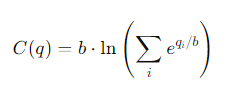
Где:
- **C(q)** - это функция стоимости.
- **q[i]** - количество ставок на i-й исход события
- **b** - параметр ликвидности, который регулирует, насколько быстро изменяются цены при изменении объемов ставок.

Является более научным и наиболее исследованным по сравнению с CPMM. Позволяет лучше контролировать риски и волатильность активов за счет того, что максимальные потери ограничены параметром ликвидности **b**.

## Framework

После всего, что мы обсудили выше, напрашивается вывод, что фреймворк составной и включает в себя два крупных модуля:
- [Conditional tokens](https://github.com/gnosis/conditional-tokens-contracts/tree/master). Представляет собой токен условия на базе ERC-1155. Включает в себя логику отвечающую за расчет позиции пользователя по событиям.
- [AMM для conditional tokens](https://github.com/gnosis/conditional-tokens-market-makers/tree/master). По сути ликвидность, которая отвечает за трейдинг токенами позиции, и за ценообразование.

Эти два крупных модуля находятся в разных репозиториях. К ним можно добавить еще отдельный репозиторий в котором лежат [utils](https://github.com/gnosis/util-contracts), которые используются для AMM.

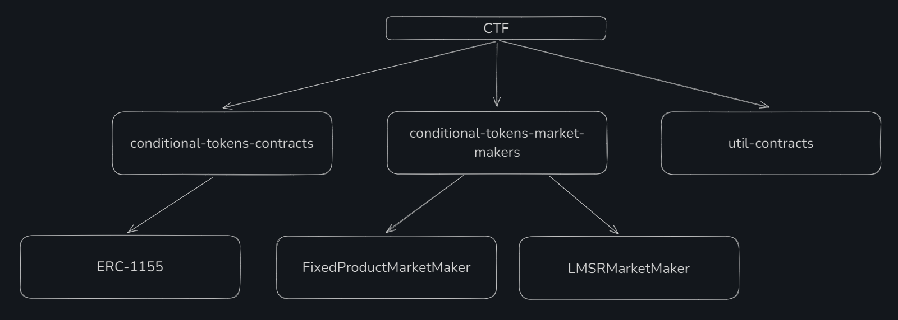

C **util-contracts** интересная история. Этот репозиторий используется в смарт-контрактах фабрик маркет мейкеров. Например в [FixedProductMarketMakerFactory.sol](https://github.com/gnosis/conditional-tokens-market-makers/blob/master/contracts/FixedProductMarketMakerFactory.sol#L6).

```solidity

import { ConstructedCloneFactory } from "@gnosis.pm/util-contracts/contracts/ConstructedCloneFactory.sol";

```

Однако если мы пойдем в сам репозиторий util-contracts, то мы не найдем в нем смарт-контракта `ConstructedCloneFactory.sol`. Видимо что-то пошло не так и он не пережил альфа версию, но найти его возможно. Можно вытащить его из версий npm. По вот этой [ссылке](https://www.npmjs.com/package/@gnosis.pm/util-contracts/v/3.0.0-alpha.3?activeTab=code).

## Технический разбор

Ниже разберем код каждого модуля фреймворка по-отдельности. Раздел предназначен для людей знакомых с разработкой.

### Conditional tokens

**Conditional tokens** позволяют организовать процесс работы с share токенами для того, чтобы пользователи могли делать прогнозы. Позволяют комбинировать прогнозы отождествляя мнение пользователя.

Логика **сonditional tokens** реализована в этом [репозитории](https://github.com/gnosis/conditional-tokens-contracts).

По сути главным смарт-контрактом, который нам необходим это [ConditionalTokens.sol](https://github.com/gnosis/conditional-tokens-contracts/blob/master/contracts/ConditionalTokens.sol). Он является точкой входа с которой нужно начать изучение. Смарт-контракт наследуется от [ERC1155.sol](https://github.com/gnosis/conditional-tokens-contracts/blob/master/contracts/ERC1155/ERC1155.sol) и использует для хранения вспомогательных функций библиотеку [CTHelpers.sol](https://github.com/gnosis/conditional-tokens-contracts/blob/master/contracts/CTHelpers.sol).

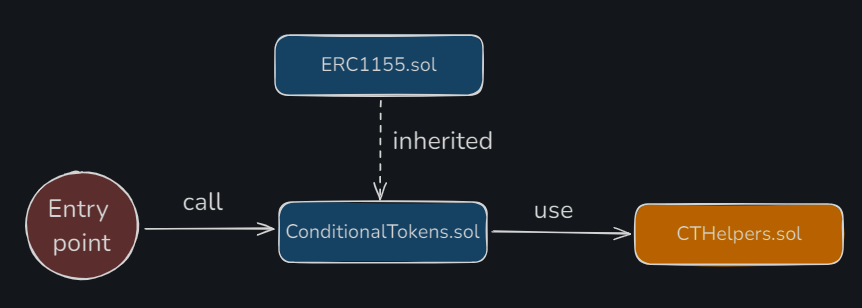

❗️ Чтобы двигаться дальше необходимо обсудить терминологию. Сейчас будет немного сложно, но это очень важно для дальнейшего понимания статьи.

**Condition и outcomes**

В первую очередь про прогноз, он же предсказание, событие, утверждение, вопрос. Мы будем в коде называть все перечисленное - **condition**, его возможные исходы - **outcomes**.

По сути, **condition** - это вопрос к оракулу, на который он должен будет отвечать. Такой **condition** требует собственный идентификатор (**conditionId**), который является результатом хеширования трех параметров:
- **oracle.** Адрес оракула, который будет рассчитывать результат события.
- **questionId.** Идентификатор для condition снаружи. Предполагается тип данных bytes32 и остается на усмотрение создающего прогноз через вызов смарт-контракта. Может быть счетчиком, где каждый новый прогноз прибавляет единицу к счетчику, может быть более сложная схема с хешированием текста и других данных. Будет использоваться в оракуле.
- **outcomeSlotCount.** Количество исходов для прогноза.

Для получения идентификатора прогноза используется функция [getConditionId()](https://github.com/gnosis/conditional-tokens-contracts/blob/master/contracts/ConditionalTokens.sol#L268).

**Index set**

Информация по исходам (истина или ложь) будет кодироваться при помощи массива бит под названием **Index set**. Например, есть три исхода: A, B, C. Тогда истинность A и B можно закодировать битами, начиная с младшего бита `0xCBA -> 0x011`, где единица означает, что исход истинный, 0 - ложь.

**CollectionId**

**Index Set** позволяет кодировать исходы события для того, чтобы показать за что голосует пользователь. У каждого такого двоичного кодирования можно получить десятичное представление. Например, `0x011 -> 3`. Чтобы смарт-контракт четко мог определить, что этот **index set** относится к конкретному событию, будет генерироваться **collectionId** на базе:
- `indexSet`, выраженный десятичной системе счисления
- `conditionId`
- `parentConditionId`

По сути **index set** позволяет описать все возможные комбинации за которые пользователь может проголосовать. Каждая из таких комбинаций будет иметь свой собственный идентификатор под названием `collectionId`.

Для получения идентификатора коллекции исходов используется функция [getCollectionId()](https://github.com/gnosis/conditional-tokens-contracts/blob/master/contracts/ConditionalTokens.sol#L276C14-L276C29).

**Position**

Последний термин, который остается разобрать - это позиция. Это не что иное, как совокупность выбранных пользователем исходов (которые закодированы при помощи index set) и актива обеспечения позиции. Актив обеспечения - это базовый токен рынка предсказаний за который производится покупка share токена определенного исхода.

У позиции по аналогии также есть идентификатор. Называется `positionId`. Идентификатор токена (id токена) ERC-1155 будет соответствовать `positionId`. Так как это стандарт ERC-1155, есть целый ряд функций (`safeTransferFrom()`, `setApprovalForAll()`), который будет позволять передавать share токен и вместе с ним право владения позицией другим аккаунтам.

Для получения идентификатора позиции используется функция [getPositionId()](https://github.com/gnosis/conditional-tokens-contracts/blob/master/contracts/ConditionalTokens.sol#L283).

#### Prepare

Для того, чтобы смарт-контракт `ConditionalTokens.sol` узнал о новом condition нужно ему об этом сказать. Этот процесс называется "подготовкой события" и подразумевает вызов функции [prepareCondition()](https://github.com/gnosis/conditional-tokens-contracts/blob/master/contracts/ConditionalTokens.sol#L65).

```solidity
function prepareCondition(address oracle, bytes32 questionId, uint outcomeSlotCount) external {
    // Ограничение по количеству исходов
    require(outcomeSlotCount <= 256, "too many outcome slots");
    require(outcomeSlotCount > 1, "there should be more than one outcome slot");

    // Генерация идентификатора для прогноза
    bytes32 conditionId = CTHelpers.getConditionId(oracle, questionId, outcomeSlotCount);

    // Проверяем, что такой прогноз еще не был создан
    require(payoutNumerators[conditionId].length == 0, "condition already prepared");

    // Создание массива слотов для исходов с привязкой к идентификатору прогноза
    payoutNumerators[conditionId] = new uint[](outcomeSlotCount);

    emit ConditionPreparation(conditionId, oracle, questionId, outcomeSlotCount);
}
```

Здесь надо особо посмотреть, что за система хранения используется для conditions. За это отвечает два mappings:

```solidity
mapping(bytes32 => uint[]) public payoutNumerators;
mapping(bytes32 => uint) public payoutDenominator;
```

В первый mapping `payoutNumerators` оракул будет записывать результат каждого исхода. Результат по каждому исходу будет обозначать 0 - исход ложный, 1 - исход корректный. Для трех исходов вполне может оказаться ситуация, когда два из трех являются истиной. Тогда оракул вернет результат по каждому исходу в следующем виде [0.5, 0.5, 0].

Solidity не умеет работать с дробными числами. Поэтому используется классический подход, как с ERC-20, где вводится понятие decimal. Это то, число на которое тебе нужно поделить свой баланс, чтобы получить результат в виде целого и дробного значения. В нашем случае за место decimal используется второй mapping `payoutDenominator`, которых хранит число на которое numerator из `payoutNumerators` будет делиться.

#### Reporting

После того, как событие добавлено на смарт-контракты по истечению времени оно может быть исполнено оракулом. Для того, чтобы событие могло быть исполнено только определенным оракулом на этапе `prepare` в состав `conditionId` входит адрес оракула. На этапе когда оракул будет вызывать функцию [reportPayouts()](https://github.com/gnosis/conditional-tokens-contracts/blob/master/contracts/ConditionalTokens.sol#L78), `conditionId` будет снова сгенерен, только за место адреса оракула будет использоваться `msg.sender`.

```solidity
bytes32 conditionId = CTHelpers.getConditionId(msg.sender, questionId, outcomeSlotCount);
```

Если `msg.sender` будет другим адресом, отличным от первоначально установленного адреса оракула, то `conditionId` будет сгенерирован тоже неверно.

Полный код функции `reportPayouts()` ниже.

```solidity
// payouts - список результатов для каждого исхода
function reportPayouts(bytes32 questionId, uint[] calldata payouts) external {
    // Количество результатов должно совпадать с количеством исходов
    uint outcomeSlotCount = payouts.length;
    require(outcomeSlotCount > 1, "there should be more than one outcome slot");
    // Генерируем идентификатор для прогноза, который должен совпадать с целевым идентификатором прогноза
    bytes32 conditionId = CTHelpers.getConditionId(msg.sender, questionId, outcomeSlotCount);
    require(payoutNumerators[conditionId].length == outcomeSlotCount, "condition not prepared or found");
    require(payoutDenominator[conditionId] == 0, "payout denominator already set");

    // Сохраняем результаты от оракула и рассчитываем denominator для значений
    uint den = 0;
    for (uint i = 0; i < outcomeSlotCount; i++) {
        uint num = payouts[i];
        den = den.add(num);

        require(payoutNumerators[conditionId][i] == 0, "payout numerator already set");
        payoutNumerators[conditionId][i] = num;
    }
    require(den > 0, "payout is all zeroes");
    payoutDenominator[conditionId] = den;
    emit ConditionResolution(conditionId, msg.sender, questionId, outcomeSlotCount, payoutNumerators[conditionId]);
}
```

#### Splitting

Где-то в промежутке между подготовкой события и моментом, когда оракул рассчитает это событие будет находится процесс, когда пользователь может проголосовать за выбранный исход.

Этот процесс называется **splitting**, потому что подразумевает разделение своего актива по нескольким позициям и получение доли share токена в каждой позиции. Процесс включает в себя два вида разделения:
1. **Splitting collateral**. Это когда пользователь покупает share токены, голосует, передавая базовый актив и делает ставку на один или несколько исходов.
2. **Splitting position**. Это когда пользователь разделяет свою позицию на несколько составляющих эту позицию.

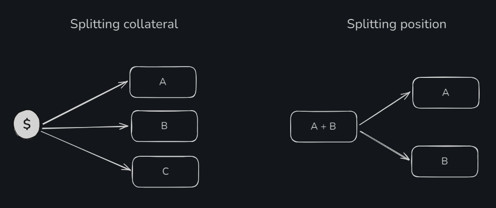

С базовым активом все достаточно просто, вносишь на смарт-контракт указанную сумму и она указывается для выбранных позиций.

С разделением позиции все чуточку интереснее. Ты можешь разделить только те позиции, которые являются составными позициями и содержат в себе несколько исходов.

Однако есть варианты, когда разделение невозможно. Например, нельзя делить позицию, которая объединяет два события на две самостоятельные позиции в каждом из событий. Или нельзя разделить базовый актив так, чтобы покрыть все возможные исходы и при любом раскладе получить выгоду. Больше примеров невалидных разделений можно найти в [документации](https://docs.gnosis.io/conditionaltokens/docs/devguide05).

Для того, чтобы сделать splitting необходимо вызвать функцию [splitPosition()](https://github.com/gnosis/conditional-tokens-contracts/blob/master/contracts/ConditionalTokens.sol#L105C14-L105C27).

```solidity
function splitPosition(
    IERC20 collateralToken,
    bytes32 parentCollectionId,
    bytes32 conditionId,
    uint[] calldata partition,
    uint amount
) external {
    // Проверяем, что передан массив позиций для разделения
    require(partition.length > 1, "got empty or singleton partition");
    uint outcomeSlotCount = payoutNumerators[conditionId].length;
    // Проверяем, что событие под таким идентификатором существует
    require(outcomeSlotCount > 0, "condition not prepared yet");

    // Готовим маску по количеству исходов. для 4 исходов будет 0x1111, для пяти 0x11111
    uint fullIndexSet = (1 << outcomeSlotCount) - 1;
    // Будет отвечать за результат по позициям, которые разделяет пользователь
    uint freeIndexSet = fullIndexSet;
    uint[] memory positionIds = new uint[](partition.length);
    uint[] memory amounts = new uint[](partition.length);
    for (uint i = 0; i < partition.length; i++) {
        uint indexSet = partition[i];
        // Проверяет, что indexSet в диапазоне возможных комбинаций по событию
        require(indexSet > 0 && indexSet < fullIndexSet, "got invalid index set");
        require((indexSet & freeIndexSet) == indexSet, "partition not disjoint");
        freeIndexSet ^= indexSet;
        // Получение нового идентификатора позиции для index set
        positionIds[i] = CTHelpers.getPositionId(collateralToken, CTHelpers.getCollectionId(parentCollectionId, conditionId, indexSet));
        amounts[i] = amount;
    }

    if (freeIndexSet == 0) {
        // Разделение базового актива
        if (parentCollectionId == bytes32(0)) {
            // Переводим базовый актив от пользователя на смарт-контракт
            require(collateralToken.transferFrom(msg.sender, address(this), amount), "could not receive collateral tokens");
        } else {
            // Сжигаем share токены текущей позиции
            _burn(
                msg.sender,
                CTHelpers.getPositionId(collateralToken, parentCollectionId),
                amount
            );
        }
    } else {
        // Разделение позиции
        // Подразумевает сжигание текущей позиции
        _burn(
            msg.sender,
            CTHelpers.getPositionId(collateralToken,
                CTHelpers.getCollectionId(parentCollectionId, conditionId, fullIndexSet ^ freeIndexSet)),
            amount
        );
    }

    // Минтинг share токенов для новых позиций
    _batchMint(
        msg.sender,
        positionIds,
        amounts,
        ""
    );

    emit PositionSplit(msg.sender, collateralToken, parentCollectionId, conditionId, partition, amount);
}
```

#### Merging

Когда пользователь проголосовал, это эквивалентно термину разделил позицию или разделил базовый актив, он отдал базовый актив в каком-то количестве смарт-контракту.

Для того, чтобы выйти из выбранных на голосовании позиций, вывести базовый актив обратно существует процесс под названием **merging** (слияние). Он также включает в себя слияние не только до базового актива, но и до определенной промежуточной позиции.

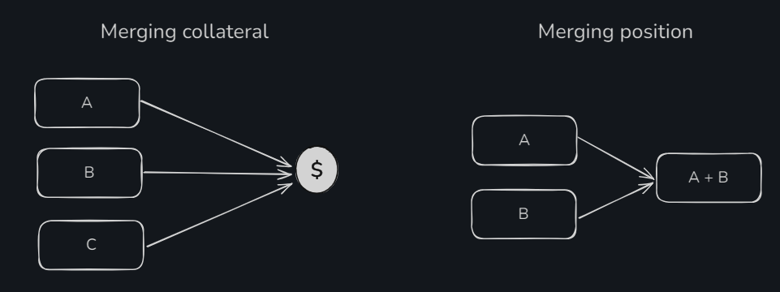

Можно смело утверждать, что `mergePositions()` - это полностью обратная функция к `splitPosition()`.

Для инициации этого процесса необходимо вызвать функцию [mergePositions()](https://github.com/gnosis/conditional-tokens-contracts/blob/master/contracts/ConditionalTokens.sol#L105C14-L105C27).

```solidity
function mergePositions(
    IERC20 collateralToken,
    bytes32 parentCollectionId,
    bytes32 conditionId,
    uint[] calldata partition,
    uint amount
) external {
    // Проверяем, что передан массив позиций для слияния
    require(partition.length > 1, "got empty or singleton partition");
    uint outcomeSlotCount = payoutNumerators[conditionId].length;
    // Проверяем, что событие под таким идентификатором существует
    require(outcomeSlotCount > 0, "condition not prepared yet");

    // Готовим маску по количеству исходов. для 4 исходов будет 0x1111, для пяти 0x11111
    uint fullIndexSet = (1 << outcomeSlotCount) - 1;
    uint freeIndexSet = fullIndexSet;
    uint[] memory positionIds = new uint[](partition.length);
    uint[] memory amounts = new uint[](partition.length);
    for (uint i = 0; i < partition.length; i++) {
        uint indexSet = partition[i];
        // Проверяет, что indexSet в диапазоне возможных комбинаций по событию
        require(indexSet > 0 && indexSet < fullIndexSet, "got invalid index set");
        require((indexSet & freeIndexSet) == indexSet, "partition not disjoint");
        freeIndexSet ^= indexSet;
        // Получение нового идентификатора позиции для index set
        positionIds[i] = CTHelpers.getPositionId(collateralToken, CTHelpers.getCollectionId(parentCollectionId, conditionId, indexSet));
        amounts[i] = amount;
    }
    // Сжигаем share токен согласно переданным позициям
    _batchBurn(
        msg.sender,
        positionIds,
        amounts
    );

    if (freeIndexSet == 0) {
        // Слияние до базового актива
        if (parentCollectionId == bytes32(0)) {
            // Отсылаем базовый актив пользователю
            require(collateralToken.transfer(msg.sender, amount), "could not send collateral tokens");
        } else {
            _mint(
                msg.sender,
                CTHelpers.getPositionId(collateralToken, parentCollectionId),
                amount,
                ""
            );
        }
    } else {
        // Слияние до промежуточной позиции
        _mint(
            msg.sender,
            CTHelpers.getPositionId(collateralToken,
                CTHelpers.getCollectionId(parentCollectionId, conditionId, fullIndexSet ^ freeIndexSet)),
            amount,
            ""
        );
    }

    emit PositionsMerge(msg.sender, collateralToken, parentCollectionId, conditionId, partition, amount);
}
```

#### Redeem position

Последнее, что тут стоит рассмотреть - это получение вознаграждения после того, как голосование прошло и оракул произвел расчет события. **Redeem** (выкуп) какой-то позиции будет возможен только в случае, когда исход события признан истинным.

Для того, что забрать (выкупить) свое вознаграждение необходимо вызвать функцию [redeemPosition()](https://github.com/gnosis/conditional-tokens-contracts/blob/master/contracts/ConditionalTokens.sol#L218).

```solidity
// Параметр indexSets называется не partition. Потому что не требуется передавать кодированное разделение позиции, можно передать список всех позиций
function redeemPositions(IERC20 collateralToken, bytes32 parentCollectionId, bytes32 conditionId, uint[] calldata indexSets) external {
    // Проверяем, что событие есть и оно рассчитано
    // Деноминатор будет проставлен оракулом, когда он вызовет функцию reportPayouts()
    uint den = payoutDenominator[conditionId];
    require(den > 0, "result for condition not received yet");
    uint outcomeSlotCount = payoutNumerators[conditionId].length;
    require(outcomeSlotCount > 0, "condition not prepared yet");

    uint totalPayout = 0;

    // Готовим маску по количеству исходов. для 4 исходов будет 0x1111, для пяти 0x11111
    uint fullIndexSet = (1 << outcomeSlotCount) - 1;
    // Цикл по всем переданным позициям
    for (uint i = 0; i < indexSets.length; i++) {
        uint indexSet = indexSets[i];
        // Проверяет, что indexSet в диапазоне возможных комбинаций по событию
        require(indexSet > 0 && indexSet < fullIndexSet, "got invalid index set");
        // Получаем идентификатор позиции
        uint positionId = CTHelpers.getPositionId(collateralToken,
            CTHelpers.getCollectionId(parentCollectionId, conditionId, indexSet));

        uint payoutNumerator = 0;
        for (uint j = 0; j < outcomeSlotCount; j++) {
            if (indexSet & (1 << j) != 0) {
                payoutNumerator = payoutNumerator.add(payoutNumerators[conditionId][j]);
            }
        }

        uint payoutStake = balanceOf(msg.sender, positionId);
        if (payoutStake > 0) {
            // Рассчитываем количество вознаграждения
            totalPayout = totalPayout.add(payoutStake.mul(payoutNumerator).div(den));
            // Сжигаем share токены по позиции
            _burn(msg.sender, positionId, payoutStake);
        }
    }

    // Выплачиваем вознаграждение или минтим share токены, если указана родительская коллекция
    if (totalPayout > 0) {
        if (parentCollectionId == bytes32(0)) {
            require(collateralToken.transfer(msg.sender, totalPayout), "could not transfer payout to message sender");
        } else {
            _mint(msg.sender, CTHelpers.getPositionId(collateralToken, parentCollectionId), totalPayout, "");
        }
    }
    emit PayoutRedemption(msg.sender, collateralToken, parentCollectionId, conditionId, indexSets, totalPayout);
}
```

### Market maker

Протокол реализует оба типа маркет мейкера на смарт-контрактах. И CPMM и LMSR.
В этом разделе мы посмотрим на код только одного из них - CPMM. Он проще для понимания с математической точки зрения.

Название смарт-контракта, который реализует CPMM, [FixedProductMarketMaker.sol](https://github.com/gnosis/conditional-tokens-market-makers/blob/master/contracts/FixedProductMarketMaker.sol). Для каждого маркет мейкера есть собственная фабрика. Для FixedProductMarketMaker, логично, что фабрика называется [FixedProductMarketMakerFactory.sol](https://github.com/gnosis/conditional-tokens-market-makers/blob/master/contracts/FixedProductMarketMakerFactory.sol).

Работает это все примерно следующим образом.

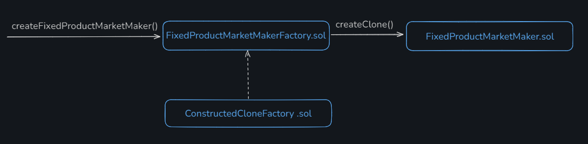

Для того, чтобы создать новое событие, рынок которого будет работать по правилам CPMM, необходимо вызвать функцию [createFixedProductMarketMaker()](https://github.com/gnosis/conditional-tokens-market-makers/blob/master/contracts/FixedProductMarketMakerFactory.sol#L83), которая при помощи расширения фабрики **ConstructedCloneFactory.sol** создаст смарт-контракт нового маркета и задеплоит его.

Маркет мейкер будет промежуточным получателем ERC-1155 токена. Токен будет отправлен до пользователя, который вызывал транзакцию. Чтобы иметь возможность получить ERC-1155 токен, `FixedProductMarketMakerFactory.sol` имеет две функции: [onERC1155Received()](https://github.com/gnosis/conditional-tokens-market-makers/blob/master/contracts/FixedProductMarketMaker.sol#L232) и [onERC1155BatchReceived()](https://github.com/gnosis/conditional-tokens-market-makers/blob/master/contracts/FixedProductMarketMaker.sol#L248).

Получается, что маркет мейкер является прослойкой между пользователем и conditionalTokens.

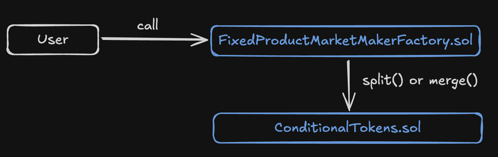

#### Ликвидность

Так как это AMM, то первое с чего стоит начать - это то, что он представляет собой пул, который требует ликвидность. То есть здесь вся сопутствующая этому история: поставщики ликвидности, LP токены и возможность задать стоимость актива, первому поставщику. В нашем случае задается не стоимость, а соотношение вероятностей наступления исходов.

Ликвидность поставщика будет распределена по всем токенам условия нормировано, согласно соотношению токенов в каждом исходе. Это означает, что когда поставщик вносит ликвидность, то для всех возможных исходов выпускается какое-то количество токена условия.

Для расчетов распределения ликвидности используются балансы токенов условия и смарт-контракт получает их в приватной функции [getPoolBalances()](https://github.com/gnosis/conditional-tokens-market-makers/blob/master/contracts/FixedProductMarketMaker.sol#L64).

Технически для того, чтобы внести ликвидность, нужно использовать функцию [addFunding()](https://github.com/gnosis/conditional-tokens-market-makers/blob/master/contracts/FixedProductMarketMaker.sol#L148C14-L148C24). Посмотрим на нее внимательнее.

```solidity
function addFunding(uint addedFunds, uint[] calldata distributionHint)
    external
{
    // Проверяем, что указана сумма ликвидности, которая будет добавлена
    require(addedFunds > 0, "funding must be non-zero");

    uint[] memory sendBackAmounts = new uint[](positionIds.length);

    uint poolShareSupply = totalSupply();
    uint mintAmount;
    if(poolShareSupply > 0) {
        // Если ликвидность добавляется не в первый раз, то distributionHint должен быть пустым
        require(distributionHint.length == 0, "cannot use distribution hint after initial funding");
        uint[] memory poolBalances = getPoolBalances();
        uint poolWeight = 0;
        // Высчитывается пул с максимальным балансом, Необходимо для распределения ликвидности по токенам условия
        for(uint i = 0; i < poolBalances.length; i++) {
            uint balance = poolBalances[i];
            if(poolWeight < balance)
                poolWeight = balance;
        }

        for(uint i = 0; i < poolBalances.length; i++) {
            uint remaining = addedFunds.mul(poolBalances[i]) / poolWeight;
            // Рассчитываем сумму condition токенов, которые получит поставщик ликвидности
            sendBackAmounts[i] = addedFunds.sub(remaining);
        }

        // Рассчитываем количество LP токена, которое можно получить
        mintAmount = addedFunds.mul(poolShareSupply) / poolWeight;
    } else {
        // Если добавляется ликвидность в первый раз, то distributionHint будет задано правило распределения ликвидности по пулам
        if(distributionHint.length > 0) {
            require(distributionHint.length == positionIds.length, "hint length off");
            uint maxHint = 0;
            for(uint i = 0; i < distributionHint.length; i++) {
                uint hint = distributionHint[i];
                if(maxHint < hint)
                    maxHint = hint;
            }

            for(uint i = 0; i < distributionHint.length; i++) {
                uint remaining = addedFunds.mul(distributionHint[i]) / maxHint;
                require(remaining > 0, "must hint a valid distribution");
                // Рассчитываем сумму condition токенов, которые получит поставщик ликвидности
                sendBackAmounts[i] = addedFunds.sub(remaining);
            }
        }

        mintAmount = addedFunds;
    }

    // Перевод активов от пользователя на смарт-контракт
    require(collateralToken.transferFrom(msg.sender, address(this), addedFunds), "funding transfer failed");
    require(collateralToken.approve(address(conditionalTokens), addedFunds), "approval for splits failed");

    // Создание позиции для поставщика ликвидности
    splitPositionThroughAllConditions(addedFunds);

    // Создание LP токена
    _mint(msg.sender, mintAmount);

    // Перевод токенов условия вызывающему транзакцию
    conditionalTokens.safeBatchTransferFrom(address(this), msg.sender, positionIds, sendBackAmounts, "");

    for (uint i = 0; i < sendBackAmounts.length; i++) {
        sendBackAmounts[i] = addedFunds.sub(sendBackAmounts[i]);
    }

    emit FPMMFundingAdded(msg.sender, sendBackAmounts, mintAmount);
}
```

Чтобы забрать ликвидность необходимо вызвать функцию [removeFunding()](https://github.com/gnosis/conditional-tokens-market-makers/blob/master/contracts/FixedProductMarketMaker.sol#L208C14-L208C27). Lp токены будут сожжены, а поставщик получит обратно свой базовый актив.

**Зачем ликвидность нужна?**
Чем больше ликвидности в пуле, тем более устойчив рынок к большим сделкам и ценовым манипуляциям. Возможность добавить пользователям ликвидность позволяет зарабатывать на комиссиях.

#### Buy и sell

```solidity
function buy(uint investmentAmount, uint outcomeIndex, uint minOutcomeTokensToBuy) external {
    // Рассчитываем сумму покупки токенов исхода (share токенов по конкретному исходу)
    uint outcomeTokensToBuy = calcBuyAmount(investmentAmount, outcomeIndex);
    // Проверяем допустимо минимальную сумму на которую мы согласны
    require(outcomeTokensToBuy >= minOutcomeTokensToBuy, "minimum buy amount not reached");

    // Переводим базовый актив на смарт-контракт маркет мейкера
    require(collateralToken.transferFrom(msg.sender, address(this), investmentAmount), "cost transfer failed");

    // Рассчитываем комиссию в базовом активе
    uint feeAmount = investmentAmount.mul(fee) / ONE;
    feePoolWeight = feePoolWeight.add(feeAmount);
    uint investmentAmountMinusFees = investmentAmount.sub(feeAmount);
    require(collateralToken.approve(address(conditionalTokens), investmentAmountMinusFees), "approval for splits failed");

    // Сплитим на все позиции
    splitPositionThroughAllConditions(investmentAmountMinusFees);
    // Переводим токены позиций сендеру транзакции
    conditionalTokens.safeTransferFrom(address(this), msg.sender, positionIds[outcomeIndex], outcomeTokensToBuy, "");

    emit FPMMBuy(msg.sender, investmentAmount, feeAmount, outcomeIndex, outcomeTokensToBuy);
}
```

Здесь может возникнуть вопрос, что за сплитинг на все позиции (splitPositionThroughAllConditions). Все очень просто. Ставка делается на все возможные исходы.

```solidity
function splitPositionThroughAllConditions(uint amount)
    private
{
    for(uint i = conditionIds.length - 1; int(i) >= 0; i--) {
        uint[] memory partition = generateBasicPartition(outcomeSlotCounts[i]);
        for(uint j = 0; j < collectionIds[i].length; j++) {
            conditionalTokens.splitPosition(collateralToken, collectionIds[i][j], conditionIds[i], partition, amount);
        }
    }
}
```

Аналогичный вызов есть для продажи conditional tokens. За это отвечает функция [sell()](https://github.com/gnosis/conditional-tokens-market-makers/blob/master/contracts/FixedProductMarketMaker.sol#L321). Только за место сплитинга по всем позициям вызывается функция [mergePositionsThroughAllConditions()](https://github.com/gnosis/conditional-tokens-market-makers/blob/master/contracts/FixedProductMarketMaker.sol#L94).

```solidity
function sell(uint returnAmount, uint outcomeIndex, uint maxOutcomeTokensToSell) external {
    // Рассчитываем сумму токенов исходов которая будет обмениваться на базовый актив
    uint outcomeTokensToSell = calcSellAmount(returnAmount, outcomeIndex);
    require(outcomeTokensToSell <= maxOutcomeTokensToSell, "maximum sell amount exceeded");

    // Переводим токены исходов на смарт-контракт маркет мейкера
    conditionalTokens.safeTransferFrom(msg.sender, address(this), positionIds[outcomeIndex], outcomeTokensToSell, "");

    // Рассчитываем комиссию
    uint feeAmount = returnAmount.mul(fee) / (ONE.sub(fee));
    feePoolWeight = feePoolWeight.add(feeAmount);
    uint returnAmountPlusFees = returnAmount.add(feeAmount);
    // Мерджим позиции до базовго актива
    mergePositionsThroughAllConditions(returnAmountPlusFees);

    // Отправляем базовый активы сендеру транзакции
    require(collateralToken.transfer(msg.sender, returnAmount), "return transfer failed");

    emit FPMMSell(msg.sender, returnAmount, feeAmount, outcomeIndex, outcomeTokensToSell);
}
```

## Вывод

Пришло время сказать, кому это все нужно. Протокол приводит в пример три проекта, которые используют CTF:
- [alice](https://alice.si/)
- [flyingcarpet.network](https://www.flyingcarpet.network/)
- [omen](https://omen-eth.ipns.dweb.link/)

Я ничего не знаю про эти протоколы, но знаю другой пример - это рынок предсказаний [Polymarket](https://polymarket.com/). Он успешно внедрил CTF и накрутил своей логики поверх, связанной с лимитными ордерами. Это достаточно показательный кейс, потому что polymarket является одним из самых популярных рынков и имеет достаточно большое количество пользователей.

Если подытожить, то CTF мощный инструмент для реализации комбинации исходов событий и различного рода манипуляции с ними. При этом он достаточно не простой для понимания. Требует погружения в комбинаторику, работу с битами информации и так далее. При этом является чуть ли не единственным решением на базе которого можно строить рынок предсказаний. Gnosis все еще открыт к новым применениям своего фреймворка, однако стоит отметить, что не так много вариантов использования за время существования было придумано.

## Links

1. Gnosis [introduction](https://docs.gnosis.io/conditionaltokens/docs/introduction1)
2. [Conditional Tokens Contracts репозиторий](https://github.com/gnosis/conditional-tokens-contracts)
3. [Conditional Tokens - Automated Market Makers репозиторий](https://github.com/gnosis/conditional-tokens-market-makers/tree/master)
