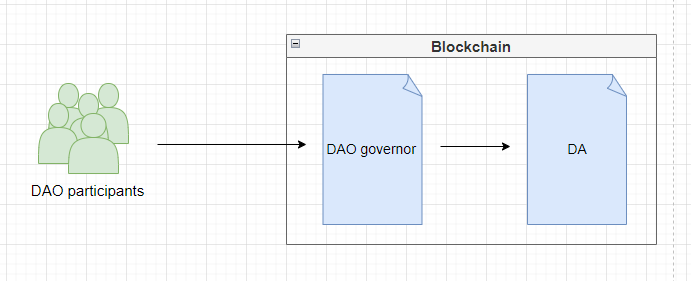
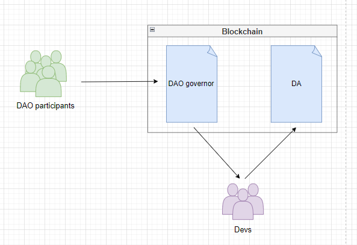
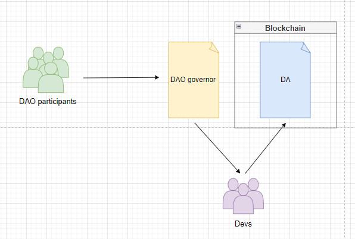
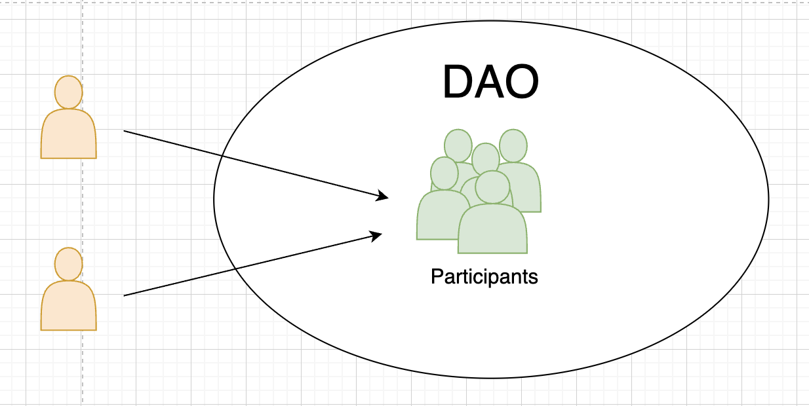
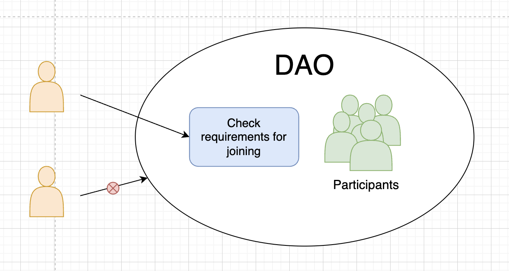
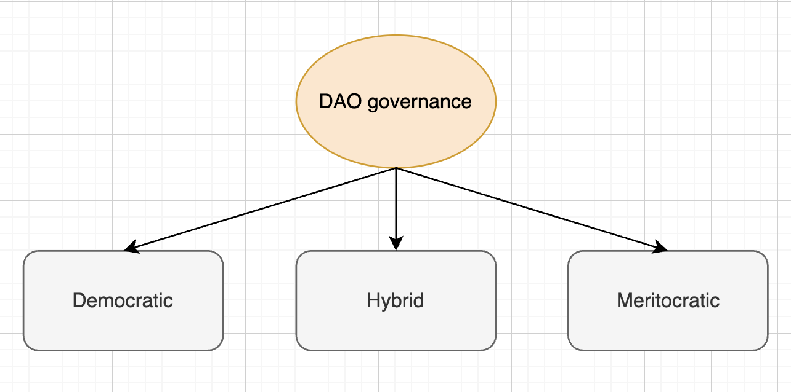
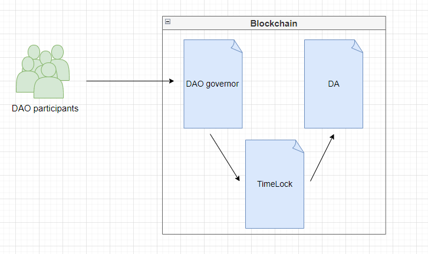

# DAO

**Автор:** [Павел Найданов](https://github.com/PavelNaydanov) 🕵️‍♂️

> "A DAO is people." - Adam J. Kerpelman, DAOHaus

_Опр!_ **Decentralized autonomous organization (DAO)** — это организация, которая работает без централизованной структуры управления на базе блокчейн технологии. Работа организации осуществляется автономно через смарт-контракты, позволяя участникам влиять на принятия управленческих решений.

Когда кто-то говорит: *«Тебе необходимо присоединиться к DAO»*, это означает, что ты должен присоединиться к сообществу (команде, проекту, протоколу, другой форме коллективизма), которое использует программное обеспечение DAO при координации принятия решений в своей организации.

Одной из первых DAO, была организация "**[The DAO](https://en.wikipedia.org/wiki/The_DAO)**", созданная разработчиками, для автоматизации принятия решений венчурного фонда. После запуска в апреле 2016 года, она стала одной из крупнейших краудфандинговых кампаний в истории. Прекратила свою деятельность после взлома и потери большей части собранных средств.

## От смарт-контракта до DAO. Чуть больше терминологии

Минутка философии!🤓

Часто возникает путаница в терминологии различных аббревиатур: **DA**, **DO**, **DAO**, **DAC**. В своей статье "[DAOs, DACs, DAs and More: An Incomplete Terminology Guide](https://blog.ethereum.org/2014/05/06/daos-dacs-das-and-more-an-incomplete-terminology-guide)", Виталик писал: "Многие из нас были разочарованы отсутствием связной терминологии".

Предлагаю и тебе прочитать эту статью. Ниже я приведу основные определения, которые разбираются в этой статье. Будь готов, что какие-то высказывания будут спорными или непривычными в твоей картине мира.

Начнем с общего понятия [смарт-контрактов](https://www.fon.hum.uva.nl/rob/Courses/InformationInSpeech/CDROM/Literature/LOTwinterschool2006/szabo.best.vwh.net/smart.contracts.html). Термин был предложен Ником Сабом в 1990 году. Виталик сужает термин до предметной области web3.

_Опр!_ **Смарт-контракты** - простейшая форма децентрализованной автоматизации, которая реализует механизм выполнения обязательств между несколькими сторонами по распределению цифровых активов. Хорошим примером может выступать escrow контракт, который принимает активы от одного участника, хранит активы до наступления определенного условия и позволяет забрать активы второму участнику.

_Опр!_ **Децентрализованное приложение (DA)** - это тип распределенного программного обеспечения, которое работает в сети блокчейн или одноранговой сети P2P. Например, BitTorrent - это децентрализованное приложение. DA похоже на смарт-контракт, но отличается по двум ключевым параметрам: имеет неограниченное количество участников со всех сторон рынка, не обязательно должно быть финансовым, то есть оно не должно регламентировать распределение цифровых активов.

_Опр!_ **Децентрализованная организация (DO)** - организация, которая включает в себя группу людей, взаимодействующих друг с другом в соответствии с протоколом, указанным в коде и реализованным в блокчейне. Зачастую под этим термином понимается перенос управления организации из реального мира на блокчейн. Например, в компании проходит голосование и выбирается совет директоров. DO будет подразумевать, что тот же самый процесс будет реализован на блокчейне.

_Опр!_ **Децентрализованная автономная организация (DAO)** - DA и DO одновременно, но с той лишь разницей, что:
1. Помимо свойств DA имеет капитал или внутреннее свойство, которое имеет ценность. Более того может использовать этого свойство в качестве механизма вознаграждения. Например BitTorrent - это только DA, так как не имеет ничего подобного. Он имеет репутацию, но эта репутация не является активом, который можно продать.
2. Помимо свойств DO имеет характеристику автономности. То есть в DO решения принимаются конкретными людьми, а в DAO решения принимаются каким-то образом самостоятельно, самой организацией. Это очень не интуитивная вещь. Понять можно с обратной стороны, принятое неверное решение в DO является ответственностью руководства, то есть принятое решение может оказаться ошибочным и фатальным, организация может быть несогласной или даже считать это преступлением. А в DAO, принятое неверное решение - это осознанно выбранный путь большинством участников и даже если решение ошибочное, оно является полностью законным.

_Опр!_ **Децентрализованные корпорации** - по сути являются подклассом DAO. Основным сторонником DAC как терминологии является [Дэниел Лаример](https://www.linkedin.com/in/daniel-larimer-0a367089). Он пропагандирует, что в DAC платят дивиденды. DAO является некоммерческой организацией, хотя там можно зарабатывать, участвуя в жизни экосистемы, но при этом не инвестируя в DAO. Однако у DAO есть внутренний капитал, который с ростом организации может тоже расти и множится, таким образом DAO может быть в некоторой степени подобна DAC.

На этом я бы хотел закончить пространственные определения продолжением примера из статьи Виталика.

> Биткойн в данном случае представляет собой интересный случай. В целом, кажется, что протокол биткоина гораздо ближе к DAO, чем к DO. Однако в 2013 году произошел один случай, которая заставляет задуматься. Произошло следующее: случайно был создан уникальный блок, который считался действительным согласно клиентам BitcoinQt 0.8, но недействительным согласно правилам BitcoinQt 0.7. Блокчейн разделился:
>  - некоторые узлы включили уникальный блок в свою цепочку (назовем цепочку **B1**)
>  - оставшиеся узлы, которые считали этот блок недействительным, работали над другой версией блокчейна(назовем цепочку **B2**).
>
> Большинство майнинг-пулов обновились до BitcoinQt 0.8, поэтому они работали в **B1**, но большинство пользователей все еще использовали 0.7 и поэтому следовали **B2**. Операторы майнинг-пулов собрались в чате и договорились переключить свои пулы на майнинг на **B2**, поскольку такой результат будет проще для пользователей и не потребует от них обновления. Через шесть часов цепочка **B2** в результате обогнала **B1**. Таким образом, в данном случае произошла преднамеренная атака 51%, которую сообщество сочло законной, что сделало Биткойн **DO**, а не DAO. Однако в большинстве случаев этого не происходит, поэтому лучший способ классифицировать Биткойн — это DAO с несовершенством реализации автономии.

Уфф! Можно выдохнуть! На сколько же тонкая грань между описанными определениями! 🤯

Если попытаться уложить термины в иерархию от меньшего к большему, то я пожалуй сделал бы это следующим образом:

> Смарт-контракт -> Децентрализованное приложение (DA) -> Децентрализованные организации (DO) -> Децентрализованные автономные организации (DAO)

В целом это непростое и сложное рассуждение об абстрактном, я не претендую здесь на истину, но считаю важным задуматься своему читателю и составить собственное мнение на счет правильного использования терминологии для той или иной ситуации.

## Как работает DAO?

Основой DAO являются **смарт-контракты**. Они определяют правила работы организации. Как только контракты будут запущены в сети, никто не сможет изменить правила, кроме как путем голосования. Если кто-то попытается сделать что-то, что не предопределено правилами и логикой кода, то он потерпит неудачу. Потому что нет возможности незаметно изменить код (редактировать правила DAO), благодаря блокчейн технологии.

В идеальном мире DAO должно управлять само собой, тогда выглядеть это может следующим образом: **участники сообщества** взаимодействуют с системой **DAO governor**, которая полностью реализована на смарт-контрактах и описывает правила по которым организация управляет децентрализованным приложением (**DA**) и вносит изменения.

Однако, некоторые протоколы, особенно на ранних стадиях проекта, когда децентрализованное управление организацией только на стадии зарождения, могут использовать гибридную модель: **участники сообщества** по-прежнему влияют на управление организацией посредством взаимодействия с контрактами **DAO governor**, голосование проходит публично и прозрачно на блокчейне, но финальное решение применяется разработчиками протокола или может быть делегировано доверенным участникам сообщества.

При этом всем не обязательно стремиться организовывать изначально полноценное DAO, можно попробовать вынести систему голосования за пределы блокчейн и силами команды разработчиков исполнять принятые сообществом решения.

Таким образом любые решения продолжают приниматься коллективно после прохождения голосования с разным уровнем децентрализации.

### Членство в DAO

DAO могут иметь два типа членства: **открытый** и **закрытый**.

**Открытое** членство подразумевает возможность присоединиться к DAO любому желающему с получением доступа к управлению организацией.

**Закрытое** членство означает, что присоединение нового участника к DAO требует прохождения определенного этапа верификации. Такой этап может требовать одобрения другими участниками организации или проверять на соответствие критериям присоединения, таким как наличие капитала или знаний предметной области.

Выбор типа членства DAO зависит от цели организации. Если необходимо привлечь как можно больше участников для децентрализованного управления используется **открытый** тип членства. Если для успешного функционирования DAO необходимо участие только квалифицированных участников, то выбирается **закрытый** тип членства.

### Инструменты для организации DAO

В реальности перечень инструментов для полноценного функционирования DAO неограничен. Перечислю самые популярные, на мой взгляд.

**Web3 инструменты:**

1. **Блокчейн.** Среда, в которой выполняется код программного обеспечения DAO для регламентирования правил организации. Например: *Ethereum*, *Polygon*, *Solana* и т.д.
2. **Система голосования.** Должна контролировать членство, распределение голосов и принятие решений внутри организации. Все предложения должны проходить через эту систему. Эта система может быть реализована по-своему, например членство может определяться по наличию токена ERC-20 или ERC-721.
3. **Банк.** Должен контролировать активы организации. Активы могут быть не обязательно из финансовой сферы, это могут быть любые ценные для сообщества предметы. Может хранить ETH, токены, nft, произведения искусства и многое другое, чем сообщество хочет владеть, как коллектив и что представляет ценность в рамках организации.

_Важно!_ Для организации работы DAO, система голосования и банк должны быть реализованы на смарт-контрактах в большинстве случаев.

**Традиционные инструменты:**

1. **Чат.** Обычно это место, где аудитория и сообщество начинает формироваться. Например: *discord*, *slack*, *telegram* и т. д.
2. **Форум.** Это инструмент для начала более подробного обсуждения, где история записей может иметь большую ценность. Это может быть запущено до начала функционирования DAO. Например: *discourse*, *reddit*, *medium* и т.д.
3. **Звонки.** В какой-то момент бывает полезно использовать инструмент для общих звонков, чтобы организовать еженедельную синхронизацию обсуждения основных тем для принятия решений или проводить обучение и погружение сообщества в предметную область. Например: *discord*, *zoom* и т.д.
4. **Планирование**. Для прозрачного предоставления сообществу плана развития организации хорошо использовать программное обеспечение для управления задачами. Например: *trello*, *clickUp*, *asana*, *airtable* и т.д.
5. **Другие внешние коммуникации**. Со временем появится необходимость рассказать остальному миру о том, над чем работает организация. Для этого могут подойти: *twitter*, *website*, *blog* и т.д.

## Варианты использования

DAO могут использоваться в разных предметных областях:

1. **Децентрализованные финансы (DeFi)**. Протоколы DeFi часто используют DAO для управления ключевыми решениями протокола. Например, управление процентными ставками,  внедрение новых функций. Это позволяет вовлекать участников сообщества в процесс принятия решений, тем самым способствуя созданию более честной и децентрализованной финансовой среды.
2. **Коллективные инвестиции и управление фондами**. DAO позволяет объединять ресурсы участников, давая им возможность инвестировать в различные проекты, контролировать фонды и распределять прибыль в соответствии с заранее определенными правилами.
3. **Создание контента**. DAO позволяет создателям контента гарантировать сохранность цифровой собственности и повышает заинтересованность участвовать в жизни экосистемы организации через возможность влиять на принятие решений внутри организации.
4. **Децентрализованное управление**. Фундаментальная часть DAO, которая отвечает за управление процессом принятия решений внутри организации. Поддерживает демократический стиль управления ресурсами организации. DAO обеспечивает большую прозрачность, подотчетность в процессах управления.

## Плюсы и минусы DAO

|Плюсы|Минусы|
|--------------------------|--------------------------|
|Участники **объединяются**, чтобы действовать как единое целое в достижение целей организации|Принятие решений занимает **больше времени**, поскольку участников голосования тоже больше|
|Все участники DAO имеют **полноценное право голоса** при планировании стратегии и деятельности организации|Зачастую **обучение и погружение** участников в предметную область организации **требует больше времени и средств**, поскольку участники разнородные и имеют разный уровень образования и знаний|
|Результат голосования в блокчейне доступен для публичного просмотра и не является анонимным с точки зрения распределения голосов по вариантам голосования, поэтому **участники мотивированы** действовать **более ответственно**|**Для голосования** или сбора участников организации **требуется больше времени** из-за децентрализованного характера организации|
|Участники DAO могут **взаимодействовать с другими участниками** со схожими целями в рамках одного сообщества|Подвержены **уязвимостям**, если DAO не соответствует стандартам безопасности. Например взлом хранилища с активами|

### Риски

Совокупность минусов и устройство DAO порождает некоторые риски успешной деятельности организации:
1. **Плохой код**. DAO очень сильно зависят от смарт-контрактов. Любая уязвимость оставленная разработчиками может привести к потери всех активов DAO, что в может привести к закрытию организации. Поэтому безопасность должна быть на первом месте.
    > Минимизировать этот риск можно классическим для разработки смарт-контрактов способом. Путем привлечения действительно опытных и профессиональных команд к разработке и обязательному аудиту смарт-контрактов DAO в нескольких квалифицированных компаниях.
2. **Плутократия и концентрация голосов**. В процессе жизни DAO, влияние некоторых групп на голосование может усилиться. Это означает, что действительная власть над управлением организации сосредотачивается в руках наиболее влиятельной группы лиц (например такой группе удалось скопить большое количество токенов голосования). Подобная ситуация уменьшает степень децентрализации.
    > Бороться с подобным можно путем качественной разработки токеномики проекта. Грамотное распределение права голосования среди участников организации значительно снижает этот риск. Дополнительно необходимо проводить работу с участниками по информированию и обучению предметной области с целью повышения грамотности участников в принятии решений. Технически уже существует несколько моделей организации системы голосования для уменьшения влияния "китов", получивших значительное право голоса. Разберу их позже.
3. **Юридическая сторона**. До сих пор DAO не имеют полноценного юридического статуса и несут неограниченную ответственность. То есть любой участник неограничен в своих действиях, если с DAO что-то случается. Не до конца понятно, какой правовой орган должен заниматься регулированием деятельности DAO, каким образом должна работать система налогообложения, являются ли активы DAO ценными бумагами и должны подчиняться соответствующему закону. Больше юридических проблем можно найти в этой [статье](https://corpgov.law.harvard.edu/2022/09/17/a-primer-on-daos/).
    > Это достаточно сложный вопрос, но множество DAO так или иначе его решают, поэтому можно изучить популярные DAO и выбрать наиболее подходящую юридическую базу. Например, некоторые штаты признали DAO в качестве юридических лиц (Вермонт, Теннесси). Можно использовать другие юридические форматы: фонд Каймановых островов, кооперативы Колорадо, некоммерческие DAO м другие.
4. **Слабая структура управления**. Привлечение к принятию решений всех участников сообщества влияет на скорость внедрения решений. Более того, при принятие решений между участниками могут возникать конфликты, которые негативно влияют на скорость и еще больше затягивают процесс принятия решений.
    > Решается путем работы с участниками DAO с целью повысить уровень понимания предметной области и улучшить информирование о событиях организации. Используются системы поощрения для повышения мотивации принимать участие в голосование. Некоторые DAO могут привлекать третью независимую сторону для решения конфликтов и споров между участниками.

## Что такое dao governance?

_Опр!_ **DAO Governance (управление DAO)** - это процесс управления и принятия решений внутри **DAO**.

Это система, с помощью которой в **DAO** принимаются решения. Это может быть так же просто, как демократическое голосование, или столь же сложно, как многоэтапный процесс принятия решений, включающий участие различных заинтересованных сторон.

Самые популярные возможности DAO **governance**:
1. **Система голосования.** Реализует механизм обсуждения и принятия решений внутри организации для управления деятельностью и активами.
2. **Делегирование.** Можно передать право голоса другим участникам экосистемы.
3. **Автоматические транзакции.** Транзакции на изменение правил DAO могут исполняться автоматически, если набирается достаточный кворум участников, который проголосует положительно.
4. **Мультиподпись для управления.** Голосование может выполняться при участие тысячи членов DAO, но непосредственное исполнение воли сообщества возлагается на несколько доверенных(публичных или известных сообществу) участников.
5. **Отложенное исполнение**. После принятия решения, исполнение откладывается на заранее определенный срок, чтобы участники организации могли подготовится и перестроиться на новые правила.

Итак, отличие между **DAO** и **DAO Governance** заключается в том, что **DAO** - это сущность или организация, которая функционирует автономно на блокчейне, в то время как **DAO Governance** - это процесс управления и принятия решений внутри такой организации. Другими словами, **DAO Governance** - это инструмент или система, которая позволяет участникам коллективно управлять **DAO**.

### Структура управления

Структура управления в DAO определяется степенью влияния на принимаемые решения каждым участником организации. Может быть демократической, меритократической или комбинацией первых двух вариантов.

**Демократическая структура** означает, что каждый участник имеет равный голос при принятии решений.
> Например!
> В принятии решения участвует 1000 человек. У каждого есть ровно по одному голосу для голосования за принимаемое решение. Таким образом все участники имеют одинаковое влияние в управлении организации.

**Меритократическая структура** означает, что некоторые участники имеют больший вес в принятии решений.
> Например!
> В принятии решения участвует 1000 человек. Любой участник может купить голоса для голосования в неограниченном количестве. Чем больше голосов куплено, тем больший вес имеет участник организации. 999 человек купили по одному голосу, а 1 человек купил 100 голосов. Получается, что его решение будет влиять на результат сильнее, чем у других участников.

**Гибридная структура** означает комбинацию демократической и меритократической структур.
> Например!
> В DAO устанавливается базовое правило, что каждый участник имеет равнозначные голоса, но участники пришедшие в организацию более 10 лет назад имеют возможность использовать дополнительный голос.

_Важно!_ Примером демократической структуры управления в DAO может служить [Aragon](https://aragon.org/), а примером меритократической структуры — MakerDAO.

В зависимости от целей и требований DAO, одна структура управления может быть более эффективной, чем другая. Например, меритократическая структура позволяет поощрять вовлечение участников DAO. Однако может приводить к централизации в управлении DAO.

### Типы моделей голосования

**Система голосования** может поддерживать различные модели голосования:

1. **Голосование токенами.** Позволяет участникам голосовать за одно из предложений. Для возможности голосовать участнику необходимо владеть токенами или заблокировать (застейкать) их для подтверждения голоса. Таким образом вес голоса участника высчитывается прямо пропорционально количеству токенов.
    > **Пример!**
    > На балансе Алисы 100 токенов голосования, а у Боба 200 токенов, это означает, что, при голосовании, у Боба будет вдвое больше голосов, чем у Алисы.
2. **Квадратичное голосование токенами**. Позволяет участникам распределять голоса по нескольким предложениям, но при этом стоимость каждого дополнительного голоса увеличивается квадратично.
    > **Пример!**
    > Если Алиса решит выделить 2 голоса за "предложение А" и 3 голоса за "предложение B", это будет стоить 4 токена(2^2) и 9 токенов(3^2). В сумме это составит 13 токенов.Таким образом, стоимость дополнительных голосов отбивает у участников желание отдавать все свои голоса одному предложению, способствуя более сбалансированному процессу принятия решений. Также это уменьшает влияние "китов" (держателей большого количество токенов) на результат голосования.
3. **Футархия**. Это модель управления, которая использует рынок прогнозов для принятия решений. Участники делают ставку на результаты предложений. В итоге реализуется предложение с наибольшим прогнозируемым успехом.
    > **Пример!**
    > Gnosis chain использует в своем DAO модель футархия. Создается предложение реализовать токен GNO с собственной токеномикой. Участники сообщества голосуют готовы ли они покупать этот токен после его реализации. Тем самым 60% проголосуют за то, что они будут покупать, тем самым прогноз говорит о том, что реализация токена имеет смысл. Таким образом, токен будет реализован.
4. **Жидкая демократия**. Представляет собой гибридную модель голосования. Участники организации могут голосовать самостоятельно или делегировать право голоса тому, кому они доверяют.
    > **Пример!**
    > Участник организации, Алиса, может не иметь достаточных знаний о предложении, связанном с разработкой протокола. Поэтому, чтобы не голосовать в слепую, она может делегировать свое право Бобу, доверенному участнику сообщества, имеющему опыт разработки протоколов. За любое другое предложение, Алиса может проголосовать самостоятельно.
5. **Системы, основанные на репутации**. Распределяет право голоса на основе репутации, заработанной участником сообщества. Заработать репутацию можно различными способами от участия в обсуждениях и выполнения заданий, до покупки репутации. Эта модель направлена ​​на то, чтобы вознаградить активных и ценных участников организации более значительными полномочиями в принятии решений.
    > **Пример!**
    > Алиса была активным участником сообщества, внося свой вклад в разработку кода. Она получает очки репутации 400. В это время Боб написал меньше кода и имеет репутацию 200. Из-за более высокого показателя репутации, при голосовании, голос Алисы имеет больший вес, чем голос Боба. Эта система поощряет активное участие в жизни организации и вознаграждает вклад в DAO.

### Делегирование

_Опр!_ **Делегирование (delegation)** - передача права голоса доверенному лицу. Это доверенное лицо будет иметь возможность голосовать за место передавшего право.

Несколько причин, почему делегирование оправдано:
1. **Эффективность и опыт**. Позволяет передавать право голоса тем, кто обладает опытом или глубоким пониманием конкретных вопросов. Не у каждого может быть время, знания или ресурсы для принятия обоснованных решений по каждому вопросу в DAO. Делегируя право голоса знающим участникам, можно использовать опыт других для принятия более обоснованных решений.
2. **Активное участие**. Делегирование поощряет более широкое участие в управлении DAO. Таким образом, менее вовлеченные участники вносят свой вклад в принятие решений путем выбора **делегата**.
3. **Масштабируемость**. Со временем DAO может вырасти до значительных размеров, тогда делегирование будет позволять принимать участие в жизни сообщество только в нужных областях развития.
4. **Гибкость**. Делегирование может быть динамичным. За владельцем право голоса всегда закрепляется возможность сменить делегата или принимать участие в голосовании лично.

_Важно!_ В некоторых DAO может вводится понятие **самоделегирование (self-delegation)**. Это означает, что по умолчанию владелец права не имеет возможности голосовать самостоятельно и сначала ему необходимо делегировать право голоса самому себе.

### Rage-quit

_Опр!_ **Rage-quit** - это процесс, в котором член DAO решает выйти из DAO (частично или полностью) по той или иной причине в обмен на активы самого DAO.

_Важно!_ Надо отметить, что данный термин касается DAO, которые так или иначе ориентированы на предоставление инвестиционных возможностей для активов участников организации.

Впервые данные механизм был применен, как ключевая функциональная возможность платформы[ Moloch DAO](https://molochdao.com/) V1. Moloch DAO - это фреймворк для предоставления Ethereum грантов.

Moloch может хранить различные токены ERC20 в собственном хранилище и позволяет любому сжечь токены голосования в обмен на активы их хранилища.

Эта возможность была реализована и на других платформах, таких как [Tribute DAO](https://tributedao.com/docs/contracts/adapters/exiting/rage-quit-adapter/) и [Flamingo DAO](https://docs.flamingodao.xyz/ragequitting.html).

### TimeLock

_Опр!_ **TimeLock** - это простой механизм, который позволяет вступить изменениям в силу через определенный промежуток времени.

TimeLock является хорошим дополнением для системы DAO. Добавление временных ограничений к исполнению принятого решения позволяет участникам сообщества выйти из DAO, если они не согласны с принимаемым решением до его фактического исполнения.

Особо стоит отметить, что использование механизма **TimeLock** отдельным контрактом подразумевает, что именно этот механизм будет выступать в роли исполнителя принимаемого решения. Однако этот механизм может быть реализован нативно внутри контракта **DAO governor**.

Можно использовать контракт [TimeLockController](https://docs.openzeppelin.com/contracts/5.x/api/governance#TimelockController) из библиотеки OpenZeppelin.

## Сервисы для создания DAO

### Snapshot ⚡

[Snapshot](https://snapshot.org/#/) - это платформа для голосования, которая позволяет протоколам настроить систему голосования для DAO off-chain.

Этот инструмент позволяет гибко настраивать процесс голосования для различных потребностей организации (расчет веса голоса, выбор механизма голосования и проверка предложений).

**Ключевые особенности:**

1. **Бесплатное использование**. Участникам нет необходимости подписывать транзакции и платить газ для того, чтобы проголосовать.
2. **Подпись сообщений**. Для того, чтобы проголосовать, участнику необходимо подписать сообщение.
3. **Разнообразие типов систем голосования**. Единичный выбор, квадратичное голосование и так далее.
4. **Гибкие стратегии голосования**. Позволяет голосовать при помощи токенов ERC-20, ERC-721 и других токенов.
5. **Открытый исходный код** приложения в [репозитории](https://github.com/snapshot-labs/).

Я поставил этот сервис на первое место, потому что зачастую на первых этапах становления организации можно воспользоваться услугами этого сервиса для общения с участниками организации и сбора обратной связи.

Многие крупные протоколы используют Snapshot для первичной системы голосования: [Uniswap](https://snapshot.org/#/uniswap), [Aave](https://snapshot.org/#/aave.eth), [GMX](https://snapshot.org/#/gmx.eth), [ENS](https://snapshot.org/#/ens.eth), [Arbitrum](https://snapshot.org/#/arbitrumfoundation.eth) и другие. Это позволяет первично отсеивать предложения сообществом, допуская до децентрализованного голосования только нужные предложения.

### Aragon 🦅

[Aragon](https://aragon.org/) — это программное обеспечение, которое позволяет создавать децентрализованные автономные организации (DAO) на блокчейне Ethereum. Хорошо подходит для организаций, которые совместно управляют активами и принимают решения через свой децентрализованный аппарат.

Под каждую организацию создаются свои экземпляры смарт-контрактов в сети. Aragon делает это при помощи собственного фреймворка для создания децентрализованных организаций [aragonOS](https://github.com/aragon/aragonOS/tree/next).

Примечательно то, что протокол реализовал токен [ANT](https://coinmarketcap.com/ru/currencies/aragon/), который позволяет участвовать в управлении Aragon DAO. Например владельцы токенов Aragon могут вносить поправки в соглашение об Aragon.

Aragon содержит интересный функционал под названием **Aragon Court** для разрешения споров внутри DAO. Любая организация может обратиться в "суд" и передать спорную ситуацию на рассмотрение. При этом необходимо заплатить пошлину за работу "суда". Для разрешения спорной ситуации случайным образом будет сформирована коллегия присяжных, которая рассмотрит "спор" и вынесет решение.

### XDAO ✖️

[XDAO](https://www.xdao.app/) - это инструмент для создания DAO и совместного управления. Можно использовать для управления криптоактивами, для организации кошелька с мультиподписью, для инвестирования.

Особенность заключается в том, что можно пополнять криптоактивами хранилище DAO, а взамен получать LP токены, как доказательство право владения.

Платформа поддерживает функционал **rage-quit**, который называется ["Private Exit Offer"](https://docs.xdao.app/users-guide/private-exit-offer). Можно сжечь LP токены и получить часть активов, которыми распоряжается DAO, чтобы выйти из него.

Также поддерживает модель **гибридного голосования**. Участники голосуют вне блокчейна, используя для этого подпись от имени своего кошелька, а обработка голосования происходит на блокчейне. Такой тип голосования позволяет участника снизить затраты на газ без ущерба для безопасности.

## Примеры кода для вдохновения

### OpenZeppelin

Библиотека предоставляет набор [смарт-контрактов](https://github.com/OpenZeppelin/openzeppelin-contracts) для реализации управления системой голосования.

Можно почитать документацию, про то, как настроить [governance](https://docs.openzeppelin.com/contracts/5.x/governance#token).

Я подготовил собственный [мини-обзор](./openzeppelin-governance/README.md) смарт-контрактов governance от OpenZeppelin. Этот раздел для разработчиков. Там я покажу, как построить простую систему **governance** и сделаю обзор смарт-контрактов библиотеки.

### Compound

Протокол Compound управляется и обновляется держателями токенов **COMP**. Для второй и третьей версии протокола, помимо смарт контракта **COMP** используется дополнительный модуль Timelock. Реализована возможность делегировать право голоса.

Прочитать документацию для второй версии можно [тут](https://docs.compound.finance/v2/governance/).

Прочитать документацию для третьей версии можно [тут](https://docs.compound.finance/governance/).

Контракты [GovernorAlpha](https://github.com/compound-finance/compound-protocol/blob/master/contracts/Governance/GovernorAlpha.sol) и [GovernorBravo](https://github.com/compound-finance/compound-protocol/blob/master/contracts/Governance/GovernorBravoDelegator.sol) второй версии протокола многими брались за основу для организации системы голосования. Библиотека OpenZeppelin брала за основу для своих контрактов решения Compound. И даже сохранило совместимость своих контрактов с контрактами Compound.

_Интересно!_ Протокол [Uniswap](https://uniswap.org/) использовал для своего governance [форк](https://github.com/Uniswap/governance) смарт-контрактов Compound второй версии.

### Moloch DAO

Менее популярным решением, по сравнению с контрактами Compound, выступают смарт-контракты Moloch DAO. Это одна из [альтернатив](https://molochdao.com/) для самоорганизации, финансирования и развития необходимой публичной инфраструктуры.

Репозиторий со смарт-контрактами находится [тут](https://github.com/HausDAO/Molochv2.1/tree/main). Брать за основу я не предлагаю, но ознакомиться ради интереса может быть полезным.

## Вывод

В разрезе **web3** разработки основные правила DAO зафиксированы в коде и их нельзя изменить. Эта неизменность вместе с прозрачностью, которую обеспечивает блокчейн, позволяет DAO быть следующим уровнем децентрализации протоколов. Потенциальные варианты использования DAO могут быть ограничены только человеческой фантазией.

Не стоит смешивать понятия DAO, как организации, и DAO governance, как инструмента управления организацией.

Очевидно, что концепция DAO на базе блокчейна требует от разработчиков особого внимания к обеспечению безопасности от внешних атак и случайных ошибок в коде.

Использование DAO может быть перспективным и эффективным решением для многих проектов и организаций, но только при условии правильного подхода и тщательной работы над безопасностью и надежностью.

Возвращаясь к началу этой статьи, хотелось бы сказать: "За любым **DAO** всегда стоят **люди**! И хорошо, чтобы их было побольше!"

## Links

1. [Decentralized autonomous organizations (DAOs)](https://ethereum.org/en/dao/) на ethereum.org
2. [What is a DAO in Crypto? (Decentralized Autonomous Organization) - video](https://www.youtube.com/watch?v=KHm0uUPqmVE&ab_channel=WhiteboardCrypto)
3. [DAOs, DACs, DAs and More: An Incomplete Terminology Guide](https://blog.ethereum.org/2014/05/06/daos-dacs-das-and-more-an-incomplete-terminology-guide)
4. [A Primer on DAOs](https://corpgov.law.harvard.edu/2022/09/17/a-primer-on-daos/)