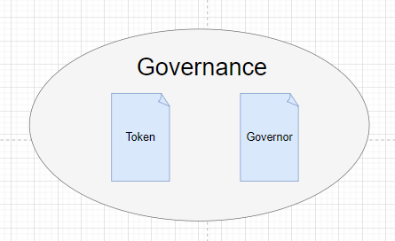
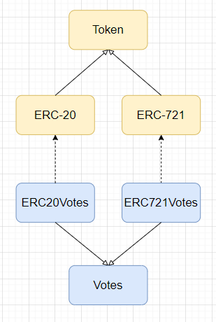
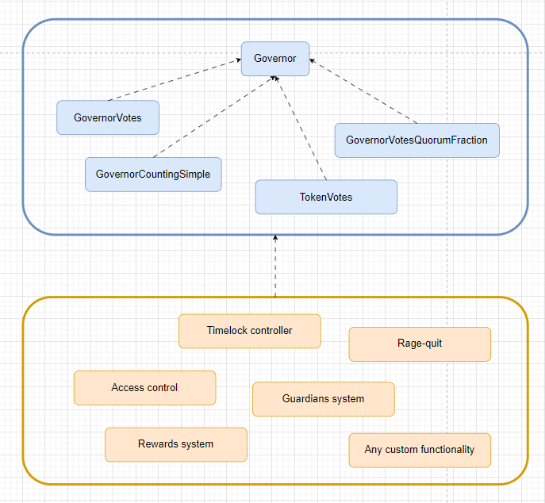
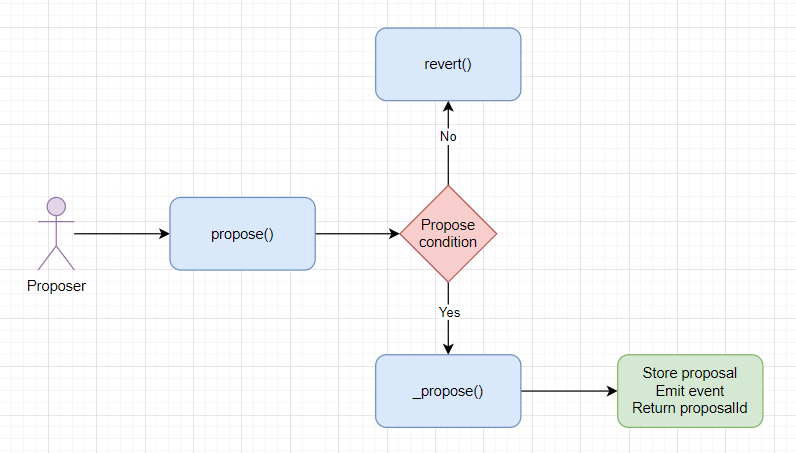
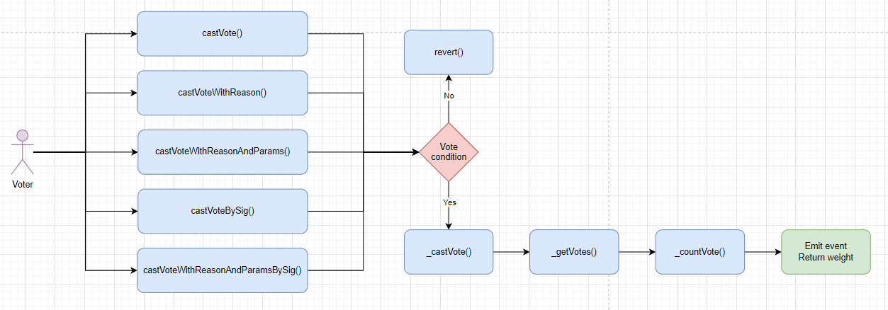
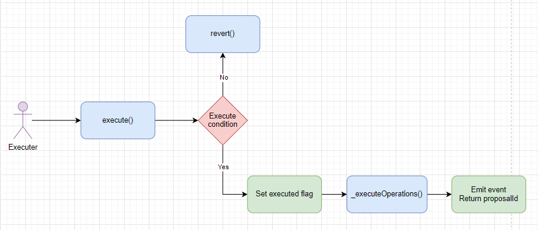

# OpenZeppelin governance

**Автор:** [Найданов Павел](https://github.com/PavelNaydanov) 🕵️‍♂️

Библиотека [OpenZeppelin](https://www.openzeppelin.com/) предоставляет решение для реализации системы **governance** on-chain в виде смарт-контрактов.

_Важно!_ В этой статьей рассматриваются [смарт-контракты](https://github.com/OpenZeppelin/openzeppelin-contracts/tree/v5.0.0/contracts/governance) OpenZeppelin версии 5.0.0.

До появление смарт-контрактов **governance** от OpenZeppelin долгое время популярными были контракты протокола [Compound](https://compound.finance/): [GovernorAlpha](https://github.com/compound-finance/compound-protocol/blob/master/contracts/Governance/GovernorAlpha.sol), [GovernorBravo](https://github.com/compound-finance/compound-protocol/blob/master/contracts/Governance/GovernorBravoDelegator.sol). Децентрализованные протоколы достаточно успешно использовали, дорабатывая код под свои нужды.

OpenZeppelin постарался переработать опыт Compound в модульную систему собственных контрактов, чтобы создать гибкую систему для сборки голосования на столько, на сколько это возможно. Наиболее массовые функциональные требования к системе голосования работают из коробки, но доработать новые, не должно составить труда.

_Важно!_ Система **governance** от OpenZeppelin разработана с учетом совместимости для уже существующих систем голосования на базе контрактов Compound. Поэтому некоторые контракты, внутри библиотеки, могут дублироваться. Например: [GovernorTimelockControl](https://github.com/OpenZeppelin/openzeppelin-contracts/blob/v5.0.0/contracts/governance/extensions/GovernorTimelockControl.sol) и [GovernorTimelockCompound](https://github.com/OpenZeppelin/openzeppelin-contracts/blob/v5.0.0/contracts/governance/extensions/GovernorTimelockCompound.sol).

## Архитектура



Для реализации системы голосования необходимо реализовать две подсистемы:
1. **Token** - для контроля возможности голосовать. Например, наличие у пользователя EC-721 или ERC-20 токена разрешает принимать участие в голосовании.
2. **Governor** - будет определять настройки, правила и жизненный цикл голосования.

### Token

На данный момент библиотека поддерживает два вида токена, которые можно использовать в системе **governance**:
1. **Взаимозаменяемый токен**. [Стандарт ERC-20](https://github.com/OpenZeppelin/openzeppelin-contracts/tree/v5.0.0/contracts/token/ERC20).
2. **Невзаимозаменяемый токен**. [Стандарт ERC-721](https://github.com/OpenZeppelin/openzeppelin-contracts/tree/v5.0.0/contracts/token/ERC721).

Для того, чтобы применить любой из этих видов токенов в системе голосования, необходимо использовать расширения токена: [ERC20Votes.sol](https://github.com/OpenZeppelin/openzeppelin-contracts/blob/v5.0.0/contracts/token/ERC20/extensions/ERC20Votes.sol) или [ERC721Votes.sol](https://github.com/OpenZeppelin/openzeppelin-contracts/blob/v5.0.0/contracts/token/ERC721/extensions/ERC721Votes.sol). Эти два контракта в свою очередь наследуются от контракта [Votes.sol](https://github.com/OpenZeppelin/openzeppelin-contracts/blob/v5.0.0/contracts/governance/utils/Votes.sol) из группы контрактов системы голосования.



_Важно!_ Пока библиотека не предлагает возможности использовать токен стандарта ERC-1155 для системы голосования.

Простой пример ERC-20 токена для голосования.

```solidity
// SPDX-License-Identifier: UNLICENSED
pragma solidity 0.8.20;

import {ERC20} from "@openzeppelin/contracts/token/ERC20/ERC20.sol";
import {ERC20Votes} from "@openzeppelin/contracts/token/ERC20/extensions/ERC20Votes.sol";
import {ERC20Permit, Nonces} from "@openzeppelin/contracts/token/ERC20/extensions/ERC20Permit.sol";

/// Контракт наследуется от ERC20Votes
contract VotesToken is ERC20, ERC20Permit, ERC20Votes {
    constructor(uint256 totalSupply) ERC20("Metalamp votes", "MTV") ERC20Permit("Metalamp votes") {
        _mint(msg.sender, totalSupply);
    }

    function _update(address from, address to, uint256 value) internal override(ERC20, ERC20Votes) {
        super._update(from, to, value);
    }

    function nonces(address owner)
        public
        view
        override(ERC20Permit, Nonces)
        returns (uint256)
    {
        return super.nonces(owner);
    }
}
```

Хочу обратить внимание, что контракт **VotesToken.sol**, по мимо других наследований, наследуется от контракта **ERC20Permit.sol**. Это необходимо, потому что, наследуясь от контракта **ERC20Votes.sol**, наследуется функционал **делегирования голосов по подписи**. Этот функционал находится глубже в цепочке наследований, в контракте [Votes.sol](https://github.com/OpenZeppelin/openzeppelin-contracts/blob/v5.0.0/contracts/governance/utils/Votes.sol#L142). Контракт **Votes.sol** реализует интерфейс контракта [EIP712](https://github.com/OpenZeppelin/openzeppelin-contracts/blob/v5.0.0/contracts/utils/cryptography/EIP712.sol), но не инициализирует конструктор EIP712. Поэтому инициализация конструктора EIP712 выполняется в [ERC20Permit.sol](https://github.com/OpenZeppelin/openzeppelin-contracts/blob/v5.0.0/contracts/token/ERC20/extensions/ERC20Permit.sol#L39).

Если нет необходимости добавлять функционал permit для своего токена, то можно наследовать контракт токена сразу от контракта [EIP712](https://github.com/OpenZeppelin/openzeppelin-contracts/blob/v5.0.0/contracts/utils/cryptography/EIP712.sol), а не от **ERC20Permit.sol**.

```solidity
// SPDX-License-Identifier: UNLICENSED
pragma solidity 0.8.20;

import {ERC20} from "@openzeppelin/contracts/token/ERC20/ERC20.sol";
import {ERC20Votes} from "@openzeppelin/contracts/token/ERC20/extensions/ERC20Votes.sol";
import {EIP712} from "@openzeppelin/contracts/utils/cryptography/EIP712.sol";

/// Контракт наследуется от ERC20Votes и EIP712 напрямую
contract VotesToken is ERC20, EIP712, ERC20Votes {
    constructor(uint256 totalSupply) ERC20("Metalamp votes", "MTV") EIP712("Metalamp votes", "1") {
        _mint(msg.sender, totalSupply);
    }

    function _update(address from, address to, uint256 value) internal override(ERC20, ERC20Votes) {
        super._update(from, to, value);
    }
}
```

_Важно!_ Быстро сгенерировать код токена для голосования можно воспользовавшись инструментом "[Contracts Wizard](https://docs.openzeppelin.com/contracts/5.x/wizard)" библиотеки OpenZeppelin. Для этого нужно выбрать пункт "Votes" при настройке.

_Не менее важно!_ Если у протокола уже есть свой токен, который успешно применяется и выполняет свои задачи. Для того, чтобы его можно было применить в системе голосования библиотека предлагает выпустить еще один токен обертку на базе своих контрактов: [ERC20Wrapper](https://github.com/OpenZeppelin/openzeppelin-contracts/blob/v5.0.0/contracts/token/ERC20/extensions/ERC20Wrapper.sol) и [ERC721Wrapper.sol](https://github.com/OpenZeppelin/openzeppelin-contracts/blob/v5.0.0/contracts/token/ERC721/extensions/ERC721Wrapper.sol). Это похожая история на токен WETH (обернутый эфир). Это позволит владельцем токенов обменивать свой первоначальный токен на обернутый и участвовать в системе голосования. Чуть подробнее в [документации](https://docs.openzeppelin.com/contracts/5.x/governance#token).

_И еще важного!_ Для токена голосования на базе ERC-721 используется аналогичный подход.

### Governor

Для того, чтобы реализовать подсистему **Governor**, необходимо ответить на несколько ключевых вопросов:
1. Как определять "**количество**" или "**вес**" голосов?
2. Сколько голосов необходимо для достижения [кворума](https://ru.wikipedia.org/wiki/%D0%9A%D0%B2%D0%BE%D1%80%D1%83%D0%BC), чтобы можно было считать голосование успешным?
3. Какие **варианты голосования** предоставляются пользователям и как эти голоса считаются?
4. Какой **тип токена** будет использован в качестве валидации пользователей на возможность голосования?

Библиотека OpenZeppelin считает эти вопросы ключевыми и закрепляет необходимость ответа на эти вопросу путем предоставления абстрактного базового контракта [Governor.sol](https://github.com/OpenZeppelin/openzeppelin-contracts/blob/v5.0.0/contracts/governance/Governor.sol). По сути это базовый смарт-контракт для реализации **Governor** подсистемы.

```solidity
// SPDX-License-Identifier: UNLICENSED
pragma solidity 0.8.20;

import "@openzeppelin/contracts/governance/Governor.sol";

contract MyGovernor is Governor {
    /// Реализация подсистемы Governor
}
```

Наследование от контракта **Governor** не позволит скомпилироваться и потребует реализации необходимого функционала (ответа на 4 вопроса выше). Ответом на каждый из вопросов выше является небольшой модуль-контракт:
1. [GovernorVotes.sol](https://github.com/OpenZeppelin/openzeppelin-contracts/blob/v5.0.0/contracts/governance/extensions/GovernorVotes.sol). Используется в качестве определения "количества" или "веса" голосов.
2. [GovernorVotesQuorumFraction.sol](https://github.com/OpenZeppelin/openzeppelin-contracts/blob/v5.0.0/contracts/governance/extensions/GovernorVotesQuorumFraction.sol). Используется для определения правил достижения кворума.
3. [GovernorCountingSimple.sol](https://github.com/OpenZeppelin/openzeppelin-contracts/blob/v5.0.0/contracts/governance/extensions/GovernorCountingSimple.sol). Используется для реализации простой системы вариантов выбора для участников голосования. Реализует возможность единичного выбора для пользователя из вариантов: "против", "за", "воздержался".
4. Расширение токенов [ERC20Votes](https://github.com/OpenZeppelin/openzeppelin-contracts/blob/v5.0.0/contracts/token/ERC20/extensions/ERC20Votes.sol) или [ERC721Votes](https://github.com/OpenZeppelin/openzeppelin-contracts/blob/v5.0.0/contracts/token/ERC721/extensions/ERC721Votes.sol).



Минимально требуемый функционал контрактом **Governor.sol** может быть заменен собственным или расширен дальше. Например в рамках системы голосования можно реализовать задержку исполнения принятых решений (Timelock), систему поощрения за участие в голосовании (Rewards system) и так далее.

_Важно!_ Минимально жизнеспособные контракты для системы **governance** можно собрать при помощи инструмента "[Contracts Wizard](https://docs.openzeppelin.com/contracts/5.x/wizard)" библиотеки OpenZeppelin.

## Полный список смарт-контрактов библиотеки OpenZeppelin для организации governance

Ниже представлен список смарт-контрактов библиотеки OpenZeppelin для реализации **Governor** из [репозитория](https://github.com/OpenZeppelin/openzeppelin-contracts/tree/v5.0.0/contracts/governance):

1. **Governor.sol**. Основной контракт, который содержит минимально необходимую логику для реализации системы голосования. Контракт является **абстрактным**, поэтому для использования необходимо от него наследоваться.
2. **Extensions**. Смарт-контракты, которые позволяют расширить функционал основного контракта Governor.sol
    - **GovernorCountingSimple.sol**. Реализует механизм простого голосования. Позволяет выбрать один вариант из трех: "против", "за", "воздержался".
    - **GovernorSettings.sol**. Реализует управление **настройками** голосования: voting delay, voting period duration, and proposal threshold.
    - **GovernorStorage.sol**. Сохраняет детали предложений для голосования внутри сети блокчейн. Это дает перечисляемость предложений на смарт-контрактах. Может быть полезным в L2 сетях, где стоимость газа не имеет сильного значения.
    - **GovernorTimelockAccess.sol**. Реализует механизм отложенного выполнения принятого решения после успешного голосования. Работает в связке с контрактом [AccessManager](https://github.com/OpenZeppelin/openzeppelin-contracts/blob/v5.0.0/contracts/access/manager/AccessManager.sol).
    - **GovernorTimelockCompound.sol**. Реализует механизм отложенного выполнения принятого решения после успешного голосования. Работает в связке с контрактом [Timelock](https://github.com/compound-finance/compound-protocol/blob/master/contracts/Timelock.sol) от Compound
    - **GovernorTimelockControl.sol**. Реализует механизм отложенного выполнения принятого решения после успешного голосования. Работает в связке с контрактом [TimelockController.sol](https://github.com/OpenZeppelin/openzeppelin-contracts/blob/v5.0.0/contracts/governance/TimelockController.sol).
    - **GovernorVotes.sol**. Реализует механизм голосования, в котором вводится понятие **"вес голоса"**. Например, владение пользователем **одним** токеном протокола приравнивается к **двум** голосам в системе голосования.
    - **GovernorVotesQuorumFraction.sol**. Вводит понятие **кворум**. Следит за выполнением того, чтобы количество проголосовавших было не меньше установленного значения. Обычно это процент от всех, кто может голосовать. Например, кворум равный 50% означает, что голосование завершается успешно, только в случае, если 50%, от всех кто мог проголосовать, голосуют "за".
    - **GovernorPreventLateQuorum.sol**. Обеспечивает минимальный период голосования при достижение кворума.
3. **Utils**. Список смарт-контрактов для вспомогательного применения в системе голосования.
    - **Votes.sol**. Абстрактный контракт для отслеживания единиц голосования. Реализует механизм делегирования голосов. Применяется в токена ERC20Votes и ERC721Votes.

## Основные сценарии работы системы голосования

В этом разделе я покажу, какие функции и на каких смарт-контрактах необходимо вызывать для основных пользовательских сценариев системы голосования.

Предположим, что мы реализовали самую простую систему голосования на базе контрактов **governance** библиотеки OpenZeppelin.

```solidity
// SPDX-License-Identifier: UNLICENSED
pragma solidity 0.8.20;

import {Governor} from "@openzeppelin/contracts/governance/Governor.sol";
import {GovernorSettings} from "@openzeppelin/contracts/governance/extensions/GovernorSettings.sol";
import {GovernorCountingSimple} from "@openzeppelin/contracts/governance/extensions/GovernorCountingSimple.sol";
import {GovernorVotes, IVotes} from "@openzeppelin/contracts/governance/extensions/GovernorVotes.sol";
import {GovernorVotesQuorumFraction} from "@openzeppelin/contracts/governance/extensions/GovernorVotesQuorumFraction.sol";

/**
 * @title Система голосования Metalamp
 * @notice Реализует самую базовую систему голосования на базе смарт контрактов OpenZeppelin
 * @dev Используется 4 базовых расширения:
 * - GovernorSettings. Для управления настройками
 * - GovernorCountingSimple. Для подсчета вариантов голосования
 * - GovernorVotes. Для подсчета веса голосов
 * - GovernorVotesQuorumFraction. Для управления кворумом
 */
contract MetalampGovernance is Governor, GovernorSettings, GovernorCountingSimple, GovernorVotes, GovernorVotesQuorumFraction {
    uint48 public constant INITIAL_VOTING_DELAY = 1 days;
    uint32 public constant INITIAL_VOTING_PERIOD = 30 days;

    /// Означает, что разрешается любому аккаунту создавать предложения
    uint256 public constant INITIAL_PROPOSAL_THRESHOLD = 0;
    /// Означает, что кворум значение не учитывается в подсчете результатов
    uint256 public constant INITIAL_QUORUM_NUMERATOR_VALUE = 0;

    constructor(IVotes token)
        Governor("Metalamp governance")
        GovernorSettings(INITIAL_VOTING_DELAY, INITIAL_VOTING_PERIOD, INITIAL_PROPOSAL_THRESHOLD)
        GovernorVotes(token)
        GovernorVotesQuorumFraction(INITIAL_QUORUM_NUMERATOR_VALUE)
    {}

    function proposalThreshold()
        public
        view
        override(Governor, GovernorSettings)
        returns (uint256)
    {
        return super.proposalThreshold();
    }
}
```

Для деплоя смарт-контракта **MetalampGovernance.sol** в сеть необходимо указать токен голосования. Пример кода токена приводить не буду. Предположим, что это будет стандартный токен ERC20 (расширенный функционалом ERC20Votes). Теперь остается понять, каким образом необходимо взаимодействовать с задеплоенным контрактом.

### Создание предложения

Для того чтобы создать новое предложение в системе голосования необходимо вызвать функцию `propose()` на смарт-контракте **MetalampGovernance.sol**. Реализация функции находится в основном абстрактном смарт-контракте [Governor.sol](https://github.com/OpenZeppelin/openzeppelin-contracts/blob/v5.0.0/contracts/governance/Governor.sol#L275).

```solidity
/**
 * @notice Позволяет внести предложение на голосование
 * @param targets Список адресов контрактов на которых будет исполняться вызовы calldatas
 * @param values Список значения нативной валюты которое должно быть передано с вызовом каждой calldata на каждом адресе (target)
 * @param calldatas Список закодированных вызовов функций с аргументами
 * @param description Текстовое описание предложения
 */
function propose(
    address[] memory targets,
    uint256[] memory values,
    bytes[] memory calldatas,
    string memory description
) public virtual returns (uint256) {
    /// Считаем, что вызывающий функцию является автором предложения
    address proposer = _msgSender();

    /// Проверяет разрешено ли это предложение вносить на голосование вызывающему адресу.
    /// В конце description можно указать адрес предлагающего (`[description]#proposer=0x`). Если proposer указан, то только этот адрес может вносить предложение на голосование.
    /// Это позволяет создать действительно уникальное предложение, так как description участвует в генерации proposalId, а эта проверка не позволит клонировать предложение
    if (!_isValidDescriptionForProposer(proposer, description)) {
        revert GovernorRestrictedProposer(proposer);
    }

    /// Проверяем, что автор предложения имеет достаточно прав для создания.
    /// Для этого вес голосов автора должны превышать значение возвращаемое функцией proposalThreshold()
    uint256 proposerVotes = getVotes(proposer, clock() - 1);
    uint256 votesThreshold = proposalThreshold();
    if (proposerVotes < votesThreshold) {
        revert GovernorInsufficientProposerVotes(proposer, proposerVotes, votesThreshold);
    }

    return _propose(targets, values, calldatas, description, proposer);
}
```

Дальше вызов уходит в приватную функцию `_propose()`.

```solidity
function _propose(
    address[] memory targets,
    uint256[] memory values,
    bytes[] memory calldatas,
    string memory description,
    address proposer
) internal virtual returns (uint256 proposalId) {
    /// Генерируется уникальный идентификатор предложения
    proposalId = hashProposal(targets, values, calldatas, keccak256(bytes(description)));

    /// Проверяется правильность переданных параметров предложения
    if (targets.length != values.length || targets.length != calldatas.length || targets.length == 0) {
        revert GovernorInvalidProposalLength(targets.length, calldatas.length, values.length);
    }

    /// Проверяется, что такого предложения еще не было
    if (_proposals[proposalId].voteStart != 0) {
        revert GovernorUnexpectedProposalState(proposalId, state(proposalId), bytes32(0));
    }

    /// Время на которое будут проверяться балансы голосов проголосовавших.
    /// Совпадает с временем начала голосования по предложению
    uint256 snapshot = clock() + votingDelay();
    uint256 duration = votingPeriod();

    /// Записывается информация о предложении, которая будет храниться в сети
    ProposalCore storage proposal = _proposals[proposalId];
    proposal.proposer = proposer;
    proposal.voteStart = SafeCast.toUint48(snapshot);
    proposal.voteDuration = SafeCast.toUint32(duration);

    emit ProposalCreated(
        proposalId,
        proposer,
        targets,
        values,
        new string[](targets.length),
        calldatas,
        snapshot,
        snapshot + duration,
        description
    );
}
```

На схеме можно представить этот процесс следующим образом:



Пример вызова функции `propose()` из другого смарт-контракта. Предлагаем вынести на голосование вызов функции `set(address)` для смарт-контракта whitelist. Предполагаем, что функция не payable, поэтому нет необходимости заполнять массив values.

```solidity
address account = 0x...;

address[] targets = new address[](1);
uint256[] values = new uint256[](1);
bytes[] calldatas = new bytes[](1);
string memory description = "Proposal to add an account to the whitelist";

targets[0] = address(whitelist);
calldatas[0] = abi.encodeWithSelector(Whitelist.set.selector, account);

uint256 proposalId = governance.propose(targets, values, calldatas, description);
```

После создания предложения можно получить со смарт-контракта:
1. Время начала голосования `proposalSnapshot(uint256 proposalId)`.
2. Время окончания голосования `proposalDeadline(uint256 proposalId)`
3. Автора предложения `proposalProposer(uint256 proposalId)`
4. Состояние предложения `state(uint256 proposalId)` (Pending, Active, Cancelled и так далее)

_Важно!_ Для получения списка созданных предложений за пределами сети необходимо реализовать "сервис-индексир" данных, который будет слушать событие `ProposalCreated()` и агрегировать все созданные предложения. Альтернативное решение может использовать расширение [GovernorStorage.sol](https://github.com/OpenZeppelin/openzeppelin-contracts/blob/v5.0.0/contracts/governance/extensions/GovernorStorage.sol) для хранения данных предложений в сети.

### Отмена предложения

Предполагаем, что предложение было создано подобно разделу [выше](#создание-предложения).

Для того, чтобы отменить предложение необходимо вызвать функцию `cancel()` на смарт-контракте **MetalampGovernance.sol**. Реализация функции находится в основном абстрактном смарт-контракте [Governor.sol](https://github.com/OpenZeppelin/openzeppelin-contracts/blob/v5.0.0/contracts/governance/Governor.sol#L453).

```solidity
/**
 * @notice Позволяет отменить голосование по предложению
 * @param targets Список адресов контрактов на которых будет исполняться вызовы calldatas
 * @param values Список значения нативной валюты которое должно быть передано с вызовом каждой calldata на каждом адресе (target)
 * @param calldatas Список закодированных вызовов функций с аргументами
 * @param description Закодированное текстовое описание предложения
 */
function cancel(
    address[] memory targets,
    uint256[] memory values,
    bytes[] memory calldatas,
    bytes32 descriptionHash
) public virtual returns (uint256) {
    /// Генерируется идентификатор предложения для проверки статуса
    uint256 proposalId = hashProposal(targets, values, calldatas, descriptionHash);

    /// Проверяется, что предложение все еще в статусе Pending
    _validateStateBitmap(proposalId, _encodeStateBitmap(ProposalState.Pending));

    /// Проверяется вызывающий. Только создатель предложения может отменить предложение
    if (_msgSender() != proposalProposer(proposalId)) {
        revert GovernorOnlyProposer(_msgSender());
    }

    /// Вызов приватной функции
    return _cancel(targets, values, calldatas, descriptionHash);
}
```

Дальше вызов уходит в приватную функцию `_cancel()`. Она принимает одинаковые параметры, как в публичной функции `cancel()`.

```solidity
    function _cancel(
        address[] memory targets,
        uint256[] memory values,
        bytes[] memory calldatas,
        bytes32 descriptionHash
    ) internal virtual returns (uint256) {
        /// Генерируется идентификатор предложения
        uint256 proposalId = hashProposal(targets, values, calldatas, descriptionHash);

        /// Для отмены статус предложения может быть любым, кроме
        /// Canceled, Expired, Executed
        _validateStateBitmap(
            proposalId,
            ALL_PROPOSAL_STATES_BITMAP ^
                _encodeStateBitmap(ProposalState.Canceled) ^
                _encodeStateBitmap(ProposalState.Expired) ^
                _encodeStateBitmap(ProposalState.Executed)
        );

        /// В storage проставляется значение canceled
        /// По этому значению функция state() будет определять статус canceled
        _proposals[proposalId].canceled = true;

        emit ProposalCanceled(proposalId);

        /// Возвращает идентификатор отмененного предложения
        return proposalId;
    }
```

_Важно!_ Хочу обратить внимание, что все функции с модификатором **virtual**. Это означает, что поведение по умолчанию может быть изменено.

### Отправка голоса

Для того, чтобы была возможность голосовать участникам необходимы следующий условия:
1. **Предложение** было **создано** в систему голосования. Смотри пункт [выше](#создание-предложения).
2. **Голосование** должно **начаться**, то есть текущий **номер блока** должен превышать время начала голосования (voteStart). Время начала голосования совпадает со временем проверки голосов на токене(snapshot). Получить snapshot можно вызвав функцию `proposalSnapshot(proposalId)`.
3. У голосующего участника должно быть право голоса, то есть у него должны быть в наличие токены голосования. Для того, чтобы эти токены учитывались при голосовании, участник должен **делегировать токены** на свой адрес или адрес другого участника, который получит право голосования. Для делегирования, голосующий участник должен вызвать функцию `delegate(address voter)` на контракте токена голосования (который наследует функционал библиотеки ERC20Votes или ERC721Votes), где **voter** адрес аккаунта, кому будет передано право голоса.

Если все описанные условия выполнены, то голосующий участник должен вызвать функцию `castVote(proposalId, support)` на смарт-контракте **MetalampGovernance.sol**. Реализация находится в абстрактном смарт-контракте [Governor.sol](https://github.com/OpenZeppelin/openzeppelin-contracts/blob/v5.0.0/contracts/governance/Governor.sol#L522C14-L522C22).

```solidity
/**
 * @notice Функция голосования
 * @param proposalId Идентификатор предложения
 * @param support Закодированное решение в uint8 (например, "за", "против" или "воздержался")
 */
function castVote(uint256 proposalId, uint8 support) public virtual returns (uint256) {
    /// Голосующим считается вызывающий функцию
    address voter = _msgSender();

    return _castVote(proposalId, voter, support, "");
}
```

По-мимо функции `castVote()`, для того чтобы проголосовать контракт предлагает дополнительные функции:
1. [`castVoteWithReason()`](https://github.com/OpenZeppelin/openzeppelin-contracts/blob/v5.0.0/contracts/governance/Governor.sol#L530) - дает возможность добавить описание к принятому решению
2. [`castVoteWithReasonAndParams()`](https://github.com/OpenZeppelin/openzeppelin-contracts/blob/v5.0.0/contracts/governance/Governor.sol#L542C14-L542C41) - дает возможность добавить описание к принятому решению и передать произвольные параметры для использования в дополнительной логике голосования
3. [`castVoteBySig()`](https://github.com/OpenZeppelin/openzeppelin-contracts/blob/v5.0.0/contracts/governance/Governor.sol#L555C14-L555C27) - дает возможность проголосовать на основании подписи участника голосования
4. [`castVoteWithReasonAndParamsBySig()`](https://github.com/OpenZeppelin/openzeppelin-contracts/blob/v5.0.0/contracts/governance/Governor.sol#L577C14-L577C46) - объединяет все три варианта в одном: описание принятого решение, произвольные параметры, голосование по подписи

Независимо от выбора любой из предложенных функций для голосования, под капотом, будет вызвана приватная функция голосования [`_castVote()`](https://github.com/OpenZeppelin/openzeppelin-contracts/blob/v5.0.0/contracts/governance/Governor.sol#L631C1-L650C6).

```solidity
function _castVote(
    uint256 proposalId,
    address account,
    uint8 support,
    string memory reason,
    bytes memory params
) internal virtual returns (uint256) {
    /// Проверяется, что предложение сейчас в активном статусе,
    /// что позволяет голосовать за предложение
    _validateStateBitmap(proposalId, _encodeStateBitmap(ProposalState.Active));

    /// Рассчитывается вес голоса
    uint256 weight = _getVotes(account, proposalSnapshot(proposalId), params);

    /// Учитывается голос
    _countVote(proposalId, account, support, weight, params);

    /// Отправка события об успешности голосования
    if (params.length == 0) {
        emit VoteCast(account, proposalId, support, weight, reason);
    } else {
        emit VoteCastWithParams(account, proposalId, support, weight, reason, params);
    }

    return weight;
}
```

На схеме можно представить этот процесс следующим образом:


Расчет "веса" голоса (**_getVotes**) и учет голоса (**_countVotes**) - это настраиваемая модульная история, которая может быть реализована согласно потребностям системы голосования. При этом библиотека OpenZeppelin предлагает базовые решение, которые можно посмотреть в смарт-контрактах [GovernorVotes.sol](https://github.com/OpenZeppelin/openzeppelin-contracts/blob/v5.0.0/contracts/governance/extensions/GovernorVotes.sol#L57) и [GovernorCountingSimple.sol](https://github.com/OpenZeppelin/openzeppelin-contracts/blob/v5.0.0/contracts/governance/extensions/GovernorCountingSimple.sol#L76) соответственно.

### Отправка голоса с подписью

Подробнее узнать что такое подпись можно [тут](https://ethereum.org/en/glossary/#digital-signatures).

Основной плюс использования подписи заключается в том, что участник дает цифровую подпись и ему **не обязательно платить газ** за исполнение транзакции при отправке голоса. Эту роль может брать на себя off-chain сервис и с подписью участника отправлять голос, выполняя только саму транзакцию за него.

Для того, чтобы была возможность участникам голосовать с использованием подписи, должны быть выполнены все условия, описанные в разделе ["отправка голоса"](#отправка-голоса).

Однако для того, чтобы делегировать токены классическим способом вызывая функцию `delegate(address voter)` голосующий все равно должен заплатить за газ. В этом случае у участника голосования есть возможность воспользоваться подобным механизмом и вызывать функцию `delegateBySig()`. Это позволит не платить газ полностью на всем этапе отправки голоса. Реализована эта функция в контракте [Votes.sol](https://github.com/OpenZeppelin/openzeppelin-contracts/blob/v5.0.0/contracts/governance/utils/Votes.sol#L142).

Если все описанные условия выполнены, то голосующий участник должен вызвать функцию `castVoteBySig(uint256 proposalId, uint8 support, address voter, bytes memory signature)` на смарт-контракте **MetalampGovernance.sol**. Реализация находится в абстрактном смарт-контракте [Governor.sol](https://github.com/OpenZeppelin/openzeppelin-contracts/blob/v5.0.0/contracts/governance/Governor.sol#L555C1-L572C6).

```solidity
/**
 * @notice Функция голосования с использованием подписи
 * @param proposalId Идентификатор предложения
 * @param support Закодированное решение в uint8 (например, "за", "против" или "воздержался")
 * @param voter Адрес голосующего участника
 * @param signature Подпись от имени адреса voter
 */
function castVoteBySig(
    uint256 proposalId,
    uint8 support,
    address voter,
    bytes memory signature
) public virtual returns (uint256) {
    /// Проверка подписи для адреса voter
    bool valid = SignatureChecker.isValidSignatureNow(
        voter,
        _hashTypedDataV4(keccak256(abi.encode(BALLOT_TYPEHASH, proposalId, support, voter, _useNonce(voter)))),
        signature
    );

    /// Если подпись невалидна, то откатить транзакцию
    if (!valid) {
        revert GovernorInvalidSignature(voter);
    }

    /// Вызов приватной функции отправки голоса
    return _castVote(proposalId, voter, support, "");
}

```

На этом отличия для отправки голоса с подписью заканчиваются, дальше вызов уходит в приватную функцию `_castVote()`, которую я разобрал в разделе ["отправка голоса"](#отправка-голоса).

### Выполнение предложения

Для того, чтобы была возможность применить предложение должны быть выполнены следующие условия:

1. **Предложение** было **создано** в систему голосования. Смотри пункт [выше](#создание-предложения).
2. Голосование **прошло** и было **успешно завершено** по одному из условий: истекло время или указанный кворум был достигнут. Процесс голосования описан [выше](#отправка-голоса). Для того, что узнать время окончания можно вызвать функцию `proposalDeadline(uint256 proposalId)`.

При выполнение условий, по умолчанию для адреса, появляется возможность применить предложение. Для этого необходимо вызвать функцию `execute()` на смарт-контракте **MetalampGovernance.sol**. Реализация находится в абстрактном смарт-контракте [Governor.sol](https://github.com/OpenZeppelin/openzeppelin-contracts/blob/v5.0.0/contracts/governance/Governor.sol#L393).

```solidity
function execute(
    address[] memory targets,
    uint256[] memory values,
    bytes[] memory calldatas,
    bytes32 descriptionHash
) public payable virtual returns (uint256) {
    /// Определяется идентификатор предложения
    uint256 proposalId = hashProposal(targets, values, calldatas, descriptionHash);

    /// Проверяется статус предложения
    _validateStateBitmap(
        proposalId,
        _encodeStateBitmap(ProposalState.Succeeded) | _encodeStateBitmap(ProposalState.Queued)
    );

    /// Предложение помечается выполненным
    _proposals[proposalId].executed = true;

    /// Выполнение предложения добавляется в очередь
    if (_executor() != address(this)) {
        for (uint256 i = 0; i < targets.length; ++i) {
            if (targets[i] == address(this)) {
                _governanceCall.pushBack(keccak256(calldatas[i]));
            }
        }
    }

    /// Выполнение предложения
    _executeOperations(proposalId, targets, values, calldatas, descriptionHash);

    /// Очищение очереди
    if (_executor() != address(this) && !_governanceCall.empty()) {
        _governanceCall.clear();
    }

    emit ProposalExecuted(proposalId);

    return proposalId;
}
```

Непосредственно выполнение происходит в функции [`_executeOperations()`](https://github.com/OpenZeppelin/openzeppelin-contracts/blob/v5.0.0/contracts/governance/Governor.sol#L437C14-L437C32). Нам оттуда интересна строчка:

```solidity
(bool success, bytes memory returndata) = targets[i].call{value: values[i]}(calldatas[i]);
```


Можно заметить, что с вызовом `call()` были использованы все параметры, которые участвовали в формирование предложения.

На схеме можно представить этот процесс следующим образом:


## Вывод

Я показал, как можно построить governance на базе библиотеки OpenZeppelin. Система контрактов не самая простая, но при этом достаточно гибкая, позволяет определять необходимый набор функций, правил и результат для голосования.

Самый простой процесс голосования включает в себя **три этапа**:
создание предложения, голосование, выполнение предложения в случае успешного голосования.
Для выполнения этих трех этапов я реализовал всего два контракта:
1. [MetalampGovernance.sol](../contracts/src/MetalampGovernance.sol)
2. [VotesToken.sol](../contracts/src/VotesToken.sol)

[Три теста](../contracts/test/MetalampGovernance.t.sol), описывающие три этапа хорошо могут дополнить картину происходящего.

В качестве целевого контракта использовался простой контракт [Whitelist.sol](../contracts/test/mocks/Whitelist.sol). Именно на этом контракте в тестах через **MetalampGovernance** контракт вызывалась функция `set()` в качестве применения предложения после успешного результата голосования.

_Важно!_ Не стоит забывать, что реальная система голосования может быть гораздо сложнее и включать в себя механизм TimeLock, реализовывать другую систему подсчета голосов или расчета "веса" и так далее.

## Links

1. [Governance docs](https://docs.openzeppelin.com/contracts/5.x/api/governance)
2. [OpenZeppelin contracts. Repository](https://docs.openzeppelin.com/contracts/5.x/api/governance)