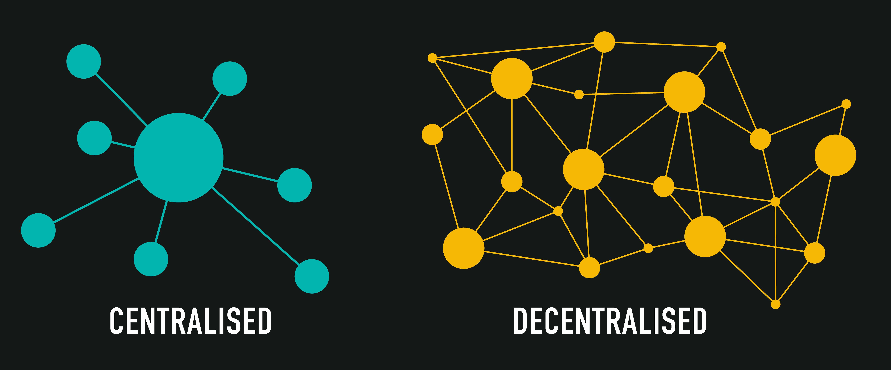
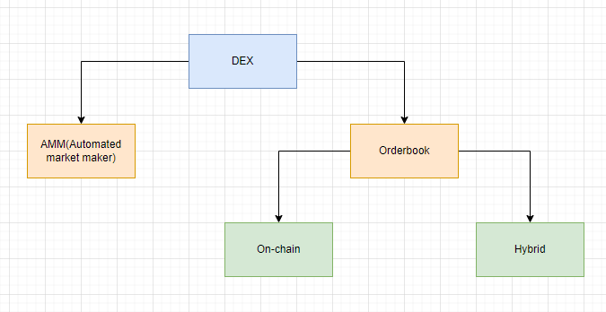

# DEX

> В этой статье я расскажу про устройство децентрализованных обменников. Если ты не знаком с понятием "Децентрализация", то рекомендую прочитать [маленькую статью](https://medium.com/@juliomacr/centralized-vs-decentralized-vs-distributed-a-quick-overview-1f3bd17b8468) или [статью побольше](https://medium.com/hackernoon/centralization-vs-decentralization-the-best-and-worst-of-both-worlds-7bfdd628ad09).

**DEX**(Decentralized exchange) - децентрализованный обменник. Управление и администрирование такого сервиса не принадлежит никому или находится в руках сообщества. Доступ к активам осуществляется без помощи посредника, поэтому такой обменник можно назвать [одноранговым](https://academy.binance.com/en/glossary/peer-to-peer) или P2P. За заключением сделок между пользователями следят смарт-контракты, которые были размещены в блокчейн сети. Это позволяет снизить комиссию за операции.

## Базовые понятия

### Ликвидность

В классическом понимании **ликвидность** — это показатель скорости обмена актива с учётом его рыночной стоимости. Когда есть покупатели, готовые купить актив по цене продавца, это говорит о высокой ликвидности. И наоборот, низкая ликвидность говорит об отсутствии таких покупателей.

> Представь ситуацию, продавец выставляет на продажу свой старенький ржавый Dodge Charger. Проходят недели, но никто не покупает автомобиль. Продавец отчаивается и понимает, что его автомобиль никому не нужен. Это пример **низкой ликвидности**. Но если бы автомобиль был продан в первый день, то это говорило бы о его **высокой ликвидности**. Не переживай за Dodge Charger, всегда найдется покупатель, который по достоинству оценит американскую легенду мускулкаров.

_Важно!_ Получается можно сделать следующий вывод, что **ликвидный рынок** — это рынок, на котором можно легко купить и продать активы по справедливой стоимости. То есть существует высокий спрос со стороны тех, кто хочет приобрести актив, и достаточное предложение со стороны тех, кто хочет его продать.

### Маркет-мейкеры и маркет-тейкеры

Чтобы рынок был ликвидным, необходимо, чтобы обмен токенов происходил максимально быстро. При любом обмене токенов продавец должен быть сопоставлен с покупателем или наоборот покупатель с продавцом. Если не будет точки соприкосновения, то сделка будет невозможна.

Все пользователи обменника делятся на два типа:
1. **Маркет-мейкеры.** Пользователи, которые делают предложение о покупке или продаже токена.
2. **Маркет-тейкеры.** Пользователи, которые принимают предложение о покупке или продаже токена.

Для того, чтобы сделка состоялась, **мейкер** должен предложить актив к обмену. Поэтому, его часто называют **создателем рынка**. Без него не будет создано предложение.

Созданное предложение не является гарантом успешной сделки. Поэтому нужен исполнитель или **тейкер**, который закроет предложение. Он заберет предложенный актив и в обмен отдаст собственный актив, который запросил **мейкер**.

Таким образом, **маркет-мейкер** отдает ликвидность, а **маркет-тейкер** ликвидность забирает.

_Важно!_ Нередко роль маркет-мейкера берут на себя крупные игроки рынка. Это может быть и сам обменник.

### Поставщики ликвидности

**Поставщики ликвидности** — это инвесторы, которые передают свои активы в резервы обменнику. Эти резервы используется для быстрого исполнения операций(обмен токенов). За предоставление ликвидности поставщикам полагаются комиссионные отчисления за транзакции. Этот процесс часто называют [майнингом ликвидности](https://academy.shrimpy.io/lesson/what-is-liquidity-mining) или созданием рынка. Такие транзакционные сборы выражаются в процентных ставках. Проценты варьируются в зависимости от объема доступной ликвидности и количества транзакций.

_Важно!_ **Маркет-мейкеры** тоже являются поставщиками ликвидности. Мейкеры жизненно важны для привлекательности платформы, как торговой площадки. Поэтому, для маркет-мейкеров, комиссия за проведение операций может быть ниже.

_Важно!_ **Маркет-тейкеры** используют ликвидность обменника, чтобы легко и быстро обменивать активы. За эту скорость они платят более высокую комиссию.

## DEX vs CEX

В свое время, DEX пришел на замену CEX(Centralized Exchange).

**CEX**(Centralized Exchange) - это централизованный обменник. Управление и администрирование такого сервиса находится в руках одной организации, которая выступает в роли посредника при обмене средств между пользователями.

Большинство централизованных обменников аналогичны традиционным финансовым сервисам таким как Нью-Йоркская фондовая биржа. Поэтому интерфейсы таких обменников, как правило, более удобны для новичков. Большинство CEX основаны на модели [OrderBook](https://www.binance.com/en/support/faq/understanding-order-book-and-market-depth-da311403b10347f09ff783a2525c8aa6)(книга заказов). В такой модели вся информация об операциях и балансах хранится внутри БД обменника.

Через CEX можно обменивать фиатные средства на криптовалюту (и наоборот) или криптовалюту на криптовалюту. Например, часть BTC на ETH.

CEX позволяет использовать более сложные инструменты: маржинальные сделки или лимитные ордера. Это возможно за счет модели Orderbook, так как эта модель хранит всю информацию об операциях. Технически, информация находится во внутренней базе данных обменника.

СEX требует отдельной операцией заводить и выводить активы. Зачастую, обменники берут комиссию за все: за ввод средств, за вывод, за обмены, за хранение и так далее. При этом, во власти CEX запретить вывод или установить лимит на ввод и тому подобное.

Чтобы решить проблемы с прозрачностью, безопасностью и высокой комиссией были разработаны **DEX на основе AMM**. Здесь нет централизованного посредника, которому необходимо отчислять комиссию. DEX, могут объединиться, чтобы увеличить свою общую ликвидность.

Ниже я подготовил сравнительную табличку СEX vs DEX:

|| CEX | DEX |
| -------| ---------- | -------------- |
|**Орган управления**| Одна организация, которая владеет обменником | Сообщество пользователей. [DAO](https://academy.binance.com/en/glossary/decentralized-autonomous-organization) |
|**Анонимность**| Нет. Требует [KYC](https://en.wikipedia.org/wiki/Know_your_customer) | Да. Достаточно web3 кошелька |
|**Доступ к активам пользователя**| Да | Нет |
|**Риск быть заблокированным**| Высокий | Низкий |
|**Возможность работать с фиатными средствами**| Да | Нет |
|**Отказоустойчивость**| Низкая | Высокая |
|**Доп. возможности(Маржинальная торговля, внебиржевая торговля и т.д)**| Да | Частично. Не все DEX обладают дополнительными инструментами. Более того, не для всех видов DEX имеется техническая возможность реализовать такие инструменты |
|**Прозрачность операций** | Нет | Да |
|**Популярные сервисы**| Binance, Coinbase, Kraken, Gate и др | Uniswap, dYdX, PancakeSwap, Curve, SushiSwap и др |

## Виды DEX

Децентрализованные обменники можно разделить на две группы:
1. На базе **AMM**(Automated Market Maker) или liquidity pool based. Это обменники которые реализуют автоматический обмен и ценообразование
2. На базе **orderBook**(книга заказов) или orderbook based. Аналогично CEX. Пользователи создают ордера на покупку или продажу токенов. Отличие заключается в том, что вся работа происходит внутри блокчейн сети

**Orderbook** может быть реализован полностью на смарт-контрактах on-chain. Либо гибридно. Основные вычисления off-chain, результат закрепления сделки on-chain. Необходимо это для минимизации записи информации в блокчейн с целью минимизации расходов на газ.

Про DEX на **AMM** читай подробнее [тут](./amm/README.md).

Про DEX на **orderbook** читай подробнее [тут](./orderbook/README.md).

## Подводные камни децентрализованной торговли

Основных нюансов не так уж много. Я бы выделил три:
1. Проблема с ценообразованием актива на момент выполнения транзакции. Более известное название - **проскальзывание цены(price slippage)**. Связано это с тем, что транзакции выполняются не моментально и на момент выполнения нашей транзакции, реальная цена актива может измениться.
2. Большая вероятность потери прибыли для поставщиков ликвидности. **Непостоянные потери(Impermanent loss)**. Поставщик, который передал средства обменнику в качестве ликвидности теряет доход в случае, если цена актива выросла гораздо больше профита, который предоставляет обменник. То есть, если бы поставщик ликвидности продал активы, то он бы заработал больше, чем предложил обменник за предоставление ликвидности.
3. "Другие участники большой игры". **Arbitrage.** Извлечение прибыли на разнице курса активов. С одной стороны несет положительный эффект, позволяя выравнивать стоимость активов между обменниками. С другой стороны, порождает целый ряд негативных эффектов, которые влияют на обмены токенами между обычными пользователями.

Обо всем этом подробнее можно прочитать [тут](./underwater-rocks/README.md).

## Обзор DEX

### DEX на orderbook

Ярким представителем является [dYdX](https://dydx.exchange/). Сервис работает аналогично CEX. Пользователи могут создавать ордера на покупку и продажу по выбранным ценовым лимитам или рыночным ценам. Активы пользователей, как и в CEX, хранятся на кошельке обменника. Для пользователя доступен функционал ввода активов в обменник и вывода.

Известных решений **DEX на orderbook** достаточно мало. Причиной является ликвидность. Достаточно сложно обеспечить ликвидность для **DEX на orderbook**. Большая вероятность, что пользователям, придётся долго ждать, пока их ордера будут выполнены. Чтобы увеличить скорость исполнения ордеров нужно большое количество пользователей, которые будут создавать ликвидность своми ордерами. Часто на старте запуска такого обменника создается фейковая активность. Видимость создания и закрытия ордеров. Это позволяет пользователю быстрее закрывать свои рыночные ордера и чувствовать, что обменник действительно жив и работает в штатном режиме.

### DEX на AMM

Примерами популярных **DEX на основе AMM** являются [Uniswap](https://uniswap.org/), [Balancer](https://balancer.fi/), [Bancor](https://app.bancor.network/) и другие. Каждая DEX имеет свои особенности. Каждая решает определённую проблему или даже несколько проблем сразу. И если ты дочитал до этого места, то тебе необходимо знать о том, какие подходы применяют различные DeFi-протоколы для решения своих задач.

Подробнее обзор самых популярных DEX на AMM [тут](./dex-review/README.md).

## Вывод

DEX можно воспринимать по-разному, можно считать это утопией, можно считать это будущим финансовой системы. Все достоинства, в виде децентрализации, прозрачности, отказоустойчивости можно считать, как преимуществами, так и недостатками одновременно.

Поэтому я выделю преимущества, а ты можешь сам решить, насколько это для тебя скорее плюс, чем минус.

Потенциальные преимущества:
1. **Разнообразие токенов**. DEX предлагает огромное количество токенов для обмена. Но если вдруг ты не нашел нужного токена, ты можешь организовать собственный пул ликвидности. Для этого не требуется одобрение обменника или сертификация токена.
2. **Низкий риск взлома**. Так как средства пользователей находятся на их собственных кошельках, обменники не имеют полный доступ к этим средствам. Это значит, что контроль за собственными средствами в руках пользователя. Риск взлома для пользователей возможен только в случае, если сам пользователь передаст право распоряжаться средствами третьим лицам. Даст `approve()`. Однако есть угроза поставщикам ликвидности, средства которых хранятся на смарт-контракте обменника. В случае взлома контрактов обменника, ликвидность может быть потеряна.
3. **Анонимность**. Для использования DEX не требуется персональных данных пользователя. Необходим только web3 кошелек([Metamask](https://metamask.io/), [TrustWallet](https://trustwallet.com/)).
4. **Прозрачность**. Благодаря технологии блокчейн возможно отследить практически любые передвижения активов.
5. **Децентрализация**. Никто не может запретить использовать децентрализованный обменник, конкретному пользователю. Даже если это сделать только в интерфейсе, пользователь всегда сможет взаимодействовать с контрактами напрямую. Это возможно, пока в сети есть хотя бы один обслуживающий узел.

Недостатки конечно тоже есть, не надо думать, что мир придумал идеальное решение:
1. **Отсутствие валидации токенов**. Достаточно сложно найти оригинальный токен и быть уверенным, что он не окажется скам-проектом. Это связано с тем, что любой пользователь может создать свой токен и разместить его в блокчейн.
2. **Уязвимость смарт-контрактов**. Риск взлома DEX ниже, но возможен. Огромный минус в том, что исправить этот минус невозможно в силу неизменяемости смарт-контрактов. Есть подходы, которые позволяют обновлять смарт-контракты, но тогда такие смарт-контракты становятся менее безопасными из-за риска возможности обновления. Это замкнутый круг.
3. **Подводные камни децентрализованной торговли**. Непостоянные потери, проскальзывание цены, арбитраж и т.д. Про все это мы подробно поговорили.
4. **Более сложный процесс развития**. Блокчейн накладывает свои ограничения на разработку, развитие и поддержку DEX.
5. **Разнообразие блокчейн сетей**. До выбора DEX для использования, необходимо определиться с сетью. Не все DEX поддерживаются во всех сетях.

## Links

1. [What Is a Decentralized Exchange (DEX)?](https://academy.binance.com/en/articles/what-is-a-decentralized-exchange-dex)
2. [What Is a DEX (Decentralized Exchange)](https://chain.link/education-hub/what-is-decentralized-exchange-dex)
