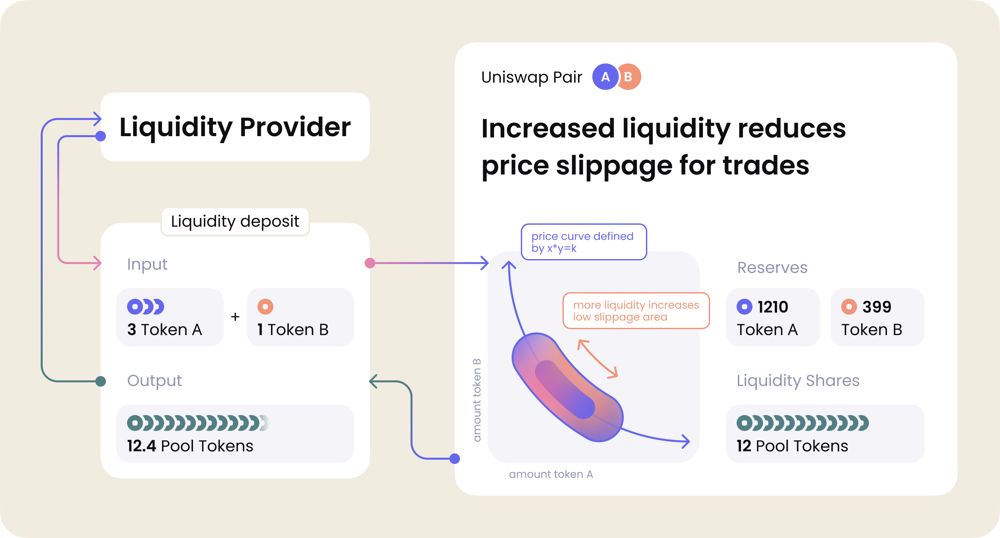
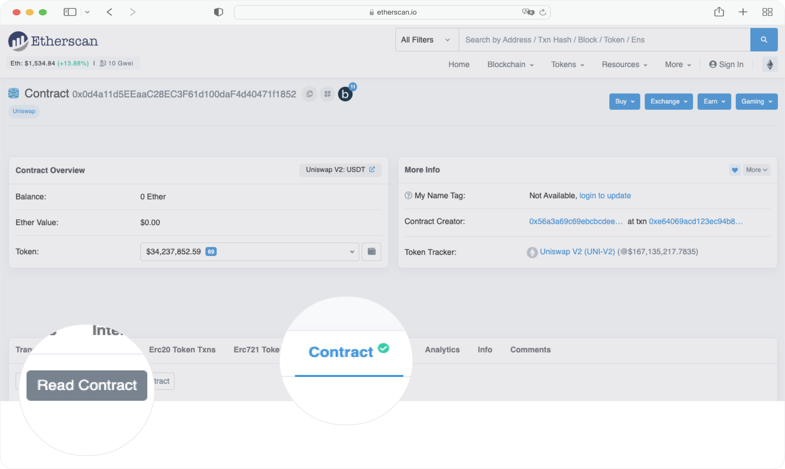
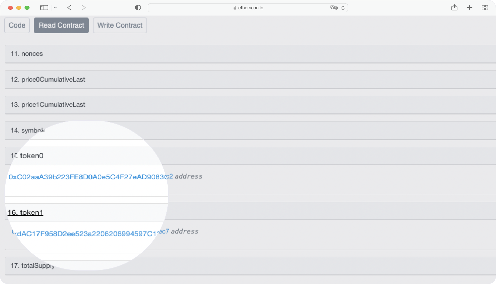
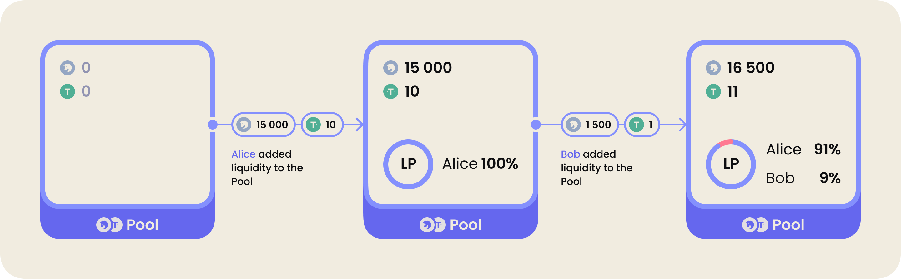
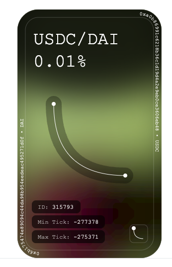
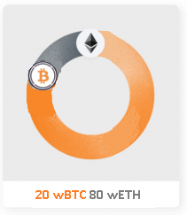

# Обзор DEX

## Uniswap V2

Uniswap - один из самых успешных протоколов AMM в мире DeFi. Это децентрализованный протокол обмена на Ethereum, который позволяет осуществлять прямые обмены токенов, не храня средства пользователя на обменнике. Использовать протокол максимально просто: нужно отправить свои токены из кошелька в смарт-контракт Uniswap. Взамен протокол вернет желаемые токены на кошелек напрямую из смарт-контракта.

Первая версия протокола была опубликована **Хайденом Адамсом** в ноябре 2018 года в качестве доказательства концепции AMM. В его основе лежат простота использования, эффективное расходование газа, устойчивость к цензуре и безопасность.

Несмотря на то, что первым концепцию AMM в Ethereum применил протокол **Bancor**, **Uniswap** один из первых DEX на базе AMM, который популяризировал формулу маркетмейкеров на основе постоянного значения произведения.

Протокол полезен как для трейдеров, так и для обычных пользователей. Для блокчейн-разработчика добавить обмены через Uniswap в свой контракт достаточно легко: он отлично интегрируется в другие смарт-контракты, которым требуется гарантированная on-chain ликвидность.

В Uniswap первой версии можно было обменивать ETH на ERC-20 токен и наоборот. Поговорим о второй версии протокола, в которую добавили возможность обменивать токены ERC-20 на другие токены ERC-20.

### Добавление ликвидности



Согласно схеме провайдер ликвидности добавляет **три токена A** и **один токен B**, а взамен получает **12.4 LP** токенов пула. Они отображают долю активов провайдера в пуле.

Дальше пара токенов работает по принципу АММ. Принимает один токен и отдает взамен другой согласно формуле постоянного произведения. Более того - раз мы создаем пару, то мы и задаем цену. То есть, соотношение, в котором мы вложим нашу пару токенов, будет базовым для следующих поставщиков ликвидности.

Очевидно, что ликвидная пара — это хранилище двух токенов. Или резервы токенов А и B. На основе этих резервов рассчитывается цена токенов.

_Важно!_ любой пользователь может создать пул ликвидности и задать первоначальную цену, чтобы зарабатывать процент с каждого обмена. За создание пула Uniswap не берет комиссию.

### Архитектура

Структура Uniswap V2 состоит из ядра и периферийных контрактов.

Uniswap сore [тут](https://github.com/Uniswap/v2-core).

```UniswapV2Pair.sol```. Это основной контракт ядра протокола. Этот контракт отвечает за работу ликвидной пары — хранит резервы двух токенов.

```UniswapV2Factory.sol```. Контракт фабрики регулирует создание и хранение ликвидных пар.

Uniswap periphery [тут](https://github.com/Uniswap/v2-periphery).

```UniswapV2Router01.sol``` и ```UniswapV2Router01.sol```. Это контракты, которые предназначены для взаимодействия пользователя с протоколом. При помощи этих контрактов можно добавлять и забирать ликвидность, делать обмены.

### Обмен токенов

**Что если я хочу менять токены для которых нет ликвидной пары?**. Для этого нужно использовать контракт `UniswapV2Router02.sol`. Он обеспечивает взаимодействие между всеми парами и может построить маршрут обмена.

Например, у нас есть DAI, который мы хотим обменять на LINK. Такой пары нет, но есть пары DAI → ETH и ETH → LINK. Таким образом протокол построит следующий маршрут обмена: DAI → ETH → LINK.

_Важно!_ Протокол фактически делает два обмена: кладет DAI в первую пару и берет из нее ETH, потом кладет его во вторую пару и берет уже LINK. На схеме это выглядит так.


**Но почему нужно использовать `Router02`, а не `Router01`**? Все дело в том, что у роутеров нет состояния и они не хранят балансы токенов. При необходимости их можно безопасно заменить на новую имплементацию. Например, если обнаружены ошибки или нужно добавить новую логику. Именно это и было сделано в Uniswap v2, когда в `Router01` обнаружились недочеты.

_Важно!_ Строить маршруты обмена — не единственная задача контракта роутер. Он также предоставляет методы для собственного обмена токенов, расчета некоторых значений при обмене, а также методы для добавления и удаления ликвидности.

### Добавление ликвидности

Каждый смарт-контракт ```UniswapV2Pair.sol``` управляет ликвидной парой из резервов двух токенов ERC20. **Поставщики ликвидности** добавляют ликвидность(создают рынок) путем добавления двух токенов. Количество токенов эквивалентно стоимости токенов на момент добавления. После этого токены автоматически блокируются на смарт-контракте. Это может быть пара токенов ERC-20 стандарта или пара ETH - ERC20.

> Например, у Алисы есть USDT и 2INCH. Она видит, что такого пула ликвидности еще нет, поэтому у нее есть возможность задать курс, по которому будут обмениваться эти токены.

> Она решает установить курс 1500 2INCH по цене 1 USDT. Для этого она создает пул, в который отправляет 15000 2INCH и 10 USDT. Да, Алиса как первая создательница пула имеет право самой определить соотношение токенов в пуле — то есть определить цену.

Теперь Алиса поставщик ликвидности. Ее средства заблокированы на смарт-контракте. Но как она докажет, что это ее средства, и как ей их вывести?

Для этого существуют LP — **liquidity pool tokens**. В Uniswap такие LP-токены носят название **UNI-V2**. Чтобы посмотреть, на какие два токена можно обменять LP, достаточно зайти в `etherscan → чтение контракта` и посмотреть адреса `token0` и `token1`.

Разберем на примере пары ETH → USDT.

(https://etherscan.io/address/0x0d4a11d5eeaac28ec3f61d100daf4d40471f1852#readContract).



Во вкладке Read Contract нажми на `token0` и `token1`. Ты увидишь адреса токенов пары.



Когда создается пул ликвидности, взамен чеканятся LP-токены, которые будут отражать долю поставщика ликвидности в данном пуле. Пока Алиса единственный поставщик ликвидности и у нее 100% LP-токенов. Такие токены еще называют shares. Теперь представим, что после Алисы подобную пару захотел создать я.

Но тут проблемка: нельзя создать точно такую же пару, теперь мне можно только добавить ликвидность в пару Алисы. Причем я должен сделать это по текущему курсу.

> Например, если я хочу добавить 1500 2INCH, тогда мне нужно предоставить 1 USDT. После этого у Алисы будет 91% LP-токенов, а у меня 9%.

_Важно!_ **LP-токены** всегда можно обменять обратно на резервы пула.



### Адаптер Uniswap V2

Адаптер - это контракт, который реализует взаимодействие с контрактами Uniswap V2. На его примере я покажу, как можно взаимодействовать с контрактами Uniswap V2.

В нем будут реализованы следующие возможности:
- добавление и удаление ликвидности
- обмен 2INCH на USDT

Код адаптера можно посмотреть [тут](./contracts/Adapter.sol).

## Uniswap V3

Uniswap v3 основан на тех же принципах AMM c формулой постоянного значения произведения, что и ранние версии, но предлагает несколько нововведений.

При этом, разработчики третьей версии обещают нам повышенную эффективность использования капитала, большую точность ценового оракула и более гибкую структуру комиссий.

### Концентрированная ликвидность

Когда LP предоставляет ликвидность пулу Uniswap v2, она равномерно распределяется по кривой цен. Это позволяет обрабатывать все диапазоны цен от нуля до бесконечности, однако делает капитал весьма неэффективным.

Проблема в том, что большинство активов торгуются в определённых диапазонах. Больше всего это заметно в пулах со стейблкоинами, у которых диапазон очень узкий.

По этой причине в паре типа DAI/USDC могло использоваться только 0.5% ликвидности от всего пула в диапазоне от \$0.99 до \$1.01. Это приводит к тому, что 99.5% капитала практически никогда не используются.

Представь, что ты добавляешь в пул ликвидности \$100. Для этого покупаешь 50 DAI за \$50 и 50 USDC тоже за \$50. Затем ты кладёшь их в пул DAI/USDC. Из них для обмена используются только \$0.5, а остальные \$95.5 просто лежат, хотя ты мог вложить их куда-то ещё, чтобы заработать.

Это крайне неэффективное использование капитала. Однако в Uniswap v3 поставщики ликвидности могут выбирать индивидуальный ценовой диапазон. Так капитал концентрируется в диапазонах, где происходит большая часть торговли.

В v3 созданы индивидуальные кривые цен для каждого поставщика ликвидности. Те диапазоны, которые накладываются друг на друга, создают комбинированную ликвидность. LP получают комиссии пропорционально их вкладу в заданном диапазоне.

Для лучшего понимания - пример.
1. Допустим, Алиса и Боб хотят добавить ликвидность в пул ETH/DAI на Uniswap v3. У каждого есть по \$10000, а текущая цена ETH = \$1750.
2. Алиса на весь свой капитал покупает ETH и DAI, а затем размещает во всём диапазоне аналогично пулам второй версии Uniswap. Получается, что она вложила 5000 DAI и 2.85 ETH.
3. Боб, вместо того, чтобы вложить весь свой капитал, решает сконцентрировать ликвидность в диапазоне от \$1500 до \$2500. Для это он вкладывает 600 DAI и 0.37 ETH, что в сумме составляет \$1200, а \$8800 у него остается.
4. В такой ситуации, пока цена будет колебаться в пределах от \$1500 до \$2500, и Алиса, и Боб будут получать одинаковые комиссии.
5. Боб, вложив лишь 12% от той суммы, что вложила Алиса, будет получать такой же доход, при этом подвергая риску меньшую часть своего капитала.


Важно отметить, что, пока трейдеры будут торговать в пределах этого диапазона, и Боб и Алиса будут получать доход с комиссий. Но, если цена выйдет за его пределы, доход получит только Алиса, а ликвидность Боба уже не будет участвовать в торговле.

Этот механизм мотивирует поставщиков ликвидности охватывать своими позициями весь ценовой диапазон. То есть в теории Боб может либо добавить ликвидность ещё в несколько диапазонов, чтобы получить больший охват, либо обновлять свой диапазон в зависимости от того, куда будет двигаться цена.

### Гибкие комиссии

В первых двух версиях Uniswap каждая пара токенов соответствует одному пулу ликвидности. Пул применяет единую комиссию в размере 0.3% ко всем обменам. Этот уровень комиссий исторически работал хорошо для большинства токенов. Однако он слишком высок для некоторых пулов. Например, пул стейблкоинов. И при этом он слишком низок для других пулов. Например, включающих очень волатильные или редко торгуемые токены.

Uniswap v3 предоставляет несколько пулов для каждой пары токенов. И каждый из таких пулов имеет свою комиссию за обмен. Все они создаются одним контрактом-фабрикой, который позволяет создавать пулы с тремя уровнями комиссий: 0.05%, 0.3% и 1%.

Если раньше мог быть только один пул для одной пары, к примеру, DAI/USDC, то сейчас таких пулов может быть три. В каждом из них будут разные значения комиссии. При этом предполагается, что вся основная ликвидность будет сосредоточена в том пуле, где уровень комиссии соответствуют риску активов.

_Интересный факт!_ Имея на руках токены UNI и «право голоса» в сообществе, можно вынести предложение по установке другого размера комиссии для определенного пула. Так было сделано [в этом предложении](https://app.uniswap.org/#/vote/2/9). Если оно не отображается, попробуй переключить сеть в Metamask на **Ethereum mainnet**.

Таким образом, три вида комиссий определяются риском пула ликвидности:

1. **Стабильные пары** — 0.05%. Для пар с низкими колебаниями и для стейблкоинов.
2. **Пары со средним риском** — 0.30%. Для популярных пар с высоким объёмом торгов.
3. **Пары с высоким риском** — 1%. Для экзотических пар.

Но это не все отличия, связанные с комиссиями. Если раньше доходы от комиссий автоматически инвестировались и выводились вместе со всей ликвидностью, то теперь они собираются и удерживаются пулом в виде отдельных токенов. Поставщик ликвидности может в любой момент забрать их себе.

### NFT вместо ERC-20

В первых версиях Uniswap поставщики ликвидности получали взаимозаменяемые токены LP за удерживание позиции. А держатели позиций Uniswap v3 при добавлении ликвидности получают NFT (ERC-721 токен). NFT содержит информацию о пуле ликвидности и доле поставщика в этом пуле.

Очевидно, что взаимозаменяемые токены ERC-20 не подойдут для отображения выбранного ценового диапазона каждым отдельным поставщиком.

Давай перейдём на [Etherscan](https://etherscan.io/token/0xC36442b4a4522E871399CD717aBDD847Ab11FE88#readProxyContract) и ознакомимся с NFT.

Для просмотра информации, содержащейся в токене, вызови метод чтения ```positions()```. Для вызова необходимо указать id токена, к примеру 315793. Каждый из NFT имеет несколько полей с данными. Самые важные из них:
- **token 1** — адрес одного из токенов в пуле
- **token 2** — адрес второго токена в пуле
- **fee** —  комиссия за свапы в этом пуле
- **tickLower** и **tickUpper** — минимальный и максимальный ценовые диапазоны, установленные поставщиком ликвидности
- **liquidity** — предоставленная ликвидность этой позиции

_Важно!_ Диапазон задан в тиках — это относительная величина, которая обновляется при каждом добавлении и удалении ликвидности. Условно, 1 тик равен изменению цены на 0.01%.

NFT также имеет и графическое представление:



На основании выбранного ценового диапазона ты можешь увидеть следующие параметры:
- в середине изображение кривой, которая представляет «наклон» выбранной позиции
- маленький значок кривой в правом нижнем углу. Показывает положение LP на кривой, где поставщик активен в пуле
- каждая позиция Uniswap v3 имеет уникальную цветовую схему, основанную на двух токенах, удерживаемых в пуле, поэтому разные пулы представлены разными цветовыми вариациями

Больше примеров NFT Uniswap v3 pool смотри на маркетплейсе [OpenSea](https://opensea.io/collection/uniswap-v3-positions).

Таким образом, у поставщика ликвидности появляется персональный идентификатор, по-которому он может добавлять и удалять ликвидность в данный пул, а также забирать вознаграждение, которое накопилось за счет комиссии при обмене токенов в пуле.

_Важно!_ Благодаря возможности добавлять концентрированную ликвидность, токены LP больше не являются взаимозаменяемыми, как это было в Uniswap v2.

## Curve

Одна из основных проблем с DEX, которые используют формулу AMM, как Uniswap — это комиссии и проскальзывание цены при обмене токенов. Это совершенно не подходит для торговли между стейблкоинами и активами, привязанными к одной и той же стоимости.

Нужно было сделать формулу AMM более подходящей для создания пулов со стабильными токенами, чтобы можно было использовать ее для торговли с низкими комиссиями и низким проскальзыванием. Первым это сделал [Curve Finance](https://Curve.fi). Его основная цель — упростить обмен активами близкой стоимости.

Это полезно в экосистеме DeFi, потому что есть много обёрнутых и синтетических токенов, которые стремятся имитировать цену базового актива.

**Синтетические токены?** Это финансовые инструменты. В народе, **синты**. Покупая их, ты участвуешь в ценовых движениях актива, на основе которого они созданы. При этом они не дают тебе ни права владения на базовый актив, ни гарантии его будущей поставки.

**Какой актив может быть синтом?** Практически любой: криптовалюта, токен, товар, акция, биржевой индекс или фиатная валюта.

_Важно!_ Curve Finance в настоящее время поддерживает стейблкоины в долларах США, Евро, обёрнутые/синтетические BTC (Bitcoin) и обёрнутые/синтетические ETH-активы.

### Как работает Curve?

На пике популярности, в январе 2022 года TVL **Curve** превышал \$24 млрд, а ежемесячный объём торгов составлял более \$6 млрд. Но даже после обвала криптовалютного рынка к середине 2022 года, Curve продолжает оставаться в пятерке лидирующих DeFi-сервисов с объёмом заблокированных средств свыше \$5,7 млрд.

Но вот что интересно: огромный объём ликвидности, предоставляемый **Curve**, позволяет множеству других DeFi-сервисов использовать его пулы в своих экосистемах.

Например, он интегрирован с агрегатором ликвидности **1inch**, а также с крупнейшими лендинговыми протоколами **Aave** и **Compound**.

Первоначальная идея этого протокола — объединить большое количество стейблокоинов, чтобы минимизировать проскальзывание и защитить поставщиков ликвидности от непостоянных потерь.

Когда этот протокол только появился на рынке, **Uniswap** был первой версии. Кроме высоких проскальзываний, была и другая проблема: LP обеспечивали не менее половины своей ликвидности в ETH. То есть в нестабильном активе, незащищённом от непостоянных потерь.

Также в первой версии токены торговались только через пул с ETH. То есть, если вы хотели обменять токен A на токен B, **Uniswap** совершал две сделки. Токен A обменять на ETH в одном пуле, а затем ETH обменять на токен B. Это приводило к удвоению торговых комиссий.

Чтобы повысить ликвидность токенов с низким уровнем объёма торгов, **Curve** представил концепцию **базовых пулов** и **метапулов**.

Наиболее ликвидным базовым пулом является **3pool**. Это пул стейблкоинов, состоящий из DAI, USDT и USDC. Соотношение трёх стейблкоинов в пуле зависит от спроса и предложения на рынке. Внесение монеты с меньшим коэффициентом принесёт пользователю более высокий процент от пула.

Также есть пулы ликвидности, где один токен торгуется в паре с базовым пулом. Их называют **метапулами**. К примеру, в пуле **ARTH/3pool**, обмен происходит между токеном ARTH и базовым пулом, состоящим из 3-х различных стейблкоинов.

За подробностями сходи в официальную [документацию](https://curve.readthedocs.io/).

### В чём главные преимущества Curve?

Когда **Curve** был запущен, он быстро рос, защищая слаборазвитый рынок стейблкоинов. Ранее децентрализованные биржи, имели высокие комиссии, что создавало проблемы для тех, кто пытался перейти от одного стейблкоина к другому.

В результате **Curve.fi** стал одним из лучших протоколов для обмена стейблкоинов из-за низких комиссий и низкого проскальзывания. К тому же протокол дал поставщикам ликвидности различные инструменты для заработка, что позволило концентрировать ещё больше ликвидности.

**Curve** — один из лучших протоколов не только для обмена стейблкоинов, но и для предоставления их в качестве ликвидности. Так как мы выяснили, что Curve оперирует понятием метапулов (то есть работает не с парами, а с большим числом независимых активов), то и добавлять ликвидность можно несколькими способами.

Вы можете предоставить только один из стейблкоинов в пул, но при этом теряя небольшую часть ликвидности. Или же выбрать другие стратегии. Например, предоставить активы в пул в равной пропорции.

Таким образом, **Curve** даёт гибкость в вопросе депозита ликвидности. Он позволяет распределять ваши средства по пулам без привязок к определенным парам, но теряя на проскальзывании. А проскальзывание необходимо для балансировки цены в пуле.

Подводя итоги, **Curve** — автоматизированная децентрализованная биржа, похожая на Uniswap, предназначенная для стейблкоинов. Его простой и стильный интерфейс в стиле 90-х прост в использовании и позволяет любому получать выгоду от сделок между стейблкоинами с низким проскальзыванием.

## Balancer

Ещё один протокол, который работает по принципу AMM — это [Balancer](https://balancer.fi/). Здесь формулу AMM вывели на новый уровень, сделав её ещё более настраиваемой.

У нас были пулы Uniswap, состоящие из равных частей всего двух активов. Затем Curve превзошел Uniswap, разрешив создание трипулов и снизив затраты, связанные с комиссиями и проскальзыванием.

💣 **Взвешенные пулы Balancer** сняли эти ограничения, позволив создавать пулы ликвидности, содержащие до восьми различных токенов. На Balancer взвешенные пулы на балансировщике могут состоять из любой пропорции восьми различных токенов.

Следовательно, пулы ликвидности на Balancer больше не ограничиваются только тремя активами и не связаны постоянной формулой продукта, заставляющей пулы поддерживать равный процент каждого актива.

_Важно!_ Благодаря тому, что все токены хранятся в одном месте, совершать обмены гораздо выгоднее с точки зрения оплаты за газ. Также есть и внутренние обмены, которые позволяют выполнять свопы вообще без транзакций.

### Как Balancer связан с индексными фондами?

Протокол Balancer можно сравнить со взвешенным [индексным фондом](https://academy.binance.com/en/articles/what-is-a-crypto-index-fund) в традиционных финансах.

_Важно!_ Индексные фонды — это инвестиционные стратегии, которые сосредоточены на владении определёнными остатками различных активов.

Например, известный [S&P 500](https://www.marketwatch.com/investing/index/spx) — это индекс, который отслеживает 500 крупнейших компаний на фондовом рынке. Владение долей индексного фонда S&P 500 означает, что стоимость вашей акции отражает состав всего индекса. Когда акции добавляются или удаляются из S&P 500, ваш индексный фонд перебалансируется в соответствии с изменением.

Пулы **Balancer** функционируют, как взвешенные индексные фонды для экосистемы DeFi. Они могут поддерживать портфели до восьми различных токенов ERC-20.

В традиционном индексном фонде распределение активов производится в ручном режиме. Так получают сбалансированный портфель. Balancer же использует автоматическую перебалансировку активов в пулах каждый раз, когда совершается сделка. Это тысячи раз в день.

Этот процесс помогает обеспечить активный рынок с торговыми возможностями, что приносит пользу как поставщикам ликвидности, так и трейдерам.

Вместо того, чтобы платить сборы управляющему фондом, сборы за торговлю выплачиваются непосредственно поставщикам ликвидности, которые также еженедельно получают многоцелевые токены Balancer — **BAL**. Эти токены отражают долю собственности на платформе и предоставляют право голоса в решениях по управлению сообществом.

> Допустим, пул Balancer настроен на сохранение 80% своего значения в [wETH](https://www.gemini.com/cryptopedia/wrapped-bitcoin-vs-bitcoin-wbtc-tbtc-wnxm-hbtc-crypto#section-wrapped-ether-w-eth) и 20% своего значения в [wBTC](https://www.gemini.com/cryptopedia/wbtc-what-is-wrapped-bitcoin). Если произойдет проскальзывание, протокол скорректирует цены токенов для поддержания соотношения 80/20.



> Когда трейдер хочет купить wBTC за wETH, протокол алгоритмически сканирует свои пулы ликвидности по лучшей цене. По замыслу, пулы с лучшими ценами wBTC за wETH также будут пулами, которые больше всего нужно перебалансировать. Пул ликвидности и торговая платформа заперты в вечном алгоритмическом танце равновесия.🕺

### Важные особенности Balancer

На Balancer существует множество различных пулов ликвидности:

1. **Взвешенные пулы**. Предназначены для общих случаев и не обязательно имеют ценовую корреляцию. Например, DAI/WETH. Цена определяется балансом пула, его весом и количеством обмениваемых токенов.
2. **Стабильные пулы**. Подходят для токенов с мягкой привязкой и сильной корреляцией.Например, DAI/USDT/USDC. В таких пулах можно совершать значительно более крупные сделки до столкновения с существенным изменением цены. Они используют стабильную математику. В них более низкий спред, то есть разность между лучшими ценами заявок на продажу и на покупку. Токены из этих пулов часто используется для арбитража, когда один токен сочетается двумя разными токенами в разных пулах.
3. **Масштабируемые пулы**. Они подходят для токенов без привязки, которые сохраняют корреляцию, но могут медленно расходится со временем. Например, stETH/WETH.
4. **Управляемые пулы** — это пулы для управления динамичным фондом. Их особенности — это смещение веса для ребалансировки, приостановка обмена и платы за управление.

Наиболее важной особенностью протокола **Balancer** является его набор алгоритмов, которые управляют и стимулируют взаимодействие между поставщиками ликвидности, пулами ликвидности и трейдерами в соответствии с двумя целями: ребалансировка пулов и поиск лучшей цены.

Токены **Balancer** доступны для покупки на биржах и они еженедельно распределяются среди поставщиков ликвидности. Чем больше ликвидности ты предоставишь пулу **Balancer**, тем больше токенов **Balancer** ты заработаешь.

## Bancor

[Bancor](https://bancor.network/) утверждает, что является единственной децентрализованной платформой для ставок, которая позволяет получать пассивный доход через предоставление ликвидности.

### Односторонняя ликвидность

По сути, **Bancor** — это децентрализованный обменник, где пользователи могут обменивать один актив на другой. Разница заключается в концепции односторонней ликвидности.

_Важно!_ В большинстве DEX нет возможности внести только один актив. Обычно добавление ликвидности в пул требует наличие всех активов пула.

**Bancor** устраняет эту проблему, предлагая **одностороннюю ликвидность**. Можно просто внести только ETH, а **Bancor** сминтит токен BNT. Это токен платформы, который будет использован в качестве второго актива. Тем самым он заполнит вторую половину пула.

> Например, если вы вносите 100 ETH, а цена BNT — 2 ETH, то при внесении в пул 100 ETH протокол отчеканит 50 BNT. В таком случае пул будет состоять из 50% ETH и 50% BNT, но у вас доступ будет только к ETH.

В таком сценарии инфляция токена BNT должна стремительно расти. Но, чтобы этого не происходило, при выводе средств из пула BNT сжигаются, как будто их никогда и не было. Поэтому данный механизм прекрасно работает. Более того, комиссии за обмены тоже начисляются в BNT, и они также сжигаются при выводе вознаграждения.

### Страхование от непостоянных потерь

Токены BNT также используются в качестве промежуточного актива при торговле. Это означает, что при обмене, например, ETH на USDT, маршрут будет таким: ETH → BNT → USDT. При этом комиссия спишется на обоих этапах: одна половина достанется поставщикам ликвидности, а другая останется протоколу **Bancor**.

Здесь мы подходим ко второй очень важной составляющей протокола — **страхование от непостоянных потерь**.

_Важно!_ Страхование от непостоянных потерь выгодно отличает **Bancor** от других DEX.

Половина комиссий с обмена токенов остается протоколу. Помимо этого, **Bancor** забирает и часть доходов, полученных поставщиками ликвидности в размере 15%. Эти средства направляются в **страховой фонд**, который сможет покрыть убытки, если цена актива просядет относительно той, по которой актив добавлялся в пул ликвидности.

Даже в случае сильной просадки, если не хватит средств из страхового фонда, их выплатят в BNT токене. Воспринимай это как страхование автомобиля: если после ДТП авто нельзя восстановить, то вам выплатят деньги на покупку нового авто.

**Bancor** позиционирует себя как платформа, на которой можно безопасно получать пассивный доход вместо того, чтобы просто держать средства на своем кошельке. При этом он ещё и защищает их от просадок в цене.

Правда, чтобы получить полную защиту, то есть получить ту же сумму, которая была внесена при выводе средств, необходимо заблокировать свои средства на платформе не менее, чем на 100 дней.

**Но как Bancor гарантирует, что поставщики ликвидности могут получить правильную цену за токены, которые они заблокировали на платформе?** Bancor V2 утверждает, что решает эту проблему с помощью ценового оракула. Используя оракул, пулы **Bancor** автоматически корректируют долю токенов по отношению к их ценам. Это позволяет поставщику ликвидности вывести ту же стоимость токенов, которую он депонировал.

## Wombat Exchange

[Wombat Exchange](https://www.wombat.exchange/) — это молодой и амбициозный AMM DEX протокол, запущенный в сети Binance Smart Chain. Он, как и Curve, специализируется на стабильных активах и объединяет в себе достоинства других протоколов.

### Общий пул ликвидности

Традиционные DEX имеют изолированные пулы ликвидности. Резервы пулов хранятся отдельно друг от друга. Чтобы предоставить ликвидность токена в несколько пулов, нужно отправить токен на два разных смарт-контракта. Это разделение снижает общий потенциал использования капитала, так как каждая часть капитала будет использоваться лишь в одном из пулов.

Например, банки работают по-другому. У них нет отдельных резервов для каждой торговой валютной пары. Они просто сохраняют резервы всей валюты и свободно производят обмен между любыми валютами.

**Wombat Exchange** перенял стратегию банков и реализовал **общий пул ликвидности**.

Пользователи протокола предоставляют одностороннюю ликвидность в один общий пул. Благодаря этому они могут получать более высокие вознаграждения. Трейдеры же обмениваются между любым стейблкоином без необходимости взаимодействовать с несколькими пулами.

В действительности, это один большой пул ликвидности с кучей активов. За счёт этого снижается ценовое влияние при обмене больших объёмов активов, а также уменьшается проскальзывание.

В настоящее время большинство транзакций со стейблкоинами в цепочке BSC осуществляются на **PancakeSwap**. Сравним проскальзывание транзакций между **Wombat Exchange** и **PancakeSwap** в торговой паре USDT/USDC. Для примера возьмем 10 тыс и 100 тыс.

При 10 тыс проскальзывание PancakeSwap составляет 10 USDC, тогда как проскальзывание на **Wombat Exchange** всего 1,6 USDC.

Если возьмем 100 тыс, на **PancakeSwap** проскальзывание будет доходить до 414 USDC, а на **Wombat Exchange** — 15,7 USDC.

### Какую проблему решил Wombat?

Применение **общего пула ликвидности** положительно влияет на масштабируемость протокола.

Новые стейблкоины или обычные токены имеют низкую ликвидность в в традиционных ликвидных парах. А могут и не иметь ликвидных пар вовсе.

**Общий пул** решает эту проблему. Предоставление односторонней ликвидности в общем пуле позволяет повысить ликвидность новым стейблкоинам и масштабироваться.

Для предотвращения проблем, которые могут произойти с токенами, а тем более со стейблкоинами, основной пул содержит в себе лишь самые ликвидные и проверенные стейблкоины: USDC, USDT и BUSD. А также самый удачный на данный момент децентрализованный стейблкоин со сверхобеспечением — DAI.

Все остальные стейблкоины могут быть включены в **side пул**, который содержит низколиквидные и потенциально рисковые токены. Поэтому при какой-либо угрозе стейблкоину из **side пула**, его использование будет остановлено. Доступен будет только вывод активов из пула. Таким образом основной пул с наибольшей ликвидностью не пострадает.

## Вывод

На этом все! Я рассказал про самые популярные DEX, работа которых основана на AMM. Все они имеют ряд особенностей и отличий, но при этом их объединяют похожие цели: дать возможность поставщикам ликвидности заработать, а пользователям обменивать токены максимально эффективно.

С каждым днём количество различных протоколов только увеличивается, а существующие постоянно обновляются. Разрабатываются новые концепции и инструменты для улучшения торговли, увеличения безопасности, снижения комиссий и рисков. Сфера DeFi растёт очень быстро, поэтому необходимо успевать следить за её развитием!