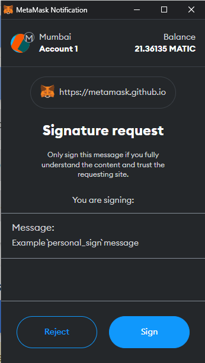
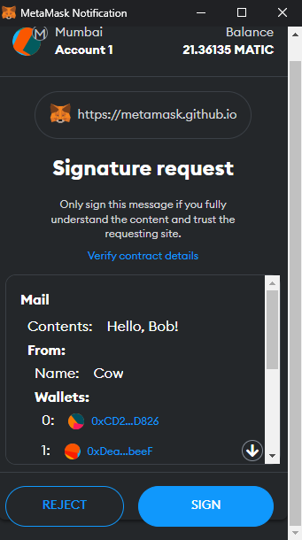

# Digital Signatures on ethereum

**Криптографические цифровые подписи** являются ключевой частью блокчейна. Они используются для подтверждения права собственности на адрес без раскрытия его закрытого ключа. Это в основном используется для **подписи транзакций**, но также может использоваться для **подписи произвольных сообщений**. Это в свою очередь открывает различные вариации для использования в своих DApp.

В [Ethereum документации](https://ethereum.org/en/glossary/#digital-signatures) дано следующее определение цифровой подписи:
> **Цифровая подпись** - короткая строка данных, которую пользователь создает для документа с использованием закрытого ключа. Любой у кого есть соответствующий открытый ключ, подпись и документ, может проверить:
> 1. Документ был «подписан» владельцем этого закрытого ключа.
> 2. Документ не был изменен после того, как он был подписан.

Подпись можно использовать для:
1. Доказательства наличия у вас приватного ключа для некоего публичного адреса (аутентификация)
2. Убедиться, что сообщение (например, письмо из электронной почты) не было подделано

Подпись основана на математических формулах. Например для подтверждения письма из электронной почты мы берем само сообщение письма, закрытый ключ, рандомное значение(дальше будем называть его **secret**) и прогоняем все это через математический алгоритм. На выходе получаем **цифровую подпись**. После этого можно использовать другую математическую формулу. Она позволит интерпретировать цифровую подпись так, чтобы проверить закрытый ключ и случайный **secret** не раскрывая их.

Существует множество криптографических алгоритмов. Например [RSA](https://ru.wikipedia.org/wiki/RSA) и [AES](https://en.wikipedia.org/wiki/Advanced_Encryption_Standard).

Сети ethereum и биткойн использует алгоритм цифровой подписи на эллиптических кривых. Он называется [**ECDSA**(Elliptic Curve Digital Signature Algorithm)ы](https://ru.wikipedia.org/wiki/ECDSA)

_Важно!_ ECDSA - это только алгоритм для цифровой подписи. В отличие от RSA и AES, его нельзя использовать для шифрования.

## Sign message and verify using ECDSA

Подписи ECDSA состоят из двух чисел (целых): **r** и **s**. Ethereum также использует дополнительную **v** переменную (идентификатор восстановления). Такая подпись может быть обозначена как **{r, s, v}**.

Чтобы создать подпись, нужно подписать сообщение закрытым ключом. Алгоритм выглядит следующим образом:
1. Вычисляется хеш сообщения. В Ethereum хэш сообщения обычно вычисляется с помощью ```Keccak256```. В начало сообщения всегда добавляется ```\x19Ethereum Signed Message:\n32"```. Это гарантирует, что подпись не может быть использована за пределами Ethereum.
    ```solidity
    Keccak256("\x19Ethereum Signed Message:\n32" + Keccak256(message))
    ```
2. Создается случайный **secret**
3. Вычисляется точка (x, y) на эллиптической кривой. Помним, что алгоритм ECDSA - это история про эллептические кривые.
4. Рассчитывается **r** и **s** по специальным формулам на основе точки (x, y) на эллиптической кривой. Погружаться в расчеты не будем, здесь нужны глубокие знания в математике. Если **r** или **s** равны нулю, то возвращаемся на шаг 2.

_Важно!_ Так как в получение подписи мы используем случайный **secret**, подпись всегда будет разная. Когда **secret** не secret(не случайный или публично известный), появляется воможность вычислить закрытый ключ на основе двух разных подписей. Однако существует стандарт [детерминированных подписей DSA](https://www.rfc-editor.org/rfc/rfc6979). Согласно стандарту можно подобрать безопасный secret и использовать его для подписи всех сообщений.

## Идентификатор восстановления ({v})

**V** является последним байтом подписи и имеет значение 27( 0x1b) или 28( 0x1c). Этот идентификатор очень важен. Чтобы понять важность, посмотри на график эллептической кривой.


Для одного и того же значения **r** можно вычислить два значения **s**. В результате получится два разных открытых ключа (то есть, адреса), которые можно восстановить. Получается **v** указывает, какую из этих точек использовать.

## Sign message vs sign transaction

До этого мы говорили только про подпись сообщений. Для подписи сообщения мы вычисляем хеш сообщения и при помощи приватного ключа вычисляем цифровую подпись.

Для подписи транзакций все немного сложнее. Транзакции кодируются при помощи [RLP](https://ethereum.org/en/developers/docs/data-structures-and-encoding/rlp/). Кодирование включает в себя все параметры транзакции(nonce, gas price, gas limit, to, value, data) и подпись(v, r, s)

Мы можем закодировать подписанную транзакцию следующим образом:

1. Кодировать параметры транзакции:
    ```solidity
    RLP(nonce, gasPrice, gasLimit, to, value, data, chainId, 0, 0).
    ```
2. Получите хэш **Keccak256** неподписанной транзакции в кодировке RLP.
3. Подпишите хэш закрытым ключом, используя алгоритм ECDSA.
4. Кодировать подписанную транзакцию.
   ```solidity
   RLP(nonce, gasPrice, gasLimit, to, value, data, v, r, s).
   ```
Расшифровав данные транзакции, закодированные с помощью RLP, можно снова получить необработанные параметры транзакции и подпись.

_Важно!_ Это используется внутри сети Ethereum для проверки транзакций.

## Как c подписью работают кошельки?

Подпись **{r, s, v}** объединяется в одну последовательность байт. Длина последовательности равна 65 байтам:
- 32 байта для **r**
- 32 байта для **s**
- 1 байт для **v**.

Если мы закодируем это как шестнадцатеричную строку, мы получим строку длиной 130 символов(не считая 0x в начале). В таком виде подпись используется большинством кошельков и интерфейсов. Например, полная подпись может выглядить так:

```solidity
sig: 0x0f1928d8f26b2d9260929425bdc6ac922f7d787fd73b42afe2548776a0e858016f52826d8ab67e1c84e6e6778fa4769d8aa4f014bf76b3280be77e4e0c447f9b1c
r: 0x0f1928d8f26b2d9260929425bdc6ac922f7d787fd73b42afe2548776a0e85801
s: 0x6f52826d8ab67e1c84e6e6778fa4769d8aa4f014bf76b3280be77e4e0c447f9b
v: 1c(в hex) или 28(в decimal)
```

## Стандартизация по работе с подписями

### Personal_sign

Personal_sign это общее названия для процесса подписания сообщения, который мы описали выше. Повторим алгоритм в общих чертах. Сообщение обычно предварительно хешируется, поэтому его длина может составлять фиксированные 32 байта:

```solidity
"\x19Ethereum Signed Message:\n32" + Keccak256(message)
```

Затем этот хеш подписывается. Это прекрасно работает для подтверждения права собственности на что-то.

Однако если пользователь **A** подписывает сообщение и отправляет его контракту **X**, пользователь **B** может скопировать это подписанное сообщение и отправить его контракту **Y**. Это называется [повторной атакой](https://en.wikipedia.org/wiki/Replay_attack).

Если интересно, что было до появления ```personal_sign```, можно почитать [эту статью.](https://medium.com/metamask/the-new-secure-way-to-sign-data-in-your-browser-6af9dd2a1527)

### EIP-191: Signed Data Standard

Этот стандарт является очень простым предложением, призванным решить проблему повторной атаки. Он определяет номер версии и данные, относящиеся к версии. Формат выглядит так:

```solidity
0x19 <1 byte version> <version specific data> <data to sign>
```

**0x19** в начале предназначено для гарантии того, что подписанные данные никтогда не смогут распознаться по схеме RLP. Это значит, что подписанные таким образом данные никогда не смогут быть транзакцией.

Затем идет 1 байт для версии. На данный момент существует три версии стандарта:
|Версия | EIP |Описание|
|-------|-----|--------|
|0x00   |191  |Адрес валидатора. Данные для подписи могут быть любыми и только валидатор знает как с этим работать|
|0x01   | 712 |Данные структурированы|
|0x45   |191  |personal_sign|

Подробнее можно посмотреть стандарт [тут](https://eips.ethereum.org/EIPS/eip-191).

### EIP-712: Ethereum typed structured data hashing and signing

Это стандарт для типизации подписываемых данных. Это позволяет сделать данные подписи более проверяемыми, представляя их в удобочитаемом виде.

EIP-712 определяет новый метод. Он пришел на замену personal_sign и назывался eth_signTypedData(последняя версия eth_signTypedData_v4). Для этого метода мы должны указать все свойства (например, to, amount и nonce) с их соответствующими типами (например, address, uint256 и uint256). На скриншотах ниже мы можем видеть разницу в подписываемых данных.


*// Пример personal-sign в кошельке Metamask*


*// Пример signTypedData в кошельке Metamask*

Metamask приготовил хорошое [demo](https://metamask.github.io/test-dapp/). Тут можно поэксперементировать и посмотреть разницу между подписями.

Дополнительно, согласно стандарту, необходимо указать базовую информацию о приложении, называемую **domain**.

**Domain** содержит следующую ​​информацию:
1. ```string name``` Имя приложения или протокола
2. ```string version``` Версия используемой подписи. Данные подписи можно менять и версионировать.
3. ```uint256 chainId``` Идентификатор сети.
4. ```address verifyingContract``` Адрес контракта, который будет верефицировать подпись
5. ```bytes32 salt``` Дополнительное поле соль. Можно использовать для разграничения domain.

Добавление **domain** решает проблему потенциальной повторной атаки.

## Проверка подписей на контракте

В Solidity есть встроенная функция под названием ```ecrecover()```. На самом деле она является предварительно скомпилированным контрактом по адресу **0x1**. Использование этой функции помогает восстановить публичный адрес закрытого ключа, которым было подписано сообщение.

## Examples

### Проверка на стороне контрактов

1. [Простой пример](./examples/src/SignatureVerifier.sol) проверки подписи сообщения на контракте. На базе Foundry
2. [Пример работы с подписью по стандарту EIP-712](./examples/src/EIP712.sol). С использованием библиотеки ECDSA от OpenZeppelin на базе Foundry
3. [Creating and verifying signatures.](https://docs.soliditylang.org/en/v0.8.19/solidity-by-example.html#creating-and-verifying-signatures) Solidity docs
4. [Пример Solidity by Example](https://solidity-by-example.org/signature/)

### Примеры из реальной жизни
1. [ERC-2612: Permit Extension for EIP-20 Signed Approvals.](https://eips.ethereum.org/EIPS/eip-2612). Этот стандарт на базе EIP-712. [Хорошая статья](https://soliditydeveloper.com/erc20-permit), котрая дает пояснение к стандарту.
2. [UniswapV2ERC20.sol](https://github.com/Uniswap/v2-core/blob/master/contracts/UniswapV2ERC20.sol#L81) контракт расширяет контракт ```UniswapV2Pair.sol``` и позволяет работать с подписями в своих контрактах перефирии. На контракте [UniswapV2Router01.sol](https://github.com/Uniswap/v2-periphery/blob/master/contracts/UniswapV2Router01.sol#L137) можно вызывать функцию ```removeLiquidityWithPermit()```.
3. [Permit2 от Uniswap](https://uniswap.org/blog/permit2-and-universal-router). Код можно найти [тут](https://github.com/Uniswap/permit2). Идея в том, чтобы permit был доступен для токена ERC-20 не зависимо от того, поддерживает ли токен ERC-2612.
4. Open GSN использует проверку подписи в своем контракте [Forwarder.sol](https://github.com/opengsn/gsn/blob/master/packages/contracts/src/forwarder/Forwarder.sol#L151)

### Генерация подписи снаружи

1. Ethers js. [Sign message](https://github.com/t4sk/hello-erc20-permit/blob/main/test/verify-signature.js)
2. Metamask. [Signing data](https://docs.metamask.io/guide/signing-data.html)
3. Open Ethereum. [API](https://openethereum.github.io/JSONRPC-personal-module#personal_sign)
4. [Пример](https://eips.ethereum.org/assets/eip-712/Example.js) из EIP-712

## Links

Две первые статьи крутые. Простым языком они объяснят базовые понятия криптографических подписей.

1. [The Magic of Digital Signatures on Ethereum](https://medium.com/mycrypto/the-magic-of-digital-signatures-on-ethereum-98fe184dc9c7)
2. [Intro to Cryptography and Signatures in Ethereum](https://medium.com/immunefi/intro-to-cryptography-and-signatures-in-ethereum-2025b6a4a33d)
3. [EIP-191](https://eips.ethereum.org/EIPS/eip-191)
4. [EIP-712](https://eips.ethereum.org/EIPS/eip-712)
5. [Контракт ECDSA](https://docs.openzeppelin.com/contracts/4.x/api/utils#ECDSA) для верификации подписей
6. [Математические и криптографические функции.](https://docs.soliditylang.org/en/v0.8.19/units-and-global-variables.html#mathematical-and-cryptographic-functions) Solidity docs. Можно посмотреть описание ```ecrecover()```, ```keccak256()``` и т.д.
7. [Testing EIP-712 Signatures](https://book.getfoundry.sh/tutorials/testing-eip712)