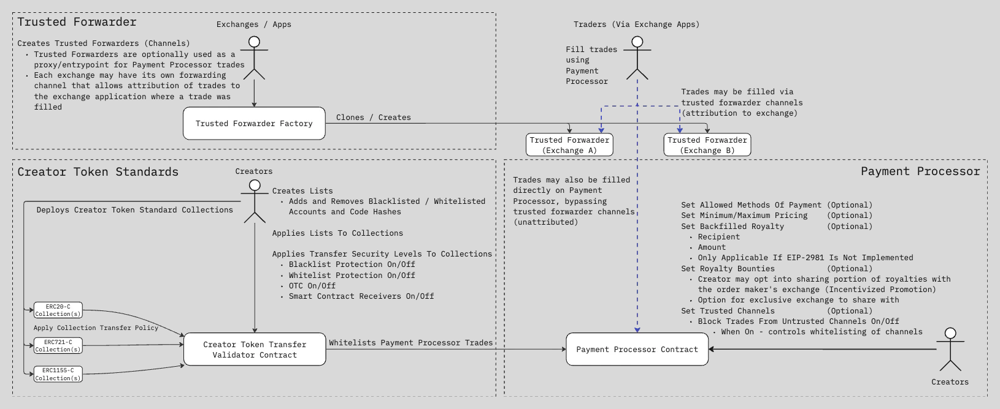
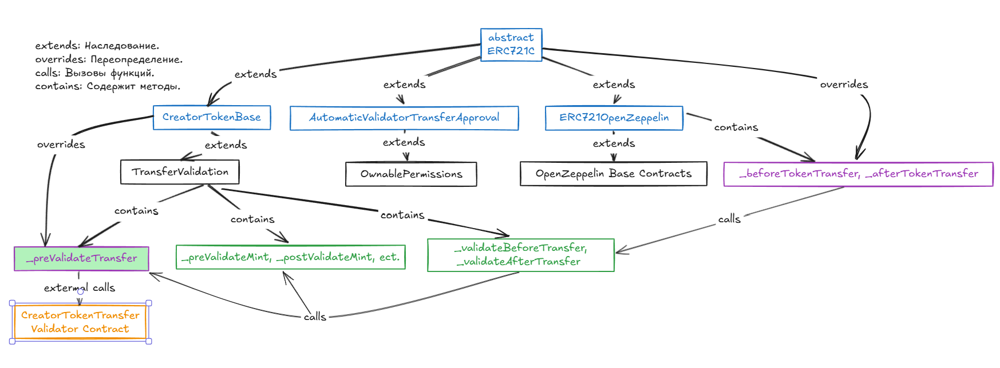
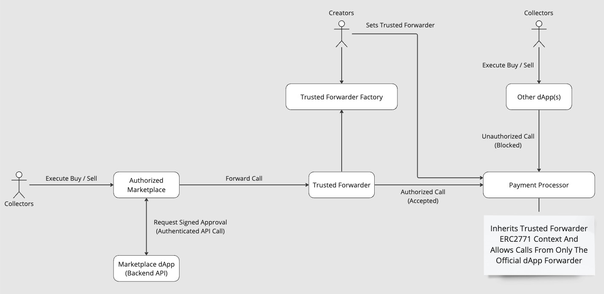

# ERC721C: Новый подход к выплате роялти

**Автор:** [Алексей Куценко](https://github.com/bimkon144) 👨‍💻

## Введение

[Limit Break](https://limitbreak.com/), студия разработки игр с моделью free-to-play, представила концепцию Creator Tokens в январе 2021 года. Версия 1.1 контракта ERC721C, которая внедрила многие идеи Creator Tokens, стала доступна в мае 2023 года.

[ERC721C](https://github.com/limitbreakinc/creator-token-standards/blob/main/src/erc721c/ERC721C.sol) — это экспериментальный подход к созданию новых возможностей для работы с NFT, направленный на решение проблемы выплаты роялти авторам NFT. Несмотря на то, что этот стандарт ещё не включён в реестр Ethereum Improvement Proposals (EIPs), он предлагает механизмы для усиления защиты интересов создателей цифрового контента. Будет ли в будущем подаваться в EIPs или пойдут по пути [ERC721A](https://www.erc721a.org/) остается вопросом.

ERC721C предлагает перенести механизм обязательных роялти в отдельный контракт `paymentProcessor`, через который будет совершаться торговля токенами. Достигается это за счёт [transfer restrictions](https://apptokens.com/docs/integration-guide/creator-token-standards/v4/for-creators/transfer-security#transfer-security-levels) уровней которые помогают ограничивать контракты для взаимодействия с токенами через хуки `_beforeTokenTransfer` и `_afterTokenTransfer`. Создатели цифрового контента в виде токенов смогут настраивать `transfer restrictions` уровни.

## Нужен ли стандарт ERC721C?

Несмотря на инновационность ERC721C, возникает логичный вопрос: почему существует необходимость в новом стандарте?

Одна из ключевых проблем с роялти, что в стандартах токенов, таких как [ERC721](https://eips.ethereum.org/EIPS/eip-721) и [ERC1155](https://eips.ethereum.org/EIPS/eip-1155) вообще отсутствует механизм роялти. В следствие чего маркетплейсы и реализуют роялти удобными себе способами, что не гарантирует совместимость роялти между маркетплейсами и обязательность выплат. Это приводит к тому, что создатели контента не получают справедливого вознаграждения за перепродажу их произведений на вторичном рынке.  Есть известный стандарт [ERC-2981](https://eips.ethereum.org/EIPS/eip-2981) о роялти, но он всего лишь описывает как передавать информацию о роялти, но не обеспечивать обязательность его выплаты. Сами выплаты, как и использование этого стандарта опять таки на усмотрение маркетплейсов.

В случае ERC721C мы видим, что команда Limit Break создала новый стандарт, чтобы внедрить более строгий контроль роялти, что вызывает вопрос о децентрализации данного подхода.

Основные причины, по которым появился этот стандарт:

- Ограничение обхода роялти: Маркетплейсы могут вообще не поддерживать роялти, иметь поддержку ERC-2981, либо опциональную выплату роялти, по желанию продавца.
- Монетизация коллекций: Новый стандарт выгоден создателям игр и коллекционных NFT, поскольку позволяет сохранить дополнительный доход от перепродаж.
- Защита экосистемы бренда: Контроль позволяет блокировать нежелательные действия (например, продажу на ненадежных площадках).

Однако, несмотря на эти плюсы, следует выделить возможные минусы:

- Поддержка маркетплейсов: не все маркетплейсы поддерживают данный тип токена, таким образом создателю цифрового контента нужно давать доступ для операций выборочно с конкретным указанием маркетплейсов.
- Риски для пользователей: строгий контроль может отпугнуть децентрализованное сообщество, ведь пользователи ценят свободу передачи токенов. Вам же не хочется чтобы создатель NFT мог в любом момент поменять правила трансфера вашего токена и сделать его вообще не продаваемым и не передаваемым ни через один маркетплейс?
- Обязательность выплаты роялти: Многие пользователи хотят опционально выплачивать роялти, а некоторые и вовсе не желают платить дополнительные комиссии.Это может быть как сильной стороной для создателей, так и слабой с точки зрения пользователей.

## Архитектура и модули ERC721C

Creator Advanced Protection Suite (CAPS) — это набор open-source смарт-контрактов, разработанный для предоставления создателям цифрового контента полного контроля над их цифровыми активами и взаимодействиями в экосистеме Web3. CAPS включает три независимых, но взаимодополняющих продукта: [Creator Token Standards](https://github.com/limitbreakinc/creator-token-standards), [Payment Processor](https://github.com/limitbreakinc/payment-processor-v2) и [Trusted Forwarder](https://github.com/limitbreakinc/TrustedForwarder). Эти модули работают вместе, чтобы обеспечить защиту токенов, контроль над торговыми процессами.

С CAPS создатели могут:

- Гарантировать соблюдение роялти за использование.
- Настроить и изолировать свою экосистему на любом совместимом с EVM блокчейне.
- Отслеживать, какие приложения и платформы участвуют в сделках, и устанавливать ограничения, чтобы защитить свои активы от нежелательных действий или взаимодействий.
- Каждый из продуктов CAPS может использоваться отдельно, однако их совместное применение позволяет выстроить надёжную многоуровневую защиту для ваших активов.

Пример использования:

- Создатель токена хочет защитить коллекцию NFT от перепродажи на маркетплейсах, которые не поддерживают роялти, и не позволять передачу токенов на контракты-обёртки, которые используются для обхода роялти. При этом важно, чтобы пользователи могли свободно передавать NFT напрямую друг другу, например, как подарок или обмен.
- Возможно полностью заблокировать передачу NFT напрямую между пользователями (P2P) для предотвращения обхода маркетплейсов и выплаты роялти. Пользователи смогут продавать токены только через проверенные маркетплейсы из whitelist, что исключает возможность обхода через прямой обмен или передачу токена без оплаты комиссии.

На схеме ниже показана архитектура CAPS и взаимосвязь между её модулями.



Кратко поясним за что каждый ответственный:

**Trusted Forwarder**: Является по сути "прокси" контрактом для взаимодействия с `paymentProcessor`. Через данный контракт, например, маркетплейсы могут выполнять продажи коллекций от своего имени с возможностью получения роялти от создателей цифрового контента, защищая коллекции от обхода правил роялти. Например, мы хотим чтобы только чтобы определенный маркетплейс мог торговать нашими токенами, взамен, мы обещаем ему роялти за при продаже токенов через `trusted Forwarder` контракт.

**Creator Token Standards**: Управляет безопасностью передач токенов через хуки `_beforeTokenTransfer` и `_afterTokenTransfer` на контракте коллекции и валидатор `CreatorTokenTransfer`. Позволяет задавать ограничения (черные/белые списки, блокировка P2P) и контролировать, какие платформы могут взаимодействовать с токенами.

**Payment Processor**: Обеспечивает соблюдение роялти при сделках, поддерживает белые списки маркетплейсов, минимальные/максимальные цены и гибкость методов оплаты. Управляет распределением платежей между создателями и маркетплейсами. Т.е например, создатель коллекции, может добавить роялти к своему токену, если у него отсутствует поддержка erc2981, настроить минимальную/максимальную цену продажи токенов, выбрать токены для оплаты за его коллекцию.

_Следует отметить, что вышеуказанные модули с контрактами, кроме erc721C токена, деплоятся один раз разработчиком LimitBreak либо самим юзером, если отсутствуют в требуемой сети. Для самостоятельного деплоя отсутствующих контрактов а также удобного управления коллекцией можно использовать [данный](https://developers.apptokens.com/infrastructure) интерфейс._

_На момент написания статьи, появился новый модуль [TokenMaster](https://apptokens.com/docs/integration-guide/token-master/overview)_.

### Creator Token Standards: Настройка transfer restrictions

Creator Token Standards предоставляет создателям возможность задавать правила работы функции передачи (transfer function) для токенов стандартов ERC20, ERC721 и ERC1155.

Ключевые возможности:

1. Контроль функции передачи (Transfer Function):

    - Создатели могут устанавливать правила, которые блокируют или разрешают определённые протоколы, использующие функции передачи токенов.
    - Применение этих правил подходит для множества сценариев, таких как торговля, игровые платформы или пользовательские кейсы с передачей токенов.

2. Работа с хуками трансфера:

    - Все основные токены (ERC20, ERC721, ERC1155) содержат хуки `_beforeTokenTransfer` и `_afterTokenTransfer`, которые позволяют внедрять логику перед и после передачи токенов. Важно сообщить, что ERC721C используется с Openzeppelin версии 4.8.2. Таким образом, текущее предложение ERC721C не совместимо с контрактами токенов v5 от openzeppelin.
    - Контракт, который наследуется от ERC721C, подключается к этим хукам и добавляет валидацию через внешний контракт проверки трансфера ([Creator Token Transfer Validator Contract](https://github.com/limitbreakinc/creator-token-standards/blob/main/src/utils/CreatorTokenTransferValidator.sol)).

3. Настройка контракта CreatorTokenTransferValidator:

    - Используется для настройки и применения правил безопасности, определённых создателем токенов, таких как блокировка/разрешение передачи в зависимости от адресов caller, from, и to.
    - Позволяет создателям оперативно менять настройки для повышения или снижения уровня безопасности их коллекций.

4. Гибкость настроек:

    - Создатели могут конфигурировать два ключевых параметра для своих коллекций:
        - Уровень безопасности передачи: Определяет строгость правил, применяемых к коллекции.
        - Список ID (List ID): Определяет, какой whitelist/blacklist применяется к коллекции.
    - Настройки можно изменить в любое время без необходимости писать новый код.

Модуль состоит из основных контрактов:

- **Контракт  ERC721C**.
- **Контракт валидатор трансферов - Creator Token Transfer Validator Contract**.

**ERC721C: Основной контракт**

Для использования `ERC721C` контракта, необходимо просто наследоваться от него

```solidity
import {ERC721C} from '@limitbreak/creator-token-standards/erc721c/ERC721C.sol';

contract Token is ERC721C {
    // Остальной код вашего контракта
}
```

Рассмотрим важные части кода `ERC721C`.

```solidity

//...Импорт необходимых зависимостей

/**
 * @title ERC721C
 * @author Limit Break, Inc.
 * @notice Расширение реализации OpenZeppelin ERC721 с добавлением функциональности Creator Token,
 * которая позволяет владельцу контракта обновлять логику проверки трансфера с помощью внешнего валидатора.
 */
abstract contract ERC721C is ERC721OpenZeppelin, CreatorTokenBase, AutomaticValidatorTransferApproval {
    // - Abstract контракт `ERC721C`: Основной контракт, объединяющий функциональность ERC721 с валидацией трансферов через перезапись хуков `_beforeTokenTransfer` и `_afterTokenTransfer`.
    // - Наследуемый Abstract контракт `CreatorTokenBase`: Расширяет функциональность токенов для работы с настраиваемой transfer restrictions.
    // - Наследуемый Abstract  контракт `TransferValidation`: Базовый контракт для внедрения валидаторов и хуков.

    // Остальной код контракта ...

    /**
     * @dev Перезаписывает хуки OpenZeppelin _beforeTokenTransfer для валидации трансферов.
     * @param from Адрес отправителя токена
     * @param to Адрес получателя токена
     * @param firstTokenId Идентификатор первого токена в группе
     * @param batchSize Размер группы токенов
     */
    function _beforeTokenTransfer(
        address from,
        address to,
        uint256 firstTokenId,
        uint256 batchSize) internal virtual override {
        // Итерируемся по каждому токену в группе
        for (uint256 i = 0; i < batchSize;) {
            // Проверяем передачу каждого токена
            _validateBeforeTransfer(from, to, firstTokenId + i);
            unchecked {
                ++i;
            }
        }
    }

    /**
     * @dev Перезаписывает хуки OpenZeppelin _afterTokenTransfer для валидации трансферов.
     * @param from Адрес отправителя токена
     * @param to Адрес получателя токена
     * @param firstTokenId Идентификатор первого токена в группе
     * @param batchSize Размер группы токенов
     */
    function _afterTokenTransfer(
        address from,
        address to,
        uint256 firstTokenId,
        uint256 batchSize) internal virtual override {
        // Итерируемся по каждому токену в группе
        for (uint256 i = 0; i < batchSize;) {
            // Выполняем логику после передачи каждого токена
            _validateAfterTransfer(from, to, firstTokenId + i);
            unchecked {
                ++i;
            }
        }
    }
}

```

Для более детального понимая, можно посмотреть полный [код](https://github.com/limitbreakinc/creator-token-standards/blob/main/src/erc721c/ERC721C.sol) контракта и обратить внимание на схему ниже:

Таким образом, в конечном итоге, контракт токена вызывает `validateTransfer` метод на установленном контракте `CreatorTokenTransferValidator` при каждой попытке трансфера токенов.



**Контракт CreatorTokenTransferValidator**

Контракт обеспечивает механизм проверки и управления [transfer restrictions](https://apptokens.com/docs/integration-guide/creator-token-standards/v4/for-creators/transfer-security#transfer-security-levels) для токенов коллекций, таких как ERC20, ERC721 и ERC1155. Он позволяет владельцам коллекций настраивать transfer restrictions (например, black/white lists, уровни защита трансфера для токенов).

Точкой входа для валидации является функция `validateTransfer(address caller, address from, address to)`. Эту функцию которую вызывает наш контракт токена через хуки.

Код контракта довольно большой, поэтому предлагаю выделить основные функции работы контракта, а для тех кто хочет посмотреть полный код, он лежит [здесь](https://github.com/limitbreakinc/creator-token-standards/blob/main/src/utils/CreatorTokenTransferValidator.sol).

**Основные функции:**

**Создание и управление списками**

Контракт предоставляет функции для создания и управления списками адресов (черные и белые списки). Создатели могут создавать новые списки и добавлять/удалять адреса или хэши контрактов:

- `createList(string name)` — создает новый список (черный или белый).
- `addAccountsToBlacklist` / `removeAccountsFromBlacklist` — добавляет или удаляет адреса из черного списка.
- `addAccountsToWhitelist` / `removeAccountsFromWhitelist` — добавляет или удаляет адреса из белого списка.
- `addCodeHashesToBlacklist` — добавляет хэши контрактов в черный список.
- `addCodeHashesToWhitelist` — добавляет хэши контрактов в белый список.

Таким образом, эти функции позволяют гибко управлять политиками безопасности коллекции.

**Управление коллекцией**

- `setTransferSecurityLevelOfCollection(address collection, uint8 level, bool disableAuthorizationMode, bool disableWildcardOperators, bool enableAccountFreezingMode)`  
  Устанавливает transfer restrictions для всей коллекции. Главная функция управления настройки трансферов. Более детально рассмотрим позже.

- `freezeAccountsForCollection(address collection, address[] calldata accountsToFreeze)`
  Блокирует указанные аккаунты для коллекции, тем самым запрещая что либо делать с токенами.

**Валидация передач**

- `validateTransfer(address caller, address from, address to)`
  Проверяет, разрешена ли передача с текущими настройками безопасности. Используется в контракте токена в методе `_beforeTokenTransfer`.

**Управление авторизацией**

- `addAccountsToAuthorizers(uint120 id, address[] calldata accounts)`
    Устанавливает авторизаторов токенов. Авторизаторы — это специально назначенные адреса (аккаунты или контракты), которым предоставлены права одобрять других операторов, которые могут произвести трансфер в обход установленных правил. Эти функции указаны ниже.

- `beforeAuthorizedTransfer(address operator, address token, uint256 tokenId)`  
  Устанавливает авторизованного оператора для выполнения передачи, обходя стандартные проверки трансфера. Важно, авторизатор обязан потом удалить авторизацию, чтобы избежать проблем с безопасностью.

- `afterAuthorizedTransfer(address token, uint256 tokenId)`  
  Удаляет авторизацию для оператора.

- `beforeAuthorizedTransferWithAmount(address token, uint256 tokenId, uint256 /*amount*/)`
  Устанавливает id токена для передачи любым оператором, обходя стандартные проверки трансфера. Важно, авторизатор обязан потом удалить авторизацию.

- `afterAuthorizedTransferWithAmount(address token, uint256 tokenId)`  
  Удаляет авторизацию для токена.

**Используемые технологии и библиотеки**

- **OpenZeppelin**  
    Используются стандартные контракты, такие как `ERC165` для определения интерфейсов и `EnumerableSet` для управления списками.

- **PermitC**
    Улучшенная версия permit2. Контракт предоставляет расширенное управление разрешениями для токенов ERC20, ERC721 и ERC1155, включая:

  - Разрешения на однократные трансферы (Single-Use Permit Transfers).

  - Ограниченные по времени разрешения (Time-Bound Approvals).

  - Разрешения на трансферы, основанные на идентификаторах ордеров (Order ID Based Transfers).

- **Tstorish**
    Контракт Tstorish используется для управления опкодом TSTORE, где это поддерживается EVM. Он включает тестирование доступности TLOAD/TSTORE при деплое контракта. Если TSTORE поддерживается, это позволяет более эффективно работать с хранилищем. Если не поддерживает, то использует стандартные опкоды SSTORE, SLOAD.

Следует детальнее разобрать, аргументы функции `setTransferSecurityLevelOfCollection(address collection, uint8 level, bool disableAuthorizationMode, bool disableWildcardOperators, bool enableAccountFreezingMode)`:

- `collection` - адрес токенов для установки политики трансфера.
- `level` - уровень защиты трансфера, то что мы называли _transfer restrictions_. Можно посмотреть таблицу [тут](https://apptokens.com/docs/integration-guide/creator-token-standards/v4/for-creators/transfer-security#transfer-security-levels)
- `disableAuthorizationMode` - запрещает использование авторизаторов для разрешения индивидуальных трансферов в обход политики трансфера.
- `disableWildcardOperators` -  запрещает авторизаторам использовать универсальных операторов (полный обход - ограничений на определенный токен id).
- `enableAccountFreezingMode` - включает возможность замораживания определенных аккаунтов, запрещая им отправлять токены.

Таким образом настройки transfer restrictions позволяют:

1. Защитить токены от несанкционированных передач.
2. Гарантировать, что транзакции проходят через проверенные каналы (контракты `trusted forwarder`).
3. Ограничить доступ для смарт-контрактов, если это необходимо.
4. Настроить гибкий механизм безопасности, подходящий для различных сценариев использования, от свободной передачи до токенов с привязкой (Soulbound Tokens).

### Trusted forwarders

В современных децентрализованных приложениях (dApps) и протоколах одним из ключевых вызовов является обеспечение безопасной и контролируемой маршрутизации транзакций, особенно в контексте продажи цифровых активов и взаимодействия пользователей с платформами. Проблема усложняется, когда сторонние приложения пытаются использовать открытые протоколы, чтобы перехватить потоки транзакций, обходя авторизованные интерфейсы. Это может не только создавать риски для пользователей, но и наносить ущерб создателям и официальным платформам.

Для решения этих задач был разработан механизм Trusted Forwarder. Этот механизм позволяет создателям контента и маркетплейсам создавать каналы взаимодействия с платежным процессором, обеспечивая контроль над маршрутами транзакций. Trusted Forwarder может работать в двух режимах:

- Открытый режим: форвардер пересылает все транзакции, добавляя адрес вызвавшего в данные вызова.

- Режим с разрешениями: форвардер требует, чтобы данные транзакции были подписаны доверенным адресом, указанным владельцем форвардера.



На приведенной схеме визуализируется работа Trusted Forwarder в контексте взаимодействия коллекционеров, маркетплейсов, авторов контента и Payment Processor.

Деплой контракта Trusted Forwarder должен быть через фабрику [контракта](https://github.com/limitbreakinc/TrustedForwarder/blob/main/src/TrustedForwarderFactory.sol) `Trusted Forwarder Factory`

Способы деплоя `Trusted Forwarder`:

- Напрямую через уже задеплоенный контракт фабрики, например через [etherscan](https://etherscan.io/address/0xff0000b6c4352714cce809000d0cd30a0e0c8dce#writeContract)

- Использовать [интерфейс](https://developers.erc721c.com/modification), в котором можно `trusted channels`, что подразумевает деплой контракта `Trusted Forwarder`.

- В случае отсутствия задеплоенного контракта фабрики, можно задеплоить ее через [интерфейс](https://developers.erc721c.com/infrastructure) либо используя [репозиторий](https://github.com/limitbreakinc/TrustedForwarder/tree/main/src)

Основные методы контракта `Forwarder`:

```solidity
    // Остальной код контракта ...

    /**
     * @notice Пересылает сообщение в целевой контракт, сохраняя оригинальный адрес отправителя.
     * @dev Используется, если подпись не требуется.
     * @param target Адрес целевого контракта.
     * @param message Данные вызова.
     * @return returnData Данные, возвращенные вызовом целевого контракта.
     */
    function forwardCall(address target, bytes calldata message)
        external
        payable
        returns (bytes memory returnData)
    {
        // Остальной код контракта ...

        // Кодирует данные вызова с добавлением оригинального адреса отправителя.
        bytes memory encodedData = _encodeERC2771Context(message, _msgSender());
        
        assembly {
            // Выполняем вызов целевого контракта с закодированными данными.
            let success := call(gas(), target, callvalue(), add(encodedData, 0x20), mload(encodedData), 0, 0)
            // Обработка вызова...

    }
}
    // Остальной код контракта ...
```

Полный код контракта можно посмотреть [здесь](https://github.com/limitbreakinc/TrustedForwarder/blob/main/src/TrustedForwarder.sol)

### Payment Processor

[Payment Processor](https://apptokens.com/docs/integration-guide/payment-processor/overview) — это протокол пиринговой торговли NFT, который выступает в роли блокчейн-слоя для исполнения сделок. Основной особенностью системы является использование офчейн-ордербуков и бирж, которые обеспечивают хранение и обработку данных о сделках off-chain. Это дает разработчикам и создателям больше контроля над торговыми процессами и значительно снижает издержи по газу.

Payment Processor гарантирует полное соблюдение роялти создателей, что выгодно отличает его от других протоколов NFT.

Протокол поддерживает настройки роялти:

1) EIP-2981 — стандарт смарт-контрактов, задающий правила роялти на уровне блокчейна.
2) Backfill роялти — для старых коллекций, не поддерживающих EIP-2981. Это возможно, если коллекция:

    - поддерживает ownable стандарт, способного вызвать функцию настройки роялти;

    - поддерживает AccessControl стандарт, где настройки могут быть изменены через администратора.

3) Даже в отсутствие on-chain поддержки роялти, создатели могут использовать "Royalty Backfill" и обеспечить их соблюдение через договоренности с маркетплейсами, чтобы они включали комиссию при формировании сделки.

Payment Processor предлагает уникальные инструменты управления, которые ставят интересы создателей в приоритет:

Таким образом, данный контракт всегда применяет royalty, указанные автором через ERC-2981, либо через настройки, что позволяет избегать случаев неуплаты роялти, но при условии что настроены whitelist списки контрактов маркетплейсов которые поддерживают ERC721C.

**Гибкость в методах оплаты**

- Белый список по умолчанию: только ETH, WETH, USDC и их эквиваленты, защищая создателей от нежелательных токенов.
- Кастомный белый список: возможность задать свои токены, что особенно полезно для игр Web3.
- Разрешение любых токенов: для максимальной гибкости.

**Ограничения по ценам**
Создатели могут устанавливать минимальные и максимальные цены на уровне коллекции или конкретного NFT, что важно для редких игровых предметов или контроля экономики коллекции.

**Бонусы роялти**
Помимо вышеуказанной возможности роялти, как мы ранее упоминали, создатели могут делиться процентом своих роялти с маркетплейсами для стимулирования их к продвижению коллекций. Этот механизм помогает выстраивать партнерства и увеличивать видимость коллекций.

**Trusted Channels**

Как мы ранее упоминали, создатели коллекции могут ограничивать трейдинг только доверенными каналами, блокируя нежелательные платформы.

Основные методы управления для создателей коллекций можно посмотреть [тут](https://apptokens.com/docs/integration-guide/payment-processor/v2.0/for-creators/payment-settings)

Посмотреть в какую сеть уже задеплоен контракт `Payment Processor` можно [здесь](https://apptokens.com/docs/integration-guide/payment-processor/v3.0/deployments).

Помимо рассмотренных контрактов, LimitBreaks так же позаботился о создании разных модификаций ERC721C - создал готовые контракты для упрощения интеграции со стороны маркетплейсов:
- [ERC721AC](https://github.com/limitbreakinc/creator-token-contracts/blob/main/contracts/erc721c/ERC721AC.sol) расширяет имплиментацию Azuki's ERC-721-A токена.
- [ERC721CW](https://github.com/limitbreakinc/creator-token-contracts/blob/main/contracts/erc721c/extensions/ERC721CW.sol) wrapper контракт erc721c, в который можно обернуть старые не поддерживаемые роялти и upgradeable контракты.
- [ImmutableMinterRoyalties](https://github.com/limitbreakinc/creator-token-contracts/tree/main/contracts/programmable-royalties) различные виды модификации записи роялти ERC-2981 под нужны авторов.
- [OrderFulfillmentOnchainRoyalties](https://github.com/limitbreakinc/creator-token-contracts?tab=readme-ov-file#usage-1)  — смарт-контракт для автоматической выплаты роялти и передачи NFT при продаже.

## Почему нет единого подхода?

Возникает закономерный вопрос: если проблема роялти настолько остра, почему нет единого стандарта? Ответ кроется в разных интересах участников Web3:

- Создатели контента хотят гарантированно получать свои проценты от продаж, что требует внедрения проверок и блокировок, тем самым посягая на децентрализованные принципы.
- Маркетплейсы стремятся привлечь пользователей, которым удобна свобода передачи токенов и малые или отсутствующие выплаты роялти.
- Пользователи хотят избежать ограничений на их токены и платить меньше комиссий.

Из-за этого Web3 находится в состоянии компромиссов: некоторые стандарты улучшают существующие функции (как ERC721A), а другие добавляют новые уровни контроля (как ERC721C). Это порождает конкуренцию стандартов вместо создания одного унифицированного подхода.

## Поддерживаемые маркетплейсы

Такие крупные маркетплейсы как [Opensea](https://opensea.io/blog/articles/introducing-the-opensea-mobile-app), [Magic Eden](https://magiceden.io/en), [X2Y2](https://x2y2.io/) уже поддерживают данную разработку и позволяют цифровым авторам использовать возможность обязательных роялти.

Limit Break стараются поддерживать и обновлять [whitelist](https://github.com/limitbreakinc/creator-token-contracts?tab=readme-ov-file#limit-break-curated-whitelist) который включают маркетплесы с поддержкой ERC721C.

## Вывод

Новый подход ERC721C открывает новую эру в управлении NFT, предоставляя создателям инструмент для обеспечения справедливого вознаграждения и контроля над своими активами. Creator Advanced Protection Suite (CAPS), включающий Creator Token Standards, Payment Processor и Trusted Forwarder, позволяет решать ключевые проблемы, связанные с соблюдением роялти маркетплейсами, безопасностью трансферов и взаимодействием с платформами.

Ключевые преимущества:

**Гарантированное соблюдение роялти**
Стандарт решает проблему непоследовательного выполнения роялти на различных маркетплейсах. Благодаря интеграции Payment Processor создатели могут быть уверены, что роялти будет соблюдаться при каждой транзакции.

**Контроль над передачей токенов**
Валидационные механизмы и уровни безопасности позволяют устанавливать строгие правила передачи токенов, защищая коллекции от несанкционированных действий, таких как обходы или использование нежелательных платформ.

**Гибкость в управлении**
ERC721C позволяет адаптировать политику трансферов, роялти и взаимодействий к конкретным нуждам коллекции или платформы. Создатели могут настраивать минимальные и максимальные цены, ограничивать методы оплаты и добавлять доверенные каналы маркетплейсов.

**Роялти для маркетплейсов**
Уникальная возможность делиться частью роялти с маркетплейсами стимулирует платформы продвигать коллекции, укрепляет партнерские отношения и увеличивает видимость активов. Это создает выгодную экосистему, где интересы создателей и маркетплейсов взаимно поддерживают друг друга.

**Простота управления создателем токенов через интерфейс Limit Break**
Возможно управлять коллекцией через [интерфейс](https://developers.erc721c.com/modification) без навыков взаимодействия напрямую с контрактом.

Главные минусы:

**Проблема с централизацией**
Автор цифрового контента в любой момент может менять параметры трансфера всей коллекции, блокировать трансфер любого токена по адресу, менять доверенных маркетплейсов и роялти, вплоть до создания [soulbound](https://www.ledger.com/academy/topics/blockchain/what-is-a-soulbound-token) токена.

**Проблема поддержки контрактов**
Изначально контракты обновлялись и последние версии всегда можно было увидеть на [github](https://github.com/limitbreakinc/creator-token-contracts?tab=readme-ov-file#limit-break-curated-whitelist). Но согласно документации уже вышли новые версии `payment processor`, `Creator Token Transfer Validator`, код которых можно увидеть только через задеплоенные контракты [etherscan](https://etherscan.io/address/0x721C002B0059009a671D00aD1700c9748146cd1B#code). К тому же, согласно документации и контракта ERC721C совместим только с версиями токенов erc20, erc721, erc1155 в которых есть хуки `_beforeTokenTransfer` и `_afterTokenTransfer`, что является проблемой для цифровых авторов которые хотят использовать современные контракты.

Стандарт ERC721C представляет собой значительный шаг в сторону усиления защиты интересов создателей цифрового контента, предлагая механизмы обязательного соблюдения роялти, гибкие настройки передачи токенов и интеграцию с инструментами управления коллекциями. Тем не менее, этот подход несет в себе как преимущества, так и существенные вызовы.

С одной стороны, ERC721C обеспечивает прозрачность и справедливое вознаграждение, решая проблему недостаточного исполнения роялти на многих маркетплейсах. Более того, возможность делиться роялти с маркетплейсами создает стимулы для развития экосистемы. Создатели получают мощные инструменты контроля, позволяющие адаптировать поведение токенов под различные сценарии, от игровых коллекций до уникальных цифровых активов.

С другой стороны, уровень централизации, который требует ERC721C, может стать камнем преткновения для сообщества, ориентированного на децентрализацию. Возможность автора коллекции вносить изменения в правила трансферов, блокировать операции и ограничивать взаимодействие с токенами вызывает обеспокоенность у пользователей. Ведь свобода владения и использования цифровых активов ценится выше всего. Дополнительным фактором риска является ограниченная совместимость с современными реализациями стандартов токенов.

Будущее ERC721C во многом будет зависеть от готовности участников рынка — создателей контента, маркетплейсов и пользователей — адаптироваться к этому новому подходу. Если создатели смогут продемонстрировать, что централизованный контроль не будет использоваться в ущерб пользователям, а маркетплейсы продолжат активно поддерживать стандарт, он может занять важное место в экосистеме Web3.

Время покажет, станет ли ERC721C основой для новых сценариев использования NFT или останется нишевым решением для специализированных коллекций и платформ.

## Ссылки:

- [Docs: ERC721C](https://erc721c.com/docs/integration-guide/overview)
- [GitHub: limitbreak](https://github.com/limitbreakinc)
- [GitHub: ERC721C contracts](https://github.com/limitbreakinc/creator-token-standards)
- [Article: Opensea creator earnings](https://opensea.io/blog/articles/creator-earnings-erc721-c-compatibility-on-opensea)
- [Article: Limitbreak introducing ERC721C](https://medium.com/limit-break/introducing-erc721-c-a-new-standard-for-enforceable-on-chain-programmable-royalties-defaa127410)
- [Guide: Creator Fee Enforcement for upgradeable contracts](https://docs.opensea.io/docs/creator-fee-enforcement)
- [GitHub: Supported marketplaces](https://github.com/limitbreakinc/creator-token-contracts?tab=readme-ov-file#limit-break-curated-whitelist)