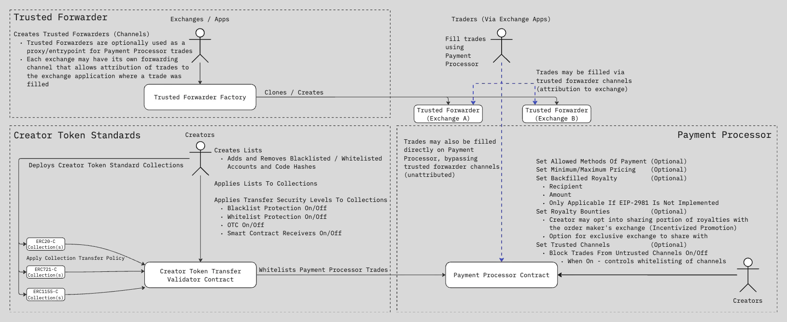
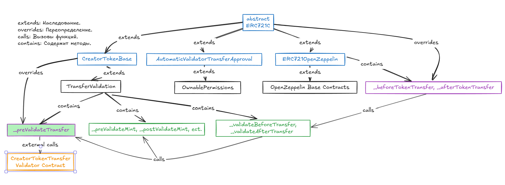
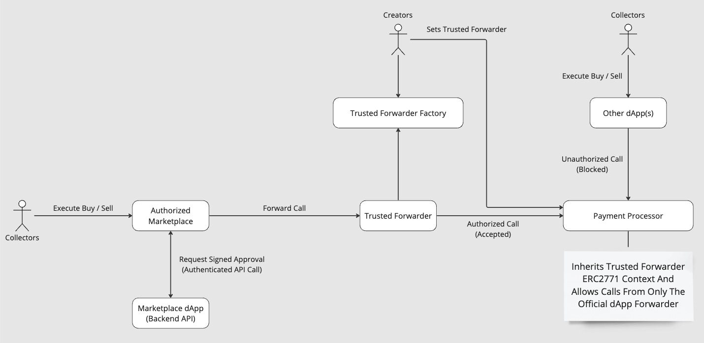

# ERC-721-C: Новый подход к выплате роялти

**Автор:** [Алексей Куценко](https://github.com/bimkon144) 👨‍💻

## Введение

Limit Break, студия разработки игр с моделью free-to-play, представила концепцию Creator Tokens в январе 2021 года. Версия 1.1 контракта ERC-721-C, которая внедрила многие идеи Creator Tokens, стала доступна в мае 2023 года.

ERC-721-C — это экспериментальный подход к созданию новых возможностей для работы с NFT, направленный на решение проблемы выплаты роялти авторам NFT. Несмотря на то, что этот стандарт ещё не включён в реестр Ethereum Improvement Proposals (EIPs), он предлагает механизмы для усиления защиты интересов создателей цифрового контента.

Одна из ключевых проблем текущих стандартов, таких как ERC-721 и ERC-1155, заключается в отсутствии строгого механизма соблюдения роялти. Выплата роялти в этих стандартах зависит от платформы или конкретной реализации, а в некоторых случаях полностью игнорируется. Это приводит к тому, что создатели контента не получают справедливого вознаграждения за перепродажу их произведений на вторичном рынке.

ERC-721-C предлагает решение выплаты роялти через введение дополнительных возможностей управления трансфером токенов в комплексе с использованием контракта совершения сделок - payment processor. Этот подход позволяет создателям устанавливать строгие правила, обеспечивая выполнение роялти при каждой транзакции. Основная идея заключается в предоставлении разработчикам возможности настраивать политики передачи токенов (transfer policies) через переопределение хуков _beforeTokenTransfer и _afterTokenTransfer в контракте токенов, с интеграцией проверки условий в процессе транзакции с использованием внешних контрактов валидаторов.

## Архитектура и модули ERC-721-C

Creator Advanced Protection Suite (CAPS) — это набор open-source смарт-контрактов, разработанный для предоставления создателям цифрового контента полного контроля над их цифровыми активами и взаимодействиями в экосистеме Web3. CAPS включает три независимых, но взаимодополняющих продукта: Creator Token Standards, Payment Processor и Trusted Forwarder. Эти модули работают вместе, чтобы обеспечить защиту токенов, контроль над торговыми процессами.

С CAPS создатели могут:

- Заблокировать взаимодействия с их коллекциями без разрешения.
- Гарантировать соблюдение роялти за использование.
- Настроить и изолировать свою экосистему на любом совместимом с EVM блокчейне.
- Отслеживать, какие приложения и платформы участвуют в сделках, и устанавливать ограничения, чтобы защитить свои активы от нежелательных действий или взаимодействий.
- Каждый из продуктов CAPS может использоваться отдельно, однако их совместное применение позволяет выстроить надёжную многоуровневую защиту для ваших активов.

На схеме ниже показана архитектура CAPS и взаимосвязь между её модулями.



### Creator Token Standards: Настройка защиты для токенов

Creator Token Standards предоставляет создателям возможность задавать правила работы функции передачи (transfer function) для токенов стандартов ERC20, ERC721 и ERC1155.

Ключевые возможности:

1. Контроль функции передачи (Transfer Function):

- Создатели могут устанавливать правила, которые блокируют или разрешают определённые протоколы, использующие функции передачи токенов.
- Применение этих правил подходит для множества сценариев, таких как торговля, игровые платформы или пользовательские кейсы с передачей токенов.

2. Работа с хуками передачи:

- Все основные токен-протоколы (ERC20, ERC721, ERC1155) содержат хуки beforeTransfer и afterTransfer, которые позволяют внедрять логику перед и после передачи токенов. Важно сообщить, что ERC-721-C используется с Openzeppelin версии 4.8.2.
- Контракт который наследуется от ERC-721-C  подключается к этим хукам и добавляет валидацию через внешний реестр проверки передачи (Creator Token Transfer Validator Contract).

3. Внешний реестр проверки передачи:

- Используется для настройки и применения правил безопасности, определённых создателем токенов, таких как блокировка/разрешение передачи в зависимости от адресов caller, from, и to.
- Реестр позволяет создателям оперативно менять настройки для повышения или снижения уровня безопасности их коллекций.

4. Гибкость настроек:

- Создатели могут конфигурировать два ключевых параметра для своих коллекций:
  - Уровень безопасности передачи: Определяет строгость правил, применяемых к коллекции.
  - Список ID (List ID): Определяет, какой whitelist/blacklist применяется к коллекции.
- Настройки можно изменить в любое время без необходимости писать новый код.

Модуль состоит из основных контрактов:

- Контракт  ERC-721-C.
- Контракт валидатор трансферов - Creator Token Transfer Validator Contract.

#### Контракт  ERC-721-C

1. Abstract контракт `ERC-721-C`: Основной контракт, объединяющий функциональность ERC721 с валидацией трансферов через перезапись хуков _beforeTokenTransfer и _afterTokenTransfer.
2. Наследуемый Abstract контракт `CreatorTokenBase`: Расширяет функциональность токенов для работы с настраиваемой политикой трансфера.
3. Наследуемый Abstract  контракт `TransferValidation`: Базовый контракт для внедрения валидаторов и хуков.


**ERC-721-C: Основной контракт**

Для использования `ERC-721-C` контракта, необходимо просто наследоваться от него

```solidity
import {ERC721C} from '@limitbreak/creator-token-standards/erc721c/ERC721C.sol';

contract MockERC721C is ERC721C {
    // Остальной код вашего контракта
}
```

Давайте разберём что происходит в [ERC-721-C](https://github.com/limitbreakinc/creator-token-standards/blob/main/src/erc721c/ERC721C.sol):

В файле присутствуют абстрактные контракты `ERC-721-C` и `ERC721CInitializable` (для использование с EIP-1167 proxy clones).

Рассмотрим код `ERC-721-C`.

```solidity
// SPDX-License-Identifier: MIT
pragma solidity ^0.8.4;

// Импорт необходимых зависимостей
import "../utils/AutomaticValidatorTransferApproval.sol"; // Автоматическая настройка апрувов токенов для валидатора, флагом может управлять выставить только владелец контракта.
import "../utils/CreatorTokenBase.sol"; // Базовый контракт для токенов с функциональностью ERC-721-C
import "../token/erc721/ERC721OpenZeppelin.sol"; // Реализация ERC721 на основе OpenZeppelin. Используется 4.8.2 версия от OZ.
import "../interfaces/ITransferValidatorSetTokenType.sol"; // Интерфейс для установки типа токена в валидаторе
import {TOKEN_TYPE_ERC721} from "@limitbreak/permit-c/Constants.sol"; // Константа для обозначения типа токена ERC721

/**
 * @title ERC721C
 * @author Limit Break, Inc.
 * @notice Расширение реализации OpenZeppelin ERC721 с добавлением функциональности Creator Token,
 *         которая позволяет владельцу контракта обновлять логику проверки передачи с помощью внешнего валидатора.
 */
abstract contract ERC721C is ERC721OpenZeppelin, CreatorTokenBase, AutomaticValidatorTransferApproval {

    /**
     * @notice Переопределение метода isApprovedForAll. Если оператор не явно апрувнут,
     *         владелец контракта может автоматически апрувнуть валидатор 721-C для передачи токенов.
     */
    function isApprovedForAll(address owner, address operator) public view virtual override returns (bool isApproved) {
        // Проверяем, одобрен ли оператор через стандартный метод OpenZeppelin
        isApproved = super.isApprovedForAll(owner, operator);

        // Если оператор не одобрен, проверяем, включено ли автоматическое апрув валидатора
        if (!isApproved) {
            if (autoApproveTransfersFromValidator) {
                // Если включено, автоматически одобряем валидатор
                isApproved = operator == address(getTransferValidator());
            }
        }
    }

    /**
     * @notice Указывает, реализует ли контракт заданный интерфейс.
     * @dev Переопределяет supportsInterface из ERC165.
     * @param interfaceId Идентификатор интерфейса
     * @return true, если контракт реализует указанный интерфейс, иначе false
     */
    function supportsInterface(bytes4 interfaceId) public view virtual override returns (bool) {
        // Проверяем поддержку интерфейсов CreatorToken, LegacyToken или стандартных интерфейсов ERC165
        return 
        interfaceId == type(ICreatorToken).interfaceId || 
        interfaceId == type(ICreatorTokenLegacy).interfaceId || 
        super.supportsInterface(interfaceId);
    }

    /**
     * @notice Возвращает селектор функции для проверки передачи через валидатор.
     * @notice Используется для симуляции транзакций.
     */
    function getTransferValidationFunction() external pure returns (bytes4 functionSignature, bool isViewFunction) {
        // Указываем селектор функции в валидаторе, подходящий под формат токена
        functionSignature = bytes4(keccak256("validateTransfer(address,address,address,uint256)"));
        // Указываем, что функция является view
        isViewFunction = true;
    }

    /**
     * @dev Перезаписывает хуки OpenZeppelin _beforeTokenTransfer для валидации трансферов.
     * @param from Адрес отправителя токена
     * @param to Адрес получателя токена
     * @param firstTokenId Идентификатор первого токена в группе
     * @param batchSize Размер группы токенов
     */
    function _beforeTokenTransfer(
        address from,
        address to,
        uint256 firstTokenId,
        uint256 batchSize) internal virtual override {
        // Итерируемся по каждому токену в группе
        for (uint256 i = 0; i < batchSize;) {
            // Проверяем передачу каждого токена
            _validateBeforeTransfer(from, to, firstTokenId + i);
            unchecked {
                ++i;
            }
        }
    }

    /**
     * @dev Перезаписывает хуки OpenZeppelin _afterTokenTransfer для валидации трансферов.
     * @param from Адрес отправителя токена
     * @param to Адрес получателя токена
     * @param firstTokenId Идентификатор первого токена в группе
     * @param batchSize Размер группы токенов
     */
    function _afterTokenTransfer(
        address from,
        address to,
        uint256 firstTokenId,
        uint256 batchSize) internal virtual override {
        // Итерируемся по каждому токену в группе
        for (uint256 i = 0; i < batchSize;) {
            // Выполняем логику после передачи каждого токена
            _validateAfterTransfer(from, to, firstTokenId + i);
            unchecked {
                ++i;
            }
        }
    }

    /**
     * @notice Возвращает тип токена (ERC721).
     */
    function _tokenType() internal pure override returns(uint16) {
        return uint16(TOKEN_TYPE_ERC721); // Возвращаем константу типа токена
    }
}

```

По наследуемым контракту `AutomaticValidatorTransferApproval.sol` в целом все просто, можете посмотреть его [тут](https://github.com/limitbreakinc/creator-token-standards/blob/main/src/utils/AutomaticValidatorTransferApproval.sol)

2. CreatorTokenBase

Следует разобрать базовый контракт [CreatorTokenBase](https://github.com/limitbreakinc/creator-token-standards/blob/main/src/utils/CreatorTokenBase.sol):

```solidity
// SPDX-License-Identifier: MIT
pragma solidity ^0.8.4;

import "../access/OwnablePermissions.sol"; // Подключение базового контракта для подключения и проверки ownable контракта.
import "../interfaces/ICreatorToken.sol"; // Интерфейс creatorsToken.
import "../interfaces/ICreatorTokenLegacy.sol"; // Интерфейс устаревшего creatorsToken.
import "../interfaces/ITransferValidator.sol"; // Интерфейс валидатора передачи.
import "./TransferValidation.sol"; // Базовый контракт для проверки трансферов.
import "../interfaces/ITransferValidatorSetTokenType.sol"; // Интерфейс для установки типа токена в валидаторе.

/**
 * @title CreatorTokenBase
 * @notice Базовый контракт для токенов создателей, предоставляющий функциональность управления политиками передачи.
 * @dev Поддерживает настройку валидаторов трансфера для реализации сложных ограничений и политик безопасности.
 */
abstract contract CreatorTokenBase is OwnablePermissions, TransferValidation, ICreatorToken {

    error CreatorTokenBase__InvalidTransferValidatorContract();

    /// @dev Константа, определяющая стандартный валидатор трансфера, используемый по умолчанию.
    address public constant DEFAULT_TRANSFER_VALIDATOR = address(0x721C002B0059009a671D00aD1700c9748146cd1B);

    /// @dev Флаг, указывающий, был ли инициализирован пользовательский валидатор.
    bool private isValidatorInitialized;

    /// @dev Адрес текущего валидатора.
    address private transferValidator;

    /// @dev Конструктор, инициализирующий стандартный валидатор.
    constructor() {
        _emitDefaultTransferValidator(); // Генерируем событие для стандартного валидатора.
        _registerTokenType(DEFAULT_TRANSFER_VALIDATOR); // Регистрируем тип токена этого контракта в валидаторе.
    }

    /**
     * @notice Позволяет установить адрес нового валидатора трансфера для контракта токена. Возможно написать и установить свой валидатор.
     * @dev Доступно только владельцу контракта. 
     * @param transferValidator_ Новый адрес валидатора трансфера.
     */
    function setTransferValidator(address transferValidator_) public {
        // Проверяем, что вызывающий является владельцем.
        _requireCallerIsContractOwner();

        // Проверяем, что переданный адрес содержит код или равен нулевому.
        bool isValidTransferValidator = transferValidator_.code.length > 0;

        if (transferValidator_ != address(0) && !isValidTransferValidator) {
            revert CreatorTokenBase__InvalidTransferValidatorContract(); 
        }

        // Генерируем событие с информацией о смене валидатора.
        emit TransferValidatorUpdated(address(getTransferValidator()), transferValidator_);

        isValidatorInitialized = true; // Отмечаем, что валидатор установлен.
        transferValidator = transferValidator_; // Сохраняем новый адрес валидатора.

        _registerTokenType(transferValidator_); // Регистрируем тип токена в валидаторе.
    }

    /**
     * @notice Возвращает текущий адрес валидатора.
     * @dev Если валидатор не был установлен, возвращает адрес стандартного валидатора.
     */
    function getTransferValidator() public view override returns (address validator) {
        validator = transferValidator;

        // Возвращаем стандартный валидатор, если пользовательский валидатор не был установлен.
        if (validator == address(0)) {
            if (!isValidatorInitialized) {
                validator = DEFAULT_TRANSFER_VALIDATOR;
            }
        }
    }

    /**
     * @dev Проверяет допустимость трансфера токена до выполнения операции. Ревертит если наложенные ограничения не позволяют сделать это.
     * @dev Идет перезапись метода из контракта TransferValidation.
     * @param caller Адрес вызывающего.
     * @param from Адрес отправителя.
     * @param to Адрес получателя.
     * @param tokenId Идентификатор токена.
     */
    function _preValidateTransfer(
        address caller, 
        address from, 
        address to, 
        uint256 tokenId, 
        uint256 /*value*/) internal virtual override {
        address validator = getTransferValidator();

        if (validator != address(0)) {
            if (msg.sender == validator) {
                return; // Если вызов от валидатора, пропускаем проверку. Для чего это сделано, расскажу чуть позже.
            }

            // Вызываем метод валидации на валидаторе.
            ITransferValidator(validator).validateTransfer(caller, from, to, tokenId);
        }
    }

    /**
     * @dev Расширенная версия проверки передачи для ERC20/ERC1155 с поддержкой проверки количества.
     * @dev Идет перезапись метода из контракта TransferValidation.
     * @param caller Адрес вызывающего.
     * @param from Адрес отправителя.
     * @param to Адрес получателя.
     * @param tokenId Идентификатор токена. Для erc-20 должен быть равен 0.
     * @param amount Количество токенов для передачи.
     */
    function _preValidateTransfer(
        address caller, 
        address from, 
        address to, 
        uint256 tokenId, 
        uint256 amount,
        uint256 /*value*/) internal virtual override {
        address validator = getTransferValidator();

        if (validator != address(0)) {
            if (msg.sender == validator) {
                return; // Если вызов от валидатора, пропускаем проверку.
            }

            // Вызываем метод валидации на валидаторе.
            ITransferValidator(validator).validateTransfer(caller, from, to, tokenId, amount);
        }
    }

    function _tokenType() internal virtual pure returns(uint16);

    /**
     * @dev Регистрирует тип токена в валидаторе.
     * @param validator Адрес валидатора.
     */
    function _registerTokenType(address validator) internal {
        if (validator != address(0)) {
            uint256 validatorCodeSize;
            assembly {
                validatorCodeSize := extcodesize(validator) // Получаем размер кода контракта.
            }
            if (validatorCodeSize > 0) {
                try ITransferValidatorSetTokenType(validator).setTokenTypeOfCollection(address(this), _tokenType()) {
                } catch { }
            }
        }
    }

    /**
     * @dev Генерирует событие для стандартного валидатора при развертывании контракта.
     */
    function _emitDefaultTransferValidator() internal {
        emit TransferValidatorUpdated(address(0), DEFAULT_TRANSFER_VALIDATOR);
    }
}
```

3. TransferValidation

Контракт `TransferValidation`, от которого наследуется `CreatorTokenBase`, предоставляет интерфейс для более детальной проверки операций с токенами, включая проверки перед и после минта (создания), сжигания и трансфера. Он расширяет стандартные хуки OpenZeppelin (_beforeTokenTransfer и _afterTokenTransfer) для обеспечения гибкости в проверке и настройке операций.

Контракт позволяет разработчикам определять свою логику валидации для различных сценариев, связанных с передачей токенов, минимизируя вероятность ошибок или некорректных операций.

В нашем случае, в контракте `CreatorTokenBase` перезаписываются только два метода из контракта `TransferValidation`: `_preValidateTransfer` для erc721 и `_preValidateTransfer` для erc-20 и erc-1155.

Сам контракт не сложный, можно посмотреть его [тут](https://github.com/limitbreakinc/creator-token-standards/blob/main/src/utils/TransferValidation.sol).

Таким образом схема наследования и переопределения контрактов выглядит так:



#### Контракт CreatorTokenTransferValidator

Контракт обеспечивает механизм проверки и управления безопасностью передач токенов для коллекций, таких как ERC20, ERC721 и ERC1155. Он позволяет владельцам коллекций настраивать политику безопасности трансфера (например, black/white lists, уровни защита трансфера для токенов) для предотвращения нежелательных действий с токенами.

Если в требуемой сети отсутствует контракт, то его можно легко задеплоить через [интерфейс](https://developers.erc721c.com/infrastructure).

Точкой входа для валидации является функция `validateTransfer(address caller, address from, address to)`.
Эта та функция которую вызывает наш контракт токена через хуки.

Код контракта довольно большой, поэтому предлагаю выделить основные функции работы контракта,а для тех кто хочет посмотреть полный код, он лежит [здесь](https://github.com/limitbreakinc/creator-token-contracts/blob/main/contracts/utils/CreatorTokenTransferValidator.sol).

**Основные функции:**

1. **Создание и управление списками**

- **`createList(string name)`**  
  Создает новый список (black, white).
  
- **`createListCopy(string name, uint120 sourceListId)`**  
  Копирует существующий список в новый.
  
- **`addAccountsToBlacklist(uint120 id, address[] calldata accounts)`**  
  Добавляет адреса в черный список.

- **`addAccountsToWhitelist(uint120 id, address[] calldata accounts)`**  
  Добавляет адреса в белый список.

- **`removeAccountsFromBlacklist(uint120 id, address[] calldata accounts)`**  
  Удаляет адреса из черного списка.

- **`removeAccountsFromWhitelist(uint120 id, address[] calldata accounts)`**  
  Удаляет адреса из белого списка.

- **`addCodeHashesToBlacklist(uint120 id, bytes32[] calldata codehashes)`**  
  Добавляет хэши кода контрактов в черный список.

- **`addCodeHashesToWhitelist(uint120 id, bytes32[] calldata codehashes)`**  
  Добавляет хэши кода контрактов в белый список.


2. **Применение политик безопасности к коллекциям**

- **`setTransferSecurityLevelOfCollection(address collection, uint8 level, bool disableAuthorizationMode, bool disableWildcardOperators, bool enableAccountFreezingMode)`**  
  Устанавливает уровень безопасности трансфера для токенов. Главная функция управления настройки трансферов. Более детально рассмотрим позже.

- **`applyListToCollection(address collection, uint120 id)`**  
  Применяет список (черный или белый) к коллекции.

- **`freezeAccountsForCollection(address collection, address[] calldata accountsToFreeze)`**  
  Блокирует указанные аккаунты для коллекции.

- **`unfreezeAccountsForCollection(address collection, address[] calldata accountsToUnfreeze)`**  
  Разблокирует аккаунты.

3. **Валидация передач**

- **`validateTransfer(address caller, address from, address to)`**  
  Проверяет, разрешена ли передача с текущими настройками безопасности. Используется в контракте токена в методе `_beforeTokenTransfer`.

4. **Управление авторизацией**

- **`addAccountsToAuthorizers(uint120 id, address[] calldata accounts)`**
    Устанавливает авторизаторов токенов. Авторизаторы — это специально назначенные адреса (аккаунты или контракты), которым предоставлены права одобрять других операторов, которые могут произвести трансфер в обход установленных правил. Эти функции указаны ниже.
- **`removeAccountsFromAuthorizers(uint120 id, address[] calldata accounts)`**
    Удаляет аккаунты из авторизаторов.
- **`beforeAuthorizedTransfer(address operator, address token, uint256 tokenId)`**  
  Устанавливает авторизованного оператора для выполнения передачи, обходя стандартные проверки трансфера. Важно, авторизатор обязан потом удалить авторизацию.

- **`afterAuthorizedTransfer(address token, uint256 tokenId)`**  
  Удаляет авторизацию для оператора.

- **`beforeAuthorizedTransferWithAmount(address token, uint256 tokenId, uint256 /*amount*/)`**  
  Устанавливает id токена для передачи любым оператором, обходя стандартные проверки трансфера. Важно, авторизатор обязан потом удалить авторизацию.

- **`afterAuthorizedTransferWithAmount(address token, uint256 tokenId)`**  
  Удаляет авторизацию для токена.

5. **Получение информации**

- **`getBlacklistedAccounts(uint120 id)`**  
  Возвращает адреса в черном списке.

- **`getWhitelistedAccounts(uint120 id)`**  
  Возвращает адреса в белом списке.

- **`isAccountBlacklisted(uint120 id, address account)`**  
  Проверяет, находится ли адрес в черном списке.

- **`isAccountWhitelisted(uint120 id, address account)`**  
  Проверяет, находится ли адрес в белом списке.


**Используемые технологии и библиотеки**

- **OpenZeppelin**  
    Используются стандартные контракты, такие как `ERC165` для определения интерфейсов и `EnumerableSet` для управления списками.

- **PermitC**
    Улучшенная версия permit2. Контракт предоставляет расширенное управление разрешениями для токенов ERC20, ERC721 и ERC1155, включая:

    - Разрешения на однократные трансферы (Single-Use Permit Transfers).

    - Ограниченные по времени разрешения (Time-Bound Approvals).

    - Разрешения на трансферы, основанные на идентификаторах ордеров (Order ID Based Transfers).

- **Tstorish**
    Контракт Tstorish используется для управления опкодом TSTORE, где это поддерживается EVM. Он включает тестирование доступности TLOAD/TSTORE на при деплое контракта. Если TSTORE поддерживается, это позволяет более эффективно работать с хранилищем. Если не поддерживает, то использует стандартные опкоды SSTORE, SLOAD.

Следует детальнее разобрать, аргументы функции `setTransferSecurityLevelOfCollection(address collection, uint8 level, bool disableAuthorizationMode, bool disableWildcardOperators, bool enableAccountFreezingMode)`:

- collection - адресс токенов для установки политики трансфера.
- level - уровень защиты трансфера. Рассмотрим уровни ниже.
- disableAuthorizationMode - запрещает использование авторизаторов для разрешения индивидуальных трансферов в обход политики трансфера.
- disableWildcardOperators -  запрещает авторизаторам использовать универсальных операторов (полный обход - ограничений на определенный токен id).
enableAccountFreezingMode - включает возможность замораживания определенных аккаунтов, запрещая им отправлять токены.

**Уровни защиты (Transfer Security Levels)**

Таблица описывает 9 уровней безопасности передачи токенов, которые могут быть настроены в контракте для управления процессом передачи токенов в зависимости от требований к безопасности и контролю:

| Level          | List Type  | OTC      | Smart Contract Receivers                       |
|----------------|------------|----------|-----------------------------------------------|
| Recommended    | Whitelist  | Allowed  | Allowed                                       |
| 1              | None       | Allowed  | Allowed                                       |
| 2              | Blacklist  | Allowed  | Allowed                                       |
| 3              | Whitelist  | Allowed  | Allowed                                       |
| 4              | Whitelist  | Blocked  | Allowed                                       |
| 5              | Whitelist  | Allowed  | Blocked Using Code Length Check              |
| 6              | Whitelist  | Allowed  | Blocked Using EOA Signature Verification     |
| 7              | Whitelist  | Blocked  | Blocked Using Code Length Check              |
| 8              | Whitelist  | Blocked  | Blocked Using EOA Signature Verification     |
| 9              | None       | Blocked  | Blocked by Restricting Transfer              |

**Колонки таблицы**

Level (Уровень):
- Уровень безопасности, от минимального (1) до максимального (9).
- Более высокий уровень предоставляет больше ограничений.

List Type (Тип списка):
- Определяет, какой тип списка используется для проверки участников транзакции:
  - None (Нет): Списки не используются.
  - Blacklist (Черный список): Операторы, попавшие в черный список, блокируются.
  - Whitelist (Белый список): Только операторы из белого списка могут выполнять действия.

OTC (Over-the-Counter):
- Указывает, можно ли выполнять транзакции напрямую (без участия смарт-контрактов):
  - Allowed (Разрешено): Токены можно передавать напрямую.
  - Blocked (Запрещено): Все передачи должны выполняться через смарт-контракт.

Smart Contract Receivers (Получатели в виде смарт-контрактов):
- Определяет, разрешено ли отправлять токены на адреса смарт-контрактов:
  - Allowed (Разрешено): Смарт-контракты могут быть получателями токенов.
  - Blocked Using Code Length Check: Запрещено отправлять токены на адреса с кодом (проверяется длина кода).
  - Blocked Using EOA Signature Verification: Запрещено отправлять токены на адреса, которые не прошли проверку EOA (Externally Owned Account).

**Уровни безопасности:**

Level 1:
- Описание: Нет ограничений.
- Детали: Токены можно передавать кому угодно и как угодно.

Level 2:
- Описание: Черный список операторов.
- Детали: Операторы из черного списка не могут инициировать транзакции. OTC разрешен.

Level 3:
- Описание: Белый список операторов.
- Детали: Только операторы из белого списка могут передавать токены. OTC разрешен.

Level 4:
- Описание: Белый список операторов с блокировкой OTC.
- Детали: OTC запрещен, только белый список операторов.

Level 5:
- Описание: Белый список операторов с ограничением на получателей.
- Детали: OTC разрешен, но запрещены адреса смарт-контрактов (по длине кода).

Level 6:
- Описание: Белый список операторов и только EOA.
- Детали: OTC разрешен, но токены можно передавать только на EOA (адреса пользователей).

Level 7:
- Описание: Белый список операторов с блокировкой OTC и запретом смарт-контрактов.
- Детали: OTC запрещен, токены нельзя отправлять на адреса смарт-контрактов.

Level 8:
- Описание: Белый список операторов с блокировкой OTC и только EOA.
- Детали: OTC запрещен, токены можно передавать только на EOA.

Level 9:
- Описание: Полный запрет на передачи (Soulbound Tokens).
- Детали: Токены становятся привязанными к адресу и не могут быть переданы.

**Применение**
Эти уровни позволяют создателям токенов:

1. Защитить токены от несанкционированных передач.
2. Гарантировать, что транзакции проходят через проверенные каналы.
3. Ограничить доступ для смарт-контрактов, если это необходимо.
4. Настроить гибкий механизм безопасности, подходящий для различных сценариев использования, от свободной передачи до токенов с привязкой (Soulbound Tokens).

### Payment Processor

Payment Processor — это протокол пиринговой торговли NFT, который выступает в роли блокчейн-слоя для исполнения сделок. Основной особенностью системы является использование офчейн-ордербуков и бирж, которые обеспечивают хранение и обработку данных о сделках off-chain. Это дает разработчикам и создателям больше контроля над торговыми процессами и значительно снижает издержи по газу.

Payment Processor гарантирует полное соблюдение роялти создателей, что выгодно отличает его от других протоколов NFT.

Протокол поддерживает настройки роялти:

1) EIP-2981 — стандарт смарт-контрактов, задающий правила роялти на уровне блокчейна.
2) Backfill роялти — для старых коллекций, не поддерживающих EIP-2981. Это возможно, если коллекция:

- поддерживает ownable стандарт, способного вызвать функцию настройки роялти;

- поддерживает AccessControl стандарт, где настройки могут быть изменены через администратора.

3) Даже в отсутствие on-chain поддержки роялти, создатели могут использовать "Royalty Backfill" и обеспечить их соблюдение через договоренности с маркетплейсами, чтобы они включали комиссию при формировании сделки.

Payment Processor предлагает уникальные инструменты управления, которые ставят интересы создателей в приоритет:

Таким образом, данный контракт всегда применяет royalty, указанные автором через ERC-2981, либо через настройки, что позволяет избегать случаев неуплаты роялти, но при условии что настроены whitelist списки маркетплейсов которые поддерживают ERC-721-C.

**Гибкость в методах оплаты**

- Белый список по умолчанию: только ETH, WETH, USDC и их эквиваленты, защищая создателей от нежелательных токенов.
- Кастомный белый список: возможность задать свои токены, что особенно полезно для игр Web3.
- Разрешение любых токенов: для максимальной гибкости.

**Ограничения по ценам**
Создатели могут устанавливать минимальные и максимальные цены на уровне коллекции или конкретного NFT, что важно для редких игровых предметов или контроля экономики коллекции.

**Бонусы роялти**
Помимо вышеуказанной возможности роялти, создатели могут делиться процентом своих роялти с маркетплейсами для стимулирования их к продвижению коллекций. Этот механизм помогает выстраивать партнерства и увеличивать видимость коллекций.

**Trusted Channels**
Создатели могут ограничивать трейдинг только доверенными каналами, блокируя нежелательные платформы.
Про контракт, который может это обеспечить, поговорим позже.

Таким образом, можно управлять настройками контракта токена в `Payment Processor` через интерфейс или напрямую через контракт.

**Основные методы для создателей коллекций**

1. `createPaymentMethodWhitelist`
Создание нового списка методов оплаты.
2. `whitelistPaymentMethod`
Добавление токенов в белый список методов оплаты.
3. `unwhitelistPaymentMethod`
Удаление токенов из белого списка методов оплаты.
4. `setCollectionPaymentSettings`
Настройка правил оплаты коллекции, включая роялти автору и маркетплейсу, методы оплаты и ограничения цен.
5. `setTokenPricingBounds`
Установка минимальной и максимальной цены для отдельных токенов.
6. `addTrustedChannelForCollection`
Добавление доверенных каналов для торговли коллекцией.
7. `removeTrustedChannelForCollection`
Удаление доверенных каналов из списка.
8. `renounceOwnershipOfPaymentMethodWhitelist`
Отказ от управления списком методов оплаты (делает его неизменяемым).

В настоящий момент система контрактов задеплоена по этим адресам:

| Contract                                     | Address                                                                                         |
|---------------------------------------------|-------------------------------------------------------------------------------------------------|
| Payment Processor V3.0.0                    | [0x9a1D00000000fC540e2000560054812452eB5366](https://etherscan.io/address/0x9a1D00000000fC540e2000560054812452eB5366#code) |
| Payment Processor V3.0.0 Encoder            | [0x9A1D00C3a699f491037745393a0592AC6b62421D](https://etherscan.io/address/0x9A1D00C3a699f491037745393a0592AC6b62421D#code) |
| Payment Processor V3.0.0 Configuration      | [0x9A1D00773287950891B8A48Be6f21e951EFF91b3](https://etherscan.io/address/0x9A1D00773287950891B8A48Be6f21e951EFF91b3#code) |
| Payment Processor Module On Chain Cancellation | [0x9A1D005Da1E3daBCE14bc9734DEe692A8978c71C](https://etherscan.io/address/0x9A1D005Da1E3daBCE14bc9734DEe692A8978c71C#code) |
| Payment Processor Module Accept Offers      | [0x9A1D00E769A108df1cbC3bFfcF867B64ba2E9eFf](https://etherscan.io/address/0x9A1D00E769A108df1cbC3bFfcF867B64ba2E9eFf#code) |
| Payment Processor Module Buy Listings       | [0x9A1D00A68523b8268414E4406268c32EC83323A9](https://etherscan.io/address/0x9A1D00A68523b8268414E4406268c32EC83323A9#code) |
| Payment Processor Module Sweeps             | [0x9A1D008994E8f69C66d99B743BDFc6990a7801aB](https://etherscan.io/address/0x9A1D008994E8f69C66d99B743BDFc6990a7801aB#code) |
| Collection Settings Registry                | [0x9A1D001A842c5e6C74b33F2aeEdEc07F0Cb20BC4](https://etherscan.io/address/0x9A1D001A842c5e6C74b33F2aeEdEc07F0Cb20BC4#code) |

Если контракты не задеплоены в требуюмую сеть, вы можете это сделать через [интерфейс](https://developers.erc721c.com/infrastructure).

### Trusted forwarders

В современных децентрализованных приложениях (dApps) и протоколах одним из ключевых вызовов является обеспечение безопасной и контролируемой маршрутизации транзакций, особенно в контексте продажи цифровых активов и взаимодействия пользователей с платформами. Проблема усложняется, когда сторонние приложения пытаются использовать открытые протоколы, чтобы перехватить потоки транзакций, обходя авторизованные интерфейсы. Это может не только создавать риски для пользователей, но и наносить ущерб создателям и официальным платформам.

Для решения этих задач был разработан механизм Trusted Forwarder (Доверенный Форвардер). Этот механизм позволяет создателям контента и маркетплейсам создавать каналы взаимодействия с платежным процессором, обеспечивая контроль над маршрутами транзакций. Trusted Forwarder может работать в двух режимах:

- Открытый режим: форвардер пересылает все транзакции, добавляя адрес вызвавшего в данные вызова.

- Режим с разрешениями: форвардер требует, чтобы данные транзакции были подписаны доверенным адресом, указанным владельцем форвардера.



На приведенной схеме визуализируется работа Trusted Forwarder в контексте взаимодействия коллекционеров, маркетплейсов, авторов контента и Payment Processor.

Деплой контракта Trusted Forwarder должен быть через фабрику [контракта](https://github.com/limitbreakinc/TrustedForwarder/blob/main/src/TrustedForwarderFactory.sol) `Trusted Forwarder Factory`

Способы деплоя `Trusted Forwarder`:

- Напрямую через уже задеплоенный контракт фабрики, например через [etherscan](https://etherscan.io/address/0xff0000b6c4352714cce809000d0cd30a0e0c8dce#writeContract)

- Использовать [интерфейс](https://developers.erc721c.com/modification), в котором можно `trusted channels`, что подразумевает деплой контракта `Trusted Forwarder`.

- В случае отсутствия задеплоенного контракта фабрики, можно задеплоить ее через [интерфейс](https://developers.erc721c.com/infrastructure) либо используя [репозиторий](https://github.com/limitbreakinc/TrustedForwarder/tree/main/src)

Основные методы контракта `Forwarder`:

```solidity
    // Остальной код контракта здесь...

    /**
     * @notice Пересылает сообщение в целевой контракт, сохраняя оригинальный адрес отправителя.
     * @dev Используется, если подпись не требуется.
     * @param target Адрес целевого контракта.
     * @param message Данные вызова.
     * @return returnData Данные, возвращенные вызовом целевого контракта.
     */
    function forwardCall(address target, bytes calldata message)
        external
        payable
        returns (bytes memory returnData)
    {
        address signerCache = signer;

        // Проверяем, что форвардер работает в "открытом" режиме, где подпись не требуется.
        if (signerCache != address(0)) {
            revert TrustedForwarder__CannotUseWithoutSignature();
        }

        // Кодирует данные вызова с добавлением оригинального адреса отправителя.
        bytes memory encodedData = _encodeERC2771Context(message, _msgSender());
        
        assembly {
            // Выполняем вызов целевого контракта с закодированными данными.
            let success := call(gas(), target, callvalue(), add(encodedData, 0x20), mload(encodedData), 0, 0)
            let size := returndatasize()

            // Выделяем память для возвращаемых данных.
            returnData := mload(0x40)
            mstore(returnData, size)
            mstore(0x40, add(add(returnData, 0x20), size)) // Сдвигаем указатель памяти.
            returndatacopy(add(returnData, 0x20), 0, size) // Копируем данные возврата.

            // Проверяем, был ли вызов успешным.
            if iszero(success) {
                revert(add(returnData, 0x20), size) // Реверс с возвратом данных ошибки.
            }

            // Если вызов успешен, но данные пусты, проверяем, существует ли целевой контракт.
            if iszero(size) {
                if iszero(extcodesize(target)) {
                    mstore(0x00, 0x39bf07c1)
                    revert(0x1c, 0x04)
                }
            }
        }
    }

/**
 * @notice Пересылает сообщение в целевой контракт с проверкой подписи.
 * @dev Эта функция используется в режиме с проверкой подписи, чтобы убедиться, что транзакция авторизована доверенным подписантом.
 * @param target Адрес целевого контракта, в который будет переслано сообщение.
 * @param message Данные вызова, которые будут переданы в целевой контракт.
 * @param signature Подпись ECDSA, подтверждающая, что вызов авторизован доверенным подписантом.
 * @return returnData Данные, возвращенные вызовом целевого контракта.
 */
function forwardCall(address target, bytes calldata message, SignatureECDSA calldata signature) 
    external 
    payable 
    returns (bytes memory returnData) 
{
    // Кэшируем адрес подписанта для минимизации затрат на чтение из хранилища.
    address signerCache = signer;

    // Проверяем, что адрес подписанта установлен, и валидируем подпись.
    if (signerCache != address(0)) {
        // Восстанавливаем адрес подписанта на основе переданной подписи и данных вызова.
        if (
            signerCache != _ecdsaRecover(
                _hashTypedDataV4(
                    keccak256(abi.encode(APP_SIGNER_TYPEHASH, keccak256(message), target, _msgSender()))
                ),
                signature.v,
                signature.r,
                signature.s
            )
        ) {
            // Если адрес подписанта не совпадает, выбрасываем ошибку.
            revert TrustedForwarder__SignerNotAuthorized();
        }
    }

    // Кодируем данные вызова с добавлением адреса оригинального отправителя.
    bytes memory encodedData = _encodeERC2771Context(message, _msgSender());

    assembly {
        // Выполняем вызов целевого контракта.
        let success := call(gas(), target, callvalue(), add(encodedData, 0x20), mload(encodedData), 0, 0)
        let size := returndatasize()

        // Выделяем память для данных, возвращённых вызовом.
        returnData := mload(0x40)
        mstore(returnData, size)
        mstore(0x40, add(add(returnData, 0x20), size)) // Сдвигаем указатель свободной памяти.
        returndatacopy(add(returnData, 0x20), 0, size) // Копируем возвращённые данные в память.

        // Если вызов неуспешен, выбрасываем ошибку с данными возврата.
        if iszero(success) {
            revert(add(returnData, 0x20), size)
        }

        // Проверяем, что вызов завершился успешно, и адрес целевого контракта содержит код.
        if iszero(size) {
            if iszero(extcodesize(target)) {
                mstore(0x00, 0x39bf07c1)
                revert(0x1c, 0x04)
            }
        }
    }
}
    // Остальной код контракта здесь...
```

Полный код контракта можно посмотреть [здесь](https://github.com/limitbreakinc/TrustedForwarder/blob/main/src/TrustedForwarder.sol)

Помимо рассмотренных контрактов, limitbreakinc так же позаботился о создании разных модификаций ERC721C а так же создал готовые контракты для упрощения интеграции со стороны маркетплейсов:
- [ERC721AC](https://github.com/limitbreakinc/creator-token-contracts/blob/main/contracts/erc721c/ERC721AC.sol) расширяет имплиментацию Azuki's ERC-721-A токена.
- [ERC721CW](https://github.com/limitbreakinc/creator-token-contracts/blob/main/contracts/erc721c/extensions/ERC721CW.sol) wrapper контракт erc721c, в который можно обернуть старые не поддерживаемые роялти и upgradeable контракты.
- [ImmutableMinterRoyalties](https://github.com/limitbreakinc/creator-token-contracts/tree/main/contracts/programmable-royalties) различные виды модификации записи роялти ERC-2981 под нужны авторов.
- [OrderFulfillmentOnchainRoyalties](https://github.com/limitbreakinc/creator-token-contracts?tab=readme-ov-file#usage-1)  — смарт-контракт для автоматической выплаты роялти и передачи NFT при продаже.

### Поддерживаемые маркетплейсы

Limit Break поддерживают [whitelist](https://github.com/limitbreakinc/creator-token-contracts?tab=readme-ov-file#limit-break-curated-whitelist) который включают маркетплесы с поддержкой ERC721C, что
помогает ориентироваться в выборе платформ, которые соблюдают роялти.

Однако нельзя гарантировать, что список часто обновляется, что может свидетельствовать об отсутствии в списке [Magic Eden](https://help.magiceden.io/en/articles/8995581-enforced-royalties-for-erc721c-collections-on-magic-eden-s-evm-platform).

## Вывод

Новый подход ERC-721-C открывает новую эру в управлении NFT, предоставляя создателям инструмент для обеспечения справедливого вознаграждения и контроля над своими активами. Creator Advanced Protection Suite (CAPS), включающий Creator Token Standards, Payment Processor и Trusted Forwarder, позволяет решать ключевые проблемы, связанные с соблюдением роялти маркетплейсами, безопасностью трансферов и взаимодействием с платформами.

Ключевые преимущества ERC-721-C:

**Гарантированное соблюдение роялти**
Стандарт решает проблему непоследовательного выполнения роялти на различных маркетплейсах. Благодаря интеграции Payment Processor создатели могут быть уверены, что роялти будет соблюдаться при каждой транзакции.

**Контроль над передачей токенов**
Валидационные механизмы и уровни безопасности позволяют устанавливать строгие правила передачи токенов, защищая коллекции от несанкционированных действий, таких как обходы или использование нежелательных платформ.

**Гибкость в управлении**
ERC-721-C позволяет адаптировать политику трансферов, роялти и взаимодействий к конкретным нуждам коллекции или платформы. Создатели могут настраивать минимальные и максимальные цены, ограничивать методы оплаты и добавлять доверенные каналы маркетплейсов.

**Роялти для маркетплейсов**
Уникальная возможность делиться частью роялти с маркетплейсами стимулирует платформы продвигать коллекции, укрепляет партнерские отношения и увеличивает видимость активов. Это создает выгодную экосистему, где интересы создателей и маркетплейсов взаимно поддерживают друг друга.

**Инновационные инструменты для Web3**
Trusted Forwarder и Payment Processor обеспечивают создателям полный контроль над маршрутами транзакций, безопасность операций и возможность изоляции коллекций для защиты их экосистемы.

**Простота управления создателем токенов через интерфейс Limit Break**
Возможно управлять коллекцией через [интерфейс](https://developers.erc721c.com/modification) без навыков взаимодействия напрямую с контрактом.

ERC-721-C — это мощный инструмент, который предлагает создателям уникальные возможности для управления, защиты и монетизации своих цифровых активов. Его гибкость, интеграция мультисетевых решений и поддержка маркетплейсов делают его идеальным выбором для работы с NFT в условиях стремительного роста цифровой экономики.

Внедрение таких инновационных подходов, как стимулирование маркетплейсов через роялти и использование модульных решений CAPS, укрепляет позиции ERC-721-C как стандарта, способного формировать будущее Web3. Это делает его не только инструментом защиты интересов создателей, но и основой для построения новой цифровой экосистемы.

## Ссылки:

- [Docs: ERC-721-C](https://erc721c.com/docs/integration-guide/overview)
- [GitHub: limitbreak](https://github.com/limitbreakinc)
- [GitHub: ERC-721-C contracts](https://github.com/limitbreakinc/creator-token-standards)
- [Article: Opensea creator earnings](https://opensea.io/blog/articles/creator-earnings-erc721-c-compatibility-on-opensea)
- [Guide: Creator Fee Enforcement for upgradeable contracts](https://docs.opensea.io/docs/creator-fee-enforcement)
- [GitHub: Supported marketplaces](https://github.com/limitbreakinc/creator-token-contracts?tab=readme-ov-file#limit-break-curated-whitelist)