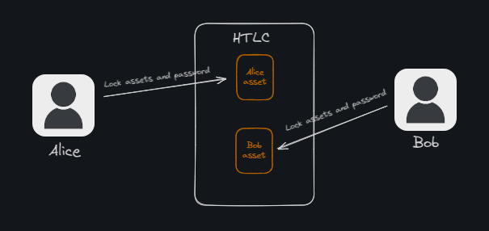
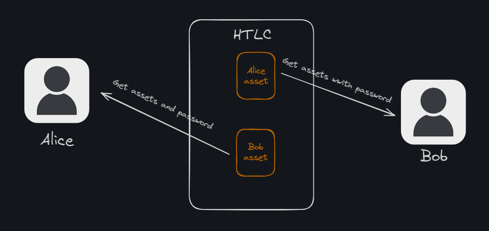
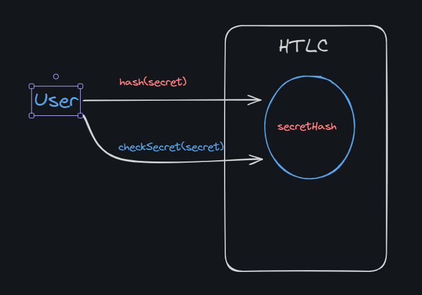
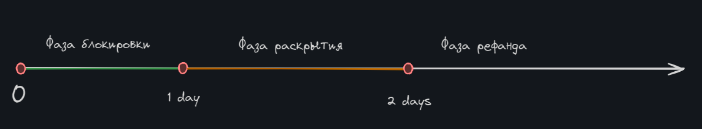
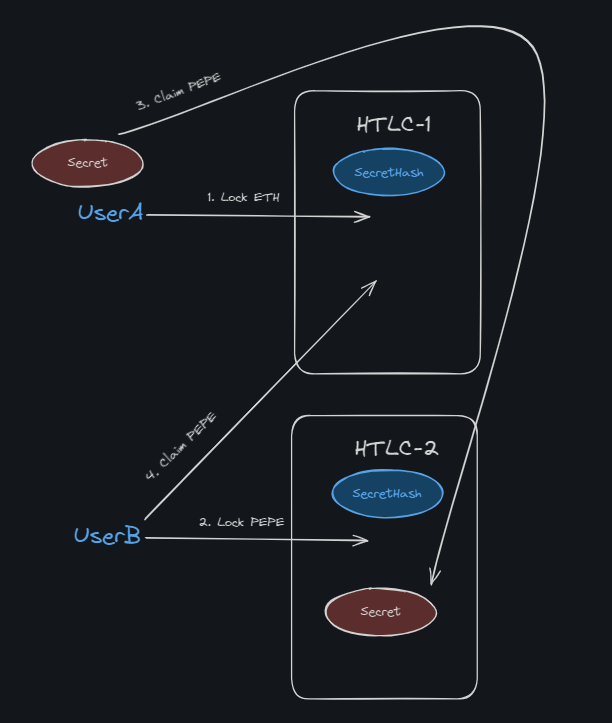

# Hash Time Locked Contracts

**Автор:** [Павел Найданов](https://github.com/PavelNaydanov) 🕵️‍♂️

_Опр!_ **Hashed time locked contract (HTLC)** - это тип смарт-контракта, который создает временное хранилище для передачи активов новому владельцу. Суть заключается в том, что активы блокируются на смарт-контракте и требуется знать специальный пароль, который позволит изъять активы из смарт-контракта. Подобный процесс ограничивается по времени и регламентируется смарт-контрактом.

Первоначально HTLC разрабатывался в контексте более надежных способов создания транзакций. По настоящему известным подход стал после предложения Joseph Poon и Thaddeus Dryja в начале 2016 года использовать HTLC для создания **payment channels**. Их работа называлась[ "The Bitcoin Lightning Network: Scalable Off-Chain Instant Payments"](https://lightning.network/lightning-network-paper.pdf).

Видимо по этому в сети существует огромное количество материала по созданию HTLC в биткоин сети. В этой статье мы поговорим, как этот концепт может быть реализован и применим в Ethereum совместимых сетях, где за место UTXO используется **account based** модель.

На верхнем уровне можно представить процесс следующим образом:

1. Два пользователя Alice и Bob блокируют на HTLC активы, которые хотят обменять друг с другом и которые партнер сможет забрать только зная пароль.

    

2. Обмен паролем для разблокировки активов

    

3. Получение активов из HTLC

    

## Два важных компонента

Исходя из названия концепции "Hash Time Locked Contracts" важными частями являются два компонента: **hash** и **time**. Попробуем понять, как они используются и почему важны.

### Hash

Часто этот компонент называют **hashlock**. Можно сказать, что это захешированные данные, которые не позволяют разблокировать активы до момента, пока эти данные не будут раскрыты.Информация, которая используется для генерации hashlock, называется **pre-image**. Другими словами, **pre-image** - это секретные данные, которые хешируются для получения hashlock.

На первом этапе необходимо придумать секретную фразу (pre-image), которая будет является ключом к активам, заблокированным на смарт-контракте. Однако важно показать ее публично, чтобы оба участника сделки были уверены, что секрет не поменяется в ходе сделки. Казалось бы, что блокчейн идеально подходит для того, чтобы зафиксировать пароль. Однако он публичен и получить данные из него может любой соискатель. Не сложно найти секрет, который был добавлен для сделки в смарт-контракт, чтобы опередить обоих участников и забрать активы.

Хеширование решает это проблему. Оно позволяет зафиксировать секрет в блокчейне, но при этом не раскрыть его. Хранение захешированого секрета полностью гарантирует его неизменность до момента извлечения актива. В конце сделки можно убедиться, что предоставленный секрет был равен первоначально захешированному.

В solidity для хеширования используется функция `keccak256`:

```solidity
bytes32 secretHash = keccak256("Secret phrase")
```

Получается, что работать это может следующим образом:


1. Пользователь хеширует секрет
2. Записывает хеш в контракт
3. В нужный момент, может всем доказать, что первоначальный секрет был тем, который он сейчас показывает

Эти три простых действия можно реализовать на смарт-контракте:

```solidity
contract SecretGuarantee {
    bytes32 private _secretHash;

    /// @notice Поможет сгенерировать hash на базе секретной фразы
    function getSecretHash(string memory secret) public pure returns (bytes32) {
        return keccak256(bytes(secret));
    }

    /// @notice Запишет хеш секретной фразы в контракт
    function setSecretHash(bytes32 secretHash) external {
        _secretHash = secretHash;
    }

    /// @notice Проверит, что секретная фраза совпадает с хешом, который был записан в контракт
    function checkSecret(string memory secret) external view returns (bool) {
        if (getSecretHash(secret) == _secretHash) {
            return true;
        }

        return false;
    }
}
```

### Time

Процесс обмена паролем и разблокировка активов может проходить в разные моменты времени и в разных блоках. Поэтому остро встает вопрос в строгом регламентировании действий пользователей. Этот компонент реализует механизм. которы позволит разблокировать активы через некоторое время.

Почему это важно? Смотрим на примере. Первый пользователь блокирует активы, а второй не блокирует. Получается проблема, у первого пользователя навсегда потеряны активы. Можно парировать: "Дайте возможность забрать активы первому пользователю, сделать рефанд". Ок! Добавляем на смарт-контракт возможность сделать рефанд. Появляется следующий сценарий: первый пользователь блокирует активы, второй пользователь блокирует активы, первый делает рефанд. Тогда второму пользователю нужно тоже сделать рефанд и начать процесс заново. А проблема могла заключаться в том, что первый пользователь просто не дождался второго, потому что не знал, что тот планирует тоже блокировать активы, но чуть позже.

Решает эту проблему выделение временных интервалов для каждого действия пользователей в рамках сделки.



Каждая фаза определяет, какие действия будут происходить и сколько на это будет выделено времени. Пользователи должны пройти от блокировки активов, до раскрытия и совершения сделки. Часто достаточно только определить одну временную точку - после которой становится возможен возврат активов.

_Важно!_ Все временные отрезки должны быть строго регламентированы смарт-контрактом.

## Реализация

Переходим от теории к практике. Разберем два варианта реализации HTLC. На самом деле идею этого концепта можно реализовать разными способами, чтобы приспособить под решение задач собственного протокола.

### Solo htlc

Основная суть концепции заключается в том, что под каждую блокировку пользователя необходимо создать отдельный, самостоятельный смарт-контракт. Одна блокировка активов - один смарт-контракт. Тогда реализация будет выглядеть следующим образом.



UserA договорился с UserB об обмене ETH на токен PEPE. Ударили по рукам, и UserA создал хеш своей секретной фразы (**secretHash**, никто его не знает в данный момент и userB тоже) на основе секретной фразы (**secret**). Дальше согласно схеме:
1. UserA блокирует ETH на своем HTLC-1 и передает secretHash на смарт-контракт. Забрать активы можно только зная секретную фразу. UserB должен передать смарт-контракту секрет и он сравнит его с secretHash, который userA передавал изначально.
2. UserB блокирует PEPE на своем HTLC-2 контракте. Для этого UserB использует secretHash, который в своем контракте HTLC-1 использовал UserA.
3. Оба пользователя видят, что условия сделки выполняются и количество активов соответствует договоренностям. Оба контракта знают о secretHash, созданным userA, но сам secret знает пока только UserA.
4. UserA забирает активы UserB с контракта HTLC-2, но при этом раскрывает контракту свой секрет (сам контракт без раскрытия не отдаст активы, потому что он так реализован). Так как secretHash у HTLC-1 и HTLC-2 одинаковый, это означает, что userB сможет взять секрет и забрать с ним свои приобретенный активы c HTLC-1.

Получается, что код для этого процесса можно реализовать достаточно просто и понятно, а отрабатывать это процесс он будет в несколько этапов.

Сначала необходимо заблокировать активы. Мы будем делать это в момент создания смарт-контракта.

```solidity
contract SoloHTLC {
    struct LockOrder {
        address sender;
        address recipient;
        bytes32 secretHash;
        address token;
        uint256 value;
        uint64 expiredTime;
    }

    constructor(LockOrder memory lockOrder) payable {
        // Сохраняем информацию об ордере
        _lockOrder = lockOrder;

        // Блокируем активы на смарт-контракте
        _transferFrom(lockOrder.token, lockOrder.sender, address(this), lockOrder.value);

        emit Locked(lockOrder);
    }

    ....
}
```

Каждый из пользователей должны создавать свой собственный SoloHTLC контракт и блокировать свои активы, которые они планируют отдать в ходе сделки.

Дальше userA должен раскрыть секрет и одновременно может забрать активы. Для этого добавим в контракт функцию `claim()`.

```solidity
function claim(bytes memory secret) external {
    // Переводит активы получателю. В нашем случае UserA.
    _transfer(_lockOrder.token, _lockOrder.recipient, _lockOrder.value);

    // Раскрывает секрет
    emit Claimed(secret, _lockOrder);
}
```

Да да! Чтобы раскрыть секрет, достаточно просто отправить событие с ним. Нам необязательно хранить его в самом смарт-контракте.

Второй пользователь может вызвать `claim()` на контракте партнера и точно также забрать активы.
Функции `_transfer()` и `_transferFrom` универсальные, они умеют работать и с нативной валютой сети и с токенами ERC-20 стандарта. Посмотреть эти функции, модификаторы `validateLock`, `validateClaim`, которые реализуют необходимые проверки и возврат активов (refund) ты можешь в полной [реализации](./contracts/src/SoloHTLC/SoloHTLC.sol).

Задача на внимательность. 🤔 А как можно списать с пользователя ERC-20 токен при создании контракта, ведь апрув не может быть выдан. Это невозможно, потому что адрес контракта еще неизвестен на момент деплоя и на момент списания активов соответственно. Я придумал достаточно элегантное решение. Будем использовать еще один контракт фабрики, который будет создавать HTLC при помощи специального opcode виртуальной машины `create2`. Этот специальный код позволяет предсказать адрес, контракта до его деплоя в сеть.

```solidity
contract FactoryHTLC {
    function createHTLC(LockOrder memory lockOrder, uint256 salt) external payable returns (address htlcAddress) {
        bytes memory bytecode = abi.encodePacked(type(SoloHTLC).creationCode, abi.encode(lockOrder));
        htlcAddress = getHTLCAddress(bytecode, salt);

        assembly {
            // Создает смарт-контракт HTLC
            htlcAddress := create2(callvalue(), add(bytecode, 0x20), mload(bytecode), salt)

            if iszero(extcodesize(htlcAddress)) { revert(0, 0) }
        }

        emit HTLCCreated(msg.sender, htlcAddress);
    }
}
```

Полный пример реализации [SoloHTLC.sol](./contracts/src/SoloHTLC/SoloHTLC.sol).
Полный пример реализации [фабрики](./contracts/src/SoloHTLC/FactorySoloHTLC.sol) для `SoloHTLC.sol`.

### Single htlc

Прошлый пример смарт-контракта `SoloHTLC.sol` выглядит достаточно лаконично. Однако есть одна важная особенность. Для каждой сделки необходимо создавать целых два смарт-контракта. А что если сделка должна работать в рамках одной сети? Тогда кажется, что мы тратим лишний газ. Поэтому может появится вполне здравая мысль уложить все в один смарт-контракт. Назовем его `SingleHTLC.sol`.

Первым делом необходимо реализовать хранение информации о заблокированных активах разных пользователей. Объявим мапу _lockedOrders. И привяжем ее к secretHash.

```solidity
contract SingleHTLC {
    mapping(address sender => mapping(bytes32 secretHash => Order order)) private _lockedOrders;
    ...
}
```

Теперь получается, что при деплое смарт-контракта блокировать активы пользователя нам не подходит. У нас всего один контракт, деплоится один раз, а пользователей много. Сделаем для этого отдельную функцию `lock()`.

```solidity
contract SingleHTLC {
    ...
    function lock(Order memory order, bytes32 secretHash) validateLock(order, secretHash) external payable {
        // Записываем информацию о блокировке активов
        _lockedOrders[msg.sender][secretHash] = order;

        // Блокируем активы на смарт-контракте
        _transferFrom(order.token, msg.sender, address(this), order.value);

        emit Locked(order, secretHash, msg.sender);
    }
    ...
}
```

Следующим шагом у нас реализация механизма раскрытия секрета и проведение сделки (обмен активами). Я намерено делаю две отдельные функции `redeem()` и `claim()`.

Первая функция необходима для пользователя, который знает секрет, вторая функция для его оппонента. Разделение механизма получения актива на две функции позволяет не смешивать разную логику по разным активам для двух пользователей. В свою очередь, это позволяет реализовать cross chain сделку. Тогда первый пользователь будет вызвать `redeem()` в одной сети, а второй пользователь будет вызвать функцию `claim()` в другой сети.

```solidity
contract SingleHTLC {
    ...
    // В модификаторе сверим секрет
    function redeem(bytes memory secret) external validateRedeem(secret) {
        bytes32 secretHash = keccak256(abi.encodePacked(secret));
        // Получим ордера двух пользователей
        Order memory senderOrder = _lockedOrders[msg.sender][secretHash];
        Order memory recipientOrder = _lockedOrders[senderOrder.recipient][secretHash];

        // Отправляем активы пользователю
        _isSecretHashRedeemed[secretHash] = true;
        _transfer(recipientOrder.token, msg.sender, recipientOrder.value);

        emit Redeemed(secret, secretHash, recipientOrder.token, msg.sender, recipientOrder.value);
    }

    // В модификаторе сверим секрет
    function claim(bytes memory secret) external validateClaim(secret) {
        bytes32 secretHash = keccak256(abi.encodePacked(secret));
        Order memory recipientOrder = _getRecipientOrder(msg.sender, secret);

        // Отправляем активы пользователю
        _isSecretHashClaimed[secretHash] = true;
        _transfer(recipientOrder.token, msg.sender, recipientOrder.value);

        emit Claimed(secret, secretHash, recipientOrder.token, msg.sender, recipientOrder.value);
    }
    ...
}
```

Полный код смарт-контракта [SingleHTLC.sol](./contracts/src/SingleHTLC.sol).

## Сферы применения

Теперь пришло время посмотреть на сферы применения, в которых Hash time locked contracts незаменим.

1. **Atomic Swaps**. HTLC позволяет двум пользователям обменивать криптовалюту напрямую между различными блокчейнами без необходимости доверять централизованным биржам. Это обеспечивает большую безопасность и снижает риски, связанные с использованием посредников.

2. **Payment Channels и микроплатежи**. HTLC широко используется в платежных каналах, таких как [Lightning Network](https://lightning.network/) для Bitcoin и [Raiden Network](https://raiden.network/#!) для Ethereum. Эти каналы позволяют осуществлять быстрые и дешевые транзакции вне блокчейна, при этом обеспечивая безопасность и возможность проверки каждой транзакции. Также каналы могут обеспечивать безопасные микроплатежи, что важно для приложений, требующих частых и мелких транзакций, когда комиссия за транзакцию выше, чем сам платеж.

3. **Децентрализованные обменники DEX.** На децентрализованных биржах HTLC может использоваться для безопасного и автоматизированного обмена активами между пользователями. Это позволяет избежать рисков, связанных с централизованными биржами, таких как взломы и мошенничество.

4. **Деривативы и финансовые контракты**. HTLC может быть использован в создании сложных финансовых продуктов, таких как опционные контракты и фьючерсы, где условия выполнения зависят от предоставления секретного ключа и соблюдения временных ограничений.

5. **Cross-Chain Interaction**. HTLC способствует взаимодействию между различными блокчейнами, позволяя им обмениваться данными. Это важно для создания экосистем, где различные блокчейны могут сотрудничать и дополнять друг друга. Отличается от "atomic swaps" тем, что данные для обмена могут быть произвольными, участников может быть больше, чем два.

6. **Кредитные протоколы**.HTLC может использоваться в платформах децентрализованных финансов (DeFi) для обеспечения условий выполнения кредитов и займов, где возврат средств или залога зависит от выполнения определенных условий.

Эти примеры демонстрируют гибкость и широкие возможности использования HTLC в различных областях блокчейн технологий.

## Вывод

Чтобы быть объективными нужно не забыть отметить недостатки HTLC решения:

1. **Временные ограничения**. Требуется, чтобы каждая сторона в рамках временного интервала была доступна и выполняла требующиеся от нее действия. Например, раскрытие секретной фразы. Но не всегда это возможно, иногда даже по независящим от пользователя причинам: выключился свет, медленный интернет и так далее.
2. **Целостность данных**. Этот пункт имеет значение только для платежных каналов. В этом случае смарт-контракты в блокчейне ничего не знают об обменах произведенных off-chain. То есть, вы открыли канал на некоторую сумму, заблокировали актив на смарт-контракте, затем провели несколько операций по обмену и в конце одной транзакцией зафиксировали результат в блокчейне. Все эти операции были off-chain, поэтому, в случае сбоя, достаточно трудно восстановить порядок проведения платежей. Здесь даже может появляться некий узел централизации, но это уже зависит от реализации и протокола.
3. **Проблема с ликвидностью**. Для того, чтобы использовать HTLC необходимо заблокировать активы, которыми нельзя будет распоряжаться некоторое время до исполнения сделки.

Подводя итог, можно сказать, что технология HTCL, как концепт, достаточно мощный инструмент в умелых руках, позволяющий проводить безопасные транзакции без доверия между участниками. Однако из-за временных ограничений нужно уметь его "готовить" и понимать где он может быть применим.

Использование хэш-функций и timelock позволяет создавать смарт-контракты, которые действуют как посредники, чтобы гарантировать, что каждая сторона выполняет свои обязательства.

На мой взгляд HTLC заслуживает внимания и в Ethereum совместимых сетях. Как минимум не проигрывает централизованным мостам, а в чем-то является даже более безопасным решением.

## Links

1. [Bitcoin wiki](https://en.bitcoin.it/wiki/Hash_Time_Locked_Contracts)
2. [State channels](https://ethereum.org/en/developers/docs/scaling/state-channels/)
3. Несколько [примеров](https://github.com/chatch/hashed-timelock-contract-ethereum)
4. Если нравится видео. [Introduction to Atomic Swaps: Live Demo + Solidity Tutorial Of Hash Timelocked Contract (HTLC)](https://www.youtube.com/watch?v=VZX2ApRLuwM&ab_channel=EatTheBlocks)