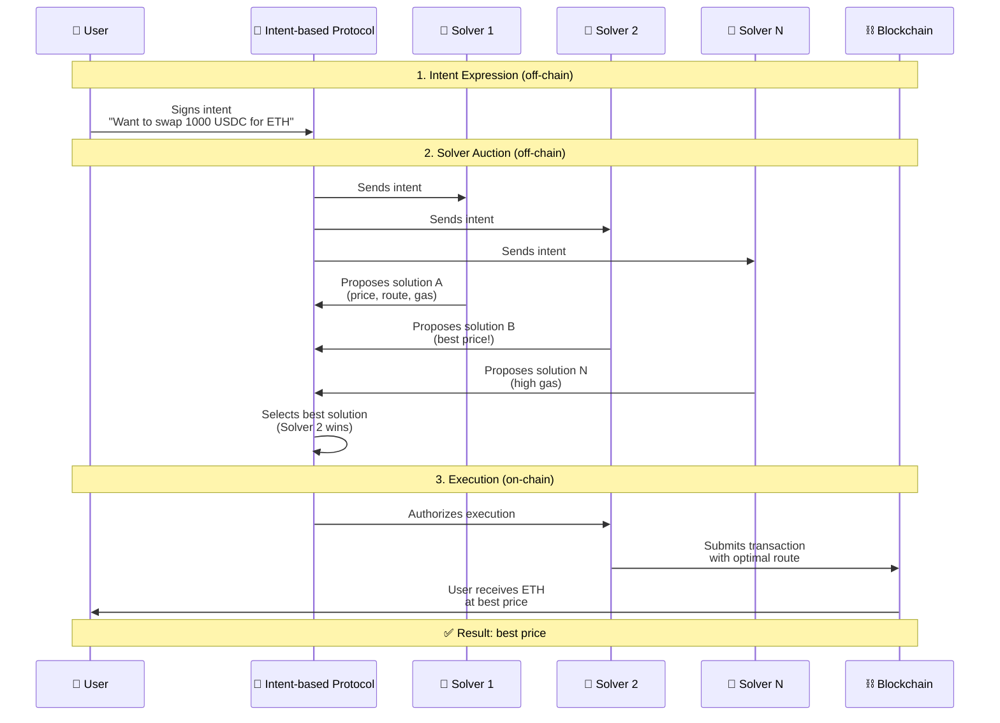

# Intent-Based Protocols

**Автор:** [Алексей Куценко](https://github.com/bimkon144) 👨‍💻

Intent-based протоколы представляют собой новую парадигму взаимодействия с блокчейном, которая кардинально меняет подход к выполнению пользовательских запросов. Вместо детального указания каждого шага, пользователи просто выражают свои намерения (intentions), а специальные участники соревнуются за право найти наилучший способ их реализации.

## Что такое Intent-Based подход?

**Intent (intention)** - это способ сказать блокчейну "что вы хотите получить", а не "как именно это сделать". Это как разница между заказом такси ("довезите меня до аэропорта") и самостоятельным вождением (выбор маршрута, поворотов, полос).

### Сравнение подходов

**Традиционный подход:**
- Пользователь сам выбирает DEX (Uniswap, SushiSwap)
- Сам рассчитывает маршрут обмена
- Сам отправляет транзакцию с конкретными параметрами
- Несет все риски (MEV, проскальзывание, неоптимальные цены)

**Intent-based подход:**
- Пользователь просто выражает желание: "хочу обменять 1000 USDC на ETH"
- Специальные участники (solvers) соревнуются за право найти лучший способ исполнить это `intent`
- Пользователь получает лучший результат без необходимости разбираться в технических деталях

## Общая схема работы Intent-Based протоколов

Все intent-based протоколы работают по похожей схеме:

### Этапы работы

1. **Выражение intent** - пользователь подписывает сообщение о своих торговых целях (off-chain)
2. **Аукцион solvers** - специальные участники соревнуются за право исполнить intention
3. **Исполнение** - победивший solver выполняет intent наилучшим способом

## Примеры Intent-Based протоколов

Intent-based подход активно развивается в разных сферах DeFi.

Примеры таких протоколов:

- **CoW Protocol** - batch auctions с P2P matching
- **1inch Fusion** - gasless свапы с network resolvers
- **UniswapX** - Dutch auctions с fillers
- **0x Protocol v4** - RFQ с intent-based routing

## Заключение

Intent-based протоколы представляют собой фундаментальный сдвиг в том, как пользователи взаимодействуют с блокчейном. Вместо изучения технических деталей и пошагового указания действий, пользователи просто выражают свои намерения, а специализированные участники находят оптимальные способы их исполнения.

Этот подход решает ключевые проблемы современного DeFi: сложность использования, MEV-атаки, неоптимальные цены и высокие затраты на газ.

По мере развития технологий и стандартизации интерфейсов, intent-based подход может стать основой следующего поколения децентрализованных приложений. Это превратит DeFi из сложной технической области в интуитивный инструмент, доступный широкой аудитории, что откроет путь к массовому принятию децентрализованных финансов.

## Ссылки

- [Intent-Based Architectures - Paradigm](https://www.paradigm.xyz/2023/06/intents)
- [The power of intents](https://medium.com/@Flytrade/the-power-of-intent-based-aggregation-9fe680873d04)
- [1inch Fusion Documentation](https://docs.1inch.io/docs/fusion-swap/introduction)
- [CoW Protocol - Batch Auctions](https://docs.cow.fi/cow-protocol/tutorials/arbitrate)