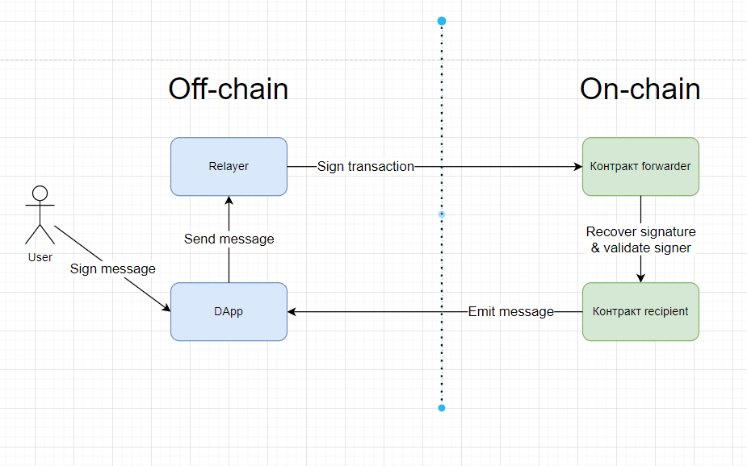

# Meta transactions

Метатранзакция - это обычная транзакция, которая содержит информацию о другой транзакции, которую подписывает первоначальный подписант. Другими словами, это транзакция, второго уровня, цель которой выполнить первоначальную транзакцию. Часто используется для замены кошелька, который будет оплачивать газ за транзакцию.

**Идея реализации проста**: третья сторона отправляет транзакции пользователя и оплачивает стоимость газа. Такую третью сторону называют **relayer**.

Схема выглядит так:



Описать происходящее на схеме можно следующим образом:

1. **User** подписывает метатранзакцию. По сути это сообщение, содержащее информацию о транзакции, которую он хотел бы выполнить. Если ты еще не читал нашу статью про подписи, то с ней можно ознакомиться [тут](../digital-signature-on-ethereum/README.md).

2. **Relayer** или веб-сервер с кошельком подписывает реальную транзакцию и отправляет ее в блокчейн.

3. **Forwarder**(контракт) проверяет подписи метатранзакции и перенаправляет запрос контракту-получателю.

4. **Recipient**(контракт, который пользователь намеревался вызвать без платы за газ) должен уметь определять личность пользователя, который первоначально запросил транзакцию.

## Варианты использования

**Безгазовые транзакции**.
Первая и основная задача метатранзакций, которая у всех на слуху это сделать транзакции безгазовыми для первичного пользователя. Это не значит, что газ будет бесплатным, это значит, что за газ пользователя будет платить кто-то другой. Это очень актуальная тема для сервисов, где у пользователей нет нативной валюты для оплаты газа и децентрализация не на первом плане. Например, в играх. Для игр игровой процесс имеет первостепенное значение, а упрощение входа для новых игроков очень важно, поэтому игра может оплачивать газ за свой счет.

**Ускорение транзакций**.
Для одного аккаунта сети ограничивают общее количество транзакций в ожидании. Более того транзакции будут выполняться последовательно. Метатранзакции могут решить эту проблему. Чуть более подробнее [тут](https://cryptor.net/tutorial/chto-takoe-retranslyator-tranzakciy-i-kak-rabotaet).

**Конфиденциальность**.
Метатранзакции можно использовать для конфиденциальности. Маскировка вызывающего транзакцию и скрытие получателя токенов. То есть представим классическую задачу "claim rewards". Пользователь вызывает функцию ```claim()``` на смарт-контракте, передает адрес **recipient**(куда вывести вознаграждение) и получает вознаграждение на этот адрес. В этом случае, в блокчейне публично видно адрес инициатора и адрес конечного получателя. Таким образом можно провести связь между адресами **msg.sender** и **recipient**. Чтобы этого избежать, можно применить концепт метатранзакций и таким образом скрыть адрес пользователя, как инициатора. В блокчейн будет виден только адрес **recipient**. А инициатором транзакции будет выступать адрес площадки.

**Онбординг**.
Можно позволить новым пользователям в режиме демо или обучения, предоставить доступ к функционалу децентрализованного приложения. Сделать это можно организовав оплату за газ средствами сервиса, использую концепт метатранзакций.

**Оплата за газ в ERC20**.
Можно реализовать оплату газа для пользователя в ERC20 токене. Сервис будет принимать любой токен в необходимом количестве для оплаты газа. А затем такой сервис от имени своего кошелька вызывает целевые транзакции и оплачивает газ уже в эфире. Особо нужно отметить, что зачастую, в совокупности с метатранзакциями, используется расширение **Permit** для ERC20 токена. Это расширение токена позволяет пользователю давать разрешение на распоряжение своими ERC20 токенами другому адресу через цифровую подпись. Плюс такого подхода заключается в том, что пользователю необязательно наличие нативной валюты сети или дополнительные траты за подписание транзакций на ```approve()```.

## Стандарт ERC-2771

Этот стандарт определяет необходимый минимальный интерфейс для взаимодействия контрактов ```Recipient``` и ```Forwarder```. Доверенный ```Forwarder``` вызывает контракт ```Recipient``` и **должен** добавить адрес подписанта транзакции (20 байтов данных) в конец **msg.data**.

Сам стандарт достаточно подробно и понятно описан [тут](https://eips.ethereum.org/EIPS/eip-2771).

_Важно!_ Стандарт никак не регламентирует контракт ```Forwarder```. За исключением механизма передачи контракту ```Recipient``` адреса первоначального подписанта.

_Важно!_ Теоретически ```Forwarder``` может быть какого угодно формата, поэтому в первую очередь контракт ```Recipient``` должен реализовать функцию установки адреса контракта ```Forwarder```, которому можно доверять.

_Важно!_ Под **msg.sender** будет скрываться не адрес первоначального подписанта, а адрес контракта ```Forwarder```.

Согласно стандарту адрес первоначального подписанта будет передаваться с **msg.data**. Поэтому на контракте ```Recipient``` необходимо достать первоначального подписанта.

```solidity
    function _msgSender() internal view returns (address payable signer) {
        signer = msg.sender;

        if (msg.data.length>=20 && isTrustedForwarder(signer)) {
            assembly {
                signer := shr(96,calldataload(sub(calldatasize(),20)))
            }
        }
    }
```

Библиотека OpenZeppelin предлагает собственную [реализацию контракта ```Recipient```](https://docs.openzeppelin.com/contracts/4.x/api/metatx#ERC2771Context) и [реализацию контракта ```Forwarder```](https://docs.openzeppelin.com/contracts/4.x/api/metatx#MinimalForwarder). Но надо иметь ввиду, что реализация ```Forwarder``` контракта от OpenZeppelin не может быть готовым хорошим решением, так как не реализует всех функций для надежной пересылки данных. Полностью функционирующая система переадресации с хорошими показателями надежности требует большей сложности.


## Проекты, которые реализовали у себя метатранзакции

### Gas Station Network

Это сервис с открытым исходным кодом, который позволяет разработчикам создавать уникальные децентрализованные приложения, где транзакции пользователей могут быть для безгазовыми. Этот проект был реализован при поддержке сообщества Ethereum и проаудирован OpenZeppelin.

GSN — это сеть серверов, называемых ретрансляторами, которые ожидают выполнения транзакций. Каждому ретранслятору платят за каждую транзакцию, размещенную в блокчейне.

Вообще [документация](https://docs.opengsn.org/) GSN достаточно хорошая. Если понадобится понять, как все устроено в коде, то смело иди в [репозиторий](https://github.com/opengsn/gsn). Можно сразу посмотреть на [архитектуру](https://docs.opengsn.org/#architecture) Gas Station Network.

Написание [контрактов](https://docs.opengsn.org/contracts/) с поддержкой GSN.

Пример для ознакомления с минимальной реализацией контракта [Recipient](./examples/src/Recipient.sol).
Пример для ознакомления с минимальной реализацией контракта [Paymaster](./examples/src/Paymaster.sol).

Можно посмотреть простое [Demo](https://ctf-react.opengsn.org/). Оно продемонстрирует безгазовые транзакции. Ты можешь поменять флаг, но при этом не будешь платить газ. Правда кошелек Metamask все-таки для этого еще потребуется 😉.

### Больше сервисов

На данный момент существует уже огромное количество сервисов, которые так или иначе поддерживают концепт метатранзакций:
1. [Beaconomy](https://docs.biconomy.io/products/enable-gasless-transactions). Первый в списке sdk по работе с метатранзакциями. Предлагает несколько способов реализации безгазовых транзакций. В том числе EIP-2771. Является интересной альтернативой GSN.
2. [Gelato](https://docs.gelato.network/developer-services/relay). Предлагает свою абстракцию над транзакциями при помощи своего собственного SDK. Вообще подход ребят к продукту заключается в предоставление удобного SDK, который позволит не лезть в низкоуровневые особенности блокчейнов. На данный момент они поддерживают 17 сетей EVM.
3. [Infura](https://docs.infura.io/infura/features/itx-transactions/itx-meta-transactions). У них есть свой механизм Infura Transactions (ITX) is a simplified way to send Ethereum transactions. По сути это некий API. Для этого API они пытаются применить подход метатранзакций.
4. [Defender от OpenZeppelin](https://docs.openzeppelin.com/defender/relay). Учитывая, что ретрансляторы Defender являются универсальными, вы также можете использовать их для любых других типов метатранзакций, таких как ретрансляция безгазовых переводов ERC20 с использованием EIP2612 или EIP3009.

## Links

1. [Что такое метатранзакции?](https://tgdratings.com/ru/glossary/metatransaction/) Маленькая статья простыми словами.
2. [Gas-free transactions: Meta Transactions explained](https://medium.com/coinmonks/gas-free-transactions-meta-transactions-explained-f829509a462d)
3. [ERC-2771](https://eips.ethereum.org/EIPS/eip-2771)
4. [Неплохо написано про метатранзакции в wiki от Polygon](https://wiki.polygon.technology/docs/develop/meta-transactions/meta-transactions/)
