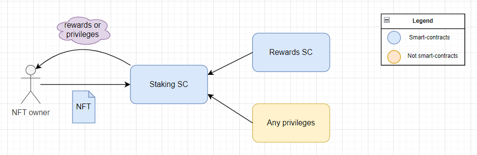

# NFT staking

**Автор:** [Павел Найданов](https://github.com/PavelNaydanov) 🕵️‍♂️

_Опр!_ **Staking NFT** - способ заблокировать активы (NFTs) на смарт-контрактах с возможностью получения вознаграждения или других привилегий протокола без необходимости продажи или передачи NFT другому пользователю.

Множество проектов ищут способы принести пользу владельцам NFT и пытаются стимулировать долгосрочное владение или вовлечение в экосистему проекта. Для таких проектов стейкинг NFT может стать хорошим инструментом привлечения новых участников. А для держателей NFT способом получать пассивный доход.

## Как работает стейкинг NFT?

Обычно стейкинг NFT требует реализации следующих смарт-контрактов:
1. **Смарт-контракт NFT**. Предмет стейкинга.
2. **Смарт-контракт Staking**. Хранилище смарт-контрактов NFT.
3. **Смарт-контракт для вознаграждений** (rewards). Это может быть токен любого стандарта: ERC-20, ERC-721, ERC-1155.

Для того, чтобы застейкать **NFT** владелец должен передать ее во владение смарт-контракту **Staking**. После этого ему будет доступно вознаграждение согласно правилам, описанным на смарт-контракте **Staking**. Например, за одну "застейканную" **NFT** на срок один год, пользователь получит ERC-20 токен эквивалентный 100\$.



Вознаграждение или привилегии являются стимулом, который должен привлекать владельцев "стейкать" NFT за место простого владения.

_Важно!_ Реализация частных случаев может предоставлять off-chain привилегии за место вознаграждения в токене. Например, пропуск на блокчейн конференцию. Это означает, что смарт-контракт **Rewards** может отсутствовать в данной схеме. Думаю другие вариации ты додумаешь сам. 😅

## Как рассчитывается вознаграждение за стейкинг?

Когда вознаграждение может быть измерено, то есть имеет количественную характеристику, например, сумма в ERC-20 токене, необходимо иметь прозрачную **систему** начисления вознаграждения.

Подобная система может зависеть от нескольких факторов:
- **Продолжительность стейкинга**. Чем дольше NFT "застейкана", тем больше потенциальное вознаграждение.
- **Процентная ставка**. Различные платформы могут предлагать различные формы начисления процентов: фиксированную ставку, переменные ставки, ставки, зависящие от активности или выполнения специальных заданий и тому подобное.
- **Общая сумма стейкинга**. Общее количество "застейканных" NFT может влиять на размер вознаграждения.
- **Редкость или свойство NFT**. Различные показатели NFT могут влиять на размер вознаграждения. Например, редкая NFT может приносить вознаграждения больше, чем обычная.
- **Комиссия сети**. Оплата за газ для того, чтобы забрать вознаграждение может свести на нет любой пассивный доход.

## Плюсы и минусы

Как и все в этом мире, стейкинг NFT несет с собой плюсы и минусы.

|Плюсы|Минусы|
|-----|------|
|**Пассивный доход**. За стейкинг NFT можно получать активы.|**Непостоянные потери (impermanent loss)**. Можно упустить немедленную прибыль.|
|**Диверсификация**. Позволяет разнообразить портфель активов владельца.|**Потенциальный риск потери**. NFT, физически, на время стейкинга, меняет владельца. Вернуть обратно ее можно, только если это позволяет смарт-контракт **Staking**.|
|**Повышение вовлечения**. Предполагает активное участие в жизни проекта, что развивает чувство единства и способствует развитию проекта. | **Снижение вовлечения**. Непрозрачность системы вознаграждения или большой срок стейкинга с маленьким профитом может способствовать потери интереса владельца NFT к проекту. |
|**Добавленная стоимость**. Стейкинг может давать дополнительную полезность или функционал, повышая ценность NFT и ее владельца. |**Недостаток ликвидности**. Стейкинг на определенный период будет означать невозможность продать NFT в ближайшее время.|

## Чуть-чуть solidity кода

В этом разделе я опишу четыре примера смарт-контракта, которые решают различные задачи стейкинга NFT.

_Важно!_ Смарт-контракты созданы в учебных целях, аудит не проходили.

### Самый простой стейкинг NFT

Для реализации самого простого стейкинга NFT потребуется один смарт-контракт, назову его `SimpleStaking.sol`, который будет регламентировать три основных процесса:
- передать NFT на контракт
- забрать NFT с контракта
- проверить, что контракт владеет NFT.

В момент передачи NFT контракту нужно записать реального владельца NFT, чтобы потом, только он, смог вернуть ее себе обратно. Для этого я объявил две переменных:
```solidity
/// @notice Хранение адресов владельцев для застейканных NFT
mapping(uint256 tokenId => address stakeholder) private _stakes;

/// @notice Хранение количества застейканных NFT для каждого адреса
mapping(address stakeholder => uint256 counter) private _stakedNftBalance;
```

Чтобы передать NFT контракту, владелец должен вызвать функцию `stake()`.
```solidity
function stake(uint256 tokenId) external {
    /// Перевод NFT от владельца контракту
    _nft.safeTransferFrom(msg.sender, address(this), tokenId);

    /// Запись данных о владельце
    _stakes[tokenId] = msg.sender;
    _stakedNftBalance[msg.sender] += 1;
}
```

_Важно!_ Перед вызовом функции `stake()`, владельцу необходимо вызвать функцию `approve()` на контракте NFT и указать адрес контракта `SimpleStaking.sol`

Чтобы забрать NFT обратно, владелец должен вызвать функцию `unstake()`.

```solidity
function unstake(uint256 tokenId) external checkUnstake(tokenId) {
    /// Перевод NFT от контракта владельцу
    _nft.safeTransferFrom(address(this), msg.sender, tokenId);

    /// Удаление данных о владельце
    delete _stakes[tokenId];
    _stakedNftBalance[msg.sender] -= 1;
}
```

Подобная логика может позволить реализовать некоторые привилегии пользователям, которые застейкали NFT. Для этого необходимо убедиться, что NFT действительно застейкана через вызов функции `isStaked()`.

```solidity
function isStaked(uint256 tokenId) external view returns (address) {
    return _stakes[tokenId];
}
```

Полный код контракта `SimpleStaking.sol` можно найти [тут](./contracts/src/SimpleStaking.sol).

### Стейкинг с возможностью сменить владельца NFT

Задачи, которые решаются стейкингом NFT, могут быть гораздо сложнее. Например, неплохо иметь возможность **передать право владения застейканной NFT** без снятия ее со смарт-контракта.

Решать подобную задачу можно несколькими способами. Можно реализовать дополнительную функцию `transferOwnership(uint256 tokenId, address owner)` или пойти по пути [Uniswap](https://uniswap.org/), [Compound](https://compound.finance/) и других протоколов выдавая [lp токены](https://academy.binance.com/ru/articles/what-are-liquidity-pool-lp-tokens) для подтверждения права владения.

Мне больше нравится второй вариант, поэтому сделаю его в смарт-контракте с названием `SimpleTransferableStaking.sol`.

Для этого необходимо поменять реализации функций: `stake()` и `unstake()`.

```solidity
function stake(uint256 tokenId) external {
    /// Перевод NFT от владельца контракту
    _nft.safeTransferFrom(msg.sender, address(this), tokenId);

    /// Выдается lp nft
    _lpNft.mint(msg.sender, tokenId);
}
```

```solidity
function unstake(uint256 tokenId) external checkUnstake(tokenId) {
    /// Перевод lp NFT от владельца контракту
    _lpNft.safeTransferFrom(msg.sender, address(this), tokenId);

    /// Перевод NFT от контракта владельцу
    _nft.safeTransferFrom(address(this), msg.sender, tokenId);

    /// Сжигается lp nft
    _lpNft.burn(tokenId);
}
```

Проверить, что NFT застейкана, можно вызвав функцию `ownerOf(tokenId)` на контракте lpNft (вернет адрес владельца) или `ownerOf(tokenId)` на контракте nft (вернет адрес контракта `SimpleTransferableStaking.sol`).

Полный код контракта `SimpleTransferableStaking.sol` можно найти [тут](./contracts/src/SimpleTransferableStaking.sol).

### Стейкинг за вознаграждение

Идем по нарастающей! 😀 Следующим примером стейкинга будет смарт-контракт, который позволит получать разовое вознаграждение за стейкинг NFT на определенный период в ERC-20 токене. Назову такой контракт `StakingWithOneTimeReward.sol`.

Принципиальное различие заключается в том, что вводятся следующие понятия:
- `rewardToken` - это токен, в котором будет выплачиваться вознаграждение
- `_stakeDuration` - это время на которое необходим застейкать NFT
- `_rewardAmountPerNft` - это сумма вознаграждение за одну NFT

Меняем функцию `stake()`. Теперь важно хранить информацию о стейке NFT (время начала и продолжительность).

```solidity
function stake(uint256 tokenId) external {
    /// Перевод NFT от владельца контракту
    _nft.safeTransferFrom(msg.sender, address(this), tokenId);

    /// Запись информации о стейке NFT
    _stakes[tokenId] = StakeInfo({
        owner: msg.sender,
        start: block.timestamp,
        duration: _stakeDuration
    });
}
```

Функция `unstake()` вызывает функцию `_claimReward()` для отправки токена вознаграждения.

```solidity
function unstake(uint256 tokenId) external checkUnstake(tokenId) {
    /// Отправляет вознаграждение владельцу NFT
    _claimReward(msg.sender);

    /// Перевод NFT от контракта владельцу
    _nft.safeTransferFrom(address(this), msg.sender, tokenId);

    /// Удаление данных о стейке
    delete _stakes[tokenId];
}
```

```solidity
function _claimReward(address account) private {
    uint256 value = _rewardAmountPerNft;

    _rewardToken.safeTransfer(account, value);
}
```

Полный код контракта `StakingWithOneTimeReward.sol` можно найти [тут](./contracts/src/StakingWithOneTimeReward.sol).

### Стейкинг за годовое вознаграждение

Последнее усложнение и последний пример смарт-контракта `StakingWithReusableReward.sol`. Позволим владельцу NFT получать за стейкинг NFT вознаграждение, но с возможностью забрать его в любой момент неограниченное количество раз.

Установлю на контракте сумму вознаграждения, которую владелец получит, если одна NFT будет застейкана ровно на один год `_annualRewardAmountPerNft;`. От это суммы будем вычислять вознаграждение для любого периода времени.

Рассчитывать количество вознаграждения (актуализировать его сумму), которое ему причитается необходимо при любом взаимодеиствии владельца NFT со смарт-контрактом. За это будет отвечать модификатор `updateReward()` и приватная функция `_updateReward()`.

```solidity
  modifier updateReward(address stakeholder) {
      _updateReward(stakeholder);

      _;
  }
```

Вешаю модификатор на функции stake(), unstake() и тогда будет сначала рассчитываться заработанное вознаграждение, а потом выполняться действие владельца NFT.

```solidity
function stake(uint256 tokenId) external updateReward(msg.sender) {
    /// Перевод NFT от владельца контракту
    _nft.safeTransferFrom(msg.sender, address(this), tokenId);

    /// Сохранение информации о стейке NFT
    _stakes[tokenId] = msg.sender;

    /// Сохранение информации о накопление вознаграждения
    _stakerRewardInfo[msg.sender].tokenBalance += 1;
    _stakerRewardInfo[msg.sender].lastTimeRewardUpdated = block.timestamp;
}
```

```solidity
function unstake(uint256 tokenId) external updateReward(msg.sender) {
    _unstake(tokenId);
}
```

Расчет вознаграждения будет очень простым. Сумма вознаграждения рассчитывается за определенный период времени на базе суммы вознаграждения за один год "стейка" NFT.

```solidity
function _calculateReward(uint256 nftAmount, uint256 startTime, uint256 endTime)
    private
    view
    returns (uint256 rewardAmount)
{
    /// Количество NFT * годовую сумму вознаграждения
    uint256 rewardPerYear = (nftAmount * _annualRewardAmountPerNft) / MULTIPLIER;

    /// Сумма за определенный период времени
    rewardAmount = (rewardPerYear * (endTime - startTime)) / SECS_PER_YEAR;
}
```

Полный код контракта `StakingWithReusableReward.sol` можно найти [тут](./contracts/src/StakingWithReusableReward.sol).

## Примеры приложений

### Zookeeper

[Zookeeper](https://www.zookeeper.finance/) - это геймефицированное децентрализованное приложение для обеспечения экосистемы ликвидностью. Для добычи ликвидности использует специальную ZooNFT. NFT можно заработать, купить или выиграть с помощью различных механизмов в приложении. Стейкинг этой NFT предоставляет уникальные возможности получения вознаграждения.

### MOBOX (MBOX)

[MOBOX](https://www.mobox.io/home/#/) - это метавселенная, которая сочетает в себе фарминг и NFT. Позволяет стейкать NFT и получать вознаграждение в собственной валюте. NFT в рамках вселенной называются MOMO. Управляется сообществом. Команда стремиться достичь максимальной прозрачности, поэтому публикует [адреса](https://faqen.mobox.io/mobox-platform/smart-contracts) своих смарт-контрактов.

### Binance Fan Token Platform

[Binance Fan Token Platform](https://www.binance.com/en/fan-token?utm_source=fan-token) - уникальный сервис, который олицетворяет фанатскую базу популярных футбольных клубов, предоставляя пользователям возможность присоединится к своей любимой команде.

Платформа реализовала под-сервис NFT PowerStation для "подзарядки NFTs", который позволяет получать вознаграждения в виде токенов фанатов Binance. Вознаграждение распределяется из заранее определенного пула токенов. Оно будет распределяться в зависимости от различных факторов: тип NFT, количества участников и так далее. Чем дольше NFT "заряжается", тем выше будут награды. Вознаграждение рассчитываются почасово.

## Вывод

Стейкинг и NFT - две важные концепции в мире web3. Зачастую эти две технологии используются отдельно, однако стейкинг NFT позволяет переосмыслить использование NFT и создать новые варианты использования.

## Links

1.[ What Is NFT Staking and How Does It Work?](https://academy.binance.com/en/articles/what-is-nft-staking-and-how-does-it-work)
2. [NFT Staking Explained: Earning Passive Income with NFTs](https://coindcx.com/blog/cryptocurrency/nft-staking-explained/)
3. [Staking rewards](https://solidity-by-example.org/defi/staking-rewards/). Это не про NFT, но про получение вознаграждения.