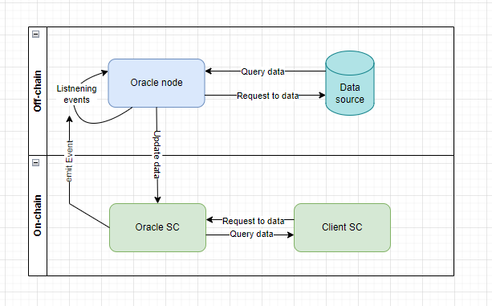
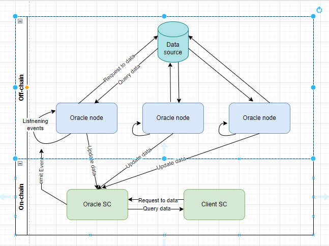
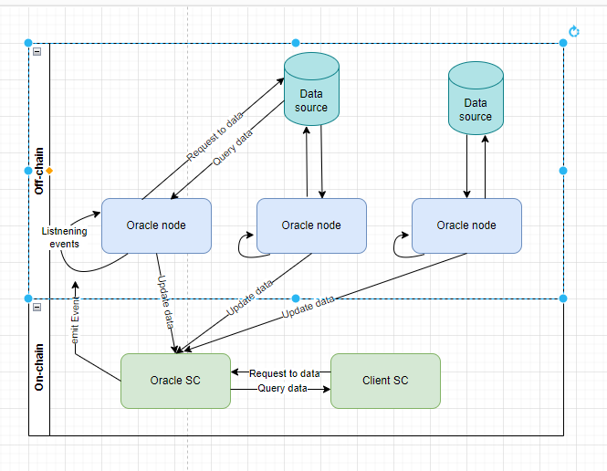
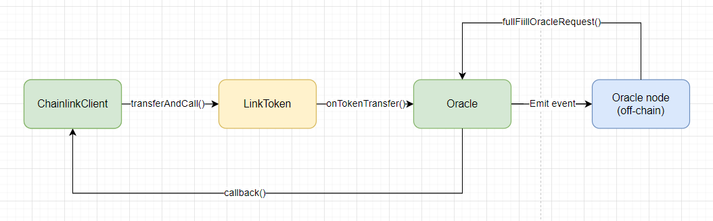
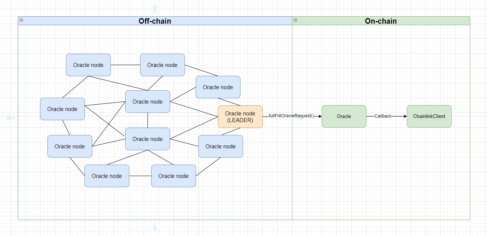

# Oracles

> Оракул — это сервис(или устройство), который предоставляет набор данных для использования в блокчейн. После размещения данных в сети, они становятся доступны для использования на смарт-контрактах.

По сути, оракулы являются мостом между двумя мирами. Между миром децентрализованным и централизованным. Между смарт-контрактом и сторонним поставщиком данных. Основная задача оракулов - это предоставление надежной информации для смарт-контрактов.

## Зачем нужны оракулы?

Блокчейн Ethereum спроектирован так, чтобы быть полностью **детерминированным**. Это означает, что если кто-то загрузит историю сети и будет ее воспроизводить, то сеть всегда будет проигрывать одно и тоже состояние. Детерминизм необходим для того, чтобы узлы блокчейна могли прийти к консенсусу. Для реализации механизма консенсуса сеть является закрытой и не может получать информацию извне.

Таким образом оракулы должны решать следующую проблему - безопасное получение off-chain данных для смарт-контрактов в сети. Важно отметить, что это не должно противоречить основам децентрализации сети.

Подробнее [тут](https://ethereum.org/en/developers/docs/oracles/#why-do-smart-contracts-need-oracles).

Можно выделить несколько ключевых предметных областей, где используются оракулы:
1. **Финансы**. Всем продуктам сферы финансов требуются надежные потоки данных для выполнения операций в сети.
2. **Страхование**. Оракулы служат для проверки наступления страховых случаев.
3. **Грузоперевозки**. Например, отслеживание GPS данных.
4. **Кредитование и стейблкоины**. Продуктам этой сферы нужен доступ к информации о стоимости залога для принятия решения о ликвидации.
5. **Прогнозы**. Оракулы служат для расчетов вне сети. Так как для совершения прогноза необходимо обработать огромное количество информации и делать это on-chain дорого.

Подробнее про варианты использования и не только можно и даже нужно прочитать в хорошей статье Julien Thevenard ["Decentralized Oracles: a comprehensive overview"](https://medium.com/fabric-ventures/decentralised-oracles-a-comprehensive-overview-d3168b9a8841)

## Устройство

Для реализации прослойки между off-chain и on-chain оракул является составным и обычно включает в себя две части: смарт-контракт и сервис вне сети.

Полный шаблон реализации оракула состоит из четырех основных компонентов:
1. **Client SC**. Смарт-контракт, которому необходимы off-chain данные
2. **Oracle SC**. Смарт-контракт, который будет агрегировать в себе off-chain данные в сети
3. **Data Source**. Поставщик off-chain данных
4. **Oracle node**. Программное решение, которое является вспомогательным связующим звеном между **Data Source** и on-chain пространством



Общий процесс работы оракула можно описать следующим алгоритмом:
1. Исходный смарт-контракт(**Client SC**) запрашивает набор off-chain данных у смарт-контракта оракула(**Oracle SC**).
2. Оракул(**Oracle SC**) бросает событие за пределы блокчейна. Событие будет обозначать необходимость получения данных.
3. Промежуточное решение нода(**Oracle node**) постоянно слушает события от **Oracle SC** и отлавливает событие о необходимости поставки off-chain данных.
4. Нода(**Oracle node**) получает данные из источника данных(**Data source**) и обновляет данные на смарт-контракте оракула(**Oracle SC**)
5. Обновление данных на смарт-контракте оракула(**Oracle SC**) автоматически проводит обратный вызов для исходного смарт-контракта(**Client SC**)

Таким образом мы можем получить off-chain данные, которые будут являться частью сети. За запись таких данных будет отвечать специальный смарт-контракт оракул(**Oracle SC**). Пример реализации смарт-контракта оракула(**Oracle SC**) можно посмотреть [тут](./examples/src/Oracle.sol). Пример использования такого оракула в контракте **Client SC** [тут](./examples/src/Client.sol).

Однако, не все так просто! Подумай, какую опасность ты здесь видишь? Что может стать узким местом? Конечно, **oracle node**. Согласно схеме, в случае непредвиденного отказа **oracle node** смарт-контракт оракула(**Oracle SC**) никогда не сможет получить данные, записать их в сеть и передать исходному смарт-контракту(**Client SC**). Это значит, что запрос на данные останется без ответа. Решить эту проблему можно добавив несколько **oracle nodes**, которые смогут подстраховать друг друга. Смотри схему ниже.



Теперь мы можем добавить логику на контракте оракула(**Oracle SC**) и обрабатывать ответ от любого из доверенных узлов оракула(**oracle node**). Как говорится, кто первый пришлет нам данные, тот молодец. Но на сколько спокойнее тебе стало теперь? Насколько мы можем доверять первому ответившему узлу(**Oracle node**)? Что если один из узлов(**Oracle node**) будет присылать данные из неверного источника, как на схеме ниже.



Это можно решить добавив дополнительную логику для контракта оракула(**Oracle SC**). Сделаем так, чтобы контракт оракула(**Oracle SC**) ждал ответы от всех узлов(**Oracle node**). И например, аппроксимировал данные, выбирая среднее или наиболее часто встречающееся значение.

_Важно!_ Такой подход позволяет использовать даже несколько источников данных с целью децентрализации самого источника данных(**Data Source**).

Однако можно снова возмутиться. Допустим источник данных(**Data source**) мы децентрализуем, а как же сами узлы оракула(**oracle nodes**)? Как сделать так, чтобы им можно было доверять на 100%? Ответ на этот вопрос есть. Мы можем сделать децентрализованную сеть оракулов. Название такой сети DON(decentralized oracle networks). Подробнее про DON [тут](https://medium.com/chainlink-community/chainlink-the-decentralized-oracle-70f3bc95007b) на примере [Chainlink](https://chain.link/).

_Важно!_ Оракулы сами по себе являются потенциально уязвимым местом. Только совокупность мер безопасности может минимизировать риск взлома оракула. Несколько **Data Source**, сеть **oracle nodes**, изоляция **oracle nodes** друг от друга, шифрование передаваемых данных и многие другие приемы и подходы необходимо использовать, чтобы снизить риск злонамеренных действий в отношении оракула.

_Важно!_ Не стоит забывать про операционные расходы на обратный вызов функций смарт-контракта оракул(**Oracle SC**). Кто-то должен будет покрывать операционные расходы работы оракула.

## Типы оракулов

Можно придумать несколько способов по которым возможно сгруппировать оракулы. Ниже покажу основные подходы.

Всех оракулов можно разделить на две группы по уровню безопасности:
1. **Централизованные**. Часто такими оракулами владеют в рамках одной компании и одного продукта. С таким решением мы доверяем данным, которые будут поставлены таким оракулом.
2. **Децентрализованные**. Используется DON или сеть децентрализованных оракулов.

Также можно разделить оракулов по способу взаимодействия off-chain и on-chain составляющих:
1. **Immediate read oracles**. Оракул всегда владеет актуальной информацией. Информация обновляется с заданной периодичностью. Можно моментально прочитать данные с такого оракула.
2. **Publish-subscribe oracles**. В основе такого оракула лежит паттерн Observer. По сути это механизм подписки. Можно подписаться на данные из оракула и получать данные на момент их обновления в самом оракуле.
3. **Request-response oracles**. Оракул основан на системе запрос-ответ.

По виду работы с данными:
1. **Input oracles**. Такой оракул извлекает off-chain данные и записывает их в сеть для использования на смарт-контрактах. Например, такой оракул может поставлять информацию о стоимости валют в сеть.
2. **Output oracles**. Позволяет отправлять от имени смарт-контрактов команды автономным системам. Эти команды могут запускать определенные действия. Например, информирование банковского сервиса о совершение платежа.
3. **Cross-chain oracles**. Такие оракулы могут считывать и записывать информацию между разными блокчейнами. Например, можно реализовать задачу межсетевого учета объема определенных активов.
4. **Compute-enabled oracles**. Такие оракулы служат для выполнения вычислительной работы вне сети из-за технических, юридических или финансовых ограничений. Например, генерация случайного числа.

## Проблема оракулов

Можно ли доверять off-chain данным? Насколько эти данные целостные и всегда доступны? На эти вопросы необходимо ответить прежде чем начать использовать существующий оракул.

При разработке необходимо решить основную проблему, которая заключается в том, что делать, если оракул скомпрометирован. Ведь в таком случае смарт-контракт, на который он опирается, также будет скомпрометирован. Это часто называют **главной проблемой Oracle**. Нужно любыми доступными способами не допустить подобной ситуации. Хороший опыт собрала компания Chainlink в реализации безопасных и надежных оракулов.

Примеры некоторых популярных уязвимостей можно посмотреть [тут](https://samczsun.com/so-you-want-to-use-a-price-oracle/).

## Chainlink

Как я сказал выше, использование одного оракула — это огромный риск. Со своей стороны chainlink предлагает сеть децентрализованных оракулов, которые образуют фантастическую экосистему для получения данных из-за пределов сети. Сегодня это наиболее широко распространенное решение среди оракулов.

В настоящее время существует большое количество **price feeds**, которые работают в ряде сетей блокчейнов(Ethereum, Polygon, BSC, Avalanche и т.д.). По мимо **price feeds** chainlink предоставляет не только децентрализованные потоки данных, но и широкий спектр безопасных сервисов вычислений вне сети. Например, **VRF**(генерация случайного числа), **Keepers**(автоматизация) и другие различные формы вычислений вне сети.

Оракулы chainlink могут быть разделены на две группы:
1. Проверенные на безопасность командой chainlink с публичными идентификаторами.
2. Непроверенные на безопасность. Могут управляться, как известными, так и неизвестными организациями.

_Важно!_ Чтобы стимулировать оракулов вести себя добросовестно в сети разработана специальная система репутации. Система репутации обеспечивает дополнительную безопасность за счет подотчетности действий оракулов. Оракулы с низким рейтингом могут быть удалены из сети.

### External Adapters

Внешние адаптеры — это службы, с которыми Chainlink взаимодействует через свой API с применением простой спецификации JSON.

Взаимодействовать с внешними адаптерами можно прямо из solidity кода и не только.

Для взаимодействия из solidity кода необходимо воспользоваться контрактом [ChainlinkClient](https://github.com/smartcontractkit/chainlink/blob/master/contracts/src/v0.8/ChainlinkClient.sol). Наследоваться и использовать функции ```buildChainlinkRequest()``` и ```sendChainlinkRequest()```

```solidity
function requestPrice(string coin, string market) public returns (bytes32 requestId) {
  Chainlink.Request memory req = buildChainlinkRequest(SPEC_ID, this, this.fulfill.selector);

  req.add("endpoint", "mwa-historic");
  req.add("coin", coin);
  req.add("market", market);
  req.add("copyPath", "data.-1.1");
  req.addInt("times", 100);

  requestId = sendChainlinkRequest(req, oraclePayment);
}
```

Подробнее про внешние адаптеры можно почитать [тут](https://docs.chain.link/chainlink-nodes/external-adapters/external-adapters).

### Basic request model

Базовая модель запроса раскрывает секрет модели взаимодействия с внешними адаптерами, с которыми я познакомил тебя выше.

Согласно схеме от Chainlink базовая модель очень похожа на общие схемы устройства оракулов. Про общую схему я также говорил выше. Отличительной чертой является участие в модели собственного токена [Link](https://docs.chain.link/resources/link-token-contracts).



Расшифровать схему можно следующим образом:

1. **Контракт ChainlinkClient**. На контракте инициируется transfer **Link** токена согласно стандарту [ERC-1363](https://eips.ethereum.org/EIPS/eip-1363)(это стандарт про transferAndCall).
2. **Контракт Oracle**. Принимает токены и реализует интерфейс transferAndCall. Согласно интерфейсу вызывает собственную функцию ```oracleRequest()```. Эта функция бросает событие ```OracleRequest``` за пределы блокчейна. Это событие будет отслежено на **oracle node**.
3. **Oracle node**. Проводит вычисление или запрос к данным и вызывает функцию ```fulfillOracleRequest()``` на контракте **Oracle**
4. **Контракт Oracle**. Делает обратный вызов ``callback()`` и поставляет запрашиваемые данные контракту **ChainlinkClient**.

Подробнее про этот процесс можно прочитать в [официальной документации chainlink](https://docs.chain.link/architecture-overview/architecture-request-model?parent=gettingStarted).

_Важно!_ C версии chainlink 0.7 контракт **Oracle** заменен на контракт **Operator** и является рекомендованным. Контракт **ChainlinkClient** в новой версии поддерживает запросы и к **Oracle**, и к **Operator**. Для этого реализованы функции ```sendChainlinkRequest()``` и ```sendOperatorRequest()```.

Преимущества контракта **Operator** перед **Oracle**:
1. Отменено ограничение размера ответов от **oracle node**. Раньше ответ был ограничен bytes32.
2. Деплой. Чтобы развернуть контракт **Oracle** для каждого узла необходимо было вручную скомпилировать и задеплоить контракт в сеть. Поэтому для контракта **Operator** добавили контракт **OperatorFactory**.
3. Гибкая система финансирования своих адресов. Можно использовать несколько EOA аккаунтов на **chainlink nodes**. Это позволяет настраивать несколько стратегий отправки обратных транзакций.

### Обзор контрактов

- **ChainlinkClient**. Это родительский контракт, который позволяет смарт-контрактам получать данные от оракулов. Он доступен в [библиотеке смарт-контрактов Chainlink](https://github.com/smartcontractkit/chainlink/blob/master/contracts/src/v0.8/ChainlinkClient.sol). Понадобится наследоваться от этого контракта, чтобы безопасно сделать запрос на получение данных к контракту **Oracle** или **Operator**.

- **LINK Token**. Это [токен](https://github.com/smartcontractkit/chainlink/blob/master/contracts/src/v0.4/LinkToken.sol), совместимый с ERC-677 для реализации ```transferAndCall``` механизма. Имеет три основных функции: оплата за работу для **chainlink nodes**, механизм вознаграждения для оракулов, форма безопасности, когда оракулы оставляют Link токен в качестве залога(гарантия честной работы).

- **Oracle Contract**. [Контракт](https://github.com/smartcontractkit/chainlink/blob/master/contracts/src/v0.6/Oracle.sol), который служит мостом для **oracle node** в мир блокчейн. Принимает запрос от **ChainlinkClient** контракта и транслирует его для **oracle node**. После получения данных от **oracle node** делает вызов клиентского смарт-контракта и доставляет до него данные.

- **Operator Contract**. Новая [версия](https://github.com/smartcontractkit/chainlink/blob/develop/contracts/src/v0.7/AuthorizedReceiver.sol) контракта Oracle. В основном аналогичен контракту **Oracle** c небольшими улучшениями.

- **AggregatorV3Interface**. [Интерфейс](https://github.com/smartcontractkit/chainlink/blob/develop/contracts/src/v0.6/interfaces/AggregatorV3Interface.sol) при помощи которого можно взаимодействовать с контрактом, который агрегирует данные. Пример использования контракта Aggregator для получения стоимости токена можно посмотреть [тут](/concepts/oracles/examples/src/PriceConsumer.sol).

### Off-Chain Reporting - OCR

Это шаблон оракула, который повышает децентрализацию и масштабируемость сети chainlink. Строится на основе базовой модели запроса(Basic Request Model). Базовая модель позволяет поставить данные из одного **chainlink node** в сеть. В свою очередь OCR использует несколько **chainlink nodes**, позволяя им связываться напрямую через одноранговую сеть(P2P) с последующей агрегацией данных вне сети без каких-либо затрат.



Во время реализации процесса получения данных из **chainlink nodes** запускается облегченный алгоритм консенсуса, который следит за поставкой данных и проверяет подпись каждого узла. Среди всех **chainlink nodes** выбирается лидирующий узел, который будет управлять протоколом и собирать данные со всех остальных узлов. В конце **LEADER** сделает одну результирующую транзакцию с агрегированными данными.

Подробнее [тут](https://docs.chain.link/architecture-overview/off-chain-reporting?parent=gettingStarted).

### Chainlink node

Управление **chainlink node** позволит тебе стать частью сети и поможет создавать гибридные смарт-контракты, предоставляя им доступ к реальным off-chain данным.

Хороший [гайд](https://docs.chain.link/chainlink-nodes/v1/running-a-chainlink-node) по работе с **chainlink node**. Ты сможешь развернуть **chainlink node** локально, развернуть контракт **Operator** в тестовой сети, сделать первый запрос на локально развернутый узел и получить от него ответ.

### Chainlink продукты и услуги

Благодаря собственным возможностям сети chainlink предоставляет широкий спектр услуг оракула для смарт-контрактов:

1. **Price feeds**. [Источник данных](https://docs.chain.link/data-feeds/) финансового рынка. Включает в себя курсы криптовалют, стейблкоинов, товаров и индексов.
2. Любой **APY**. Позволят интегрировать смарт-контракты с любым API или источником данных вне сети. Например для получения данных о погоде. Подробнее [тут](https://docs.chain.link/any-api/introduction).
3. **Randomness**. [Verifiable Random Function(VRF)](https://docs.chain.link/vrf/v2/introduction) предоставляет безопасную возможность смарт-контрактам интегрировать генерацию случайного числа, которым невозможно манипулировать ни оракулу, ни разработчикам, ни конечным пользовтаелям.
4. **Asset Collateralization** [PoR или доказательство резерва](https://chain.link/education-hub/proof-of-reserves) позволяет смарт-контрактам проверять информацию о текущем обеспечение активов в сети.
5. **Chainlink function**. [Functions](https://docs.chain.link/chainlink-functions) предоставляет смарт-контрактам доступ к вычислительной инфраструктуре с минимальным доверием.
6. **Keepers**. [Keepers](https://docs.chain.link/chainlink-automation/introduction/) позволяет автоматизировать внутрисетевые транзакции на основе заранее определенных условий.
7. **Валидаторы 2-го уровня**. Могут предоставить услуги проверки для решений масштабирования блокчейнов 2-го уровня. Например Arbitrum Rollups, который включает в себя вычисления вне сети, путем создания пакетов транзакций.
8. **Межсетевая коммуникация**. Могут передавать данные из одной среды блокчейн в другую.

## А есть кто кроме chainlink?

1. **Witnet**. [Witnet](https://witnet.io/) это децентрализованный оракул для связи смарт-контрактов с реальным миром. Работает на собственной цепочке блоков и полагается на собственный токен WIT.
2. **UMA Oracle**. [UMA](https://docs.uma.xyz/protocol-overview/how-does-umas-oracle-work) - оптимистичный оракул, который позволяет смарт-контрактам быстро получать любые данные. Имеет свою собственную систему разрешения споров и механизма проверки данных.
3. **Tellor** - это прозрачный и не требующий разрешений [протокол оракула](https://tellor.io/) для вашего смарт-контракта, позволяющий легко получать любые данные, когда это необходимо.
4. **Band Protocol**. Это [кроссчейн-платформа](https://www.bandprotocol.com/) оракула данных, которая объединяет и связывает реальные данные и API со смарт-контрактами
5. **Provable**. Это [протокол](https://provable.xyz/), который соединяет децентрализованные приложения блокчейна с любым внешним API и использует доказательства TLSNotary, Trusted Execution Environments (TEE) и безопасные криптографические примитивы, чтобы гарантировать подлинность данных.
6. **Pyth network**. Это [оракул](https://pyth.network/), который реализует неклассическую модель поставки данных в каждую сеть. Модель называется "On-Demand Updates". Обновление по запросу. Это подразумевает возможность обновлять данные в сети любым пользователям.
7. **Paralink**. [Paralink](https://paralink.network/) предоставляет децентрализованную платформу оракула с открытым исходным кодом для смарт-контрактов, работающих на Ethereum и других популярных блокчейнах.

Рейтинг оракулов можно посмотреть на [coinmarketcap](https://coinmarketcap.com/view/oracles/). При выборе оракула глубоко изучи функциональные возможности сервиса. Но советую обратить внимание на **Volume** и **Market Cap** параметры в рейтинге оракулов. Это должно тебя подтолкнуть сделать правильный выбор в пользу Chainlink.

## Примеры использования оракулов в реальной жизни

1. [Compound use chainlink](https://docs.compound.finance/v2/prices/)
2. [Средневзвешенные цены от Uniswap](https://docs.uniswap.org/contracts/v2/concepts/core-concepts/oracles). Подробнее про это можно найти в нашей отдельной небольшой [статье](./twap.md)
3. [Oracle module](https://docs.makerdao.com/smart-contract-modules/oracle-module)

Если тебе все еще недостаточно примеров, то можно найти больше 77+ вариантов использования [тут](https://blog.chain.link/smart-contract-use-cases/).

# Links

1. [Oracles](https://ethereum.org/en/developers/docs/oracles/)
2. [Сборник шаблонов и лучших практик для языка программирования смарт-контрактов Solidity](https://fravoll.github.io/solidity-patterns/oracle.html)
3. [Implementing a Blockchain Oracle on Ethereum](https://medium.com/@pedrodc/implementing-a-blockchain-oracle-on-ethereum-cedc7e26b49e)
4. [Smart Contract Security Guidelines #3: The Dangers of Price Oracles](https://blog.openzeppelin.com/secure-smart-contract-guidelines-the-dangers-of-price-oracles/). Я бы не сказал, что эта статья про безопасность. Здесь ставятся требования к оракулу и разбираются общие принципы популярных вариантов оракулов.
5. [Completing The God Protocols: A Comprehensive Overview of Chainlink in 2021](https://smartcontentpublication.medium.com/completing-the-god-protocols-a-comprehensive-overview-of-chainlink-in-2021-746220a0e45). Это большая статья, ее можно прочитать всю, но здесь неплохо рассказано про оракулы от chainlnk.