## Terms
### Funding fee
Funding fee - это периодический платеж между трейдерами с длинными (лонг) и короткими (шорт) позициями на рынке бессрочных фьючерсов, который помогает удерживать цену фьючерса близко к реальной рыночной цене актива. Если ставка положительная, лонги платят шортам; если отрицательная, шорты платят лонгам. Биржа не получает эти деньги, они передаются напрямую между трейдерами.

### Perpetual swap

Perpetual swap - это тип производного контракта, который позволяет спекулировать на цену актива без необходимости исполнять этот контракт.

Альтернатива: это ставка на направление цены криптовалюты. Если цена движется в том же направление, что и ставка, то вы можете получить профит. Если наоборот, то потерять активы. Отличие от настоящего свопа, что вы не обмениваете настоящие токены, вы просто делаете ставку на направление цены.

Вот эти ставки и называются **позицией**. Позиции не имеют срока истечения.

Перед открытием позиции ты вносишь коллатерал. Это токен, который должен будет покрывать ваши потери.

### Long и Short

Ставка на то, что цена вырастет - Long
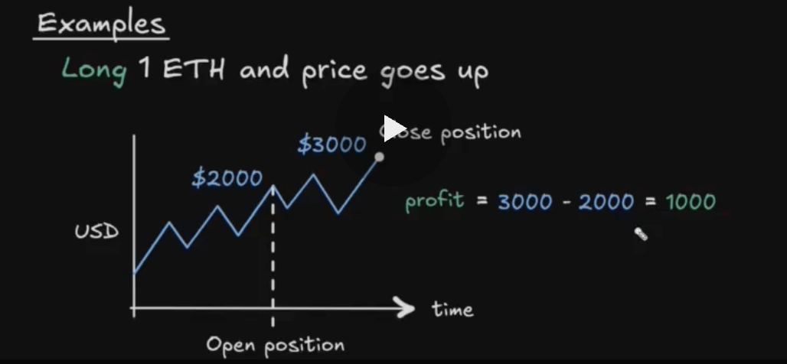

Ставка на то, что цена упадет - Short

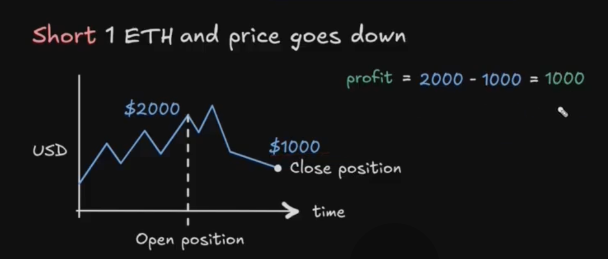

### Leverage

Leverage - это открытие позиции которая в x раз превышает залог в USD. Цель leverage усиливать profit and loss
Ex:
1. collateral = 1000 USDC = $1000
2. 2x leverage => position size = 2 * 1000 USDC = $2000

> Position Size = leverage * USD value of collateral when this position is created

Усиление профита

Усиление потерь

### Market

В контексте GMX можно столкнуться с термином Market. Это место для short и long position по криптовалюте.

Индекс - это цена на криптовалюту, на которую делается ставка.

Market определяется тремя компонентами:
- index
- long token - это токен для выплаты профита по long
- short token - это токен для выплаты профита по short

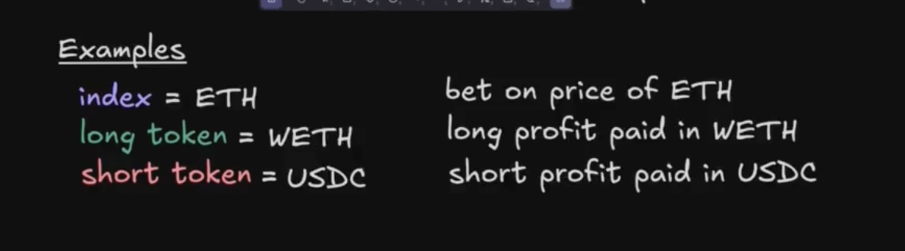

Типы маркетов:
- full backed => index = long token && short token = stablecoin (полностью обеспеченный)
- synthetic => index != long token

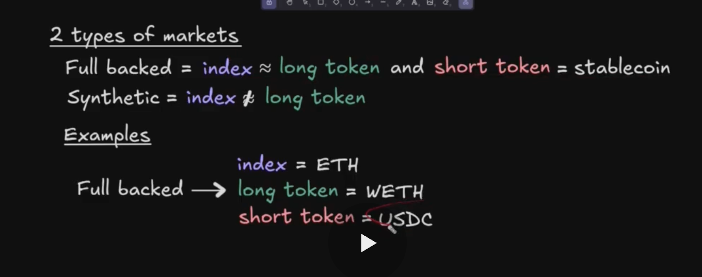

### Liquidity provider

Поставщики ликвидности кто депозитит long и short токены в маркет. Поставщики зарабатывают на комиссиях.

LP в плюсе, когда трейдеры проигрывают
   в минусе, когда трейдеры выигрывают.

### Position size formulas

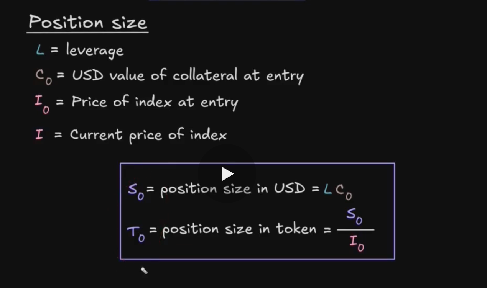

### Profit and loss formulas

См. "Position size formulas "
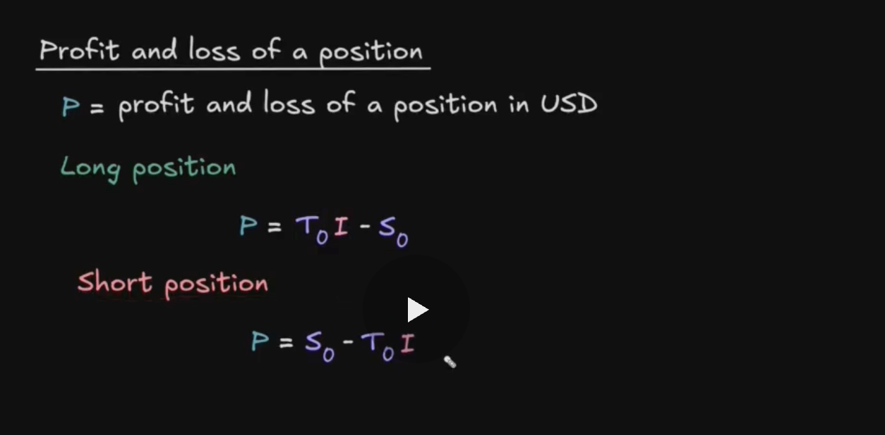

Examples
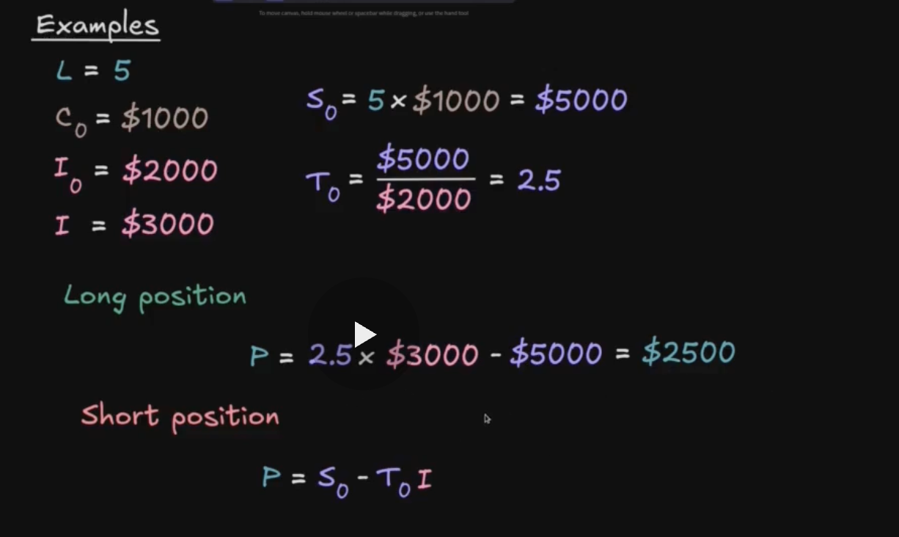

Взято отсюда https://updraft.cyfrin.io/courses/gmx-perpetuals-trading/foundation/position-size

### Ликвидация

Ликвидация - процесс принудительного закрытия позиции, когда collateral не хватает для обеспечения позиции. Collateral используется для погашения потерь пользователя.

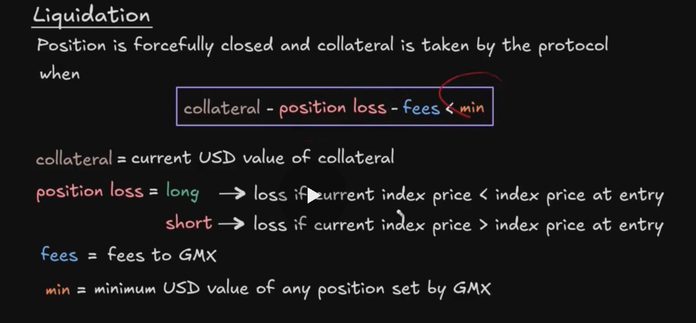

### Open interest

Важный термин помимо position size Open interest.

Есть два вида Open interest:
- long open interest - сумма всех открытых long position size
- short open interest - сумма всех открытых short position size

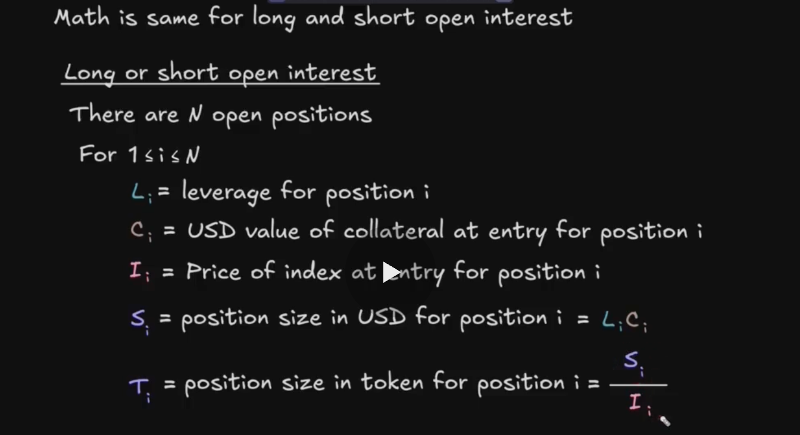
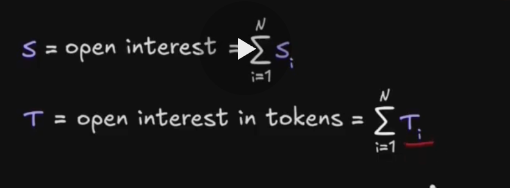

### Funding fees

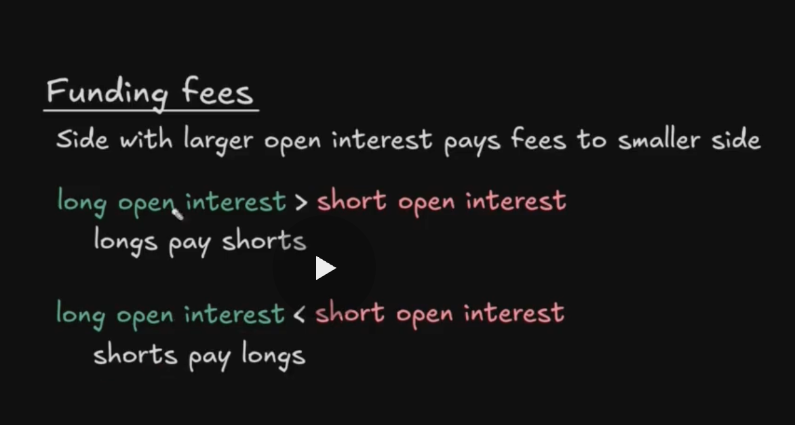

<!-- Важно! -->

P.S. Не уверен, что это прям так.

Прибыль трейдера выплачивается из ликвидности пула GM, тогда как убытки трейдера вычитаются из залога трейдера и фактически остаются в пуле.

