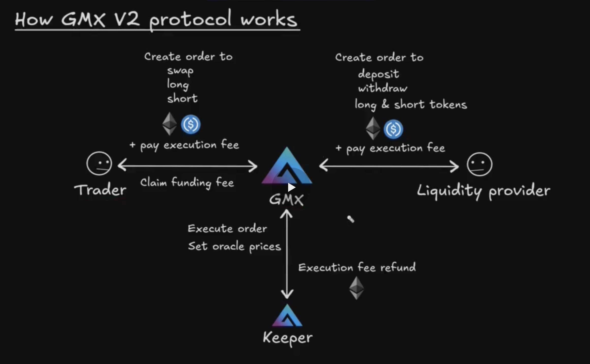
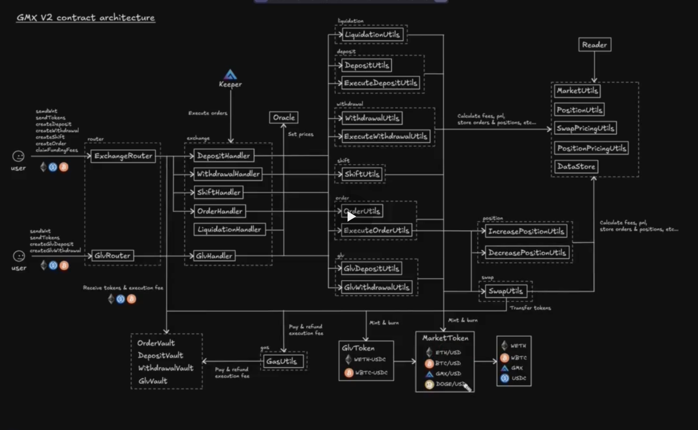

# Section 2. Foundation

## How GMX works



Есть три основных вида пользователей:
- трейдера
- поставщик ликвидности
- keeper

Все действия пользователей выполняются в два этапа. Первый пользователь инициирует действие (например LP делает deposit). вместе с вызовом он указывает "pay execution fee". Это комиссия для keeper, который на втором этапе доставит транзакцию в сеть.

Это нужно для борьбы с MEV.

## Gmx contract architecture



1. Слева контракты точки входа (роутеры).
2. Handler - группа входа для keeper, которые исполняют транзакции.
3. Основная бизнес логика заключается в группе смарт-контрактов Utils.
4. Внизу то, что отвечает за работу с токенами: vaults, MarketsToken.

_Важно_! GLVRouter отвечает за добавление и удаление ликвидности.
За рассчет газа на оплату киперам отвечает контракт GasUtils.


1. Как узнать, какие параметры нужно вставлять в Order.

Самое важное, что некоторые параметры должны быть указаны в нужном decimals. Посмотреть это можно [тут](https://github.com/gmx-io/gmx-synthetics/blob/3b9e1399ecae352814a2602650d21721e1e03693/forked-env-example/contracts/interfaces/IGmxV2.sol#L36C1-L45C6).

```solidity
struct CreateOrderParamsNumbers {
    uint256 sizeDeltaUsd;              // Position size change in USD (scaled by 1e30)
    uint256 initialCollateralDeltaAmount; // Collateral amount in token decimals
    uint256 triggerPrice;              // Trigger price for limit/stop orders (scaled by 1e30)
    uint256 acceptablePrice;           // Max price for longs, min price for shorts (scaled by 1e12)
    uint256 executionFee;              // Fee for keepers in native token
    uint256 callbackGasLimit;          // Gas limit for callback contract
    uint256 minOutputAmount;           // Min output for decrease orders/swaps
    uint256 validFromTime;             // Order valid from timestamp
}
```

Там же есть и подробное описание и по другим параметрам ордера